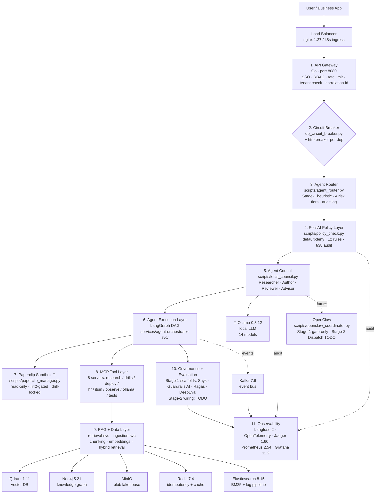

# DocuMind — Advanced-RAG Reference Platform

**A multi-tenant, enterprise-grade document-intelligence platform built as a learnable, extensible reference implementation of every production concern a real RAG system has to solve.**

Upload documents → they get parsed, chunked, embedded, graphed, indexed → users ask natural-language questions → the system retrieves (vector + graph hybrid), reranks, generates an answer with citations, tracks cost, evaluates quality, enforces policy, and logs everything for audit.

> 📖 **Design spec:** [`docs/superpowers/specs/2026-04-23-documind-system-design.md`](docs/superpowers/specs/2026-04-23-documind-system-design.md) — 67 design areas, ten services, 2,400+ lines of reasoning.

---

## Snapshot (2026-05-03, MDT — Linux x86_64 dev host)

**This session adds**: PolisAI Stage-1 policy engine · Paperclip Stage-1 sandbox aggregator · 11-layer architecture doc · Ollama × PolisAI integration (every council call gated) · Frontend page `/admin/paperclip` · scripts/run.sh `paperclip` + `policy` verbs · Apply-rate empirical finding · **Tier 1.3.b: git-apply-check pre-flight inside AUTHOR retry loop (closes 5/8 of historical apply failures)**.

### Code metrics

| Metric | Value | How verified |
| --- | --- | --- |
| Python LOC (services + libs) | **22,453** | `find services libs -name '*.py' \| xargs wc -l` |
| TypeScript LOC (frontend) | **56,621** | `find services/frontend -name '*.ts' -o -name '*.tsx' \| xargs wc -l` |
| Go LOC (api-gateway + identity-svc + others) | **1,527** | `find services -name '*.go' \| xargs wc -l` |
| **Drills** (regression contracts) | **297** | `ls mcp/tests/drill_*.py \| wc -l` |
| **ADRs** (architectural decisions) | **23** | `ls docs/architecture/adr/*.md \| wc -l` |
| **Runbooks** (operator paths) | **17** | `ls docs/runbooks/*.md \| wc -l` |
| **Deep-dive pages** (`/admin/*/deep`) | **45** | `find services/frontend/app/admin -name page.tsx -path '*/deep/*' \| wc -l` |
| Commits this session (after `37a802c`) | **24** | `git log --oneline 37a802c..HEAD \| wc -l` |

### Trust signals — run these to verify

```bash
bash scripts/verify-stack.sh                  # 35-component health check
bash scripts/load-test.sh smoke               # 15s k6 sanity (proven: 195 req/s, p95 < 50ms at 100 VU)
.venv/bin/ruff check libs/py services         # 0 errors (CI hard-gated)
.venv/bin/mypy --ignore-missing-imports libs/py/documind_core   # 0 errors (CI hard-gated)
python3 scripts/run_drills.py --parallel 4    # entire drill catalog
```

### Where to look

| Need | File |
| --- | --- |
| What's actually shipped | [`docs/STATUS.md`](docs/STATUS.md) |
| Gap to top-1% / state-of-art | [`docs/MISSING.md`](docs/MISSING.md) |
| How to trust each component | [`docs/runbooks/component-trust.md`](docs/runbooks/component-trust.md) |
| Real benchmark numbers | [`docs/benchmarks/`](docs/benchmarks/) |
| Architecture (4 C4 levels) | [`docs/architecture/C4-{context,container,component,agentic}.md`](docs/architecture/) |
| Why a design choice was made | [`docs/architecture/adr/`](docs/architecture/adr/) (23 ADRs) |
| Dev workflow rules | [`~/.claude/CLAUDE.md`](https://github.com/PraveenAsthana123/circuitRAG) (50+ policy sections) |
| Live agent state | `/admin/local-models` + `/admin/simulation` |
| 5-phase load test plan | [`infra/load-test/README.md`](infra/load-test/README.md) |

### Standards adhered (verified, not aspirational)

| Standard | Compliance |
| --- | --- |
| **PEP 8** | enforced via ruff + black + pycodestyle hard-gated in CI; 0 violations |
| **TDD-style drill discipline** | every commit ships a drill (§43); 204 drills with NEGATIVE markers |
| **BDD** | partial — STAR-format stories in deep-dive pages; no formal `behave`/Cucumber framework |
| **MDD** (model-driven) | partial — generated OpenAPI from FastAPI; no MDA tooling |
| **Twelve-Factor App + 17-factor (extended)** | per global §47.9; documented compliance |
| **NIST AI RMF** (Govern + Map + Measure + Manage) | per global §38 + §48; audit row + decision logging |
| **OWASP Top 10 + AI extensions** (A11 prompt-injection, A12 insecure output, A14 model theft, A15 excessive agency) | per global §47.6; bandit hard-gated; ADR-006 JWT validation |
| **SOC 2** (CC6.1 access, CC6.2 secrets, CC7.2 anomaly, CC8.1 change) | per global §47.6; audit_log_partitioned + correlation_id propagation |
| **Backward + forward compat** (per global §28) | policy documented; contract tests partial — `Pact` not yet wired |
| **HLD/LLD/SAD/ADR templates** | per global §47; HLD-documind.md + LLD-documind-by-tool-and-component.md present; ADR catalog covers 23 decisions |

### What this is and isn't

- ✅ **Documented exhaustively** — 45 deep-dive pages, 23 ADRs, 17 runbooks, 4 C4 levels
- ✅ **Drill-locked** — every claim above has a drill that fires on regression
- ✅ **Governance-strong** — §38 audit row + §50.5 safety gates + ratchet pattern
- ✅ **CI-hard-gated** — ruff + mypy + bandit + pytest + go vet/test, all blocking
- ⚠ **NOT top 1%** — see `docs/MISSING.md` for honest gap to state-of-art (vLLM, Ragas, Guardrails AI, NeMo Guardrails, MLflow, EvidentlyAI, Giskard not yet integrated)
- ⚠ **NOT production-deployed** — minikube + Istio scripts shipped but operator runs; no k8s prod manifests yet

---

## Why this exists

Most RAG tutorials stop at *"embed docs → query vector DB → prompt LLM."* That's a toy.

A production RAG system has to answer questions like:

- How do we isolate **tenants** so tenant A never sees tenant B's data — in Postgres, in the vector DB, in the graph DB, in the cache, and in the logs?
- What happens when **Ollama dies mid-request** — does the whole system cascade, or does one service fail in isolation?
- How do we **version prompts** like code, so a quality regression is traceable to a specific commit?
- How do we detect when **retrieval quality drifts** and which component (embedding model? reranker? chunking?) caused it?
- How do we **compensate** when step 3 of a 5-step ingestion pipeline fails after step 2 already wrote to Qdrant?
- How do we **budget and bill** per-tenant LLM spend, with shadow-pricing for local Ollama?

DocuMind answers all of these — 67 design areas in total, each implemented as real classes with real tests, not just hand-wavy documentation.

---

## Architecture at a glance — the 11-layer stack

The full request path with every cross-cutting concern (load balancing, gateway, circuit breakers, policy, council, sandbox, observability):



### Tool inventory (52 components)

| Layer | Component | Tier-1 status | Notes |
|-------|-----------|---------------|-------|
| **Load Balancer** | nginx 1.27 | ✅ shipped | docker-compose.yml |
| **Load Balancer** | k8s ingress / Istio | ❌ TODO | requires k8s migration |
| **API Gateway** | Go gateway (port 8080) | ✅ shipped | services/api-gateway/ |
| **API Gateway** | gRPC service-to-service | ⚠️ partial | docs reference gRPC; protos not codegen'd yet |
| **Auth** | JWT + RBAC + tenant check | ✅ shipped | services/identity-svc/ |
| **Rate Limiting** | Per-IP + per-tenant | ✅ shipped | api-gateway middleware |
| **Circuit Breaker** | DB + HTTP breakers | ✅ shipped | db_circuit_breaker.py + agent_orchestrator-svc/app/ |
| **Policy / PolisAI** | Stage-1 policy_check.py | ✅ shipped | 12 rules · default-deny · audit log |
| **Policy / PolisAI** | Stage-2 OPA + Rego | ⚠️ TODO | Tier 6 #6.1 |
| **Agent Router** | Intent + Risk classifier (heuristic) | ✅ Stage-1 | scripts/agent_router.py · 12 patterns · conservative default |
| **Agent Router** | Ollama-backed classifier | ⚠️ TODO Stage-2 | swap heuristic body for qwen2.5 call |
| **Agent Council** | Local council 4-role | ✅ shipped | scripts/local_council.py |
| **Agent Council** | 5-role rename (Planner/Retriever/Risk/Evaluator/Writer) | ⚠️ TODO | aliasing layer |
| **Execution / LangGraph** | LangGraph 1.1.10 DAG | ✅ shipped | langgraph_flow.py |
| **Paperclip Sandbox** | Stage-1 read-only aggregator | ✅ shipped | scripts/paperclip_manager.py |
| **Paperclip Sandbox** | Stage-2 propose-only loop | ⚠️ TODO | |
| **Paperclip Sandbox** | Stage-3 Goal→Plan→Execute→Evaluate→Improve | ⚠️ TODO | |
| **OpenClaw A2A** | Stage-1 gate + envelope contract | ✅ Stage-1 | scripts/openclaw_coordinator.py · 6 agents · default-deny |
| **OpenClaw A2A** | Stage-2 Dispatch RPC + circuit breaker | ⚠️ TODO Stage-2 | proto comment-only; needs PolisAI rules |
| **MCP Tool Layer** | 8 MCP servers | ✅ shipped | mcp/server_*.py |
| **MCP Tool Layer** | mcp/server_paperclip.py | ⚠️ TODO | next iteration |
| **Local LLM** | Ollama 0.3.12 | ✅ shipped | 14 models installed |
| **Council models** | qwen2.5 / deepseek-coder / codegemma / codellama | ✅ shipped | researcher / author / reviewer / advisor |
| **Tier-B Fallback** | Claude CLI / Codex CLI | ✅ shipped | scripts/tier_b_fallback.py |
| **RAG / Chunking** | Recursive token chunking | ✅ shipped | ingestion-svc · 256-1024 tokens · 10-20% overlap |
| **RAG / Embedding** | tiktoken + ollama embeddings | ✅ shipped | versioned per §39.2 |
| **RAG / Vector DB** | Qdrant 1.11 | ✅ shipped | tenant-isolated namespaces |
| **RAG / Graph DB** | Neo4j 5.21 | ✅ shipped | knowledge graph |
| **RAG / Lakehouse** | MinIO 2024.10 | ✅ shipped | raw doc blobs |
| **RAG / BM25** | rank_bm25 0.2.2 | ✅ shipped | hybrid retrieval |
| **RAG / Reranker** | scikit-learn cross-encoder | ✅ shipped | classical |
| **RAG / Vectorless option** | Graph-only retrieval | ⚠️ TODO | feature flag missing |
| **Cache** | Redis 7.4 (idempotency + rate-limit + LLM cache) | ✅ shipped | docker-compose.yml |
| **Event Bus** | Kafka 7.6 + Zookeeper | ✅ shipped | docker-compose.yml |
| **Event Bus** | aiokafka producer/consumer wiring | ⚠️ partial | infra up; some services not yet publishing |
| **Search** | Elasticsearch 8.15 | ✅ shipped | docker-compose.yml |
| **Search** | Kibana 8.15 | ✅ shipped | log + search UI |
| **Search** | Filebeat → ES | ✅ shipped | log pipeline |
| **Service Mesh** | Istio | ❌ TODO | requires k8s |
| **Service Mesh** | Kiali 1.86 (mesh viz) | ✅ shipped | docker-compose.yml |
| **Eval / Guardrails AI** | Output filtering + jailbreak defense | ⚠️ Stage-1 scaffold | services/evaluation-svc/app/eval_harness.py — fail-open until deps installed |
| **Eval / Ragas** | RAG-specific eval (faithfulness, relevance) | ⚠️ Stage-1 scaffold | requirements.txt + scaffold; Stage-2 wires real calls |
| **Eval / Giskard** | LLM red-team + bias scan | ❌ TODO | |
| **Eval / Lakera + Rebuff** | Prompt-injection defense | ❌ TODO | |
| **Eval / DeepEval** | Alternative RAG eval | ❌ TODO | |
| **Security / Snyk** | Dep vulnerability scan | ⚠️ Stage-1 scaffold | .snyk + .github/workflows/snyk.yml shipped; needs SNYK_TOKEN secret |
| **Security / Bandit** | Python static security | ✅ shipped | issue_scanner.py |
| **Security / pip-audit** | Python dep audit | ⚠️ partial | not in CI yet |
| **LLM Observability / Langfuse** | Prompt/cost tracking | ✅ shipped | docker-compose.yml |
| **Tracing / Jaeger** | Distributed traces | ✅ shipped | docker-compose.yml |
| **Tracing / OpenTelemetry** | OTel collector + SDK | ✅ shipped | docker-compose.yml |
| **Metrics / Prometheus** | Time-series metrics | ✅ shipped | + Alertmanager + node-exporter |
| **Dashboards / Grafana** | Viz | ✅ shipped | docker-compose.yml |
| **MLflow** | (alt to Langfuse for ML obs) | ❌ deliberate | Langfuse covers LLM obs |

**Totals: 54 components · 34 ✅ shipped · 11 ⚠️ Stage-1 scaffold · 9 ❌ TODO**

### Architectural invariants (drill-locked)

1. **PolisAI fires BEFORE agent execution** — every Ollama call goes through `policy_check.evaluate()` first. Drill: [`drill_council_polisai_gate.py`](mcp/tests/drill_council_polisai_gate.py) (8 steps, 4 negative).
2. **Paperclip is sandbox-only** — no write methods, no outbound HTTP, write verbs refused with §42 citation. Drill: [`drill_paperclip_stage1.py`](mcp/tests/drill_paperclip_stage1.py) (8 steps, 6 negative).
3. **Schema-as-contract includes git-apply-check** — Tier 1.3.b: every accepted CouncilProposal must pass `git apply --check` BEFORE acceptance. Drill: [`drill_apply_check_preflight.py`](mcp/tests/drill_apply_check_preflight.py) (8 steps, 5 negative).
4. **Default-deny policy** — any (actor, tool) not matched by an explicit allow rule is denied + audited. Drill: [`drill_policy_engine.py`](mcp/tests/drill_policy_engine.py) (8 steps, 4 negative).
5. **§42 boundary** — destructive ops (force-push, hard reset, branch -D) and `git push` without `--confirm` are gated. Drill: [`drill_run_sh.py`](mcp/tests/drill_run_sh.py) (8 steps, 6 negative).

### Composes with policies

[§38 governance](CLAUDE.md#38) · [§42 autonomy](CLAUDE.md#42) · [§43 drill](CLAUDE.md#43) · [§47 architecture](CLAUDE.md#47) · [§48.4 audit row](CLAUDE.md#48) · [§50 issue dispatcher](CLAUDE.md#50) · [§52 brutal review](CLAUDE.md#52) · [§55.3 outcome contract](CLAUDE.md#55) · [ADR-012 orchestration](docs/architecture/adr/012-orchestration-layer-local-first.md) · [Full architecture doc](docs/architecture/full-stack-architecture.md)

See also: [`docs/architecture/C4-container.md`](docs/architecture/C4-container.md) for the full C4 container view, [`docs/design-areas/`](docs/design-areas/) for per-area deep-dives.

---

## Current architecture status

The diagram above is the **reference architecture**. The repo today is a
mix of:

- fully runnable local infrastructure
- partially wired service/runtime surfaces
- documented target-state components that are present as manifests/specs
  but not yet the default local execution path

Use this table as the honest current-state view.

| Capability | Current state | Where it lives | Practical status |
|---|---|---|---|
| Load balancer / edge | Configured | `infra/nginx/nginx.conf`, `docker-compose.yml` | Present, but local dev commonly runs frontend/gateway directly and nginx is disabled in override until TLS material is set up |
| API gateway | Intended + partially represented | `services/api-gateway/`, docs, route model in frontend/API assumptions | Architectural first-class component, but local operator/admin work today is more visible through direct service/frontend surfaces than a full gateway-centered runtime |
| Service mesh | Manifested, not default local runtime | `infra/istio/`, `docs/scenarios/phase-01-edge-traffic-security.md` | Istio/Kiali are part of target deployment shape; mesh-up is a deployment decision, not the default local dev path |
| Kafka | Running locally | `docker-compose.yml`, `docker-compose.override.yml`, `libs/py/documind_core/kafka_client.py` | Configured and active in local infra; event architecture is documented and the broker is part of the compose stack |
| gRPC | Contract strategy more than dominant runtime | `proto/`, `README` repo layout, `docs/architecture/repo-grpc-and-microservice-architecture.md` | Strongly intended for internal service contracts, but the most visible runnable paths in this repo are still REST/frontend/admin oriented |
| Observability stack | Running locally | Prometheus/Alertmanager/Grafana/Jaeger/OTel plus node-exporter/cAdvisor in `docker-compose.yml`, files under `infra/observability/` | Real local stack exists; datasources and dashboards are provisioned, local alert routing exists, and host/container metrics are wired |
| Agent council / sidecar advisor | Running in repo-local workflows | `services/sidecar-advisor/`, `.loop/`, `/admin/sidecar*` | Real and active; commit-time council, telemetry, ratings, drill-down, and monitoring surfaces exist |
| Agentic orchestrator | Running as a repo service | `services/agent-orchestrator-svc/`, `/admin/agentic*` | Real local service with projects/tasks/approvals/memory/control-plane surfaces |

### What is actually live on a typical local machine

From the repo as currently wired:

- **Local infra via Compose:** Postgres, Redis, Kafka, MinIO, Qdrant, Neo4j, Ollama, OTel collector, Prometheus, Alertmanager, Grafana, Jaeger, node-exporter, cAdvisor, ELK, Kiali
- **Local operator UIs:** `/admin`, `/admin/monitoring`, `/admin/sidecar`, `/admin/sidecar/telemetry`, `/admin/forensics`, `/admin/agentic/control-plane`, `/admin/techstack`
- **Runtime status surface:** `/app-meta/runtime-status`
- **Build identity surface:** `/app-meta/build-info`

### Where to check the truth at runtime

If you want current runtime truth instead of target-state architecture:

- **Monitoring + service/runtime view:** `/admin/monitoring`
- **Operator dashboard:** `/admin`
- **Agent council telemetry:** `/admin/sidecar/telemetry`
- **Agentic projects/tasks/approvals/memory:** `/admin/agentic/control-plane`
- **Loop/health one-shot CLI:** `python3 scripts/loop_status.py`

This distinction matters: several platform components are **correctly modeled
and partially configured**, but not every one of them is equally mature as a
day-to-day local runtime surface.

---

## Quickstart (Docker Compose, ~5 min)

**Prereqs:** Docker 20+, Docker Compose v2+, Python 3.11+, Go 1.21+, Node 20+ (for frontend).

```bash
# 1. Configure
cp .env.template .env
# Edit .env — at minimum, set DOCUMIND_ENCRYPTION_KEY (the template tells you how)

# 2. Bring up data stores + Ollama
make data-up
make ollama-pull          # pulls llama3.1:8b + nomic-embed-text (~5GB first time)

# 3. Run migrations
make migrate

# 4. Seed a demo tenant with sample PDFs
make seed

# 5. Start every service natively (5 terminals, or tmux)
make run-gateway          # terminal 1 — Go
make run-identity         # terminal 2 — Go
make run-ingestion        # terminal 3 — Python
make run-retrieval        # terminal 4 — Python
make run-inference        # terminal 5 — Python
make run-frontend         # terminal 6 — Next.js

# 6. Open http://localhost:3000
#    login:   demo@tenant-a.local / demo
#    upload:  a PDF (or use the seeded ones)
#    ask:     "What does this document say about X?"
```

Run a full end-to-end smoke test without the UI:

```bash
make smoke
```

---

## Repository layout

```
documind/
├── proto/              # gRPC service contracts (source of truth)
├── schemas/events/     # CloudEvents JSON Schemas (Kafka contract)
├── libs/
│   ├── py/             # Shared Python lib: config, exceptions, middleware, OTel, circuit breaker …
│   └── go/             # Shared Go lib: equivalents for Go services
├── services/
│   ├── api-gateway/    # Go  — edge, routing, auth
│   ├── identity-svc/   # Go  — tenants, users, JWT, RBAC
│   ├── ingestion-svc/  # Py  — parse, chunk, embed, graph, index (saga-orchestrated)
│   ├── retrieval-svc/  # Py  — hybrid vector+graph search, reranking, cache
│   ├── inference-svc/  # Py  — prompt construction, Ollama, guardrails, streaming
│   ├── evaluation-svc/ # Py  — offline/online eval, regression gate, RAGAS metrics
│   ├── governance-svc/ # Go  — policy-as-code (CEL), HITL queue, audit log, feature flags
│   ├── finops-svc/     # Go  — token count, cost attribution, budgets
│   ├── observability-svc/ # Go — Prom aggregation, SLO tracking, alerts
│   └── frontend/       # Next.js 14 (App Router) + vanilla CSS
├── infra/
│   ├── kind/           # Kind cluster config
│   ├── istio/          # Service mesh manifests (VirtualService, DestinationRule, AuthorizationPolicy …)
│   └── k8s/            # Deployment/Service/HPA/NetworkPolicy per service
├── scripts/            # Migration runner, seed, smoke test, eval, chaos, proto gen
├── docs/
│   ├── architecture/   # C4 diagrams + ADRs
│   ├── design-areas/   # One doc per area (01-67 + extras), maps concept → code
│   ├── learning/       # Teaching narratives linking multiple areas
│   ├── usage/          # How to use each service + API examples
│   └── runbooks/       # DR, incident response
└── docker-compose.yml  # Dev-mode data stores + Ollama
```

---

## The 67 design areas — quick index

| Range | Theme                        | Primary services                    |
|-------|------------------------------|-------------------------------------|
| 1–8   | Boundaries + planes          | api-gateway, identity, governance   |
| 9–11  | State models                 | cross-cutting                        |
| 12–16 | Consistency + paths + sync   | retrieval, ingestion, eval          |
| 17–20 | Events, sagas, idempotency   | ingestion, all Kafka consumers      |
| 21–29 | Service decomposition        | every service                       |
| 30–33 | Contracts (API, events, prompts, output) | cross-cutting            |
| 34–39 | Retrieval + knowledge lifecycle | ingestion, retrieval             |
| 40–42 | Cache architecture           | retrieval, redis-backed helpers     |
| 43–45 | Capacity, queues, backpressure | observability, kafka consumers    |
| 46–48 | DB strategies (SQL/vector/graph) | ingestion, retrieval            |
| 49–55 | HA, DR, multi-region, blast radius, release/rollback, flags | infra, governance |
| 56–58 | Policy-as-code, HITL, feedback | governance, inference             |
| 59–61 | Eval (offline, online, gates) | evaluation-svc                     |
| 62–64 | Observability, audit, SLOs   | observability, governance          |
| 65–67 | Design-for-change, debuggability, socio-technical | cross-cutting, docs |
| Extras| MCP, Circuit Breaker, Istio  | frontend/admin, libs, infra        |

Every area has:

1. A **design-area doc** (`docs/design-areas/NN-<slug>.md`) explaining the concept + trade-offs.
2. A **code pointer** to the class(es) implementing it.
3. A **test** proving the implementation works.
4. An **interview talking point** (one-line summary).

---

## Development workflow

```bash
make help              # list every make target
make lint              # ruff + black + mypy + gofmt + go vet + eslint
make test              # pytest + go test + vitest
make eval              # run offline eval suite (precision@k, faithfulness …)
make regression        # compare current eval against baseline — blocks merge on regression
make chaos             # inject faults (kill Ollama, slow Qdrant) — verify resilience
```

**Pre-commit:** install hooks with `pre-commit install`. Prevents secrets, enforces formatting, runs mypy on staged files.

---

## Testing and verification

DocuMind should be verified as a distributed system, not just as a set of libraries.
That means testing needs to cover:

- code quality gates
- unit and integration tests
- frontend behavior
- API and routing errors
- degraded and replay flows
- resilience and chaos behavior
- evaluation and regression safety

### CI surfaces already wired

The repo already runs several useful checks in CI:

- Python linting and hygiene: `ruff`, `black --check`, `pycodestyle`
- Python security checks: `bandit`, `pip-audit`
- Python tests: `pytest` on the shared library
- Go verification: `go vet`, `go build`, `go test -race`
- frontend build verification
- Docker image builds
- Kubernetes and YAML validation

See:

- [`.github/workflows/ci.yml`](.github/workflows/ci.yml)

### Local test commands

```bash
# repo-level quality gates
make lint
make test

# shared Python library tests
pytest -q libs/py/tests --cov=libs/py/documind_core --cov-report=term-missing

# frontend
cd services/frontend
npm run test
npm run build
```

### Current service test surfaces

The repo already includes service-level Python test directories:

- `services/ingestion-svc/tests`
- `services/retrieval-svc/tests`
- `services/inference-svc/tests`
- `services/evaluation-svc/tests`

Go services are exercised through `go test -race ./...` in CI.

### What to test beyond the happy path

The highest-value tests in this repo are not only “returns 200”.
You should explicitly exercise:

- invalid payloads and stable error envelopes
- gateway and routing mistakes
- frontend failed-request UX
- breaker-open behavior
- MCP degraded draft creation
- replay after recovery
- scope-denied tool calls
- audit truthfulness
- retrieval and prompt regressions

Useful deeper docs:

- [`docs/learning/testing-and-error-debugging-map.md`](docs/learning/testing-and-error-debugging-map.md)
- [`docs/scenarios/deep-testing-checklist.md`](docs/scenarios/deep-testing-checklist.md)
- [`docs/architecture/repo-deep-test-plan.md`](docs/architecture/repo-deep-test-plan.md)

---

## Performance, load, and capacity testing

Correctness alone is not enough for a system like this.
Performance trust means being able to explain and measure:

- latency
- throughput
- degraded-mode behavior under load
- replay backlog and recovery
- retrieval cost and performance trade-offs
- capacity per service and dependency

### What to measure

At minimum, benchmark:

- request latency: p50, p95, p99
- request throughput
- error rate
- timeout rate
- breaker-open rate
- MCP degraded draft rate
- replay success rate and replay lag
- retrieval latency
- token and model cost per request
- queue or backlog age

### Useful load-testing targets

Good load tests for this repo include:

- API gateway request bursts
- retrieval-svc search concurrency
- inference-svc answer latency under concurrent load
- MCP tool-call success vs degraded behavior during outages
- replay-worker backlog drain after recovery
- frontend critical-page behavior when APIs are slow or failing

### Capacity planning guidance

Capacity should be treated as a first-class design area.
Important planning axes include:

- API requests per second
- retrieval QPS
- inference concurrency
- embedding throughput
- vector and graph storage growth
- Redis cache size and hit ratio
- draft backlog size and replay throughput

Useful supporting docs:

- [`docs/scenarios/phase-23-capacity.md`](docs/scenarios/phase-23-capacity.md)
- [`docs/architecture/ai-platform-execution-planning.md`](docs/architecture/ai-platform-execution-planning.md)
- [`docs/architecture/production-trust-quality-and-readiness.md`](docs/architecture/production-trust-quality-and-readiness.md)

### Current state

The repo includes capacity and observability design, but it does **not** yet claim a fully productized load-testing suite.

If you want stronger production confidence, add:

- repeatable `k6` or `Locust` scripts under `scripts/load/`
- benchmark baselines for major request paths
- per-service SLO targets
- dashboards for latency, backlog, breaker state, and replay health

---

## Monitoring and production-readiness signals

DocuMind is designed to be observable.
To judge whether it is ready for production-like use, monitor:

- request rate, latency, and error rate
- breaker state and transitions
- MCP tool outcomes by namespace and tool
- draft creation, replay, and rejection counts
- audit write failures
- denial rates
- retrieval quality and evaluation trends
- cost and token usage

Useful supporting docs:

- [`docs/architecture/ai-system-quality-observability-and-control-layer.md`](docs/architecture/ai-system-quality-observability-and-control-layer.md)
- [`docs/architecture/ai-quality-tool-decision-matrix.md`](docs/architecture/ai-quality-tool-decision-matrix.md)
- [`docs/architecture/mcp-agent-architecture-and-monitoring.md`](docs/architecture/mcp-agent-architecture-and-monitoring.md)
- [`docs/architecture/production-trust-quality-and-readiness.md`](docs/architecture/production-trust-quality-and-readiness.md)

---

## README honesty: what this repo is and is not

DocuMind is strong as:

- a reference implementation
- a systems-design learning repo
- a serious architecture portfolio project
- a base for real internal builds

DocuMind is **not** yet presented as:

- a turnkey SaaS product
- a fully benchmarked production deployment
- a finished operator platform with every dashboard and runbook completed

That distinction matters.
The repo is best read as:

- implemented production concerns
- plus documented next-step hardening

instead of:

- “everything is already finished”

---

## Where to start reading the codebase

If you want to understand the architecture by reading code, follow this order — each file gives you ~80% of the next one's context:

1. [`libs/py/documind_core/config.py`](libs/py/documind_core/config.py) — Pydantic Settings foundation; every service inherits from this.
2. [`libs/py/documind_core/exceptions.py`](libs/py/documind_core/exceptions.py) — Domain-exception hierarchy; never raise `HTTPException` from a service.
3. [`libs/py/documind_core/middleware.py`](libs/py/documind_core/middleware.py) — Correlation-ID, security headers, rate limiting.
4. [`libs/py/documind_core/circuit_breaker.py`](libs/py/documind_core/circuit_breaker.py) — The CLOSED/HALF_OPEN/OPEN state machine that protects every external call.
5. [`services/ingestion-svc/app/saga/document_saga.py`](services/ingestion-svc/app/saga/document_saga.py) — The orchestrator saga pattern with compensating actions.
6. [`services/retrieval-svc/app/services/hybrid_retriever.py`](services/retrieval-svc/app/services/hybrid_retriever.py) — Vector + graph retrieval fused with reciprocal-rank fusion.
7. [`services/inference-svc/app/services/rag_inference.py`](services/inference-svc/app/services/rag_inference.py) — Prompt construction + Ollama + guardrails, wrapped in a circuit breaker.
8. [`services/evaluation-svc/app/metrics/ragas_metrics.py`](services/evaluation-svc/app/metrics/ragas_metrics.py) — Faithfulness, context precision/recall, answer relevance.

For each class, the docstring links back to the relevant design-area doc.

---

## Troubleshooting

| Symptom                                    | Likely cause                       | Fix                                                      |
|--------------------------------------------|------------------------------------|----------------------------------------------------------|
| `make data-up` fails on port 5432          | Local Postgres already running     | Stop it: `sudo systemctl stop postgresql`                |
| `make ollama-pull` slow                    | 5GB+ model download                 | Expected. Runs once; cached afterwards                   |
| Service logs show `CircuitOpenError`       | Ollama is down or overloaded       | `make data-logs` → check Ollama; circuit auto-recovers   |
| Retrieval returns empty                    | Collection not indexed yet         | Check ingestion logs; saga state in `ingestion.sagas`    |
| 429 on every request                       | Rate limit too tight for dev       | Raise `DOCUMIND_RATE_LIMIT_*` vars in `.env`             |

---

## License + status

MIT. Status: reference implementation, not a production-deployed product. Intended for learning, interview preparation, portfolio demonstration, and as the *shape* for real builds.

*Generated following the DocuMind 12-week phased build plan — see [`docs/superpowers/specs/2026-04-23-documind-system-design.md` §7](docs/superpowers/specs/2026-04-23-documind-system-design.md).*
