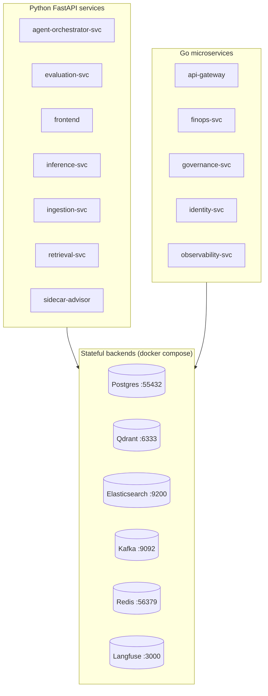
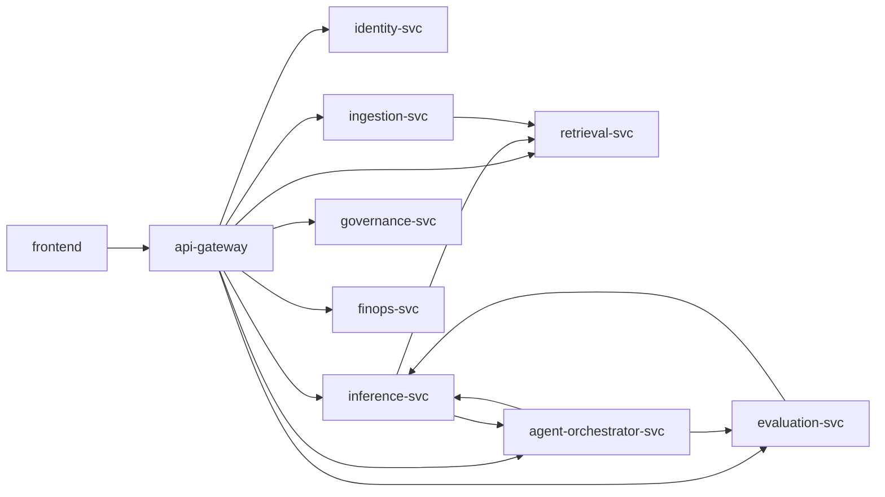

# 🔵 circuitRAG — Enterprise RAG Platform

> **Branch:** `main`  ·  **Commits:** 807  ·  **Generated:** 2026-05-16 20:31 UTC

> An end-to-end retrieval-augmented-generation (RAG) platform built around production-grade controls: governance, observability, tenant-isolation, MCP tooling, multi-model routing, decision-audit, and a brutal-tool-review backlog driven by drilled invariants.

This **project-level README** is auto-generated. Each folder also has its own [`README.md`](#folder-readmes) (also auto-generated) with file inventory, C4 diagrams, sequence diagrams, IPO tables, and a 20-section production-review checklist. Both generators are version-controlled at [`scripts/generate_project_readme.py`](scripts/generate_project_readme.py) and [`scripts/generate_folder_report.py`](scripts/generate_folder_report.py).

---

## ⚡ Quick start

```bash
# 1. Clone + cd in
git clone <repo-url> && cd rag

# 2. Bring up the docker stack (postgres / qdrant / kafka / langfuse / etc.)
docker compose -f infra/docker-compose.yml up -d

# 3. Activate Python venv
source .venv/bin/activate

# 4. Boot host-side FastAPI services
bash scripts/start-host-services.sh

# 5. Boot Go services (built into .tools/bin per §50.5)
bash scripts/start-go-services.sh

# 6. Boot frontend
cd services/frontend && npm run dev

# 7. Verify everything
python3 scripts/advanced_healthcheck.py
bash scripts/circuitrag-status.sh
```

After step 7 you should see ~47 green / ~3 yellow / 0 red probes across the seven layers (app / db / infra / proc / log / obs / mesh).


## 🏛 Architecture — C4 Model

### Level 1 — System Context


### Level 2 — Container



### Level 3 — Repo layout

```
rag/
├── services/                Application services (Python + Go + Next.js)
│   ├── inference-svc/       RAG inference + LLM routing (FastAPI)
│   ├── retrieval-svc/       Retrieval / reranking (FastAPI)
│   ├── ingestion-svc/       Document ingestion + chunking + embedding
│   ├── agent-orchestrator-svc/  Multi-agent orchestration (LangGraph)
│   ├── evaluation-svc/      Eval + drift + fairness (Ragas / DeepEval)
│   ├── api-gateway/         Edge gateway (Go)
│   ├── identity-svc/        Auth + RBAC (Go)
│   ├── governance-svc/      Policy / compliance (Go)
│   ├── finops-svc/          Cost / budget (Go)
│   ├── observability-svc/   Metrics aggregator (Go)
│   └── frontend/            Web UI (Next.js)
├── libs/py/                 Shared Python libraries
├── mcp/                     MCP servers (drill / namespace tools)
├── scripts/                 CLI tooling (healthcheck / drills / status)
├── infra/                   Docker compose / Helm / Prometheus / Grafana
├── ops/                     Operations + runbooks
├── docs/                    Architecture, ADRs, policies
└── tests/                   Top-level integration tests
```


## 🧩 Services

All application services. Click any path to browse; click README to read the auto-generated 20-section deep dive for that folder.

| Path | Role | Purpose | LOC | README | Endpoints | Tests | Docker |
|---|---|---|---|---| --- | --- | --- |
| [`services/agent-orchestrator-svc/`](services/agent-orchestrator-svc/) | Python FastAPI service | Agent orchestrator FastAPI service. | 5,759 | [`services/agent-orchestrator-svc/README.md`](services/agent-orchestrator-svc/README.md) | 20 | 1 | 🐳 |
| [`services/api-gateway/`](services/api-gateway/) | Go microservice | Command api-gateway is the DocuMind edge service. | 738 | [`services/api-gateway/README.md`](services/api-gateway/README.md) | 0 | 1 | 🐳 |
| [`services/evaluation-svc/`](services/evaluation-svc/) | Python FastAPI service | Evaluation service (Design Areas 26, 59, 60, 61). | 1,109 | [`services/evaluation-svc/README.md`](services/evaluation-svc/README.md) | 5 | 0 | 🐳 |
| [`services/finops-svc/`](services/finops-svc/) | Go microservice | finops-svc — token counting, per-tenant cost attribution, budgets. | 133 | _(no README yet)_ | 0 | 1 | 🐳 |
| [`services/frontend/`](services/frontend/) | Web UI (Next.js) | _no docstring_ | 150,632 | [`services/frontend/README.md`](services/frontend/README.md) | 0 | 0 | 🐳 |
| [`services/governance-svc/`](services/governance-svc/) | Go microservice | governance-svc — policy engine, HITL queue, audit log, feature flags. | 123 | _(no README yet)_ | 0 | 1 | 🐳 |
| [`services/identity-svc/`](services/identity-svc/) | Go microservice | identity-svc — tenants, users, roles, JWT issuance, API keys. | 296 | _(no README yet)_ | 0 | 1 | 🐳 |
| [`services/inference-svc/`](services/inference-svc/) | Python FastAPI service | Inference service FastAPI application. | 5,174 | [`services/inference-svc/README.md`](services/inference-svc/README.md) | 16 | 1 | 🐳 |
| [`services/ingestion-svc/`](services/ingestion-svc/) | Python FastAPI service | Ingestion-service FastAPI application. | 3,323 | [`services/ingestion-svc/README.md`](services/ingestion-svc/README.md) | 8 | 1 | 🐳 |
| [`services/observability-svc/`](services/observability-svc/) | Go microservice | observability-svc — aggregates Prometheus metrics + SLO tracking. | 99 | _(no README yet)_ | 0 | 1 | 🐳 |
| [`services/retrieval-svc/`](services/retrieval-svc/) | Python FastAPI service | Retrieval service FastAPI application. | 3,944 | [`services/retrieval-svc/README.md`](services/retrieval-svc/README.md) | 4 | 0 | 🐳 |
| [`services/sidecar-advisor/`](services/sidecar-advisor/) | Python FastAPI service | Sidecar Advisor — personal AI auditor for prompt + code activity. | 2,685 | [`services/sidecar-advisor/README.md`](services/sidecar-advisor/README.md) | 0 | 1 | 🐳 |


## 📚 Shared Python Libraries (`libs/py/`)

| Path | Role | Purpose | LOC | README |
|---|---|---|---|---|
| [`libs/py/documind_core/`](libs/py/documind_core/) | Shared Python library | documind_core | 8,527 | [`libs/py/documind_core/README.md`](libs/py/documind_core/README.md) |
| [`libs/py/documind_core.egg-info/`](libs/py/documind_core.egg-info/) | Shared Python library | _no docstring_ | 0 | _(no README yet)_ |
| [`libs/py/tests/`](libs/py/tests/) | Shared Python library | _no docstring_ | 3,722 | [`libs/py/tests/README.md`](libs/py/tests/README.md) |


## 🔌 MCP Servers (`mcp/`)

Model-Context-Protocol servers expose drill / namespace / tool catalog operations to agents and operators.

| Path | Role | Purpose | LOC | README |
|---|---|---|---|---|
| [`mcp/`](mcp/) | MCP server | _no docstring_ | 94,705 | [`mcp/README.md`](mcp/README.md) |


## 🛠 Other top-level folders

### 🔧 Scripts

| Path | Role | Purpose | LOC | README |
|---|---|---|---|---|
| [`scripts/`](scripts/) | CLI scripts | _no docstring_ | 42,101 | [`scripts/README.md`](scripts/README.md) |

### 🏗 Infrastructure

| Path | Role | Purpose | LOC | README |
|---|---|---|---|---|
| [`infra/`](infra/) | Infrastructure (compose / Helm / config) | _no docstring_ | 154 | _(no README yet)_ |

### 📖 Documentation

| Path | Role | Purpose | LOC | README |
|---|---|---|---|---|
| [`docs/`](docs/) | Documentation | _no docstring_ | 0 | _(no README yet)_ |

### 🧪 Top-level tests

| Path | Role | Purpose | LOC | README |
|---|---|---|---|---|
| [`tests/`](tests/) | Top-level tests | _no docstring_ | 0 | _(no README yet)_ |


## 🕸 Service Dependency Graph

Generic dependency arrows between top-level services.




## 📑 Folder READMEs

Every folder with Python code has (or can have) an auto-generated advanced README. Regenerate any of them with:

```bash
# Single folder
python3 scripts/generate_folder_report.py --folder services/inference-svc --force

# Whole batch
python3 scripts/generate_folder_report.py --batch services --force
python3 scripts/generate_folder_report.py --batch libs --force
python3 scripts/generate_folder_report.py --batch all --force
```

### Services

- [`services/agent-orchestrator-svc/README.md`](services/agent-orchestrator-svc/README.md) — Python FastAPI service
- [`services/api-gateway/README.md`](services/api-gateway/README.md) — Go microservice
- [`services/evaluation-svc/README.md`](services/evaluation-svc/README.md) — Python FastAPI service
- `services/finops-svc/` — _no README yet (run `python3 scripts/generate_folder_report.py --folder services/finops-svc`)_
- [`services/frontend/README.md`](services/frontend/README.md) — Web UI (Next.js)
- `services/governance-svc/` — _no README yet (run `python3 scripts/generate_folder_report.py --folder services/governance-svc`)_
- `services/identity-svc/` — _no README yet (run `python3 scripts/generate_folder_report.py --folder services/identity-svc`)_
- [`services/inference-svc/README.md`](services/inference-svc/README.md) — Python FastAPI service
- [`services/ingestion-svc/README.md`](services/ingestion-svc/README.md) — Python FastAPI service
- `services/observability-svc/` — _no README yet (run `python3 scripts/generate_folder_report.py --folder services/observability-svc`)_
- [`services/retrieval-svc/README.md`](services/retrieval-svc/README.md) — Python FastAPI service
- [`services/sidecar-advisor/README.md`](services/sidecar-advisor/README.md) — Python FastAPI service

### Libraries

- [`libs/py/documind_core/README.md`](libs/py/documind_core/README.md) — Shared Python library
- `libs/py/documind_core.egg-info/` — _no README yet (run `python3 scripts/generate_folder_report.py --folder libs/py/documind_core.egg-info`)_
- [`libs/py/tests/README.md`](libs/py/tests/README.md) — Shared Python library

### MCP servers

- [`mcp/README.md`](mcp/README.md) — MCP server


## 🚦 Day-2 operations

### Health check across all 47 surfaces

```bash
python3 scripts/advanced_healthcheck.py            # all 7 layers
python3 scripts/advanced_healthcheck.py --layer app    # one layer
bash scripts/circuitrag-status.sh                  # quick fleet status
```

### Run drills (regression catalog)

```bash
python3 scripts/run_drills.py --parallel 4         # all drills
python3 scripts/run_drills.py --only retrieval     # subset
python3 scripts/run_drills.py --list               # see what would run
```

### Probe the tool catalog

```bash
python3 scripts/catalog_tools_probe.py             # all 91 tools
python3 scripts/catalog_tools_probe.py --status-only=missing
```

### Reproduce the README

```bash
python3 scripts/generate_project_readme.py --force
python3 scripts/generate_folder_report.py --batch all --force
```


## 📊 Project metrics (live snapshot)

- **Total LOC (code only):** 5,888,623
- **Commits on this branch:** 807
- **Drills in regression catalog:** see `mcp/tests/drill_*.py` + `scripts/run_drills.py --list`
- **ADRs:** see `docs/architecture/adr/`
- **Brutal tool reviews:** see `docs/architecture/tool-reviews/`
- **Aggregate P0/P1/P2/P3 gaps:** see `docs/architecture/tool-reviews/README.md`

### Recent commits

```
c6e58b8 docs(readme): advanced auto-generated READMEs (project + per-folder)
90a8860 fix(prometheus): scrape FastAPI side-channel ports (9465-9470), add orchestrator
b4c9e00 feat(ops): advanced 7-layer health-check + troubleshoot tool — 46 probes parallel
e078437 docs(tool-review): close TesterAgent P0 #34 — subprocess-orphan kill already shipped
6b9044c docs(tool-review): close StrategistAgent P0 #1 — timeout already shipped + drilled
7451179 fix(llm-pool): close P0 #36 — per-backend CircuitBreaker; drill locks 8 invariants
e22a1c4 docs(tool-review): close InMemoryTaskStore P0 — drill locks 8 invariants of bounded-memory fix
11c51b5 fix(run_drills): prefer repo .venv over /tmp/documind-venv — closes 2 drills
```


## 🔗 Composes with (global policies)

This project is governed by the global policies in `~/.claude/policies/`. Most-relevant for this codebase:

| Policy | Why it matters here |
|---|---|
| §38 AI Production Governance | Decision audit row per AI call |
| §43 Drill Testing Pattern | Every feature ships a drill with ≥3 negatives |
| §44 Autonomous Feature Loop | Loop mode for /loop iterations |
| §47 Architecture Design Patterns | C4 L1-L7 + ADR + STRIDE |
| §48 AI Explainability | Citation trail + counterfactual + fairness gate |
| §50 Local-Model Issue Dispatcher | Council pattern for non-trivial fixes |
| §51 GitHub Update Metadata | Forensic substrate in every commit |
| §52 Brutal Tool Review | 40-row checklist per tool, P0/P1/P2/P3 |
| §53 Enterprise AI Maturity Stack | L1-L6 per item 35-48 |
| §54 Git Commit Signature | No `Co-Authored-By: Claude` trailer |
| §57 AI Tool Coding Discipline | Production-grade scenarios from day 1 |


---

_This README is regenerated by `python3 scripts/generate_project_readme.py --force`._
_Per-folder READMEs are regenerated by `python3 scripts/generate_folder_report.py --batch all --force`._
