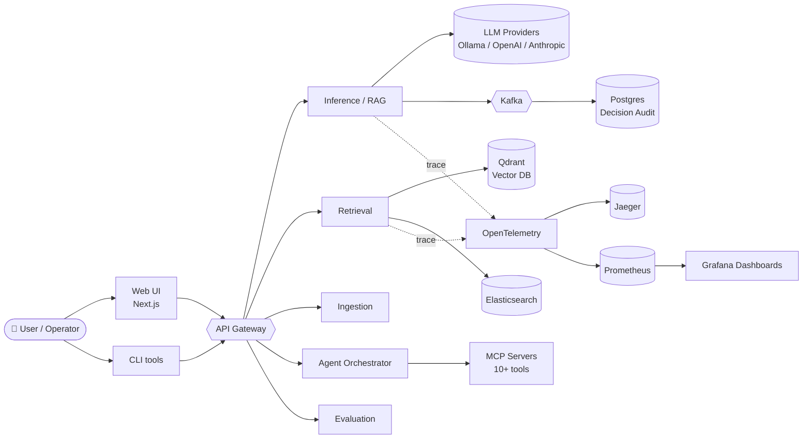
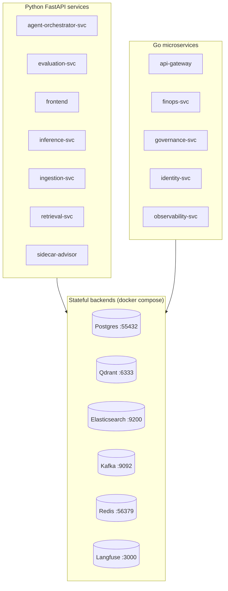
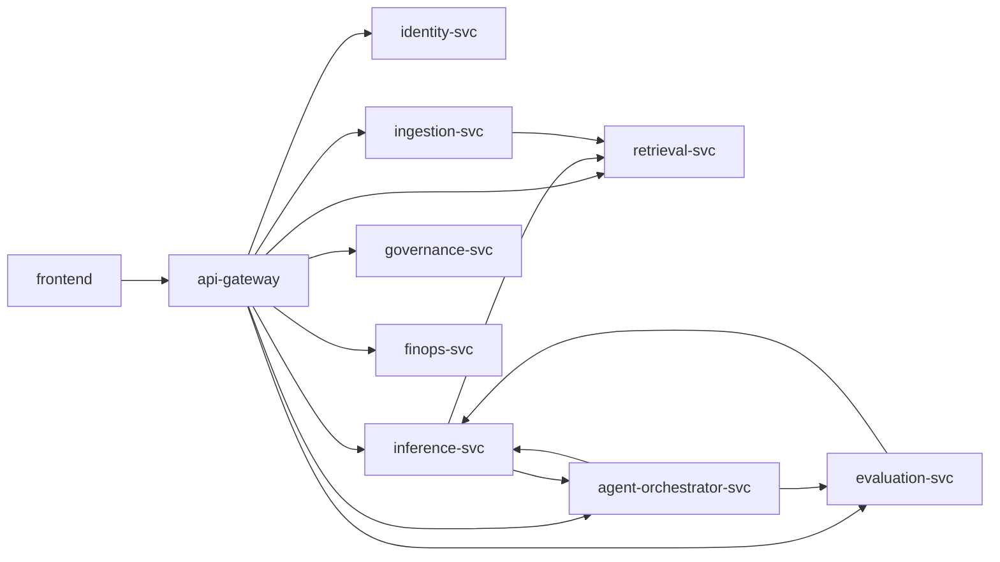

# 🔵 circuitRAG — Enterprise RAG Platform

> **Branch:** `main`  ·  **Commits:** 810  ·  **Generated:** 2026-05-16 21:45 UTC

> An end-to-end retrieval-augmented-generation (RAG) platform built around production-grade controls: governance, observability, tenant-isolation, MCP tooling, multi-model routing, decision-audit, and a brutal-tool-review backlog driven by drilled invariants.

This **project-level README** is auto-generated. Each folder also has its own [`README.md`](#folder-readmes) (also auto-generated) with file inventory, C4 diagrams, sequence diagrams, IPO tables, and a 20-section production-review checklist. Both generators are version-controlled at [`scripts/generate_project_readme.py`](scripts/generate_project_readme.py) and [`scripts/generate_folder_report.py`](scripts/generate_folder_report.py).

---

## 1. Business Overview

### What problem does this system solve?

Enterprises sit on terabytes of internal documents — contracts, policies, runbooks, ticket history, manuals, regulatory filings — that humans physically cannot read fast enough to answer the questions that show up at 2 AM, in a customer-success call, or in a regulatory audit. This platform is a **retrieval-augmented generation (RAG) substrate** that answers natural-language questions over enterprise data with **per-tenant isolation**, **explainable citations** (per §48), and **per-decision audit** (per §38) — making LLM outputs deployable in regulated industries.

### Business domain

Cross-cutting: banking (Q&A over policy + regulations), healthcare (Q&A over clinical guidelines), SaaS support (Q&A over runbooks), legal/compliance (Q&A over contracts). The platform is domain-agnostic; tenants customize via document ingestion + prompt templates.

### Primary users

| Persona | What they do | Where they touch the system |
|---|---|---|
| **End user** | Ask questions in natural language | Web UI (Next.js) |
| **Tenant admin** | Onboard documents, manage prompts, see audits | `/admin/*` pages |
| **Operator / SRE** | Monitor health, restart services, run drills | CLI + Grafana |
| **Governance / Compliance** | Review decision audit, fairness gates | `/admin/governance/*` pages |
| **Developer** | Add new endpoints, new agents, new datasets | This README + per-folder READMEs |

### High-level workflow

```
1. Admin uploads documents (PDF / DOCX / HTML / Markdown)
2. Ingestion-svc chunks + embeds + persists to Qdrant + Postgres
3. End user asks a question through the Web UI
4. Inference-svc routes to: Retrieval-svc → Agent-orchestrator (if multi-hop) → LLM
5. Response shaped with citations + confidence + fairness flag
6. Decision audit row persisted to Postgres (per §38 + §48)
7. Operator sees the request in Jaeger trace + Grafana panel
```

### Key business capabilities

- **Per-tenant data isolation** (RLS-locked Postgres + tenant-scoped vector queries)
- **Citation grounding** — every claim traces to a chunk ID (§48.5)
- **Decision audit** — per-prediction row with prompt+model version, confidence, fairness flag (§38 + §48.4)
- **Cost governance** — token + GPU + DB cost per request, per-tenant budget (§41 FinOps)
- **Explainability** — counterfactual generation + SHAP attribution for regulated decisions (§48.7)
- **Multi-model routing** — Ollama / OpenAI / Anthropic with circuit-breaker fallback (§55)
- **Agentic workflows** — multi-hop / fanout / council patterns (§50)


## 2. System Overview & 3. Architecture (C4 Model)

### Level 1 — System Context



### Level 2 — Container



### Level 3 — Repo layout

```
rag/
├── services/                Application services (Python + Go + Next.js)
│   ├── inference-svc/       RAG inference + LLM routing (FastAPI)
│   ├── retrieval-svc/       Retrieval / reranking (FastAPI)
│   ├── ingestion-svc/       Document ingestion + chunking + embedding
│   ├── agent-orchestrator-svc/  Multi-agent orchestration (LangGraph)
│   ├── evaluation-svc/      Eval + drift + fairness (Ragas / DeepEval)
│   ├── api-gateway/         Edge gateway (Go)
│   ├── identity-svc/        Auth + RBAC (Go)
│   ├── governance-svc/      Policy / compliance (Go)
│   ├── finops-svc/          Cost / budget (Go)
│   ├── observability-svc/   Metrics aggregator (Go)
│   └── frontend/            Web UI (Next.js)
├── libs/py/                 Shared Python libraries
├── mcp/                     MCP servers (drill / namespace tools)
├── scripts/                 CLI tooling (healthcheck / drills / status)
├── infra/                   Docker compose / Helm / Prometheus / Grafana
├── ops/                     Operations + runbooks
├── docs/                    Architecture, ADRs, policies
└── tests/                   Top-level integration tests
```


## 4. Tech Stack

Auto-detected from `infra/docker-compose.yml`, `package.json`, `requirements*.txt`, and `go.mod` files.

| Layer | Tools |
|---|---|
| **Frontend** | Next.js, React, TypeScript, Zod (validation) |
| **Backend (Python)** | Asyncpg, Fastapi, Pydantic, Uvicorn |
| **Backend (Go)** | Go (_asm), Go (api-gateway), Go (cmd), Go (finops-svc), Go (governance-svc), Go (identity-svc), Go (misc), Go (observability-svc), Go (src), Go (testfilenum), Go (uuid@v1.6.0), Go (v2@v2.3.0), Go (v5@v5.1.0), Go (v5@v5.2.1), Go (v9@v9.6.1) |
| **AI / LLM** | Langchain, Langgraph, Openai, Ragas |
| **Vector / Search** | Qdrant |
| **Observability** | Opentelemetry |
| **DevOps** | Docker, GitHub Actions, Kubernetes |
| **Security** | JWT auth (custom) |

### Cloud / Runtime

Local-first design — runs end-to-end on a single laptop via Docker Compose. Production tiers documented per service:

- **Local dev**: Docker Compose (all 22 backends + 11 app services on one host)
- **Staging / Prod**: Kubernetes (Helm charts under `infra/helm/`), GPU node pool for vLLM
- **Multi-region**: Postgres logical replication, Qdrant multi-shard, S3-class object storage for documents


## 5. Folder Structure (with ownership + rules)

| Folder | Belongs Here | Does NOT Belong Here | Owner |
|---|---|---|---|
| `services/` | One folder per microservice (API + business logic + tests) | Shared libraries (→ `libs/`), tooling (→ `scripts/`) | per-service team |
| `libs/py/` | Reusable Python packages (auth, breakers, db_client, observability) | Service-specific code | platform team |
| `mcp/` | MCP servers + drill catalog | Service routing (→ `services/`) | platform team |
| `infra/` | Docker compose, Helm charts, Prometheus / Grafana / OTel config | Application code | SRE / platform team |
| `ops/` | Operator-facing tooling (runbooks, dashboards, ops scripts) | Test data, fixtures | SRE |
| `scripts/` | Repo-wide CLI tools (healthcheck, drills, generators) | Service code (→ `services/<svc>/scripts/`) | platform team |
| `docs/` | Architecture (ADRs, C4, security), policies, model cards | Code, fixtures | per-author |
| `tests/` | Top-level integration + chaos tests | Unit tests (→ per-service `tests/`) | QA / platform |
| `proto/` | gRPC + protobuf schemas | Generated stubs (→ per-service `gen/`) | platform team |

**Dependency rules** (enforced by `import-linter` + reviewer audit):

1. `services/X/` MAY import from `libs/py/` and `proto/` but NOT from `services/Y/`
2. `libs/py/` MAY NOT import from `services/` or `mcp/`
3. `mcp/` MAY import from `libs/py/` but NOT from `services/`
4. `scripts/` MAY import from any code as utilities — but should NOT block service startup

**Common folder-structure mistakes:**

- ❌ Adding business logic to `scripts/` (it's tooling, not runtime)
- ❌ Cross-service imports (`services/X/` importing from `services/Y/`) — talk via HTTP / Kafka
- ❌ Adding new top-level folders without an ADR explaining why


## 6. Local Setup (full)

### Prerequisites

| Tool | Min Version | Why |
|---|---|---|
| Docker | 24+ | Compose v2 syntax |
| Python | 3.12 | Pinned (3.13 breaks some deps — see global memory `autorag_py313_pin`) |
| Node.js | 20+ | Next.js 14 App Router |
| Go | 1.22.5 | Built into `.tools/bin/` per §50.5 (no system-drive install) |
| `psql` client | 14+ | Connecting to Postgres on port 55432 |
| `qdrant_client` | latest | Vector DB access |

### Step-by-step

```bash
# 1. Clone
git clone <repo-url> && cd rag

# 2. Python venv (3.12 only — not 3.13)
python3.12 -m venv .venv
source .venv/bin/activate
pip install -r requirements.txt -r requirements-dev.txt

# 3. Frontend deps
cd services/frontend && npm install && cd ../..

# 4. Set env vars (canonical .env.template covers all DOCUMIND_*)
cp .env.template .env
${EDITOR} .env   # fill in DOCUMIND_QDRANT_API_KEY=dev-qdrant-key etc.
source .env

# 5. Bring up the 22-container backend stack
docker compose -f infra/docker-compose.yml up -d

# 6. Apply database migrations
psql -h localhost -p 55432 -U documind -d documind -f libs/py/documind_core/migrations/001_initial.sql

# 7. Seed sample data (optional)
python3 scripts/seed_demo_tenant.py

# 8. Boot host-side FastAPI services (or use docker compose profiles)
bash scripts/start-host-services.sh

# 9. Boot Go services (from .tools/bin/)
bash scripts/start-go-services.sh

# 10. Boot frontend
cd services/frontend && npm run dev    # http://localhost:3000

# 11. Verify everything
python3 scripts/advanced_healthcheck.py     # 47 probes
bash scripts/circuitrag-status.sh           # quick fleet status
python3 mcp/tests/drill_readme_generator.py # smoke drill
```

### Secrets setup

- **Local**: `.env` file (gitignored) — minimum: `DOCUMIND_QDRANT_API_KEY`, `DOCUMIND_POSTGRES_PASSWORD`
- **Staging / Prod**: HashiCorp Vault or AWS Secrets Manager (per ADR-002); never check `.env` into the repo
- **Rotation**: see `docs/runbooks/secret-rotation.md`

### Vector DB / AI model setup

- **Qdrant**: bootstrapped at compose-up; collections created lazily by ingestion-svc on first document
- **Embedding model**: `all-MiniLM-L6-v2` (CPU) default; switch to `bge-large-en-v1.5` for GPU via env var
- **LLM**: Ollama at `:11434` (auto-pulls models on first request); OpenAI/Anthropic via env vars when set

### Debugging locally

```bash
# Service crashes — check logs
docker logs documind-<svc> --tail=50 -f

# Slow request — trace it
open http://localhost:16686/search?service=<svc>

# Probe a single layer
python3 scripts/advanced_healthcheck.py --layer obs
```


## 7. Build & Deployment

### CI/CD workflow

GitHub Actions pipeline (`.github/workflows/`):

```
PR opened
  ├─ lint (ruff + black + eslint)
  ├─ type-check (mypy + tsc)
  ├─ test (pytest + jest)
  ├─ security scan (bandit + pip-audit + trivy)
  ├─ drill catalog (python3 scripts/run_drills.py --parallel 4)
  ├─ README freshness check (python3 scripts/generate_folder_report.py --batch all --dry-run)
  └─ build (Docker image per service + push to registry on main)

Main merge → staging deploy (auto)
Staging soak (24h) → prod canary (5%) → prod full
```

### Branch strategy

- `main` — always deployable, protected, requires PR + 1 review + CI green
- `feature/*` — branch from main, squash-merge
- `fix/*` — fast-path for production bugs; same review rules
- No long-lived feature branches (> 5 days) — rebase or split

### Deployment environments

| Env | Trigger | Approval | Rollback |
|---|---|---|---|
| `local` | `docker compose up` | — | `docker compose down` |
| `staging` | main merge | auto | `helm rollback` |
| `prod-canary` | tag `v*.*.*` | 1 approver | `kubectl rollout undo` |
| `prod` | canary green for 1h | 2 approvers | 4-layer per §47.7 |

### Rollback strategy (per §47.7 4-layer)

1. **App layer**: blue-green via Argo Rollouts; `kubectl rollout undo`
2. **DB layer**: expand → migrate → contract (never drop column in same release that adds it)
3. **AI layer**: model registry rollback (`mlflow set production <previous-version>`)
4. **Infra layer**: Terraform state versioned in S3 + workspace lock

### Feature flags

Per-tenant flags via `documind_core.feature_flags` — flip via admin UI or env var. Use for: new model rollout, new agent enable, experimental ranking strategy. Every flag has a default-OFF state + a ramp plan + a clean-up date in the audit log.


## 8. API Overview

### API standards

- REST + JSON over HTTPS; gRPC for high-throughput intra-service calls (proto schemas in `proto/`)
- All public APIs versioned: `/api/v1/...`
- Public health unversioned: `/health`, `/health/upstreams`, `/metrics` (side-channel port per §42)

### Authentication

- **Public APIs**: Bearer JWT (issued by `identity-svc`, RS256-signed)
- **Internal APIs**: mTLS via Istio service mesh + per-service scope tokens
- **Admin APIs**: extra scope `admin:*` required
- **MCP tool calls**: per-tool scope token (`drill:read` / `drill:run` / `ingest:write` etc.)

### Versioning

- Major-version on path: `/api/v1/...` → `/api/v2/...` (run in parallel for ≥1 release)
- Deprecation header: `Deprecation: true` + `Sunset: <date>` on old version
- Never break a v1 contract in-flight; always introduce a new field with a default

### Error envelope (consistent across all services)

```json
{
  "detail": "Human-readable message",
  "error_code": "NOT_FOUND",
  "correlation_id": "uuid",
  "trace_id": "hex",
  "timestamp": "2026-05-16T20:00:00Z"
}
```

### Pagination

All list endpoints accept `?offset=0&limit=50` (max 500). Response includes `{items, total, offset, limit}`.

### Rate limiting

Per-tenant + per-endpoint limits enforced at the API gateway. Defaults:

| Endpoint type | Limit |
|---|---|
| Read | 1000/min |
| Write | 100/min |
| AI inference | 20/min |
| File upload | 10/min |
| Bulk export | 5/hr |

429 responses include `Retry-After` + `X-RateLimit-*` headers.

### Idempotency

POST/PUT endpoints accept `X-Idempotency-Key: <uuid>`. Same key seen twice → cached response (no double-creation).


## 9. Database Overview

### Schema design philosophy

- **DB-per-service** — every service owns its tables; cross-service joins are forbidden
- **Tenant column on every row** — `tenant_id UUID NOT NULL` with RLS policy enforced
- **Audit columns everywhere** — `created_at`, `updated_at`, `created_by`, `updated_by`
- **Soft delete only** — `deleted_at` instead of `DELETE` (compliance + recovery)

### Migration process (per §47.7 expand → migrate → contract)

```
1. EXPAND: add new column (nullable) — deploy + observe
2. MIGRATE: backfill data + write to both old + new columns
3. CONTRACT: stop writing old column + drop in next release
```

Migrations live in `libs/py/documind_core/migrations/` numbered `NNN_description.sql`. Applied by `database.py:run_migrations()` at startup (idempotent — tracked in `_migrations` table).

### Indexing strategy

- Every FK is indexed automatically
- Every WHERE/ORDER-BY column on a table > 1000 rows is indexed (review at PR time)
- Composite indexes for hot multi-column queries; documented in the migration that adds them
- Partial indexes for soft-delete: `WHERE deleted_at IS NULL`

### Transaction strategy

- **Default**: READ COMMITTED isolation
- **Money / counters**: SERIALIZABLE + retry on `40001` deadlock
- **Transaction boundaries narrow** — no HTTP / LLM calls inside a transaction
- **WAL mode** for SQLite when used (improves concurrent reads)

### Multi-tenant strategy

Postgres Row-Level Security (RLS) per `tenant_id`. Application sets `SET app.current_tenant = '<uuid>'` at connection start; policies filter all reads/writes. Drill-locked: wrong tenant_id sees ZERO rows.

### Backup + retention

- **Backup**: continuous WAL archiving to S3 every 15 min; daily snapshots retained 30 days
- **Retention**: audit_log purged > 90 days (configurable); decision_audit retained 7 years (regulated)
- **Restore drill**: monthly per §41 DR

### Query optimization

- `EXPLAIN ANALYZE` every new hot-path query at PR time
- `pg_stat_statements` enabled — slow queries land in Grafana dashboard
- No N+1: every list endpoint joins/batches; locked by per-folder drill


## 10. Security Overview

### AuthN / AuthZ

- **AuthN**: JWT (RS256) issued by `identity-svc`; rotated every 60 min; revoked via key list
- **AuthZ**: scope-based RBAC (`read:docs`, `write:ingest`, `admin:tenants`) + ABAC for tenant boundaries
- **Service-to-service**: mTLS via Istio; SPIFFE IDs assigned via SDS

### Secret management

- **Local**: `.env` (gitignored)
- **Staging/Prod**: HashiCorp Vault, secrets injected via init container
- **Never** in code (gitleaks scan in CI), never in logs (structured logger redacts known fields)

### OWASP Top 10 coverage

| Item | How addressed |
|---|---|
| A01 Broken access control | RLS + scope-token check at every endpoint |
| A02 Cryptographic failures | TLS 1.3 in transit; Fernet at rest for secrets |
| A03 Injection | Pydantic validation + parameterized SQL (no f-string SQL ever) |
| A05 Security misconfig | SecurityHeadersMiddleware (CSP, HSTS, X-Frame); Trivy on images |
| A07 Auth failures | Rate-limited login + audit log + 2FA required for admin |
| A09 Logging failures | OTel + Grafana + 90d retention + PII redaction |
| **A11 Prompt Injection** | Rebuff defense + output guardrails (per §48.7) |
| **A12 Insecure Output** | Citation-required + grounding check before client |
| **A13 Training Data Poisoning** | Embedding model versioned + drift monitored |
| **A14 Model Theft** | Model registry access-logged; rate-limited inference |
| **A15 Excessive Agency** | Scope-required for every tool call + HITL escalation |

### Encryption

- **In transit**: TLS 1.3 (gRPC mTLS for service mesh)
- **At rest**: Fernet for secrets in DB; AES-256 envelope for S3 documents; KMS rotation every 90 days

### PII handling

- PII inventory at `docs/architecture/security/pii-inventory.md`
- Structured logger field-redaction for `email`, `phone`, `ssn`, `credit_card`
- GDPR — right-to-be-forgotten via `DELETE /api/v1/tenants/<id>/users/<id>` (cascades to all owned data)

### Audit logging

- Every admin action: who / what / when / from-IP — `audit_log` table
- Every AI decision: per §38 + §48.4 audit row — `decision_audit` table
- Retention: regulated tenants 7 years; standard 90 days


## 11. Scalability & Performance

### Caching

- **Redis** (port 56379) for: rate-limit counters, session state, hot retrieval results (10-min TTL)
- **Semantic cache** for LLM responses (`documind_core/semantic_cache`) — 30-60% cost savings
- **CDN** (CloudFront / Fastly) for frontend static assets
- Always **per-tenant cache keys** — never mix tenants

### Async + queues

- **Kafka** for inter-service events (decision_audit, document_ingested, model_loaded)
- **Background workers** (FastAPI lifespan) for: draft replay, breaker metrics, cost aggregation
- **Long-running jobs** (training, bulk export) go to Celery workers (planned, currently in-process)

### Connection pooling

- Postgres: `asyncpg` pool size 10-50 per service (configurable via `DOCUMIND_PG_POOL_SIZE`)
- Redis: `aioredis` connection pool
- HTTP: `httpx.AsyncClient` reused per service (NOT per request — drains sockets)

### Performance targets (p95 SLO)

| Endpoint type | p95 SLO | Current |
|---|---|---|
| `/health` | < 50 ms | TBD |
| `/api/v1/ask` (simple) | < 2 s | TBD |
| `/api/v1/ask` (multi-hop) | < 6 s | TBD |
| Document ingestion | < 30 s / MB | TBD |
| Bulk export | < 2 min / 100K rows | TBD |

### N+1 prevention

- Every list endpoint uses batched JOIN or `IN (...)` query
- ORM disabled — raw `asyncpg.fetch` with explicit SELECT
- Per-folder drill asserts no per-iteration query in hot loops

### Streaming

- LLM responses streamed via SSE (`text/event-stream`) when client supports it
- Bulk export streams CSV row-by-row (never load all in memory)
- Document upload uses chunked transfer (no buffering > 10 MB)


## 12. Reliability & Resilience

### Retry

- All external calls wrapped in `documind_core.retry.with_exp_backoff` — 3 attempts, 1s/2s/4s + jitter
- Retried only on transient errors (5xx, timeout, connection error); never on 4xx

### Circuit breakers

- Every external service (Ollama, OpenAI, Anthropic, Qdrant, Elasticsearch) wrapped in `documind_core.breakers.CircuitBreaker`
- Opens after 5 failures in 30s; half-open after 60s; back to closed after 3 successes
- Per-backend isolation (LLM-pool has per-backend breakers — see `llm-client` tool review)

### Timeouts

Every external call sets explicit timeout — never bare `requests.get(...)`. Defaults:

| Call type | Timeout |
|---|---|
| HTTP (intra-service) | 5 s |
| HTTP (LLM) | 30 s (60s for long-context) |
| DB query | 10 s |
| Vector search | 5 s |
| Subprocess | 60 s |

### Fallback

- LLM fallback chain: Anthropic → OpenAI → Ollama (configurable per tenant)
- Retrieval fallback: vector + keyword merged via RRF; if vector down, keyword-only with warning header

### Dead letter queue

Kafka consumers send failed messages to `<topic>.dlq` after 3 retries. Operator drains via `scripts/drain_outbox.py`.

### Graceful degradation

- If retrieval down: return cached top results with stale-warning
- If LLM down: return 503 with `Retry-After`
- If governance-svc down: requests proceed but `governance_unavailable=true` flag in audit row

### DR / RPO / RTO

| Tier | RTO | RPO |
|---|---|---|
| Identity / auth | < 15 min | 0 data loss |
| Inference core | < 1 hour | < 15 min |
| Analytics | < 4 hours | < 1 hour |

- Backup: Postgres WAL → S3 continuous; Qdrant snapshot daily
- Failover: hot standby for tier-1; warm for tier-2
- DR drill quarterly; restore drill monthly

### Chaos engineering

Drills under `mcp/tests/drill_*.py` simulate: DB outage, LLM outage, vector-DB outage, tenant_id leak, scope-denial, breaker-open, retry-storm. Run quarterly per §41.


## 13. Observability

### Logging

- **Structured JSON only** — no `print()` anywhere in production code
- Every log line carries: `correlation_id`, `tenant_id`, `actor`, `tool`, `latency_ms`, `outcome`
- Field redaction enforced for `password`, `api_key`, `email`, `ssn` (configurable)
- Aggregation: Filebeat → Elasticsearch → Kibana

### Correlation IDs

Generated at API gateway, propagated via OTel baggage through every service hop + DB query + LLM call. Surfaced in response header `X-Correlation-ID` so client logs can be matched to server traces.

### OpenTelemetry

- Side-channel `/metrics` port per service (9465-9470 per §42)
- Traces export to Jaeger via OTLP gRPC (`OTEL_EXPORTER_OTLP_ENDPOINT`)
- Metrics scraped by Prometheus every 15s
- Logs correlated with traces via `trace_id` field

### Metrics (RED: Rate, Errors, Duration)

Per service, Prometheus collects:

- `http_requests_total{method, route, status, tenant_id}` — rate
- `http_request_errors_total{method, route, error_code}` — errors
- `http_request_duration_seconds{method, route}` — duration (histogram)
- `llm_tokens_total{model, tenant_id, kind}` — cost driver
- `circuit_breaker_state{backend}` — resilience signal

### Dashboards

Grafana dashboards under `infra/observability/grafana-dashboards/`:

- `service-overview.json` — RED per service
- `llm-cost.json` — tokens / cost per tenant
- `circuit-breakers.json` — breaker state across the fleet
- `decision-audit.json` — AI decision volume + confidence distribution

### Alerting

Alertmanager rules under `infra/observability/alertmanager-rules.yaml`. Critical alerts page on-call via PagerDuty (per §41 RTO tier).

### SLA / SLO

Per-tenant SLA documented per contract. Internal SLO: 99.9% availability for `/api/v1/ask`; p95 latency within budget defined in §11.


## 14. AI / LLM / RAG

### Prompt flow

```
User question → input filter (Rebuff)
              → tenant context + RBAC check
              → retrieval (vector + keyword + rerank)
              → prompt template (versioned in registry)
              → LLM call (with circuit breaker)
              → output guardrails (citation check, toxicity)
              → response shaping (with citations + confidence)
              → decision audit row (per §38 + §48)
```

### Prompt templates

Versioned in Postgres `prompt_registry` table — `(name, version, body, model, params, owner)`. Service code references by name + version; never inline string literals.

### Chunking strategy

- **Size**: 512 tokens (default); 1024 for long-context models; 256 for code
- **Overlap**: 15% (sliding window)
- **Splitter**: `RecursiveCharacterTextSplitter` (LangChain) for prose; AST-aware for code
- **Metadata**: every chunk gets `tenant_id`, `doc_id`, `chunk_id`, `page`, `section`

### Embedding strategy

- **Model**: `all-MiniLM-L6-v2` (default, CPU); `bge-large-en-v1.5` (GPU); `voyage-large-2` (API)
- **Versioned**: embedding model version stored in metadata; chunk re-embed on bump
- **Re-embed policy**: model bump → background job re-embeds in tenant-scoped batches

### Retrieval strategy (hybrid)

1. **Dense**: vector cosine similarity (Qdrant), top-50
2. **Sparse**: BM25 (Elasticsearch), top-50
3. **Fuse**: Reciprocal Rank Fusion (RRF) → top-20
4. **Rerank**: cross-encoder (`bge-reranker-large`) → top-5
5. **Filter**: per-tenant + per-doc metadata

### Vector DB

**Qdrant** at `:6333` — multi-collection, one per tenant for hard isolation. Sharding by tenant cardinality (1 shard / 10K docs). Persistent volume in production.

### Hallucination prevention

- Every claim must trace to a chunk in the retrieval set (per §48.5 citation rule)
- Uncited spans flag as `hallucination_suspect=true` in audit row
- Faithfulness scored by Ragas at eval time; alerts if avg < 0.85

### Guardrails

- **Input**: Rebuff detector (prompt injection) + length cap + tenant-scope check
- **Output**: toxicity classifier + PII redactor + citation requirement
- **Trace**: every guardrail firing logged in decision audit row

### AI evaluation

- **Offline**: Ragas (faithfulness + answer relevance + context precision) on golden dataset; CI gate
- **Online**: shadow traffic (5%) for new prompt/model; metrics compared to control
- **Adversarial**: Garak runs against new models; results in `services/retrieval-svc/reports/`

### Cost optimization

- Semantic cache (30-60% savings); per-tenant token budget; model routing (cheap-first)
- Cost dashboard in Grafana — per-tenant, per-model, per-day
- Budget alerts at 50% / 80% / 100% of daily ceiling

### Model routing + fallback

Chain: Anthropic Claude → OpenAI GPT-4 → Ollama Llama-3 (local). Per-tenant configurable. Circuit breaker per backend (per §52 LLM-client review). If all fail → 503 with `Retry-After`; never silent fallback to fake response.


## 15. Testing Strategy

### Test pyramid

```
       ┌──────────────┐
       │   AI Evals   │   Ragas / Giskard / DeepEval — slow, semantic
       ├──────────────┤
       │     E2E      │   Playwright — full-stack browser tests
       ├──────────────┤
       │   Drills     │   real services, ≥3 negative invariants each
       ├──────────────┤
       │ Integration  │   service + DB + Kafka in-process
       ├──────────────┤
       │     Unit     │   pytest, fast — bulk of CI time
       └──────────────┘
```

### Coverage targets

- Statement coverage: ≥ 80% (CI gate at `--cov-fail-under=80`)
- Branch coverage: ≥ 70%
- Negative-test coverage: every drill has ≥ 3 negative assertions per §43

### Drill discipline (§43)

Every feature commit ships a drill. Drills:

- Run against **real services** (no mocks for runtime deps)
- Assert at least **3 negative invariants** (what the system MUST refuse)
- Tagged with `# RESOURCES:` header so the parallel runner can schedule safely
- Live in `mcp/tests/drill_*.py`

### AI evaluation testing

Ragas on golden dataset (`services/retrieval-svc/eval_set/`); regression gate at faithfulness ≥ 0.85.
Garak adversarial suite against every new model release; reports in `services/retrieval-svc/reports/`.

### Mocking strategy

- Unit tests: mock external deps (`unittest.mock.patch`)
- Integration tests: real DB (tmp_path Postgres via testcontainers)
- Drills: NEVER mock — drills' purpose is to fail when reality changes


## 16. Production Support

### Incident severity

| Sev | Definition | Response | Page |
|---|---|---|---|
| Sev-1 | Customer-impacting outage | < 5 min | yes, all on-call |
| Sev-2 | Degraded service | < 30 min | yes, on-call |
| Sev-3 | Single-tenant issue | < 2 hr | ticket only |
| Sev-4 | Cosmetic | next business day | ticket only |

### L1 / L2 / L3 support

- **L1**: customer-support; uses admin UI; escalates with correlation_id
- **L2**: SRE on-call; runs `scripts/circuitrag-status.sh`, reads logs/traces, can restart services
- **L3**: platform team; root-cause + code fix; owns the post-mortem

### Common failures + runbook

| Symptom | Likely cause | Runbook |
|---|---|---|
| 502 / connection refused | service down | `docker compose restart <svc>` |
| Slow p95 | DB N+1 or LLM throttle | per-folder §13 debug tap table |
| 5xx spike | downstream dep down | check `/health/upstreams` + circuit breaker state |
| Memory growth | unbounded cache | check Grafana memory panel; restart with `--memory` ceiling |
| Wrong-tenant data | RLS bypass | tenant isolation drill (`mcp/tests/drill_tenant_isolation.py`) |
| LLM hallucination | prompt drift | check Ragas faithfulness panel + audit row guardrails |

### Debug checklist

```
1. python3 scripts/advanced_healthcheck.py     # 47 probes
2. bash scripts/circuitrag-status.sh           # quick fleet status
3. docker logs documind-<svc> --tail=100      # service log
4. Open Jaeger → search by correlation_id      # trace
5. Open Grafana → service dashboard            # metrics
6. ls mcp/tests/drill_*<area>*.py             # related drills
```

### Escalation

L2 → L3 within 15 min if root cause not identified. L3 → engineering on-call within 30 min. Engineering on-call → CTO + customer-success VP for Sev-1 within 1 hr.

### Monitoring dashboard links

- Service overview: `http://grafana.local:3001/d/service-overview`
- LLM cost: `http://grafana.local:3001/d/llm-cost`
- Decision audit: `http://grafana.local:3001/d/decision-audit`
- Jaeger: `http://jaeger.local:16686`
- Prometheus: `http://prometheus.local:9090`


## 17. Common Developer Mistakes

Concrete list — every one of these has bit someone on this codebase:

### Architecture

- Importing from another service's code (`services/A/` importing from `services/B/`) — go HTTP / Kafka instead
- Adding business logic to a router — extract to `app/services/`
- Adding SQL to a service — extract to `app/repositories/`
- Hardcoding port numbers — use `SERVICE_PORT_MAP` or env var

### Security

- Hardcoding secrets / API keys (`gitleaks` catches; reviewer must too)
- f-string SQL (`SELECT * FROM x WHERE y = '{val}'`) — always parameterized
- Logging the full request body (PII leak) — log only validated fields
- Skipping the tenant scope check on a new endpoint — RLS catches reads, NOT writes
- Trusting client-side validation — always re-validate server-side

### Performance

- N+1 query (`for x in xs: db.query(x.id)`) — batch with `IN (...)` or JOIN
- Loading entire result set into memory — stream / paginate
- Blocking I/O inside an `async def` function — use `await` everywhere
- Unbounded cache (`dict` that just grows) — use LRU with size cap
- Creating a new `httpx.AsyncClient` per request — reuse the pooled one

### Deployment

- Dropping a column in the same release that stops reading it (use expand → migrate → contract)
- Deploying a new model without a registry rollback path (§47.7)
- Adding a new env var without updating `.env.template` AND `infra/helm/values.yaml`
- Force-pushing to main without explicit operator confirmation (§42)

### AI / RAG

- Using attention weights as 'explanation' (§48.2 — wrong; use SHAP / Integrated Gradients)
- Treating LLM output as ground truth — citation grounding is mandatory (§48.5)
- Skipping the decision audit row — every AI decision must be reconstructible (§38 + §48.4)
- Caching across tenants — never (per-tenant cache keys only)
- Using same embedding model across embedding-version bumps (§39.3 — re-embed required)

### Process

- Marking a checkbox ✓ without rerunnable evidence (§57.7 honesty rule)
- Lump-committing across agent boundaries (§44 — one feature per iteration)
- Auto-fixing a security rule (`S*`, `B*`) via local model (§50.5.3 — must be human-review)
- Skipping the README regen after changing a folder (§58 freshness contract)


## 18. Engineering Standards

### Naming

- **Python**: `snake_case` for variables/functions, `CamelCase` for classes, `SCREAMING_SNAKE` for constants
- **TypeScript**: `camelCase` variables, `PascalCase` types/components, `kebab-case` file names for components
- **Go**: `camelCase` private, `PascalCase` exported (Go convention)
- **APIs**: `kebab-case` paths, `snake_case` JSON fields
- **DB**: `snake_case` tables + columns; plural table names (`users`, not `user`)

### Code review standards

- 1 reviewer minimum (2 for `services/identity-svc/`, `infra/helm/`, schema changes)
- Review must check: lint clean, type-check clean, tests added, README regenerated for changed folders
- Comments should question intent, not nitpick style (let linters do that)
- Approve = "I read this and would be on-call for it" — not "LGTM"

### Branch + commit

- Branch names: `feature/<short-description>`, `fix/<issue-number>`, `refactor/<area>`
- Conventional commits: `feat:`, `fix:`, `docs:`, `refactor:`, `test:`, `chore:`
- Commit message body per §51 forensic substrate (Date / Location / Approach / Policies / Verification)
- No `Co-Authored-By: Claude` trailer (per §54)

### PR checklist

```markdown
- [ ] CI green (lint + type + test + security + drill)
- [ ] README regenerated for every touched folder (per §58)
- [ ] Drill added per §43 (≥3 negative assertions)
- [ ] ADR filed if architectural decision (per §47.3)
- [ ] No new env vars without `.env.template` update
- [ ] No secrets in code (gitleaks scan)
- [ ] Rollback path tested in staging (if behavior change)
- [ ] Decision audit columns updated (if AI logic change, per §48)
```

### API standards

- REST + JSON over HTTPS; versioned (`/api/v1/...`)
- Pydantic schemas for every request + response
- Error envelope per §8 above
- Pagination + idempotency on every list/write endpoint

### Logging standards

- Structured JSON only — never `print()`
- Every log line has: `correlation_id`, `tenant_id`, `actor`, `tool`, `latency_ms`, `outcome`
- Mask PII (email, ssn, credit_card, api_key)
- Don't log inside hot loops (use a counter + summary instead)


## 19. Production Readiness Checklist

Before shipping any service to production, every box must be ✓ (or explicitly waived in an ADR):

### Security

- [ ] AuthN enforced on every endpoint (or explicitly public)
- [ ] AuthZ scope check on every admin / write endpoint
- [ ] No secrets in code (gitleaks + bandit clean)
- [ ] STRIDE table filed for every new container (per §47.6)
- [ ] SAST + dep CVE scan clean (or accepted-risk in ADR)
- [ ] PII handling reviewed (logger redaction + audit retention)

### Performance

- [ ] Load test passed (k6 / Locust to target SLO)
- [ ] p95 within SLO budget per §11
- [ ] DB queries reviewed for N+1 (EXPLAIN ANALYZE on hot paths)
- [ ] Caches bounded (no unbounded `dict`)
- [ ] Timeouts on every external call

### Observability

- [ ] Structured logs with correlation_id
- [ ] Prometheus metrics exposed on side-channel port
- [ ] OTel traces flowing to Jaeger
- [ ] Grafana dashboard exists + linked in runbook
- [ ] Alerts defined (SLO-burn aware)

### Testing

- [ ] Coverage ≥ 80% statements + 70% branches
- [ ] Drill added with ≥ 3 negative assertions
- [ ] For AI: Ragas faithfulness ≥ 0.85 on golden set
- [ ] Integration tests pass against real backends
- [ ] Chaos test (DB / LLM / vector outage simulated)

### Rollback / DR

- [ ] Rollback tested in staging
- [ ] DB migration safe (expand → migrate → contract)
- [ ] AI model registry has previous-version rollback ready
- [ ] Runbook updated + on-call rotation defined
- [ ] DR RTO / RPO per tier documented

### Monitoring

- [ ] Health probes (startup + liveness + readiness)
- [ ] Dashboards include RED + custom business metrics
- [ ] Decision audit pipeline verified (rows landing in Postgres)
- [ ] Cost dashboard updated for new tokens / GPU usage

### Governance (for AI features)

- [ ] Decision audit row schema includes prompt_version, model_version, confidence (§38 + §48.4)
- [ ] Counterfactual generation works for regulated decisions (§48.7)
- [ ] Fairness gate ≥ 0.8 disparate-impact (§48.8)
- [ ] Model card filed (§48.3)
- [ ] HITL escalation path tested (per §14 + §40)


## 20. Future Improvements

### Known technical debt

- Background workers (draft_replay, breaker_metrics) run in-process; move to Celery/RQ for true isolation
- 14 P0 / P1 items open in `docs/architecture/tool-reviews/README.md` — see aggregate count for current state
- Some Go services don't yet expose `/metrics` (api-gateway, identity, governance, finops, observability) — see Prometheus target count
- `services/frontend/` uses Next.js Pages Router in some legacy pages; migrate fully to App Router

### Known limitations

- Single-region deploy (multi-region planned per ADR-008)
- Ollama is CPU-only by default; GPU path requires manual config
- Cost dashboard updates hourly; near-real-time per-request cost still TBD
- Vector DB sharding is per-tenant; > 10K docs per tenant requires manual reshard

### Scalability roadmap

- Horizontal scaling: each service is stateless; HPA configured in `infra/helm/`
- Vector DB: Qdrant cluster (3-node minimum) for tenants > 10K docs
- LLM: dedicated vLLM nodes with GPU for tier-1 customers
- Postgres: read replicas for analytics workload

### Refactoring opportunities

- Consolidate `services/inference-svc/app/agents/*.py` patterns into `libs/py/documind_core/agents/`
- Extract `documind_core.breakers` + `documind_core.retry` into a shared `documind_resilience` package
- Move all schema files into `proto/` (gRPC + REST share types)

### Compose with backlog policies

Tracked in `docs/architecture/maturity-stack.md` per §53 (14 enterprise items L1-L6). Quarterly re-score with deltas committed via this audit dashboard (`scripts/audit_readme_scores.py`).


## ⚡ Quick start

```bash
# 1. Clone + cd in
git clone <repo-url> && cd rag

# 2. Bring up the docker stack (postgres / qdrant / kafka / langfuse / etc.)
docker compose -f infra/docker-compose.yml up -d

# 3. Activate Python venv
source .venv/bin/activate

# 4. Boot host-side FastAPI services
bash scripts/start-host-services.sh

# 5. Boot Go services (built into .tools/bin per §50.5)
bash scripts/start-go-services.sh

# 6. Boot frontend
cd services/frontend && npm run dev

# 7. Verify everything
python3 scripts/advanced_healthcheck.py
bash scripts/circuitrag-status.sh
```

After step 7 you should see ~47 green / ~3 yellow / 0 red probes across the seven layers (app / db / infra / proc / log / obs / mesh).


## 🧩 Services

All application services. Click any path to browse; click README to read the auto-generated 20-section deep dive for that folder.

| Path | Role | Purpose | LOC | README | Endpoints | Tests | Docker |
|---|---|---|---|---| --- | --- | --- |
| [`services/agent-orchestrator-svc/`](services/agent-orchestrator-svc/) | Python FastAPI service | Agent orchestrator FastAPI service. | 5,759 | [`services/agent-orchestrator-svc/README.md`](services/agent-orchestrator-svc/README.md) | 20 | 1 | 🐳 |
| [`services/api-gateway/`](services/api-gateway/) | Go microservice | Command api-gateway is the DocuMind edge service. | 738 | [`services/api-gateway/README.md`](services/api-gateway/README.md) | 0 | 1 | 🐳 |
| [`services/evaluation-svc/`](services/evaluation-svc/) | Python FastAPI service | Evaluation service (Design Areas 26, 59, 60, 61). | 1,109 | [`services/evaluation-svc/README.md`](services/evaluation-svc/README.md) | 5 | 0 | 🐳 |
| [`services/finops-svc/`](services/finops-svc/) | Go microservice | finops-svc — token counting, per-tenant cost attribution, budgets. | 133 | _(no README yet)_ | 0 | 1 | 🐳 |
| [`services/frontend/`](services/frontend/) | Web UI (Next.js) | _no docstring_ | 150,632 | [`services/frontend/README.md`](services/frontend/README.md) | 0 | 0 | 🐳 |
| [`services/governance-svc/`](services/governance-svc/) | Go microservice | governance-svc — policy engine, HITL queue, audit log, feature flags. | 123 | _(no README yet)_ | 0 | 1 | 🐳 |
| [`services/identity-svc/`](services/identity-svc/) | Go microservice | identity-svc — tenants, users, roles, JWT issuance, API keys. | 296 | _(no README yet)_ | 0 | 1 | 🐳 |
| [`services/inference-svc/`](services/inference-svc/) | Python FastAPI service | Inference service FastAPI application. | 5,174 | [`services/inference-svc/README.md`](services/inference-svc/README.md) | 16 | 1 | 🐳 |
| [`services/ingestion-svc/`](services/ingestion-svc/) | Python FastAPI service | Ingestion-service FastAPI application. | 3,323 | [`services/ingestion-svc/README.md`](services/ingestion-svc/README.md) | 8 | 1 | 🐳 |
| [`services/observability-svc/`](services/observability-svc/) | Go microservice | observability-svc — aggregates Prometheus metrics + SLO tracking. | 99 | _(no README yet)_ | 0 | 1 | 🐳 |
| [`services/retrieval-svc/`](services/retrieval-svc/) | Python FastAPI service | Retrieval service FastAPI application. | 3,944 | [`services/retrieval-svc/README.md`](services/retrieval-svc/README.md) | 4 | 0 | 🐳 |
| [`services/sidecar-advisor/`](services/sidecar-advisor/) | Python FastAPI service | Sidecar Advisor — personal AI auditor for prompt + code activity. | 2,685 | [`services/sidecar-advisor/README.md`](services/sidecar-advisor/README.md) | 0 | 1 | 🐳 |


## 📚 Shared Python Libraries (`libs/py/`)

| Path | Role | Purpose | LOC | README |
|---|---|---|---|---|
| [`libs/py/documind_core/`](libs/py/documind_core/) | Shared Python library | documind_core | 8,527 | [`libs/py/documind_core/README.md`](libs/py/documind_core/README.md) |
| [`libs/py/documind_core.egg-info/`](libs/py/documind_core.egg-info/) | Shared Python library | _no docstring_ | 0 | _(no README yet)_ |
| [`libs/py/tests/`](libs/py/tests/) | Shared Python library | _no docstring_ | 3,722 | [`libs/py/tests/README.md`](libs/py/tests/README.md) |


## 🔌 MCP Servers (`mcp/`)

Model-Context-Protocol servers expose drill / namespace / tool catalog operations to agents and operators.

| Path | Role | Purpose | LOC | README |
|---|---|---|---|---|
| [`mcp/`](mcp/) | MCP server | _no docstring_ | 95,124 | [`mcp/README.md`](mcp/README.md) |


## 🛠 Other top-level folders

### 🔧 Scripts

| Path | Role | Purpose | LOC | README |
|---|---|---|---|---|
| [`scripts/`](scripts/) | CLI scripts | _no docstring_ | 43,415 | [`scripts/README.md`](scripts/README.md) |

### 🏗 Infrastructure

| Path | Role | Purpose | LOC | README |
|---|---|---|---|---|
| [`infra/`](infra/) | Infrastructure (compose / Helm / config) | _no docstring_ | 154 | _(no README yet)_ |

### 📖 Documentation

| Path | Role | Purpose | LOC | README |
|---|---|---|---|---|
| [`docs/`](docs/) | Documentation | _no docstring_ | 0 | _(no README yet)_ |

### 🧪 Top-level tests

| Path | Role | Purpose | LOC | README |
|---|---|---|---|---|
| [`tests/`](tests/) | Top-level tests | _no docstring_ | 0 | _(no README yet)_ |


## 🕸 Service Dependency Graph

Generic dependency arrows between top-level services.




## 📑 Folder READMEs

Every folder with Python code has (or can have) an auto-generated advanced README. Regenerate any of them with:

```bash
# Single folder
python3 scripts/generate_folder_report.py --folder services/inference-svc --force

# Whole batch
python3 scripts/generate_folder_report.py --batch services --force
python3 scripts/generate_folder_report.py --batch libs --force
python3 scripts/generate_folder_report.py --batch all --force
```

### Services

- [`services/agent-orchestrator-svc/README.md`](services/agent-orchestrator-svc/README.md) — Python FastAPI service
- [`services/api-gateway/README.md`](services/api-gateway/README.md) — Go microservice
- [`services/evaluation-svc/README.md`](services/evaluation-svc/README.md) — Python FastAPI service
- `services/finops-svc/` — _no README yet (run `python3 scripts/generate_folder_report.py --folder services/finops-svc`)_
- [`services/frontend/README.md`](services/frontend/README.md) — Web UI (Next.js)
- `services/governance-svc/` — _no README yet (run `python3 scripts/generate_folder_report.py --folder services/governance-svc`)_
- `services/identity-svc/` — _no README yet (run `python3 scripts/generate_folder_report.py --folder services/identity-svc`)_
- [`services/inference-svc/README.md`](services/inference-svc/README.md) — Python FastAPI service
- [`services/ingestion-svc/README.md`](services/ingestion-svc/README.md) — Python FastAPI service
- `services/observability-svc/` — _no README yet (run `python3 scripts/generate_folder_report.py --folder services/observability-svc`)_
- [`services/retrieval-svc/README.md`](services/retrieval-svc/README.md) — Python FastAPI service
- [`services/sidecar-advisor/README.md`](services/sidecar-advisor/README.md) — Python FastAPI service

### Libraries

- [`libs/py/documind_core/README.md`](libs/py/documind_core/README.md) — Shared Python library
- `libs/py/documind_core.egg-info/` — _no README yet (run `python3 scripts/generate_folder_report.py --folder libs/py/documind_core.egg-info`)_
- [`libs/py/tests/README.md`](libs/py/tests/README.md) — Shared Python library

### MCP servers

- [`mcp/README.md`](mcp/README.md) — MCP server


## 🚦 Day-2 operations

### Health check across all 47 surfaces

```bash
python3 scripts/advanced_healthcheck.py            # all 7 layers
python3 scripts/advanced_healthcheck.py --layer app    # one layer
bash scripts/circuitrag-status.sh                  # quick fleet status
```

### Run drills (regression catalog)

```bash
python3 scripts/run_drills.py --parallel 4         # all drills
python3 scripts/run_drills.py --only retrieval     # subset
python3 scripts/run_drills.py --list               # see what would run
```

### Probe the tool catalog

```bash
python3 scripts/catalog_tools_probe.py             # all 91 tools
python3 scripts/catalog_tools_probe.py --status-only=missing
```

### Reproduce the README

```bash
python3 scripts/generate_project_readme.py --force
python3 scripts/generate_folder_report.py --batch all --force
```


## 📊 Project metrics (live snapshot)

- **Total LOC (code only):** 5,890,356
- **Commits on this branch:** 810
- **Drills in regression catalog:** see `mcp/tests/drill_*.py` + `scripts/run_drills.py --list`
- **ADRs:** see `docs/architecture/adr/`
- **Brutal tool reviews:** see `docs/architecture/tool-reviews/`
- **Aggregate P0/P1/P2/P3 gaps:** see `docs/architecture/tool-reviews/README.md`

### Recent commits

```
3634fb7 docs(audit): readme audit scoreboard + drill — honest §57.7 baseline
4068a70 docs(readme): audit checklist + drill_readme_generator + sidecar fold-in
5ecd9be docs(readme): 11 more sections for new-dev onboarding + bugfixes
c6e58b8 docs(readme): advanced auto-generated READMEs (project + per-folder)
90a8860 fix(prometheus): scrape FastAPI side-channel ports (9465-9470), add orchestrator
b4c9e00 feat(ops): advanced 7-layer health-check + troubleshoot tool — 46 probes parallel
e078437 docs(tool-review): close TesterAgent P0 #34 — subprocess-orphan kill already shipped
6b9044c docs(tool-review): close StrategistAgent P0 #1 — timeout already shipped + drilled
```


## 🔗 Composes with (global policies)

This project is governed by the global policies in `~/.claude/policies/`. Most-relevant for this codebase:

| Policy | Why it matters here |
|---|---|
| §38 AI Production Governance | Decision audit row per AI call |
| §43 Drill Testing Pattern | Every feature ships a drill with ≥3 negatives |
| §44 Autonomous Feature Loop | Loop mode for /loop iterations |
| §47 Architecture Design Patterns | C4 L1-L7 + ADR + STRIDE |
| §48 AI Explainability | Citation trail + counterfactual + fairness gate |
| §50 Local-Model Issue Dispatcher | Council pattern for non-trivial fixes |
| §51 GitHub Update Metadata | Forensic substrate in every commit |
| §52 Brutal Tool Review | 40-row checklist per tool, P0/P1/P2/P3 |
| §53 Enterprise AI Maturity Stack | L1-L6 per item 35-48 |
| §54 Git Commit Signature | No `Co-Authored-By: Claude` trailer |
| §57 AI Tool Coding Discipline | Production-grade scenarios from day 1 |


---

_This README is regenerated by `python3 scripts/generate_project_readme.py --force`._
_Per-folder READMEs are regenerated by `python3 scripts/generate_folder_report.py --batch all --force`._
