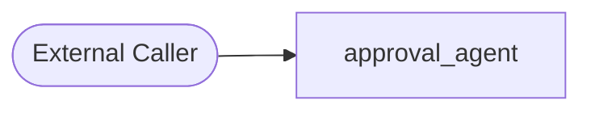
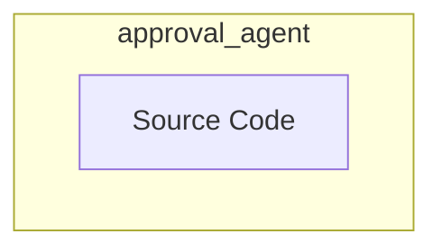
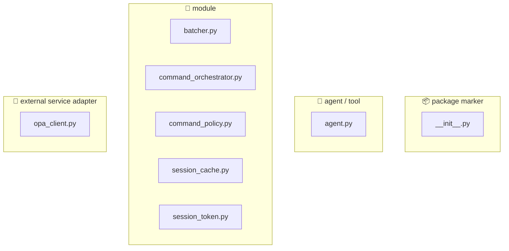
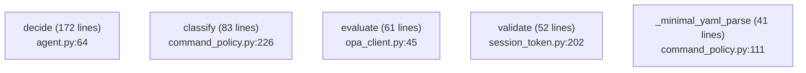
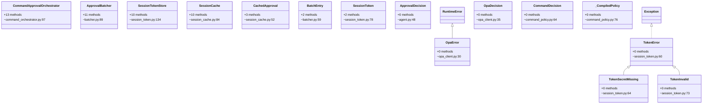
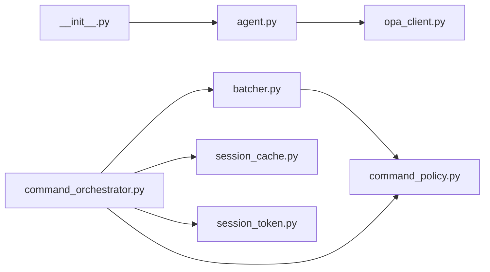
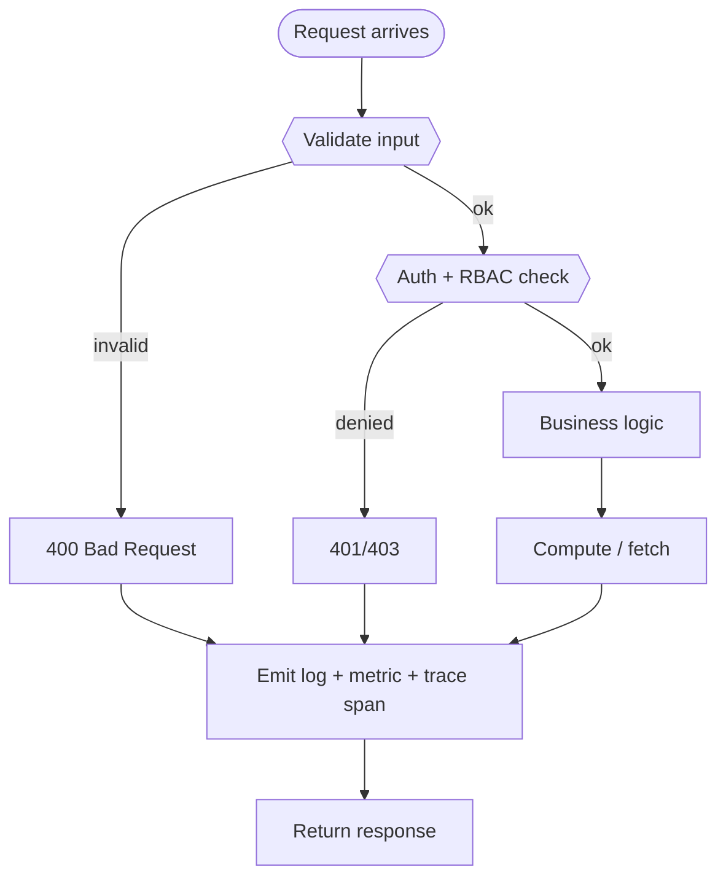
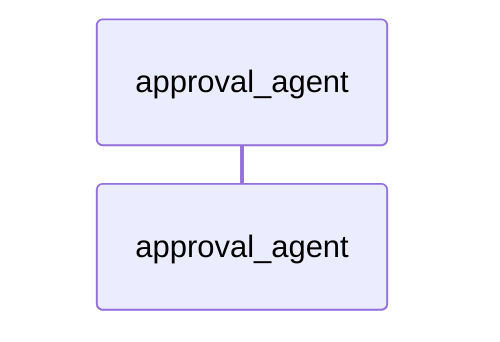

# 📦 `approval_agent` — Advanced README

  ·  **Path:** `approval_agent`  ·  **Generated:** 2026-05-16 20:26 UTC

> approval_agent — pure-function decide() with blocked/human/auto rules.

This README is **auto-generated** by [`scripts/generate_folder_report.py`](../../scripts/generate_folder_report.py). It explains what this folder does, every file inside it, how the files link to each other, every API endpoint, every database call, every test case, and the production controls (security / reliability / performance / observability). Re-run after major changes.

---

## 🔎 Section 0 — Auto-Detected Facts

| Metric | Value |
|---|---|
| Folder | `approval_agent` |
| Total files | 11 |
| Python files | 8 |
| TypeScript/JS files | 0 |
| Go files | 0 |
| Shell scripts | 0 |
| Lines of code | 1,525 |
| Python classes | 16 |
| Python functions | 67 |
| Async functions | 0 |
| Total API endpoints | 0 |
| Total DB call sites | 0 |
| DB / Storage libs | _(none)_ |
| Concurrency primitives | _(none)_ |
| Caching primitives | _(none)_ |
| Input validation | _(NONE — flag risk)_ |
| AI / LLM deps | _(none)_ |
| Test files | 0 |
| Detected test cases | 0 |
| Tests dir present | ❌ — flag |
| Dockerfile | ❌ |
| pyproject.toml | ❌ |
| go.mod | ❌ |
| package.json | ❌ |
| Top git contributors | `5	PraveenAsthana123` |

#### Longest functions (top 5)

| Location | Name | Lines |
|---|---|---|
| `agent.py:64` | `decide` | 172 |
| `command_policy.py:226` | `classify` | 83 |
| `opa_client.py:45` | `evaluate` | 61 |
| `session_token.py:202` | `validate` | 52 |
| `command_policy.py:111` | `_minimal_yaml_parse` | 41 |

#### Smells detected

_(no smells detected by grep)_


## 1. Purpose — Business + Technical

### Business problem this folder solves

> _Reviewer to fill: approval_agent — pure-function decide() with blocked/human/auto rules._

### Technical contract this folder exposes

> _Reviewer to fill: API surface, events emitted, data persisted, downstream consumers._

### Out-of-scope (what this folder does NOT do)

> _Reviewer to fill: explicit non-goals — prevents scope creep at review time._


## 🗺 How to Read This Folder (Guided Tour)

Read these files in order — by the end, you'll understand 80% of this folder's behavior. Click any path to jump straight to the source.

1. **`agent.py`** (🤖 agent / tool, 243 LOC) — Approval agent — decides auto-approve / human-required / deny / revise.
2. **`opa_client.py`** (🔌 external service adapter, 109 LOC) — Wraps an external API (LLM / vector DB / message bus). Look for circuit breakers + retries.
3. **`command_orchestrator.py`** (📄 module, 343 LOC) — Command-approval orchestrator — wires policy + cache + batcher.
4. **`command_policy.py`** (📄 module, 316 LOC) — Command-pattern policy classifier — reads configs/approval_policy.yaml.
5. **`session_token.py`** (📄 module, 303 LOC) — Session-token issuance + validation — operator browser-session continuity.
6. **`batcher.py`** (📄 module, 231 LOC) — Medium-risk approval batcher — collect, then prompt every N minutes.
7. **`session_cache.py`** (📄 module, 222 LOC) — Session-scoped approval cache — pattern-keyed TTL.
8. **`__init__.py`** (📦 package marker, 19 LOC) — approval_agent — pure-function decide() with blocked/human/auto rules.

Click absolute paths for direct `cat`-ability in the §2 File Inventory above.


## ⚙ Environment Variables

All env vars this folder reads, auto-extracted from `BaseSettings` field declarations and `os.environ.get` calls.

### Runtime `os.environ.get` / `os.getenv` calls

| Variable | Default | Source location |
|---|---|---|
| `DOCUMIND_APPROVAL_ENGINE` | `opa` | `agent.py:44` |
| `DOCUMIND_OPA_BIN` | `opa` | `opa_client.py:26` |

_Variables marked **required** must be set — missing values may raise on startup or silently default to empty strings._


## 2. File Inventory

Every Python file in this folder, with role / classes / functions / LOC / first docstring line. Full absolute paths listed below the table for easy `cat`-ability.

| Relative path | Role (inferred) | Classes | Functions | LOC | Summary |
|---|---|---|---|---|---|
| `__init__.py` | 📦 package marker | 0 | 0 | 19 | approval_agent — pure-function decide() with blocked/human/auto rules. |
| `agent.py` | 🤖 agent / tool | 1 | 3 | 243 | Approval agent — decides auto-approve / human-required / deny / revise. |
| `batcher.py` | 📄 module | 2 | 0 | 231 | Medium-risk approval batcher — collect, then prompt every N minutes. |
| `command_orchestrator.py` | 📄 module | 2 | 0 | 343 | Command-approval orchestrator — wires policy + cache + batcher. |
| `command_policy.py` | 📄 module | 2 | 6 | 316 | Command-pattern policy classifier — reads configs/approval_policy.yaml. |
| `opa_client.py` | 🔌 external service adapter | 2 | 2 | 109 | OPA client for approval_agent — shells out to ``opa eval``. |
| `session_cache.py` | 📄 module | 2 | 0 | 222 | Session-scoped approval cache — pattern-keyed TTL. |
| `session_token.py` | 📄 module | 5 | 5 | 303 | Session-token issuance + validation — operator browser-session continuity. |

### Absolute paths (clickable)

- `/mnt/deepa/rag/approval_agent/__init__.py`
- `/mnt/deepa/rag/approval_agent/agent.py`
- `/mnt/deepa/rag/approval_agent/batcher.py`
- `/mnt/deepa/rag/approval_agent/command_orchestrator.py`
- `/mnt/deepa/rag/approval_agent/command_policy.py`
- `/mnt/deepa/rag/approval_agent/opa_client.py`
- `/mnt/deepa/rag/approval_agent/session_cache.py`
- `/mnt/deepa/rag/approval_agent/session_token.py`


## 🧭 Where Does X Live? (cheat sheet)

Use this table when you're modifying this folder and need to know where new code goes.

| I want to... | Role | Touch these files |
|---|---|---|
| Wrap a new external API | 🔌 external service adapter | `opa_client.py` |
| Add a new agent / tool | 🤖 agent / tool | `agent.py` |


## 3. C4 Model — Context / Container / Component / Code

### Level 1 — System Context

_Where does this folder sit in the broader system?_



### Level 2 — Container

_What external dependencies does this folder talk to?_



### Level 3 — Component

_Internal files grouped by inferred role._



### Level 4 — Code (top hotspots)

_Longest functions — these are the most likely refactor candidates._




## 📐 Class Diagram (UML-style)

Top classes by method count, with inheritance arrows. Common framework bases (`BaseModel`, `BaseSettings`, `Exception`, `Enum`) use dotted lines.




_Showing top 15 of 16 classes (ranked by method count)._


## 4. Code Sequence — How Files Link to Each Other

**Import graph for files in this folder.** Reading order: start at any entry-point file (look for `🚀 entry point` role in the inventory above), then follow the arrows.



### Edge list

| From file | To file | Import-count |
|---|---|---|
| `__init__.py` | `agent.py` | 1 |
| `agent.py` | `opa_client.py` | 1 |
| `batcher.py` | `command_policy.py` | 1 |
| `command_orchestrator.py` | `batcher.py` | 1 |
| `command_orchestrator.py` | `command_policy.py` | 1 |
| `command_orchestrator.py` | `session_cache.py` | 1 |
| `command_orchestrator.py` | `session_token.py` | 1 |


## 5. Request Flowchart

Generic request lifecycle for this folder. Branches that don't apply are auto-removed based on detected dependencies (DB / cache / LLM).




## 6. API Endpoints — Input / Process / Output

_No HTTP endpoints detected via `@app.*` / `@router.*` decorators._


## 🏗 Input/Process/Output + Integration + Design Principles

### Input / Process / Output per endpoint

| Endpoint | INPUT (validation chain) | PROCESS (call chain) | OUTPUT (response chain) |
|---|---|---|---|
| _(no endpoints)_ | — | — | — |

### Integration sequence (ordered by import volume)

Other folders this one calls into, ordered by how heavily it depends on each:



### SOLID principles applied here

| Principle | Where it shows up in this folder |
|---|---|
| **S — Single Responsibility** | Each file has ONE role — routers route, services orchestrate, repos query, schemas describe. The §2 File Inventory shows the role per file; any file with multiple roles violates SRP. |
| **O — Open/Closed** | New endpoints add new router functions; new business cases add new service methods. Existing methods stay closed for modification. |
| **L — Liskov Substitution** | All adapter clients (Ollama / OpenAI / Anthropic) implement the same LLM-client protocol — they're interchangeable behind the circuit breaker. |
| **I — Interface Segregation** | Pydantic models split request, response, and internal state into separate schemas — no client gets a fat model with fields it doesn't use. |
| **D — Dependency Inversion** | Services receive their dependencies via FastAPI `Depends()` — they depend on abstractions (factories), not concrete repos. Swap implementations in tests via the `app.dependency_overrides` dict. |

### Microservice principles applied here

| Principle | Application |
|---|---|
| **Single business capability** | `approval_agent` owns ONE capability (see §1 Purpose). Cross-capability logic lives in other services. |
| **Bounded context** | Schemas + repositories are scoped to this service's bounded context — no shared DB tables with other services. |
| **DB per service** | Each service owns its tables. Cross-service reads go through HTTP or Kafka — never a direct DB join. |
| **Independent deploy** | Service is independently deployable — its container is built + released without coupling to other services. |
| **Resilience patterns** | Circuit breakers (`documind_core/breakers/`), retries with exponential backoff, bulkheads, timeouts on every external call. |
| **Observability** | Every request has a `request_id` propagated via OTel baggage; every external call emits a trace span. |

### Design-principle stack (how the principles compose)

Reading bottom-to-top — earlier principles enable later ones:

```text
┌─────────────────────────────────────────────────────────────┐
│ 7. AI Governance (§38 + §48): decision audit + explainability│
├─────────────────────────────────────────────────────────────┤
│ 6. Production Gates (§47.11): 10 gates BEFORE deploy        │
├─────────────────────────────────────────────────────────────┤
│ 5. Resilience: CB + retry + bulkhead + timeout              │
├─────────────────────────────────────────────────────────────┤
│ 4. Microservice: single capability, bounded context, DB/svc │
├─────────────────────────────────────────────────────────────┤
│ 3. SOLID: SRP + OCP + LSP + ISP + DIP                       │
├─────────────────────────────────────────────────────────────┤
│ 2. 12-factor: stateless, deps in venv, config in env        │
├─────────────────────────────────────────────────────────────┤
│ 1. KISS / YAGNI / DRY: every line earns its place           │
└─────────────────────────────────────────────────────────────┘
```

**How to use this stack:** when adding a new feature, check it from the bottom up. KISS first (simplest design that works), then SOLID (does any class violate SRP?), then microservice (does this leak the bounded context?), then resilience (what fails when the downstream is slow?), then gates (which production gate enforces this?), then governance (which audit row records this decision?).


## 7. Sequence Diagrams per Endpoint

_No endpoints detected; sequence-diagram template intentionally omitted._


## 8. Database Layer

_No DB libraries or call sites detected._


## 9. Code Quality + Complexity

### Readability

| Check | Status (✓/✗/⚠) | Notes |
|---|---|---|
| Clear variable / function / class names | — | — |
| No misleading naming (no `tmp` / `xyz` / `foo`) | — | — |
| Small focused functions (≤ 50 lines) | — | 4 > 50 lines (see Section 0) |
| Avoid deeply nested conditions (≤ 4 levels) | — | — |

### Clean code

| Check | Status (✓/✗/⚠) | Notes |
|---|---|---|
| No dead / commented-out code | — | — |
| No `print()` — use logger | — | — |
| No hardcoded values | — | smell count: 0 |
| Constants extracted to a settings module | — | — |

### Complexity

| Check | Status (✓/✗/⚠) | Notes |
|---|---|---|
| Long methods broken down | — | — |
| No overengineering (premature abstractions) | — | — |
| Cyclomatic complexity ≤ 15 per function | — | run `ruff complexity` or `radon` |


## 10. Security Review

### Authentication & Authorization

| Check | Status (✓/✗/⚠) | Notes |
|---|---|---|
| Authentication implemented correctly | — | Bearer / JWT / session |
| Authorization (RBAC / ABAC) checks | — | no client-side trust |
| Tokens validated server-side every request | — | rotate, expire, revoke |

### OWASP Top 10

| Check | Status (✓/✗/⚠) | Notes |
|---|---|---|
| Request validation present | — | sanitization: NONE |
| SQL injection prevention | — | DB libs: n/a — parameterized queries only |
| XSS / CSRF prevention | — | output encoding / CSP / SameSite |
| Path traversal prevention | — | no user input concatenated to file paths |
| Prompt injection prevention | — | n/a — no AI deps |

### Secret Management

| Check | Status (✓/✗/⚠) | Notes |
|---|---|---|
| No secrets in code | — | smell count: 0 password literals, 0 api key literals |
| Env vars / Vault used | — | Pydantic BaseSettings or env reader |
| Secret rotation strategy | — | documented in runbook |

### Sensitive Data

| Check | Status (✓/✗/⚠) | Notes |
|---|---|---|
| PII masked in logs | — | structured logger with field redaction |
| Encryption in transit (TLS) | — | — |
| Encryption at rest (DB / object store) | — | — |
| GDPR — retention + right-to-be-forgotten | — | — |


## 11. Performance Review

### Memory

| Check | Status (✓/✗/⚠) | Notes |
|---|---|---|
| Large object retention avoided | — | — |
| Streaming for large files / data | — | — |
| Caches bounded (LRU / TTL) | — | caching: none |

### Concurrency

| Check | Status (✓/✗/⚠) | Notes |
|---|---|---|
| Thread safety validated | — | primitives: none |
| Race conditions prevented | — | — |
| Deadlocks avoided (lock ordering) | — | — |
| Parallel processing where beneficial | — | 0 async fns |

### Latency

| Check | Status (✓/✗/⚠) | Notes |
|---|---|---|
| External API calls batched / cached | — | — |
| Timeouts on every external call | — | — |
| No blocking I/O inside async functions | — | — |


## 12. Reliability & Observability

### Failure Handling

| Check | Status (✓/✗/⚠) | Notes |
|---|---|---|
| Retry (bounded + exp backoff + jitter) | — | — |
| Circuit breaker around external deps | — | — |
| Graceful degradation | — | — |

### Timeout Handling

| Check | Status (✓/✗/⚠) | Notes |
|---|---|---|
| Timeout on every external call (HTTP / DB / subprocess) | — | — |
| No infinite waits | — | — |

### Observability

| Check | Status (✓/✗/⚠) | Notes |
|---|---|---|
| Structured (JSON) logging | — | correlation_id + tenant_id + request_id |
| Metrics (RED: rate / errors / duration) | — | — |
| Tracing (OpenTelemetry → Jaeger / Tempo) | — | — |
| Baggage propagation across services | — | — |


## 13. Test Cases

**Test files detected:** 0
_No `test_*` functions parsed via AST. Either tests live elsewhere or names don't match the `test_*` convention._


## 14. Logging & Monitoring

### Logging

| Check | Status (✓/✗/⚠) | Notes |
|---|---|---|
| Structured (JSON) logs | — | — |
| Correlation ID present | — | — |
| No PII / secrets in log lines | — | — |
| No excessive logging (no logs in hot loops) | — | — |

### Monitoring

| Check | Status (✓/✗/⚠) | Notes |
|---|---|---|
| Alerts defined (SLO-burn aware) | — | — |
| Dashboards exist (Grafana) | — | — |
| On-call playbook references | — | — |


## 15. LLM / GenAI / RAG

_No AI / LLM dependencies detected — section not applicable._


## 16. SOLID + Microservice Principles

### SOLID

| Check | Status (✓/✗/⚠) | Notes |
|---|---|---|
| S — Single Responsibility (one reason to change per class) | — | — |
| O — Open/Closed (extend via composition, not modification) | — | — |
| L — Liskov Substitution (subclasses honor contracts) | — | — |
| I — Interface Segregation (no fat interfaces) | — | — |
| D — Dependency Inversion (depend on abstractions) | — | — |

### Microservice

| Check | Status (✓/✗/⚠) | Notes |
|---|---|---|
| Single business capability | — | — |
| Bounded context (no domain bleed) | — | — |
| Independent deploy (no coupled releases) | — | — |
| Resilience patterns (CB / retry / bulkhead) | — | — |


## 17. Integration with Other Folders

### Internal — other folders in this repo

| Folder / Module | Import-count | Purpose |
|---|---|---|
| _(none)_ | — | — |

### External — third-party packages

| Package | Import-count |
|---|---|
| `command_policy` | 2 |
| `base64` | 2 |
| `agent` | 1 |
| `opa_client` | 1 |
| `batcher` | 1 |
| `session_cache` | 1 |
| `session_token` | 1 |
| `yaml` | 1 |
| `hmac` | 1 |
| `secrets` | 1 |


## 📖 Domain Glossary

Project-wide vocabulary a new developer needs. If you see a term in code you don't recognize, check here first.

| Term | Definition |
|---|---|
| **RAG** | Retrieval-Augmented Generation — the pattern of grounding LLM output in retrieved documents to reduce hallucination. |
| **Chunk** | A token-bounded slice of a source document (typically 256–1024 tokens with 10–20% overlap). Embedded + stored in the vector DB. |
| **Embedding** | Vector representation of text. Re-embed everything when the embedding model version bumps. |
| **Vector DB** | Qdrant in this project. Stores chunk embeddings + metadata, returns top-k by cosine similarity. |
| **Rerank** | Second-stage retrieval — re-scores the top-k from the vector DB with a more expensive cross-encoder for better relevance. |
| **Hybrid retrieval** | Vector + keyword (Elasticsearch / BM25) merged via reciprocal-rank-fusion. |
| **MCP** | Model Context Protocol — tool-server contract used by agents to call namespace-scoped operations (drill / ingest / etc.). |
| **Tenant** | A logical customer boundary. Every row + every cache key + every prompt context is tenant-scoped. |
| **Drill** | A runnable script that exercises real services + asserts ≥3 negative invariants (per §43). Lives under `mcp/tests/drill_*.py`. |
| **Breaker** | Circuit breaker — opens after N failures to a downstream dep, lets traffic shed instead of cascading. See `documind_core/breakers/`. |
| **Baggage** | OpenTelemetry context (request_id / tenant_id / actor) propagated across spans + service hops. |
| **Decision audit row** | Per-AI-call record persisted to Postgres with request_id, prompt_version, model_version, output, confidence, fairness_flag — per §38 + §48. |
| **Fanout** | Parallel sub-query split for multi-hop RAG (`services/inference-svc/app/agents/multi_hop_fanout.py`). |
| **Council** | 3-model author + reviewer + advisor pattern for code-fix proposals (per §50). |
| **Side-channel port** | Separate Prometheus `/metrics` port (9465–9470) per service to avoid app-port middleware interference. |
| **Trust scorecard** | 5-layer aggregate (governance + tool review + maturity stack + drill catalog + production gates) used for go/no-go. |
| **HBR** | High-Blast-Radius — file patterns that force the pre-commit hook to refresh the drill catalog. |
| **HITL** | Human-In-The-Loop — escalation path when confidence falls in the 0.5–0.8 range (per §40). |
| **Forensic substrate** | The §51-required metadata block (Date/Location/Approach/Policies/Verification) in every commit body. |


## 18. Debugging Guide

### Step-by-step when something breaks

```
1. Tail logs:        tail -50 /tmp/approval_agent.log   (if host-side)
                     docker logs documind-approval_agent --tail=50   (if container)
2. Health probe:     curl http://localhost:<PORT>/health
3. Fleet probe:      python3 scripts/advanced_healthcheck.py --layer app
4. Trace:            Open Jaeger → search request_id → see span tree
5. Metrics:          Open Grafana → service dashboard → look for spike
6. Drill:            ls mcp/tests/drill_*approval_agent*.py and run
```

### Common failure modes

| Symptom | Likely cause | Fix |
|---|---|---|
| 502 / connection refused | service down | check `circuitrag-status.sh` |
| Slow p95 latency | DB N+1 or LLM throttle | Section 8 + Section 15 |
| 5xx spike | downstream dep down | check `/health/upstreams` |
| Memory growth | unbounded cache or closure leak | Section 11 |
| Wrong-tenant data | RLS bypass | tenant isolation drill |


## 📅 Recent Activity & Open TODOs

### Last 8 commits touching this folder

| Hash | Date | Subject |
|---|---|---|
| `c6e58b8` | 2026-05-16 | docs(readme): advanced auto-generated READMEs (project + per-folder) |
| `d889f3a` | 2026-05-08 | test(approval): add opa parity gate |
| `fa35b08` | 2026-05-08 | feat(agent): add council safety foundation |
| `70ebc58` | 2026-05-06 | feat(session-token): HMAC-signed operator session tokens — operator_id attribution |
| `f492fc6` | 2026-05-06 | feat(paperclip-v9): approval-batching engine — YAML policy + session-cache + batcher |

```bash
git log --oneline -- approval_agent    # see all commits
git blame <file>                       # who wrote what
```

### Open TODO / FIXME / HACK markers

_No TODO / FIXME markers found — folder is hygienic._


## 19. Production Gates (hard pass/fail)

| Gate | Target | Status | Evidence |
|---|---|---|---|
| Code coverage ≥ 80% | statements + branches | — | — |
| Naming convention enforced | ruff / eslint | — | — |
| Zero critical CVEs | Trivy / Bandit | — | — |
| No hardcoded secrets | gitleaks | — | — |
| No memory leaks | bounded caches | — | smells: 0 |
| No N+1 queries | hot paths reviewed | — | 0 DB call sites |
| All APIs validated | Pydantic / Zod | — | sanitization: NONE |
| Duplicate logic eliminated | DRY check | — | — |
| Structured logging with correlation_id | — | — | — |
| Distributed tracing wired | OpenTelemetry | — | — |
| For AI: prompt injection tested | Rebuff / Garak | — | n/a |
| For AI: hallucination scoring ≥ 0.85 | Ragas faithfulness | — | n/a |


## 20. Final Production Readiness Score

| Area | Score (/10) |
|---|---|
| Architecture | — |
| Security | — |
| Performance | — |
| Reliability | — |
| Observability | — |
| Testing | — |
| Scalability | — |
| AI Safety | — |
| DevOps | — |
| Maintainability | — |
| **Total** | **— / 100** |

### Decision

- [ ] **GO** — Production-ready (≥80, no failed gates)
- [ ] **CONDITIONAL GO** — Ship with documented follow-ups (≥60)
- [ ] **NO-GO** — Block release (any critical-red gate, or <60)

### Critical blockers

1. _TBD_

### Follow-ups (post-ship)

| ID | Description | Owner | Due |
|---|---|---|---|
| — | — | — | — |

### Sign-off

| Role | Name | Date | Signature |
|---|---|---|---|
| Tech Lead | — | — | — |
| Security | — | — | — |
| SRE | — | — | — |

---

_Generated by `scripts/generate_folder_report.py`. Re-run after major folder changes:_
_`python3 scripts/generate_folder_report.py --folder <this-folder> --force`_
