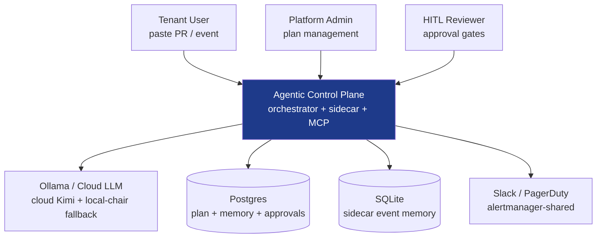
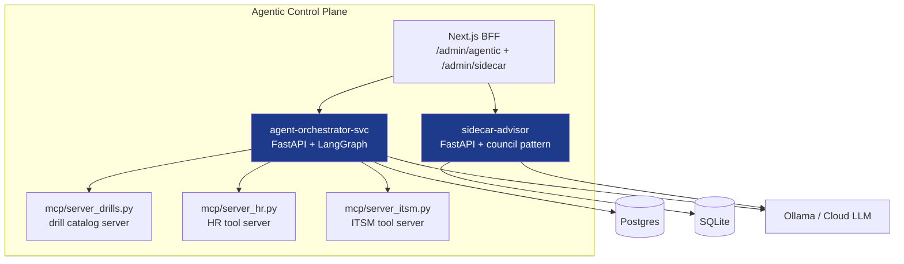
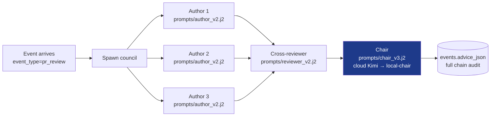

# C4 — Agentic control plane

> Focused C4 view of the agentic surface: orchestrator + sidecar +
> MCP servers + LangGraph + council pattern. Sibling to `C4-context.md`
> (broader DocuMind context) and `C4-container.md` (platform containers).
> The agentic surface deserves its own diagrams because the existing C4
> docs don't mention orchestrator / sidecar / MCP / council at all
> (verified: 0 hits across both files), and the agentic narrative is
> spread across 3 ADR-style markdown files without a structural surface.
>
> Locked by `mcp/tests/drill_c4_agentic_diagram.py`.

## L1 — Agentic system context

What the agentic surface looks like from outside it: who uses it, what
external systems it depends on, where the trust boundary sits.

### Actors

| Actor | What they do | Touches |
| --- | --- | --- |
| Tenant User | Pastes a PR / event for review | sidecar council |
| Platform Admin | Creates orchestrator projects + plan steps | orchestrator + LangGraph |
| HITL Reviewer | Signs off on approval gates mid-plan | orchestrator approval_automation |

### External dependencies

| System | Used for | Failure mode |
| --- | --- | --- |
| Ollama / Cloud LLM | Council generation + agent reasoning | 404 on cloud Kimi → local-chair fallback (commit `6831dee`) |
| Postgres | Durable orchestrator plan + memory + approvals | Connection lost → idempotent step retry |
| SQLite | Sidecar event memory (paste + advice + rating) | WAL contention → busy_timeout retries |
| Alertmanager webhook | Shared external delivery (per `docs/runbooks/alertmanager-webhook.md`) | Webhook 5xx → exponential backoff + circuit breaker |

### Trust boundary

The agentic plane is inside DocuMind's trust boundary; everything
external (Ollama, Postgres, SQLite, webhook) is treated as untrusted.
mTLS handles internal service-to-service per `/admin/service-mesh/deep`
when the mesh is active.

## L2 — Agentic containers

What sits inside the agentic plane: the four container roles and how
they connect.

### Containers

| Container | Code path | Owns |
| --- | --- | --- |
| Next.js BFF | `services/frontend/app/admin/agentic/`, `app/admin/sidecar/`, `app/api/v1/sidecar/` | Operator UI + BFF routes for both orchestrator and sidecar |
| agent-orchestrator-svc | `services/agent-orchestrator-svc/` | LangGraph plan execution + agent dispatch + Postgres memory |
| sidecar-advisor | `services/sidecar-advisor/` | Council pattern (3 authors + cross-reviewer + chair) + SQLite event memory |
| MCP server: drills | `mcp/server_drills.py` | Exposes drill.list / drill.run as MCP tools (scoped) |
| MCP server: HR | `mcp/server_hr.py` | Exposes hr.search_employees / hr.get_employee |
| MCP server: ITSM | `mcp/server_itsm.py` | Exposes ITSM tool surface |

### Container-to-container contracts

| Direction | Contract | Locked by |
| --- | --- | --- |
| BFF → orchestrator | REST + correlation_id header (per `/admin/api-gateway/deep`) | drill_sidecar_rating_route + per-route drills |
| BFF → sidecar | REST + correlation_id + Zod-validated body | drill_sidecar_rating_route + drill_sidecar_rating_metadata |
| orchestrator → MCP servers | MCP protocol with scope grants per `AgentRoleSpec.tool_grants` | drill_agent_registry_deep_dive (registry contract) |
| orchestrator → Postgres | postgres_store.py is the single SQL surface | numbered migrations 001-007 + drill_orchestrator_*  (planned) |
| sidecar → SQLite | memory.py wraps WAL connection | drill_sidecar_advisor_record_rating + drill_sidecar_rating_metadata |
| Both → Ollama | http_client with timeout + circuit breaker; local-chair fallback on 404 | drill_sidecar_pr_review_council + chair-fallback drill |

### Where state lives

| State | Container | Persistence |
| --- | --- | --- |
| Orchestrator plan + memory | agent-orchestrator-svc | Postgres (durable; survives restart per `/admin/memory/deep#orchestrator-project-memory`) |
| Sidecar event + rating | sidecar-advisor | SQLite (WAL; per `/admin/memory/deep#sidecar-event-memory`) |
| Agent registry | agent-orchestrator-svc | In-process AgentRoleSpec tuple (compile-time; per `/admin/agent-registry/deep`) |
| Council prompt registry | sidecar-advisor | Versioned prompt templates under `services/sidecar-advisor/prompts/` |

## L3 — Council pattern internals (representative component)

The L2 sidecar-advisor container expanded to its component-level
council pattern. (Other containers — orchestrator + MCP servers —
have their own L3 views in their respective deep-dives;
this section serves as the canonical L3 example.)

### Components

| Component | Code | What it does |
| --- | --- | --- |
| Event arrival | `advisor.py:handle_event` | Routes by event_type; only pr_review uses council |
| Author dispatch | `advisor.py:run_council` (parallel asyncio.gather) | 3 independent author proposals |
| Cross-reviewer | `advisor.py:run_role("reviewer", ...)` | Receives all proposals + retrieval; produces pushback |
| Chair synthesis | `advisor.py:run_role("chair", ...)` | Final advice with citations; cloud→local fallback on 404 |
| Citation propagation | every role's prompt template | `[chunk_id]` markers preserved through chain |
| Audit chain | `memory.py:record_event` writes `events.advice_json` | Full per-role positions + chair model used |

## Cross-references

| Where | What it covers |
| --- | --- |
| `C4-context.md` | DocuMind broader system context (no agentic detail) |
| `C4-container.md` | DocuMind platform containers (no agentic detail) |
| `docs/architecture/agentic-a2a-langgraph-fastapi-mcp.md` | Narrative ADR-style agentic architecture (predates this C4 file) |
| `docs/architecture/agentic-control-plane.md` (runbook) | Operator runbook for control plane |
| `/admin/agent-registry/deep` | Both registries (orchestrator agents + sidecar council) |
| `/admin/sidecar/deep` | Sidecar deep-dive |
| `/admin/agentic/control-plane` | Operator UI for plan + memory + approvals |
| `/admin/memory/deep` | Memory persistence (Postgres + SQLite) |
| `/admin/mcp/deep` | MCP server contract |
| `/admin/api-gateway/deep` | BFF → backend correlation_id contract |
| `ADR-008` | Transport breakers (vector + graph) |
| `ADR-009` | Worker auto-reject after N failures |
| `ADR-018` | Three-way work allocation |
| `ADR-022` | Convergent-work pattern |

## Drift detection

This file is locked by `mcp/tests/drill_c4_agentic_diagram.py`. The
drill enforces:

* L1 + L2 + L3 sections all present
* Mermaid `graph` blocks rendered (3 expected)
* Canonical containers cited (orchestrator + sidecar + MCP servers)
* Trust-boundary section present (without it the diagram doesn't
  answer "where does external trust end")
* Cross-reference table cites the deep-dive pages this file composes
  with (per §49)

If you refactor agentic architecture, update this file in the same PR
and re-run the drill; otherwise the structural surface drifts from the
narrative.
