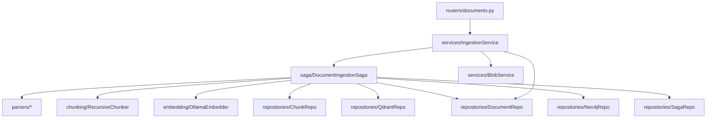
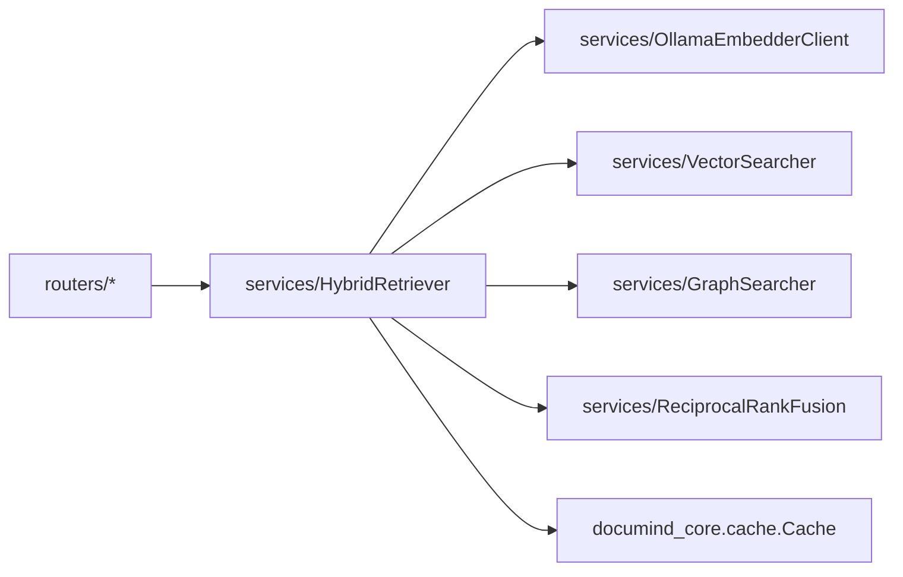
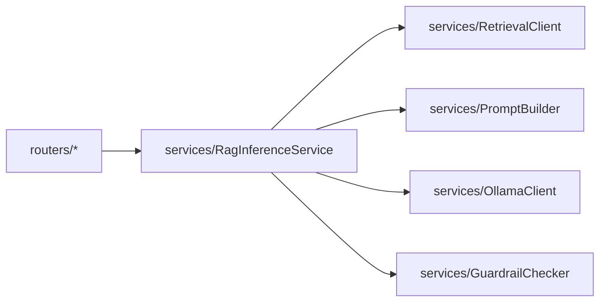

# C4 — Component view (Python services)

## ingestion-svc

## retrieval-svc

## inference-svc

Each component is one class file. Every constructor takes its dependencies
so you can pass fakes in tests. Re-read the saga from top to bottom and
you'll see exactly how the 67 design areas wire together in code.
