# C4 — Container view

```mermaid
graph LR
    FE[Frontend<br/>React + Vite] -->|HTTPS| GW[api-gateway<br/>Go]
    GW -->|gRPC| IDT[identity-svc<br/>Go]
    GW -->|HTTP| ING[ingestion-svc<br/>Python]
    GW -->|HTTP| RET[retrieval-svc<br/>Python]
    GW -->|HTTP| INF[inference-svc<br/>Python]
    GW -->|HTTP| EVA[evaluation-svc<br/>Python]
    GW -->|HTTP| GOV[governance-svc<br/>Go]

    ING --> PG[(PostgreSQL<br/>ingestion.*)]
    ING --> QD[(Qdrant)]
    ING --> NEO[(Neo4j)]
    ING --> MIN[(MinIO)]
    ING --> OLM[Ollama<br/>embeddings]

    RET --> QD
    RET --> NEO
    RET --> RED[(Redis<br/>cache)]
    RET --> OLM

    INF --> RET
    INF --> OLM
    INF --> RED

    EVA --> PG
    EVA --> RET
    EVA --> INF

    GOV --> PG
    FIN[finops-svc<br/>Go] --> PG
    OBS[observability-svc<br/>Go] --> PG

    GW -.->|events| KAF[(Kafka)]
    ING -.-> KAF
    RET -.-> KAF
    INF -.-> KAF
    EVA -.-> KAF
    GOV -.-> KAF
    FIN -.-> KAF
    OBS -.-> KAF
```

**Containers**

| Container | Language | Ports | Responsibility |
| --- | --- | --- | --- |
| frontend | React + Vite | 3000 | UI for user + admin |
| api-gateway | Go | 8080/9090 | Auth, routing, rate limit, CORS |
| identity-svc | Go | 8081/9091 | Tenants, users, JWT |
| ingestion-svc | Python | 8082/9092 | Parse → chunk → embed → graph → index |
| retrieval-svc | Python | 8083/9093 | Hybrid retrieval + reranking |
| inference-svc | Python | 8084/9094 | Prompt + Ollama + guardrails |
| evaluation-svc | Python | 8085/9095 | Offline + online eval, regression gate |
| governance-svc | Go | 8086/9096 | Policies, HITL, audit, flags |
| finops-svc | Go | 8087/9097 | Tokens, cost, budgets |
| observability-svc | Go | 8088/9098 | SLO + alert config |

**Data stores**

| Store | Used by | Why |
| --- | --- | --- |
| PostgreSQL (one schema per service) | every service | authoritative state, RLS, consistency |
| Qdrant | ingestion (W), retrieval (R) | vector semantic search |
| Neo4j | ingestion (W), retrieval (R) | entity-graph multi-hop retrieval |
| Redis | retrieval, inference, gateway | cache, rate-limit counters, session |
| Kafka | all services | event backbone (async) |
| MinIO | ingestion | raw document blob storage |

See [`C4-component.md`](C4-component.md) for internals of each Python service.
