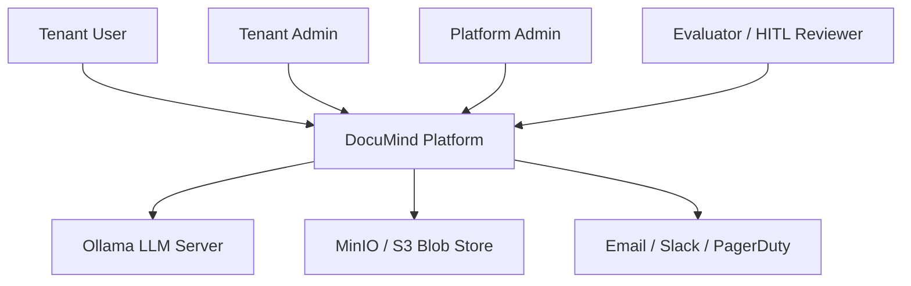

# C4 — Context view

**Actors**

| Actor | What they do |
| --- | --- |
| Tenant User | Uploads documents, asks questions |
| Tenant Admin | Manages users + API keys for one tenant |
| Platform Admin | Cross-tenant observability, FinOps, MCP |
| Evaluator / Reviewer | Reviews HITL queue, runs eval suites |

**External systems**

| System | What it's for |
| --- | --- |
| Ollama | Local LLM + embedding provider. Treated as an untrusted dependency. |
| MinIO | S3-compatible blob store for raw uploaded documents. |
| Email / Slack / PagerDuty | Out-of-band notifications (simulated locally). |

See [`C4-container.md`](C4-container.md) for the next level of detail.
