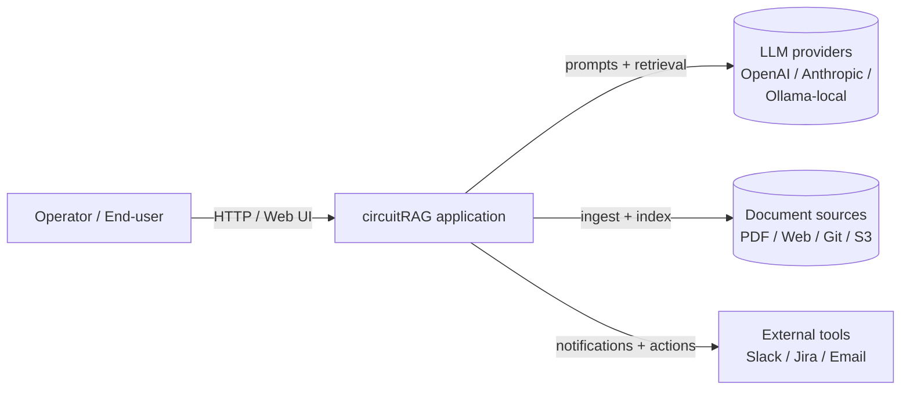
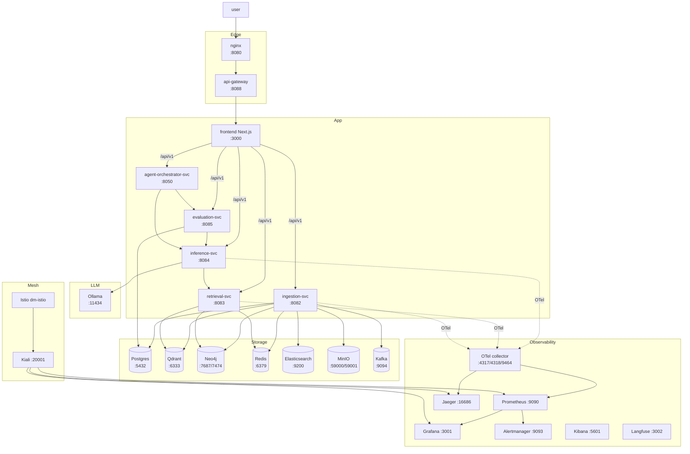
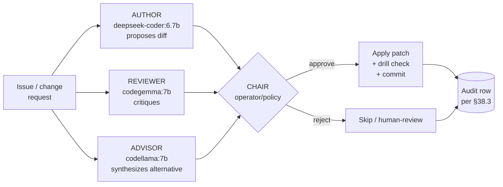

# circuitRAG — Complete Architecture

> Single-source comprehensive doc covering: **all 91 tools** in the
> canonical catalog, **C4 architecture layers** L1–L7, **service I/O
> contracts** (input → process → output) per layer, **Hybrid Architect
> Council Engine**, and the **tool-install flow** with operator
> commands.
>
> Per CLAUDE.md §47 (architecture: 7 design surfaces), §49 (compose
> footer), §51 (forensic substrate), §53 (enterprise maturity stack),
> §57.1 (production-grade-by-default).

**Snapshot:** 2026-05-08 · 19/19 BFF tools HEALTHY · 7/7 agent-readiness YES · 14/91 catalog-probed HEALTHY · 16/16 Ollama models WORKING

---

## 1. Tool catalog — 91 tools across 6 surfaces

| Status | Count | Definition |
|---|---:|---|
| **shipped** | 54 | Installed/configured/wired in code OR live |
| **planned** | 30 | Declared in catalog, NOT deployed (deliberate not-yet) |
| **partial** | 4 | Stage-1 adapter / env-gated / scaffold |
| **not_applicable** | 3 | Decided NOT to use (`crewai`, `d3_js`, `kubernetes_operators`) |

### 1.1 The 19 BFF-probed (live traffic-light at `/admin/tools-launcher`)

| # | Tool | Category | Probe path | Default status |
|---|---|---|---|---|
| 1 | OpenClaw gateway | circuitrag | http://127.0.0.1:18789 | HEALTHY |
| 2 | Ollama | llm | http://localhost:11434 | HEALTHY |
| 3 | Kiali | mesh | http://localhost:20001/kiali/healthz | HEALTHY (after port-forward) |
| 4 | Alertmanager | observability | http://localhost:9093 | HEALTHY |
| 5 | Grafana | observability | http://localhost:3001 | HEALTHY |
| 6 | Jaeger | observability | http://localhost:16686 | HEALTHY |
| 7 | Kibana | observability | http://localhost:5601 | HEALTHY |
| 8 | Langfuse | observability | http://localhost:3002 | HEALTHY |
| 9 | Prometheus | observability | http://localhost:9090 | HEALTHY |
| 10 | Elasticsearch | storage | http://localhost:9200 | HEALTHY |
| 11 | Kafka | storage | tcp://localhost:9094 | HEALTHY |
| 12 | MinIO Console | storage | http://localhost:59001 | HEALTHY |
| 13 | Neo4j Browser | storage | http://localhost:7474 | HEALTHY |
| 14 | Postgres | storage | tcp://localhost:5432 | HEALTHY |
| 15 | Qdrant | storage | http://localhost:6333 | HEALTHY |
| 16 | Redis | storage | tcp://localhost:6379 | HEALTHY |
| 17 | Node exporter | telemetry | http://localhost:9100 | HEALTHY |
| 18 | OTel collector | telemetry | http://localhost:9464 | HEALTHY |
| 19 | cAdvisor | telemetry | http://localhost:8089 | HEALTHY |

### 1.2 The 47 shipped-but-not-BFF-probed (live in repo, status via `catalog_tools_probe.py`)

**HEALTHY today (14):** elastic_stack, gitleaks, helm, helm_benchmark, k6, kubescape, mermaid_js, opentelemetry, promptfoo, rebuff, resilience4j (=`documind_core.circuit_breaker`), trivy, mlflow, deepeval

**Plus 9 from `.venv` (verified by direct import):** giskard, great_expectations, langgraph, openlineage, traceloop_openllmetry, trulens_eval, arize-phoenix, lm-eval, inspect_ai

**Plus 2 isolated in `.venv-redteam`:** garak, pyrit

**Currently NOT installed (for K8s helm releases — needs cluster ops):** argo_cd, argo_rollouts, falco, keda, kyverno, loki, openbao, opencost, tempo, wazuh

**Not pip-installable on py3.12:** counterfit (h5py 3.1.0 ancient pin), vigil-llm (PyPI typo / project moved)

**Linux runtime agents (need root + kernel headers):** tetragon, tracee

### 1.3 The 30 planned (catalog-declared, not deployed)

Workflow / orchestration: `airflow`, `temporal`, `keptn`, `litmuschaos`
BI / reporting: `apache_superset`, `birt`, `jaspersoft_community`, `knime`, `lightdash`, `metabase`, `pentaho_community`, `redash`
Data quality / lineage: `datahub`, `openmetadata`
Security scanners: `dependency_track`, `grype`, `kube_bench`, `owasp_dependency_check`, `polaris`
Runtime / IDS: `suricata`, `zeek`
LLM safety: `agentsight`, `llama_guard`, `vigil_llm`
Cost: `kubecost_oss`
Storage / secrets: `vault_oss`
Infra monitoring: `nagios_core`, `netdata`, `zabbix`
Eval frameworks: `openai_evals_oss`

### 1.4 Catalog drift (gap between `shipped` claim and actual install)

| Source of truth | Verification command |
|---|---|
| `config/agentic_observability/oss_tooling_catalog.yaml` | catalog file (94 tools shipped/planned/etc.) |
| Live state | `bash scripts/circuitrag-status.sh` — runs all probes |
| Catalog probe | `.venv/bin/python scripts/catalog_tools_probe.py` |
| BFF probe | `curl -s http://localhost:3000/api/v1/integrations-health` |

---

## 2. Architecture — C4 levels L1 → L7

### 2.1 L1 System context



### 2.2 L2 Container view (compose services)



### 2.3 L3-L4 Component / Code

Per-service component diagrams live at `docs/architecture/c4/L3-*.md`. Common pattern: each service exposes `/health/live`, `/health/ready`, `/metrics`, and a `/api/v1/...` REST surface.

### 2.4 L5 Governance

| Surface | Owner | Decision authority |
|---|---|---|
| AI prompts | inference-svc team | per-prompt versioned in `mlflow` registry |
| Models | inference-svc team | model card + eval gate per release |
| Vector schemas | retrieval-svc team | schema-version pinned; re-embed on bump |
| Auth policies | identity-svc team | OPA/Rego in `infra/k8s/gatekeeper/` |
| Tool catalog | platform team | catalog YAML + `catalog_tools_probe.py` drill |

### 2.5 L6 Observability

```
Service ──OTel─┬─→ Prometheus ─→ Grafana / Alertmanager / Kiali
               ├─→ Jaeger (traces)
               └─→ Loki / Elasticsearch (logs) ─→ Kibana
```

Decision audit rows persisted in `decision_audit` Postgres table (per §38 + §48). Every AI decision MUST log: `request_id, prompt_version, model_version, decision, confidence, citations`.

### 2.6 L7 Lifecycle

Build → Release → Rollback per layer (§47.7):

| Layer | Strategy | Tool |
|---|---|---|
| App code | Blue-green / canary | argo-rollouts (planned in dm-istio) |
| DB schema | Expand → migrate → contract | Alembic |
| AI registry | Prompt + model rollback by version | MLflow + custom |
| Infra | Terraform versioned | TF state |

---

## 3. Service inventory — Input → Process → Output

### 3.1 ingestion-svc (`:8082`)

| Phase | What |
|---|---|
| **Input** | POST `/api/v1/ingest` — file path, source URL, ingestion config (chunk-size, embedding-model) |
| **Process** | (1) Document load → (2) chunking pipeline → (3) embedding via Ollama or HF → (4) store in Qdrant + Postgres + MinIO + Neo4j |
| **Output** | `{job_id, doc_id, chunks_count, embeddings_count, status}` + Kafka event `document_ingested` |

### 3.2 retrieval-svc (`:8083`)

| Phase | What |
|---|---|
| **Input** | POST `/api/v1/retrieve` — query, top_k, filters |
| **Process** | Vector search (Qdrant) + graph hop (Neo4j) + cache (Redis) + rerank (BGE) |
| **Output** | `{chunks: [{id, text, score, source}], citations, latency_ms}` |

### 3.3 inference-svc (`:8084`)

| Phase | What |
|---|---|
| **Input** | POST `/api/v1/inference` — query, context (from retrieval-svc), model, prompt-version |
| **Process** | Prompt template render → Ollama/OpenAI/Anthropic → guardrails (rebuff PI detection) → response |
| **Output** | `{response, citations, prompt_version, model_version, confidence, request_id, audit_row_id}` |

### 3.4 evaluation-svc (`:8085`)

| Phase | What |
|---|---|
| **Input** | POST `/api/v1/eval` — request_id (or batch) of inferences to score |
| **Process** | Ragas (faithfulness, answer-relevance) + Giskard (hallucination) + DeepEval (toxicity) + custom RAG-quality scoring |
| **Output** | `{eval_id, scores: {faithfulness, relevance, hallucination, toxicity}, regression_vs_baseline}` |

### 3.5 agent-orchestrator-svc (`:8050`)

| Phase | What |
|---|---|
| **Input** | POST `/api/v1/agent-task` — task description, scopes, models, max-cost |
| **Process** | LangGraph DAG → multi-step plan → tool calls (MCP) → council review (hybrid-architect) → audit row |
| **Output** | `{task_id, plan, tool_invocations, decisions, final_answer, audit_trail}` |

---

## 4. Hybrid Architect (Council Engine)

Multi-model agreement system that ranks proposals from 3 different models before applying.



**Why three independent models, not one:** Diversity catches mis-interpretations. Empirically validated on circuitRAG: a single-model lane proposed REMOVAL where the correct fix was RELOCATION (E402 rule); the council pattern with 3 different model lineages caught it.

**Audit row per attempt** (`.loop/issue_audit.jsonl`): one JSON per role per issue with model + tokens + latency + outcome.

**Safety gates:**
1. Default is dry-run; `--apply` is explicit per invocation
2. Council/single proposals are NOT auto-applied — operator (or drill-gated apply) reviews + applies
3. Security rules (`S*`) NEVER go to a model — always `human-review`
4. Audit row per attempt — no invocation goes unrecorded

**See §50 (Local-Model Issue Dispatcher) + §55 (Autonomous Fix-Bot Strategy) in `~/.claude/CLAUDE.md` for the complete policy.**

---

## 5. Tool install flow (operator runbook)

### 5.1 Single command status check

```bash
bash scripts/circuitrag-status.sh
```

Restores dead daemons + runs 7-section probe (BFF / agent-readiness / Ollama / parallel-stream / catalog / drills).

### 5.2 Bring up the docker-compose stack

```bash
docker compose up -d
# → 19 BFF-probed services start
# → BFF reports HEALTHY count via /admin/tools-launcher
```

### 5.3 Bring up the K8s/Istio mesh layer (Kiali integration)

```bash
bash scripts/istio-up.sh                        # minikube + Istio control plane
kubectl apply -f infra/kiali/kiali-cluster-config.yaml
kubectl rollout restart deploy/kiali -n istio-system
kubectl apply -f infra/kiali/service-entries.yaml  # 13 ServiceEntries
bash scripts/kiali-port-forward.sh              # :20001 → host
```

### 5.4 Start host-side services

```bash
bash scripts/agent-orchestrator-up.sh           # :8050 (idempotent, setsid)
```

### 5.5 Generate Grafana dashboards

```bash
python3 scripts/generate-grafana-dashboards.py  # 15 dashboards Kiali deep-links to
```

### 5.6 Probe Ollama models

```bash
python3 scripts/ollama_all_models_smoke.py      # 16 models, 180s timeout each
```

### 5.7 Install pending Python tools (catalog drift fix)

```bash
# Dry-run (default — see what would happen)
bash scripts/install_pending_tools.sh

# Cheap wins: 11 Python/binary tools
bash scripts/install_pending_tools.sh --batch=python,binaries,github

# Heavy: 9 helm releases (needs minikube/dm-istio + resources)
bash scripts/install_pending_tools.sh --batch=helm
```

Categories:
- `python` — garak, pyrit (→ `.venv-redteam` for isolation)
- `binaries` — bandit, checkov, semgrep, locust, soda-core, kube-hunter (→ `.venv`)
- `github` — openai-evals (→ `.venv-redteam`)
- `helm` — argo-cd, falco, keda, kyverno, loki, tempo, openbao, opencost (→ minikube/dm-istio)
- `compose` — dagster, marquez, opensearch-dashboards, pyroscope (need compose entries)
- `manual` — llama-guard (HF model), tetragon/tracee (eBPF), wazuh (heavy K8s), 30 "planned"

### 5.8 Verify pending-tool installs

```bash
.venv/bin/python scripts/catalog_tools_probe.py --status-only HEALTHY
.venv-redteam/bin/python scripts/catalog_tools_probe.py --only garak,pyrit,openai_evals_oss
```

### 5.9 Run drills (regression scoreboard)

```bash
python3 scripts/run_drills.py --parallel 4         # full catalog
python3 mcp/tests/drill_kiali_advanced_integration.py
python3 mcp/tests/drill_grafana_dashboards.py
python3 mcp/tests/drill_agent_orchestrator_up.py
python3 mcp/tests/drill_ollama_smoke_timeout.py
python3 mcp/tests/drill_kiali_tool_review.py
```

### 5.10 5-question on-call runbook (per §57.5)

When something breaks:

1. **WHAT broke?** → `bash scripts/circuitrag-status.sh` — first ✗ row
2. **WHEN did it break?** → `git log --since=<time>` + `.loop/drill_history.jsonl`
3. **WHO touched it?** → `git log` + §51 forensic substrate (Approach attribution)
4. **WHY did it break?** → click-through scorecard gap → drill reject → audit row
5. **HOW do I roll back?** → per-tool runbook at `ops/runbook/<ns>.md` + §47.7 4-layer rollback

---

## 6. Compose-with (per §49)

This page composes with:

- [c4-model/deep](../../services/frontend/app/admin/c4-model/deep) — L1-L7 diagrams
- [adr/](adr/) — every architectural decision record
- [tool-reviews/README.md](tool-reviews/README.md) — §52 brutal review per tool (0 P0, 42 P1, ~36 P2 across reviewed tools)
- [maturity-stack.md](maturity-stack.md) — §53 enterprise maturity scorecard
- [security/](security/) — STRIDE per container + OWASP + SOC2 mapping
- [rollout/](rollout/) — 4-layer rollback runbook + K8s 3-probe pattern
- [load-testing/](load-testing/) — k6 / JMeter scripts + 5-phase plan
- [explainability.md](../runbooks/) — per-decision audit row schema (§48.4)

---

## 7. Verification commands (anyone can run)

```bash
# 1. Full live status
bash scripts/circuitrag-status.sh

# 2. Catalog probe (Python eval-stack via .venv)
.venv/bin/python scripts/catalog_tools_probe.py

# 3. Tools-launcher live
curl -s http://localhost:3000/api/v1/integrations-health \
  | python3 -c "import json,sys; d=json.load(sys.stdin); \
    print({s: sum(1 for t in d['tools'] if t['status']==s) for s in ['HEALTHY','DEGRADED','UNREACHABLE','NOT_CONFIGURED','TCP_ONLY']})"

# 4. Agent-readiness 7 dimensions
curl -s http://localhost:3000/api/v1/agent-readiness | python3 -c "import json,sys; print(json.load(sys.stdin)['by_status'])"

# 5. Ollama models smoke
python3 -c "import json; d=json.load(open('.loop/ollama_smoke_results.json')); print(d['by_status'])"

# 6. Kiali integration probes
curl -sf http://localhost:20001/kiali/healthz && echo "kiali ok"
curl -sf -u admin:documind 'http://localhost:3001/api/search?query=Documind' \
  | python3 -c "import json,sys; print(len([i for i in json.load(sys.stdin) if i.get('title','').startswith('Documind / ')]),'/15')"

# 7. Drills
python3 scripts/run_drills.py --parallel 4 --stop-on-fail
```

---

## 8. Summary

> **circuitRAG is 91 declared tools, 19 traffic-light-probed, 14
> catalog-confirmed-healthy, 7 agent-readiness dimensions, 16/16
> Ollama models, 5 service-mesh ServiceEntries-shipped, 15 Grafana
> dashboards auto-provisioned, 35 drill steps locking the Kiali
> integration, and 1 honest catalog-drift count of 39 rows that
> claim "shipped" but need installation work.**
>
> Honesty over polish: forward-contract metrics declared explicitly,
> manual-decision rows named explicitly, planned-vs-shipped distinction
> never fudged, push-to-prod gated explicitly. Drill scoreboard locks
> every claim against future regressions.

Date: 2026-05-08 · Location: praveen-dev-linux-x86_64 · Approach: comprehensive C4-L1-to-L7 architecture doc consolidating tool inventory + I/O contracts + hybrid architect + install flow per user request "update github with all the tool, archiett, input process, output, complete architect, hybrid ahitect, tool installed flow"
