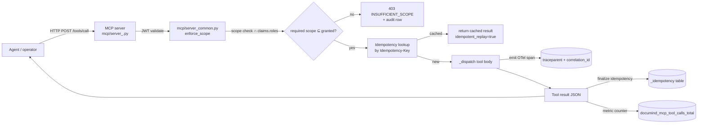
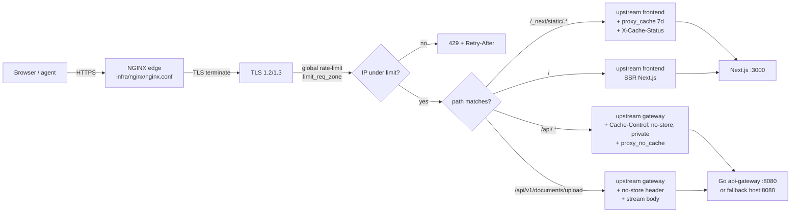
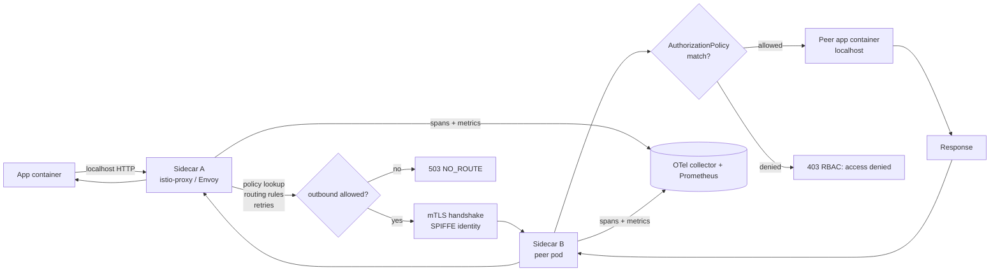
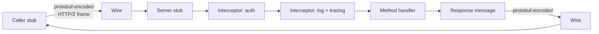
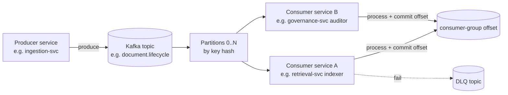
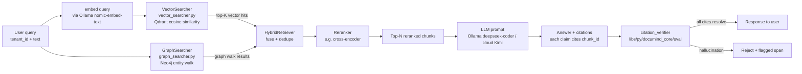
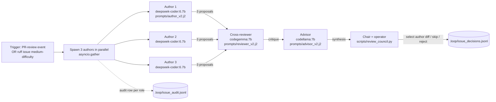
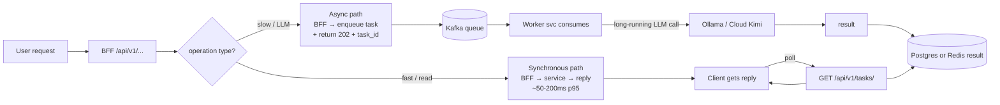

# Per-module flow diagrams — input / process / output

> One flowchart per module showing what goes in, what processing
> happens, and what comes out. Each diagram is grounded in the
> shipped code path; absence here = absence in repo.
>
> Locked by `mcp/tests/drill_module_flows.py`.

## 1. MCP server (per-namespace tool host)



| Layer | Input | Output |
| --- | --- | --- |
| HTTP handler | `{name, arguments, tenant_id, correlation_id}` + JWT | tool result JSON |
| Auth | Authorization header | (claims, roles) or 401 |
| Scope check | (required_scopes, claims.roles) | OK or 403 |
| Idempotency | Idempotency-Key + payload-fingerprint | (new, done, in-progress, conflict) |
| Tool dispatch | (name, args, ctx) | tool_result |
| Audit | (actor, tool, outcome, latency) | row in audit_log_partitioned |

Code: `mcp/server_common.py` + `mcp/server_drills.py` / `mcp/server_hr.py` / `mcp/server_itsm.py`.

## 2. Load balancer (NGINX)



| Layer | Input | Output |
| --- | --- | --- |
| TLS terminate | encrypted bytes | cleartext HTTP |
| Rate limit | client IP + zone state | allow / 429 |
| Route match | URL path | upstream selection |
| Cache header | per-route directive | `Cache-Control: no-store, private` (api) or `expires 7d` (static) |
| Upstream proxy | request + correlation_id header | response from gateway/frontend |

Code: `infra/nginx/nginx.conf` + drill `drill_cdn_cache_invariants.py`.

## 3. API gateway (Go)

```mermaid
flowchart LR
  nginx[NGINX] -->|HTTP/2| gw[api-gateway :8080<br/>services/api-gateway/cmd/main.go]
  gw -->|stamp| cid[CorrelationID middleware<br/>uuid v4 server-generated]
  cid -->|never accept client value| drop[strip X-Correlation-Id from req]
  drop --> sec[SecurityHeaders middleware<br/>CSP / HSTS / X-Frame]
  sec --> log[Logger middleware<br/>structured JSON log]
  log --> cors[CORS middleware]
  cors --> body[BodyLimit middleware<br/>1MB default; 50MB upload]
  body --> jwt[JWT middleware<br/>RS256 + JWKS cache]
  jwt -->|valid| rl[RateLimit middleware<br/>Redis sliding-window per tenant_id]
  jwt -->|invalid| 401[401 INVALID_TOKEN<br/>+ envelope w/ correlation_id]
  rl -->|under limit| role[RequireRole middleware<br/>admin routes only]
  rl -->|over limit| 429[429 + Retry-After]
  role --> proxy[Reverse proxy<br/>internal/proxy/proxy.go]
  proxy --> backend[(internal services<br/>sidecar / orchestrator / inference / retrieval)]
```



| Layer | Input | Output |
| --- | --- | --- |
| CorrelationID | (request) | request + X-Correlation-Id (server-generated) |
| SecurityHeaders | response | response + 5 security headers |
| BodyLimit | request body bytes | request OR 413 |
| JWT | Authorization Bearer + JWKS | (claims, roles) OR 401 |
| RateLimit | tenant_id + Redis bucket | allow OR 429+Retry-After |
| Proxy | (request, downstream URL) | downstream response |

Code: `services/api-gateway/cmd/main.go` + `internal/middleware/{jwt,ratelimit,bodylimit,middleware}.go`.

## 4. Circuit breaker

```mermaid
flowchart LR
  caller[any service] -->|allow?| cb[CircuitBreaker<br/>libs/py/documind_core/circuit_breaker.py]
  cb --> state{state?}
  state -->|CLOSED| go[allow → call dependency]
  state -->|OPEN, recovery_timeout NOT elapsed| ff[fast-fail<br/>return False]
  state -->|OPEN, recovery_timeout elapsed| ho[transition → HALF_OPEN<br/>allow probe]
  state -->|HALF_OPEN, slot available| probe[allow probe call]
  state -->|HALF_OPEN, slots full| ff
  go -->|success| rs[record_success<br/>reset failures = 0]
  go -->|failure| rf[record_failure<br/>failures += 1]
  rf -->|failures ≥ threshold| open[state = OPEN<br/>opened_at = now]
  probe -->|success| close[state = CLOSED]
  probe -->|failure| open
  rs & open & close -->|metric| prom[(documind_circuit_breaker_state{name})]
```

| Layer | Input | Output |
| --- | --- | --- |
| `allow()` | (state, threshold, recovery_timeout, half_open_max) | True (proceed) OR False (fast-fail) |
| `record_success()` | () | failures reset; HALF_OPEN → CLOSED |
| `record_failure()` | () | failures++; CLOSED → OPEN at threshold |
| State transition | (failures, time, threshold, recovery_timeout) | new state |
| Prometheus | (name, state) | gauge value 0/1/2 |

Code: `libs/py/documind_core/circuit_breaker.py` + `breakers.py` (5 specialized variants). ADR-002 + drill_breaker_transitions + drill_retrieval_transport_breaker.

## 5. Istio sidecar (when mesh active)



| Layer | Input | Output |
| --- | --- | --- |
| Outbound proxy | app HTTP request | retry-policy + mTLS-wrapped traffic |
| mTLS | identity (SPIFFE) | encrypted authenticated channel |
| AuthorizationPolicy | (source SA, destination service) | ALLOW / DENY |
| Telemetry | every hop | OTel spans + Prometheus counters |

Status: **CONFIG SHIPPED, MESH NOT RUNNING by default**. Operator brings up via `bash scripts/istio-up.sh`. Code: `infra/istio/{00-namespace,20-peer-authentication,30-virtualservice,40-destinationrule,50-authorization,60-telemetry}.yaml`.

## 6. gRPC (when used; primarily host ↔ Ollama uses HTTP)



| Layer | Input | Output |
| --- | --- | --- |
| Stub | (typed request struct) | typed response struct |
| Interceptor chain | (request, ctx) | (request, ctx) annotated |
| Handler | typed request | typed response OR gRPC error code |

**Status**: this repo's primary inter-service is HTTP+JSON. gRPC is mentioned in design docs but not actively wired. The qdrant-client uses gRPC under the hood (port 6334) — invisible at app layer. Code path: `services/retrieval-svc/app/services/vector_searcher.py` (consumes Qdrant gRPC client).

## 7. Kafka event flow



| Layer | Input | Output |
| --- | --- | --- |
| Produce | (key, value, headers) | offset + ack |
| Partition assignment | hash(key) | partition number |
| Consume | offset + max_records | record batch |
| Process | record | side effect + commit |
| DLQ | failed record + error | row in DLQ topic |

Code: ingestion-svc + retrieval-svc + governance-svc consume Kafka via `aiokafka`. Compose: kafka + zookeeper containers running.

## 8. RAG (vector + graph hybrid retrieval)



| Layer | Input | Output |
| --- | --- | --- |
| Embed | text | float[d] vector |
| Vector search | (query_vec, tenant_id, top_k) | hits with chunk_id + score |
| Graph search | (entity, hop_pattern, tenant_id) | path nodes + edges |
| Fusion | (vec_hits, graph_paths) | merged candidate set |
| Rerank | candidate set + query | top-N |
| Generate | (prompt, top-N chunks) | answer text + citations |
| Verify | (answer, retrieval_set) | resolved citations + hallucination spans |

Code: `services/retrieval-svc/app/services/{vector_searcher,graph_searcher}.py` + `HybridRetriever`. Drills: `drill_hybrid_retrieve` + `drill_retrieval_tenant_isolation`.

## 9. Vectorless RAG (BM25 over Elasticsearch — wrapper shipped, integration PLANNED)

```mermaid
flowchart LR
  q[User query] --> es[ElasticSearcher<br/>elastic_searcher.py]
  es --> conn{ES client available?}
  conn -->|no| empty[return [] graceful]
  conn -->|yes| bm25[ES bool query<br/>match: content<br/>filter: term tenant_id]
  bm25 --> idx[(documind_documents index<br/>NOT YET POPULATED)]
  idx --> hits[BM25-scored hits]
  hits -->|map to chunk shape| out[list of chunks]
  hits -->|no hits / index empty| empty
```

| Layer | Input | Output |
| --- | --- | --- |
| Lazy import | (elasticsearch client) | client OR raise→empty |
| Bool query | (query, tenant_id, top_k) | ES response JSON |
| Hit map | (resp.hits.hits) | normalized chunk dicts |

Status: **wrapper ✅ shipped + drill-locked; ingestion pipeline ❌ NOT WIRED → search returns []**. Code: `services/retrieval-svc/app/services/elastic_searcher.py` + drill_elastic_searcher_skeleton.

## 10. Council pattern (3-model agent collaboration)



| Layer | Input | Output |
| --- | --- | --- |
| Spawn | event_type + content + retrieval_set | 3 author proposals |
| Cross-review | (proposals, retrieval_set) | critique text |
| Advisor | (proposals, critique, retrieval_set) | synthesis text |
| Chair (operator) | full chain | applied / skip / reject |
| Audit | every role's output | JSONL row in issue_audit.jsonl |

Code: `services/sidecar-advisor/advisor.py` (in-service council) + `scripts/issue_dispatcher.py --council` + `scripts/review_council.py` (review). Drill: `drill_sidecar_pr_review_council` + `drill_issue_dispatcher_format`.

## 11. Sync vs async request paths



| Layer | Sync | Async |
| --- | --- | --- |
| Client | request → block until reply | request → 202 + task_id; poll later |
| BFF | direct call to service | enqueue Kafka event |
| Worker | n/a | consume Kafka, run task, write result |
| Latency | 50-500ms | seconds-to-minutes |
| Cost | latency-bound | throughput-bound |

Code: synchronous path = nearly all BFF → service flows. Async path = ingestion (chunking + embedding via Kafka) + agent-orchestrator long-running plans.

## Where each module's code lives

| Module | Code path | Drill |
| --- | --- | --- |
| MCP server | `mcp/server_*.py` + `server_common.py` | `drill_mcp_*.py` |
| Load balancer | `infra/nginx/nginx.conf` | `drill_cdn_cache_invariants.py` |
| API gateway | `services/api-gateway/cmd/main.go` + `internal/middleware/*` | `drill_api_gateway_compose.py` |
| Circuit breaker | `libs/py/documind_core/{circuit_breaker,breakers}.py` | `drill_breaker_transitions.py` + `drill_retrieval_transport_breaker.py` |
| Istio | `infra/istio/*.yaml` | `drill_minikube_istio_setup.py` |
| Kafka producer | services using `aiokafka.AIOKafkaProducer` | per-service drill |
| Kafka consumer | services using `aiokafka.AIOKafkaConsumer` | per-service drill |
| RAG (vector+graph) | `services/retrieval-svc/app/services/{vector,graph}_searcher.py` | `drill_hybrid_retrieve.py` + `drill_retrieval_tenant_isolation.py` |
| Vectorless RAG | `services/retrieval-svc/app/services/elastic_searcher.py` | `drill_elastic_searcher_skeleton.py` |
| Council | `services/sidecar-advisor/advisor.py` + `scripts/issue_dispatcher.py --council` | `drill_sidecar_pr_review_council.py` + `drill_issue_dispatcher_format.py` |

## Composes with

- `docs/STATUS.md` — what's actually shipped vs PLANNED
- `docs/MISSING.md` — gap to top-1%
- `docs/runbooks/component-trust.md` — verify each module via commands
- `docs/architecture/C4-context.md` + `docs/architecture/C4-container.md` + `docs/architecture/C4-component.md` + `docs/architecture/C4-agentic.md` — 4 C4 levels
- `infra/load-test/k6/baseline.js` — driving load through these flows

## Brutal rule

> A module without an input/process/output diagram is a black box.
> Every claim above is grounded in a code path + drill — if a module
> appears here without code or drill, the diagram is aspirational
> and should be marked PLANNED.
