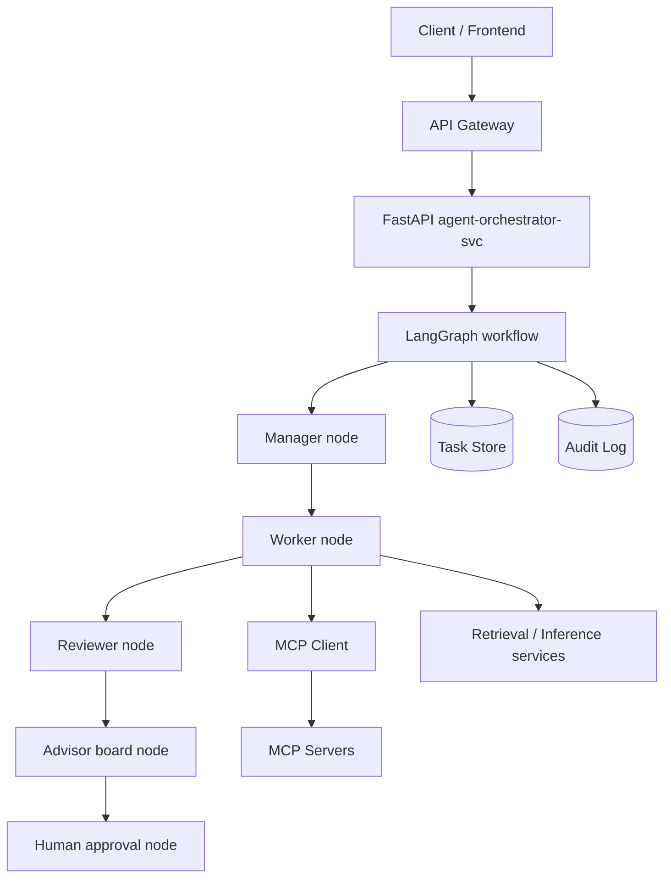

# LangGraph + FastAPI + MCP Version

This is the concrete stack recommendation for this repo.

## 1. Stack

- FastAPI
- LangGraph
- MCP client/server
- `documind_core.agent_board`
- `documind_core.audit`
- `documind_core.observability`
- Postgres or in-memory task store

## 2. Architecture



## 3. LangGraph node design

Recommended nodes:

- `manager_plan`
- `worker_execute`
- `review_output`
- `advisory_board`
- `human_gate`
- `finalize`

Recommended conditional edges:

- `needs_review`
- `needs_board`
- `needs_human`
- `retry_or_finish`

## 4. FastAPI responsibility

FastAPI should do:

- validate request
- create task ID
- attach correlation/tenant context
- invoke graph
- expose approval and status endpoints

FastAPI should not do:

- embed orchestration logic directly in route handlers

## 5. MCP responsibility

MCP should do:

- tool execution
- scope enforcement
- idempotency
- draft fallback
- external side effects

LangGraph nodes should treat MCP as:

- a tool boundary
- not a place to store orchestration state

## 6. Advisory board

Use `documind_core.agent_board.AgentBoard` inside one LangGraph node.

That node can run:

- author drafts
- reviewer critiques
- final advisor synthesis

This is better than manually coding N reviewer loops in the graph.

## 7. Human approval pattern

Human approval should be a graph pause.

Pattern:

1. node sets `requires_human_approval = true`
2. task status becomes `waiting_for_approval`
3. route returns current task state
4. human calls `/approve` or `/reject`
5. graph resumes from decision node

## 8. Minimal state shape

```python
class AgenticState(TypedDict, total=False):
    task_id: str
    tenant_id: str
    goal: str
    status: str
    risk_level: str
    plan: list[str]
    worker_output: str
    reviewer_notes: list[str]
    advisor_summary: str
    requires_human_approval: bool
    approved: bool
    confidence: float
    next_action: str
    audit_events: list[dict]
```

## 9. Why this stack fits DocuMind

Because the repo already has:

- FastAPI services
- MCP integrations
- audit logging
- circuit-breaker patterns
- a multi-agent board abstraction

So this stack extends existing patterns instead of replacing them.
