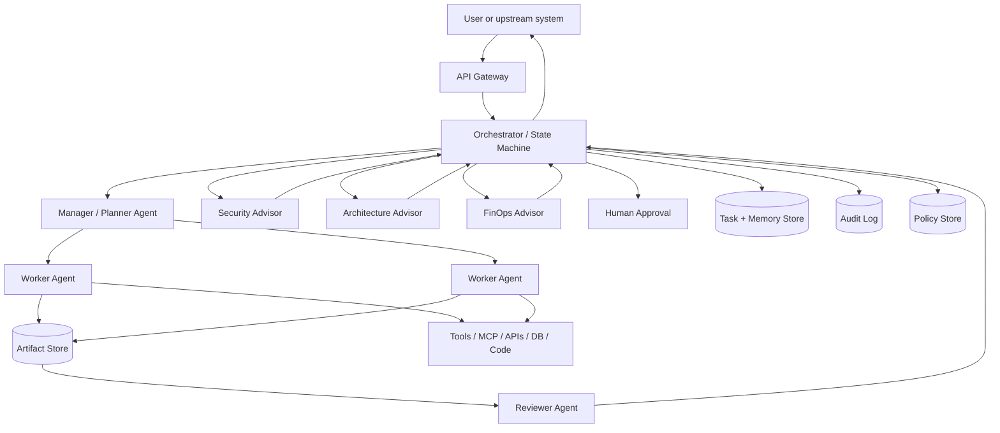
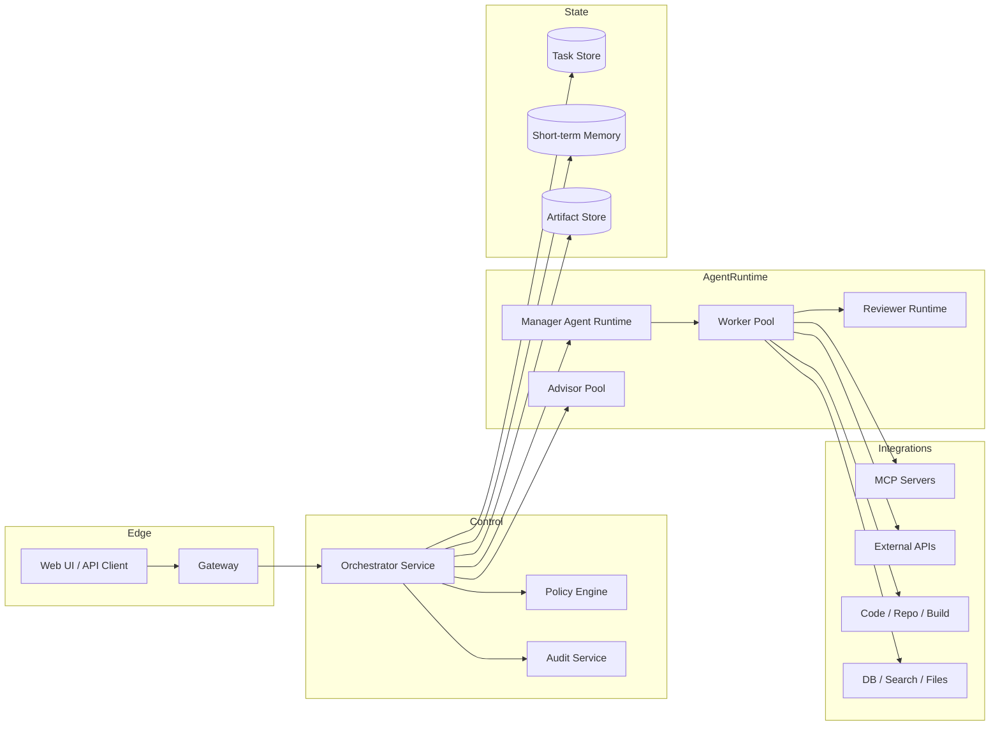
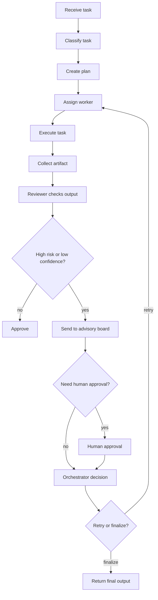
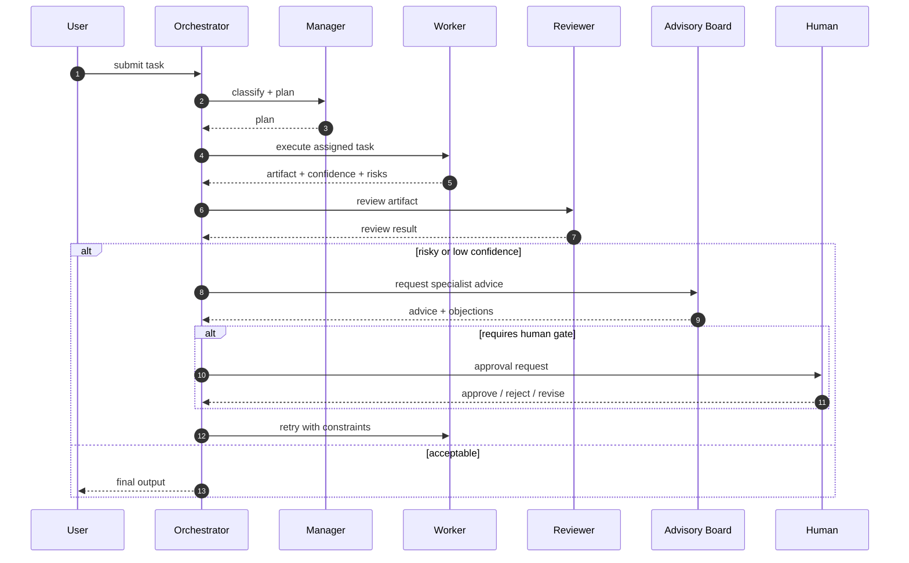

# Agentic Advisory Board + A2A Architecture

This note describes a controlled multi-agent system for tasks that require:

- execution
- review
- specialist advice
- bounded agent-to-agent coordination
- human approval for risky actions

It is not a "many agents talking freely" design.

The control plane is the important part.

## 1. Core idea

Use five role classes:

1. Manager
2. Worker
3. Reviewer
4. Advisory board
5. Orchestrator

Rule:

- workers do
- reviewers check
- advisors warn
- orchestrator decides

## 2. High-level architecture



## 3. C4-style container view



## 4. Execution flow



## 5. Sequence diagram



## 6. Agent-to-agent message contract

Use structured messages only.

```json
{
  "task_id": "task_123",
  "message_id": "msg_456",
  "from_agent": "manager",
  "to_agent": "worker_code",
  "message_type": "work_request",
  "goal": "Implement tenant-safe cache invalidation",
  "input": {
    "files": ["libs/py/documind_core/cache.py"],
    "constraints": ["no breaking API changes", "must preserve audit fields"]
  },
  "confidence": 0.82,
  "risks": ["cache-key format drift"],
  "next_action": "return patch plus tests"
}
```

Recommended `message_type` values:

- `plan`
- `work_request`
- `work_result`
- `review_result`
- `advice`
- `approval_request`
- `approval_response`
- `reject`
- `retry`
- `final`

## 7. Role definitions

### Manager

Responsibilities:

- classify request
- build task plan
- split work into bounded subtasks
- assign correct worker type
- define success criteria

Should not:

- directly execute all work
- override policy

### Worker

Responsibilities:

- perform one bounded task
- call tools
- produce artifact
- report confidence and risks

Should not:

- silently redefine the task
- approve its own output

### Reviewer

Responsibilities:

- verify requirements
- detect regressions
- detect missing tests
- reject low-quality work

Should not:

- become the main executor

### Advisory board

Good advisor types:

- security
- architecture
- compliance
- FinOps
- data governance

Responsibilities:

- evaluate from one specialist lens
- return structured objections or conditions

Should not:

- execute the task unless explicitly re-tasked

### Orchestrator

Responsibilities:

- maintain state
- enforce max steps
- enforce budget and timeout
- enforce tool permissions
- decide approve / retry / escalate
- write audit trail

## 8. Required state stores

### Task store

Tracks:

- task status
- owner
- retry count
- timestamps
- final disposition

### Memory store

Tracks:

- working memory
- recent intermediate state
- prior decisions for this task

Keep this short-lived.

### Artifact store

Stores:

- plans
- code patches
- review outputs
- reports
- generated files

### Audit log

Stores:

- every agent transition
- tool calls
- approvals
- rejections
- policy decisions

### Policy store

Stores:

- role permissions
- tool allowlists
- approval thresholds
- escalation rules

## 9. Safety controls

Minimum controls:

- max iterations per task
- timeout per step
- token budget
- cost budget
- tool allowlist per role
- no unrestricted self-looping
- no self-approval
- mandatory HITL for destructive actions
- complete audit logging

## 10. Decision policy

Example policy:

```text
If confidence < 0.70 -> require review
If security-sensitive -> require security advisor
If cost impact high -> require FinOps advisor
If data mutation or production deploy -> require human approval
If retry count > 2 -> escalate or fail
```

## 11. Recommended MVP

Start with:

- 1 orchestrator
- 1 manager
- 1 worker
- 1 reviewer
- 1 security advisor
- optional human approval node

Do not start with 10 agents.

## 12. Failure modes

### Too many overlapping agents

Problem:

- duplicated work
- confusion
- noisy feedback

Fix:

- assign strict ownership

### Reviewer becomes executor

Problem:

- no independent quality gate

Fix:

- separate review-only phase

### Advisory board triggered on every task

Problem:

- latency explosion
- cost explosion

Fix:

- policy thresholds for when advisors are invoked

### No bounded execution

Problem:

- loops
- runaway token spend
- stalled tasks

Fix:

- state machine with explicit stop conditions

## 13. Best stack

For a practical implementation:

- FastAPI for API surface
- LangGraph or explicit state machine for orchestration
- Postgres/Redis for task + state
- MCP for tools and side effects
- OpenTelemetry for traces
- structured audit log for evidence

## 14. Interview answer

> I would build the agentic system as a controlled multi-agent workflow, not a free-form conversation between agents. A manager plans, workers execute bounded tasks, a reviewer checks output quality, advisory-board agents provide specialist risk review, and a state-machine orchestrator controls retries, budgets, tool permissions, approvals, and audit logging. That keeps the system useful, debuggable, and safe under production constraints.
