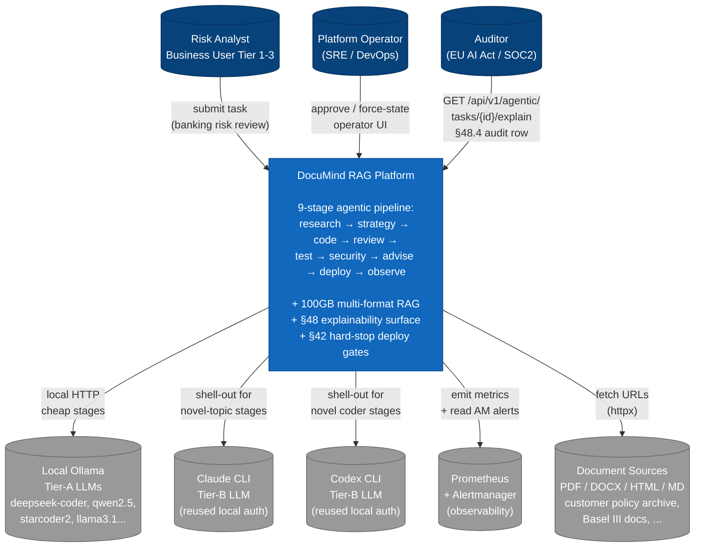

# C4 L1 — System Context

> Highest-level view: users + the system + external systems it talks to.
> No internal containers shown at this level — those are L2.

## Diagram



## Personas (3)

| Persona | Tier | Demo scenario |
|---|---|---|
| **Risk Analyst** | Business basic / advanced / expert | "Show high-risk loans this quarter with policy citations" |
| **Platform Operator** | SRE / DevOps | "Approve a flagged deploy at 3 AM" / "Force-open breaker for maintenance" |
| **Auditor** | Regulator-facing | "Pull §48.4 audit row for decision X" / "Show counterfactual" |

## External Systems (5)

| System | Why we depend on it | Failure mode |
|---|---|---|
| **Local Ollama** | Tier-A LLM (free, fast, local) | Slow → call_timeout_s; CB trips |
| **Claude CLI** | Tier-B LLM (novel topics) | Subprocess hang → CB trips → fall back to Tier-A |
| **Codex CLI** | Tier-B for code-heavy novel work | Same as Claude |
| **Prometheus + Alertmanager** | Observer's two-signal rollback rule | DBCircuitBreaker pattern; observer stays passive |
| **Document Sources** | Researcher's URL fetches (E6) | Per-URL httpx timeout; URLs failing → fetch_ok=false |

## Boundaries

- **Inside the system**: orchestrator, 4 MCP servers, Postgres, qdrant, frontend, observability stack
- **Outside the system**: Ollama (separate container), Claude/Codex CLI (system binaries),
  external HTTP doc sources, Prometheus stack (separately deployed)

## Trust boundaries

```
Analyst → [TLS / gateway / auth] → System
                                       ↓
                                  [tenant_id check + RLS]
                                       ↓
                                  Tools execute under
                                  per-tenant scope (CB-F)
```

The system's identity boundary today is: gateway authenticates the
caller; orchestrator trusts the `tenant_id` field on requests.
**P0 #31 brutal-review finding** — orchestrator should also validate
JWT signed by the gateway. Not yet wired.
