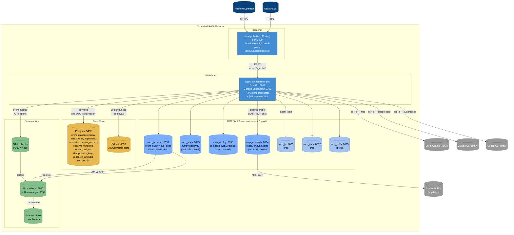

# C4 L2 — Container Diagram

> One level deeper than L1: shows containers (services/processes) inside
> the DocuMind RAG system.

## Diagram

## Containers (10 internal + 4 external)

| Container | Tech | Port | Purpose |
|---|---|---|---|
| **Frontend** | Next.js 14 | 3000 | Admin UI: `/admin/agentic/*` |
| **agent-orchestrator-svc** | FastAPI Python | 8087 | 9-stage LangGraph pipeline |
| **mcp_research** | FastAPI Python | 8094 | URL fetch + HTML extract |
| **mcp_tests** | FastAPI Python | 8095 | Real ruff/pytest/mypy |
| **mcp_deploy** | FastAPI Python | 8096 | §42 hard-stop deploy gates |
| **mcp_observe** | FastAPI Python | 8097 | Prom + AM real backings |
| **mcp_hr / itsm / drills** | FastAPI Python | 8091-3 | Prod MCP fleet |
| **Postgres** | Postgres 16 | 5432 | Tasks, runs, audit, RLS-isolated |
| **Qdrant** | Qdrant 1.x | 6333 | 100GB vector store |
| **Prometheus + Alertmanager** | Prom 2.x | 9090, 9093 | Metrics + alerts |
| **Grafana** | Grafana 10 | 3001 | Dashboards |
| **OTel Collector** | OTel | 4317/4318 | Span aggregation |

## Cross-cutting concerns (mapped to brutal-review #s)

| Concern | Container | Status |
|---|---|---|
| **Circuit breakers** | every external dep | ✅ canonical CB everywhere; DbCircuitBreaker (P0c) |
| **Body size limit** | Orch (P1) | ✅ 1 MiB cap |
| **Rate limit** | Orch | ⏸ wired at gateway; per-tenant TODO |
| **Identity boundary (#31)** | Orch | ⏸ JWT validation TODO |
| **Tenant isolation** | Postgres | ✅ RLS on all 12 tenant tables (drilled) |
| **Idempotency** | Orch (#37) | ✅ Schema + helpers (#21 multi-pod store TODO) |
| **Memory bounds** | InMemoryTaskStore (#35) | ✅ LRU bounded (P0a) |
| **Graceful shutdown** | All MCP stubs (#34) | ✅ lifespan handlers (P0b) |
| **§42 hard stop** | Orch + mcp_deploy | ✅ enforced 3 layers deep |
| **§48 audit row** | Orch /explain | ✅ 23-field schema |

## What changes between L2 and L3

L3 zooms into ONE container at a time. The most critical L3 decompositions to author next:

1. **agent-orchestrator-svc L3** — components: LangGraph DAG, agents (9), pool, router, store, explainability, db_circuit_breaker
2. **mcp_observe L3** — components: prom_query, p95_delta, check_alerts_fired, lifespan
3. **Postgres L3** — components: schema migrations, RLS policies, tables (groups by domain)

These are deferred to a follow-up commit per the principle "C4 docs follow architectural changes, not the other way around."
