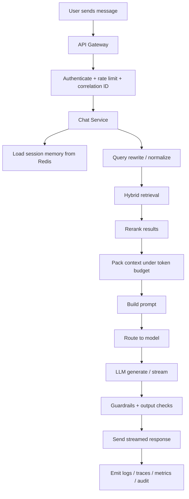
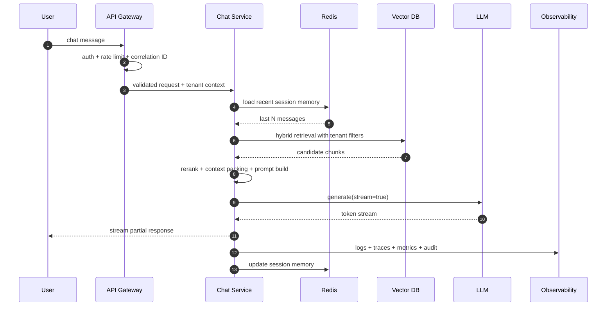

# Chatbot Design: BRD + HLD + LLD

This document turns the chatbot coverage outline into a production-grade design package. It is intentionally structured for three audiences:

- business and product stakeholders: BRD
- architects and tech leads: HLD
- backend / platform engineers: LLD

## 0. BRD

### Problem
Users need a chatbot that can answer domain questions accurately, safely, and quickly using enterprise knowledge sources instead of generic model memory.

### Objective
Build a multi-tenant chatbot that supports streaming conversations, uses retrieval-augmented generation for grounded answers, enforces tenant isolation and policy controls, and remains observable and operable in production.

### Users
- end users asking questions over web chat
- tenant admins reviewing usage and quality
- support and operations teams handling incidents
- platform engineers maintaining model, retrieval, and reliability layers

### In Scope
- streaming chat interface over WebSocket or SSE
- authenticated API gateway
- session memory
- document ingestion, chunking, embedding, and indexing
- hybrid retrieval and reranking
- prompt assembly and LLM generation
- guardrails, PII masking, tenant isolation
- reliability controls: timeout, retry, breaker, fallback
- observability and cost controls

### Out of Scope
- autonomous multi-agent orchestration
- voice I/O
- multimodal generation
- customer-specific workflow automation
- fine-tuning pipeline implementation

### KPIs
- p95 time-to-first-token under 1.5s for cached/simple questions
- p95 full response latency under 6s for standard RAG path
- grounded-answer rate above agreed benchmark threshold
- cross-tenant leakage incidents: zero
- retrieval cache hit rate and prompt-token budget within tenant targets

### Risks
- wrong retrieval causes confident wrong answers
- prompt injection from indexed documents
- latency spikes from large prompts or slow model backends
- cost overrun from unconstrained token growth
- weak metadata causes tenant or policy filtering failures

### One-line BRD
We are solving enterprise knowledge-access friction by building a tenant-safe RAG chatbot that delivers grounded, streaming answers with production controls.

## 1. Problem / Context

The chatbot is not just a UI calling an LLM. It is a controlled runtime pipeline:

- entry and auth
- memory and policy loading
- retrieval from tenant-safe knowledge sources
- prompt construction under token limits
- generation with guardrails
- streaming delivery
- audit, traces, cost, and fallback handling

The design goal is to make the chatbot:

- grounded rather than purely generative
- fast enough for interactive use
- safe enough for enterprise data
- measurable enough to improve over time

## 2. 5W

| W | Answer |
| --- | --- |
| What | A multi-tenant streaming chatbot using RAG, session memory, policy controls, and fallback logic. |
| Why | To provide accurate, current, and tenant-safe answers without relying only on base-model memory. |
| Where | Browser client, API gateway, chat service, Redis, Postgres, vector DB, model backend, observability stack. |
| When | On every user query, during document ingestion, and during evaluation, monitoring, and refresh cycles. |
| Who | End users, tenant admins, support staff, backend engineers, platform engineers, security reviewers. |

## 3. 30-Second Interview Answer

The chatbot is a streaming, tenant-safe RAG system. Requests enter through an authenticated gateway, load recent session memory from Redis, run query rewriting and hybrid retrieval against tenant-filtered knowledge, rerank and pack the best context under a token budget, then call an LLM with prompt guardrails and PII controls. Reliability comes from timeout, retry, breaker, and fallback behavior, while observability tracks latency, token usage, quality, and cost end to end.

## 4. HLD

### 4.1 Component View

```text
Client (Web / Mobile)
  ->
API Gateway
  ->
Chat Service
  ->
Session Memory (Redis)
  ->
Retrieval Pipeline
  -> Query Rewrite
  -> Hybrid Search
  -> Rerank
  -> Context Pack
  ->
Generation Pipeline
  -> Prompt Builder
  -> Model Router
  -> LLM Backend
  -> Output Guardrails
  ->
Response Stream

Parallel support systems:
- Ingestion Pipeline
- Postgres metadata/audit store
- Vector DB
- Observability stack
- Admin / evaluation controls
```

### 4.2 Flowchart



### 4.3 Network Flow

```text
Browser
  -> HTTPS / WSS
Load Balancer / NGINX
  -> API Gateway
  -> Chat Service Pod
     -> Redis
     -> Postgres
     -> Vector DB
     -> Model Gateway / LLM backend
     -> Observability exporters

All service-to-service calls:
- mTLS inside mesh
- JWT / service identity at ingress
- tenant context propagated in headers / request context
```

### 4.4 Data Flow

```text
Input:
- user query
- session ID
- tenant ID
- auth claims

Process:
- validate request
- read session memory
- retrieve tenant-safe chunks
- construct prompt
- generate answer
- stream response
- persist metadata and telemetry

Output:
- grounded answer
- citations / source references if enabled
- audit/log/trace records
- token and latency metrics
```

## 5. SAD

### Components
- client UI
- API gateway
- chat service
- Redis session memory
- ingestion workers
- vector DB
- Postgres metadata / audit store
- model backend
- observability stack

### Interfaces
- `POST /chat` or `GET /chat/stream`
- WebSocket event stream for partial tokens
- ingestion job APIs or queue consumers
- vector search client interface
- model client interface
- audit / metric emitters

### External Integrations
- identity provider for JWT
- model provider or internal model gateway
- document source systems
- object storage if raw documents are persisted separately

### Constraints
- latency and token budget caps
- tenant isolation is mandatory
- no raw PII leakage in logs
- graceful degradation must exist when the model or retriever is impaired

## 6. Sequential Runtime Steps

1. User sends a message through browser chat.
2. Gateway validates JWT, terminates TLS, applies rate limit, assigns correlation ID.
3. Chat service validates request schema and loads tenant/session context.
4. Recent message history is loaded from Redis.
5. Query is normalized or rewritten if configured.
6. Retrieval engine performs hybrid search with strict tenant filters.
7. Candidates are reranked and packed into a token budget.
8. Prompt is assembled from system rules, history, context, and user query.
9. Model router chooses primary or fallback model.
10. LLM response is streamed back through the service.
11. Output guardrails check for policy violations or unsafe content.
12. Chat service emits logs, traces, metrics, and audit records.
13. Session memory is updated with bounded history or summary.

## 7. Sequence Diagram



## 8. Core Components

| Layer | Responsibility |
| --- | --- |
| UI | User input, streaming display, reconnect, session continuity. |
| Gateway | TLS, JWT verification, rate limit, request normalization, correlation ID. |
| Chat Service | Orchestration, prompt assembly, response streaming, fallback logic. |
| Session Memory | Last N turns, summary snapshot, TTL, conversation metadata. |
| Retrieval | Query rewrite, hybrid search, metadata filter, rerank, dedupe, context packing. |
| Data | Raw docs, chunk metadata, embeddings, audit, chat/session records. |
| AI | Embedding model, generation model, routing, guardrails. |
| Observability | Logs, traces, metrics, cost reports, dashboards, alerts. |

## 9. LLD

### 9.1 API Layer

#### Request
```json
{
  "session_id": "sess_123",
  "message": "What is our refund policy?",
  "stream": true,
  "conversation_mode": "standard"
}
```

#### Response
```json
{
  "message_id": "msg_456",
  "answer": "The refund policy allows ...",
  "citations": [
    {
      "source_id": "doc_17",
      "chunk_id": "chunk_17_04"
    }
  ],
  "model": "primary-chat-model",
  "degraded": false
}
```

### 9.2 Chat Service Responsibilities
- request validation
- tenant context extraction
- session memory fetch/update
- retrieval orchestration
- prompt construction
- model routing
- streaming response framing
- fallback on breaker open / timeout
- telemetry emission

### 9.3 Session Memory Design

Redis keys:
- `chat:{tenant_id}:{session_id}:history`
- `chat:{tenant_id}:{session_id}:summary`

Stored data:
- bounded recent messages
- optional rolling summary
- timestamps, token count estimates, feature flags

Policies:
- TTL for inactive sessions
- max message count before summarization
- no long-term source of truth in Redis alone

### 9.4 Ingestion Pipeline

Steps:
1. fetch document
2. parse / OCR
3. clean and normalize
4. deduplicate
5. enrich metadata
6. chunk text
7. embed chunks
8. upsert into vector DB
9. store source + metadata lineage in Postgres

Stored chunk metadata should include:

```json
{
  "tenant_id": "tenant_a",
  "source_id": "policy_doc_2026_04",
  "chunk_id": "policy_doc_2026_04_08",
  "title": "Refund Policy",
  "access_level": "internal",
  "document_version": "v4",
  "embedding_model": "embed-v2",
  "indexed_at": "2026-04-26T10:00:00Z"
}
```

### 9.5 Retrieval Pipeline

Stages:
- normalize query
- optional rewrite
- semantic search in vector DB
- lexical search if hybrid enabled
- merge candidates
- apply metadata filters
- rerank top candidates
- dedupe overlaps
- pack context under token cap

Key rules:
- every search path must apply tenant filtering
- metadata filtering happens before final ranking where possible
- token budget must be enforced before model call

### 9.6 Prompt Builder

Prompt sections:
- system instructions
- safety / policy instructions
- session summary or history window
- retrieved context blocks
- user query

Controls:
- max context tokens
- citation format
- refusal behavior when evidence is weak
- prompt version tag for audit

### 9.7 Reliability Layer

Required controls:
- timeout on retrieval and model calls
- exponential backoff with jitter for retryable failures
- circuit breaker around model backend and optional retrieval backend
- fallback model or degraded response when primary path fails
- bounded queue / semaphore to avoid overload collapse

### 9.8 Security Layer

Controls:
- prompt injection detection on retrieved context
- PII scanning / redaction before logs and optionally before prompts
- strict tenant metadata filters in vector search
- RBAC / ABAC on admin and source-specific access
- audit logs for privileged actions and cross-tenant ops access

### 9.9 Observability

Metrics:
- request count
- p50 / p95 latency
- time to first token
- retrieval latency
- model latency
- prompt tokens / completion tokens
- cost per answer
- breaker open rate
- cache hit rate

Traces:
- gateway span
- chat orchestration span
- retrieval subspans
- model subspan
- guardrail subspan

Logs:
- structured JSON
- correlation ID
- tenant ID where allowed
- no raw PII in message body

## 10. ADRs

| Decision | Reason | Trade-off |
| --- | --- | --- |
| Use RAG instead of model-only answers | Fresh, auditable, domain-grounded responses | Higher runtime complexity and latency |
| Use Redis for session memory | Low-latency context retrieval | Requires TTL and fallback to durable store |
| Use hybrid retrieval | Better recall than vector-only in enterprise docs | More moving parts, tuning cost |
| Use SSE or WebSocket streaming | Better perceived latency and UX | Harder client/state handling |
| Enforce strict tenant filters in retrieval | Prevents cross-tenant leakage | More metadata discipline required |
| Add fallback model and breaker | Better resilience under dependency failure | More routing and quality variation to manage |

## 11. Pros and Cons

### Pros
- grounded answers with current enterprise data
- stronger tenant and policy control than pure chat completion
- better UX through streaming
- measurable cost, latency, and quality surfaces
- operational resilience through breaker/retry/fallback

### Cons
- higher implementation complexity than direct LLM chat
- retrieval quality becomes a major failure source
- metadata discipline is non-optional
- more infra to monitor: Redis, vector DB, model backend, ingestion workers

## 12. Limitations

- RAG improves grounding but does not eliminate hallucination
- session memory can preserve recent context but is not perfect long-term reasoning memory
- fallback models may preserve uptime while reducing quality
- retrieval depends on document freshness and chunk quality
- strict token budgets can drop useful context in complex questions

## 13. When Not To Use

Do not use this full design when:
- answers can be deterministic from a small relational dataset
- there is no meaningful knowledge corpus to retrieve from
- the use case is offline batch generation rather than interactive chat
- latency budget is too small for retrieval + generation and no cache strategy exists

## 14. Security Checklist

- JWT verified at gateway
- TLS at ingress, mTLS internally where supported
- tenant_id propagated and enforced in every retrieval filter
- PII redaction before logging
- prompt injection scan on retrieved context
- audit records for privileged configuration changes
- secret management outside code and env sprawl

## 15. Testing Strategy

### Unit
- prompt builder
- token budget packer
- query rewrite rules
- tenant filter builder

### Integration
- Redis session memory
- vector retrieval with metadata filters
- model streaming client
- breaker + fallback behavior

### Security
- prompt injection corpus
- cross-tenant retrieval tests
- PII leakage tests

### Load
- concurrent SSE/WebSocket sessions
- p95 latency under expected traffic
- backpressure and queue saturation

### Quality
- golden dataset for answer correctness
- retrieval relevance set
- adversarial prompt set

## 16. Common Failure Modes

| Failure | Likely Cause | Response |
| --- | --- | --- |
| Wrong but confident answer | irrelevant retrieval or weak prompt instruction | inspect retrieved chunks, rerank, golden set regression |
| Very slow response | large context, slow model, overloaded backend | reduce top-K, route to faster model, stream earlier |
| No answer | retrieval returned nothing or prompt too strict | fallback response, inspect corpus freshness and filters |
| Cross-tenant leak risk | metadata filter missing or malformed | block request, alert, run audit proof tests |
| Repeated stale answers | cache or index not refreshed | invalidate cache, reindex source, track version lineage |
| Breaker open | repeated model/backend failures | fallback model, degrade gracefully, page operator |

## 17. Step To Implement

1. Define BRD, KPIs, and latency/cost targets.
2. Implement authenticated gateway with correlation ID and rate limit.
3. Build chat service request/streaming skeleton.
4. Add Redis-backed bounded session memory.
5. Build ingestion pipeline with metadata enrichment and chunk lineage.
6. Implement vector search with strict tenant filters.
7. Add hybrid retrieval, reranking, and token-budget packing.
8. Add prompt builder with version tags and refusal policy.
9. Integrate model client with timeout, retry, breaker, and fallback.
10. Add prompt injection and PII controls.
11. Emit logs, traces, metrics, and cost counters.
12. Build evaluation dataset and run regression tests.
13. Add dashboards, alerts, and deployment guardrails.

## 18. What To Explain In Interview

Focus on these points:

1. The chatbot is an orchestration system, not a single model call.
2. Retrieval quality determines answer quality, so metadata and tenant filters are first-class.
3. Session memory is short-term context, not a substitute for retrieval.
4. Reliability comes from timeouts, retries, breakers, and fallback models.
5. Production readiness requires observability, guardrails, evaluation, and cost control.

### Strong Interview Closing

This chatbot design is production-oriented because it treats retrieval, security, observability, and fallback as equal citizens alongside the LLM. The model is only one component in a larger controlled runtime.
