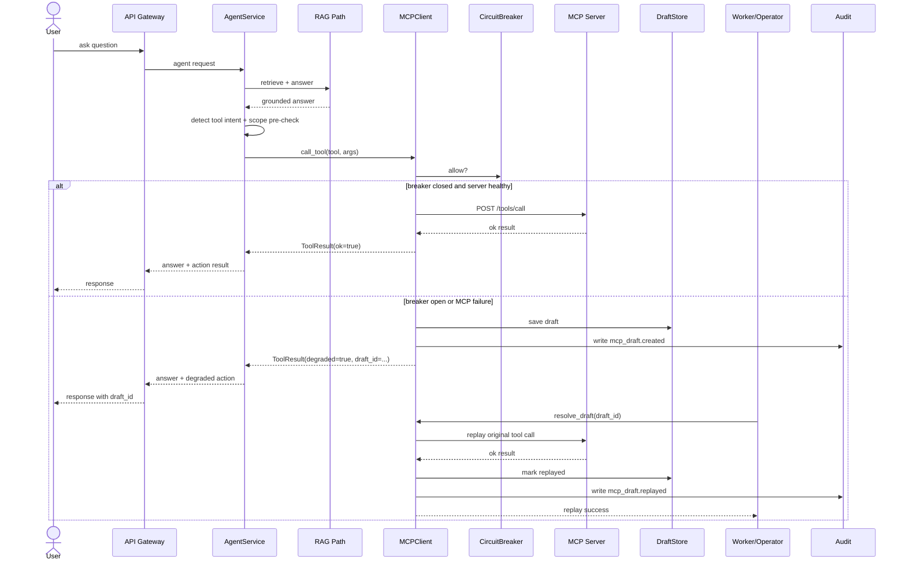

# MCP Agent Architecture And Monitoring

This note explains how MCP, agents, monitoring, health, and tracking fit together in this repo.

The most important clarification is:

- MCP does not create its own agent

In this repo:

- the agent lives in the inference layer
- MCP is the governed tool and action boundary the agent calls

Relevant code:

- [services/inference-svc/app/services/agent.py](/mnt/deepa/rag/services/inference-svc/app/services/agent.py)
- [services/inference-svc/app/agents/multi_hop_agent.py](/mnt/deepa/rag/services/inference-svc/app/agents/multi_hop_agent.py)
- [mcp/client.py](/mnt/deepa/rag/mcp/client.py)
- [mcp/server_common.py](/mnt/deepa/rag/mcp/server_common.py)
- [mcp/server_hr.py](/mnt/deepa/rag/mcp/server_hr.py)
- [mcp/server_itsm.py](/mnt/deepa/rag/mcp/server_itsm.py)
- [mcp/server_drills.py](/mnt/deepa/rag/mcp/server_drills.py)

## 1. What The Agent Is Doing

There are two relevant agent shapes in this repo.

### AgentService

`AgentService` is the request-time orchestrator.

It does this:

1. run the RAG pipeline first
2. detect tool intent
3. check scopes before calling a tool
4. route to the correct `MCPClient` by namespace
5. return both:
   - grounded answer
   - action result or denial or degraded draft

This is the main answer-plus-action agent.

### MultiHopRagAgent

`MultiHopRagAgent` is a multi-step retrieval agent.

It does this:

1. plan sub-questions
2. retrieve across multiple hops
3. synthesize a final answer
4. enforce token, loop, and timing breakers during the run

This is a deeper retrieval agent, not the main MCP action router.

## 2. What MCP Is Doing

MCP is the tool execution layer under the agent.

`MCPClient` is responsible for:

- calling `/tools/list`
- calling `/tools/call`
- caching tool catalogs
- checking breaker state
- persisting drafts when degraded
- resolving or rejecting drafts later
- writing audit rows when wired

The MCP servers are responsible for:

- exposing tool metadata
- validating tool requests
- enforcing scopes
- executing the tool
- exporting per-tool metrics

## 3. High-Level Architecture

The architecture looks like this:

```text
User
  -> API Gateway
  -> inference-svc
      -> AgentService
          -> RAG path
          -> MCPClient
              -> MCP server
                  -> downstream business system
          -> draft fallback if degraded
          -> audit + metrics + traces
```

The responsibility split is:

| Layer | Responsibility |
|---|---|
| Agent | decide answer vs action, route tool, pre-check scopes |
| MCP client | execute tool call safely, handle degraded mode, replay drafts |
| MCP server | expose tool contracts, enforce scope, execute action |
| Breakers | prevent retry storms and preserve intent safely |
| Audit + telemetry | make the action path observable and reviewable |

## 4. System Design Flow

There are four main flows.

### Ask-only flow

```text
User query
  -> AgentService
  -> RAG retrieval + answer
  -> response
```

### Ask plus action flow

```text
User query
  -> AgentService
  -> detect intent
  -> scope pre-check
  -> MCPClient.call_tool()
  -> MCP server /tools/call
  -> result returned
```

### Degraded draft flow

```text
User query
  -> AgentService
  -> MCPClient.call_tool()
  -> breaker open or MCP failure
  -> draft persisted
  -> degraded response with draft_id
```

### Replay flow

```text
Pending draft
  -> worker or operator
  -> MCPClient.resolve_draft()
  -> original tool replayed
  -> draft marked replayed if success
  -> audit row written
```

## 5. Current MCP Tool Set

The current repo exposes these tool namespaces and tools.

### HR tools

From [mcp/server_hr.py](/mnt/deepa/rag/mcp/server_hr.py):

- `hr.policy_lookup`
- `hr.leave_request`

### ITSM tools

From [mcp/server_itsm.py](/mnt/deepa/rag/mcp/server_itsm.py):

- `itsm.incident_lookup`
- `itsm.incident_open`

### Drill tools

From [mcp/server_drills.py](/mnt/deepa/rag/mcp/server_drills.py):

- `drill.list`
- `drill.run`

## 6. Health Model Per Tool

Every MCP tool should be treated as a governed mini-contract with explicit health expectations.

The main health dimensions are:

- tool server reachable
- auth and scope behavior correct
- latency acceptable
- error rate acceptable
- idempotency behavior correct
- degraded fallback works when server is unavailable
- audit and correlation metadata present

## 7. Per-Tool Monitoring Matrix

| Tool | Use case | Side effects | Required scopes | Core health checks | Monitoring | Tracking |
|---|---|---|---|---|---|---|
| `hr.policy_lookup` | fetch HR policy text | read | `hr:read` | MCP HR reachable, low latency, low 4xx/5xx error rate | calls by outcome, latency, auth denial rate | tenant ID, correlation ID, tool name |
| `hr.leave_request` | submit leave workflow | write | `hr:write` | idempotent replay safe, downstream reachability, draft fallback works | success, degraded, replay, error, scope denial, draft creation | tenant ID, correlation ID, actor, idempotency key, draft ID |
| `itsm.incident_lookup` | read existing incident | read | `itsm:read` | MCP ITSM reachable, expected not-found behavior, low latency | calls by outcome, latency, denial rate | tenant ID, correlation ID, tool name |
| `itsm.incident_open` | open incident | write | `itsm:write` | idempotent replay safe, downstream reachability, draft fallback works | success, degraded, replay, error, denial, draft creation | tenant ID, correlation ID, actor, idempotency key, draft ID |
| `drill.list` | enumerate drills | read | `drill:read` | drill server reachable, catalog discovery works | calls by outcome, latency | tenant ID, correlation ID, tool name |
| `drill.run` | execute drill subprocess | write | `drill:run` | concurrency cap works, timeout behavior works, idempotent cache behavior works | success, replay, error, timeout, queueing or semaphore pressure | tenant ID, correlation ID, idempotency key, drill name |

## 8. Monitoring For Each Tool

At minimum, each tool should be monitored on these axes:

### Availability

- MCP server `/health`
- tool server reachable from client
- breaker state for that namespace

### Behavior

- calls by outcome
- read vs write call volume
- idempotent replay count
- denial count
- draft creation count for write tools

### Performance

- latency
- timeout count
- backlog or replay delay for draftable tools

### Correctness and governance

- audit row written for sensitive actions
- actor attribution correct
- correlation ID preserved
- tenant ID preserved

## 9. Tracking For Each Tool

The minimum tracking fields for a tool invocation are:

- `tool`
- `namespace`
- `tenant_id`
- `correlation_id`
- `idempotency_key`
- `actor_type`
- `actor_id`
- `outcome`
- `draft_id`
- `replay_status`

This lets operators answer:

- what happened
- who triggered it
- whether it degraded
- whether it was replayed
- whether it was denied

## 10. Current Monitoring Mechanisms In The Repo

### Per-tool call metrics

`mcp.server_common` exports:

- `documind_mcp_tool_calls_total`

with labels:

- `namespace`
- `tool`
- `outcome`

This is the base per-tool monitoring surface.

### Breaker metrics

The canonical breaker in [libs/py/documind_core/circuit_breaker.py](/mnt/deepa/rag/libs/py/documind_core/circuit_breaker.py) exports:

- failures
- rejections
- transitions
- current state

This is the main availability and resilience signal per dependency namespace.

### Audit tracking

[libs/py/documind_core/audit.py](/mnt/deepa/rag/libs/py/documind_core/audit.py) provides:

- hash-chained audit writes
- audit failure counters
- actor and correlation details

This is the governance truth layer for sensitive tool flows.

### Tracing

[mcp/server_common.py](/mnt/deepa/rag/mcp/server_common.py) wires optional OTel instrumentation for MCP servers.

This gives:

- request tracing
- service-level telemetry
- correlation with inference and gateway traces

## 11. Ask To MCP To Degraded Draft To Replay Sequence



## 12. Operator Health Checklist Per Tool

For each MCP tool, operators should be able to answer:

- is the MCP server healthy?
- is the breaker open?
- is call latency normal?
- are denials increasing?
- are degraded drafts increasing?
- are replays succeeding?
- are audit writes succeeding?
- can I trace a failed request end to end?

If those answers are not easy to obtain, the tool is not operationally mature even if it technically works.

## 13. What Is Still Missing

The repo already has strong mechanics.
The main remaining gaps are:

- operator-facing per-tool dashboards
- stronger per-tool health views in the admin UI
- easier trace -> draft -> audit navigation
- better explanation of why a tool was chosen
- stronger prompt/tool decision review surfaces

## 14. Bottom Line

In this repo:

- the agent decides
- MCP executes
- breakers preserve safety under failure
- drafts preserve user intent
- replay restores eventual completion
- audit and telemetry provide governance and monitoring

That is the right mental model.
MCP is not the agent.
It is the governed action layer under the agent.
