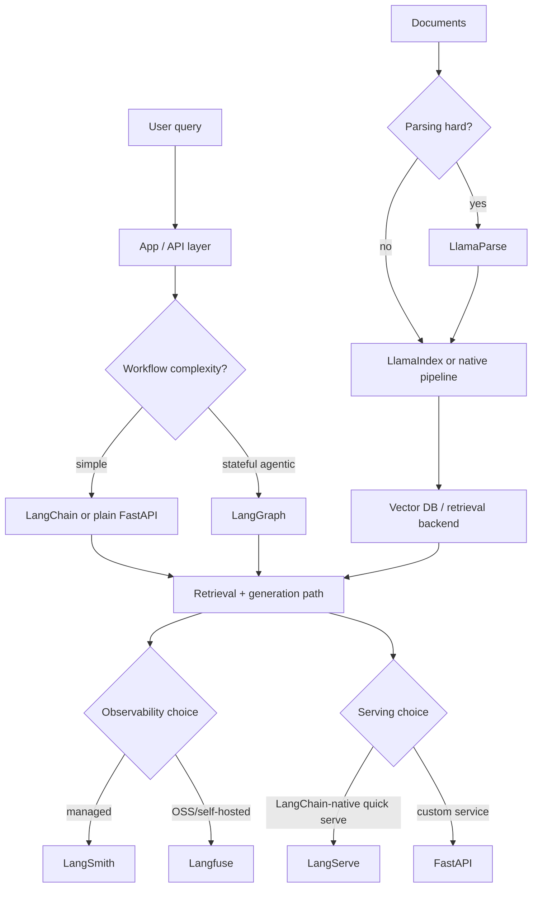
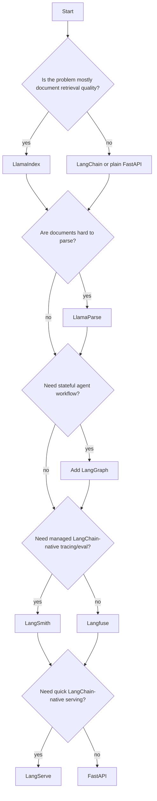
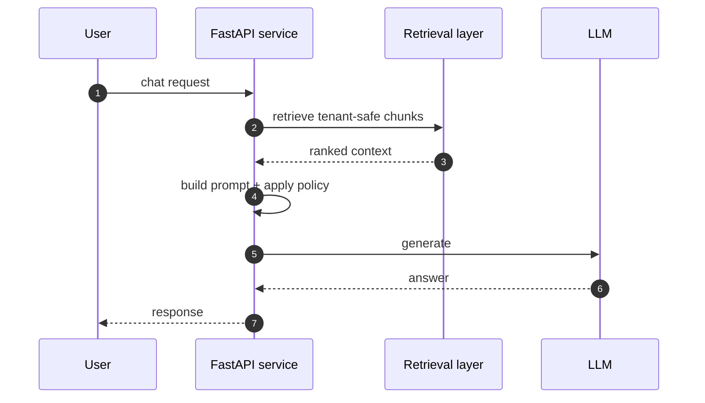
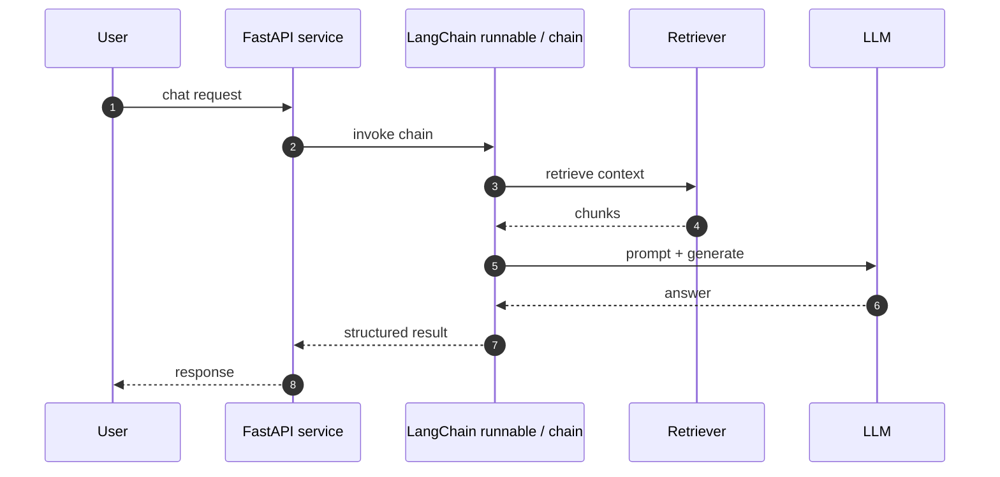
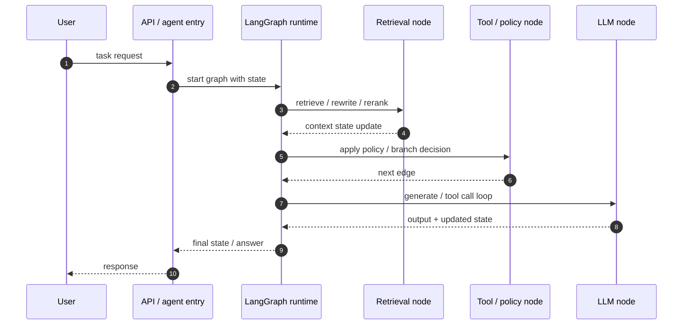

# Lang Family RAG Tool Map

This document maps the "Lang family" and adjacent RAG tooling clearly:

- what each tool does
- where it fits in a RAG stack
- pros and cons
- what is actually needed for MVP versus enterprise

This is intentionally decision-oriented. The goal is to avoid the common mistake of using every tool in the ecosystem at once.

## 1. Core Idea

There are three different problem classes mixed together in most RAG discussions:

- application composition and tool orchestration
- stateful agent workflow control
- document ingestion, parsing, indexing, and retrieval
- observability, evaluation, and deployment

The tools in this family sit in different layers. They are not interchangeable.

## 2. Tool Map

| Tool | Category | Main role in RAG | Use when |
| --- | --- | --- | --- |
| LangChain | application framework | integrations, prompt chains, retrievers, tool-calling, higher-level agent abstractions | general RAG app building |
| LangGraph | orchestration/runtime | stateful, long-running, multi-step, human-in-the-loop workflows | agentic RAG and complex control flow |
| LangSmith | observability/evaluation/deployment | trace, debug, test, evaluate, and deploy LLM apps | managed QA/debugging/ops around LangChain/LangGraph |
| LangServe | serving layer | expose LangChain runnables/chains as APIs | quick serving for LangChain-native apps |
| Langfuse | OSS observability/evaluation | traces, prompts, datasets, scores, experiments, dashboards | OSS/self-hosted LLM observability |
| LlamaIndex | data/RAG framework | ingestion, indexing, retrieval, query engines | document-heavy RAG |
| LlamaParse | document parsing | parse PDFs, tables, and layout-heavy enterprise docs | difficult documents are the quality bottleneck |
| LlamaCloud | managed data platform | managed parsing, ingestion/retrieval APIs, eval/observability | faster managed production setup |

## 3. Where Each Tool Fits

### Application / workflow layer
- LangChain
- LangGraph
- LangServe

### Data / retrieval layer
- LlamaIndex
- LlamaParse
- LlamaCloud

### Observability / evaluation / deployment layer
- LangSmith
- Langfuse

## 4. Stack Flowchart

## 5. What Each Tool Actually Does

### LangChain
LangChain is the general application framework layer. It provides integrations, retrievers, prompt chains, runnables, tool-calling helpers, and higher-level agent abstractions.

Best when:
- you need many integrations quickly
- your app is more workflow-oriented than deeply stateful
- you want a broad ecosystem

### LangGraph
LangGraph is the lower-level orchestration runtime. It is designed for long-running, stateful workflows and agents with durable execution, streaming, memory, and human-in-the-loop control.

Best when:
- you have branching workflows
- you need retries, pause/resume, or checkpoints
- you need stateful agent control, not just single-shot chains

### LangSmith
LangSmith is the managed tracing, evaluation, prompt testing, and deployment platform in the LangChain ecosystem. It is framework-agnostic but strongly aligned with LangChain and LangGraph workflows.

Best when:
- you want managed tracing and eval
- your stack already uses LangChain / LangGraph
- you want integrated deployment and prompt testing

### LangServe
LangServe is a convenience serving layer for LangChain apps. It is useful when you want to expose runnables or chains as APIs quickly.

Best when:
- your app is already LangChain-native
- you want quick serving without custom API work

### Langfuse
Langfuse is the open-source/self-hostable observability and evaluation layer. It focuses on traces, prompts, datasets, experiments, and scores.

Best when:
- you want OSS or self-hosting
- you want strong run visibility but not vendor lock-in
- you need prompt / retrieval / output level observability

### LlamaIndex
LlamaIndex is strongest in the data-centric RAG layer: ingestion, indexing, retrievers, query engines, and document-grounded retrieval patterns.

Best when:
- your hard problem is document retrieval quality
- your RAG is document-heavy
- you need better data-side abstractions than a generic app framework gives you

### LlamaParse
LlamaParse is a specialized parser for hard documents such as PDFs, tables, and complex layouts.

Best when:
- parsing quality is hurting retrieval quality
- your corpus is full of ugly enterprise documents

### LlamaCloud
LlamaCloud is the managed version of the data-centric path: parsing, ingestion/retrieval APIs, and production-quality document processing.

Best when:
- you want a faster managed production setup
- you prefer managed ingestion/retrieval over building the data pipeline yourself

## 6. Pros And Cons

### LangChain
Pros:
- broad ecosystem
- quick integration path
- good for general RAG apps

Cons:
- abstraction sprawl
- can become opaque in production

### LangGraph
Pros:
- explicit state and control flow
- durable execution
- strong fit for real agents

Cons:
- more engineering work
- overkill for simple RAG

### LangSmith
Pros:
- strong managed tracing/eval/deployment workflow
- tight fit with LangChain/LangGraph

Cons:
- more vendor coupling
- not the OSS-first path

### LangServe
Pros:
- quick API serving for LangChain-native apps

Cons:
- optional if FastAPI already exists
- narrow role

### Langfuse
Pros:
- open source
- self-hostable
- strong prompt/dataset/score support

Cons:
- not an orchestration framework
- separate choice from your app/runtime layer

### LlamaIndex
Pros:
- strong retrieval and document focus
- useful abstractions for ingestion and query engines

Cons:
- not the main answer for complex stateful agent control

### LlamaParse
Pros:
- high-value for hard document parsing

Cons:
- narrow scope
- not a full RAG framework by itself

### LlamaCloud
Pros:
- faster managed production path
- strong fit for data-heavy enterprise RAG

Cons:
- managed-service dependency

## 7. MVP Vs Enterprise

### MVP
Usually enough:
- FastAPI or LangChain
- vector DB
- basic observability

Example MVP stacks:

| Project type | Stack |
| --- | --- |
| simple RAG | FastAPI + LlamaIndex + Qdrant + Langfuse |
| general RAG | FastAPI + LangChain + Qdrant + Langfuse |

For MVP, you usually do **not** need all of:
- LangGraph
- LangSmith
- LlamaParse
- LlamaCloud
- LangServe

### Enterprise
Add only when the problem actually exists:

| Need | Add |
| --- | --- |
| agent state / branching / HITL | LangGraph |
| hard PDFs / tables / complex docs | LlamaParse |
| managed tracing / eval / deploy | LangSmith |
| OSS/self-hosted observability | Langfuse |
| managed ingestion / retrieval | LlamaCloud |

## 8. MVP Vs Enterprise Decision Flow

## 9. Recommended Stacks

| Project type | Recommended stack |
| --- | --- |
| simple RAG | LangChain or LlamaIndex + Qdrant + Langfuse |
| document-heavy RAG | LlamaIndex + LlamaParse + Qdrant |
| agentic RAG | LangGraph + LangChain components + LangSmith or Langfuse |
| enterprise OSS RAG | LlamaIndex + LangGraph + Langfuse + Prometheus |
| managed enterprise RAG | LlamaCloud + LangGraph + LangSmith |

## 10. Lang Family Vs DocuMind Current Stack

DocuMind today is closer to:

- raw FastAPI service orchestration
- direct retrieval and prompt assembly
- custom breaker / audit / observability patterns
- Langfuse-class visibility as a likely future fit
- LangGraph-style workflow thinking in some areas, but not framework adoption

### What fits well with DocuMind

| Tool | Fit with current stack | Why |
| --- | --- | --- |
| Langfuse | high | strongest fit for AI-specific tracing/eval on top of existing OTel and metrics |
| LlamaParse | medium | useful if document parsing quality becomes a bottleneck |
| LlamaIndex | medium | useful if retrieval abstractions become harder to maintain internally |
| LangGraph | medium | useful only if agent/stateful workflows become more central |
| LangSmith | low-medium | more attractive if the codebase leans heavily into LangChain/LangGraph |
| LangChain | low-medium | broad integrations are useful, but direct control is a current design preference |
| LangServe | low | current FastAPI service model already covers serving |
| LlamaCloud | low-medium | only if managed ingestion/retrieval becomes strategically preferable |

### Interview line

DocuMind currently prefers direct control over orchestration, retrieval, and reliability. So the best additions are not necessarily framework-first. Langfuse fits sooner than LangChain, and LlamaParse fits sooner than LangGraph unless the workflow becomes more agentic.

## 11. When Not To Use

### LangChain
Do not use when:
- you already have clear FastAPI orchestration and do not need more abstraction
- debugging framework internals would cost more than writing explicit code

### LangGraph
Do not use when:
- your flow is basically single-shot retrieval + generation
- you do not need durable execution, branching, checkpoints, or HITL

### LangSmith
Do not use when:
- you want OSS/self-hosted observability first
- your stack is not meaningfully LangChain/LangGraph-centric

### LangServe
Do not use when:
- you already have a stable FastAPI serving layer
- API customization and service contracts matter more than quick runnable exposure

### Langfuse
Do not use when:
- you need only basic logs/metrics and are not yet ready to invest in AI-specific tracing

### LlamaIndex
Do not use when:
- your retrieval path is simple and already maintainable with direct code
- documents are not the hard problem

### LlamaParse
Do not use when:
- your data is already clean text, markdown, or structured content
- parsing is not the accuracy bottleneck

### LlamaCloud
Do not use when:
- you want full in-house control over ingestion and retrieval
- managed-service dependency is unacceptable

## 12. Architecture Comparison

| Approach | Best when | Pros | Cons |
| --- | --- | --- | --- |
| Raw FastAPI + custom retrieval | you want maximum control and explicit contracts | clear ownership, easier policy/breaker/audit control, low framework coupling | more code to maintain |
| LangChain + FastAPI | you want broad integrations quickly | fast composition, many integrations | abstraction sprawl, opaque runtime behavior |
| LlamaIndex + FastAPI | document/retrieval quality is the core problem | stronger retrieval abstractions, query engines, ingestion helpers | less focused on stateful agent control |
| LangGraph + LangChain components | workflow/state/control-flow complexity is the hard part | durable state, branching, HITL, checkpoints | more operational and implementation complexity |

### Simple rule

- choose raw FastAPI when control and clarity matter most
- choose LangChain when integration speed matters most
- choose LlamaIndex when retrieval quality matters most
- choose LangGraph when stateful orchestration matters most

## 13. Sequence Diagrams By Approach

### Raw FastAPI + custom retrieval

### LangChain + FastAPI

### LangGraph + LangChain components

## 14. Cost Comparison

| Approach | Build cost | Runtime cost | Ops cost | Hidden cost |
| --- | --- | --- | --- | --- |
| Raw FastAPI + custom retrieval | medium-high | low-medium | medium | more in-house engineering time |
| LangChain + FastAPI | low-medium | medium | medium | abstraction/debug overhead |
| LlamaIndex + FastAPI | medium | medium | medium | additional framework surface for retrieval layer |
| LangGraph + LangChain components | high | medium-high | high | stateful workflow complexity |
| LangSmith | low build, paid platform | recurring managed cost | lower internal ops | vendor coupling |
| Langfuse | medium setup | lower license cost, infra cost if self-hosted | medium | self-hosting complexity |
| LlamaParse / LlamaCloud | low build for parsing/managed path | recurring service cost | lower pipeline ops | managed dependency |

### Cost interpretation

- raw FastAPI is often cheaper at runtime but more expensive in engineering time
- LangChain is usually cheaper to start, but debugging and abstraction sprawl can add real cost later
- LangGraph is justified only when workflow complexity is real
- LangSmith trades platform spend for lower internal tooling effort
- Langfuse trades self-hosting effort for OSS control

## 15. Interview Q&A

### Why not just use LangChain for everything?
Because LangChain is an app framework, not the answer to every layer. Retrieval quality, stateful orchestration, and observability are separate concerns.

### When would you pick LangGraph over LangChain agents?
When you need explicit state, branching, retries, checkpoints, durable execution, or HITL.

### When is LlamaIndex better than LangChain?
When the hard problem is document ingestion and retrieval quality rather than general app composition.

### Why might Langfuse fit before LangSmith?
If the current stack is not deeply LangChain-native and OSS/self-hosted observability is preferred.

### Why not always use LlamaParse?
Because parsing is only worth paying for when document quality is the actual retrieval bottleneck.

### Why keep raw FastAPI at all?
Because explicit orchestration can be easier to govern, debug, audit, and integrate with custom policy/breaker patterns.

### What is the most common mistake?
Using multiple frameworks at once without a clear bottleneck, which increases complexity faster than quality.

## 16. Brutal Decision Rule

- Use LangChain when application composition and integrations matter.
- Use LlamaIndex when document retrieval quality matters.
- Use LangGraph when state and control flow matter.
- Use Langfuse when you want OSS observability.
- Use LangSmith when you want managed LangChain-native debugging and evaluation.

## 17. What To Explain In Interview

Say this:

The important distinction is that these tools solve different layers of the problem. LangChain is the app framework layer. LangGraph is the stateful orchestration runtime. LangSmith and Langfuse are the observability and evaluation layer. LlamaIndex, LlamaParse, and LlamaCloud are the data and retrieval layer. For MVP, I would choose the smallest stack that matches the actual bottleneck. For enterprise, I would add orchestration, eval, and parsing only when the workflow, observability, or document complexity requires it.

## 18. References

- LangGraph overview: `https://docs.langchain.com/oss/python/langgraph`
- LangSmith overview: `https://docs.langchain.com/langsmith/reference-overview`
- LangChain docs: `https://docs.langchain.com/`
- LangServe intro: `https://www.langchain.com/blog/introducing-langserve`
- LlamaIndex docs: `https://docs.llamaindex.ai/`
- LlamaParse docs: `https://docs.llamaindex.ai/en/stable/llama_cloud/llama_parse/`
- LlamaCloud overview: `https://docs.llamaindex.ai/en/logan-llama_deploy_docs/llama_cloud/`
- Langfuse self-hosting: `https://langfuse.com/self-hosting`
- Langfuse scores/evaluation: `https://langfuse.com/docs/evaluation/scores/overview`
