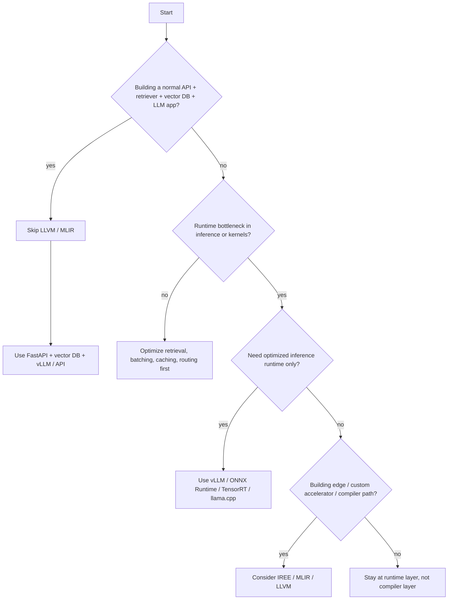

# LLVM / MLIR In RAG Projects

This document explains where LLVM and MLIR fit in a RAG system, and just as importantly, where they do **not** fit.

Use it for:

- architecture interviews
- runtime and inference optimization discussions
- deciding when compiler infrastructure matters in AI systems

## 1. Simple Meaning

| Term | Meaning | In a RAG project |
| --- | --- | --- |
| LLVM | compiler infrastructure and backend technologies | low-level execution optimization |
| MLIR | multi-level compiler IR and transformation framework | model graph / tensor / pipeline optimization |
| RAG | retrieval-augmented generation | retrieval + ranking + LLM generation |

## 2. Brutal Truth

For a normal RAG app:

```text
User -> API -> Embedding -> Vector DB -> Retriever -> LLM
```

You usually do **not** need LLVM or MLIR.

They become relevant only when you are building or heavily customizing:

| Scenario | LLVM / MLIR useful? |
| --- | --- |
| simple chatbot RAG | no |
| enterprise RAG with vector DB | mostly no |
| custom embedding acceleration | maybe |
| custom GPU/CPU optimization | yes |
| edge / on-device RAG | yes |
| model compiler / inference engine | yes |
| HPC-scale RAG | yes |
| custom vector search kernels | advanced only |

## 3. Where LLVM Fits

| RAG layer | LLVM usage |
| --- | --- |
| embedding model inference | optimize low-level CPU/GPU execution |
| vector similarity kernels | compile optimized native kernels |
| tokenization hot paths | low-level performance tuning |
| quantized model inference | target-specific runtime optimization |
| edge deployment | reduce runtime / binary overhead |
| custom operators | compile fast native ops |

### Simple mental model

```text
Embedding model
  -> optimized runtime
  -> LLVM backend
  -> CPU / GPU execution
```

## 4. Where MLIR Fits

MLIR is more relevant when the problem is model graph lowering and hardware-specific execution planning.

| RAG layer | MLIR usage |
| --- | --- |
| model inference | optimize transformer computation graphs |
| tensor operations | lower tensor ops to hardware-specific code |
| GPU kernels | generate optimized kernels |
| quantization | lower precision transformation pipelines |
| pipeline optimization | represent and transform computation stages |
| custom accelerators | map ops to target hardware |

### Simple flow

```text
PyTorch / ONNX / JAX model
  -> MLIR
  -> optimization passes
  -> LLVM / GPU backend
  -> faster execution
```

## 5. Normal RAG Vs Advanced RAG

### Normal RAG

```text
FastAPI
  -> LangChain / LlamaIndex / custom orchestration
  -> embedding API or model runtime
  -> Qdrant / Milvus / pgvector
  -> LLM API or serving runtime
```

LLVM/MLIR usually not needed.

### Advanced / HPC / edge RAG

```text
FastAPI
  -> retrieval service
  -> custom embedding runtime
  -> MLIR optimization
  -> LLVM / hardware backend
  -> CPU / GPU / edge runtime
  -> vector search / inference engine
```

## 6. Best Use Cases

| Use case | Why LLVM / MLIR helps |
| --- | --- |
| on-device RAG | compile smaller/faster local model runtimes |
| private RAG appliance | optimize for dedicated local hardware |
| high-volume embedding | reduce inference cost and latency |
| real-time voice RAG | lower end-to-end runtime overhead |
| robotics / edge AI | local inference under tight resource limits |
| satellite / IoT RAG | low-resource deployment environments |
| HPC RAG | maximize hardware utilization at scale |

## 7. Related Tools

| Tool | Purpose |
| --- | --- |
| LLVM | compiler backend infrastructure |
| MLIR | multi-level compiler IR and pass framework |
| IREE | MLIR-based end-to-end compiler/runtime |
| TVM | deep learning compiler stack |
| XLA | tensor/compiler optimization stack |
| Triton | GPU kernel programming and optimization |
| ONNX Runtime | optimized inference runtime |
| TensorRT | NVIDIA inference optimization |
| llama.cpp | efficient local LLM inference |
| vLLM | high-throughput LLM serving |

## 8. Comparison Matrix

| Tool | Layer | Best for | Typical RAG use |
| --- | --- | --- | --- |
| vLLM | serving runtime | high-throughput LLM serving | production hosted inference |
| ONNX Runtime | inference runtime | portable optimized inference | embeddings, smaller model serving |
| TensorRT | inference/runtime optimization | NVIDIA GPU performance | high-performance GPU inference |
| llama.cpp | local runtime | local / edge inference | lightweight local LLMs |
| IREE | MLIR compiler/runtime | edge, mobile, accelerator-oriented deployment | advanced edge/on-device AI |
| LLVM/MLIR directly | compiler infrastructure | compiler/runtime research and deep optimization | only advanced/custom systems |

## 9. Recommendation Ladder

### MVP RAG
Skip LLVM and MLIR.

Use:
- FastAPI
- Qdrant
- vLLM or external model API
- Langfuse / OTel

### Enterprise RAG
Before LLVM/MLIR, usually try:
- vLLM
- ONNX Runtime
- TensorRT
- llama.cpp
- better batching, caching, routing, quantization

### Edge / HPC RAG
Then consider:
- IREE
- TVM
- Triton
- custom compiled runtimes
- MLIR / LLVM deeper work

## 10. Decision Flow



## 11. Where DocuMind Currently Sits

DocuMind today sits in the normal enterprise RAG zone, not the compiler-stack zone.

Current position:
- FastAPI service orchestration
- Qdrant / retrieval-side optimization concerns
- Ollama today, with vLLM-class serving as a future/runtime discussion
- custom observability, breaker, audit, and policy controls

What this means:
- the biggest wins are still retrieval quality, serving/runtime choice, batching, caching, and routing
- LLVM / MLIR is not the next optimization step for the current stack
- runtime-level tools like vLLM, ONNX Runtime, TensorRT, or llama.cpp are more realistic intermediate steps

### Practical ladder for DocuMind

1. improve retrieval and prompt quality
2. improve serving/runtime efficiency
3. add stronger AI-specific observability and evaluation
4. only then consider compiler-layer work if hardware/runtime is the real bottleneck

## 12. Edge / On-Device RAG Architecture

Edge RAG is where LLVM/MLIR-class tooling starts to make much more sense.

### Flow

```text
Device / appliance
  -> local API / embedded app
  -> local embedding or compact LLM runtime
  -> local vector store / compact index
  -> compiled runtime
  -> CPU / GPU / NPU / accelerator
```

### Why compiler infrastructure matters here

- smaller binaries
- tighter memory budgets
- lower power consumption
- target-specific acceleration
- offline / private deployment

### Good fit tools

| Layer | Likely tools |
| --- | --- |
| local model runtime | llama.cpp, ONNX Runtime, IREE |
| accelerator-specific optimization | TensorRT, IREE, TVM |
| compiler-level exploration | MLIR, LLVM |

### Edge interview line

For cloud RAG I would stay at the runtime layer. For edge RAG I care much more about compiled runtimes, binary size, power use, and accelerator-specific lowering, which is where MLIR and LLVM start becoming relevant.

## 13. Interview Q&A

### Do most RAG engineers need LLVM or MLIR?
No. Most RAG engineers need better retrieval, serving, batching, caching, and observability first.

### When does LLVM/MLIR become worth learning?
When you are working on inference runtimes, model compilers, edge deployment, or accelerator-specific optimization.

### Why not jump straight to MLIR?
Because for most products the bottleneck is not compiler infrastructure. It is usually data quality, retrieval, prompt design, runtime serving, or cost control.

### What should come before LLVM/MLIR in a RAG stack?
vLLM, ONNX Runtime, TensorRT, llama.cpp, quantization, batching, routing, and cache optimization.

### Where does IREE fit?
IREE is the bridge between MLIR-level compilation and practical deployment, especially for edge/mobile/accelerator-oriented systems.

### What is the most common mistake?
Talking about compiler-level optimization before proving that application-level and runtime-level bottlenecks are already solved.

## 14. What To Explain In Interview

Say this:

LLVM and MLIR are usually below the normal RAG application stack. They matter when you are optimizing the inference runtime, compiling kernels, targeting edge hardware, or building custom accelerator paths. For most RAG products, the right optimization order is retrieval quality, batching, caching, routing, and optimized runtimes like vLLM or ONNX Runtime first. Only after that does MLIR or LLVM become relevant.

## 15. Strong Closing Line

If you are building a RAG application, LLVM/MLIR is usually irrelevant. If you are building the inference engine or hardware-optimized runtime under that RAG application, LLVM/MLIR becomes relevant.

## 16. References

- LLVM overview: `https://llvm.org/index.html`
- LLVM docs: `https://www.llvm.org/docs/`
- MLIR project: `https://mlir.llvm.org/`
- IREE overview: `https://iree.dev/`
- vLLM docs: `https://docs.vllm.ai/`
