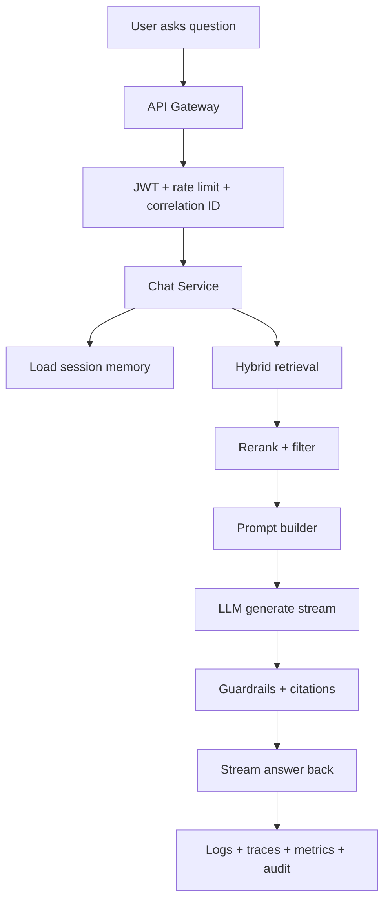
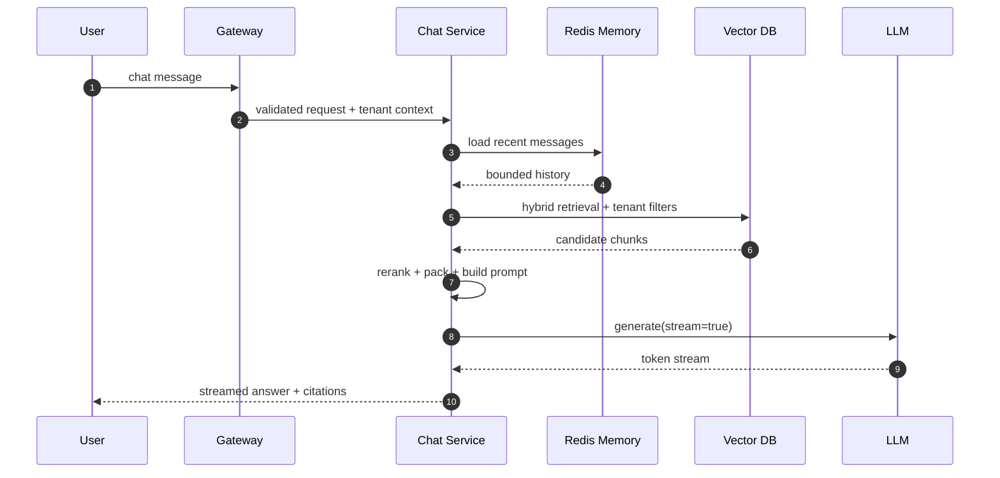

# System Design Topics With Chatbot Reference

This document lists the major system design topics and subtopics an engineer should know, using a production-grade chatbot as the anchor example.

Use it for:

- interview preparation
- architecture study
- HLD/LLD walkthroughs
- converting a chatbot design into a broader system design discussion

Related:

- [chatbot-design-brd-hld-lld.md](/mnt/deepa/rag/docs/architecture/chatbot-design-brd-hld-lld.md)
- [HLD-documind.md](/mnt/deepa/rag/docs/architecture/HLD-documind.md)
- [LLD-documind-by-tool-and-component.md](/mnt/deepa/rag/docs/architecture/LLD-documind-by-tool-and-component.md)

## 0. System Design Topic Matrix

| Topic | Core subtopics | Chatbot reference | Interview focus |
| --- | --- | --- | --- |
| Requirements | functional, non-functional, constraints, KPIs | streaming answers, grounding, tenant isolation, latency target | what problem the chatbot solves and how success is measured |
| Capacity | QPS, concurrency, storage, token volume | active sessions, vector growth, Redis memory, token/day | that chatbot scale includes tokens and streaming, not just requests |
| HLD | clients, gateway, services, stores, workers | client -> gateway -> chat svc -> Redis/vector DB/LLM | the chatbot is a pipeline, not a single API |
| API design | streaming, auth, contracts, errors | `/chat`, `/chat/stream`, JWT, citations, degraded flag | why streaming and metadata matter |
| Data modeling | entities, metadata, lineage, versioning | sessions, messages, docs, chunks, embeddings, prompt versions | metadata quality drives retrieval and safety |
| Database design | OLTP, vector, cache, object store | Postgres, Redis, Qdrant, S3 | choose stores by role |
| Caching | response, semantic, embedding, TTL | repeated answers, Redis session history, invalidation on doc change | cost/latency gains vs freshness risk |
| Async processing | queues, workers, retries, DLQ | ingestion, reindex, feedback labeling | heavy work must stay off the request path |
| Retrieval | chunking, embeddings, hybrid search, rerank | vector + keyword + metadata filters + context packing | retrieval quality is the main quality engine |
| Session state | bounded memory, summarization, durability | Redis recent turns + Postgres durable history | short-term context differs from system truth |
| Scaling | horizontal, pooling, backpressure | bound live streams, reuse clients, scale pods | protect dependencies, not just stateless app nodes |
| Reliability | timeout, retry, breaker, fallback | LLM breaker, degraded response, secondary model | demo vs production difference |
| Security | authn, authz, tenant isolation, guardrails | JWT, tenant filters, prompt injection defense | classic API security plus LLM threats |
| Privacy | PII, retention, audit | redact logs, retain/delete chat history, audit overrides | sensitive data handling is non-optional |
| Observability | logs, traces, metrics, alerts | time-to-first-token, retrieval latency, token usage | break the chatbot into diagnosable stages |
| Performance | latency budget, streaming, batching | top-K cap, early token streaming, batched embeddings | each pipeline stage consumes latency budget |
| Cost | token cost, routing, quotas, attribution | cheaper model for simple queries, tenant budgets | economics is part of design |
| Evaluation | golden set, adversarial set, regression | grounded-answer benchmark, jailbreak corpus | quality loop is required |
| Deployment | canary, rollback, flags, config | prompt/model/reranker canary and rollback | behavior changes require controlled rollout |
| Failure modes | outages, stale data, overload, leak | stale index, Redis outage, bad tenant filter | concrete containment strategy |
| Trade-offs | quality vs cost/latency, recall vs precision | more chunks help recall but hurt latency | show deliberate choices |
| Testing | unit, integration, load, chaos, security, eval | stream concurrency, retrieval filters, LLM timeout drills | multi-layer test strategy |
| Interview framing | BRD, HLD, flow, bottlenecks, future | tenant-safe streaming RAG chatbot | tell the story in the right order |

## 0.1 Anchor Flowchart



## 0.2 Anchor Sequence Diagram



## 0.3 Anchor Network Flow

```text
Browser / Mobile
  -> HTTPS / WSS
Load balancer / edge
  -> API Gateway
  -> Chat Service
     -> Redis
     -> Postgres
     -> Vector DB
     -> Model backend
     -> Observability exporters

Control planes around the runtime:
- ingestion workers
- evaluation jobs
- admin / audit surfaces
```

## 0.4 Sequential Steps To Implement

1. Define BRD, tenant model, latency/cost targets, and success metrics.
2. Build authenticated gateway with correlation ID and rate limiting.
3. Implement chat service skeleton with streaming response support.
4. Add Redis-backed bounded session memory.
5. Build ingestion pipeline: parse, clean, chunk, embed, index.
6. Implement hybrid retrieval with strict tenant filtering.
7. Add reranking, context packing, and prompt assembly.
8. Integrate LLM client with timeout, retry, breaker, and fallback.
9. Add prompt guardrails, PII controls, and audit hooks.
10. Emit logs, traces, metrics, and per-tenant token/cost accounting.
11. Create golden, edge-case, and adversarial evaluation datasets.
12. Add dashboards, alerts, canary rollout, and rollback controls.

## 1. Requirements Engineering

### Subtopics
- functional requirements
- non-functional requirements
- constraints
- assumptions
- KPIs / success metrics

### Chatbot reference
- users can ask questions and receive streamed responses
- answers should be grounded in enterprise documents
- tenant isolation is mandatory
- p95 latency and cost per answer must stay within target

### What to explain in interview
Start by defining what the chatbot must do, who uses it, and what makes it successful. Mention both functionality and constraints, not just features.

## 2. Capacity Estimation

### Subtopics
- QPS
- concurrent sessions
- storage growth
- network bandwidth
- token volume

### Chatbot reference
- concurrent active chat sessions using SSE or WebSockets
- number of uploaded documents and chunk growth over time
- prompt and completion tokens per day
- bandwidth used by streamed partial responses

### What to explain in interview
Show that chatbot design is not only about LLM calls. Capacity planning includes chat concurrency, vector index size, Redis memory, and token consumption.

## 3. High-Level Architecture

### Subtopics
- clients
- gateway
- core services
- data stores
- async workers
- external dependencies

### Chatbot reference
- browser client
- API gateway
- chat service
- ingestion worker
- Redis
- Postgres
- vector DB
- model backend
- observability stack

### What to explain in interview
Describe the main blocks first. The chatbot is a multi-layer system: entry, orchestration, retrieval, generation, storage, and control surfaces.

## 4. API Design

### Subtopics
- synchronous vs streaming APIs
- request and response contracts
- auth headers
- pagination
- idempotency
- error envelopes

### Chatbot reference
- `POST /chat`
- `GET /chat/stream`
- JWT-protected endpoints
- admin endpoints for document management and evaluation

### What to explain in interview
For chatbot systems, API design is strongly tied to streaming UX, auth propagation, and structured response metadata like citations and degraded-mode flags.

## 5. Data Modeling

### Subtopics
- entities
- schemas
- relationships
- metadata design
- lineage
- versioning

### Chatbot reference
- tenants
- users
- sessions
- messages
- documents
- chunks
- embeddings
- citations
- prompt versions

### What to explain in interview
Highlight metadata quality. In a chatbot, data modeling is not only chat history; it also includes retrieval lineage, source metadata, and access-control tags.

## 6. Database Design

### Subtopics
- transactional store
- vector store
- cache
- object storage
- analytics store

### Chatbot reference
- Postgres for sessions, metadata, audit, and admin records
- Redis for session memory and cache
- Qdrant/Milvus for vector retrieval
- S3/MinIO for raw uploaded files
- ClickHouse or equivalent for analytics if needed

### What to explain in interview
Choose stores by role, not by brand name. Chatbots need different storage systems because transactional truth, transient state, and semantic retrieval are different problems.

## 7. Caching

### Subtopics
- response cache
- semantic cache
- embedding cache
- session cache
- TTL
- invalidation

### Chatbot reference
- repeated queries can reuse cached answer
- repeated embeddings can be reused
- recent conversation state sits in Redis
- document change should invalidate stale retrieval or answer cache

### What to explain in interview
Caching is one of the strongest latency and cost optimizations in chatbot systems, but it must respect freshness, tenant isolation, and no-PII rules.

## 8. Messaging And Async Processing

### Subtopics
- queues
- workers
- retries
- DLQ
- backpressure
- scheduled jobs

### Chatbot reference
- document ingestion runs asynchronously
- re-embedding and reindexing can be background jobs
- feedback labeling pipelines run off the request path
- failed ingestion items go to DLQ

### What to explain in interview
Separate interactive chat latency from heavy background work. Ingestion, evaluation, and refresh workflows should not block user requests.

## 9. Retrieval Architecture

### Subtopics
- chunking
- embeddings
- vector indexing
- keyword search
- metadata filtering
- hybrid retrieval
- reranking
- context packing

### Chatbot reference
- document parsing -> chunking -> embedding -> vector upsert
- hybrid search combines vector and lexical retrieval
- tenant and access metadata filters are applied before final ranking
- reranked chunks are packed under token limits

### What to explain in interview
This is the quality engine of the chatbot. Retrieval quality usually matters more than prompt cleverness.

## 10. Session And State Management

### Subtopics
- stateless vs stateful services
- session memory
- bounded context
- summarization
- durable history

### Chatbot reference
- Redis keeps the last N messages
- long sessions can be summarized
- Postgres may persist long-term conversation records

### What to explain in interview
Explain the difference between short-term chat context and durable storage. Redis improves latency; Postgres preserves system truth.

## 11. Concurrency And Scaling

### Subtopics
- horizontal scaling
- connection pooling
- streaming connection management
- worker scaling
- concurrency limits
- backpressure

### Chatbot reference
- scale chat service pods horizontally
- reuse HTTP/DB/vector clients
- bound live streaming sessions and model requests
- protect dependencies with semaphores or queue limits

### What to explain in interview
Scaling a chatbot is not only scaling stateless pods. It also means protecting Redis, vector DB, and the model backend from overload.

## 12. Reliability Engineering

### Subtopics
- retries
- timeouts
- circuit breakers
- fallback
- graceful degradation
- overload handling

### Chatbot reference
- timeout retrieval and model calls
- breaker around LLM backend
- fallback to smaller or secondary model
- degraded answer when retrieval or generation path is impaired

### What to explain in interview
The chatbot must fail predictably. Reliability controls are often the difference between a demo and a production service.

## 13. Security Design

### Subtopics
- authentication
- authorization
- tenant isolation
- secret management
- abuse prevention
- prompt injection defense

### Chatbot reference
- JWT at gateway
- role-aware admin and ops endpoints
- strict `tenant_id` filters in retrieval
- prompt guardrails against malicious source content
- rate limiting and bot abuse controls

### What to explain in interview
For chatbot systems, security includes classic API security plus LLM-specific threats like prompt injection and tool misuse.

## 14. Privacy And Compliance

### Subtopics
- PII detection
- retention
- deletion
- audit trail
- policy enforcement
- data residency

### Chatbot reference
- redact or mask PII before logging
- define retention for chat history and source documents
- audit privileged actions and policy overrides

### What to explain in interview
Chatbots often handle sensitive enterprise information. Logging, retention, and admin workflows must be designed accordingly.

## 15. Observability

### Subtopics
- logs
- metrics
- traces
- dashboards
- alerts
- cost visibility

### Chatbot reference
- measure time to first token
- trace retrieval latency separately from model latency
- include token usage, cache hits, and breaker-open events
- propagate correlation ID end to end

### What to explain in interview
Good observability breaks the chatbot into diagnosable phases: gateway, memory, retrieval, prompt, model, and stream delivery.

## 16. Performance Engineering

### Subtopics
- latency budget
- throughput optimization
- streaming
- batching
- early return strategies
- payload minimization

### Chatbot reference
- stream partial output early
- keep top-K and context size bounded
- batch embeddings in ingestion path
- compress or summarize context to fit token and latency budgets

### What to explain in interview
Performance in chatbot systems is mostly a pipeline-budget problem: retrieval, prompt size, model latency, and stream delivery each consume budget.

## 17. Cost Engineering

### Subtopics
- token cost
- infrastructure cost
- cache efficiency
- model routing
- quotas
- cost attribution

### Chatbot reference
- route simple questions to cheaper models
- apply context limits
- cache repeated answers or embeddings
- track per-tenant token and infrastructure usage

### What to explain in interview
Chatbot design must include economics. A technically correct system can still fail if every answer is too expensive.

## 18. Evaluation And Quality

### Subtopics
- golden dataset
- edge-case dataset
- adversarial dataset
- offline evaluation
- online feedback
- regression gating

### Chatbot reference
- measure retrieval relevance
- measure grounded answer quality
- test jailbreak and prompt-injection cases
- compare candidate prompts/models against baseline

### What to explain in interview
You need a quality loop. Otherwise you will not know whether retrieval or prompt changes improved the chatbot or broke it.

## 19. Deployment And Release Strategy

### Subtopics
- environments
- canary rollout
- rollback
- feature flags
- config versioning
- build and release traceability

### Chatbot reference
- canary a new prompt, reranker, or model
- keep rollback target for retrieval config
- use feature flags for query rewriting or fallback routing

### What to explain in interview
In chatbot systems, rollout risk is high because prompt, model, retrieval, and policy changes all affect behavior.

## 20. Failure Modes

### Subtopics
- dependency outage
- stale data
- retrieval mismatch
- wrong cache
- data leak
- overload

### Chatbot reference
- LLM backend down
- stale vector index after document update
- missing tenant filter
- Redis unavailable
- too many concurrent streaming sessions

### What to explain in interview
Explain concrete failures and the control that contains each one. That shows production maturity.

## 21. Trade-offs

### Subtopics
- recall vs precision
- quality vs latency
- quality vs cost
- simplicity vs flexibility
- consistency vs freshness

### Chatbot reference
- more chunks can improve recall but increase cost and latency
- stronger reranking improves answer quality but adds compute
- more session memory improves continuity but increases token usage

### What to explain in interview
A strong system design answer includes trade-offs, not just components.

## 22. Testing Strategy

### Subtopics
- unit tests
- integration tests
- load tests
- chaos tests
- security tests
- evaluation tests

### Chatbot reference
- unit-test prompt and token packers
- integration-test retrieval with real metadata filters
- load-test streaming concurrency
- chaos-test LLM timeout and breaker behavior
- run adversarial safety corpus

### What to explain in interview
Testing a chatbot is multi-layered: software correctness, retrieval correctness, safety, latency, and regression quality.

## 23. Interview Framing

### Subtopics
- BRD
- HLD
- LLD
- request flow
- data flow
- bottlenecks
- failure controls
- future evolution

### Chatbot reference
- open with “tenant-safe streaming RAG chatbot”
- explain request path from gateway to LLM
- explain retrieval and memory separately
- explain fallback and observability
- close with quality/cost/security trade-offs

### What to explain in interview
Use chatbot to show full-system thinking: requirements, architecture, storage, scaling, security, observability, and trade-offs.

## 24. Recommended Order For A Chatbot System Design Answer

1. Requirements and constraints
2. High-level architecture
3. Request flow
4. Data model and storage choices
5. Retrieval and generation pipeline
6. Scaling and reliability
7. Security and tenant isolation
8. Observability and evaluation
9. Trade-offs
10. Future improvements

## 25. Strong Closing Line

A chatbot system design is not just “call an LLM.” It is API design, retrieval design, session-state design, security, reliability, observability, and cost control wrapped around a model.
