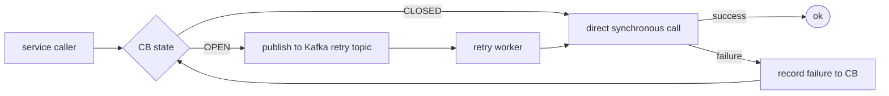

# Phase 2 — Kafka Event Architecture

Every async path in DocuMind rides through Kafka. This doc is the contract.

---

## 1. Topic catalog

Every topic follows `<domain>.<action>.v<N>`.

| Topic | Producer | Consumer group | Purpose |
| --- | --- | --- | --- |
| `doc.uploaded.v1` | api-gateway / ingestion-svc | `parser-workers` | New file uploaded (metadata + blob_uri) |
| `doc.parsed.v1` | parser-workers | `chunker-workers` | Text extracted |
| `doc.chunked.v1` | chunker-workers | `embedding-workers` | Chunks created + parent/child IDs |
| `doc.embedded.v1` | embedding-workers | `index-writers` | Embeddings generated |
| `doc.indexed.v1` | index-writers | `audit-writers`, `cache-invalidator`, `eval-samplers` | Document searchable |
| `doc.updated.v1` | ingestion-svc | `chunker-workers` | Document changed → re-chunk diff |
| `rag.query.received.v1` | api-gateway | `analytics-aggregator`, `eval-samplers` | Every user query captured |
| `rag.response.generated.v1` | inference-svc | `eval-workers`, `audit-writers`, `finops-aggregators` | Answer + citations + tokens |
| `rag.feedback.v1` | frontend | `eval-workers` | Thumbs up / down + comment |
| `mcp.tool.requested.v1` | agent orchestrator | `mcp-action-workers` | Tool call request |
| `mcp.tool.completed.v1` | mcp-action-workers | `audit-writers`, `workflow-engine` | Tool call result |
| `mcp.tool.failed.v1` | mcp-action-workers | `audit-writers`, `alert-svc` | Tool call failure (separate from retry) |
| `approval.requested.v1` | agent orchestrator | `hitl-reviewer-svc` | Human approval needed |
| `usage.tokens.v1` | inference-svc | `finops-aggregators` | Per-call token + cost |
| `audit.event.v1` | every service | `audit-writers` | Compliance trail |
| `eval.replay.requested.v1` | eval-svc, admin | `eval-workers` | Replay historical queries against new model |
| `system.failure.v1` | circuit breakers, observability-svc | `alert-svc`, `remediation-svc` | Breaker + failure events |

## 2. Partition strategy

| Topic class | Partition key | Reason |
| --- | --- | --- |
| Document stages (`doc.*`) | `document_id` | Stages for one doc stay ordered on one partition |
| Query events (`rag.*`) | `tenant_id` | Tenant-level ordering; no cross-tenant ordering requirement |
| MCP actions (`mcp.*`) | `action_id` | Prevents duplicate execution of the same action |
| Audit (`audit.event.v1`) | `tenant_id` | Compliance grouping; per-tenant export |
| FinOps (`usage.tokens.v1`) | `tenant_id` | Aggregate per tenant for budgets |
| Approvals (`approval.*`) | `approval_id` | Ordered state machine per approval |
| Failures (`system.failure.v1`) | `service_name` | Per-service ordering; helps alert aggregation |

**Default partition counts:** 6 for document stages (doc_id scattering), 12 for high-volume query / audit topics, 3 for MCP + approvals (lower volume).

## 3. Event envelope (mandatory for every topic)

Every event — regardless of topic — carries this header:

```json
{
  "event_id": "evt_01HW7YJ9M3X...",
  "event_type": "doc.chunked",
  "event_version": "v1",

  "tenant_id": "tenant_hr_canada",
  "user_id": "user_456",

  "request_id": "req_789",
  "correlation_id": "docflow_001",
  "causation_id": "evt_prev_122",

  "timestamp": "2026-04-24T10:30:00Z",

  "payload": {
    "document_id": "doc_001",
    "chunk_count": 128,
    "chunking_strategy": "section_token_hybrid",
    "chunk_version": "chunk_v3"
  }
}
```

| Field | Required | Purpose |
| --- | --- | --- |
| `event_id` | Yes | Idempotency dedup key |
| `event_type` | Yes | Topic / consumer routing |
| `event_version` | Yes | Schema evolution |
| `tenant_id` | Yes | Tenant isolation + partition |
| `user_id` | Where applicable | Who triggered this |
| `request_id` | Yes | Distributed tracing anchor (W3C traceparent) |
| `correlation_id` | Yes | Workflow-level trace across services |
| `causation_id` | Yes | Previous event that caused this (event-sourcing) |
| `timestamp` | Yes | UTC ISO-8601 |
| `payload` | Yes | Business data |

Schema JSON lives at `schemas/events/<topic>.v<N>.json`. CI validates every producer against its schema.

## 4. Consumer groups

| Consumer group | Reads from | Responsibility |
| --- | --- | --- |
| `parser-workers` | `doc.uploaded.v1` | Parse PDF/HTML/DOCX → emit `doc.parsed.v1` |
| `chunker-workers` | `doc.parsed.v1` + `doc.updated.v1` | Chunk + emit `doc.chunked.v1` |
| `embedding-workers` | `doc.chunked.v1` | Embed + emit `doc.embedded.v1` |
| `index-writers` | `doc.embedded.v1` | Write Qdrant + Neo4j + Postgres; emit `doc.indexed.v1` |
| `audit-writers` | `audit.event.v1` + every `.completed.v1` | Persist audit rows with hash chain |
| `finops-aggregators` | `usage.tokens.v1` | Roll up token cost per tenant per day |
| `eval-workers` | `rag.response.generated.v1`, `rag.feedback.v1`, `eval.replay.requested.v1` | Score answers offline + online |
| `mcp-action-workers` | `mcp.tool.requested.v1` | Execute MCP actions |
| `hitl-reviewer-svc` | `approval.requested.v1` | Surface to human reviewer |
| `alert-svc` | `system.failure.v1`, `mcp.tool.failed.v1` | Fire Alertmanager payloads |

## 5. DLQ strategy

Every main topic has a retry topic and a DLQ. Consumer pattern:

1. Handle message.
2. On retryable exception (network blip, 5xx), republish to `<main>.retry.v1` with incremented `retry_count` header.
3. On `retry_count >= 3`, republish to `<main>.dlq.v1`.
4. Operations runbook: inspect DLQ, decide to drop / patch producer / replay.

| Main topic | Retry topic | DLQ topic |
| --- | --- | --- |
| `doc.uploaded.v1` | `doc.uploaded.retry.v1` | `doc.uploaded.dlq.v1` |
| `doc.chunked.v1` | `doc.chunked.retry.v1` | `doc.chunked.dlq.v1` |
| `doc.embedded.v1` | `doc.embedded.retry.v1` | `doc.embedded.dlq.v1` |
| `mcp.tool.requested.v1` | `mcp.tool.retry.v1` | `mcp.tool.dlq.v1` |
| `rag.response.generated.v1` | `rag.response.retry.v1` | `rag.response.dlq.v1` |

**Consumer-side invariants:**

- Idempotent on `event_id` — duplicates are dropped, not double-processed.
- Every consumer call wrapped in a CB for downstream deps; CB OPEN → message returned to broker for retry, not acked.
- Poison-message heuristic: if the same `event_id` lands in retry 3 times in < 60s, skip directly to DLQ.

## 6. Circuit breaker + Kafka flow



When Ollama is down and the inference CB is OPEN, we still accept the request at the gateway and publish to `rag.response.retry.v1`. The retry worker processes it when the CB closes. UI shows "processing" status.

## 7. Per-scenario mapping

| Scenario | Topic | Partition | Idempotency |
| --- | --- | --- | --- |
| Async document ingestion | doc.* pipeline | document_id | event_id |
| Query logging | rag.query.received.v1 | tenant_id | event_id |
| Token tracking | usage.tokens.v1 | tenant_id | request_id |
| Async LLM (long-generation) | rag.response.retry.v1 | request_id | request_id |
| Tool execution | mcp.tool.requested.v1 | action_id | action_id |
| Human approval | approval.requested.v1 | approval_id | approval_id |
| Online eval sampling | rag.response.generated.v1 | tenant_id | event_id |
| Regression replay | eval.replay.requested.v1 | request_id | event_id |
| Cache warm-up | rag.query.received.v1 consumer | tenant_id | event_id |
| Event sourcing | every domain event | aggregate_id | event_id |

## 8. Multi-tenant isolation

**Per-tenant topics vs. shared topics with tenant partition key:**

| Choice | When |
| --- | --- |
| **Shared topic, `tenant_id` partition key** (default) | Most topics. Simpler operation. |
| **Per-tenant topic** (opt-in) | Regulated tenants with strict egress / residency requirements. Set via `governance.feature_flags.per_tenant_topics`. |

**Cross-tenant invariants:**

- A consumer that processes one tenant's event must never touch another tenant's data — enforced by the `DbClient.tenant_connection(tenant_id)` setting `app.current_tenant` before every query.
- Noisy tenant detection: consumer lag per tenant surfaced in Grafana; throttle at the gateway when lag > threshold.

## 9. Exit criteria

- [ ] `schemas/events/*.v1.json` — one file per topic in the catalog (§1).
- [ ] CI validates producers against schema on every PR.
- [ ] `topics.apply.sh` — idempotent script that creates all topics with configured partitions + retention.
- [ ] Consumer group lag dashboard (Grafana) wired to every group in §4.
- [ ] DLQ dashboard with one panel per topic: depth + oldest-message-age + alert at > 100 msgs.
- [ ] Event replay tool: `make replay TOPIC=<topic> FROM=<ts> TO=<ts>`.
- [ ] Per-tenant consumer lag panel for noisy-neighbor detection.

## 10. Brutal checklist

| Question | Answer required |
| --- | --- |
| Is every topic in §1 documented with producer + consumer owners? | Yes |
| Does every event carry the full envelope (§3)? | Yes |
| Can a poison message be stopped from blocking the partition? | Yes — DLQ after N retries |
| Can a consumer safely re-process duplicate events? | Yes — dedupe on `event_id` |
| Can we replay historical events against a new model? | Yes — via `eval.replay.requested.v1` |
| Can a noisy tenant be throttled? | Yes — per-tenant lag alerts + gateway rate limit |
| Are schema evolutions backward-compatible? | Yes — `event_version` + additive-only changes |
| Is consumer lag monitored with alerts? | Yes — per consumer group |
