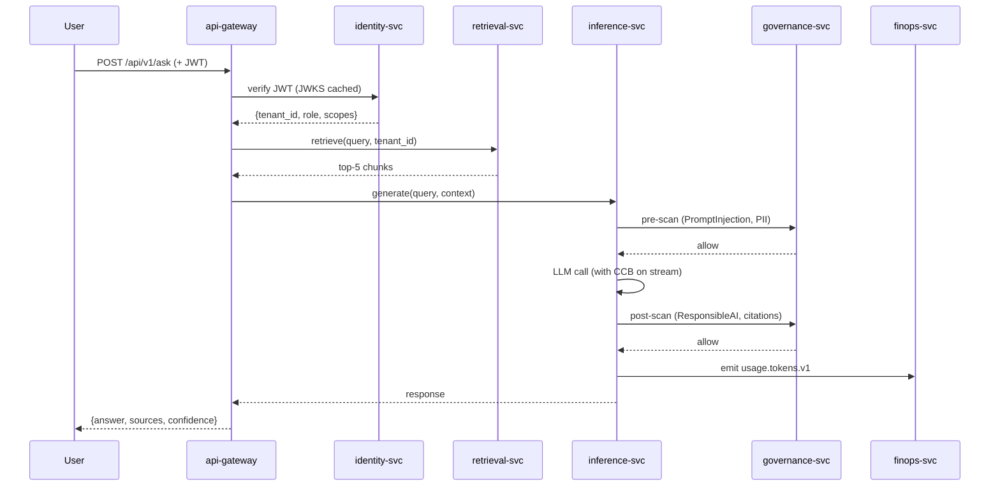

# Phase 2 — Microservices (Service Catalog + APIs)

Not to be confused with [phase-02-kafka-event-architecture.md](phase-02-kafka-event-architecture.md) — that's the async contract between services. This doc is the services themselves.

---

## 1. Service catalog

| Microservice | Main responsibility | Language | Key scenarios |
| --- | --- | --- | --- |
| **api-gateway** | Edge entry, auth, routing, rate-limit, correlation-id | Go | login, rate limit, request validation |
| **identity-svc** | Users, tenants, roles, JWT mint + JWKS | Python | RBAC, ABAC, tenant isolation |
| **query-router** (planned) | Classify intent: Q&A / upload / MCP action / admin | Python | dispatch to correct downstream |
| **ingestion-svc** | Document pipeline (parse → chunk → embed → index) | Python | async upload, re-index, tenant tagging |
| **retrieval-svc** | Search context (vector + BM25 + graph + rerank) | Python | hybrid, tenant-aware, graph-augmented |
| **inference-svc** | Generate answer (prompt build + LLM call + guardrails) | Python | grounded RAG, model fallback, streaming |
| **mcp-orchestrator** (planned) | Tool / action flow | Python | create ticket, query ERP, submit workflow |
| **evaluation-svc** | Offline + online eval, regression gate | Python | Ragas, drift detection, feedback capture |
| **governance-svc** | Policy, HITL, audit, feature flags | Python (Go skeleton) | allow/review/deny decisions |
| **finops-svc** | Cost tracking, budgets, tenant billing | Python (Go skeleton) | token usage, budget CB |
| **observability-svc** | SLO tracking, alert config, incident log | Python (Go skeleton) | SLO dashboards |
| **audit-svc** (folded into governance today) | Compliance log, hash-chain | Python | immutable event trail |
| **frontend** | User + admin UI | Next.js 14 | upload, chat, source view, /tools |

## 2. Main microservice flow (Q&A path)

## 3. End-to-end scenario table

| Scenario | Services involved | Expected behavior |
| --- | --- | --- |
| Ask policy question | gateway · identity · retrieval · inference · governance | Grounded answer + citations |
| Upload PDF | gateway · ingestion · kafka · minio | Async; `/documents/{id}/status` tracks |
| Re-index document | ingestion · kafka · qdrant · postgres | Only changed chunks |
| Tenant-aware search | identity · retrieval · postgres · qdrant | Tenant A cannot see tenant B |
| Hybrid retrieval | retrieval · qdrant · opensearch · reranker | Better context relevance |
| Graph expansion | retrieval · neo4j | Multi-hop entity reasoning |
| LLM fallback | inference · CB · cache | Fallback answer if model fails |
| MCP action | gateway · mcp-orchestrator · mcp-server | Create ticket / submit workflow |
| MCP failure | mcp-orchestrator · CB · governance | Draft / queued action |
| Offline evaluation | evaluation · postgres | Quality score report |
| Online evaluation | inference · kafka · evaluation | Sampled production scoring |
| Cost tracking | inference · finops | Token + cost per tenant |
| Audit logging | every service · governance | Compliance trail |
| Incident debugging | observability · every service | Trace request end-to-end |

## 4. Service APIs (minimum set)

| Service | Required APIs |
| --- | --- |
| api-gateway | `POST /v1/chat` · `POST /v1/documents` · `GET /v1/documents/{id}/status` · `POST /v1/feedback` · `POST /v1/mcp/actions` · `GET /v1/usage` · `GET /v1/health` · `GET /v1/admin/breakers` |
| identity-svc | `POST /validate-token` · `GET /jwks` · `/users` · `/tenants` · `/roles` · `/permissions` |
| ingestion-svc | `POST /documents` · `GET /documents/{id}/status` · `POST /reindex` |
| retrieval-svc | `POST /retrieve` · `POST /hybrid-search` · `POST /graph-expand` |
| inference-svc | `POST /generate` · `POST /stream` · `POST /models/route` |
| mcp-orchestrator | `GET /tools/list` · `POST /tools/call` · `POST /actions/draft` |
| evaluation-svc | `POST /eval/offline` · `POST /eval/online` · `GET /eval/report/{id}` |
| governance-svc | `POST /policy/check` · `POST /approval/request` · `POST /approval/decision` · `GET /audit/events` |
| finops-svc | `GET /usage` · `GET /budget` · `GET /cost-summary` |
| observability-svc | `GET /metrics` · `GET /traces` · `GET /slo` |

OpenAPI contract committed to `docs/api/openapi.yaml` — **Phase 2 exit requirement.**

## 5. Service boundaries (what NOT to do)

| Anti-pattern | Why forbidden |
| --- | --- |
| retrieval-svc calls inference-svc directly | violates CQRS read-only retrieval |
| inference-svc writes to Postgres | violates database-per-service (goes via gateway → correct service) |
| evaluation-svc triggers MCP write tools | can cause real-world side effects from test traffic |
| frontend calls individual backend services | must go through gateway |
| services share a DB table | violates schema-per-service |

## 6. Exit criteria

- [ ] OpenAPI contract for each service (`docs/api/openapi.yaml`).
- [ ] CODEOWNERS entry per service.
- [ ] Health / readiness probe per service.
- [ ] One integration test covering each of the 14 scenarios in §3.
- [ ] Service ownership RACI in `docs/services/ownership-raci.md`.
- [ ] Failure matrix (service down → expected user-visible behaviour) in `docs/services/failure-matrix.md`.

## 7. Brutal checklist

| Question | Required |
| --- | --- |
| Does each service have a clear ownership boundary? | Yes |
| Does each service expose documented APIs? | Yes |
| Is tenant ID propagated everywhere? | Yes |
| Can each service fail independently? | Yes |
| Are sync vs async flows clear? | Yes — sync for Q&A, async for ingestion + audit + eval |
| Are all service calls observable? | Yes — correlation-id + OTel spans |
| Does the repo show ONE working end-to-end flow? | **Not yet** — Day 1.5 work |
