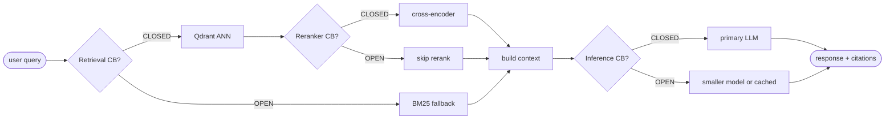
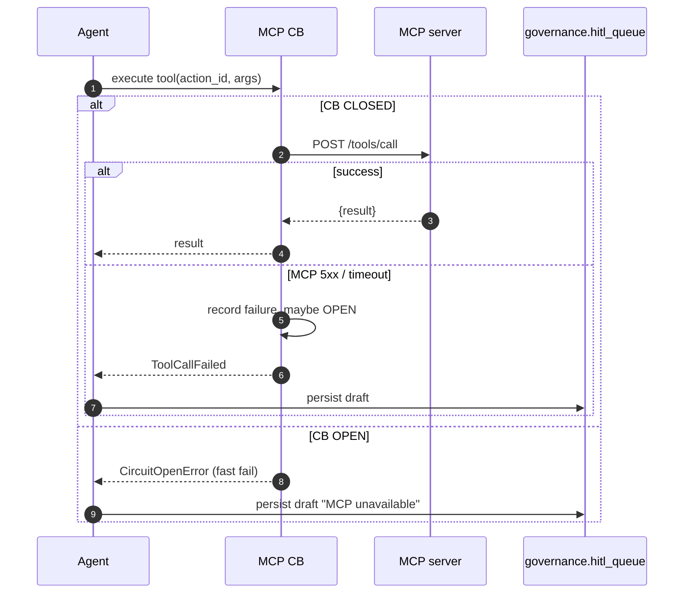

# Phase 3 — Circuit Breaker Scenarios

**Status:** Specified. Code primitives exist; composition at call sites is Day-2 work.

---

## 1. Layered resilience design

Circuit breakers live at four layers. Know which layer owns which concern.

| Layer | Tool | Responsibility |
| --- | --- | --- |
| **Mesh** | Istio DestinationRule | connection caps, outlier detection, mesh-level timeout, traffic routing |
| **App** | `libs/py/documind_core/circuit_breaker.py` + `breakers.py` | business-aware state + fallback branch |
| **Queue** | Kafka + retry topic + DLQ | async recovery when sync path is OPEN |
| **Cache** | Redis | degraded-fast response path during outage |
| **Observability** | Prometheus + Grafana + OTel | breaker metrics + burn-rate alerts |

## 2. Scenario catalog (10 dependencies)

| # | Protected dependency | Owner breaker | Trigger | Fallback |
| --- | --- | --- | --- | --- |
| 1 | LLM (Ollama / vLLM) | Inference CB | timeout / 5xx | smaller model → cached answer → citation-only |
| 2 | Vector DB (Qdrant) | Retrieval CB | p95 breach / 5xx | BM25 search → reduced top-k |
| 3 | Reranker | Retrieval CB | queue timeout | skip rerank + log |
| 4 | MCP server | Agent-loop CB + MCP CB | 5xx / timeout | draft-only action + queue in HITL |
| 5 | Metadata DB (Postgres) | Metadata CB | connection / latency | cached metadata (Redis) |
| 6 | Embedding API | Ingestion CB | timeout | retry topic → DLQ |
| 7 | Audit service | Audit CB (inverted) | write failure | emit Kafka `audit.event.v1` async |
| 8 | FinOps service | FinOps CB (inverted) | unavailable | buffer usage events locally, flush on recovery |
| 9 | Redis (cache) | Cache CB | connection failure | bypass cache, go to source |
| 10 | Neo4j (graph) | Graph CB | timeout | vector-only retrieval |

## 3. Main RAG query flow with breakers



## 4. MCP action flow with breakers



## 5. Breaker states

| State | Meaning | Example |
| --- | --- | --- |
| `CLOSED` | Normal traffic flows | Primary LLM called |
| `OPEN` | Fail-fast (no upstream call) | Do not call slow LLM |
| `HALF_OPEN` | Test recovery with 1–5 probes | Try once; success → CLOSED, failure → OPEN |
| `FORCED_OPEN` | Manually disabled dependency | Disable MCP write tools for maintenance |
| `DISABLED` | Breaker inactive (dev only) | Local debugging |

## 6. Config table (config-driven, not hard-coded)

Env-driven thresholds — `DOCUMIND_CB_<NAME>_<KEY>`:

| Dependency | Failure % | Slow-call threshold | Open duration | Half-open probes |
| --- | --- | --- | --- | --- |
| LLM | 50% | > 4s | 30s | 3 |
| Vector DB | 40% | > 500ms | 20s | 5 |
| Reranker | 50% | > 300ms | 15s | 3 |
| MCP server | 30% | > 2s | 60s | 2 |
| Metadata DB | 40% | > 250ms | 20s | 5 |
| Embedding model | 50% | > 5s | 60s | 2 |

## 7. Fallback decision matrix

Risk tier determines fallback. Tier set per (tenant, endpoint) in `governance.policies`.

| Failure | Low-risk query | Medium-risk query | High-risk query |
| --- | --- | --- | --- |
| LLM down | smaller model | cached / citation-only | refuse — ask user to retry |
| Vector DB down | BM25 fallback | curated index only | refuse — no verified source |
| Reranker down | skip rerank | reduced confidence | require human review |
| MCP down | draft action | queue action | block action |
| Metadata DB down | cached metadata | limited answer | block — access cannot be verified |
| Audit down | async buffer | async buffer | block — audit legally required |

## 8. Chaos drill catalog

Each drill has an exact command and expected behaviour.

| # | Drill | Command | Expected |
| --- | --- | --- | --- |
| 1 | Kill Ollama | `docker compose kill ollama` | LLM CB OPEN within 5 consecutive failures; fallback response returned; `fallback_used=smaller_model` label in response |
| 2 | Slow Qdrant (latency inject) | Istio VS with 2s fault delay | Retrieval CB OPEN; BM25 fallback path used |
| 3 | Kill Neo4j | `docker compose kill neo4j` | Graph CB OPEN; vector-only retrieval |
| 4 | Kill Redis | `docker compose kill redis` | Cache CB OPEN; bypass cache; p95 spikes but no 5xx |
| 5 | Kill MCP server | `docker compose kill mcp-server-itsm` | MCP CB OPEN; draft persisted to `governance.hitl_queue` |
| 6 | Kill Kafka | `docker compose kill kafka` | Local outbox buffers; no event loss; relay resumes on recovery |
| 7 | Force 5xx from reranker | Istio fault `abort: { httpStatus: 500, percentage: 100 }` | Reranker CB OPEN; skip rerank; log entry |
| 8 | Spike traffic | `hey -n 10000 -c 200 /api/v1/ask` | Gateway rate-limit; no CB trip on healthy deps |

## 9. Observability metrics

| Metric | Type | Label set | Purpose |
| --- | --- | --- | --- |
| `documind_circuit_breaker_state` | Gauge | `{name}` | 0=CLOSED, 1=HALF_OPEN, 2=OPEN |
| `documind_circuit_breaker_failures_total` | Counter | `{name}` | Cumulative failures observed |
| `documind_circuit_breaker_opens_total` | Counter | `{name}` | Number of times opened |
| `documind_circuit_breaker_rejections_total` | Counter | `{name}` | Fast-fail rejections |
| `documind_fallback_used_total` | Counter | `{name, fallback_type}` | Which fallback path taken |
| `documind_breaker_open_duration_seconds` | Histogram | `{name}` | How long breakers stay open |
| `documind_dependency_latency_seconds` | Histogram | `{dep}` | Root-cause signal |

## 10. Implementation pattern

```python
from documind_core.resilience import with_resilience

@with_resilience(
    name="ollama",
    timeout_s=4.0,
    retries=2,
    backoff="exponential",
    expected_exception=(httpx.HTTPError, asyncio.TimeoutError),
    fallback=call_smaller_model,
)
async def call_primary_llm(query, context):
    return await httpx_client.post(OLLAMA_URL, json={...})
```

The `@with_resilience` decorator composes: **timeout → retry w/ backoff → circuit breaker → fallback**. Never use the raw breaker in application code — always go through this decorator so retry + timeout are always composed.

```python
# Manual usage for non-decorator sites (rare):
async def rag_answer(query, tenant_id):
    context = None

    if vector_breaker.allow_call():
        try:
            context = await vector_search(query, tenant_id, timeout_ms=500)
            vector_breaker.record_success()
        except Exception:
            vector_breaker.record_failure()
            context = await keyword_fallback(query, tenant_id)
    else:
        context = await keyword_fallback(query, tenant_id)

    # … same pattern for LLM

    return answer
```

## 11. Exit criteria

- [ ] `libs/py/documind_core/resilience.py::with_resilience` decorator implemented.
- [ ] Every external call site in `services/*/app/` wraps through `@with_resilience` (verified by grep).
- [ ] Thresholds config-driven via env / ConfigMap, never hard-coded.
- [ ] `infra/grafana/dashboards/circuit-breakers.json` committed with one panel per named breaker.
- [ ] `make chaos-phase-3` runs the 8 drills and asserts expected behaviour.
- [ ] Tests in `libs/py/tests/resilience/`:
  - [ ] `test_llm_breaker.py`
  - [ ] `test_vector_breaker.py`
  - [ ] `test_mcp_breaker.py`
  - [ ] `test_cache_fallback.py`
  - [ ] `test_audit_async_fallback.py`

## 12. Brutal checklist

| Question | Required answer |
| --- | --- |
| What happens when LLM is down? | Fallback model / cache / citation-only (tier-dependent) |
| What happens when vector DB is slow? | BM25 / reduced top-k / cache |
| What happens when MCP action fails? | Draft-only / queue / block |
| Can you prove a breaker opened? | Metrics panel + test output |
| Can you prove a fallback worked? | Demo trace + `fallback_used_total` counter |
| Can you prevent a retry storm? | Timeout + exponential backoff + retry budget |
| Can you avoid duplicate MCP actions? | Idempotency key per action_id |
| Can you recover safely? | HALF_OPEN probes; CB transitions logged |
