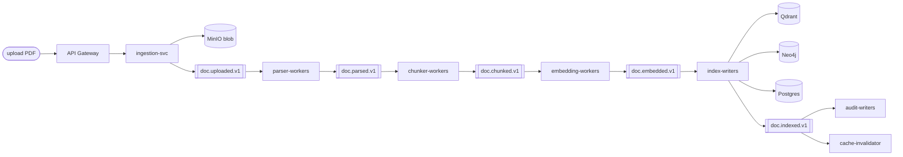
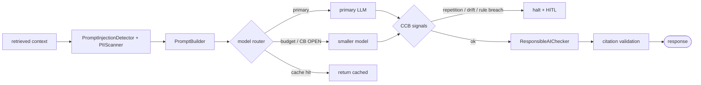

# Phase 4 — RAG Core: Ingestion · Retrieval · Inference

**Status:** Specified. Core classes exist; full flows + eval pipeline are Day-2/3 work.

---

## 1. Topic map

### Chunking

| Type | Implementation | Default |
| --- | --- | --- |
| Paragraph | `services/ingestion-svc/app/chunking/windowed.py` | Fallback |
| Section / heading | `services/ingestion-svc/app/chunking/structural.py` | **Active for PDFs** |
| Sentence window | `services/ingestion-svc/app/chunking/sentence.py` | Short docs |
| Semantic (embedding-clustered) | Planned | — |
| AST (code) | Planned | — |
| Table-aware | via `unstructured` / LayoutLMv3 | Finance/ops docs |
| Legal-clause | Not implemented | — |
| Hierarchical (doc → section → chunk) | parent/child IDs on `ingestion.chunks` | **Recommended default** |

**Starter config (ship today):** section-aware + 600–800 tokens + 15% overlap + metadata `{doc_id, section, tenant_id, embedding_model, embedding_version}`.

### Embeddings

| Bucket | Options | Active |
| --- | --- | --- |
| Local | BGE-m3, E5, Instructor, GTE, Nomic, MiniLM | **BGE-m3 1024-dim** |
| Hosted | OpenAI text-embedding-3, Cohere embed v3, Azure, Bedrock Titan | Fallback tier |
| Multimodal | CLIP / SigLIP, BLIP | Planned |

Knobs: `dimension` (1024) · `normalization` (L2) · `distance` (cosine) · `embedding_version` stamped per chunk — **critical for re-index without drift**.

### Retrieval

| Pattern | Where | Fallback |
| --- | --- | --- |
| Vector ANN | `services/retrieval-svc/app/services/vector_searcher.py` | BM25 |
| BM25 / keyword | OpenSearch / Postgres FTS | Vector-only |
| Hybrid (vector + keyword + RRF) | `hybrid_retriever.py` | Single-leg degrade |
| Cross-encoder rerank | BGE reranker v2, top-20 → top-5 | Skip rerank |
| Graph augmentation | `graph_searcher.py` | Vector-only |
| Tenant filter | Mandatory payload filter in QdrantRepo | **Never disabled** |

### Inference

| Pattern | Where | Fallback |
| --- | --- | --- |
| Grounded answer | `services/inference-svc/app/` | — |
| Model fallback (CB) | Premium → local llama3 | Smaller model |
| Streaming | SSE + CCB | Terminate on breaker |
| Context-window pack | Greedy | Compress low-score chunks |

### Cache

| Layer | Key schema | TTL |
| --- | --- | --- |
| Semantic answer cache | `tenant:{id}:q:{sha256(norm_q + model_ver + prompt_ver)}` | 1h |
| Retrieval cache (top-K IDs) | `tenant:{id}:retr:{sha256(q + filter_hash)}` | 15m |
| Chunk cache | `tenant:{id}:chunk:{chunk_id}` | 24h |
| Embedding cache | `embed:{model_version}:{sha256(text)}` | 7d |
| Session cache | `tenant:{id}:sess:{user_id}` | 1h sliding |
| Rate-limit counter | `rl:{tenant}:{window}` | Window |
| CB state | `cb:{name}:{instance}` | Live |

**Non-negotiable:** never cache PII responses; invalidate on content-change events; tenant-namespaced keys; cache key must include `embedding_version` + `prompt_version` so upgrades invalidate correctly.

## 2. Ingestion flow



### Scenarios + failure handling

| Scenario | What happens | Failure handling |
| --- | --- | --- |
| PDF upload | Blob stored, event emitted | Corrupt file → reject with 422 |
| Large file | Async pipeline | `/documents/{id}/status` shows progress |
| Duplicate document | Hash check | Skip or version bump |
| Updated document | Re-chunk changed sections only | Old chunks marked inactive |
| OCR document | Image text extracted | Low OCR confidence flagged |
| Table-heavy document | Table-aware chunking | Preserves row/column context |
| Multi-tenant document | Tenant metadata attached | Block cross-tenant indexing at saga step |
| PII document | Classify / redact / label | Policy flag before retrieval |
| Embedding failure | Retry topic | DLQ after max retries |
| Partial indexing | Saga state used | Resume from last checkpoint |

## 3. Retrieval flow

```mermaid
flowchart LR
  q([query]) --> norm[normalize + tenant filter]
  norm --> emb[embed query]
  emb --> ann[Qdrant ANN]
  norm --> bm25[BM25]
  ann --> rrf[reciprocal rank fusion]
  bm25 --> rrf
  rrf --> graph[Neo4j 1-hop neighbours]
  graph --> rerank[cross-encoder rerank]
  rerank --> topk[top-5 chunks]
```

### Scenarios + fallback

| Scenario | What happens | Fallback |
| --- | --- | --- |
| Simple semantic search | Vector top-K | Keyword fallback |
| Exact policy lookup | BM25 first | Vector expansion |
| Hybrid retrieval | Vector + keyword merge | Use whichever succeeds |
| Graph RAG | Entity expansion in Neo4j | Vector-only |
| Tenant-aware retrieval | Tenant filter enforced | **Fail closed** if tenant missing |
| Role-based retrieval | RBAC/ABAC metadata filter | Block restricted chunks |
| Low similarity result | Confidence warning | Ask clarification |
| No result found | Return no-answer | **Do not hallucinate** |
| Reranker timeout | Skip reranker | Use raw top-k |
| Vector DB slow | CB opens | Cache / BM25 |

## 4. Inference flow



### Scenarios

| Scenario | What happens | Fallback |
| --- | --- | --- |
| Standard answer | Prompt + context → LLM | — |
| Streaming answer | Token stream to UI | Stop safely on CCB interrupt |
| Long context | Compress / reduce chunks | Smaller top-K |
| Missing evidence | No-answer response | Ask user to refine |
| LLM timeout | CB opens | Fallback model / cache |
| High-risk answer | Governance check | Human review |
| Citation generation | Sources attached | Block uncited claims |
| Model routing | Choose model by tenant/tier | Cheaper model for low-risk |
| Prompt versioning | Prompt template tracked | Rollback prompt via flag |
| Output violation | Redact / block | Safe response |

## 5. Quality metrics

| Metric | Why | Where measured |
| --- | --- | --- |
| Context precision | Retrieved chunks are relevant | eval-svc (Ragas) |
| Context recall | Important evidence retrieved | eval-svc |
| Faithfulness | Answer supported by context | eval-svc |
| Answer relevance | Answer matches query | eval-svc |
| Citation accuracy | Sources correct | eval-svc + governance |
| Latency p50/p95/p99 | UX | Prometheus |
| Cost per query | FinOps | finops-svc |
| No-answer accuracy | Avoids hallucination | eval-svc |

## 6. Exit criteria

- [ ] Golden dataset in `docs/eval/golden/*.jsonl` (≥ 50 Q/A pairs, 3+ tenants).
- [ ] `make eval` runs Ragas → writes `data/eval/<date>/report.json`.
- [ ] CI gate: merge blocks if faithfulness drops > 3% or precision@5 drops > 5%.
- [ ] `embedding_version` stamped on every new chunk (verified by a test).
- [ ] Cache TTLs configured per layer in `libs/py/documind_core/cache.py`.
- [ ] End-to-end demo: upload PDF → poll status → ask question → cited answer. Scripted in `scripts/demo-rag-core.sh`.

## 7. Common pitfalls (catch early)

1. Chunk too small → no context → hallucination.
2. Chunk too large → token bloat → cost + latency.
3. No embedding version → silent drift after model upgrade.
4. No tenant filter in cache key → cross-tenant leak (same class as RLS bypass).
5. No eval pipeline → "it seems to work" illusion.
6. No cache invalidation on content change → stale policy answers.
7. Retriever returns empty → model hallucinates rather than returning no-answer.
8. Citations missing — model output passed through without source validation.

## 8. Brutal checklist

| Question | Required |
| --- | --- |
| Can one document go end-to-end from upload to answer? | Yes |
| Are chunks versioned? | Yes |
| Are embeddings versioned? | Yes |
| Is tenant filtering enforced before retrieval? | Yes |
| Can system say "I don't know"? | Yes |
| Can retrieval fail without full system failure? | Yes — BM25 / cache fallback |
| Can model fail without full system failure? | Yes — smaller model / cache |
| Are citations traceable to source chunks? | Yes |
