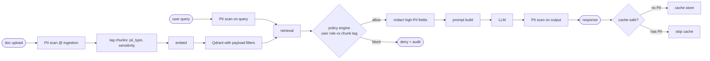

# Phase 9 — PII Protection in RAG

**Status:** Specified. Regex `PIIScanner` exists in `libs/py/documind_core/ai_governance.py`; NER + metadata tagging + policy integration are gaps.

---

## 1. What it is

Detecting, masking, blocking, encrypting, or controlling personally identifiable information (PII) in:
documents · prompts · retrieval context · model output · logs · cache · MCP tool calls.

**Why critical:** RAG can silently leak PII if it enters chunks, embeddings, cache, logs, or answers without controls. Embeddings themselves encode sensitive meaning — once in the vector DB, it's hard to remove.

## 2. PII scenario catalog

| # | Scenario | Risk | Control |
| --- | --- | --- | --- |
| 1 | PDF contains SSN / SIN | PII indexed into vector DB | detect + classify before embedding |
| 2 | User asks for another employee's salary | unauthorized disclosure | RBAC/ABAC block |
| 3 | Retrieved chunk contains email / phone | model may expose it | mask before prompt |
| 4 | PII stored in cache | cross-user leakage | tenant+user-scoped cache key |
| 5 | PII in logs | compliance issue | log redaction at log sink |
| 6 | PII sent to external LLM | residency / privacy risk | redact or route to private model |
| 7 | MCP tool returns customer data | tool result leakage | policy check before appending to model context |
| 8 | Evaluation dataset contains PII | test-data exposure | anonymized golden dataset |

## 3. PII flow (where controls fire)



## 4. Implementation components

| Component | What to implement | Where |
| --- | --- | --- |
| PII detector | Regex for structured (email/phone/SSN/CC/IP) | `libs/py/documind_core/ai_governance.py` (exists) |
| PII NER | Presidio for person / address / date / name | **gap** — integrate Microsoft Presidio |
| Classifier | low / medium / high sensitivity per tenant | new `classify_pii(detected)` |
| Redaction engine | mask before prompt / log / cache | Presidio anonymizer |
| Metadata tagger | `pii_type=email,ssn`, `sensitivity=high` on chunks | ingestion saga |
| Policy engine | allow / block based on user role + pii tag | governance-svc + OPA/Cedar |
| Audit logger | record access to sensitive chunks | governance.audit_log |
| Cache policy | never cache high-PII answers | `Cache.set(pii_flag=...)` |
| LLM router | sensitive → private model only | inference-svc router |

## 5. Example policy (CEL-style)

```
IF chunk.contains_pii = true
AND user.role NOT IN ["HR_ADMIN", "COMPLIANCE"]
THEN block retrieval + audit
```

## 6. Tools

| Need | Options |
| --- | --- |
| PII detection | Microsoft Presidio · AWS Comprehend PII · Google DLP · Azure AI Language PII |
| Policy | OPA (Rego) · Cedar · OpenFGA · custom ABAC |
| Redaction | Presidio anonymizer · custom masking |
| Log redaction | OTel processors · Fluent Bit redaction filters |
| Data classification (enterprise) | Microsoft Purview · Collibra · BigID |

## 7. PII test cases

| Test | Expected |
| --- | --- |
| Upload document with SIN / SSN | chunk classified `sensitivity=high`, `pii_type=ssn` |
| Normal user retrieves HR doc | PII chunks blocked by policy |
| HR admin retrieves HR doc | allowed + audit row written |
| Output contains phone number | masked before response returns |
| Log contains email | redacted at Fluent Bit / Logstash |
| High-PII answer | `Cache.set(pii_flag=true)` → refuses to cache |

## 8. Exit criteria

- [ ] Presidio wired into ingestion-svc — runs on every parsed doc.
- [ ] `ingestion.chunks.pii_type` + `sensitivity` columns added + populated.
- [ ] `governance.policies` contains at least one CEL rule using `chunk.sensitivity`.
- [ ] `services/governance-svc/app/policies/pii_policy.rego` (or CEL equivalent) committed.
- [ ] `Cache.set` refuses to store when response has `pii_flag=true`.
- [ ] Log redaction filter applied at Filebeat / Logstash.
- [ ] `tests/security/test_pii_redaction.py` covers each row in §7.
- [ ] Demo script: upload doc with PII → show it gets tagged → show non-admin blocked → show admin retrieves with audit log.

## 9. Files to add

```
docs/security/pii-protection.md
docs/security/pii-policy-matrix.md
docs/security/pii-redaction-flow.md
docs/security/pii-test-cases.md
services/governance-svc/app/policies/pii_policy.rego
services/ingestion-svc/app/pii_detector.py
services/inference-svc/app/guards/pii_output_guard.py
tests/security/test_pii_redaction.py
```

## 10. Brutal checklist

| Question | Required |
| --- | --- |
| Is PII detected before embedding? | Yes |
| Are chunks tagged with PII metadata? | Yes |
| Can policy block retrieval based on PII tag? | Yes |
| Is output PII masked before response returns? | Yes |
| Are logs redacted? | Yes |
| Is cache PII-aware (never store high-PII)? | Yes |
| Are PII decisions audited? | Yes |
| Is the eval dataset anonymized? | Yes |
