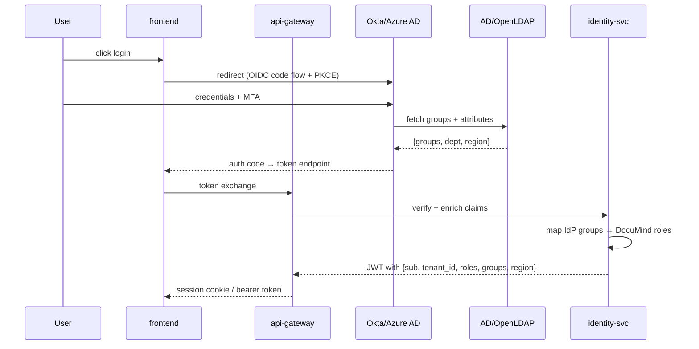

# Phase 10 — LDAP / SSO Identity Integration

**Status:** Specified. Local JWT + API keys exist in identity-svc. OIDC/SAML/LDAP integration is the single biggest blocker for enterprise deals.

---

## 1. LDAP — what and why

| Item | Detail |
| --- | --- |
| What | Directory service storing users, groups, org hierarchy |
| Examples | Active Directory · OpenLDAP · FreeIPA |
| Why in RAG | Map enterprise users → roles → permissions → document access |

### LDAP scenarios

| Scenario | Flow | Why |
| --- | --- | --- |
| User login | LDAP validates credentials | central identity |
| Group membership | user → groups (HR, Finance) | RBAC mapping |
| Org hierarchy | manager → employee | approval flows |
| Department mapping | user → department | ABAC filtering |
| Disable user | LDAP deactivation | immediate access revoke |
| Sync users | periodic sync to system DB | performance |
| Attribute retrieval | email, role, region | policy enforcement |
| Password policy | enforced by LDAP | not app responsibility |

## 2. SSO — what and why

| Item | Detail |
| --- | --- |
| What | Single Sign-On via identity provider |
| Examples | Okta · Azure AD · Google Workspace · Auth0 · Keycloak |
| Protocols | OAuth 2.0 · OpenID Connect (OIDC) · SAML 2.0 |
| Why in RAG | seamless enterprise login + centralized control + MFA delegation |

### SSO scenarios

| Scenario | Flow |
| --- | --- |
| User login via Okta / Azure AD | redirect → IdP login → code exchange → JWT |
| Token validation | JWT verified at gateway against cached JWKS |
| Token refresh | long sessions without re-login |
| Multi-app access | same IdP session for multiple tools |
| Logout | invalidate session globally |
| MFA | handled by IdP |
| Conditional access | location / device / risk-based |
| External user access | partner login via federated IdP |

## 3. Combined flow



## 4. JWT claims design (critical)

Every JWT must carry:

```json
{
  "sub": "user_123",
  "email": "user@company.com",
  "tenant_id": "tenant_hr_canada",
  "roles": ["HR_USER"],
  "groups": ["HR", "CANADA"],
  "department": "HR",
  "region": "CA",
  "permissions": ["read_docs", "create_ticket"],
  "auth_time": 1710000000,
  "exp": 1710003600,
  "iss": "documind-identity",
  "aud": "documind-api"
}
```

- `tenant_id` — **mandatory**. Missing → request rejected at gateway.
- `roles` — used by RBAC.
- `groups, department, region` — used by ABAC.
- `permissions` — fine-grained scope list (optional; roles expand to these server-side).
- `exp` — short TTL (15 min); refresh via refresh token.

## 5. Security scenarios

| Scenario | Required control |
| --- | --- |
| Expired token | reject at gateway |
| Tampered token | signature validation fail |
| Missing `tenant_id` | reject |
| Role escalation attempt | ignore client-supplied role; only trust IdP-issued claims |
| Replay attack | short TTL + refresh + JTI replay cache |
| MFA required | enforced at IdP (not app) |
| External user | restricted role mapping |
| Admin access | separate claim + stricter AuthorizationPolicy |
| Service-to-service | mTLS + service identity (not JWT) |
| MCP action | re-check user permission at tool invocation |

## 6. Implementation architecture

| Component | Role |
| --- | --- |
| Identity Provider (IdP) | Okta / Azure AD / Auth0 / Keycloak |
| Directory | LDAP / Active Directory |
| API Gateway | validate JWT via cached JWKS |
| identity-svc | map IdP claims → DocuMind roles + tenant |
| Policy Engine | enforce RBAC/ABAC (see Phase 11) |
| Token service | refresh / revoke |
| SCIM endpoint | automated user provisioning |
| Audit service | log every login / access / role change |

## 7. Tools

| Need | Options |
| --- | --- |
| SSO | Okta · Azure AD · Auth0 · Keycloak (OSS, self-hosted) |
| LDAP | Active Directory · OpenLDAP · FreeIPA |
| JWT validation | `jose` / `PyJWT` / Go `lestrrat-go/jwx` |
| JWKS caching | in-process with TTL from Cache-Control |
| Policy | OPA · Cedar · OpenFGA |
| Identity sync | SCIM 2.0 |
| Secrets | HashiCorp Vault · AWS Secrets Manager · Azure Key Vault |

## 8. Exit criteria

- [ ] OIDC code-flow integration against Keycloak (local dev) — commit `services/identity-svc/app/sso_handler.py`.
- [ ] JWKS caching + rotation in `services/api-gateway` — commit `app/token_validator.go`.
- [ ] SAML 2.0 adapter (planned, off by default).
- [ ] LDAP bind + group search — commit `services/identity-svc/app/ldap_client.py`.
- [ ] SCIM 2.0 endpoint for provisioning.
- [ ] `governance.role_mappings` table — (IdP group → DocuMind role).
- [ ] Demo: log in via Keycloak → JWT carries tenant + groups → gateway rejects request without tenant → admin role separated.
- [ ] Tests:
  - [ ] `tests/security/test_jwt_validation.py`
  - [ ] `tests/security/test_role_mapping.py`
  - [ ] `tests/security/test_tenant_enforcement.py`

## 9. Files to add

```
docs/security/ldap-integration.md
docs/security/sso-architecture.md
docs/security/jwt-claims-design.md
docs/security/auth-flow.md
docs/security/role-mapping.md
services/identity-svc/app/ldap_client.py
services/identity-svc/app/sso_handler.py
services/identity-svc/app/token_validator.py
```

## 10. Brutal checklist

| Question | Required |
| --- | --- |
| Can a user log in via SSO (OIDC)? | Yes |
| Do roles come from LDAP / IdP groups (not client-supplied)? | Yes |
| Is the JWT validated at every gateway request? | Yes |
| Is `tenant_id` enforced (missing = reject)? | Yes |
| Can role restrict document access? | Yes |
| Can admin access be isolated? | Yes |
| Can a user be disabled instantly (IdP deactivation)? | Yes |
| Is MFA handled by the IdP (not re-implemented)? | Yes |
| Does MCP action re-check user permission? | Yes |

## 11. Final insight

Without LDAP/SSO the platform is a demo. With it, it becomes identity-aware enterprise AI.
