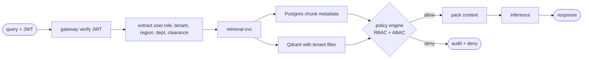

# Phase 11 — RBAC + ABAC Access Control

**Status:** Specified. Postgres RLS (tenant boundary) proven; app-level RBAC/ABAC and policy engine are gaps.

---

## 1. Core difference

| Model | What it uses | Example |
| --- | --- | --- |
| **RBAC** (role-based) | roles assigned to user | `HR_USER` can read HR docs |
| **ABAC** (attribute-based) | attributes: user, resource, context | `user.region == doc.region` |

## 2. Why BOTH are needed in RAG

RAG is not simple API access. You must control:

- **Who** — user / role
- **What** — document / chunk / action
- **Where** — region / tenant / department
- **When** — time / context / session
- **How** — read vs write (MCP action)

RBAC = coarse. ABAC = fine. Combined = enterprise-grade.

## 3. RBAC scenario catalog

| Scenario | Rule |
| --- | --- |
| HR user reads HR docs | `role=HR_USER` |
| Finance user reads finance policy | `role=FINANCE_USER` |
| Admin dashboard | `role=ADMIN` |
| MCP create ticket | `role=SUPPORT_USER` |
| Upload documents | `role=CONTRIBUTOR` |
| Run evaluation | `role=DATA_SCIENTIST` |
| Access audit logs | `role=COMPLIANCE` |
| Delete document | `role=ADMIN` only |

## 4. ABAC scenario catalog (critical for RAG)

| Scenario | Rule |
| --- | --- |
| Region restriction | `user.region == doc.region` |
| Tenant isolation | `user.tenant_id == doc.tenant_id` |
| Department access | `user.department == doc.department` |
| Time-based | access only during business hours |
| Sensitivity level | `doc.sensitivity <= user.clearance` |
| Project-scoped | `user.project_id == doc.project_id` |
| PII access | `user.role in ["HR_ADMIN", "COMPLIANCE"]` |
| Location-based | block access outside country |
| Device-based | allow only managed device |
| Session-based | restrict after N minutes of inactivity |

## 5. Combined flow in RAG retrieval



## 6. Control points per stage

| Stage | Control |
| --- | --- |
| Ingestion | tag document with attributes: tenant, region, dept, sensitivity |
| Retrieval | filter chunks using ABAC before returning |
| Prompt build | exclude restricted chunks from context |
| Inference | block unsafe query before LLM call |
| Output | redact sensitive fields |
| MCP action | **re-check permissions at tool execution** |

## 7. Policy examples (CEL-style)

### RBAC
```
IF user.role == "HR_USER"
THEN allow read "hr_documents"
```

### ABAC
```
IF user.tenant_id == doc.tenant_id
AND user.region == doc.region
AND doc.sensitivity <= user.clearance
THEN allow access
```

### Combined
```
IF user.role IN ["HR_USER", "HR_ADMIN"]
AND user.region == doc.region
AND doc.sensitivity <= user.clearance
THEN allow
ELSE deny + audit
```

## 8. Failure scenarios

| Failure | Risk | Fix |
| --- | --- | --- |
| Missing tenant filter | cross-tenant leak | enforce at DB (RLS) + app (ABAC) |
| Role-only control | too coarse | add ABAC layer |
| Attribute mismatch | false deny | validate metadata at ingest |
| Wrong claims in JWT | privilege escalation | verify at gateway; never trust client |
| Cached response reused | cross-user leak | tenant+role-aware cache key |
| MCP action bypass | unauthorized write | re-check at execution, not just at request |
| Missing audit | no trace | log every allow + deny decision |

## 9. Tools

| Need | Options |
| --- | --- |
| Policy engine | OPA (Rego) · Cedar · OpenFGA |
| Identity | Azure AD · Okta · Keycloak |
| Attribute store | Postgres + directory |
| Enforcement | API gateway + services |
| Audit | OpenTelemetry + structured log store |

## 10. Exit criteria

- [ ] Policy engine chosen (OPA recommended for Rego) and integrated into governance-svc.
- [ ] `governance.policies` table — (id, name, expression, version, active).
- [ ] Chunk metadata schema extended: `region, department, sensitivity, project_id`.
- [ ] RBAC rules authored per role in `services/governance-svc/app/policies/rbac.rego`.
- [ ] ABAC rules authored in `services/governance-svc/app/policies/abac.rego`.
- [ ] Every retrieval request runs through policy engine before returning chunks.
- [ ] Every MCP invocation re-checks permission at execution (not just at request).
- [ ] Cache key includes `role_hash` to prevent cross-role cache reuse.
- [ ] Tests:
  - [ ] `tests/security/test_rbac.py` — role restricts access
  - [ ] `tests/security/test_abac.py` — region/dept/sensitivity filters
  - [ ] `tests/security/test_tenant_isolation.py` — proves cross-tenant impossible
  - [ ] `tests/security/test_policy_audit.py` — every decision logged

## 11. Files to add

```
docs/security/rbac-model.md
docs/security/abac-model.md
docs/security/policy-engine.md
docs/security/access-control-flow.md
services/governance-svc/app/policies/rbac.rego
services/governance-svc/app/policies/abac.rego
tests/security/test_rbac.py
tests/security/test_abac.py
tests/security/test_tenant_isolation.py
```

## 12. Brutal checklist

| Question | Required |
| --- | --- |
| Can RBAC restrict access by role? | Yes |
| Can ABAC filter by region / tenant / sensitivity? | Yes |
| Is tenant isolation enforced at DB + cache + vector store? | Yes |
| Can restricted chunks be filtered before prompt build? | Yes |
| Can MCP action be blocked at execution time? | Yes |
| Is cache tenant + role safe? | Yes |
| Are all decisions auditable (allow + deny)? | Yes |

## 13. Final insight

- RBAC alone → ❌ risky (misses region / sensitivity / context)
- ABAC alone → ❌ complex to operate at scale
- RBAC + ABAC → ✅ enterprise-grade
