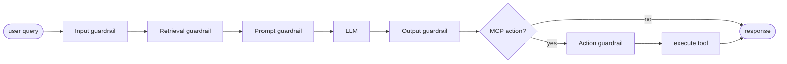

# Phase 12 — Guardrails + Secure AI

**Status:** Specified. Input scanners exist (`PromptInjectionDetector`, `PIIScanner`, `AdversarialInputFilter`, `ResponsibleAIChecker`). Output guards + action guards + chaos proof are gaps.

---

## 1. Five guardrail layers

| Layer | Purpose |
| --- | --- |
| **Input guardrails** | sanitize user query before retrieval |
| **Retrieval guardrails** | filter unsafe data before prompt build |
| **Prompt guardrails** | control exactly what context reaches the model |
| **Output guardrails** | validate / redact model output before emit |
| **Action guardrails** | control MCP / tool execution |

Guardrails = defense layers across the entire pipeline.

## 2. Pipeline



## 3. Input guardrail scenarios

| Scenario | Risk | Control |
| --- | --- | --- |
| Prompt injection ("ignore previous instructions") | override system prompt | `PromptInjectionDetector` (regex + classifier) |
| Data exfiltration ("show all salaries") | unauthorized disclosure | RBAC/ABAC check |
| Script injection | system compromise | input validation |
| Oversized prompt | token abuse | byte/token limit at gateway |
| Sensitive keywords | PII query | classify + route to stricter policy |
| Jailbreak attempts | bypass safety policy | pattern library |
| Spam / DoS | infra cost | rate limit |
| Invalid format | crash / exception | Pydantic schema validation |

## 4. Retrieval guardrail scenarios

| Scenario | Risk | Control |
| --- | --- | --- |
| Cross-tenant retrieval | data leak | mandatory tenant filter |
| Sensitive doc retrieval | PII exposure | sensitivity filter |
| Outdated policy retrieved | wrong answer | version filter + freshness score |
| Low-confidence chunks | hallucination | min similarity threshold |
| Unauthorized doc | access violation | RBAC/ABAC at retrieval |
| Poisoned document content | indirect prompt injection | sanitize / reject on ingest |
| Graph expansion leak | indirect exposure via neighbour | ABAC propagated through graph |
| Metadata mismatch | wrong data | strict schema |

## 5. Prompt guardrail scenarios

| Scenario | Risk | Control |
| --- | --- | --- |
| Too many chunks | token overflow | context packer with hard limit |
| Sensitive context | PII sent to model | redact before prompt |
| Irrelevant context | poor answer | filter top-K by rerank score |
| Prompt injection via chunk | malicious text in retrieved doc | strip instruction-like patterns before packing |
| Missing instructions | inconsistent output | enforce signed template |
| Conflicting chunks | model confusion | rank + dedupe |
| Multi-tenant mixing | data leak | strict grouping per tenant |

## 6. Output guardrail scenarios

| Scenario | Risk | Control |
| --- | --- | --- |
| Hallucinated answer | incorrect info | faithfulness check (Ragas) |
| No citation | unverifiable | enforce citation presence |
| PII in output | compliance issue | `PIIScanner` redact |
| Toxic content | harmful | moderation model |
| Policy violation | restricted info | `ResponsibleAIChecker` block |
| Sensitive action suggestion | unsafe advice | restrict |
| Overconfident answer | misleading | confidence score threshold |
| Wrong format | API / UI break | output schema validation |

## 7. Action guardrail (MCP)

| Scenario | Risk | Control |
| --- | --- | --- |
| Unauthorized action | user triggers restricted tool | RBAC/ABAC re-check at execution |
| Duplicate action | double execution | idempotency key per action_id |
| High-risk action (finance / HR change) | material impact | approval required via HITL |
| External API failure | inconsistent state | retry + CB + compensation |
| Tool misuse | wrong tool selected | allowlist per (tenant, role) |
| Prompt injection into tool args | malicious execution | sanitize args + schema validate |
| Long-running action | timeout / leak | async via Kafka + timeout budget |
| Audit missing | no trace | log every call (request + response + outcome) |

## 8. Secure-AI principles

| Principle | Implementation |
| --- | --- |
| Least privilege | RBAC + ABAC (Phase 11) |
| Zero trust | Istio mTLS STRICT + AuthorizationPolicy |
| Data minimization | send minimal context to model; redact upstream |
| Encryption | TLS in-flight + Fernet at-rest |
| Auditability | log every allow / deny / redact decision |
| Explainability | decision record with `reason`, `policy_version`, `top_factors` |
| Resilience | circuit breaker + fallback per dependency |
| Isolation | tenant separation at DB + cache + vector + logs |
| Validation | input + output schema + citation check |
| Monitoring | anomaly detection on guardrail metrics |

## 9. Attack / defense matrix

| Attack | Defense |
| --- | --- |
| Prompt injection | input + prompt guardrail |
| Data exfiltration | RBAC/ABAC at retrieval |
| Model jailbreak | pattern library + moderation |
| Training-data leak | restrict what the model sees |
| API abuse | rate limit + tenant quota |
| Token exhaustion | Token CB + per-tenant budget |
| Tool misuse | MCP guardrails + allowlist |
| Replay attack | JWT expiry + JTI replay cache |
| Cache poisoning | tenant + role-aware cache key |
| Supply chain attack | validate ingestion sources + signed docs |

## 10. Guardrail + CB + Kafka

```mermaid
sequenceDiagram
  participant U as User
  participant IG as Input Guard
  participant R as Retrieval
  participant RG as Retrieval Guard
  participant I as Inference
  participant OG as Output Guard
  participant K as Kafka
  U->>IG: query
  alt blocked
    IG-->>U: deny + audit → Kafka audit.event.v1
  else allowed
    IG->>R: sanitized query
    R->>RG: raw chunks
    RG->>I: filtered chunks + redacted PII
    I->>OG: response
    alt blocked
      OG-->>U: safe fallback + audit
    else allowed
      OG-->>U: response + citations
      OG->>K: rag.response.generated.v1
    end
  end
```



## 11. Tools

| Need | Options |
| --- | --- |
| Input/output filtering | Guardrails AI · Rebuff · NeMo Guardrails · Llama Guard |
| PII detection | Presidio · AWS Comprehend · Google DLP |
| Policy engine | OPA · Cedar · OpenFGA |
| Safety models | moderation APIs (OpenAI, Anthropic, Azure AI Content Safety) |
| Prompt-injection detection | custom rules + fine-tuned classifier |
| Schema validation | JSON Schema · Pydantic |
| Monitoring | Prometheus + Grafana |
| Audit | OpenTelemetry + `governance.audit_log` |

## 12. Exit criteria

- [ ] `services/governance-svc/app/guards/input_guard.py` — wraps every inbound query through the input layer.
- [ ] `services/governance-svc/app/guards/retrieval_guard.py` — runs policy engine on every retrieval result.
- [ ] `services/governance-svc/app/guards/output_guard.py` — scans every LLM output for PII / toxicity / citation / schema.
- [ ] `services/governance-svc/app/guards/action_guard.py` — wraps every MCP call with RBAC re-check + idempotency + approval gate.
- [ ] `governance.audit_log` writes one row per allow + deny + redact decision with `policy_version`, `reason`, `top_factors`.
- [ ] Tests:
  - [ ] `tests/security/test_prompt_injection.py` — 20 known injection patterns → all blocked
  - [ ] `tests/security/test_output_redaction.py` — PII in output → redacted
  - [ ] `tests/security/test_action_guardrails.py` — unauthorized MCP → blocked
  - [ ] `tests/security/test_jailbreak_patterns.py` — jailbreak corpus → 95%+ catch rate
- [ ] Demo: 5 attacker queries (prompt injection + PII exfiltration + jailbreak + duplicate MCP + cross-tenant) → all blocked with clean audit rows.

## 13. Files to add

```
docs/security/guardrails-overview.md
docs/security/input-guardrails.md
docs/security/retrieval-guardrails.md
docs/security/output-guardrails.md
docs/security/mcp-action-guardrails.md
docs/security/secure-ai-principles.md
services/governance-svc/app/guards/input_guard.py
services/governance-svc/app/guards/output_guard.py
services/governance-svc/app/guards/retrieval_guard.py
services/governance-svc/app/guards/action_guard.py
tests/security/test_prompt_injection.py
tests/security/test_output_redaction.py
tests/security/test_action_guardrails.py
```

## 14. Brutal checklist

| Question | Required |
| --- | --- |
| Can prompt injection be blocked? | Yes |
| Can the system say "I don't know" on no evidence? | Yes |
| Can PII be removed from output? | Yes |
| Can unauthorized MCP action be blocked? | Yes |
| Can unsafe answer be redacted? | Yes |
| Are all guard decisions logged? | Yes |
| Can system survive an adversarial-corpus attack? | Yes — target 95% catch rate |

## 15. Final insight

- Without guardrails → RAG is **dangerous**.
- With guardrails → RAG is a **trusted enterprise system**.
