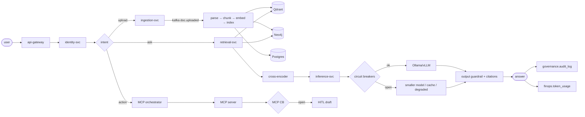

# Phase 15 — Master Blueprint & Golden Vertical Slice

**The brutal rule:** one working vertical slice beats 50 design docs. This is that slice — concrete, end-to-end, demonstrable.

---

## 1. One-line project story

> **circuitRAG** is an enterprise RAG platform that can **ingest documents**, **retrieve trusted context**, **generate grounded answers**, **call enterprise tools through MCP**, **survive failures with circuit breakers + Istio + Kafka**, and **prove quality** through observability, audit, evaluation, and FinOps.

## 2. Master flow (the golden vertical slice)



## 3. Golden demo scenario — 10 steps, ~5 minutes

| Step | Action | What to show | Proof |
| --- | --- | --- | --- |
| 1 | Upload HR policy PDF | file stored, Kafka event emitted | `MinIO object + doc.uploaded.v1 in Kafka` |
| 2 | Ingestion runs | parse → chunk → embed → index | `GET /documents/{id}/status → active` |
| 3 | Ask policy question | retrieval returns cited chunks | `POST /api/v1/ask → {answer, sources[3]}` |
| 4 | Generate answer | grounded response with sources | `citations present; faithfulness > 0.90` |
| 5 | Trigger MCP action | create draft HR/IT ticket | `mcp.tool.requested.v1 → ticket draft` |
| 6 | **Break LLM** | `docker compose kill ollama` | `Inference CB OPEN; fallback model served` |
| 7 | **Break vector DB** | `docker compose kill qdrant` | `Retrieval CB OPEN; BM25 fallback` |
| 8 | Show trace | gateway → retrieval → inference → MCP | Jaeger waterfall with 4+ spans |
| 9 | Show cost | tokens + $ per query | Grafana FinOps panel |
| 10 | Run eval | faithfulness + context precision | `data/eval/<date>/report.json` |

## 4. Failure demo addendum

Each failure in steps 6 + 7 must prove:
- CB state changes (CLOSED → OPEN) visible in `documind_circuit_breaker_state` gauge
- User gets a non-5xx response (degraded flag, not crash)
- Audit row logged
- Recovery automatic (HALF_OPEN probe → CLOSED) when dependency returns

## 5. Repo folder expectations

```
docs/blueprint/
  master-architecture.md        — the one-line story + master-flow diagram
  end-to-end-flow.md            — step-by-step request journey
  golden-demo-script.md         — the 10-step walkthrough (ready to record)
  failure-demo-script.md        — the 2-break scenarios with CB proof
  interview-story.md            — how to present in 5 minutes

docs/scenarios/
  phase-01 through phase-25     — one per topic group (all 18 present)
```

## 6. Brutal final gap list

| Gap | Why it hurts | Current state |
| --- | --- | --- |
| No single golden demo | reviewers don't get value fast | **THIS DOC + execution of §3** |
| No failure demo | CB claim is weak | Day-3 work (§6–7 of demo) |
| No MCP working example | agentic story theoretical | Phase 6 — zero code still |
| No observability screenshot | production-readiness unproven | Day-4 work (Jaeger trace capture) |
| No eval report | RAG quality unproven | Phase 25 exit criteria |
| No tenant isolation test | enterprise claim risky | ✅ **closed** — `test_rls_isolation.py` passes live PG |
| No FinOps output | cost-control weak | Phase 8 §FinOps exit criteria |
| No OpenAPI / event contracts | integration maturity weak | Phase 2a + Phase 2b exit criteria |

## 7. Final recommendation (from the brutal review)

> Build **one complete thin vertical slice**:
>
> Upload PDF → Kafka ingestion → chunk + embed → Qdrant retrieval → LLM answer → MCP draft action → circuit breaker fallback → trace + audit + cost + eval
>
> That one slice is more powerful than adding 50 more design documents.

## 8. Current execution status (Day 1.5)

| Layer | Status |
| --- | --- |
| Infra data stores (6) | ✅ healthy |
| Schema migrations (13) | ✅ applied |
| Tenant RLS contract | ✅ verified live |
| ingestion-svc | ✅ running on :8082 |
| retrieval-svc | ⏳ Day 1.5 part 2 |
| inference-svc | ⏳ Day 1.5 part 3 |
| End-to-end `/ask` | ❌ pending |
| MCP client + server | ❌ zero code |
| Jaeger trace end-to-end | ❌ pending |

## 9. Phase 15 exit criteria

The blueprint is "done" when:

- [ ] `docs/blueprint/golden-demo-script.md` has 10 concrete commands a reviewer can paste
- [ ] `docs/blueprint/failure-demo-script.md` captures CB-open screenshots
- [ ] A 5-minute screen recording of the golden flow is committed to `docs/blueprint/`
- [ ] An architecture diagram with exact service + port + topic names is committed
- [ ] All 10 steps in §3 pass on a clean checkout

## 10. Brutal checklist

| Question | Required |
| --- | --- |
| Is there ONE slice that runs end-to-end? | **Not yet** — Day 1.5 + 1.6 |
| Can failure be demonstrated live? | Not yet |
| Can MCP action be demonstrated? | Not yet — zero MCP code |
| Can observability be shown live? | OTel wired; Jaeger not yet verified |
| Can eval report be produced? | Golden dataset missing |
| Can tenant isolation be proven? | ✅ Yes — `test_rls_isolation.py` green |
| Can cost be shown per query? | `finops.token_usage` schema exists; no dashboard |
