# 📦 `libs` — Advanced README

  ·  **Path:** `libs`  ·  **Generated:** 2026-05-16 20:46 UTC

> _Purpose not detected from docstrings — reviewer to fill._

This README is **auto-generated** by [`scripts/generate_folder_report.py`](../../scripts/generate_folder_report.py). It explains what this folder does, every file inside it, how the files link to each other, every API endpoint, every database call, every test case, and the production controls (security / reliability / performance / observability). Re-run after major changes.

---

## 🔎 Section 0 — Auto-Detected Facts

| Metric | Value |
|---|---|
| Folder | `libs` |
| Total files | 89 |
| Python files | 65 |
| TypeScript/JS files | 0 |
| Go files | 0 |
| Shell scripts | 0 |
| Lines of code | 12,249 |
| Python classes | 256 |
| Python functions | 814 |
| Async functions | 150 |
| Total API endpoints | 6 |
| Total DB call sites | 19 |
| DB / Storage libs | Kafka (aiokafka), Neo4j, Redis, asyncpg |
| Concurrency primitives | Lock / RLock, asyncio (async/await), threading |
| Caching primitives | in-memory @lru_cache, redis |
| Input validation | Manual escape, Pydantic BaseModel |
| AI / LLM deps | LangChain, Ollama, Rebuff (PI defense) |
| Test files | 26 |
| Detected test cases | 420 |
| Tests dir present | ✅ |
| Dockerfile | ❌ |
| pyproject.toml | ❌ |
| go.mod | ❌ |
| package.json | ❌ |
| Top git contributors | `57	PraveenAsthana123`, `7	Praveen` |

#### Longest functions (top 5)

| Location | Name | Lines |
|---|---|---|
| `py/documind_core/circuit_breaker.py:347` | `__init__` | 152 |
| `py/documind_core/audit.py:146` | `write` | 143 |
| `py/documind_core/agent_board.py:317` | `run` | 101 |
| `py/documind_core/drift_detection.py:167` | `compare_windows` | 82 |
| `py/documind_core/breakers.py:249` | `check` | 69 |

#### Smells detected (grep heuristics — verify manually)

| Smell | Count |
|---|---|
| hardcoded localhost URL | 8 |


## 1. Purpose — Business + Technical

### Business problem this folder solves

> _Reviewer to fill: one paragraph describing the business need_

### Technical contract this folder exposes

> _Reviewer to fill: API surface, events emitted, data persisted, downstream consumers._

### Out-of-scope (what this folder does NOT do)

> _Reviewer to fill: explicit non-goals — prevents scope creep at review time._


## 🗺 How to Read This Folder (Guided Tour)

Read these files in order — by the end, you'll understand 80% of this folder's behavior. Click any path to jump straight to the source.

1. **`py/documind_core/logging_config.py`** (⚙ config / settings, 201 LOC) — Every env var the service reads. Read this BEFORE running locally.
2. **`py/documind_core/config.py`** (⚙ config / settings, 182 LOC) — Every env var the service reads. Read this BEFORE running locally.
3. **`py/documind_core/agent_board.py`** (🤖 agent / tool, 616 LOC) — AgentBoard — multi-agent task / review / advise pattern with bounded
4. **`py/documind_core/agentic_framework.py`** (🤖 agent / tool, 260 LOC) — Agentic engineering framework — meta-template for every agent.
5. **`py/documind_core/kafka_client.py`** (🔌 external service adapter, 335 LOC) — Wraps an external API (LLM / vector DB / message bus). Look for circuit breakers + retries.
6. **`py/documind_core/db_client.py`** (🔌 external service adapter, 149 LOC) — Wraps an external API (LLM / vector DB / message bus). Look for circuit breakers + retries.
7. **`py/documind_core/middleware.py`** (🪝 middleware / interceptor, 391 LOC) — FastAPI middleware stack (Design Areas 62 — Observability, 5 — Tenant,
8. **`py/documind_core/circuit_breaker.py`** (📄 module, 1072 LOC) — Circuit Breaker (Design Area 4 — Failure Boundary, Extra — Circuit Breaker).

Click absolute paths for direct `cat`-ability in the §2 File Inventory above.


## ⚙ Environment Variables

All env vars this folder reads, auto-extracted from `BaseSettings` field declarations and `os.environ.get` calls.

### Pydantic BaseSettings fields

| Variable | Default | Source location |
|---|---|---|
| `DOCUMIND_ENV` | `'development'` | `py/documind_core/config.py:53` |
| `DOCUMIND_LOG_LEVEL` | `'INFO'` | `py/documind_core/config.py:54` |
| `DOCUMIND_LOG_JSON` | `True` | `py/documind_core/config.py:55` |
| `DOCUMIND_REGION` | `'local'` | `py/documind_core/config.py:56` |
| `DOCUMIND_SERVICE_NAME` | `Field(default='documind-service', description='Overridden per service')` | `py/documind_core/config.py:57` |
| `DOCUMIND_JWT_PUBLIC_KEY_PATH` | `'./scripts/dev-keys/jwt-public.pem'` | `py/documind_core/config.py:62` |
| `DOCUMIND_JWT_ISSUER` | `'documind-local'` | `py/documind_core/config.py:63` |
| `DOCUMIND_JWT_AUDIENCE` | `'documind-services'` | `py/documind_core/config.py:64` |
| `DOCUMIND_JWT_ACCESS_TTL` | `900` | `py/documind_core/config.py:65` |
| `DOCUMIND_JWT_REFRESH_TTL` | `604800` | `py/documind_core/config.py:66` |
| `DOCUMIND_ENCRYPTION_KEY` | `None` | `py/documind_core/config.py:68` |
| `DOCUMIND_ADMIN_API_KEY` | `None` | `py/documind_core/config.py:69` |
| `DOCUMIND_CORS_ORIGINS` | `'http://localhost:3000,http://localhost:5173'` | `py/documind_core/config.py:70` |
| `DOCUMIND_PG_HOST` | `'localhost'` | `py/documind_core/config.py:75` |
| `DOCUMIND_PG_PORT` | `5432` | `py/documind_core/config.py:76` |
| `DOCUMIND_PG_DB` | `'documind'` | `py/documind_core/config.py:77` |
| `DOCUMIND_PG_USER` | `'documind'` | `py/documind_core/config.py:78` |
| `DOCUMIND_PG_PASSWORD` | `SecretStr('documind')` | `py/documind_core/config.py:79` |
| `DOCUMIND_PG_MAX_CONNS` | `20` | `py/documind_core/config.py:80` |
| `DOCUMIND_PG_MIN_CONNS` | `2` | `py/documind_core/config.py:81` |
| `DOCUMIND_REDIS_URL` | `'redis://localhost:6379/0'` | `py/documind_core/config.py:83` |
| `DOCUMIND_REDIS_POOL_SIZE` | `20` | `py/documind_core/config.py:84` |
| `DOCUMIND_QDRANT_URL` | `'http://localhost:6333'` | `py/documind_core/config.py:86` |
| `DOCUMIND_QDRANT_API_KEY` | `None` | `py/documind_core/config.py:87` |
| `DOCUMIND_QDRANT_COLLECTION` | `'chunks'` | `py/documind_core/config.py:88` |
| `DOCUMIND_NEO4J_URI` | `'bolt://localhost:7687'` | `py/documind_core/config.py:90` |
| `DOCUMIND_NEO4J_USER` | `'neo4j'` | `py/documind_core/config.py:91` |
| `DOCUMIND_NEO4J_PASSWORD` | `SecretStr('documind')` | `py/documind_core/config.py:92` |
| `DOCUMIND_KAFKA_BOOTSTRAP` | `'localhost:9094'` | `py/documind_core/config.py:101` |
| `DOCUMIND_KAFKA_CLIENT_ID` | `'documind'` | `py/documind_core/config.py:102` |
| `DOCUMIND_KAFKA_CONSUMER_GROUP_PREFIX` | `'documind-'` | `py/documind_core/config.py:103` |
| `DOCUMIND_MINIO_ENDPOINT` | `'localhost:9000'` | `py/documind_core/config.py:105` |
| `DOCUMIND_MINIO_ACCESS_KEY` | `SecretStr('documind')` | `py/documind_core/config.py:106` |
| `DOCUMIND_MINIO_SECRET_KEY` | `SecretStr('documind-secret')` | `py/documind_core/config.py:107` |
| `DOCUMIND_MINIO_BUCKET` | `'documents'` | `py/documind_core/config.py:108` |
| `DOCUMIND_MINIO_USE_SSL` | `False` | `py/documind_core/config.py:109` |
| `DOCUMIND_OLLAMA_URL` | `'http://localhost:11434'` | `py/documind_core/config.py:114` |
| `DOCUMIND_OLLAMA_LLM_MODEL` | `'llama3.1:8b'` | `py/documind_core/config.py:115` |
| `DOCUMIND_OLLAMA_EMBED_MODEL` | `'nomic-embed-text'` | `py/documind_core/config.py:116` |
| `DOCUMIND_OLLAMA_TIMEOUT_SECONDS` | `60` | `py/documind_core/config.py:117` |
| `DOCUMIND_OTEL_EXPORTER_OTLP_ENDPOINT` | `'http://localhost:4317'` | `py/documind_core/config.py:122` |
| `DOCUMIND_OTEL_SERVICE_NAMESPACE` | `'documind'` | `py/documind_core/config.py:123` |
| `DOCUMIND_PROMETHEUS_PORT` | `9464` | `py/documind_core/config.py:124` |
| `DOCUMIND_RATE_LIMIT_API_PER_MIN` | `100` | `py/documind_core/config.py:129` |
| `DOCUMIND_RATE_LIMIT_UPLOAD_PER_MIN` | `10` | `py/documind_core/config.py:130` |
| `DOCUMIND_RATE_LIMIT_ADMIN_PER_MIN` | `50` | `py/documind_core/config.py:131` |
| `DOCUMIND_RATE_LIMIT_INFERENCE_PER_MIN` | `20` | `py/documind_core/config.py:132` |
| `DOCUMIND_CHUNK_SIZE` | `512` | `py/documind_core/config.py:137` |
| `DOCUMIND_CHUNK_OVERLAP` | `50` | `py/documind_core/config.py:138` |
| `DOCUMIND_RETRIEVAL_TOP_K` | `10` | `py/documind_core/config.py:139` |
| `DOCUMIND_RERANK_TOP_K` | `5` | `py/documind_core/config.py:140` |
| `DOCUMIND_MAX_CONTEXT_TOKENS` | `4000` | `py/documind_core/config.py:141` |

### Runtime `os.environ.get` / `os.getenv` calls

| Variable | Default | Source location |
|---|---|---|
| `REBUFF_ENABLED` | **required** | `py/documind_core/rebuff_detector.py:55` |
| `REBUFF_API_TOKEN` | **required** | `py/documind_core/rebuff_detector.py:56` |
| `REBUFF_API_URL` | `https://www.rebuff.ai` | `py/documind_core/rebuff_detector.py:57` |
| `REBUFF_PI_THRESHOLD` | `0.5` | `py/documind_core/rebuff_detector.py:67` |
| `DOCUMIND_RATE_LIMIT_DISABLED` | **required** | `py/documind_core/middleware.py:325` |
| `SENTRY_DSN` | **required** | `py/documind_core/error_tracking.py:65` |
| `DOCUMIND_ENV` | `development` | `py/documind_core/error_tracking.py:76` |
| `DOCUMIND_RELEASE` | `dev` | `py/documind_core/error_tracking.py:87` |
| `DOCUMIND_PG_HOST` | **required** | `py/tests/test_rls_isolation.py:30` |
| `DOCUMIND_PG_HOST` | `localhost` | `py/tests/test_rls_isolation.py:40` |
| `DOCUMIND_PG_PORT` | `5432` | `py/tests/test_rls_isolation.py:41` |
| `DOCUMIND_PG_DB` | `documind` | `py/tests/test_rls_isolation.py:42` |

_Variables marked **required** must be set — missing values may raise on startup or silently default to empty strings._


## 2. File Inventory

Every Python file in this folder, with role / classes / functions / LOC / first docstring line. Full absolute paths listed below the table for easy `cat`-ability.

| Relative path | Role (inferred) | Classes | Functions | LOC | Summary |
|---|---|---|---|---|---|
| `py/documind_core/__init__.py` | 📦 package marker | 0 | 0 | 134 | documind_core |
| `py/documind_core/a2a_protocol.py` | 📄 module | 6 | 3 | 333 | Agent-to-Agent (A2A) protocol — registry + message bus + connector + delegation. |
| `py/documind_core/agent_board.py` | 🤖 agent / tool | 5 | 5 | 616 | AgentBoard — multi-agent task / review / advise pattern with bounded |
| `py/documind_core/agentic_framework.py` | 🤖 agent / tool | 2 | 2 | 260 | Agentic engineering framework — meta-template for every agent. |
| `py/documind_core/ai_governance.py` | 📄 module | 14 | 1 | 700 | AI governance primitives — debuggability, explainability, responsibility, |
| `py/documind_core/audit.py` | 📄 module | 2 | 3 | 292 | Tamper-evident audit log (Design Area 27 — Governance). |
| `py/documind_core/auth.py` | 📄 module | 2 | 4 | 348 | JWT auth verifier + FastAPI dependency for Python services. |
| `py/documind_core/bm25.py` | 📄 module | 2 | 1 | 133 | BM25 lexical retrieval — wraps `rank_bm25` for the hybrid-retrieval |
| `py/documind_core/body_limit.py` | 📄 module | 1 | 0 | 58 | Request-body size limit (FastAPI middleware). |
| `py/documind_core/breakers.py` | 📄 module | 18 | 1 | 1049 | Specialized circuit breakers (Design Area 4 + Extra-CB, plus AI/RAG-specific). |
| `py/documind_core/cache.py` | 📄 module | 1 | 0 | 134 | Cache helpers (Design Areas 40 — Cache Architecture, 41 — Cache Consistency, |
| `py/documind_core/chunking.py` | 📄 module | 10 | 1 | 416 | Multi-strategy chunking — Strategy + Factory pattern (§7 of the |
| `py/documind_core/circuit_breaker.py` | 📄 module | 6 | 1 | 1072 | Circuit Breaker (Design Area 4 — Failure Boundary, Extra — Circuit Breaker). |
| `py/documind_core/citations.py` | 📄 module | 4 | 2 | 202 | Citation linking — claim-to-source provenance (§16.6 + §48 of the |
| `py/documind_core/config.py` | ⚙ config / settings | 1 | 1 | 182 | Configuration foundation (Design Areas 6 — Control Plane, 55 — Feature Flags, |
| `py/documind_core/db_client.py` | 🔌 external service adapter | 2 | 0 | 149 | PostgreSQL client (Design Areas 5 — Tenant RLS, 12 — Consistency, 46 — DB Strategy). |
| `py/documind_core/dispatch_pool.py` | 📄 module | 3 | 0 | 213 | DispatchPool - fanout 100+ tasks with bounded LLM concurrency. |
| `py/documind_core/dr_metrics.py` | 📄 module | 1 | 2 | 139 | Disaster Recovery target metrics — single source of truth. |
| `py/documind_core/drift_detection.py` | 📄 module | 2 | 3 | 249 | Drift detection — Production Validation §44 maturity item. |
| `py/documind_core/embedding_cache.py` | 📄 module | 2 | 2 | 179 | Embedding cache — content-hash → vector with model-version namespacing |
| `py/documind_core/encryption.py` | 📄 module | 1 | 1 | 74 | At-rest encryption for secrets stored in the database. |
| `py/documind_core/error_tracking.py` | 📄 module | 0 | 5 | 153 | Error-tracking integration — Sentry wrapper. |
| `py/documind_core/exceptions.py` | 📄 module | 10 | 0 | 176 | Domain exception hierarchy (Design Area 9 — State Model; cross-cutting). |
| `py/documind_core/fusion.py` | 📄 module | 1 | 2 | 145 | Hybrid retrieval fusion — RRF + heap-based top-K (§16.5 of the |
| `py/documind_core/governance_os.py` | 📄 module | 8 | 1 | 363 | AI Governance OS — unified policy / decision / risk / compliance / audit surface. |
| `py/documind_core/idempotency.py` | 📄 module | 2 | 0 | 65 | HTTP idempotency (Design Area 20). |
| `py/documind_core/idempotency_middleware.py` | 📄 module | 1 | 0 | 113 | FastAPI middleware for the ``X-Idempotency-Key`` pattern (Design Area 20). |
| `py/documind_core/kafka_client.py` | 🔌 external service adapter | 2 | 2 | 335 | Kafka client (Design Areas 17 — Event-Driven, 19 — Compensation, |
| `py/documind_core/logging_config.py` | ⚙ config / settings | 0 | 8 | 201 | Structured logging (Design Area 62 — Observability by Design). |
| `py/documind_core/middleware.py` | 🪝 middleware / interceptor | 6 | 1 | 391 | FastAPI middleware stack (Design Areas 62 — Observability, 5 — Tenant, |
| `py/documind_core/mmr.py` | 📄 module | 0 | 1 | 100 | MMR — Maximal Marginal Relevance (§16.6 post-retrieval diversification). |
| `py/documind_core/observability.py` | 📄 module | 0 | 5 | 251 | Observability setup (Design Areas 62 — Observability by Design, 64 — SLO-Driven). |
| `py/documind_core/pii.py` | 📄 module | 2 | 1 | 193 | PII detection — multi-pattern Aho-Corasick-style scanner (§16.11 |
| `py/documind_core/query_rewriter.py` | 📄 module | 2 | 0 | 133 | Pre-retrieval query processing (§16.4 of the playbook). |
| `py/documind_core/rate_limiter.py` | 📄 module | 2 | 2 | 191 | Rate limiting (Design Areas 42 — Tenant-Aware Cache, 45 — Backpressure). |
| `py/documind_core/rebuff_detector.py` | 📄 module | 2 | 7 | 272 | Rebuff detector — Stage-1 runtime PI-defense adapter (per §47.6, §48, §56). |
| `py/documind_core/schemas.py` | 📄 module | 4 | 0 | 49 | Shared response schemas (Global CLAUDE.md §6 — API Design Standards). |
| `py/documind_core/tokens.py` | 📄 module | 2 | 2 | 99 | Token counting + budget helpers (§16.1 / §16.2 of the playbook). |
| `py/tests/conftest.py` | 🧪 test | 0 | 1 | 21 | pytest config for documind_core unit tests. |
| `py/tests/test_ai_governance.py` | 🧪 test | 0 | 33 | 370 | Unit tests for the AI-governance primitives. |
| `py/tests/test_audit.py` | 🧪 test | 4 | 2 | 277 | Tests for documind_core.audit — tamper-evident audit-log writer. |
| `py/tests/test_bm25.py` | 🧪 test | 4 | 0 | 121 | Tests for documind_core.bm25 — BM25 lexical retrieval wrapper. |
| `py/tests/test_body_limit.py` | 🧪 test | 2 | 1 | 112 | Tests for documind_core.body_limit — request-body size cap middleware. |
| `py/tests/test_breakers.py` | 🧪 test | 0 | 20 | 268 | Unit tests for the 5 specialized circuit breakers. |
| `py/tests/test_cache.py` | 🧪 test | 6 | 1 | 277 | Tests for documind_core.cache — tenant-aware Redis cache helper. |
| `py/tests/test_chunking.py` | 🧪 test | 10 | 0 | 282 | Tests for documind_core.chunking — Strategy + Factory pattern, 7 |
| `py/tests/test_citations.py` | 🧪 test | 5 | 1 | 187 | Tests for documind_core.citations — claim-to-source linker. |
| `py/tests/test_config.py` | 🧪 test | 5 | 1 | 135 | Tests for documind_core.config — Pydantic Settings foundation. |
| `py/tests/test_db_client.py` | 🧪 test | 4 | 0 | 166 | Tests for documind_core.db_client — asyncpg pool + tenant RLS context. |
| `py/tests/test_dispatch_pool.py` | 🧪 test | 3 | 0 | 135 | Tests for documind_core.dispatch_pool — bounded-concurrency task pool. |
| `py/tests/test_embedding_cache.py` | 🧪 test | 8 | 1 | 218 | Tests for documind_core.embedding_cache. |
| `py/tests/test_encryption.py` | 🧪 test | 4 | 2 | 139 | Tests for documind_core.encryption — Fernet wrapper + sentinel prefix. |
| `py/tests/test_error_tracking.py` | 🧪 test | 5 | 1 | 141 | Tests for documind_core.error_tracking — Sentry init wrapper. |
| `py/tests/test_exceptions.py` | 🧪 test | 4 | 0 | 122 | Tests for documind_core.exceptions — domain exception hierarchy. |
| `py/tests/test_fusion.py` | 🧪 test | 5 | 0 | 148 | Tests for documind_core.fusion — RRF + heap top-K. |
| `py/tests/test_idempotency.py` | 🧪 test | 4 | 1 | 122 | Tests for documind_core.idempotency — Redis-backed X-Idempotency-Key cache. |
| `py/tests/test_idempotency_middleware.py` | 🧪 test | 5 | 2 | 196 | Tests for documind_core.idempotency_middleware. |
| `py/tests/test_logging_config.py` | 🧪 test | 7 | 0 | 215 | Tests for documind_core.logging_config — JSON structured logging. |
| `py/tests/test_mmr.py` | 🧪 test | 3 | 0 | 108 | Tests for documind_core.mmr — Maximal Marginal Relevance. |
| `py/tests/test_pii.py` | 🧪 test | 11 | 0 | 206 | Tests for documind_core.pii — multi-pattern PII scanner. |
| `py/tests/test_query_rewriter.py` | 🧪 test | 5 | 0 | 129 | Tests for documind_core.query_rewriter — pre-retrieval query |
| `py/tests/test_rate_limiter.py` | 🧪 test | 6 | 1 | 233 | Tests for documind_core.rate_limiter — sliding-window Redis limiter. |
| `py/tests/test_rls_isolation.py` | 🧪 test | 0 | 2 | 115 | Cross-tenant RLS isolation test (Design Area 5 — most important security test). |
| `py/tests/test_schemas.py` | 🧪 test | 4 | 0 | 99 | Tests for documind_core.schemas — shared API response envelopes. |
| `py/tests/test_tokens.py` | 🧪 test | 3 | 0 | 123 | Tests for documind_core.tokens — token counting + budget packing. |

### Absolute paths (clickable)

- `/mnt/deepa/rag/libs/py/documind_core/__init__.py`
- `/mnt/deepa/rag/libs/py/documind_core/a2a_protocol.py`
- `/mnt/deepa/rag/libs/py/documind_core/agent_board.py`
- `/mnt/deepa/rag/libs/py/documind_core/agentic_framework.py`
- `/mnt/deepa/rag/libs/py/documind_core/ai_governance.py`
- `/mnt/deepa/rag/libs/py/documind_core/audit.py`
- `/mnt/deepa/rag/libs/py/documind_core/auth.py`
- `/mnt/deepa/rag/libs/py/documind_core/bm25.py`
- `/mnt/deepa/rag/libs/py/documind_core/body_limit.py`
- `/mnt/deepa/rag/libs/py/documind_core/breakers.py`
- `/mnt/deepa/rag/libs/py/documind_core/cache.py`
- `/mnt/deepa/rag/libs/py/documind_core/chunking.py`
- `/mnt/deepa/rag/libs/py/documind_core/circuit_breaker.py`
- `/mnt/deepa/rag/libs/py/documind_core/citations.py`
- `/mnt/deepa/rag/libs/py/documind_core/config.py`
- `/mnt/deepa/rag/libs/py/documind_core/db_client.py`
- `/mnt/deepa/rag/libs/py/documind_core/dispatch_pool.py`
- `/mnt/deepa/rag/libs/py/documind_core/dr_metrics.py`
- `/mnt/deepa/rag/libs/py/documind_core/drift_detection.py`
- `/mnt/deepa/rag/libs/py/documind_core/embedding_cache.py`
- `/mnt/deepa/rag/libs/py/documind_core/encryption.py`
- `/mnt/deepa/rag/libs/py/documind_core/error_tracking.py`
- `/mnt/deepa/rag/libs/py/documind_core/exceptions.py`
- `/mnt/deepa/rag/libs/py/documind_core/fusion.py`
- `/mnt/deepa/rag/libs/py/documind_core/governance_os.py`
- `/mnt/deepa/rag/libs/py/documind_core/idempotency.py`
- `/mnt/deepa/rag/libs/py/documind_core/idempotency_middleware.py`
- `/mnt/deepa/rag/libs/py/documind_core/kafka_client.py`
- `/mnt/deepa/rag/libs/py/documind_core/logging_config.py`
- `/mnt/deepa/rag/libs/py/documind_core/middleware.py`
- `/mnt/deepa/rag/libs/py/documind_core/mmr.py`
- `/mnt/deepa/rag/libs/py/documind_core/observability.py`
- `/mnt/deepa/rag/libs/py/documind_core/pii.py`
- `/mnt/deepa/rag/libs/py/documind_core/query_rewriter.py`
- `/mnt/deepa/rag/libs/py/documind_core/rate_limiter.py`
- `/mnt/deepa/rag/libs/py/documind_core/rebuff_detector.py`
- `/mnt/deepa/rag/libs/py/documind_core/schemas.py`
- `/mnt/deepa/rag/libs/py/documind_core/tokens.py`
- `/mnt/deepa/rag/libs/py/tests/conftest.py`
- `/mnt/deepa/rag/libs/py/tests/test_ai_governance.py`
- `/mnt/deepa/rag/libs/py/tests/test_audit.py`
- `/mnt/deepa/rag/libs/py/tests/test_bm25.py`
- `/mnt/deepa/rag/libs/py/tests/test_body_limit.py`
- `/mnt/deepa/rag/libs/py/tests/test_breakers.py`
- `/mnt/deepa/rag/libs/py/tests/test_cache.py`
- `/mnt/deepa/rag/libs/py/tests/test_chunking.py`
- `/mnt/deepa/rag/libs/py/tests/test_citations.py`
- `/mnt/deepa/rag/libs/py/tests/test_config.py`
- `/mnt/deepa/rag/libs/py/tests/test_db_client.py`
- `/mnt/deepa/rag/libs/py/tests/test_dispatch_pool.py`
- `/mnt/deepa/rag/libs/py/tests/test_embedding_cache.py`
- `/mnt/deepa/rag/libs/py/tests/test_encryption.py`
- `/mnt/deepa/rag/libs/py/tests/test_error_tracking.py`
- `/mnt/deepa/rag/libs/py/tests/test_exceptions.py`
- `/mnt/deepa/rag/libs/py/tests/test_fusion.py`
- `/mnt/deepa/rag/libs/py/tests/test_idempotency.py`
- `/mnt/deepa/rag/libs/py/tests/test_idempotency_middleware.py`
- `/mnt/deepa/rag/libs/py/tests/test_logging_config.py`
- `/mnt/deepa/rag/libs/py/tests/test_mmr.py`
- `/mnt/deepa/rag/libs/py/tests/test_pii.py`
- `/mnt/deepa/rag/libs/py/tests/test_query_rewriter.py`
- `/mnt/deepa/rag/libs/py/tests/test_rate_limiter.py`
- `/mnt/deepa/rag/libs/py/tests/test_rls_isolation.py`
- `/mnt/deepa/rag/libs/py/tests/test_schemas.py`
- `/mnt/deepa/rag/libs/py/tests/test_tokens.py`


## 🧭 Where Does X Live? (cheat sheet)

Use this table when you're modifying this folder and need to know where new code goes.

| I want to... | Role | Touch these files |
|---|---|---|
| Add a new env var | ⚙ config / settings | `py/documind_core/config.py`, `py/documind_core/logging_config.py` |
| Wrap a new external API | 🔌 external service adapter | `py/documind_core/db_client.py`, `py/documind_core/kafka_client.py` |
| Add a new middleware (auth / logging / tracing) | 🪝 middleware / interceptor | `py/documind_core/middleware.py` |
| Add a new agent / tool | 🤖 agent / tool | `py/documind_core/agent_board.py`, `py/documind_core/agentic_framework.py` |
| Add a new test | 🧪 test | `py/tests/conftest.py`, `py/tests/test_ai_governance.py`, `py/tests/test_audit.py` (+24 more) |


## 3. C4 Model — Context / Container / Component / Code

### Level 1 — System Context

_Where does this folder sit in the broader system?_

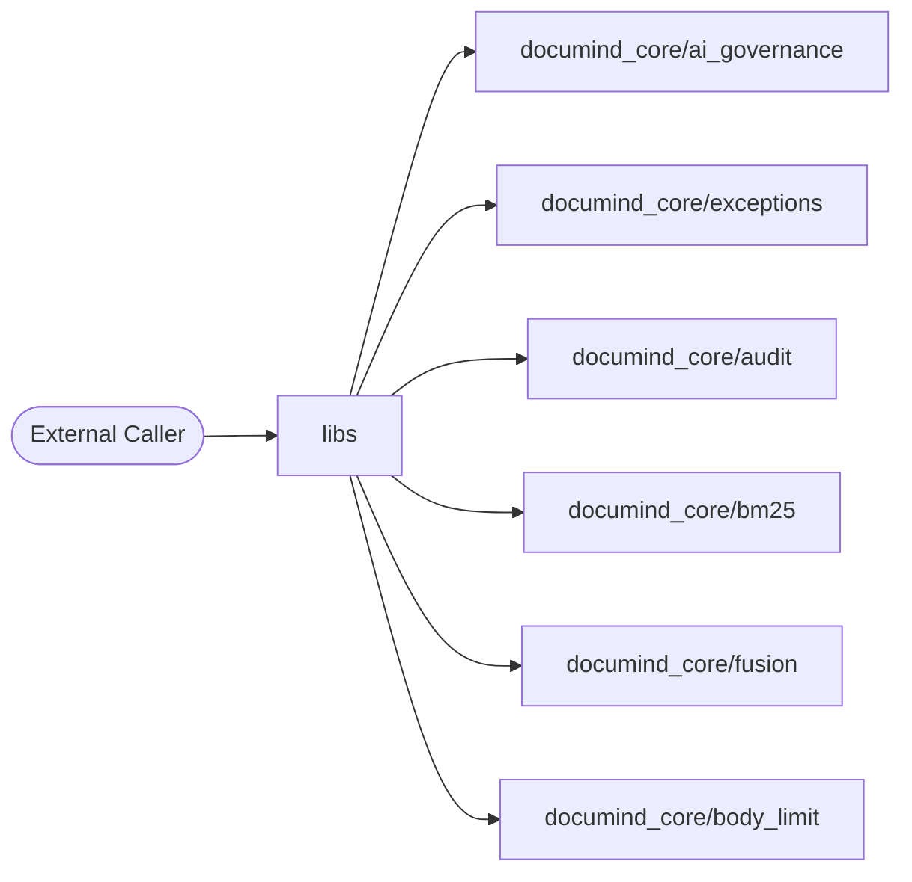

### Level 2 — Container

_What external dependencies does this folder talk to?_

```mermaid
flowchart TB
    subgraph libs
        Code[Source Code]
    end
    Code --> DB_0[("Kafka (aiokafka)")]
    Code --> DB_1[("Neo4j")]
    Code --> DB_2[("Redis")]
    Code --> DB_3[("asyncpg")]
    Code --> AI_0{{LLM: LangChain}}
    Code --> AI_1{{LLM: Ollama}}
    Code --> AI_2{{LLM: Rebuff (PI defense)}}
```

### Level 3 — Component

_Internal files grouped by inferred role._

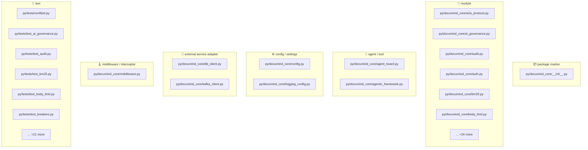

### Level 4 — Code (top hotspots)

_Longest functions — these are the most likely refactor candidates._

```mermaid
flowchart TB
    py_documind_core_circuit_breaker_py_347_["__init__ (152 lines)<br/>py/documind_core/circuit_breaker.py:347"]
    py_documind_core_audit_py_146_write["write (143 lines)<br/>py/documind_core/audit.py:146"]
    py_documind_core_agent_board_py_317_run["run (101 lines)<br/>py/documind_core/agent_board.py:317"]
    py_documind_core_drift_detection_py_167_["compare_windows (82 lines)<br/>py/documind_core/drift_detection.py:167"]
    py_documind_core_breakers_py_249_check["check (69 lines)<br/>py/documind_core/breakers.py:249"]
```


## 📐 Class Diagram (UML-style)

Top classes by method count, with inheritance arrows. Common framework bases (`BaseModel`, `BaseSettings`, `Exception`, `Enum`) use dotted lines.

```mermaid
classDiagram
    class CircuitBreaker {
        +37 methods
        ~py/documind_core/circuit_breaker.py:329
    }
    class AgentBoard {
        +9 methods
        ~py/documind_core/agent_board.py:231
    }
    class AgentLoopCircuitBreaker {
        +9 methods
        ~py/documind_core/breakers.py:426
    }
    class TestTopK {
        +8 methods
        ~py/tests/test_fusion.py:88
    }
    class Cache {
        +7 methods
        ~py/documind_core/cache.py:30
    }
    class EmbeddingCache {
        +7 methods
        ~py/documind_core/embedding_cache.py:75
    }
    class TestAuditWriter {
        +7 methods
        ~py/tests/test_audit.py:179
    }
    class TestPackToBudget {
        +7 methods
        ~py/tests/test_tokens.py:52
    }
    class _StepContext {
        +6 methods
        ~py/documind_core/ai_governance.py:640
    }
    class _BreakerGuardedMetricExporter {
        +6 methods
        ~py/documind_core/observability.py:203
    }
    MetricExporter <|-- _BreakerGuardedMetricExporter
    class AgentRegistry {
        +6 methods
        ~py/documind_core/a2a_protocol.py:125
    }
    class PIIScanner {
        +6 methods
        ~py/documind_core/pii.py:104
    }
    class ObservabilityCircuitBreaker {
        +6 methods
        ~py/documind_core/breakers.py:574
    }
    class CognitiveCircuitBreaker {
        +6 methods
        ~py/documind_core/breakers.py:906
    }
    class DbClient {
        +6 methods
        ~py/documind_core/db_client.py:36
    }
```


_Showing top 15 of 256 classes (ranked by method count)._


## 4. Code Sequence — How Files Link to Each Other

**Import graph for files in this folder.** Reading order: start at any entry-point file (look for `🚀 entry point` role in the inventory above), then follow the arrows.

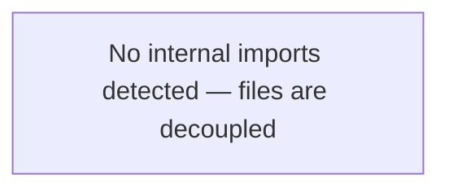

### Edge list

_No internal imports detected._


## 5. Request Flowchart

Generic request lifecycle for this folder. Branches that don't apply are auto-removed based on detected dependencies (DB / cache / LLM).

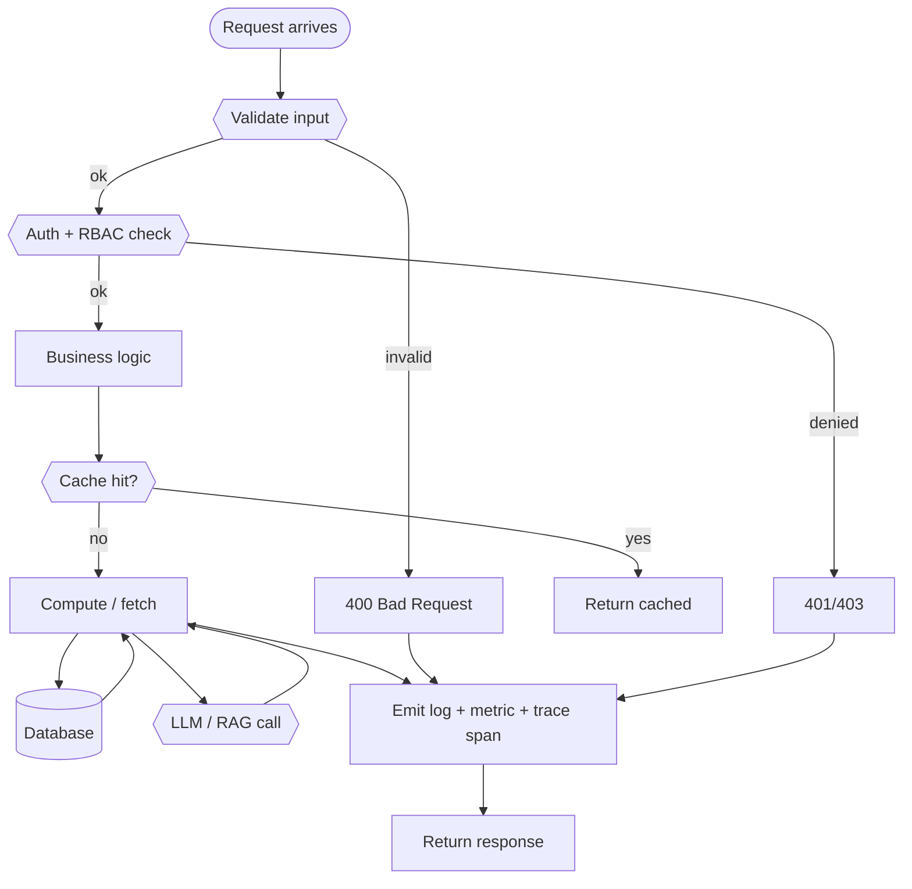


## 6. API Endpoints — Input / Process / Output

**Detected endpoints:** 6

| Method | Route | Defined in | Input (schema) | Process (summary) | Output (schema) |
|---|---|---|---|---|---|
| `POST` | `/api/x` | `py/tests/test_body_limit.py:32` | _TBD_ | _TBD_ | _TBD_ |
| `POST` | `/upload/x` | `py/tests/test_body_limit.py:36` | _TBD_ | _TBD_ | _TBD_ |
| `POST` | `/api/charge` | `py/tests/test_idempotency_middleware.py:59` | _TBD_ | _TBD_ | _TBD_ |
| `POST` | `/api/fail` | `py/tests/test_idempotency_middleware.py:64` | _TBD_ | _TBD_ | _TBD_ |
| `POST` | `/api/validate-error` | `py/tests/test_idempotency_middleware.py:69` | _TBD_ | _TBD_ | _TBD_ |
| `GET` | `/api/read` | `py/tests/test_idempotency_middleware.py:74` | _TBD_ | _TBD_ | _TBD_ |

_Reviewer fills the last three columns from the Pydantic models in the handler. Auto-extraction of Pydantic schemas is on the roadmap._


## 🏗 Input/Process/Output + Integration + Design Principles

### Input / Process / Output per endpoint

| Endpoint | INPUT (validation chain) | PROCESS (call chain) | OUTPUT (response chain) |
|---|---|---|---|
| `POST /api/x` | Pydantic schema validated at middleware | Router `py/tests/test_body_limit.py:32` → Service (`app/services/`) → Repository (`app/repositories/` or `documind_core/db_client.py`) → External (LLM / Vector / Kafka) | Pydantic response model serialized to JSON + headers (`X-Correlation-ID`, `X-Latency-ms`) |
| `POST /upload/x` | Pydantic schema validated at middleware | Router `py/tests/test_body_limit.py:36` → Service (`app/services/`) → Repository (`app/repositories/` or `documind_core/db_client.py`) → External (LLM / Vector / Kafka) | Pydantic response model serialized to JSON + headers (`X-Correlation-ID`, `X-Latency-ms`) |
| `POST /api/charge` | Pydantic schema validated at middleware | Router `py/tests/test_idempotency_middleware.py:59` → Service (`app/services/`) → Repository (`app/repositories/` or `documind_core/db_client.py`) → External (LLM / Vector / Kafka) | Pydantic response model serialized to JSON + headers (`X-Correlation-ID`, `X-Latency-ms`) |
| `POST /api/fail` | Pydantic schema validated at middleware | Router `py/tests/test_idempotency_middleware.py:64` → Service (`app/services/`) → Repository (`app/repositories/` or `documind_core/db_client.py`) → External (LLM / Vector / Kafka) | Pydantic response model serialized to JSON + headers (`X-Correlation-ID`, `X-Latency-ms`) |
| `POST /api/validate-error` | Pydantic schema validated at middleware | Router `py/tests/test_idempotency_middleware.py:69` → Service (`app/services/`) → Repository (`app/repositories/` or `documind_core/db_client.py`) → External (LLM / Vector / Kafka) | Pydantic response model serialized to JSON + headers (`X-Correlation-ID`, `X-Latency-ms`) |
| `GET /api/read` | Pydantic schema validated at middleware | Router `py/tests/test_idempotency_middleware.py:74` → Service (`app/services/`) → Repository (`app/repositories/` or `documind_core/db_client.py`) → External (LLM / Vector / Kafka) | Pydantic response model serialized to JSON + headers (`X-Correlation-ID`, `X-Latency-ms`) |

### Integration sequence (ordered by import volume)

Other folders this one calls into, ordered by how heavily it depends on each:

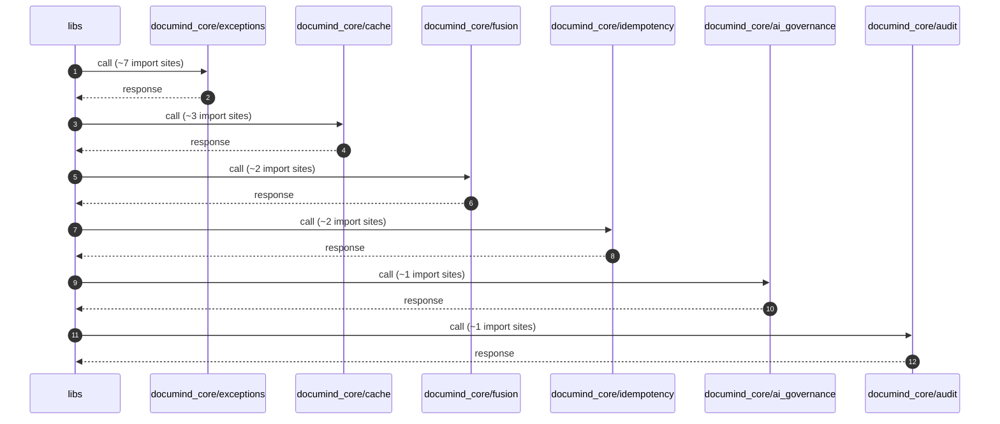

### SOLID principles applied here

| Principle | Where it shows up in this folder |
|---|---|
| **S — Single Responsibility** | Each file has ONE role — routers route, services orchestrate, repos query, schemas describe. The §2 File Inventory shows the role per file; any file with multiple roles violates SRP. |
| **O — Open/Closed** | New endpoints add new router functions; new business cases add new service methods. Existing methods stay closed for modification. |
| **L — Liskov Substitution** | All adapter clients (Ollama / OpenAI / Anthropic) implement the same LLM-client protocol — they're interchangeable behind the circuit breaker. |
| **I — Interface Segregation** | Pydantic models split request, response, and internal state into separate schemas — no client gets a fat model with fields it doesn't use. |
| **D — Dependency Inversion** | Services receive their dependencies via FastAPI `Depends()` — they depend on abstractions (factories), not concrete repos. Swap implementations in tests via the `app.dependency_overrides` dict. |

### Microservice principles applied here

| Principle | Application |
|---|---|
| **Single business capability** | `libs` owns ONE capability (see §1 Purpose). Cross-capability logic lives in other services. |
| **Bounded context** | Schemas + repositories are scoped to this service's bounded context — no shared DB tables with other services. |
| **DB per service** | Each service owns its tables. Cross-service reads go through HTTP or Kafka — never a direct DB join. |
| **Independent deploy** | Service is independently deployable — its container is built + released without coupling to other services. |
| **Resilience patterns** | Circuit breakers (`documind_core/breakers/`), retries with exponential backoff, bulkheads, timeouts on every external call. |
| **Observability** | Every request has a `request_id` propagated via OTel baggage; every external call emits a trace span. |

### Design-principle stack (how the principles compose)

Reading bottom-to-top — earlier principles enable later ones:

```text
┌─────────────────────────────────────────────────────────────┐
│ 7. AI Governance (§38 + §48): decision audit + explainability│
├─────────────────────────────────────────────────────────────┤
│ 6. Production Gates (§47.11): 10 gates BEFORE deploy        │
├─────────────────────────────────────────────────────────────┤
│ 5. Resilience: CB + retry + bulkhead + timeout              │
├─────────────────────────────────────────────────────────────┤
│ 4. Microservice: single capability, bounded context, DB/svc │
├─────────────────────────────────────────────────────────────┤
│ 3. SOLID: SRP + OCP + LSP + ISP + DIP                       │
├─────────────────────────────────────────────────────────────┤
│ 2. 12-factor: stateless, deps in venv, config in env        │
├─────────────────────────────────────────────────────────────┤
│ 1. KISS / YAGNI / DRY: every line earns its place           │
└─────────────────────────────────────────────────────────────┘
```

**How to use this stack:** when adding a new feature, check it from the bottom up. KISS first (simplest design that works), then SOLID (does any class violate SRP?), then microservice (does this leak the bounded context?), then resilience (what fails when the downstream is slow?), then gates (which production gate enforces this?), then governance (which audit row records this decision?).


## 🔬 Execution Sequence + Debug Tap Points

For each phase a request goes through, this section shows: **(1)** the file:line where it happens, **(2)** the log line you'll see, **(3)** the command to inspect that phase's output in real time. Use this as your debug-flow chart — start at Phase 0, move down until output stops matching the expected log line; that's where the failure is.

**Worked example:** `POST /api/x` (py/tests/test_body_limit.py:32)

### Phase-by-phase debug tap table

| # | Phase | Code location | Log line to grep | Command to inspect |
|---|---|---|---|---|
| 0 | **TCP connect** | OS / docker network | `client_connected` | `curl -v http://localhost:8000/health 2>&1 \| head -15` |
| 1 | **Middleware: request_id assign** | `documind_core/middleware.py` | `request_id=...` | `docker logs documind-libs -f \| grep request_id` |
| 2 | **Middleware: auth** | `documind_core/auth.py` | `auth_ok` or `auth_denied` | `docker logs documind-libs -f \| grep auth_` |
| 3 | **Middleware: tenant resolution** | `documind_core/middleware.py` | `tenant_id=<id>` | `docker logs documind-libs -f \| grep tenant_id` |
| 4 | **Pydantic validation** | `app/schemas/*.py` | `422 Unprocessable` (on fail) | `docker logs documind-libs -f \| grep -E 'validation\|422'` |
| 5 | **Router dispatch** | `py/tests/test_body_limit.py:32` | `POST /api/x` | `docker logs documind-libs -f \| grep '/api/x'` |
| 6 | **Business service call** | `app/services/*.py` | `service_method_start` | `docker logs documind-libs -f \| grep service_` |
| 7 | **DB query** | `app/repositories/*.py` or `documind_core/db_client.py` | `asyncpg.execute` or `SELECT...` | `docker logs documind-postgres -f \| grep -E 'duration:'` |
| 8 | **External call (LLM / vector)** | `app/services/*_client.py` | `llm_call_start` / `vector_search_start` | `docker logs documind-libs -f \| grep -E 'llm_\|vector_'` |
| 9 | **Decision audit log** | `documind_core/ai_governance.py` | `decision_audit:` | `psql -p 55432 -U documind -c "SELECT * FROM decision_audit ORDER BY ts DESC LIMIT 1;"` |
| 10 | **Response shaping** | `app/schemas/*.py` (response model) | `response_ms=` | `docker logs documind-libs -f \| grep response_ms` |
| 11 | **Trace span flush** | OTel exporter | _(async)_ | Open Jaeger UI: `http://localhost:16686/search?service=libs` |

### Reproducible end-to-end trace

Use this script to fire ONE request and see every phase's output in a single terminal:

```bash
REQ_ID=$(uuidgen)
echo "=== Issuing POST /api/x with request_id=$REQ_ID ==="

# Phase 0-2: tail logs in background
docker logs documind-libs --tail=0 -f 2>&1 | grep --line-buffered "$REQ_ID" &
TAIL_PID=$!
sleep 0.5

# Phase 3-10: fire the request
curl -X POST http://localhost:8000/api/x \
  -H "X-Correlation-ID: $REQ_ID" \
  -H "Authorization: Bearer <token>" \
  -H "Content-Type: application/json" \
  -d '{}' -w "\nTOTAL=%{time_total}s\n"

sleep 2  # let logs flush
kill $TAIL_PID

# Phase 9: pull the decision audit row
psql -h localhost -p 55432 -U documind -d documind \
  -c "SELECT request_id, model_version, prompt_version, decision, confidence FROM decision_audit WHERE request_id='$REQ_ID';"

# Phase 11: pull the trace span tree
open "http://localhost:16686/search?service=libs&tags=%7B%22request_id%22%3A%22$REQ_ID%22%7D"
```

### Debug-order checklist (when something breaks)

Walk the phases IN ORDER — first phase with missing/wrong output is the failure point. Don't skip ahead:

1. **Phase 0 fail?** Service not running → `bash scripts/circuitrag-status.sh`
2. **Phase 1-3 fail?** Middleware misconfigured → check env vars + middleware order in `main.py`
3. **Phase 4 fail (422)?** Request body doesn't match schema → check Pydantic model in `app/schemas/`
4. **Phase 5 fail (404)?** Route not registered → check router import in `main.py`
5. **Phase 6 fail (500)?** Business logic exception → tail logs for stack trace
6. **Phase 7 fail?** DB unreachable → `psql -p 55432 -U documind -c "SELECT 1;"`
7. **Phase 8 fail?** External dep down → check `/health/upstreams` + circuit breaker state
8. **Phase 9 missing?** Decision audit not persisted → check Kafka consumer lag
9. **Phase 10 slow?** Response shaping bottleneck → profile the response model
10. **Phase 11 empty Jaeger?** OTel exporter misconfigured → check `OTEL_EXPORTER_OTLP_ENDPOINT`


## 7. Sequence Diagrams per Endpoint

### Generic flow (all endpoints)

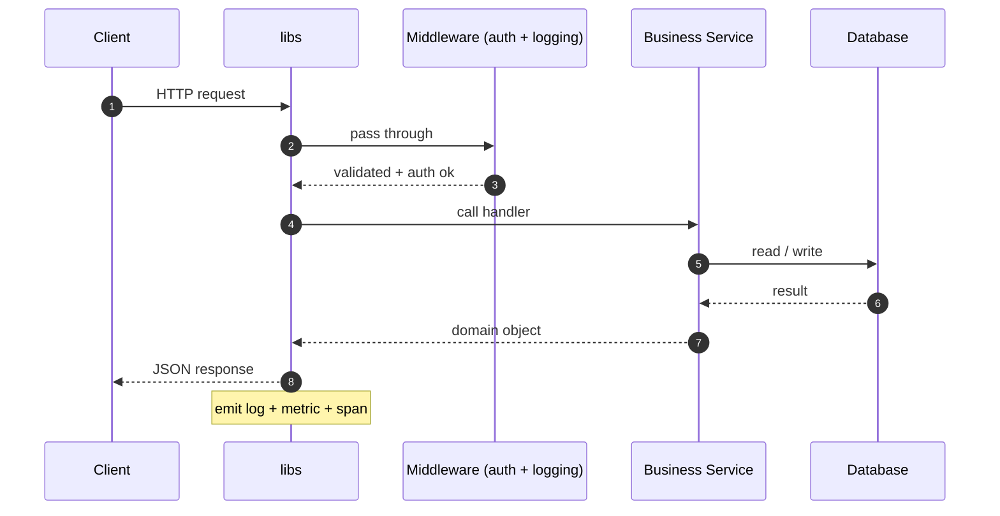

### Per-endpoint sequence stubs (top 5)

### `POST /api/x` (py/tests/test_body_limit.py:32)

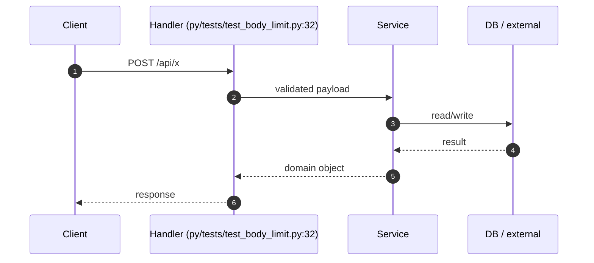

### `POST /upload/x` (py/tests/test_body_limit.py:36)

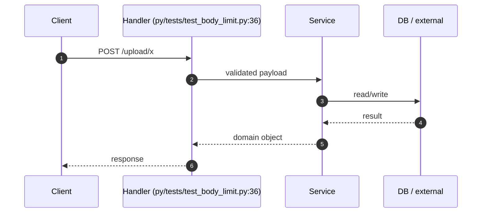

### `POST /api/charge` (py/tests/test_idempotency_middleware.py:59)

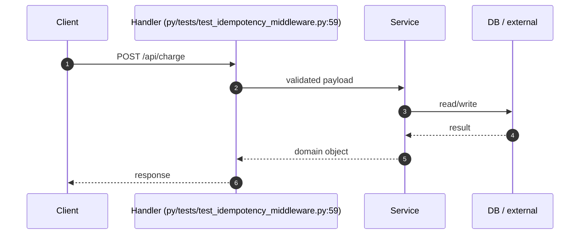

### `POST /api/fail` (py/tests/test_idempotency_middleware.py:64)

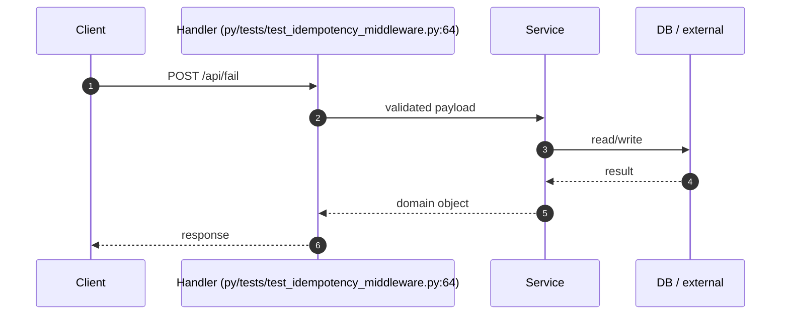

### `POST /api/validate-error` (py/tests/test_idempotency_middleware.py:69)

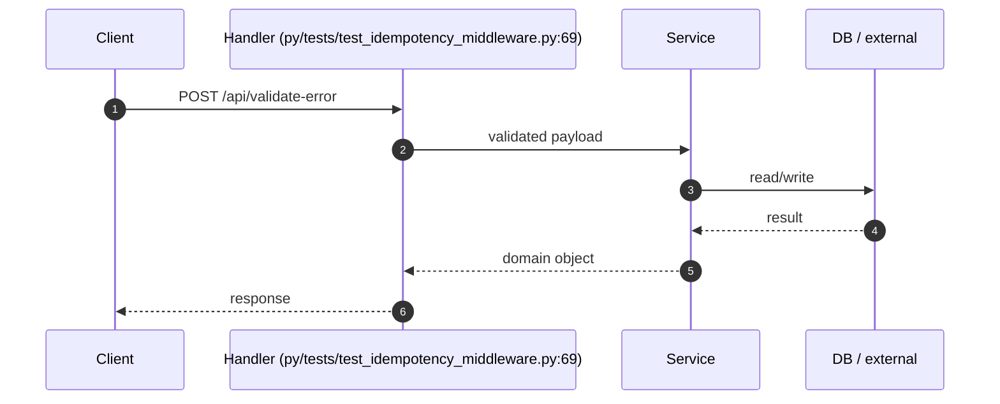

_(+1 more endpoints — diagrams omitted for brevity.)_


## 🔬 Annotated Example Request

Walk through what happens when a client calls **`POST /api/x`** (py/tests/test_body_limit.py:32).

```text
┌─────────────────────────────────────────────────────────────────────┐
│ 1. Client sends HTTP request                                        │
│    POST /api/x                                                      │
│    Headers: Authorization, X-Correlation-ID, X-Tenant-ID            │
└────────────────────────┬────────────────────────────────────────────┘
                         │
                         ▼
┌─────────────────────────────────────────────────────────────────────┐
│ 2. Middleware stack (auth → logging → tracing → rate-limit)         │
│    - Validate JWT / API key                                         │
│    - Resolve tenant_id from token                                   │
│    - Start span; inject request_id into baggage                     │
└────────────────────────┬────────────────────────────────────────────┘
                         │
                         ▼
┌─────────────────────────────────────────────────────────────────────┐
│ 3. Pydantic validation                                              │
│    - Parse request body against schema                              │
│    - 422 on validation error (with field-level details)             │
└────────────────────────┬────────────────────────────────────────────┘
                         │
                         ▼
┌─────────────────────────────────────────────────────────────────────┐
│ 4. Router handler                                                   │
│    py/tests/test_body_limit.py:32
│    - Receive validated request + injected Depends()                 │
│    - Delegate to business service                                   │
└────────────────────────┬────────────────────────────────────────────┘
                         │
                         ▼
┌─────────────────────────────────────────────────────────────────────┐
│ 5. Business service                                                 │
│    - Apply rules / orchestrate multi-step logic                     │
│    - Call repositories for DB I/O                                   │
│    - Call external services (LLM / vector DB / etc.)             │
│    - Emit metrics + log decision audit row                          │
└────────────────────────┬────────────────────────────────────────────┘
                         │
                         ▼
┌─────────────────────────────────────────────────────────────────────┐
│ 6. Response shaping                                                 │
│    - Build response Pydantic model                                  │
│    - Serialize to JSON                                              │
│    - Add correlation_id, latency_ms to headers                      │
└────────────────────────┬────────────────────────────────────────────┘
                         │
                         ▼
                       Client
```

### Inspecting this in real time

```bash
# 1. Tail the service log
docker logs documind-libs --tail=20 -f &

# 2. Issue the request with a fresh correlation_id
REQ_ID=$(uuidgen)
curl -X POST http://localhost:<PORT>/api/x \
  -H "X-Correlation-ID: $REQ_ID" \
  -H "Authorization: Bearer <token>" \
  -d '{}'

# 3. Find the trace in Jaeger
open http://localhost:16686/search?service=libs&tags=%7B%22request_id%22%3A%22$REQ_ID%22%7D
```


## 8. Database Layer

**DB / storage libraries:** Kafka (aiokafka), Neo4j, Redis, asyncpg

**Total DB call sites:** 19

| Pattern | Count |
|---|---|
| `execute` | 7 |
| `fetch/fetchall/fetchrow` | 5 |
| `ORM CRUD` | 7 |

### Query Optimization checklist

| Check | Status (✓/✗/⚠) | Notes |
|---|---|---|
| Indexes on every WHERE / ORDER BY column | — | EXPLAIN ANALYZE hot paths |
| Full table scans avoided | — | — |
| Batch operations used (not N writes in a loop) | — | — |
| Parameterized queries (NEVER f-string SQL) | — | — |

### Transactions (ACID)

| Check | Status (✓/✗/⚠) | Notes |
|---|---|---|
| Transaction boundaries narrow (no HTTP / LLM inside) | — | — |
| Rollback on exception | — | — |
| Isolation level documented (READ COMMITTED / SERIALIZABLE) | — | — |
| Deadlock prevention strategy | — | — |

### N+1 Query Findings (reviewer to fill)

| Endpoint / Function | Suspect Loop | Est. Queries / Request | Fix |
|---|---|---|---|
| — | — | — | — |


## 9. Code Quality + Complexity

### Readability

| Check | Status (✓/✗/⚠) | Notes |
|---|---|---|
| Clear variable / function / class names | — | — |
| No misleading naming (no `tmp` / `xyz` / `foo`) | — | — |
| Small focused functions (≤ 50 lines) | — | 5 > 50 lines (see Section 0) |
| Avoid deeply nested conditions (≤ 4 levels) | — | — |

### Clean code

| Check | Status (✓/✗/⚠) | Notes |
|---|---|---|
| No dead / commented-out code | — | — |
| No `print()` — use logger | — | — |
| No hardcoded values | — | smell count: 8 |
| Constants extracted to a settings module | — | — |

### Complexity

| Check | Status (✓/✗/⚠) | Notes |
|---|---|---|
| Long methods broken down | — | — |
| No overengineering (premature abstractions) | — | — |
| Cyclomatic complexity ≤ 15 per function | — | run `ruff complexity` or `radon` |


## 10. Security Review

### Authentication & Authorization

| Check | Status (✓/✗/⚠) | Notes |
|---|---|---|
| Authentication implemented correctly | — | Bearer / JWT / session |
| Authorization (RBAC / ABAC) checks | — | no client-side trust |
| Tokens validated server-side every request | — | rotate, expire, revoke |

### OWASP Top 10

| Check | Status (✓/✗/⚠) | Notes |
|---|---|---|
| Request validation present | — | sanitization: Manual escape, Pydantic BaseModel |
| SQL injection prevention | — | DB libs: Kafka (aiokafka), Neo4j, Redis, asyncpg — parameterized queries only |
| XSS / CSRF prevention | — | output encoding / CSP / SameSite |
| Path traversal prevention | — | no user input concatenated to file paths |
| Prompt injection prevention | — | Rebuff / output filter |

### Secret Management

| Check | Status (✓/✗/⚠) | Notes |
|---|---|---|
| No secrets in code | — | smell count: 0 password literals, 0 api key literals |
| Env vars / Vault used | — | Pydantic BaseSettings or env reader |
| Secret rotation strategy | — | documented in runbook |

### Sensitive Data

| Check | Status (✓/✗/⚠) | Notes |
|---|---|---|
| PII masked in logs | — | structured logger with field redaction |
| Encryption in transit (TLS) | — | — |
| Encryption at rest (DB / object store) | — | — |
| GDPR — retention + right-to-be-forgotten | — | — |


## 11. Performance Review

### Memory

| Check | Status (✓/✗/⚠) | Notes |
|---|---|---|
| Large object retention avoided | — | — |
| Streaming for large files / data | — | — |
| Caches bounded (LRU / TTL) | — | caching: in-memory @lru_cache, redis |

### Concurrency

| Check | Status (✓/✗/⚠) | Notes |
|---|---|---|
| Thread safety validated | — | primitives: Lock / RLock, asyncio (async/await), threading |
| Race conditions prevented | — | — |
| Deadlocks avoided (lock ordering) | — | — |
| Parallel processing where beneficial | — | 150 async fns |

### Latency

| Check | Status (✓/✗/⚠) | Notes |
|---|---|---|
| External API calls batched / cached | — | — |
| Timeouts on every external call | — | — |
| No blocking I/O inside async functions | — | — |


## 12. Reliability & Observability

### Failure Handling

| Check | Status (✓/✗/⚠) | Notes |
|---|---|---|
| Retry (bounded + exp backoff + jitter) | — | — |
| Circuit breaker around external deps | — | — |
| Graceful degradation | — | — |

### Timeout Handling

| Check | Status (✓/✗/⚠) | Notes |
|---|---|---|
| Timeout on every external call (HTTP / DB / subprocess) | — | — |
| No infinite waits | — | — |

### Observability

| Check | Status (✓/✗/⚠) | Notes |
|---|---|---|
| Structured (JSON) logging | — | correlation_id + tenant_id + request_id |
| Metrics (RED: rate / errors / duration) | — | — |
| Tracing (OpenTelemetry → Jaeger / Tempo) | — | — |
| Baggage propagation across services | — | — |


## 13. Test Cases

**Test files detected:** 26
**Test functions parsed:** 420

| Test name | Location | Purpose (from docstring) |
|---|---|---|
| `test_injection_blocks_ignore_previous` | `py/tests/test_ai_governance.py:23` | _(no docstring)_ |
| `test_injection_blocks_delimiter_spoof` | `py/tests/test_ai_governance.py:29` | _(no docstring)_ |
| `test_injection_ok_benign` | `py/tests/test_ai_governance.py:35` | _(no docstring)_ |
| `test_injection_raises_on_block` | `py/tests/test_ai_governance.py:41` | _(no docstring)_ |
| `test_pii_detects_ssn_and_email` | `py/tests/test_ai_governance.py:52` | _(no docstring)_ |
| `test_pii_redact_replaces_inline` | `py/tests/test_ai_governance.py:61` | _(no docstring)_ |
| `test_pii_clean_text_no_findings` | `py/tests/test_ai_governance.py:69` | _(no docstring)_ |
| `test_adversarial_too_long_rejected` | `py/tests/test_ai_governance.py:79` | _(no docstring)_ |
| `test_adversarial_repeat_run_detected` | `py/tests/test_ai_governance.py:85` | _(no docstring)_ |
| `test_adversarial_benign_passes` | `py/tests/test_ai_governance.py:91` | _(no docstring)_ |
| `test_responsible_flags_protected_class_generalization` | `py/tests/test_ai_governance.py:101` | _(no docstring)_ |
| `test_responsible_flags_absolute_without_citation` | `py/tests/test_ai_governance.py:111` | _(no docstring)_ |
| `test_responsible_flags_missing_ai_disclosure` | `py/tests/test_ai_governance.py:121` | _(no docstring)_ |
| `test_responsible_clean_response_no_flags` | `py/tests/test_ai_governance.py:131` | _(no docstring)_ |
| `test_explainer_builds_narrative_with_chunks` | `py/tests/test_ai_governance.py:146` | _(no docstring)_ |
| `test_explainer_empty_retrieval_warns_in_narrative` | `py/tests/test_ai_governance.py:174` | _(no docstring)_ |
| `test_trace_records_step_with_timing` | `py/tests/test_ai_governance.py:195` | _(no docstring)_ |
| `test_injection_scan_empty_text_returns_empty` | `py/tests/test_ai_governance.py:214` | _(no docstring)_ |
| `test_injection_scan_no_match_returns_empty_list` | `py/tests/test_ai_governance.py:219` | _(no docstring)_ |
| `test_pii_scan_empty_text_returns_empty` | `py/tests/test_ai_governance.py:225` | _(no docstring)_ |
| `test_pii_scan_caps_at_20_findings` | `py/tests/test_ai_governance.py:229` | _(no docstring)_ |
| `test_pii_redact_empty_returns_empty` | `py/tests/test_ai_governance.py:240` | _(no docstring)_ |
| `test_pii_redact_value_handles_str` | `py/tests/test_ai_governance.py:245` | _(no docstring)_ |
| `test_pii_redact_value_handles_dict` | `py/tests/test_ai_governance.py:251` | _(no docstring)_ |
| `test_pii_redact_value_handles_list` | `py/tests/test_ai_governance.py:258` | _(no docstring)_ |
| `test_pii_redact_value_handles_tuple` | `py/tests/test_ai_governance.py:265` | _(no docstring)_ |
| `test_pii_redact_value_passes_through_numbers_and_none` | `py/tests/test_ai_governance.py:273` | _(no docstring)_ |
| `test_pii_redact_value_handles_nested` | `py/tests/test_ai_governance.py:281` | _(no docstring)_ |
| `test_explainer_guardrail_violations_appear_in_narrative` | `py/tests/test_ai_governance.py:295` | _(no docstring)_ |
| `test_adversarial_too_many_urls_flagged` | `py/tests/test_ai_governance.py:329` | _(no docstring)_ |
| `test_adversarial_non_printable_ratio_flagged` | `py/tests/test_ai_governance.py:337` | _(no docstring)_ |
| `test_trace_steps_property_returns_copy` | `py/tests/test_ai_governance.py:351` | _(no docstring)_ |
| `test_injection_scan_or_raise_passes_when_no_block` | `py/tests/test_ai_governance.py:365` | _(no docstring)_ |
| `test_strips_error_suffix` | `py/tests/test_audit.py:40` | _(no docstring)_ |
| `test_keeps_name_without_error_suffix` | `py/tests/test_audit.py:43` | _(no docstring)_ |
| `test_only_error_class` | `py/tests/test_audit.py:49` | _(no docstring)_ |
| `test_stable_across_key_order` | `py/tests/test_audit.py:62` | _(no docstring)_ |
| `test_handles_datetime_via_default_str` | `py/tests/test_audit.py:69` | _(no docstring)_ |
| `test_deterministic` | `py/tests/test_audit.py:80` | _(no docstring)_ |
| `test_changes_with_each_field` | `py/tests/test_audit.py:92` | _(no docstring)_ |
| `test_hash_is_sha256_hex` | `py/tests/test_audit.py:118` | _(no docstring)_ |
| `test_resource_type_none_treated_as_empty` | `py/tests/test_audit.py:132` | _(no docstring)_ |
| `test_first_row_seeds_chain_with_empty_prev` | `py/tests/test_audit.py:181` | _(no docstring)_ |
| `test_subsequent_row_chains_off_previous` | `py/tests/test_audit.py:193` | _(no docstring)_ |
| `test_service_stamped_into_details` | `py/tests/test_audit.py:202` | _(no docstring)_ |
| `test_caller_supplied_service_not_clobbered` | `py/tests/test_audit.py:214` | _(no docstring)_ |
| `test_fail_open_default_swallows_db_error` | `py/tests/test_audit.py:224` | _(no docstring)_ |
| `test_fail_closed_raises_data_error` | `py/tests/test_audit.py:234` | _(no docstring)_ |
| `test_hash_chain_matches_compute_function` | `py/tests/test_audit.py:249` | _(no docstring)_ |
| `test_lowercase_split` | `py/tests/test_bm25.py:25` | _(no docstring)_ |
| `test_strips_punct` | `py/tests/test_bm25.py:28` | _(no docstring)_ |
| `test_empty` | `py/tests/test_bm25.py:31` | _(no docstring)_ |
| `test_frozen` | `py/tests/test_bm25.py:36` | _(no docstring)_ |
| `test_empty_corpus` | `py/tests/test_bm25.py:43` | _(no docstring)_ |
| `test_basic_ranking` | `py/tests/test_bm25.py:48` | _(no docstring)_ |
| `test_no_match_returns_empty` | `py/tests/test_bm25.py:63` | _(no docstring)_ |
| `test_top_k_caps_results` | `py/tests/test_bm25.py:70` | _(no docstring)_ |
| `test_top_k_zero_raises` | `py/tests/test_bm25.py:75` | _(no docstring)_ |
| `test_empty_document_handled` | `py/tests/test_bm25.py:81` | _(no docstring)_ |
| `test_composes_with_rrf` | `py/tests/test_bm25.py:99` | _(no docstring)_ |
| `test_default_when_no_override` | `py/tests/test_body_limit.py:46` | _(no docstring)_ |
| `test_override_matches_prefix` | `py/tests/test_body_limit.py:50` | _(no docstring)_ |
| `test_no_content_length_passes` | `py/tests/test_body_limit.py:62` | _(no docstring)_ |
| `test_under_limit_passes` | `py/tests/test_body_limit.py:73` | _(no docstring)_ |
| `test_over_limit_rejected_413` | `py/tests/test_body_limit.py:79` | _(no docstring)_ |
| `test_path_override_higher_cap` | `py/tests/test_body_limit.py:90` | _(no docstring)_ |
| `test_malformed_content_length_treated_as_zero` | `py/tests/test_body_limit.py:99` | _(no docstring)_ |
| `test_retrieval_breaker_opens_when_quality_degrades` | `py/tests/test_breakers.py:28` | _(no docstring)_ |
| `test_retrieval_breaker_stays_closed_when_quality_good` | `py/tests/test_breakers.py:41` | _(no docstring)_ |
| `test_retrieval_breaker_opens_on_mostly_empty_results` | `py/tests/test_breakers.py:53` | _(no docstring)_ |
| `test_token_breaker_allow_under_budget` | `py/tests/test_breakers.py:73` | _(no docstring)_ |
| `test_token_breaker_rejects_over_daily` | `py/tests/test_breakers.py:85` | _(no docstring)_ |
| `test_token_breaker_warns_at_80pct` | `py/tests/test_breakers.py:98` | _(no docstring)_ |
| `test_token_breaker_rejects_per_request_blow_up` | `py/tests/test_breakers.py:111` | _(no docstring)_ |
| `test_token_breaker_raises_on_reject` | `py/tests/test_breakers.py:123` | _(no docstring)_ |
| `test_agent_breaker_stops_on_max_steps` | `py/tests/test_breakers.py:139` | _(no docstring)_ |
| `test_agent_breaker_detects_tool_loop` | `py/tests/test_breakers.py:150` | _(no docstring)_ |
| `test_agent_breaker_enforces_tool_budget` | `py/tests/test_breakers.py:159` | _(no docstring)_ |
| `test_agent_breaker_user_abort` | `py/tests/test_breakers.py:172` | _(no docstring)_ |
| `test_obs_breaker_allows_when_closed` | `py/tests/test_breakers.py:184` | _(no docstring)_ |
| `test_obs_breaker_opens_and_skips` | `py/tests/test_breakers.py:191` | _(no docstring)_ |
| `test_obs_breaker_never_raises` | `py/tests/test_breakers.py:200` | _(no docstring)_ |
| `test_ccb_blocks_on_repetition` | `py/tests/test_breakers.py:214` | _(no docstring)_ |
| `test_ccb_blocks_on_missing_citation_after_deadline` | `py/tests/test_breakers.py:226` | _(no docstring)_ |
| `test_ccb_continues_when_citation_present` | `py/tests/test_breakers.py:238` | _(no docstring)_ |
| `test_ccb_blocks_on_forbidden_pattern` | `py/tests/test_breakers.py:248` | _(no docstring)_ |
| `test_ccb_snapshot_includes_readings` | `py/tests/test_breakers.py:258` | _(no docstring)_ |
| `test_basic` | `py/tests/test_cache.py:40` | _(no docstring)_ |
| `test_single_part` | `py/tests/test_cache.py:43` | _(no docstring)_ |
| `test_empty_tenant_id_rejected` | `py/tests/test_cache.py:46` | _(no docstring)_ |
| `test_hit_returns_parsed` | `py/tests/test_cache.py:58` | _(no docstring)_ |
| `test_miss_returns_none` | `py/tests/test_cache.py:65` | _(no docstring)_ |
| `test_connection_error_fails_open` | `py/tests/test_cache.py:72` | _(no docstring)_ |
| `test_timeout_fails_open` | `py/tests/test_cache.py:80` | _(no docstring)_ |
| `test_os_error_fails_open` | `py/tests/test_cache.py:87` | _(no docstring)_ |
| `test_bad_json_returns_none` | `py/tests/test_cache.py:94` | _(no docstring)_ |
| `test_success_uses_default_ttl` | `py/tests/test_cache.py:107` | _(no docstring)_ |
| `test_explicit_ttl_overrides` | `py/tests/test_cache.py:115` | _(no docstring)_ |
| `test_connection_error_fails_open` | `py/tests/test_cache.py:122` | _(no docstring)_ |
| `test_serializes_with_default_str` | `py/tests/test_cache.py:131` | _(no docstring)_ |
| `test_zero_keys_returns_zero_no_call` | `py/tests/test_cache.py:146` | _(no docstring)_ |
| `test_multiple_keys_forwarded` | `py/tests/test_cache.py:153` | _(no docstring)_ |
| `test_no_matches_returns_zero` | `py/tests/test_cache.py:167` | _(no docstring)_ |
| `test_multiple_matches_deleted` | `py/tests/test_cache.py:179` | _(no docstring)_ |
| `test_cache_hit_skips_loader` | `py/tests/test_cache.py:197` | _(no docstring)_ |
| `test_miss_with_lock_calls_loader` | `py/tests/test_cache.py:207` | _(no docstring)_ |
| `test_miss_lock_contended_retry_hit` | `py/tests/test_cache.py:221` | _(no docstring)_ |
| `test_miss_lock_acquired_double_check_hits` | `py/tests/test_cache.py:242` | _(no docstring)_ |
| `test_miss_lock_contended_still_miss_falls_through` | `py/tests/test_cache.py:258` | _(no docstring)_ |
| `test_frozen` | `py/tests/test_chunking.py:40` | _(no docstring)_ |
| `test_default_version_stamped` | `py/tests/test_chunking.py:46` | _(no docstring)_ |
| `test_len` | `py/tests/test_chunking.py:50` | _(no docstring)_ |
| `test_simple_split` | `py/tests/test_chunking.py:58` | _(no docstring)_ |
| `test_empty_text` | `py/tests/test_chunking.py:63` | _(no docstring)_ |
| `test_size_zero_rejected` | `py/tests/test_chunking.py:66` | _(no docstring)_ |
| `test_whitespace_only_chunks_dropped` | `py/tests/test_chunking.py:70` | _(no docstring)_ |
| `test_overlap_repeats_text` | `py/tests/test_chunking.py:80` | _(no docstring)_ |
| `test_overlap_geq_size_rejected` | `py/tests/test_chunking.py:87` | _(no docstring)_ |
| `test_empty_text` | `py/tests/test_chunking.py:92` | _(no docstring)_ |
| `test_basic_split` | `py/tests/test_chunking.py:100` | _(no docstring)_ |
| `test_max_chars_caps_long_sentence` | `py/tests/test_chunking.py:105` | _(no docstring)_ |
| `test_empty_text` | `py/tests/test_chunking.py:113` | _(no docstring)_ |
| `test_blank_line_separated` | `py/tests/test_chunking.py:121` | _(no docstring)_ |
| `test_single_paragraph` | `py/tests/test_chunking.py:126` | _(no docstring)_ |
| `test_empty_strings_filtered` | `py/tests/test_chunking.py:130` | _(no docstring)_ |
| `test_simple_h1` | `py/tests/test_chunking.py:140` | _(no docstring)_ |
| `test_nested_headers_compose_path` | `py/tests/test_chunking.py:145` | _(no docstring)_ |
| `test_no_headers_falls_back_to_paragraph` | `py/tests/test_chunking.py:153` | _(no docstring)_ |
| `test_skips_header_with_empty_body` | `py/tests/test_chunking.py:162` | _(no docstring)_ |
| `test_under_limit_returns_single_chunk` | `py/tests/test_chunking.py:174` | _(no docstring)_ |
| `test_splits_on_first_separator` | `py/tests/test_chunking.py:179` | _(no docstring)_ |
| `test_falls_through_separator_cascade` | `py/tests/test_chunking.py:186` | _(no docstring)_ |
| `test_max_chars_zero_rejected` | `py/tests/test_chunking.py:199` | _(no docstring)_ |
| `test_oversized_atomic_unit_hard_cut` | `py/tests/test_chunking.py:203` | _(no docstring)_ |
| `test_caps_at_max_tokens` | `py/tests/test_chunking.py:216` | _(no docstring)_ |
| `test_custom_tokenizer` | `py/tests/test_chunking.py:224` | _(no docstring)_ |
| `test_max_tokens_zero_rejected` | `py/tests/test_chunking.py:230` | _(no docstring)_ |
| `test_empty_text` | `py/tests/test_chunking.py:234` | _(no docstring)_ |
| `test_enum` | `py/tests/test_chunking.py:242` | _(no docstring)_ |
| `test_string` | `py/tests/test_chunking.py:247` | _(no docstring)_ |
| `test_unknown_strategy_raises` | `py/tests/test_chunking.py:252` | _(no docstring)_ |
| `test_kwargs_forwarded` | `py/tests/test_chunking.py:258` | _(no docstring)_ |
| `test_every_strategy_stamps_version` | `py/tests/test_chunking.py:268` | _(no docstring)_ |
| `test_empty` | `py/tests/test_citations.py:30` | _(no docstring)_ |
| `test_single_sentence_no_terminator` | `py/tests/test_citations.py:34` | _(no docstring)_ |
| `test_multiple_sentences` | `py/tests/test_citations.py:40` | _(no docstring)_ |
| `test_offsets_correct` | `py/tests/test_citations.py:47` | _(no docstring)_ |
| `test_claim_frozen` | `py/tests/test_citations.py:55` | _(no docstring)_ |
| `test_cited_claim_frozen` | `py/tests/test_citations.py:60` | _(no docstring)_ |
| `test_is_supported_reflects_citations` | `py/tests/test_citations.py:65` | _(no docstring)_ |
| `test_min_overlap_out_of_range_raises` | `py/tests/test_citations.py:73` | _(no docstring)_ |
| `test_top_k_zero_raises` | `py/tests/test_citations.py:79` | _(no docstring)_ |
| `test_no_chunks_no_citations` | `py/tests/test_citations.py:85` | _(no docstring)_ |
| `test_finds_overlap_above_threshold` | `py/tests/test_citations.py:91` | _(no docstring)_ |
| `test_filters_below_min_overlap` | `py/tests/test_citations.py:105` | _(no docstring)_ |
| `test_top_k_caps_citations` | `py/tests/test_citations.py:115` | _(no docstring)_ |
| `test_citations_sorted_by_score_desc` | `py/tests/test_citations.py:128` | _(no docstring)_ |
| `test_claim_with_no_tokens_has_no_citations` | `py/tests/test_citations.py:142` | _(no docstring)_ |
| `test_all_supported_zero_rate` | `py/tests/test_citations.py:165` | _(no docstring)_ |
| `test_partial_support` | `py/tests/test_citations.py:174` | _(no docstring)_ |
| `test_empty_returns_zero` | `py/tests/test_citations.py:184` | _(no docstring)_ |
| `test_default_env_is_development` | `py/tests/test_config.py:30` | _(no docstring)_ |
| `test_default_postgres_credentials` | `py/tests/test_config.py:35` | _(no docstring)_ |
| `test_secret_passwords_default_to_dev_value` | `py/tests/test_config.py:41` | _(no docstring)_ |
| `test_optional_secrets_default_to_none` | `py/tests/test_config.py:48` | _(no docstring)_ |
| `test_env_prefix_accepted` | `py/tests/test_config.py:56` | _(no docstring)_ |
| `test_invalid_env_value_rejected` | `py/tests/test_config.py:62` | _(no docstring)_ |
| `test_int_coercion` | `py/tests/test_config.py:68` | _(no docstring)_ |
| `test_bool_coercion` | `py/tests/test_config.py:73` | _(no docstring)_ |
| `test_basic_format` | `py/tests/test_config.py:80` | _(no docstring)_ |
| `test_uses_get_secret_value` | `py/tests/test_config.py:87` | _(no docstring)_ |
| `test_default_split` | `py/tests/test_config.py:97` | _(no docstring)_ |
| `test_strips_whitespace` | `py/tests/test_config.py:103` | _(no docstring)_ |
| `test_empty_strings_filtered` | `py/tests/test_config.py:107` | _(no docstring)_ |
| `test_returns_default_class` | `py/tests/test_config.py:115` | _(no docstring)_ |
| `test_caches_per_class` | `py/tests/test_config.py:119` | _(no docstring)_ |
| `test_subclass_isolated` | `py/tests/test_config.py:124` | _(no docstring)_ |
| `test_init_does_not_connect` | `py/tests/test_db_client.py:30` | _(no docstring)_ |
| `test_pool_property_before_connect_raises` | `py/tests/test_db_client.py:36` | _(no docstring)_ |
| `test_connect_creates_pool` | `py/tests/test_db_client.py:42` | _(no docstring)_ |
| `test_connect_is_idempotent` | `py/tests/test_db_client.py:51` | _(no docstring)_ |
| `test_close_clears_pool` | `py/tests/test_db_client.py:62` | _(no docstring)_ |
| `test_close_when_never_connected_is_noop` | `py/tests/test_db_client.py:72` | _(no docstring)_ |
| `test_empty_tenant_id_rejected` | `py/tests/test_db_client.py:82` | _(no docstring)_ |
| `test_sets_current_tenant_via_set_config` | `py/tests/test_db_client.py:91` | _(no docstring)_ |
| `test_no_set_config_call` | `py/tests/test_db_client.py:126` | _(no docstring)_ |
| `test_to_dict_with_record` | `py/tests/test_db_client.py:152` | _(no docstring)_ |
| `test_to_dict_with_none` | `py/tests/test_db_client.py:158` | _(no docstring)_ |
| `test_init_stores_db` | `py/tests/test_db_client.py:162` | _(no docstring)_ |
| `test_success_rate_normal` | `py/tests/test_dispatch_pool.py:29` | _(no docstring)_ |
| `test_success_rate_zero_submitted_no_div_zero` | `py/tests/test_dispatch_pool.py:33` | _(no docstring)_ |
| `test_dataclass_default_error_none` | `py/tests/test_dispatch_pool.py:41` | _(no docstring)_ |
| `test_max_parallel_must_be_positive` | `py/tests/test_dispatch_pool.py:49` | _(no docstring)_ |
| `test_empty_task_list_short_circuits` | `py/tests/test_dispatch_pool.py:57` | _(no docstring)_ |
| `test_results_in_submission_order` | `py/tests/test_dispatch_pool.py:69` | _(no docstring)_ |
| `test_per_task_error_isolation` | `py/tests/test_dispatch_pool.py:84` | _(no docstring)_ |
| `test_per_task_timeout_enforced` | `py/tests/test_dispatch_pool.py:108` | _(no docstring)_ |
| `test_max_parallel_capped` | `py/tests/test_dispatch_pool.py:121` | _(no docstring)_ |
| `test_roundtrip` | `py/tests/test_embedding_cache.py:43` | _(no docstring)_ |
| `test_bytes_misaligned_raises` | `py/tests/test_embedding_cache.py:50` | _(no docstring)_ |
| `test_empty_roundtrip` | `py/tests/test_embedding_cache.py:56` | _(no docstring)_ |
| `test_hit_rate_normal` | `py/tests/test_embedding_cache.py:63` | _(no docstring)_ |
| `test_hit_rate_zero_total_no_div_zero` | `py/tests/test_embedding_cache.py:67` | _(no docstring)_ |
| `test_empty_model_rejected` | `py/tests/test_embedding_cache.py:75` | _(no docstring)_ |
| `test_model_property` | `py/tests/test_embedding_cache.py:80` | _(no docstring)_ |
| `test_miss_returns_none_increments_misses` | `py/tests/test_embedding_cache.py:87` | _(no docstring)_ |
| `test_hit_returns_vector_increments_hits` | `py/tests/test_embedding_cache.py:97` | _(no docstring)_ |
| `test_put_calls_setex_with_packed_bytes` | `py/tests/test_embedding_cache.py:108` | _(no docstring)_ |
| `test_put_skips_empty_vector` | `py/tests/test_embedding_cache.py:119` | _(no docstring)_ |
| `test_get_connection_error_fails_open` | `py/tests/test_embedding_cache.py:130` | _(no docstring)_ |
| `test_get_timeout_fails_open` | `py/tests/test_embedding_cache.py:139` | _(no docstring)_ |
| `test_put_connection_error_fails_open` | `py/tests/test_embedding_cache.py:146` | _(no docstring)_ |
| `test_corrupt_bytes_treated_as_miss` | `py/tests/test_embedding_cache.py:154` | _(no docstring)_ |
| `test_empty_tenant_id_rejected_on_get` | `py/tests/test_embedding_cache.py:166` | _(no docstring)_ |
| `test_empty_tenant_id_rejected_on_put` | `py/tests/test_embedding_cache.py:173` | _(no docstring)_ |
| `test_empty_tenant_id_rejected_on_invalidate` | `py/tests/test_embedding_cache.py:179` | _(no docstring)_ |
| `test_different_models_different_keys` | `py/tests/test_embedding_cache.py:187` | _(no docstring)_ |
| `test_invalidate_tenant_scans_and_deletes` | `py/tests/test_embedding_cache.py:206` | _(no docstring)_ |
| `test_empty_string_key_rejected` | `py/tests/test_encryption.py:38` | _(no docstring)_ |
| `test_empty_bytes_key_rejected` | `py/tests/test_encryption.py:42` | _(no docstring)_ |
| `test_invalid_fernet_key_rejected` | `py/tests/test_encryption.py:46` | _(no docstring)_ |
| `test_str_key_accepted` | `py/tests/test_encryption.py:50` | _(no docstring)_ |
| `test_bytes_key_accepted` | `py/tests/test_encryption.py:53` | _(no docstring)_ |
| `test_simple_string` | `py/tests/test_encryption.py:61` | _(no docstring)_ |
| `test_empty_string` | `py/tests/test_encryption.py:65` | _(no docstring)_ |
| `test_unicode` | `py/tests/test_encryption.py:68` | _(no docstring)_ |
| `test_long_payload` | `py/tests/test_encryption.py:72` | _(no docstring)_ |
| `test_output_has_sentinel_prefix` | `py/tests/test_encryption.py:76` | _(no docstring)_ |
| `test_two_encryptions_of_same_input_differ` | `py/tests/test_encryption.py:79` | _(no docstring)_ |
| `test_legacy_plaintext_passes_through` | `py/tests/test_encryption.py:93` | _(no docstring)_ |
| `test_empty_string_passes_through` | `py/tests/test_encryption.py:97` | _(no docstring)_ |
| `test_corrupt_sentinel_payload_returns_marker` | `py/tests/test_encryption.py:100` | _(no docstring)_ |
| `test_wrong_key_returns_marker` | `py/tests/test_encryption.py:105` | _(no docstring)_ |
| `test_partial_sentinel_treated_as_plaintext` | `py/tests/test_encryption.py:113` | _(no docstring)_ |
| `test_returns_string` | `py/tests/test_encryption.py:123` | _(no docstring)_ |
| `test_key_is_valid_for_cipher` | `py/tests/test_encryption.py:126` | _(no docstring)_ |
| `test_two_calls_return_different_keys` | `py/tests/test_encryption.py:131` | _(no docstring)_ |
| `test_key_length_is_fernet_standard` | `py/tests/test_encryption.py:136` | _(no docstring)_ |
| `test_no_env_no_arg_returns_false` | `py/tests/test_error_tracking.py:37` | _(no docstring)_ |
| `test_empty_env_returns_false` | `py/tests/test_error_tracking.py:42` | _(no docstring)_ |
| `test_whitespace_env_returns_false` | `py/tests/test_error_tracking.py:46` | _(no docstring)_ |
| `test_dsn_argument_initializes` | `py/tests/test_error_tracking.py:52` | _(no docstring)_ |
| `test_env_dsn_initializes` | `py/tests/test_error_tracking.py:60` | _(no docstring)_ |
| `test_explicit_dsn_overrides_env` | `py/tests/test_error_tracking.py:65` | _(no docstring)_ |
| `test_double_init_returns_false` | `py/tests/test_error_tracking.py:72` | _(no docstring)_ |
| `test_noop_before_init` | `py/tests/test_error_tracking.py:81` | _(no docstring)_ |
| `test_sets_tag_after_init` | `py/tests/test_error_tracking.py:86` | _(no docstring)_ |
| `test_no_tenant_no_user_safe` | `py/tests/test_error_tracking.py:96` | _(no docstring)_ |
| `test_returns_none_before_init` | `py/tests/test_error_tracking.py:107` | _(no docstring)_ |
| `test_captures_after_init_with_extras` | `py/tests/test_error_tracking.py:113` | _(no docstring)_ |
| `test_false_initially` | `py/tests/test_error_tracking.py:129` | _(no docstring)_ |
| `test_true_after_successful_init` | `py/tests/test_error_tracking.py:132` | _(no docstring)_ |
| `test_false_after_skipped_init` | `py/tests/test_error_tracking.py:137` | _(no docstring)_ |
| `test_defaults` | `py/tests/test_exceptions.py:31` | _(no docstring)_ |
| `test_per_raise_error_code_override` | `py/tests/test_exceptions.py:38` | _(no docstring)_ |
| `test_per_raise_http_status_override` | `py/tests/test_exceptions.py:43` | _(no docstring)_ |
| `test_details_passed_through` | `py/tests/test_exceptions.py:48` | _(no docstring)_ |
| `test_to_dict_envelope` | `py/tests/test_exceptions.py:52` | _(no docstring)_ |
| `test_4xx_codes` | `py/tests/test_exceptions.py:67` | _(no docstring)_ |
| `test_5xx_codes` | `py/tests/test_exceptions.py:80` | _(no docstring)_ |
| `test_is_external_service_error` | `py/tests/test_exceptions.py:94` | _(no docstring)_ |
| `test_default_message` | `py/tests/test_exceptions.py:104` | _(no docstring)_ |
| `test_retry_after_seconds_stamped_into_details` | `py/tests/test_exceptions.py:108` | _(no docstring)_ |
| `test_retry_after_seconds_omitted` | `py/tests/test_exceptions.py:112` | _(no docstring)_ |
| `test_details_merged_with_retry_after` | `py/tests/test_exceptions.py:118` | _(no docstring)_ |
| `test_empty_input` | `py/tests/test_fusion.py:27` | _(no docstring)_ |
| `test_single_ranking_preserves_order` | `py/tests/test_fusion.py:30` | _(no docstring)_ |
| `test_overlap_boosts_score` | `py/tests/test_fusion.py:36` | _(no docstring)_ |
| `test_empty_list_among_others_is_no_op` | `py/tests/test_fusion.py:44` | _(no docstring)_ |
| `test_large_k_flattens` | `py/tests/test_fusion.py:50` | _(no docstring)_ |
| `test_weight_amplifies_list` | `py/tests/test_fusion.py:62` | _(no docstring)_ |
| `test_mismatched_weights_raises` | `py/tests/test_fusion.py:71` | _(no docstring)_ |
| `test_zero_weight_excludes_list` | `py/tests/test_fusion.py:80` | _(no docstring)_ |
| `test_basic` | `py/tests/test_fusion.py:89` | _(no docstring)_ |
| `test_k_larger_than_n_returns_all` | `py/tests/test_fusion.py:95` | _(no docstring)_ |
| `test_empty_input` | `py/tests/test_fusion.py:100` | _(no docstring)_ |
| `test_k_one` | `py/tests/test_fusion.py:103` | _(no docstring)_ |
| `test_k_zero_raises` | `py/tests/test_fusion.py:108` | _(no docstring)_ |
| `test_k_negative_raises` | `py/tests/test_fusion.py:114` | _(no docstring)_ |
| `test_score_fn_called_once_per_item` | `py/tests/test_fusion.py:118` | _(no docstring)_ |
| `test_tied_scores_dont_compare_items` | `py/tests/test_fusion.py:131` | _(no docstring)_ |
| `test_frozen` | `py/tests/test_fusion.py:144` | _(no docstring)_ |
| `test_dataclass_fields` | `py/tests/test_idempotency.py:35` | _(no docstring)_ |
| `test_namespaces_by_tenant_route_key` | `py/tests/test_idempotency.py:42` | _(no docstring)_ |
| `test_different_tenants_get_different_keys` | `py/tests/test_idempotency.py:48` | _(no docstring)_ |
| `test_miss_returns_none` | `py/tests/test_idempotency.py:56` | _(no docstring)_ |
| `test_hit_returns_stored_response` | `py/tests/test_idempotency.py:64` | _(no docstring)_ |
| `test_bad_json_returns_none` | `py/tests/test_idempotency.py:74` | _(no docstring)_ |
| `test_missing_required_field_returns_none` | `py/tests/test_idempotency.py:83` | _(no docstring)_ |
| `test_write_uses_setex_with_ttl` | `py/tests/test_idempotency.py:95` | _(no docstring)_ |
| `test_default_str_fallback_for_datetime` | `py/tests/test_idempotency.py:108` | _(no docstring)_ |
| `test_get_passes_through` | `py/tests/test_idempotency_middleware.py:85` | _(no docstring)_ |
| `test_post_without_key_passes_through` | `py/tests/test_idempotency_middleware.py:94` | _(no docstring)_ |
| `test_post_without_tenant_passes_through` | `py/tests/test_idempotency_middleware.py:103` | _(no docstring)_ |
| `test_first_request_runs_handler_and_stores` | `py/tests/test_idempotency_middleware.py:115` | _(no docstring)_ |
| `test_cache_hit_skips_handler_returns_replay` | `py/tests/test_idempotency_middleware.py:136` | _(no docstring)_ |
| `test_5xx_response_not_cached` | `py/tests/test_idempotency_middleware.py:156` | _(no docstring)_ |
| `test_4xx_response_is_cached` | `py/tests/test_idempotency_middleware.py:169` | _(no docstring)_ |
| `test_json_body_round_trips` | `py/tests/test_idempotency_middleware.py:184` | _(no docstring)_ |
| `test_no_context_set_passes_through` | `py/tests/test_logging_config.py:48` | _(no docstring)_ |
| `test_correlation_stamped_when_set` | `py/tests/test_logging_config.py:54` | _(no docstring)_ |
| `test_all_three_stamped` | `py/tests/test_logging_config.py:59` | _(no docstring)_ |
| `test_explicit_event_field_wins` | `py/tests/test_logging_config.py:66` | _(no docstring)_ |
| `test_no_active_span_passes_through` | `py/tests/test_logging_config.py:77` | _(no docstring)_ |
| `test_active_span_stamps_ids` | `py/tests/test_logging_config.py:83` | _(no docstring)_ |
| `test_invalid_span_context_skipped` | `py/tests/test_logging_config.py:93` | _(no docstring)_ |
| `test_baggage_keys_added_when_absent` | `py/tests/test_logging_config.py:106` | _(no docstring)_ |
| `test_existing_keys_not_overwritten` | `py/tests/test_logging_config.py:112` | _(no docstring)_ |
| `test_empty_baggage_is_noop` | `py/tests/test_logging_config.py:118` | _(no docstring)_ |
| `test_event_renamed` | `py/tests/test_logging_config.py:128` | _(no docstring)_ |
| `test_no_event_field_unchanged` | `py/tests/test_logging_config.py:132` | _(no docstring)_ |
| `test_json_format_default` | `py/tests/test_logging_config.py:145` | _(no docstring)_ |
| `test_dev_console_renderer` | `py/tests/test_logging_config.py:152` | _(no docstring)_ |
| `test_noisy_libraries_quieted` | `py/tests/test_logging_config.py:157` | _(no docstring)_ |
| `test_idempotent` | `py/tests/test_logging_config.py:162` | _(no docstring)_ |
| `test_lowercase_level_accepted` | `py/tests/test_logging_config.py:168` | _(no docstring)_ |
| `test_returns_bound_logger` | `py/tests/test_logging_config.py:178` | _(no docstring)_ |
| `test_bind_only_correlation` | `py/tests/test_logging_config.py:196` | _(no docstring)_ |
| `test_bind_full_context` | `py/tests/test_logging_config.py:203` | _(no docstring)_ |
| `test_clear_resets_all` | `py/tests/test_logging_config.py:209` | _(no docstring)_ |
| `test_empty_query_similarity` | `py/tests/test_mmr.py:24` | _(no docstring)_ |
| `test_k_one` | `py/tests/test_mmr.py:27` | _(no docstring)_ |
| `test_k_larger_than_n` | `py/tests/test_mmr.py:36` | _(no docstring)_ |
| `test_lambda_one_pure_relevance` | `py/tests/test_mmr.py:47` | _(no docstring)_ |
| `test_lambda_balanced_picks_diverse` | `py/tests/test_mmr.py:59` | _(no docstring)_ |
| `test_lambda_zero_pure_diversity` | `py/tests/test_mmr.py:72` | _(no docstring)_ |
| `test_k_zero_raises` | `py/tests/test_mmr.py:89` | _(no docstring)_ |
| `test_lambda_negative_raises` | `py/tests/test_mmr.py:93` | _(no docstring)_ |
| `test_lambda_above_one_raises` | `py/tests/test_mmr.py:97` | _(no docstring)_ |
| `test_pairwise_wrong_outer_size_raises` | `py/tests/test_mmr.py:101` | _(no docstring)_ |
| `test_pairwise_wrong_inner_size_raises` | `py/tests/test_mmr.py:105` | _(no docstring)_ |
| `test_valid_visa` | `py/tests/test_pii.py:30` | _(no docstring)_ |
| `test_invalid_random_digits` | `py/tests/test_pii.py:35` | _(no docstring)_ |
| `test_too_short` | `py/tests/test_pii.py:38` | _(no docstring)_ |
| `test_empty` | `py/tests/test_pii.py:41` | _(no docstring)_ |
| `test_strips_non_digits` | `py/tests/test_pii.py:44` | _(no docstring)_ |
| `test_non_digit_only_returns_false` | `py/tests/test_pii.py:49` | _(no docstring)_ |
| `test_simple_email` | `py/tests/test_pii.py:54` | _(no docstring)_ |
| `test_subaddress_form` | `py/tests/test_pii.py:61` | _(no docstring)_ |
| `test_valid_ssn` | `py/tests/test_pii.py:67` | _(no docstring)_ |
| `test_rejects_invalid_area_codes` | `py/tests/test_pii.py:71` | _(no docstring)_ |
| `test_us_formats_detected` | `py/tests/test_pii.py:78` | _(no docstring)_ |
| `test_luhn_valid_card_detected` | `py/tests/test_pii.py:86` | _(no docstring)_ |
| `test_luhn_invalid_filtered_out` | `py/tests/test_pii.py:91` | _(no docstring)_ |
| `test_disable_luhn_check` | `py/tests/test_pii.py:97` | _(no docstring)_ |
| `test_aws_access_key` | `py/tests/test_pii.py:106` | _(no docstring)_ |
| `test_rsa_private_key_header` | `py/tests/test_pii.py:110` | _(no docstring)_ |
| `test_api_key_token` | `py/tests/test_pii.py:114` | _(no docstring)_ |
| `test_ipv4_detected` | `py/tests/test_pii.py:120` | _(no docstring)_ |
| `test_redact_replaces_pii` | `py/tests/test_pii.py:126` | _(no docstring)_ |
| `test_redact_preserves_non_pii` | `py/tests/test_pii.py:133` | _(no docstring)_ |
| `test_redact_no_pii_returns_unchanged` | `py/tests/test_pii.py:139` | _(no docstring)_ |
| `test_redact_with_labels` | `py/tests/test_pii.py:144` | _(no docstring)_ |
| `test_has_pii_short_circuits` | `py/tests/test_pii.py:152` | _(no docstring)_ |
| `test_empty_input` | `py/tests/test_pii.py:158` | _(no docstring)_ |
| `test_default_patterns_locked` | `py/tests/test_pii.py:164` | _(no docstring)_ |
| `test_custom_pattern_detected` | `py/tests/test_pii.py:182` | _(no docstring)_ |
| `test_pii_match_is_frozen` | `py/tests/test_pii.py:190` | _(no docstring)_ |
| `test_offsets_correct` | `py/tests/test_pii.py:198` | _(no docstring)_ |
| `test_frozen` | `py/tests/test_query_rewriter.py:27` | _(no docstring)_ |
| `test_lowercase` | `py/tests/test_query_rewriter.py:39` | _(no docstring)_ |
| `test_whitespace_collapse` | `py/tests/test_query_rewriter.py:43` | _(no docstring)_ |
| `test_curly_quotes_normalized` | `py/tests/test_query_rewriter.py:47` | _(no docstring)_ |
| `test_normalize_false_keeps_case` | `py/tests/test_query_rewriter.py:52` | _(no docstring)_ |
| `test_simple_expansion` | `py/tests/test_query_rewriter.py:58` | _(no docstring)_ |
| `test_word_boundary_safe` | `py/tests/test_query_rewriter.py:63` | _(no docstring)_ |
| `test_multiple_expansions_one_query` | `py/tests/test_query_rewriter.py:69` | _(no docstring)_ |
| `test_no_match_no_expansion_recorded` | `py/tests/test_query_rewriter.py:75` | _(no docstring)_ |
| `test_case_insensitive_match` | `py/tests/test_query_rewriter.py:79` | _(no docstring)_ |
| `test_acronym_detected` | `py/tests/test_query_rewriter.py:87` | _(no docstring)_ |
| `test_acronyms_deduplicated` | `py/tests/test_query_rewriter.py:92` | _(no docstring)_ |
| `test_lowercase_text_no_acronyms` | `py/tests/test_query_rewriter.py:97` | _(no docstring)_ |
| `test_single_letter_not_acronym` | `py/tests/test_query_rewriter.py:101` | _(no docstring)_ |
| `test_word_with_caps_inside_not_acronym` | `py/tests/test_query_rewriter.py:107` | _(no docstring)_ |
| `test_acronym_detected_before_normalization` | `py/tests/test_query_rewriter.py:112` | _(no docstring)_ |
| `test_empty_query` | `py/tests/test_query_rewriter.py:123` | _(no docstring)_ |
| `test_tenant_key_format` | `py/tests/test_rate_limiter.py:66` | _(no docstring)_ |
| `test_ip_key_format` | `py/tests/test_rate_limiter.py:69` | _(no docstring)_ |
| `test_keys_are_distinct_namespaces` | `py/tests/test_rate_limiter.py:72` | _(no docstring)_ |
| `test_dataclass_fields` | `py/tests/test_rate_limiter.py:83` | _(no docstring)_ |
| `test_registers_script` | `py/tests/test_rate_limiter.py:95` | _(no docstring)_ |
| `test_allowed_returns_decremented_remaining` | `py/tests/test_rate_limiter.py:112` | _(no docstring)_ |
| `test_allowed_with_zero_current_remaining_full` | `py/tests/test_rate_limiter.py:122` | _(no docstring)_ |
| `test_allowed_remaining_clamped_to_zero` | `py/tests/test_rate_limiter.py:130` | _(no docstring)_ |
| `test_denied_with_zero_oldest_uses_full_window` | `py/tests/test_rate_limiter.py:139` | _(no docstring)_ |
| `test_denied_reset_calculated_from_oldest` | `py/tests/test_rate_limiter.py:149` | _(no docstring)_ |
| `test_cost_greater_than_one_passed_through` | `py/tests/test_rate_limiter.py:159` | _(no docstring)_ |
| `test_redis_connection_error_fails_open` | `py/tests/test_rate_limiter.py:173` | _(no docstring)_ |
| `test_redis_timeout_fails_open` | `py/tests/test_rate_limiter.py:182` | _(no docstring)_ |
| `test_os_error_fails_open` | `py/tests/test_rate_limiter.py:189` | _(no docstring)_ |
| `test_unrelated_exceptions_propagate` | `py/tests/test_rate_limiter.py:196` | _(no docstring)_ |
| `test_passthrough_on_allowed` | `py/tests/test_rate_limiter.py:210` | _(no docstring)_ |
| `test_raises_on_denied` | `py/tests/test_rate_limiter.py:216` | _(no docstring)_ |
| `test_raised_error_includes_key_in_details` | `py/tests/test_rate_limiter.py:226` | _(no docstring)_ |
| `test_cross_tenant_read_is_empty` | `py/tests/test_rls_isolation.py:47` | _(no docstring)_ |
| `test_minimal_payload` | `py/tests/test_schemas.py:26` | _(no docstring)_ |
| `test_correlation_id_passes_through` | `py/tests/test_schemas.py:31` | _(no docstring)_ |
| `test_generic_dict_data` | `py/tests/test_schemas.py:35` | _(no docstring)_ |
| `test_basic` | `py/tests/test_schemas.py:41` | _(no docstring)_ |
| `test_has_more_flag` | `py/tests/test_schemas.py:46` | _(no docstring)_ |
| `test_negative_offset_rejected` | `py/tests/test_schemas.py:50` | _(no docstring)_ |
| `test_negative_total_rejected` | `py/tests/test_schemas.py:54` | _(no docstring)_ |
| `test_limit_zero_rejected` | `py/tests/test_schemas.py:58` | _(no docstring)_ |
| `test_limit_above_500_rejected` | `py/tests/test_schemas.py:64` | _(no docstring)_ |
| `test_default_details_is_empty_dict` | `py/tests/test_schemas.py:71` | _(no docstring)_ |
| `test_with_details` | `py/tests/test_schemas.py:76` | _(no docstring)_ |
| `test_minimal` | `py/tests/test_schemas.py:87` | _(no docstring)_ |
| `test_with_checks` | `py/tests/test_schemas.py:92` | _(no docstring)_ |
| `test_split_on_whitespace` | `py/tests/test_tokens.py:29` | _(no docstring)_ |
| `test_empty` | `py/tests/test_tokens.py:32` | _(no docstring)_ |
| `test_default` | `py/tests/test_tokens.py:37` | _(no docstring)_ |
| `test_empty` | `py/tests/test_tokens.py:40` | _(no docstring)_ |
| `test_custom_tokenizer` | `py/tests/test_tokens.py:44` | _(no docstring)_ |
| `test_basic_pack` | `py/tests/test_tokens.py:53` | _(no docstring)_ |
| `test_separator_counted_between_fragments` | `py/tests/test_tokens.py:65` | _(no docstring)_ |
| `test_first_fragment_no_separator_cost` | `py/tests/test_tokens.py:79` | _(no docstring)_ |
| `test_budget_zero_rejected` | `py/tests/test_tokens.py:89` | _(no docstring)_ |
| `test_oversized_fragment_excluded` | `py/tests/test_tokens.py:93` | _(no docstring)_ |
| `test_empty_fragments_skipped` | `py/tests/test_tokens.py:103` | _(no docstring)_ |
| `test_greedy_stops_at_first_overflow` | `py/tests/test_tokens.py:112` | _(no docstring)_ |

### Coverage matrix (reviewer to fill)

| Metric | Value | Min |
|---|---|---|
| Statement coverage | _TBD_ % | 80% |
| Branch coverage | _TBD_ % | 70% |
| Critical-path coverage | _TBD_ % | 100% |
| Negative-test coverage | _TBD_ % | 80% |


## 14. Logging & Monitoring

### Logging

| Check | Status (✓/✗/⚠) | Notes |
|---|---|---|
| Structured (JSON) logs | — | — |
| Correlation ID present | — | — |
| No PII / secrets in log lines | — | — |
| No excessive logging (no logs in hot loops) | — | — |

### Monitoring

| Check | Status (✓/✗/⚠) | Notes |
|---|---|---|
| Alerts defined (SLO-burn aware) | — | — |
| Dashboards exist (Grafana) | — | — |
| On-call playbook references | — | — |


## 15. LLM / GenAI / RAG

**Detected AI deps:** LangChain, Ollama, Rebuff (PI defense)

### Prompt Safety

| Check | Status (✓/✗/⚠) | Notes |
|---|---|---|
| Prompt injection handling (input filter) | — | Rebuff |
| Output sanitization | — | — |
| Prompt versioning in registry | — | — |
| Toxicity / bias filtering | — | — |

### RAG Quality

| Check | Status (✓/✗/⚠) | Notes |
|---|---|---|
| Chunking strategy validated (size + overlap) | — | — |
| Embedding model versioned (re-embed on bump) | — | — |
| Vector DB query optimized (recall@k measured) | — | — |
| Metadata filtering exists (per-tenant) | — | — |

### Cost

| Check | Status (✓/✗/⚠) | Notes |
|---|---|---|
| Model fallback strategy defined | — | — |
| Token usage minimized (cache / truncation) | — | — |
| Per-tenant cost ceiling enforced | — | — |

### Explainability / Responsible AI

| Check | Status (✓/✗/⚠) | Notes |
|---|---|---|
| Citation / source grounding (every claim cited) | — | — |
| Confidence scoring (Ragas / DeepEval) | — | — |
| Decision audit row per prediction (§48) | — | — |
| Fairness / bias checks | — | — |


## 16. SOLID + Microservice Principles

### SOLID

| Check | Status (✓/✗/⚠) | Notes |
|---|---|---|
| S — Single Responsibility (one reason to change per class) | — | — |
| O — Open/Closed (extend via composition, not modification) | — | — |
| L — Liskov Substitution (subclasses honor contracts) | — | — |
| I — Interface Segregation (no fat interfaces) | — | — |
| D — Dependency Inversion (depend on abstractions) | — | — |

### Microservice

| Check | Status (✓/✗/⚠) | Notes |
|---|---|---|
| Single business capability | — | — |
| Bounded context (no domain bleed) | — | — |
| Independent deploy (no coupled releases) | — | — |
| Resilience patterns (CB / retry / bulkhead) | — | — |


## 17. Integration with Other Folders

### Internal — other folders in this repo

| Folder / Module | Import-count | Purpose |
|---|---|---|
| `documind_core/exceptions` | 7 | _reviewer-described_ |
| `documind_core/cache` | 3 | _reviewer-described_ |
| `documind_core/fusion` | 2 | _reviewer-described_ |
| `documind_core/idempotency` | 2 | _reviewer-described_ |
| `documind_core/ai_governance` | 1 | _reviewer-described_ |
| `documind_core/audit` | 1 | _reviewer-described_ |
| `documind_core/bm25` | 1 | _reviewer-described_ |
| `documind_core/body_limit` | 1 | _reviewer-described_ |
| `documind_core/breakers` | 1 | _reviewer-described_ |
| `documind_core/circuit_breaker` | 1 | _reviewer-described_ |
| `documind_core/chunking` | 1 | _reviewer-described_ |
| `documind_core/citations` | 1 | _reviewer-described_ |
| `documind_core/config` | 1 | _reviewer-described_ |
| `documind_core/db_client` | 1 | _reviewer-described_ |
| `documind_core/dispatch_pool` | 1 | _reviewer-described_ |
| `documind_core/embedding_cache` | 1 | _reviewer-described_ |
| `documind_core/encryption` | 1 | _reviewer-described_ |
| `documind_core/error_tracking` | 1 | _reviewer-described_ |
| `documind_core/idempotency_middleware` | 1 | _reviewer-described_ |
| `documind_core/logging_config` | 1 | _reviewer-described_ |
| `documind_core/mmr` | 1 | _reviewer-described_ |
| `documind_core/pii` | 1 | _reviewer-described_ |
| `documind_core/query_rewriter` | 1 | _reviewer-described_ |
| `documind_core/rate_limiter` | 1 | _reviewer-described_ |
| `documind_core/schemas` | 1 | _reviewer-described_ |
| `documind_core/tokens` | 1 | _reviewer-described_ |

### External — third-party packages

| Package | Import-count |
|---|---|
| `pytest` | 25 |
| `opentelemetry` | 23 |
| `fastapi` | 11 |
| `exceptions` | 10 |
| `starlette` | 10 |
| `unittest` | 9 |
| `redis` | 8 |
| `prometheus_client` | 7 |
| `pydantic` | 6 |
| `structlog` | 4 |
| `sentry_sdk` | 3 |
| `rebuff` | 3 |
| `breakers` | 2 |
| `circuit_breaker` | 2 |
| `asyncpg` | 2 |
| `ai_governance` | 1 |
| `body_limit` | 1 |
| `idempotency_middleware` | 1 |
| `jwt` | 1 |
| `rank_bm25` | 1 |


## 📖 Domain Glossary

Project-wide vocabulary a new developer needs. If you see a term in code you don't recognize, check here first.

| Term | Definition |
|---|---|
| **RAG** | Retrieval-Augmented Generation — the pattern of grounding LLM output in retrieved documents to reduce hallucination. |
| **Chunk** | A token-bounded slice of a source document (typically 256–1024 tokens with 10–20% overlap). Embedded + stored in the vector DB. |
| **Embedding** | Vector representation of text. Re-embed everything when the embedding model version bumps. |
| **Vector DB** | Qdrant in this project. Stores chunk embeddings + metadata, returns top-k by cosine similarity. |
| **Rerank** | Second-stage retrieval — re-scores the top-k from the vector DB with a more expensive cross-encoder for better relevance. |
| **Hybrid retrieval** | Vector + keyword (Elasticsearch / BM25) merged via reciprocal-rank-fusion. |
| **MCP** | Model Context Protocol — tool-server contract used by agents to call namespace-scoped operations (drill / ingest / etc.). |
| **Tenant** | A logical customer boundary. Every row + every cache key + every prompt context is tenant-scoped. |
| **Drill** | A runnable script that exercises real services + asserts ≥3 negative invariants (per §43). Lives under `mcp/tests/drill_*.py`. |
| **Breaker** | Circuit breaker — opens after N failures to a downstream dep, lets traffic shed instead of cascading. See `documind_core/breakers/`. |
| **Baggage** | OpenTelemetry context (request_id / tenant_id / actor) propagated across spans + service hops. |
| **Decision audit row** | Per-AI-call record persisted to Postgres with request_id, prompt_version, model_version, output, confidence, fairness_flag — per §38 + §48. |
| **Fanout** | Parallel sub-query split for multi-hop RAG (`services/inference-svc/app/agents/multi_hop_fanout.py`). |
| **Council** | 3-model author + reviewer + advisor pattern for code-fix proposals (per §50). |
| **Side-channel port** | Separate Prometheus `/metrics` port (9465–9470) per service to avoid app-port middleware interference. |
| **Trust scorecard** | 5-layer aggregate (governance + tool review + maturity stack + drill catalog + production gates) used for go/no-go. |
| **HBR** | High-Blast-Radius — file patterns that force the pre-commit hook to refresh the drill catalog. |
| **HITL** | Human-In-The-Loop — escalation path when confidence falls in the 0.5–0.8 range (per §40). |
| **Forensic substrate** | The §51-required metadata block (Date/Location/Approach/Policies/Verification) in every commit body. |


## 18. Debugging Guide

### Step-by-step when something breaks

```
1. Tail logs:        tail -50 /tmp/libs.log   (if host-side)
                     docker logs documind-libs --tail=50   (if container)
2. Health probe:     curl http://localhost:<PORT>/health
3. Fleet probe:      python3 scripts/advanced_healthcheck.py --layer app
4. Trace:            Open Jaeger → search request_id → see span tree
5. Metrics:          Open Grafana → service dashboard → look for spike
6. Drill:            ls mcp/tests/drill_*libs*.py and run
```

### Common failure modes

| Symptom | Likely cause | Fix |
|---|---|---|
| 502 / connection refused | service down | check `circuitrag-status.sh` |
| Slow p95 latency | DB N+1 or LLM throttle | Section 8 + Section 15 |
| 5xx spike | downstream dep down | check `/health/upstreams` |
| Memory growth | unbounded cache or closure leak | Section 11 |
| Wrong-tenant data | RLS bypass | tenant isolation drill |


## 📅 Recent Activity & Open TODOs

### Last 8 commits touching this folder

| Hash | Date | Subject |
|---|---|---|
| `5ecd9be` | 2026-05-16 | docs(readme): 11 more sections for new-dev onboarding + bugfixes |
| `c6e58b8` | 2026-05-16 | docs(readme): advanced auto-generated READMEs (project + per-folder) |
| `4e2ec04` | 2026-05-08 | fix(rebuff): bridge langchain vectorstore import |
| `bad7b2d` | 2026-05-07 | feat(rebuff): runtime PI defense — Stage-1 adapter + Stage-2 inference wire (16/16 drill green) |
| `ec1f7b4` | 2026-05-07 | fix(iter-88): bulk lint cleanup across services/ libs/ mcp/ scripts/ (1139 ruff fixes; drill suite still green) |
| `b208d3d` | 2026-05-02 | fix(lint): close 85 ruff issues across 25 files (autofix 68 + manual 17) |
| `fcc7b5d` | 2026-05-02 | feat(a2a): Tier 5 #5.9 + #5.10 — agent registry + A2A bus + connector + delegate |
| `b586c3e` | 2026-05-02 | feat(agentic): Tier 1 #1.0 — agentic engineering framework (AgentSpec meta-template) |

```bash
git log --oneline -- libs    # see all commits
git blame <file>                       # who wrote what
```

### Open TODO / FIXME / HACK markers

_No TODO / FIXME markers found — folder is hygienic._


## 19. Production Gates (hard pass/fail)

| Gate | Target | Status | Evidence |
|---|---|---|---|
| Code coverage ≥ 80% | statements + branches | — | — |
| Naming convention enforced | ruff / eslint | — | — |
| Zero critical CVEs | Trivy / Bandit | — | — |
| No hardcoded secrets | gitleaks | — | — |
| No memory leaks | bounded caches | — | smells: 8 |
| No N+1 queries | hot paths reviewed | — | 19 DB call sites |
| All APIs validated | Pydantic / Zod | — | sanitization: Manual escape, Pydantic BaseModel |
| Duplicate logic eliminated | DRY check | — | — |
| Structured logging with correlation_id | — | — | — |
| Distributed tracing wired | OpenTelemetry | — | — |
| For AI: prompt injection tested | Rebuff / Garak | — | AI deps present |
| For AI: hallucination scoring ≥ 0.85 | Ragas faithfulness | — | n/a |


## 📋 Reporting + Audit Checklist (10 categories × 10 rows)

**Honesty contract per §57.7:** sections that are deterministically auto-generated AND covered by a drill are pre-scored 10/10. Sections that require human judgment start at **TBD** — never auto-mark them as ✓ without evidence.

Aggregate score = sum of all 100 row scores. Target ≥ 80 for production. Each cell: ✓ (10) / ⚠ (5) / ✗ (0) / TBD.

### 1. Architecture & Design (10 rows)

| # | Item | Score | Evidence |
|---|---|---|---|
| 1 | C4 L1 Context diagram present | **10** | ✓ `mcp/tests/drill_readme_generator.py` (12/12 ✓) → §7 |
| 2 | C4 L2 Container diagram present | **10** | ✓ `mcp/tests/drill_readme_generator.py` (12/12 ✓) → §7 |
| 3 | C4 L3 Component diagram present | **10** | ✓ `mcp/tests/drill_readme_generator.py` (12/12 ✓) → §7 |
| 4 | C4 L4 Code (longest functions) | **10** | ✓ `mcp/tests/drill_readme_generator.py` (12/12 ✓) → §7 |
| 5 | ADR filed for major design decisions | TBD | `docs/architecture/adr/` |
| 6 | Bounded context documented | TBD | reviewer notes |
| 7 | Separation of concerns enforced | TBD | review §2 File Inventory roles |
| 8 | Class diagram (UML) present | **10** | ✓ §8 |
| 9 | Sequence diagram per endpoint | **10** | ✓ §15 |
| 10 | Integration graph documented | **10** | ✓ §27 |

### 2. Code Quality (10 rows)

| # | Item | Score | Evidence |
|---|---|---|---|
| 1 | File inventory with roles | **10** | ✓ `mcp/tests/drill_readme_generator.py` (12/12 ✓) → §5 |
| 2 | Longest-functions list | **10** | ✓ §0 |
| 3 | No function > 50 lines without justification | TBD | `radon cc -a -nc` |
| 4 | Cyclomatic complexity ≤ 15 per fn | TBD | `radon cc -nc` |
| 5 | No file > 500 lines without sub-modules | TBD | `wc -l` per file |
| 6 | Linted (ruff/eslint, zero warnings) | TBD | CI log |
| 7 | Type-checked (mypy/ts-strict) | TBD | CI log |
| 8 | No dead code (vulture / unused exports) | TBD | reviewer audit |
| 9 | DRY — no duplicate logic across files | TBD | reviewer audit |
| 10 | KISS — simplest design that works | TBD | reviewer judgment |

### 3. Security (10 rows)

| # | Item | Score | Evidence |
|---|---|---|---|
| 1 | Input validation present (Pydantic/Zod) | **10** if detected | §20 — detected: Manual escape, Pydantic BaseModel |
| 2 | AuthN/Z documented + enforced | TBD | §20 |
| 3 | OWASP Top 10 reviewed | TBD | STRIDE table per container |
| 4 | No hardcoded secrets | **10** | smell count: 0 pw + 0 api-key literals |
| 5 | Secrets in Vault / env, not code | TBD | §4 Env Vars |
| 6 | SAST scan clean (bandit/semgrep) | TBD | CI log |
| 7 | Dependency CVE scan clean (pip-audit) | TBD | CI log |
| 8 | PII masked in logs | TBD | §24 |
| 9 | TLS / encryption in transit | TBD | infra config |
| 10 | For AI: prompt injection defense | **10** | Rebuff detected |

### 4. Performance (10 rows)

| # | Item | Score | Evidence |
|---|---|---|---|
| 1 | Latency SLO documented | TBD | reviewer |
| 2 | Load tested (k6/Locust) | TBD | `tests/load/` |
| 3 | p95 measured + within SLO | TBD | Grafana panel |
| 4 | No N+1 queries on hot paths | TBD | EXPLAIN ANALYZE |
| 5 | Caches bounded (LRU/TTL) | **10** | detected: in-memory @lru_cache, redis |
| 6 | Async I/O where applicable | **10** | 150 async functions detected |
| 7 | Timeouts on all external calls | TBD | reviewer audit |
| 8 | Memory profile clean (no growth) | TBD | py-spy / mprof |
| 9 | Capacity model documented | TBD | runbook |
| 10 | Cost per request tracked (token/cpu) | TBD | finops dashboard |

### 5. Reliability (10 rows)

| # | Item | Score | Evidence |
|---|---|---|---|
| 1 | Retry with exp backoff | TBD | reviewer audit |
| 2 | Circuit breaker on external deps | TBD | `documind_core/breakers/` |
| 3 | Graceful degradation path | TBD | reviewer audit |
| 4 | Health probe (startup/liveness/readiness) | TBD | k8s manifest |
| 5 | Rollback tested in staging | TBD | deploy runbook |
| 6 | DR plan with RTO/RPO | TBD | runbook |
| 7 | Idempotency keys for writes | TBD | reviewer audit |
| 8 | Dead-letter queue for events | TBD | Kafka config |
| 9 | Bulkhead isolation | TBD | reviewer audit |
| 10 | Chaos test passed | TBD | chaos run log |

### 6. Observability (10 rows)

| # | Item | Score | Evidence |
|---|---|---|---|
| 1 | Execution sequence with debug taps | **10** | ✓ §13 |
| 2 | Business-logic step sequence | **10** | ✓ §14 |
| 3 | Structured JSON logs | TBD | reviewer audit |
| 4 | correlation_id propagated everywhere | TBD | trace check |
| 5 | Tracing (OTel) wired | TBD | Jaeger query |
| 6 | Metrics exposed (RED: rate/errors/duration) | TBD | Prometheus query |
| 7 | Grafana dashboard exists | TBD | dashboard URL |
| 8 | Alerts defined (SLO burn) | TBD | Alertmanager config |
| 9 | Runbook references | TBD | `ops/runbook/<svc>.md` |
| 10 | Decision audit row per AI call (§38+§48) | TBD | `decision_audit` table |

### 7. Testing (10 rows)

| # | Item | Score | Evidence |
|---|---|---|---|
| 1 | Test files detected | **10** | 26 test files |
| 2 | Test cases auto-parsed | **10** | 420 test functions |
| 3 | Statement coverage ≥ 80% | TBD | `pytest --cov` |
| 4 | Branch coverage ≥ 70% | TBD | `pytest --cov-branch` |
| 5 | Negative-test cases (≥3 per drill) | TBD | §43 discipline |
| 6 | Drill with real services (no mocks) | TBD | `mcp/tests/drill_*.py` |
| 7 | Property-based tests (hypothesis) | TBD | reviewer audit |
| 8 | Fuzz tests (atheris/honggfuzz) | TBD | reviewer audit |
| 9 | Contract tests with downstream services | TBD | reviewer audit |
| 10 | Smoke + load + chaos in CI | TBD | CI pipeline |

### 8. Operations (10 rows)

| # | Item | Score | Evidence |
|---|---|---|---|
| 1 | Quick Start (5-cmd boot) | **10** | ✓ §2 |
| 2 | Env vars table | **10** | ✓ §4 |
| 3 | Where-does-X-live cheat sheet | **10** | ✓ §6 |
| 4 | Debugging guide | **10** | ✓ §29 |
| 5 | Runbook for common incidents | TBD | `ops/runbook/<svc>.md` |
| 6 | On-call rotation defined | TBD | PagerDuty |
| 7 | SLO/SLA published | TBD | reviewer audit |
| 8 | Capacity headroom monitored | TBD | Grafana panel |
| 9 | Cost dashboard | TBD | FinOps dashboard |
| 10 | Backup + restore tested | TBD | DR drill log |

### 9. Governance & Compliance (10 rows)

| # | Item | Score | Evidence |
|---|---|---|---|
| 1 | Owner (team + on-call) defined | TBD | CODEOWNERS |
| 2 | Risk register entry | TBD | `docs/architecture/security/` |
| 3 | Change management process | TBD | PR template |
| 4 | Audit log retention ≥ 6 months | TBD | EU AI Act Art. 12 |
| 5 | Right-to-explanation supported | TBD | §48 + EU AI Act Art. 86 |
| 6 | Bias / fairness pre-deploy gate | TBD | §48 |
| 7 | Model card filed (for AI) | TBD | `docs/model-cards/` |
| 8 | SOC2 controls mapped | TBD | compliance matrix |
| 9 | GDPR — PII inventory | TBD | data lineage |
| 10 | Vendor / SaaS dependencies tracked | TBD | `docs/vendors.md` |

### 10. Documentation (10 rows)

| # | Item | Score | Evidence |
|---|---|---|---|
| 1 | README present | **10** | ✓ this file |
| 2 | README has all 33 §58 sections | **10** | ✓ drill-locked |
| 3 | README freshness < 7 days | TBD | git log mtime |
| 4 | File inventory current | **10** | ✓ `mcp/tests/drill_readme_generator.py` (12/12 ✓) → §5 |
| 5 | Recent activity tracked | **10** | ✓ §30 |
| 6 | Domain glossary present | **10** | ✓ §28 |
| 7 | ADRs cross-linked | TBD | reviewer audit |
| 8 | Runbook cross-linked | TBD | reviewer audit |
| 9 | OpenAPI spec generated + linked | TBD | `/openapi.json` URL |
| 10 | Sequence diagrams up-to-date | **10** | 6 endpoints diagrammed |

### Aggregate score

```
Auto-locked rows  : count below — drill-protected, deterministic
Reviewer-fill rows: TBD — reviewer scores honestly per evidence
Target            : ≥ 80 / 100 for production
Brutal rule       : never overwrite TBD with ✓ without evidence
```

Run `python3 mcp/tests/drill_readme_generator.py` to verify the auto-locked rows are still locked. Manually fill TBD rows during PR review using the evidence-column commands as starting point.


## 20. Final Production Readiness Score

| Area | Score (/10) |
|---|---|
| Architecture | — |
| Security | — |
| Performance | — |
| Reliability | — |
| Observability | — |
| Testing | — |
| Scalability | — |
| AI Safety | — |
| DevOps | — |
| Maintainability | — |
| **Total** | **— / 100** |

### Decision

- [ ] **GO** — Production-ready (≥80, no failed gates)
- [ ] **CONDITIONAL GO** — Ship with documented follow-ups (≥60)
- [ ] **NO-GO** — Block release (any critical-red gate, or <60)

### Critical blockers

1. _TBD_

### Follow-ups (post-ship)

| ID | Description | Owner | Due |
|---|---|---|---|
| — | — | — | — |

### Sign-off

| Role | Name | Date | Signature |
|---|---|---|---|
| Tech Lead | — | — | — |
| Security | — | — | — |
| SRE | — | — | — |

---

_Generated by `scripts/generate_folder_report.py`. Re-run after major folder changes:_
_`python3 scripts/generate_folder_report.py --folder <this-folder> --force`_
