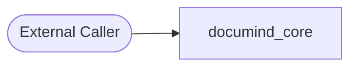
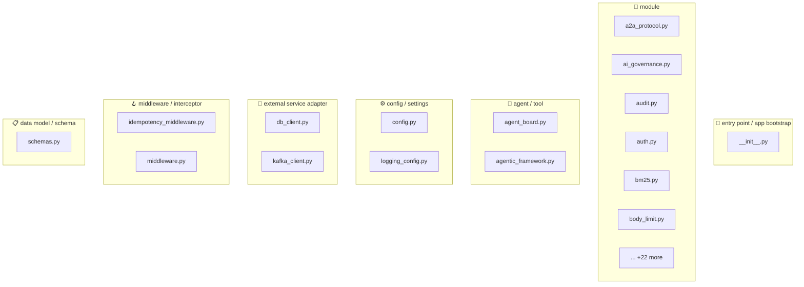
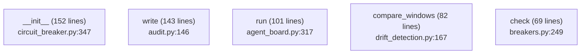
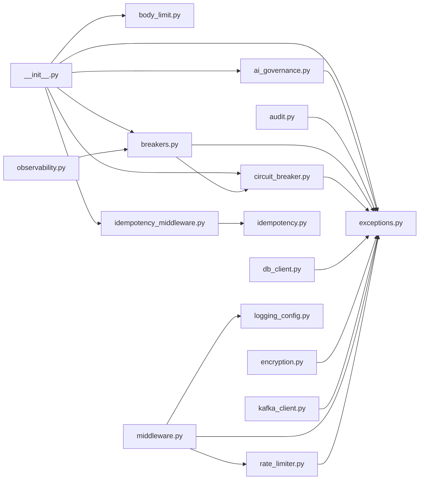
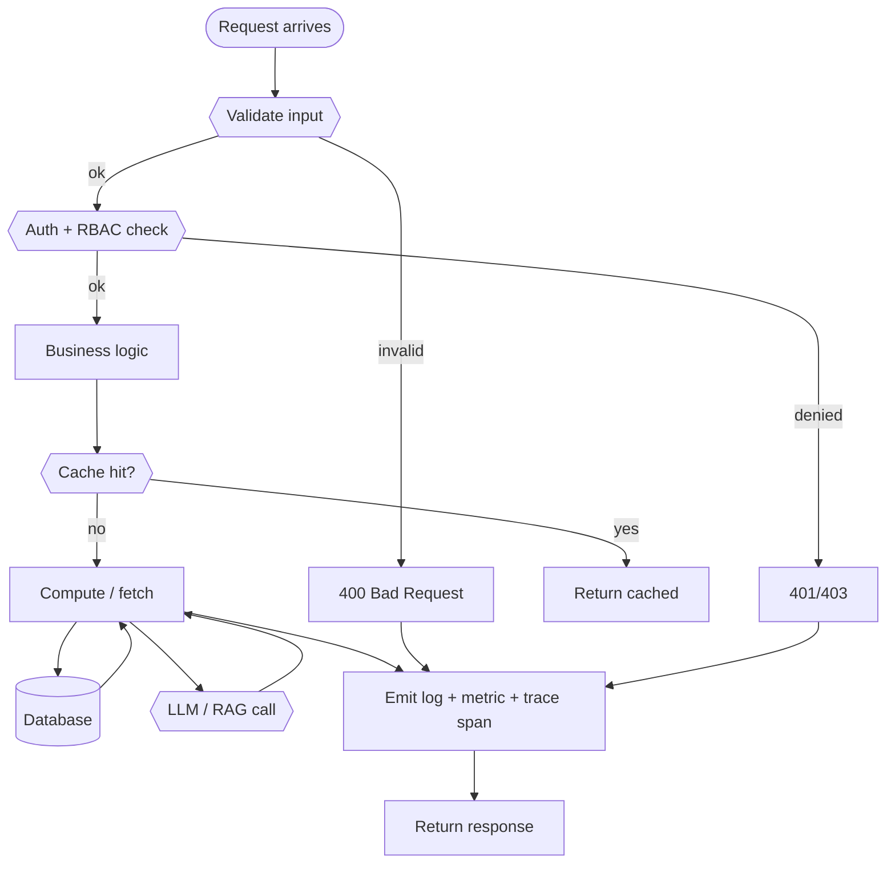

# 📦 `documind_core` — Advanced README

📚 **Library**  ·  **Path:** `libs/py/documind_core`  ·  **Generated:** 2026-05-16 19:57 UTC

> documind_core

This README is **auto-generated** by [`scripts/generate_folder_report.py`](../../scripts/generate_folder_report.py). It explains what this folder does, every file inside it, how the files link to each other, every API endpoint, every database call, every test case, and the production controls (security / reliability / performance / observability). Re-run after major changes.

---

## 🔎 Section 0 — Auto-Detected Facts

| Metric | Value |
|---|---|
| Folder | `libs/py/documind_core` |
| Total files | 39 |
| Python files | 38 |
| TypeScript/JS files | 0 |
| Go files | 0 |
| Shell scripts | 0 |
| Lines of code | 8,527 |
| Python classes | 134 |
| Python functions | 347 |
| Async functions | 50 |
| Total API endpoints | 0 |
| Total DB call sites | 10 |
| DB / Storage libs | Kafka (aiokafka), Neo4j, Redis, asyncpg |
| Concurrency primitives | Lock / RLock, asyncio (async/await), threading |
| Caching primitives | in-memory @lru_cache, redis |
| Input validation | Manual escape, Pydantic BaseModel |
| AI / LLM deps | LangChain, Ollama, Rebuff (PI defense) |
| Test files | 0 |
| Detected test cases | 0 |
| Tests dir present | ❌ — flag |
| Dockerfile | ❌ |
| pyproject.toml | ❌ |
| go.mod | ❌ |
| package.json | ❌ |
| Top git contributors | `45	PraveenAsthana123`, `6	Praveen` |

#### Longest functions (top 5)

| Location | Name | Lines |
|---|---|---|
| `circuit_breaker.py:347` | `__init__` | 152 |
| `audit.py:146` | `write` | 143 |
| `agent_board.py:317` | `run` | 101 |
| `drift_detection.py:167` | `compare_windows` | 82 |
| `breakers.py:249` | `check` | 69 |

#### Smells detected (grep heuristics — verify manually)

| Smell | Count |
|---|---|
| hardcoded localhost URL | 6 |


## 1. Purpose — Business + Technical

### Business problem this folder solves

> _Reviewer to fill: documind_core_

### Technical contract this folder exposes

> _Reviewer to fill: API surface, events emitted, data persisted, downstream consumers._

### Out-of-scope (what this folder does NOT do)

> _Reviewer to fill: explicit non-goals — prevents scope creep at review time._


## 2. File Inventory

Every Python file in this folder, with role / classes / functions / LOC / first docstring line. Full absolute paths listed below the table for easy `cat`-ability.

| Relative path | Role (inferred) | Classes | Functions | LOC | Summary |
|---|---|---|---|---|---|
| `__init__.py` | 🚀 entry point / app bootstrap | 0 | 0 | 134 | documind_core |
| `a2a_protocol.py` | 📄 module | 6 | 3 | 333 | Agent-to-Agent (A2A) protocol — registry + message bus + connector + delegation. |
| `agent_board.py` | 🤖 agent / tool | 5 | 5 | 616 | AgentBoard — multi-agent task / review / advise pattern with bounded |
| `agentic_framework.py` | 🤖 agent / tool | 2 | 2 | 260 | Agentic engineering framework — meta-template for every agent. |
| `ai_governance.py` | 📄 module | 14 | 1 | 700 | AI governance primitives — debuggability, explainability, responsibility, |
| `audit.py` | 📄 module | 2 | 3 | 292 | Tamper-evident audit log (Design Area 27 — Governance). |
| `auth.py` | 📄 module | 2 | 4 | 348 | JWT auth verifier + FastAPI dependency for Python services. |
| `bm25.py` | 📄 module | 2 | 1 | 133 | BM25 lexical retrieval — wraps `rank_bm25` for the hybrid-retrieval |
| `body_limit.py` | 📄 module | 1 | 0 | 58 | Request-body size limit (FastAPI middleware). |
| `breakers.py` | 📄 module | 18 | 1 | 1049 | Specialized circuit breakers (Design Area 4 + Extra-CB, plus AI/RAG-specific). |
| `cache.py` | 📄 module | 1 | 0 | 134 | Cache helpers (Design Areas 40 — Cache Architecture, 41 — Cache Consistency, |
| `chunking.py` | 📄 module | 10 | 1 | 416 | Multi-strategy chunking — Strategy + Factory pattern (§7 of the |
| `circuit_breaker.py` | 📄 module | 6 | 1 | 1072 | Circuit Breaker (Design Area 4 — Failure Boundary, Extra — Circuit Breaker). |
| `citations.py` | 📄 module | 4 | 2 | 202 | Citation linking — claim-to-source provenance (§16.6 + §48 of the |
| `config.py` | ⚙ config / settings | 1 | 1 | 182 | Configuration foundation (Design Areas 6 — Control Plane, 55 — Feature Flags, |
| `db_client.py` | 🔌 external service adapter | 2 | 0 | 149 | PostgreSQL client (Design Areas 5 — Tenant RLS, 12 — Consistency, 46 — DB Strategy). |
| `dispatch_pool.py` | 📄 module | 3 | 0 | 213 | DispatchPool - fanout 100+ tasks with bounded LLM concurrency. |
| `dr_metrics.py` | 📄 module | 1 | 2 | 139 | Disaster Recovery target metrics — single source of truth. |
| `drift_detection.py` | 📄 module | 2 | 3 | 249 | Drift detection — Production Validation §44 maturity item. |
| `embedding_cache.py` | 📄 module | 2 | 2 | 179 | Embedding cache — content-hash → vector with model-version namespacing |
| `encryption.py` | 📄 module | 1 | 1 | 74 | At-rest encryption for secrets stored in the database. |
| `error_tracking.py` | 📄 module | 0 | 5 | 153 | Error-tracking integration — Sentry wrapper. |
| `exceptions.py` | 📄 module | 10 | 0 | 176 | Domain exception hierarchy (Design Area 9 — State Model; cross-cutting). |
| `fusion.py` | 📄 module | 1 | 2 | 145 | Hybrid retrieval fusion — RRF + heap-based top-K (§16.5 of the |
| `governance_os.py` | 📄 module | 8 | 1 | 363 | AI Governance OS — unified policy / decision / risk / compliance / audit surface. |
| `idempotency.py` | 📄 module | 2 | 0 | 65 | HTTP idempotency (Design Area 20). |
| `idempotency_middleware.py` | 🪝 middleware / interceptor | 1 | 0 | 113 | FastAPI middleware for the ``X-Idempotency-Key`` pattern (Design Area 20). |
| `kafka_client.py` | 🔌 external service adapter | 2 | 2 | 335 | Kafka client (Design Areas 17 — Event-Driven, 19 — Compensation, |
| `logging_config.py` | ⚙ config / settings | 0 | 8 | 201 | Structured logging (Design Area 62 — Observability by Design). |
| `middleware.py` | 🪝 middleware / interceptor | 6 | 1 | 391 | FastAPI middleware stack (Design Areas 62 — Observability, 5 — Tenant, |
| `mmr.py` | 📄 module | 0 | 1 | 100 | MMR — Maximal Marginal Relevance (§16.6 post-retrieval diversification). |
| `observability.py` | 📄 module | 0 | 5 | 251 | Observability setup (Design Areas 62 — Observability by Design, 64 — SLO-Driven). |
| `pii.py` | 📄 module | 2 | 1 | 193 | PII detection — multi-pattern Aho-Corasick-style scanner (§16.11 |
| `query_rewriter.py` | 📄 module | 2 | 0 | 133 | Pre-retrieval query processing (§16.4 of the playbook). |
| `rate_limiter.py` | 📄 module | 2 | 2 | 191 | Rate limiting (Design Areas 42 — Tenant-Aware Cache, 45 — Backpressure). |
| `rebuff_detector.py` | 📄 module | 2 | 7 | 272 | Rebuff detector — Stage-1 runtime PI-defense adapter (per §47.6, §48, §56). |
| `schemas.py` | 📋 data model / schema | 4 | 0 | 49 | Shared response schemas (Global CLAUDE.md §6 — API Design Standards). |
| `tokens.py` | 📄 module | 2 | 2 | 99 | Token counting + budget helpers (§16.1 / §16.2 of the playbook). |

### Absolute paths (clickable)

- `/mnt/deepa/rag/libs/py/documind_core/__init__.py`
- `/mnt/deepa/rag/libs/py/documind_core/a2a_protocol.py`
- `/mnt/deepa/rag/libs/py/documind_core/agent_board.py`
- `/mnt/deepa/rag/libs/py/documind_core/agentic_framework.py`
- `/mnt/deepa/rag/libs/py/documind_core/ai_governance.py`
- `/mnt/deepa/rag/libs/py/documind_core/audit.py`
- `/mnt/deepa/rag/libs/py/documind_core/auth.py`
- `/mnt/deepa/rag/libs/py/documind_core/bm25.py`
- `/mnt/deepa/rag/libs/py/documind_core/body_limit.py`
- `/mnt/deepa/rag/libs/py/documind_core/breakers.py`
- `/mnt/deepa/rag/libs/py/documind_core/cache.py`
- `/mnt/deepa/rag/libs/py/documind_core/chunking.py`
- `/mnt/deepa/rag/libs/py/documind_core/circuit_breaker.py`
- `/mnt/deepa/rag/libs/py/documind_core/citations.py`
- `/mnt/deepa/rag/libs/py/documind_core/config.py`
- `/mnt/deepa/rag/libs/py/documind_core/db_client.py`
- `/mnt/deepa/rag/libs/py/documind_core/dispatch_pool.py`
- `/mnt/deepa/rag/libs/py/documind_core/dr_metrics.py`
- `/mnt/deepa/rag/libs/py/documind_core/drift_detection.py`
- `/mnt/deepa/rag/libs/py/documind_core/embedding_cache.py`
- `/mnt/deepa/rag/libs/py/documind_core/encryption.py`
- `/mnt/deepa/rag/libs/py/documind_core/error_tracking.py`
- `/mnt/deepa/rag/libs/py/documind_core/exceptions.py`
- `/mnt/deepa/rag/libs/py/documind_core/fusion.py`
- `/mnt/deepa/rag/libs/py/documind_core/governance_os.py`
- `/mnt/deepa/rag/libs/py/documind_core/idempotency.py`
- `/mnt/deepa/rag/libs/py/documind_core/idempotency_middleware.py`
- `/mnt/deepa/rag/libs/py/documind_core/kafka_client.py`
- `/mnt/deepa/rag/libs/py/documind_core/logging_config.py`
- `/mnt/deepa/rag/libs/py/documind_core/middleware.py`
- `/mnt/deepa/rag/libs/py/documind_core/mmr.py`
- `/mnt/deepa/rag/libs/py/documind_core/observability.py`
- `/mnt/deepa/rag/libs/py/documind_core/pii.py`
- `/mnt/deepa/rag/libs/py/documind_core/query_rewriter.py`
- `/mnt/deepa/rag/libs/py/documind_core/rate_limiter.py`
- `/mnt/deepa/rag/libs/py/documind_core/rebuff_detector.py`
- `/mnt/deepa/rag/libs/py/documind_core/schemas.py`
- `/mnt/deepa/rag/libs/py/documind_core/tokens.py`


## 3. C4 Model — Context / Container / Component / Code

### Level 1 — System Context

_Where does this folder sit in the broader system?_



### Level 2 — Container

_What external dependencies does this folder talk to?_

```mermaid
flowchart TB
    subgraph documind_core
        Code[Source Code]
    end
    Code --> DB_0[("Kafka (aiokafka)")]
    Code --> DB_1[("Neo4j")]
    Code --> DB_2[("Redis")]
    Code --> DB_3[("asyncpg")]
    Code --> AI_0{{LLM: LangChain}}
    Code --> AI_1{{LLM: Ollama}}
    Code --> AI_2{{LLM: Rebuff (PI defense)}}
```

### Level 3 — Component

_Internal files grouped by inferred role._



### Level 4 — Code (top hotspots)

_Longest functions — these are the most likely refactor candidates._




## 4. Code Sequence — How Files Link to Each Other

**Import graph for files in this folder.** Reading order: start at any entry-point file (look for `🚀 entry point` role in the inventory above), then follow the arrows.



### Edge list

| From file | To file | Import-count |
|---|---|---|
| `__init__.py` | `ai_governance.py` | 1 |
| `__init__.py` | `body_limit.py` | 1 |
| `__init__.py` | `breakers.py` | 1 |
| `__init__.py` | `circuit_breaker.py` | 1 |
| `__init__.py` | `exceptions.py` | 1 |
| `__init__.py` | `idempotency_middleware.py` | 1 |
| `ai_governance.py` | `exceptions.py` | 1 |
| `audit.py` | `exceptions.py` | 1 |
| `breakers.py` | `circuit_breaker.py` | 1 |
| `breakers.py` | `exceptions.py` | 1 |
| `circuit_breaker.py` | `exceptions.py` | 1 |
| `db_client.py` | `exceptions.py` | 1 |
| `encryption.py` | `exceptions.py` | 1 |
| `idempotency_middleware.py` | `idempotency.py` | 1 |
| `kafka_client.py` | `exceptions.py` | 1 |
| `middleware.py` | `exceptions.py` | 1 |
| `middleware.py` | `logging_config.py` | 1 |
| `middleware.py` | `rate_limiter.py` | 1 |
| `observability.py` | `breakers.py` | 1 |
| `rate_limiter.py` | `exceptions.py` | 1 |


## 5. Request Flowchart

Generic request lifecycle for this folder. Branches that don't apply are auto-removed based on detected dependencies (DB / cache / LLM).




## 6. API Endpoints — Input / Process / Output

_No HTTP endpoints detected via `@app.*` / `@router.*` decorators._


## 7. Sequence Diagrams per Endpoint

_No endpoints detected; sequence-diagram template intentionally omitted._


## 8. Database Layer

**DB / storage libraries:** Kafka (aiokafka), Neo4j, Redis, asyncpg

**Total DB call sites:** 10

| Pattern | Count |
|---|---|
| `execute` | 2 |
| `fetch/fetchall/fetchrow` | 3 |
| `ORM CRUD` | 5 |

### Query Optimization checklist

| Check | Status (✓/✗/⚠) | Notes |
|---|---|---|
| Indexes on every WHERE / ORDER BY column | — | EXPLAIN ANALYZE hot paths |
| Full table scans avoided | — | — |
| Batch operations used (not N writes in a loop) | — | — |
| Parameterized queries (NEVER f-string SQL) | — | — |

### Transactions (ACID)

| Check | Status (✓/✗/⚠) | Notes |
|---|---|---|
| Transaction boundaries narrow (no HTTP / LLM inside) | — | — |
| Rollback on exception | — | — |
| Isolation level documented (READ COMMITTED / SERIALIZABLE) | — | — |
| Deadlock prevention strategy | — | — |

### N+1 Query Findings (reviewer to fill)

| Endpoint / Function | Suspect Loop | Est. Queries / Request | Fix |
|---|---|---|---|
| — | — | — | — |


## 9. Code Quality + Complexity

### Readability

| Check | Status (✓/✗/⚠) | Notes |
|---|---|---|
| Clear variable / function / class names | — | — |
| No misleading naming (no `tmp` / `xyz` / `foo`) | — | — |
| Small focused functions (≤ 50 lines) | — | 5 > 50 lines (see Section 0) |
| Avoid deeply nested conditions (≤ 4 levels) | — | — |

### Clean code

| Check | Status (✓/✗/⚠) | Notes |
|---|---|---|
| No dead / commented-out code | — | — |
| No `print()` — use logger | — | — |
| No hardcoded values | — | smell count: 6 |
| Constants extracted to a settings module | — | — |

### Complexity

| Check | Status (✓/✗/⚠) | Notes |
|---|---|---|
| Long methods broken down | — | — |
| No overengineering (premature abstractions) | — | — |
| Cyclomatic complexity ≤ 15 per function | — | run `ruff complexity` or `radon` |


## 10. Security Review

### Authentication & Authorization

| Check | Status (✓/✗/⚠) | Notes |
|---|---|---|
| Authentication implemented correctly | — | Bearer / JWT / session |
| Authorization (RBAC / ABAC) checks | — | no client-side trust |
| Tokens validated server-side every request | — | rotate, expire, revoke |

### OWASP Top 10

| Check | Status (✓/✗/⚠) | Notes |
|---|---|---|
| Request validation present | — | sanitization: Manual escape, Pydantic BaseModel |
| SQL injection prevention | — | DB libs: Kafka (aiokafka), Neo4j, Redis, asyncpg — parameterized queries only |
| XSS / CSRF prevention | — | output encoding / CSP / SameSite |
| Path traversal prevention | — | no user input concatenated to file paths |
| Prompt injection prevention | — | Rebuff / output filter |

### Secret Management

| Check | Status (✓/✗/⚠) | Notes |
|---|---|---|
| No secrets in code | — | smell count: 0 password literals, 0 api key literals |
| Env vars / Vault used | — | Pydantic BaseSettings or env reader |
| Secret rotation strategy | — | documented in runbook |

### Sensitive Data

| Check | Status (✓/✗/⚠) | Notes |
|---|---|---|
| PII masked in logs | — | structured logger with field redaction |
| Encryption in transit (TLS) | — | — |
| Encryption at rest (DB / object store) | — | — |
| GDPR — retention + right-to-be-forgotten | — | — |


## 11. Performance Review

### Memory

| Check | Status (✓/✗/⚠) | Notes |
|---|---|---|
| Large object retention avoided | — | — |
| Streaming for large files / data | — | — |
| Caches bounded (LRU / TTL) | — | caching: in-memory @lru_cache, redis |

### Concurrency

| Check | Status (✓/✗/⚠) | Notes |
|---|---|---|
| Thread safety validated | — | primitives: Lock / RLock, asyncio (async/await), threading |
| Race conditions prevented | — | — |
| Deadlocks avoided (lock ordering) | — | — |
| Parallel processing where beneficial | — | 50 async fns |

### Latency

| Check | Status (✓/✗/⚠) | Notes |
|---|---|---|
| External API calls batched / cached | — | — |
| Timeouts on every external call | — | — |
| No blocking I/O inside async functions | — | — |


## 12. Reliability & Observability

### Failure Handling

| Check | Status (✓/✗/⚠) | Notes |
|---|---|---|
| Retry (bounded + exp backoff + jitter) | — | — |
| Circuit breaker around external deps | — | — |
| Graceful degradation | — | — |

### Timeout Handling

| Check | Status (✓/✗/⚠) | Notes |
|---|---|---|
| Timeout on every external call (HTTP / DB / subprocess) | — | — |
| No infinite waits | — | — |

### Observability

| Check | Status (✓/✗/⚠) | Notes |
|---|---|---|
| Structured (JSON) logging | — | correlation_id + tenant_id + request_id |
| Metrics (RED: rate / errors / duration) | — | — |
| Tracing (OpenTelemetry → Jaeger / Tempo) | — | — |
| Baggage propagation across services | — | — |


## 13. Test Cases

**Test files detected:** 0
_No `test_*` functions parsed via AST. Either tests live elsewhere or names don't match the `test_*` convention._


## 14. Logging & Monitoring

### Logging

| Check | Status (✓/✗/⚠) | Notes |
|---|---|---|
| Structured (JSON) logs | — | — |
| Correlation ID present | — | — |
| No PII / secrets in log lines | — | — |
| No excessive logging (no logs in hot loops) | — | — |

### Monitoring

| Check | Status (✓/✗/⚠) | Notes |
|---|---|---|
| Alerts defined (SLO-burn aware) | — | — |
| Dashboards exist (Grafana) | — | — |
| On-call playbook references | — | — |


## 15. LLM / GenAI / RAG

**Detected AI deps:** LangChain, Ollama, Rebuff (PI defense)

### Prompt Safety

| Check | Status (✓/✗/⚠) | Notes |
|---|---|---|
| Prompt injection handling (input filter) | — | Rebuff |
| Output sanitization | — | — |
| Prompt versioning in registry | — | — |
| Toxicity / bias filtering | — | — |

### RAG Quality

| Check | Status (✓/✗/⚠) | Notes |
|---|---|---|
| Chunking strategy validated (size + overlap) | — | — |
| Embedding model versioned (re-embed on bump) | — | — |
| Vector DB query optimized (recall@k measured) | — | — |
| Metadata filtering exists (per-tenant) | — | — |

### Cost

| Check | Status (✓/✗/⚠) | Notes |
|---|---|---|
| Model fallback strategy defined | — | — |
| Token usage minimized (cache / truncation) | — | — |
| Per-tenant cost ceiling enforced | — | — |

### Explainability / Responsible AI

| Check | Status (✓/✗/⚠) | Notes |
|---|---|---|
| Citation / source grounding (every claim cited) | — | — |
| Confidence scoring (Ragas / DeepEval) | — | — |
| Decision audit row per prediction (§48) | — | — |
| Fairness / bias checks | — | — |


## 16. SOLID + Microservice Principles

### SOLID

| Check | Status (✓/✗/⚠) | Notes |
|---|---|---|
| S — Single Responsibility (one reason to change per class) | — | — |
| O — Open/Closed (extend via composition, not modification) | — | — |
| L — Liskov Substitution (subclasses honor contracts) | — | — |
| I — Interface Segregation (no fat interfaces) | — | — |
| D — Dependency Inversion (depend on abstractions) | — | — |

### Microservice

| Check | Status (✓/✗/⚠) | Notes |
|---|---|---|
| Single business capability | — | — |
| Bounded context (no domain bleed) | — | — |
| Independent deploy (no coupled releases) | — | — |
| Resilience patterns (CB / retry / bulkhead) | — | — |


## 17. Integration with Other Folders

### Internal — other folders in this repo

| Folder / Module | Import-count | Purpose |
|---|---|---|
| _(none)_ | — | — |

### External — third-party packages

| Package | Import-count |
|---|---|
| `opentelemetry` | 23 |
| `exceptions` | 10 |
| `fastapi` | 8 |
| `prometheus_client` | 7 |
| `starlette` | 7 |
| `pydantic` | 4 |
| `redis` | 4 |
| `sentry_sdk` | 3 |
| `structlog` | 3 |
| `rebuff` | 3 |
| `breakers` | 2 |
| `circuit_breaker` | 2 |
| `ai_governance` | 1 |
| `body_limit` | 1 |
| `idempotency_middleware` | 1 |
| `jwt` | 1 |
| `rank_bm25` | 1 |
| `httpx` | 1 |
| `pydantic_settings` | 1 |
| `asyncpg` | 1 |


## 18. Debugging Guide

### Step-by-step when something breaks

```
1. Tail logs:        tail -50 /tmp/documind_core.log   (if host-side)
                     docker logs documind-documind_core --tail=50   (if container)
2. Health probe:     curl http://localhost:<PORT>/health
3. Fleet probe:      python3 scripts/advanced_healthcheck.py --layer app
4. Trace:            Open Jaeger → search request_id → see span tree
5. Metrics:          Open Grafana → service dashboard → look for spike
6. Drill:            ls mcp/tests/drill_*documind_core*.py and run
```

### Common failure modes

| Symptom | Likely cause | Fix |
|---|---|---|
| 502 / connection refused | service down | check `circuitrag-status.sh` |
| Slow p95 latency | DB N+1 or LLM throttle | Section 8 + Section 15 |
| 5xx spike | downstream dep down | check `/health/upstreams` |
| Memory growth | unbounded cache or closure leak | Section 11 |
| Wrong-tenant data | RLS bypass | tenant isolation drill |


## 19. Production Gates (hard pass/fail)

| Gate | Target | Status | Evidence |
|---|---|---|---|
| Code coverage ≥ 80% | statements + branches | — | — |
| Naming convention enforced | ruff / eslint | — | — |
| Zero critical CVEs | Trivy / Bandit | — | — |
| No hardcoded secrets | gitleaks | — | — |
| No memory leaks | bounded caches | — | smells: 6 |
| No N+1 queries | hot paths reviewed | — | 10 DB call sites |
| All APIs validated | Pydantic / Zod | — | sanitization: Manual escape, Pydantic BaseModel |
| Duplicate logic eliminated | DRY check | — | — |
| Structured logging with correlation_id | — | — | — |
| Distributed tracing wired | OpenTelemetry | — | — |
| For AI: prompt injection tested | Rebuff / Garak | — | AI deps present |
| For AI: hallucination scoring ≥ 0.85 | Ragas faithfulness | — | n/a |


## 20. Final Production Readiness Score

| Area | Score (/10) |
|---|---|
| Architecture | — |
| Security | — |
| Performance | — |
| Reliability | — |
| Observability | — |
| Testing | — |
| Scalability | — |
| AI Safety | — |
| DevOps | — |
| Maintainability | — |
| **Total** | **— / 100** |

### Decision

- [ ] **GO** — Production-ready (≥80, no failed gates)
- [ ] **CONDITIONAL GO** — Ship with documented follow-ups (≥60)
- [ ] **NO-GO** — Block release (any critical-red gate, or <60)

### Critical blockers

1. _TBD_

### Follow-ups (post-ship)

| ID | Description | Owner | Due |
|---|---|---|---|
| — | — | — | — |

### Sign-off

| Role | Name | Date | Signature |
|---|---|---|---|
| Tech Lead | — | — | — |
| Security | — | — | — |
| SRE | — | — | — |

---

_Generated by `scripts/generate_folder_report.py`. Re-run after major folder changes:_
_`python3 scripts/generate_folder_report.py --folder <this-folder> --force`_
