# 📦 `tests` — Advanced README

📚 **Library**  ·  **Path:** `libs/py/tests`  ·  **Generated:** 2026-05-16 19:57 UTC

> _Purpose not detected from docstrings — reviewer to fill._

This README is **auto-generated** by [`scripts/generate_folder_report.py`](../../scripts/generate_folder_report.py). It explains what this folder does, every file inside it, how the files link to each other, every API endpoint, every database call, every test case, and the production controls (security / reliability / performance / observability). Re-run after major changes.

---

## 🔎 Section 0 — Auto-Detected Facts

| Metric | Value |
|---|---|
| Folder | `libs/py/tests` |
| Total files | 28 |
| Python files | 27 |
| TypeScript/JS files | 0 |
| Go files | 0 |
| Shell scripts | 0 |
| Lines of code | 3,722 |
| Python classes | 122 |
| Python functions | 467 |
| Async functions | 100 |
| Total API endpoints | 6 |
| Total DB call sites | 9 |
| DB / Storage libs | Kafka (aiokafka), Redis, asyncpg |
| Concurrency primitives | asyncio (async/await) |
| Caching primitives | redis |
| Input validation | _(NONE — flag risk)_ |
| AI / LLM deps | _(none)_ |
| Test files | 26 |
| Detected test cases | 420 |
| Tests dir present | ❌ — flag |
| Dockerfile | ❌ |
| pyproject.toml | ❌ |
| go.mod | ❌ |
| package.json | ❌ |
| Top git contributors | `14	PraveenAsthana123`, `4	Praveen` |

#### Longest functions (top 5)

| Location | Name | Lines |
|---|---|---|
| `test_rls_isolation.py:47` | `test_cross_tenant_read_is_empty` | 68 |
| `test_idempotency_middleware.py:39` | `app_factory` | 43 |
| `test_idempotency_middleware.py:42` | `_make` | 38 |
| `test_db_client.py:91` | `test_sets_current_tenant_via_set_config` | 28 |
| `test_audit.py:249` | `test_hash_chain_matches_compute_function` | 28 |

#### Smells detected (grep heuristics — verify manually)

| Smell | Count |
|---|---|
| hardcoded localhost URL | 2 |


## 1. Purpose — Business + Technical

### Business problem this folder solves

> _Reviewer to fill: one paragraph describing the business need_

### Technical contract this folder exposes

> _Reviewer to fill: API surface, events emitted, data persisted, downstream consumers._

### Out-of-scope (what this folder does NOT do)

> _Reviewer to fill: explicit non-goals — prevents scope creep at review time._


## 2. File Inventory

Every Python file in this folder, with role / classes / functions / LOC / first docstring line. Full absolute paths listed below the table for easy `cat`-ability.

| Relative path | Role (inferred) | Classes | Functions | LOC | Summary |
|---|---|---|---|---|---|
| `conftest.py` | 📄 module | 0 | 1 | 21 | pytest config for documind_core unit tests. |
| `test_ai_governance.py` | 🧪 test | 0 | 33 | 370 | Unit tests for the AI-governance primitives. |
| `test_audit.py` | 🧪 test | 4 | 2 | 277 | Tests for documind_core.audit — tamper-evident audit-log writer. |
| `test_bm25.py` | 🧪 test | 4 | 0 | 121 | Tests for documind_core.bm25 — BM25 lexical retrieval wrapper. |
| `test_body_limit.py` | 🧪 test | 2 | 1 | 112 | Tests for documind_core.body_limit — request-body size cap middleware. |
| `test_breakers.py` | 🧪 test | 0 | 20 | 268 | Unit tests for the 5 specialized circuit breakers. |
| `test_cache.py` | 🧪 test | 6 | 1 | 277 | Tests for documind_core.cache — tenant-aware Redis cache helper. |
| `test_chunking.py` | 🧪 test | 10 | 0 | 282 | Tests for documind_core.chunking — Strategy + Factory pattern, 7 |
| `test_citations.py` | 🧪 test | 5 | 1 | 187 | Tests for documind_core.citations — claim-to-source linker. |
| `test_config.py` | ⚙ config / settings | 5 | 1 | 135 | Tests for documind_core.config — Pydantic Settings foundation. |
| `test_db_client.py` | 🔌 external service adapter | 4 | 0 | 166 | Tests for documind_core.db_client — asyncpg pool + tenant RLS context. |
| `test_dispatch_pool.py` | 🧪 test | 3 | 0 | 135 | Tests for documind_core.dispatch_pool — bounded-concurrency task pool. |
| `test_embedding_cache.py` | 🧪 test | 8 | 1 | 218 | Tests for documind_core.embedding_cache. |
| `test_encryption.py` | 🧪 test | 4 | 2 | 139 | Tests for documind_core.encryption — Fernet wrapper + sentinel prefix. |
| `test_error_tracking.py` | 🧪 test | 5 | 1 | 141 | Tests for documind_core.error_tracking — Sentry init wrapper. |
| `test_exceptions.py` | 🧪 test | 4 | 0 | 122 | Tests for documind_core.exceptions — domain exception hierarchy. |
| `test_fusion.py` | 🧪 test | 5 | 0 | 148 | Tests for documind_core.fusion — RRF + heap top-K. |
| `test_idempotency.py` | 🧪 test | 4 | 1 | 122 | Tests for documind_core.idempotency — Redis-backed X-Idempotency-Key cache. |
| `test_idempotency_middleware.py` | 🪝 middleware / interceptor | 5 | 2 | 196 | Tests for documind_core.idempotency_middleware. |
| `test_logging_config.py` | ⚙ config / settings | 7 | 0 | 215 | Tests for documind_core.logging_config — JSON structured logging. |
| `test_mmr.py` | 🧪 test | 3 | 0 | 108 | Tests for documind_core.mmr — Maximal Marginal Relevance. |
| `test_pii.py` | 🧪 test | 11 | 0 | 206 | Tests for documind_core.pii — multi-pattern PII scanner. |
| `test_query_rewriter.py` | 🧪 test | 5 | 0 | 129 | Tests for documind_core.query_rewriter — pre-retrieval query |
| `test_rate_limiter.py` | 🧪 test | 6 | 1 | 233 | Tests for documind_core.rate_limiter — sliding-window Redis limiter. |
| `test_rls_isolation.py` | 🧪 test | 0 | 2 | 115 | Cross-tenant RLS isolation test (Design Area 5 — most important security test). |
| `test_schemas.py` | 📋 data model / schema | 4 | 0 | 99 | Tests for documind_core.schemas — shared API response envelopes. |
| `test_tokens.py` | 🧪 test | 3 | 0 | 123 | Tests for documind_core.tokens — token counting + budget packing. |

### Absolute paths (clickable)

- `/mnt/deepa/rag/libs/py/tests/conftest.py`
- `/mnt/deepa/rag/libs/py/tests/test_ai_governance.py`
- `/mnt/deepa/rag/libs/py/tests/test_audit.py`
- `/mnt/deepa/rag/libs/py/tests/test_bm25.py`
- `/mnt/deepa/rag/libs/py/tests/test_body_limit.py`
- `/mnt/deepa/rag/libs/py/tests/test_breakers.py`
- `/mnt/deepa/rag/libs/py/tests/test_cache.py`
- `/mnt/deepa/rag/libs/py/tests/test_chunking.py`
- `/mnt/deepa/rag/libs/py/tests/test_citations.py`
- `/mnt/deepa/rag/libs/py/tests/test_config.py`
- `/mnt/deepa/rag/libs/py/tests/test_db_client.py`
- `/mnt/deepa/rag/libs/py/tests/test_dispatch_pool.py`
- `/mnt/deepa/rag/libs/py/tests/test_embedding_cache.py`
- `/mnt/deepa/rag/libs/py/tests/test_encryption.py`
- `/mnt/deepa/rag/libs/py/tests/test_error_tracking.py`
- `/mnt/deepa/rag/libs/py/tests/test_exceptions.py`
- `/mnt/deepa/rag/libs/py/tests/test_fusion.py`
- `/mnt/deepa/rag/libs/py/tests/test_idempotency.py`
- `/mnt/deepa/rag/libs/py/tests/test_idempotency_middleware.py`
- `/mnt/deepa/rag/libs/py/tests/test_logging_config.py`
- `/mnt/deepa/rag/libs/py/tests/test_mmr.py`
- `/mnt/deepa/rag/libs/py/tests/test_pii.py`
- `/mnt/deepa/rag/libs/py/tests/test_query_rewriter.py`
- `/mnt/deepa/rag/libs/py/tests/test_rate_limiter.py`
- `/mnt/deepa/rag/libs/py/tests/test_rls_isolation.py`
- `/mnt/deepa/rag/libs/py/tests/test_schemas.py`
- `/mnt/deepa/rag/libs/py/tests/test_tokens.py`


## 3. C4 Model — Context / Container / Component / Code

### Level 1 — System Context

_Where does this folder sit in the broader system?_

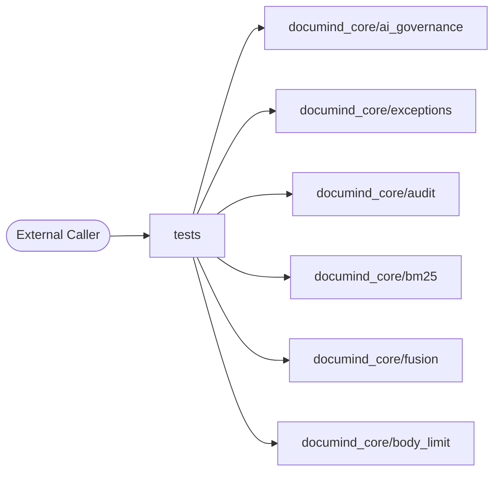

### Level 2 — Container

_What external dependencies does this folder talk to?_

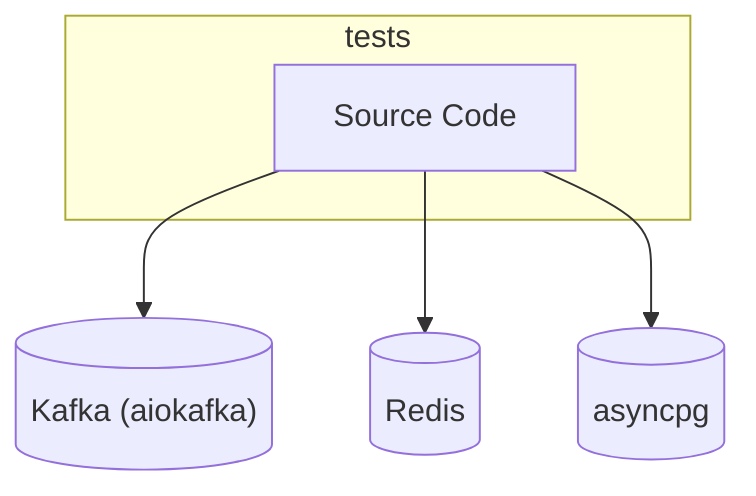

### Level 3 — Component

_Internal files grouped by inferred role._

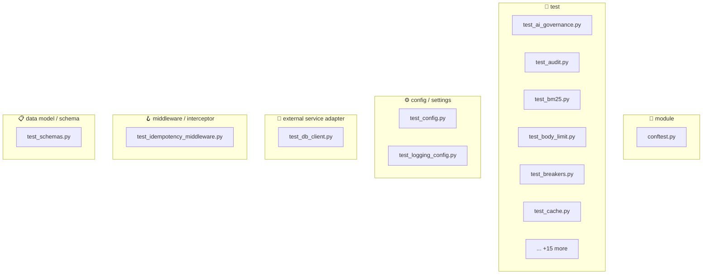

### Level 4 — Code (top hotspots)

_Longest functions — these are the most likely refactor candidates._

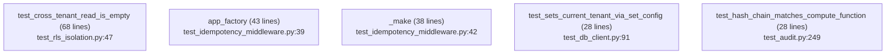


## 4. Code Sequence — How Files Link to Each Other

**Import graph for files in this folder.** Reading order: start at any entry-point file (look for `🚀 entry point` role in the inventory above), then follow the arrows.

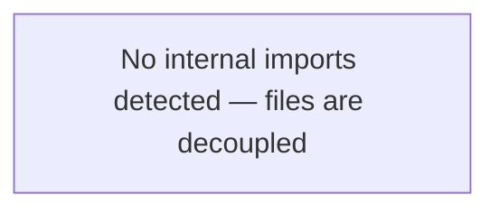

### Edge list

_No internal imports detected._


## 5. Request Flowchart

Generic request lifecycle for this folder. Branches that don't apply are auto-removed based on detected dependencies (DB / cache / LLM).

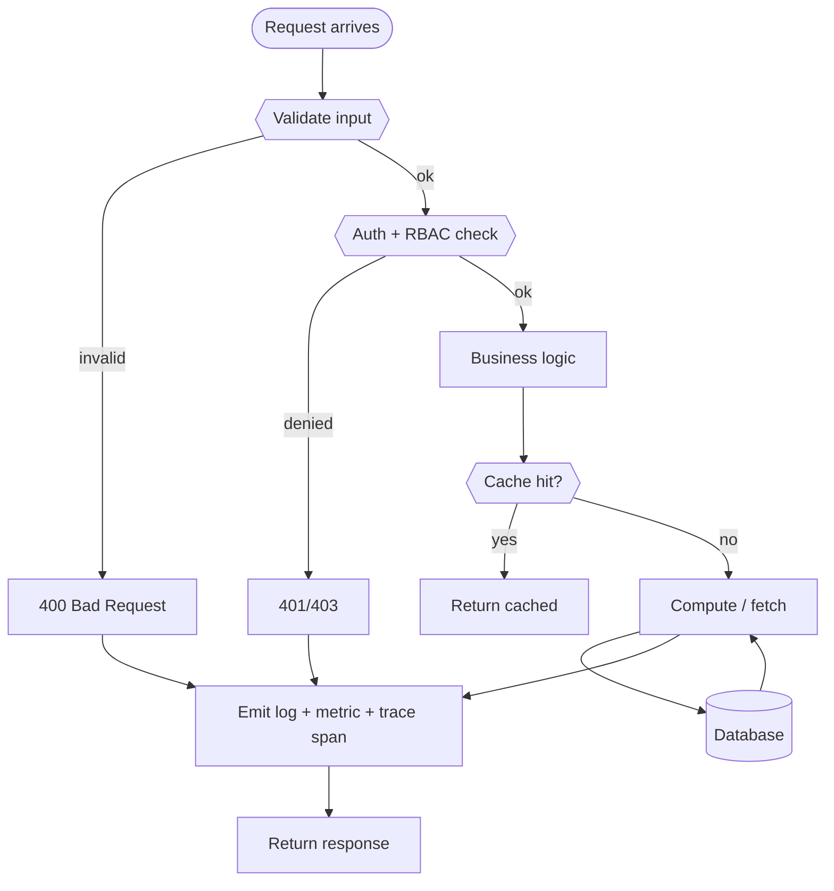


## 6. API Endpoints — Input / Process / Output

**Detected endpoints:** 6

| Method | Route | Defined in | Input (schema) | Process (summary) | Output (schema) |
|---|---|---|---|---|---|
| `POST` | `/api/x` | `test_body_limit.py:32` | _TBD_ | _TBD_ | _TBD_ |
| `POST` | `/upload/x` | `test_body_limit.py:36` | _TBD_ | _TBD_ | _TBD_ |
| `POST` | `/api/charge` | `test_idempotency_middleware.py:59` | _TBD_ | _TBD_ | _TBD_ |
| `POST` | `/api/fail` | `test_idempotency_middleware.py:64` | _TBD_ | _TBD_ | _TBD_ |
| `POST` | `/api/validate-error` | `test_idempotency_middleware.py:69` | _TBD_ | _TBD_ | _TBD_ |
| `GET` | `/api/read` | `test_idempotency_middleware.py:74` | _TBD_ | _TBD_ | _TBD_ |

_Reviewer fills the last three columns from the Pydantic models in the handler. Auto-extraction of Pydantic schemas is on the roadmap._


## 7. Sequence Diagrams per Endpoint

### Generic flow (all endpoints)

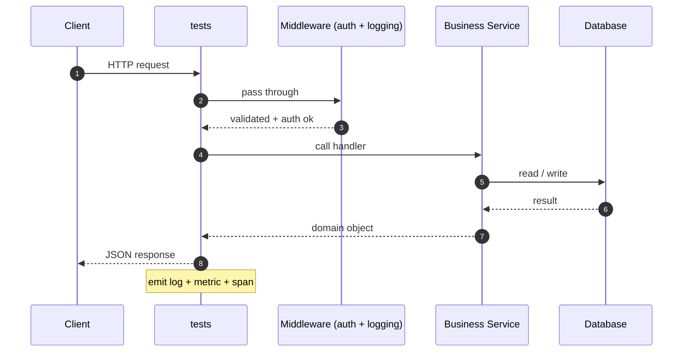

### Per-endpoint sequence stubs (top 5)

### `POST /api/x` (test_body_limit.py:32)


### `POST /upload/x` (test_body_limit.py:36)

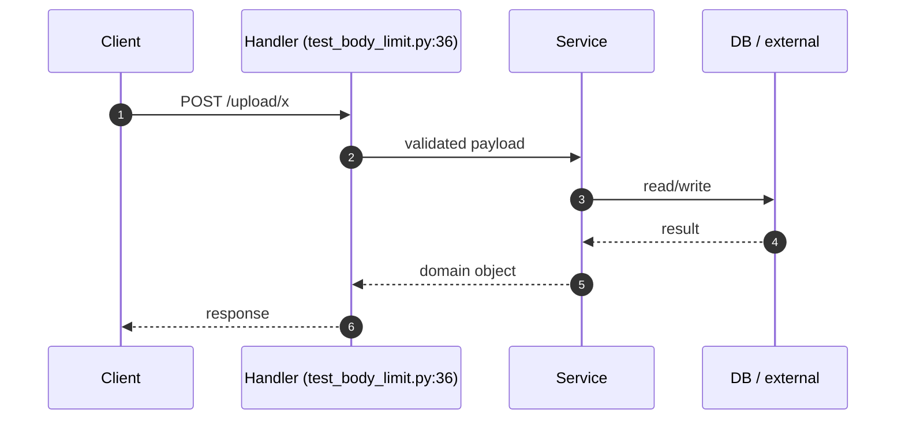

### `POST /api/charge` (test_idempotency_middleware.py:59)

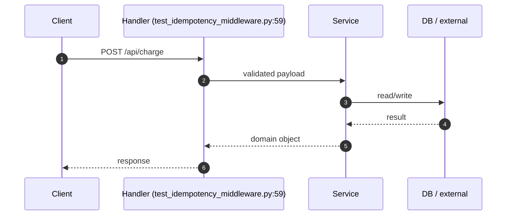

### `POST /api/fail` (test_idempotency_middleware.py:64)

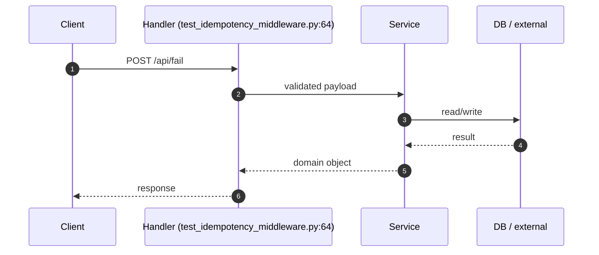

### `POST /api/validate-error` (test_idempotency_middleware.py:69)

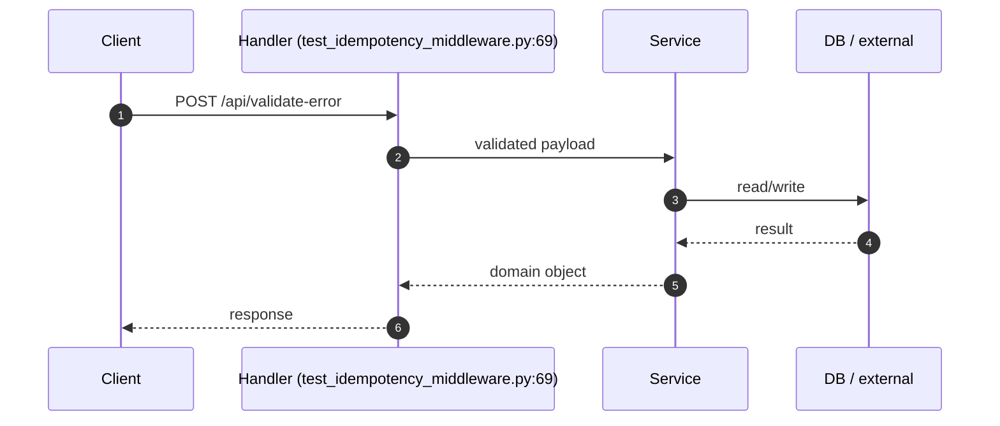

_(+1 more endpoints — diagrams omitted for brevity.)_


## 8. Database Layer

**DB / storage libraries:** Kafka (aiokafka), Redis, asyncpg

**Total DB call sites:** 9

| Pattern | Count |
|---|---|
| `execute` | 5 |
| `fetch/fetchall/fetchrow` | 2 |
| `ORM CRUD` | 2 |

### Query Optimization checklist

| Check | Status (✓/✗/⚠) | Notes |
|---|---|---|
| Indexes on every WHERE / ORDER BY column | — | EXPLAIN ANALYZE hot paths |
| Full table scans avoided | — | — |
| Batch operations used (not N writes in a loop) | — | — |
| Parameterized queries (NEVER f-string SQL) | — | — |

### Transactions (ACID)

| Check | Status (✓/✗/⚠) | Notes |
|---|---|---|
| Transaction boundaries narrow (no HTTP / LLM inside) | — | — |
| Rollback on exception | — | — |
| Isolation level documented (READ COMMITTED / SERIALIZABLE) | — | — |
| Deadlock prevention strategy | — | — |

### N+1 Query Findings (reviewer to fill)

| Endpoint / Function | Suspect Loop | Est. Queries / Request | Fix |
|---|---|---|---|
| — | — | — | — |


## 9. Code Quality + Complexity

### Readability

| Check | Status (✓/✗/⚠) | Notes |
|---|---|---|
| Clear variable / function / class names | — | — |
| No misleading naming (no `tmp` / `xyz` / `foo`) | — | — |
| Small focused functions (≤ 50 lines) | — | 1 > 50 lines (see Section 0) |
| Avoid deeply nested conditions (≤ 4 levels) | — | — |

### Clean code

| Check | Status (✓/✗/⚠) | Notes |
|---|---|---|
| No dead / commented-out code | — | — |
| No `print()` — use logger | — | — |
| No hardcoded values | — | smell count: 2 |
| Constants extracted to a settings module | — | — |

### Complexity

| Check | Status (✓/✗/⚠) | Notes |
|---|---|---|
| Long methods broken down | — | — |
| No overengineering (premature abstractions) | — | — |
| Cyclomatic complexity ≤ 15 per function | — | run `ruff complexity` or `radon` |


## 10. Security Review

### Authentication & Authorization

| Check | Status (✓/✗/⚠) | Notes |
|---|---|---|
| Authentication implemented correctly | — | Bearer / JWT / session |
| Authorization (RBAC / ABAC) checks | — | no client-side trust |
| Tokens validated server-side every request | — | rotate, expire, revoke |

### OWASP Top 10

| Check | Status (✓/✗/⚠) | Notes |
|---|---|---|
| Request validation present | — | sanitization: NONE |
| SQL injection prevention | — | DB libs: Kafka (aiokafka), Redis, asyncpg — parameterized queries only |
| XSS / CSRF prevention | — | output encoding / CSP / SameSite |
| Path traversal prevention | — | no user input concatenated to file paths |
| Prompt injection prevention | — | n/a — no AI deps |

### Secret Management

| Check | Status (✓/✗/⚠) | Notes |
|---|---|---|
| No secrets in code | — | smell count: 0 password literals, 0 api key literals |
| Env vars / Vault used | — | Pydantic BaseSettings or env reader |
| Secret rotation strategy | — | documented in runbook |

### Sensitive Data

| Check | Status (✓/✗/⚠) | Notes |
|---|---|---|
| PII masked in logs | — | structured logger with field redaction |
| Encryption in transit (TLS) | — | — |
| Encryption at rest (DB / object store) | — | — |
| GDPR — retention + right-to-be-forgotten | — | — |


## 11. Performance Review

### Memory

| Check | Status (✓/✗/⚠) | Notes |
|---|---|---|
| Large object retention avoided | — | — |
| Streaming for large files / data | — | — |
| Caches bounded (LRU / TTL) | — | caching: redis |

### Concurrency

| Check | Status (✓/✗/⚠) | Notes |
|---|---|---|
| Thread safety validated | — | primitives: asyncio (async/await) |
| Race conditions prevented | — | — |
| Deadlocks avoided (lock ordering) | — | — |
| Parallel processing where beneficial | — | 100 async fns |

### Latency

| Check | Status (✓/✗/⚠) | Notes |
|---|---|---|
| External API calls batched / cached | — | — |
| Timeouts on every external call | — | — |
| No blocking I/O inside async functions | — | — |


## 12. Reliability & Observability

### Failure Handling

| Check | Status (✓/✗/⚠) | Notes |
|---|---|---|
| Retry (bounded + exp backoff + jitter) | — | — |
| Circuit breaker around external deps | — | — |
| Graceful degradation | — | — |

### Timeout Handling

| Check | Status (✓/✗/⚠) | Notes |
|---|---|---|
| Timeout on every external call (HTTP / DB / subprocess) | — | — |
| No infinite waits | — | — |

### Observability

| Check | Status (✓/✗/⚠) | Notes |
|---|---|---|
| Structured (JSON) logging | — | correlation_id + tenant_id + request_id |
| Metrics (RED: rate / errors / duration) | — | — |
| Tracing (OpenTelemetry → Jaeger / Tempo) | — | — |
| Baggage propagation across services | — | — |


## 13. Test Cases

**Test files detected:** 26
**Test functions parsed:** 420

| Test name | Location | Purpose (from docstring) |
|---|---|---|
| `test_injection_blocks_ignore_previous` | `test_ai_governance.py:23` | _(no docstring)_ |
| `test_injection_blocks_delimiter_spoof` | `test_ai_governance.py:29` | _(no docstring)_ |
| `test_injection_ok_benign` | `test_ai_governance.py:35` | _(no docstring)_ |
| `test_injection_raises_on_block` | `test_ai_governance.py:41` | _(no docstring)_ |
| `test_pii_detects_ssn_and_email` | `test_ai_governance.py:52` | _(no docstring)_ |
| `test_pii_redact_replaces_inline` | `test_ai_governance.py:61` | _(no docstring)_ |
| `test_pii_clean_text_no_findings` | `test_ai_governance.py:69` | _(no docstring)_ |
| `test_adversarial_too_long_rejected` | `test_ai_governance.py:79` | _(no docstring)_ |
| `test_adversarial_repeat_run_detected` | `test_ai_governance.py:85` | _(no docstring)_ |
| `test_adversarial_benign_passes` | `test_ai_governance.py:91` | _(no docstring)_ |
| `test_responsible_flags_protected_class_generalization` | `test_ai_governance.py:101` | _(no docstring)_ |
| `test_responsible_flags_absolute_without_citation` | `test_ai_governance.py:111` | _(no docstring)_ |
| `test_responsible_flags_missing_ai_disclosure` | `test_ai_governance.py:121` | _(no docstring)_ |
| `test_responsible_clean_response_no_flags` | `test_ai_governance.py:131` | _(no docstring)_ |
| `test_explainer_builds_narrative_with_chunks` | `test_ai_governance.py:146` | _(no docstring)_ |
| `test_explainer_empty_retrieval_warns_in_narrative` | `test_ai_governance.py:174` | _(no docstring)_ |
| `test_trace_records_step_with_timing` | `test_ai_governance.py:195` | _(no docstring)_ |
| `test_injection_scan_empty_text_returns_empty` | `test_ai_governance.py:214` | _(no docstring)_ |
| `test_injection_scan_no_match_returns_empty_list` | `test_ai_governance.py:219` | _(no docstring)_ |
| `test_pii_scan_empty_text_returns_empty` | `test_ai_governance.py:225` | _(no docstring)_ |
| `test_pii_scan_caps_at_20_findings` | `test_ai_governance.py:229` | _(no docstring)_ |
| `test_pii_redact_empty_returns_empty` | `test_ai_governance.py:240` | _(no docstring)_ |
| `test_pii_redact_value_handles_str` | `test_ai_governance.py:245` | _(no docstring)_ |
| `test_pii_redact_value_handles_dict` | `test_ai_governance.py:251` | _(no docstring)_ |
| `test_pii_redact_value_handles_list` | `test_ai_governance.py:258` | _(no docstring)_ |
| `test_pii_redact_value_handles_tuple` | `test_ai_governance.py:265` | _(no docstring)_ |
| `test_pii_redact_value_passes_through_numbers_and_none` | `test_ai_governance.py:273` | _(no docstring)_ |
| `test_pii_redact_value_handles_nested` | `test_ai_governance.py:281` | _(no docstring)_ |
| `test_explainer_guardrail_violations_appear_in_narrative` | `test_ai_governance.py:295` | _(no docstring)_ |
| `test_adversarial_too_many_urls_flagged` | `test_ai_governance.py:329` | _(no docstring)_ |
| `test_adversarial_non_printable_ratio_flagged` | `test_ai_governance.py:337` | _(no docstring)_ |
| `test_trace_steps_property_returns_copy` | `test_ai_governance.py:351` | _(no docstring)_ |
| `test_injection_scan_or_raise_passes_when_no_block` | `test_ai_governance.py:365` | _(no docstring)_ |
| `test_strips_error_suffix` | `test_audit.py:40` | _(no docstring)_ |
| `test_keeps_name_without_error_suffix` | `test_audit.py:43` | _(no docstring)_ |
| `test_only_error_class` | `test_audit.py:49` | _(no docstring)_ |
| `test_stable_across_key_order` | `test_audit.py:62` | _(no docstring)_ |
| `test_handles_datetime_via_default_str` | `test_audit.py:69` | _(no docstring)_ |
| `test_deterministic` | `test_audit.py:80` | _(no docstring)_ |
| `test_changes_with_each_field` | `test_audit.py:92` | _(no docstring)_ |
| `test_hash_is_sha256_hex` | `test_audit.py:118` | _(no docstring)_ |
| `test_resource_type_none_treated_as_empty` | `test_audit.py:132` | _(no docstring)_ |
| `test_first_row_seeds_chain_with_empty_prev` | `test_audit.py:181` | _(no docstring)_ |
| `test_subsequent_row_chains_off_previous` | `test_audit.py:193` | _(no docstring)_ |
| `test_service_stamped_into_details` | `test_audit.py:202` | _(no docstring)_ |
| `test_caller_supplied_service_not_clobbered` | `test_audit.py:214` | _(no docstring)_ |
| `test_fail_open_default_swallows_db_error` | `test_audit.py:224` | _(no docstring)_ |
| `test_fail_closed_raises_data_error` | `test_audit.py:234` | _(no docstring)_ |
| `test_hash_chain_matches_compute_function` | `test_audit.py:249` | _(no docstring)_ |
| `test_lowercase_split` | `test_bm25.py:25` | _(no docstring)_ |
| `test_strips_punct` | `test_bm25.py:28` | _(no docstring)_ |
| `test_empty` | `test_bm25.py:31` | _(no docstring)_ |
| `test_frozen` | `test_bm25.py:36` | _(no docstring)_ |
| `test_empty_corpus` | `test_bm25.py:43` | _(no docstring)_ |
| `test_basic_ranking` | `test_bm25.py:48` | _(no docstring)_ |
| `test_no_match_returns_empty` | `test_bm25.py:63` | _(no docstring)_ |
| `test_top_k_caps_results` | `test_bm25.py:70` | _(no docstring)_ |
| `test_top_k_zero_raises` | `test_bm25.py:75` | _(no docstring)_ |
| `test_empty_document_handled` | `test_bm25.py:81` | _(no docstring)_ |
| `test_composes_with_rrf` | `test_bm25.py:99` | _(no docstring)_ |
| `test_default_when_no_override` | `test_body_limit.py:46` | _(no docstring)_ |
| `test_override_matches_prefix` | `test_body_limit.py:50` | _(no docstring)_ |
| `test_no_content_length_passes` | `test_body_limit.py:62` | _(no docstring)_ |
| `test_under_limit_passes` | `test_body_limit.py:73` | _(no docstring)_ |
| `test_over_limit_rejected_413` | `test_body_limit.py:79` | _(no docstring)_ |
| `test_path_override_higher_cap` | `test_body_limit.py:90` | _(no docstring)_ |
| `test_malformed_content_length_treated_as_zero` | `test_body_limit.py:99` | _(no docstring)_ |
| `test_retrieval_breaker_opens_when_quality_degrades` | `test_breakers.py:28` | _(no docstring)_ |
| `test_retrieval_breaker_stays_closed_when_quality_good` | `test_breakers.py:41` | _(no docstring)_ |
| `test_retrieval_breaker_opens_on_mostly_empty_results` | `test_breakers.py:53` | _(no docstring)_ |
| `test_token_breaker_allow_under_budget` | `test_breakers.py:73` | _(no docstring)_ |
| `test_token_breaker_rejects_over_daily` | `test_breakers.py:85` | _(no docstring)_ |
| `test_token_breaker_warns_at_80pct` | `test_breakers.py:98` | _(no docstring)_ |
| `test_token_breaker_rejects_per_request_blow_up` | `test_breakers.py:111` | _(no docstring)_ |
| `test_token_breaker_raises_on_reject` | `test_breakers.py:123` | _(no docstring)_ |
| `test_agent_breaker_stops_on_max_steps` | `test_breakers.py:139` | _(no docstring)_ |
| `test_agent_breaker_detects_tool_loop` | `test_breakers.py:150` | _(no docstring)_ |
| `test_agent_breaker_enforces_tool_budget` | `test_breakers.py:159` | _(no docstring)_ |
| `test_agent_breaker_user_abort` | `test_breakers.py:172` | _(no docstring)_ |
| `test_obs_breaker_allows_when_closed` | `test_breakers.py:184` | _(no docstring)_ |
| `test_obs_breaker_opens_and_skips` | `test_breakers.py:191` | _(no docstring)_ |
| `test_obs_breaker_never_raises` | `test_breakers.py:200` | _(no docstring)_ |
| `test_ccb_blocks_on_repetition` | `test_breakers.py:214` | _(no docstring)_ |
| `test_ccb_blocks_on_missing_citation_after_deadline` | `test_breakers.py:226` | _(no docstring)_ |
| `test_ccb_continues_when_citation_present` | `test_breakers.py:238` | _(no docstring)_ |
| `test_ccb_blocks_on_forbidden_pattern` | `test_breakers.py:248` | _(no docstring)_ |
| `test_ccb_snapshot_includes_readings` | `test_breakers.py:258` | _(no docstring)_ |
| `test_basic` | `test_cache.py:40` | _(no docstring)_ |
| `test_single_part` | `test_cache.py:43` | _(no docstring)_ |
| `test_empty_tenant_id_rejected` | `test_cache.py:46` | _(no docstring)_ |
| `test_hit_returns_parsed` | `test_cache.py:58` | _(no docstring)_ |
| `test_miss_returns_none` | `test_cache.py:65` | _(no docstring)_ |
| `test_connection_error_fails_open` | `test_cache.py:72` | _(no docstring)_ |
| `test_timeout_fails_open` | `test_cache.py:80` | _(no docstring)_ |
| `test_os_error_fails_open` | `test_cache.py:87` | _(no docstring)_ |
| `test_bad_json_returns_none` | `test_cache.py:94` | _(no docstring)_ |
| `test_success_uses_default_ttl` | `test_cache.py:107` | _(no docstring)_ |
| `test_explicit_ttl_overrides` | `test_cache.py:115` | _(no docstring)_ |
| `test_connection_error_fails_open` | `test_cache.py:122` | _(no docstring)_ |
| `test_serializes_with_default_str` | `test_cache.py:131` | _(no docstring)_ |
| `test_zero_keys_returns_zero_no_call` | `test_cache.py:146` | _(no docstring)_ |
| `test_multiple_keys_forwarded` | `test_cache.py:153` | _(no docstring)_ |
| `test_no_matches_returns_zero` | `test_cache.py:167` | _(no docstring)_ |
| `test_multiple_matches_deleted` | `test_cache.py:179` | _(no docstring)_ |
| `test_cache_hit_skips_loader` | `test_cache.py:197` | _(no docstring)_ |
| `test_miss_with_lock_calls_loader` | `test_cache.py:207` | _(no docstring)_ |
| `test_miss_lock_contended_retry_hit` | `test_cache.py:221` | _(no docstring)_ |
| `test_miss_lock_acquired_double_check_hits` | `test_cache.py:242` | _(no docstring)_ |
| `test_miss_lock_contended_still_miss_falls_through` | `test_cache.py:258` | _(no docstring)_ |
| `test_frozen` | `test_chunking.py:40` | _(no docstring)_ |
| `test_default_version_stamped` | `test_chunking.py:46` | _(no docstring)_ |
| `test_len` | `test_chunking.py:50` | _(no docstring)_ |
| `test_simple_split` | `test_chunking.py:58` | _(no docstring)_ |
| `test_empty_text` | `test_chunking.py:63` | _(no docstring)_ |
| `test_size_zero_rejected` | `test_chunking.py:66` | _(no docstring)_ |
| `test_whitespace_only_chunks_dropped` | `test_chunking.py:70` | _(no docstring)_ |
| `test_overlap_repeats_text` | `test_chunking.py:80` | _(no docstring)_ |
| `test_overlap_geq_size_rejected` | `test_chunking.py:87` | _(no docstring)_ |
| `test_empty_text` | `test_chunking.py:92` | _(no docstring)_ |
| `test_basic_split` | `test_chunking.py:100` | _(no docstring)_ |
| `test_max_chars_caps_long_sentence` | `test_chunking.py:105` | _(no docstring)_ |
| `test_empty_text` | `test_chunking.py:113` | _(no docstring)_ |
| `test_blank_line_separated` | `test_chunking.py:121` | _(no docstring)_ |
| `test_single_paragraph` | `test_chunking.py:126` | _(no docstring)_ |
| `test_empty_strings_filtered` | `test_chunking.py:130` | _(no docstring)_ |
| `test_simple_h1` | `test_chunking.py:140` | _(no docstring)_ |
| `test_nested_headers_compose_path` | `test_chunking.py:145` | _(no docstring)_ |
| `test_no_headers_falls_back_to_paragraph` | `test_chunking.py:153` | _(no docstring)_ |
| `test_skips_header_with_empty_body` | `test_chunking.py:162` | _(no docstring)_ |
| `test_under_limit_returns_single_chunk` | `test_chunking.py:174` | _(no docstring)_ |
| `test_splits_on_first_separator` | `test_chunking.py:179` | _(no docstring)_ |
| `test_falls_through_separator_cascade` | `test_chunking.py:186` | _(no docstring)_ |
| `test_max_chars_zero_rejected` | `test_chunking.py:199` | _(no docstring)_ |
| `test_oversized_atomic_unit_hard_cut` | `test_chunking.py:203` | _(no docstring)_ |
| `test_caps_at_max_tokens` | `test_chunking.py:216` | _(no docstring)_ |
| `test_custom_tokenizer` | `test_chunking.py:224` | _(no docstring)_ |
| `test_max_tokens_zero_rejected` | `test_chunking.py:230` | _(no docstring)_ |
| `test_empty_text` | `test_chunking.py:234` | _(no docstring)_ |
| `test_enum` | `test_chunking.py:242` | _(no docstring)_ |
| `test_string` | `test_chunking.py:247` | _(no docstring)_ |
| `test_unknown_strategy_raises` | `test_chunking.py:252` | _(no docstring)_ |
| `test_kwargs_forwarded` | `test_chunking.py:258` | _(no docstring)_ |
| `test_every_strategy_stamps_version` | `test_chunking.py:268` | _(no docstring)_ |
| `test_empty` | `test_citations.py:30` | _(no docstring)_ |
| `test_single_sentence_no_terminator` | `test_citations.py:34` | _(no docstring)_ |
| `test_multiple_sentences` | `test_citations.py:40` | _(no docstring)_ |
| `test_offsets_correct` | `test_citations.py:47` | _(no docstring)_ |
| `test_claim_frozen` | `test_citations.py:55` | _(no docstring)_ |
| `test_cited_claim_frozen` | `test_citations.py:60` | _(no docstring)_ |
| `test_is_supported_reflects_citations` | `test_citations.py:65` | _(no docstring)_ |
| `test_min_overlap_out_of_range_raises` | `test_citations.py:73` | _(no docstring)_ |
| `test_top_k_zero_raises` | `test_citations.py:79` | _(no docstring)_ |
| `test_no_chunks_no_citations` | `test_citations.py:85` | _(no docstring)_ |
| `test_finds_overlap_above_threshold` | `test_citations.py:91` | _(no docstring)_ |
| `test_filters_below_min_overlap` | `test_citations.py:105` | _(no docstring)_ |
| `test_top_k_caps_citations` | `test_citations.py:115` | _(no docstring)_ |
| `test_citations_sorted_by_score_desc` | `test_citations.py:128` | _(no docstring)_ |
| `test_claim_with_no_tokens_has_no_citations` | `test_citations.py:142` | _(no docstring)_ |
| `test_all_supported_zero_rate` | `test_citations.py:165` | _(no docstring)_ |
| `test_partial_support` | `test_citations.py:174` | _(no docstring)_ |
| `test_empty_returns_zero` | `test_citations.py:184` | _(no docstring)_ |
| `test_default_env_is_development` | `test_config.py:30` | _(no docstring)_ |
| `test_default_postgres_credentials` | `test_config.py:35` | _(no docstring)_ |
| `test_secret_passwords_default_to_dev_value` | `test_config.py:41` | _(no docstring)_ |
| `test_optional_secrets_default_to_none` | `test_config.py:48` | _(no docstring)_ |
| `test_env_prefix_accepted` | `test_config.py:56` | _(no docstring)_ |
| `test_invalid_env_value_rejected` | `test_config.py:62` | _(no docstring)_ |
| `test_int_coercion` | `test_config.py:68` | _(no docstring)_ |
| `test_bool_coercion` | `test_config.py:73` | _(no docstring)_ |
| `test_basic_format` | `test_config.py:80` | _(no docstring)_ |
| `test_uses_get_secret_value` | `test_config.py:87` | _(no docstring)_ |
| `test_default_split` | `test_config.py:97` | _(no docstring)_ |
| `test_strips_whitespace` | `test_config.py:103` | _(no docstring)_ |
| `test_empty_strings_filtered` | `test_config.py:107` | _(no docstring)_ |
| `test_returns_default_class` | `test_config.py:115` | _(no docstring)_ |
| `test_caches_per_class` | `test_config.py:119` | _(no docstring)_ |
| `test_subclass_isolated` | `test_config.py:124` | _(no docstring)_ |
| `test_init_does_not_connect` | `test_db_client.py:30` | _(no docstring)_ |
| `test_pool_property_before_connect_raises` | `test_db_client.py:36` | _(no docstring)_ |
| `test_connect_creates_pool` | `test_db_client.py:42` | _(no docstring)_ |
| `test_connect_is_idempotent` | `test_db_client.py:51` | _(no docstring)_ |
| `test_close_clears_pool` | `test_db_client.py:62` | _(no docstring)_ |
| `test_close_when_never_connected_is_noop` | `test_db_client.py:72` | _(no docstring)_ |
| `test_empty_tenant_id_rejected` | `test_db_client.py:82` | _(no docstring)_ |
| `test_sets_current_tenant_via_set_config` | `test_db_client.py:91` | _(no docstring)_ |
| `test_no_set_config_call` | `test_db_client.py:126` | _(no docstring)_ |
| `test_to_dict_with_record` | `test_db_client.py:152` | _(no docstring)_ |
| `test_to_dict_with_none` | `test_db_client.py:158` | _(no docstring)_ |
| `test_init_stores_db` | `test_db_client.py:162` | _(no docstring)_ |
| `test_success_rate_normal` | `test_dispatch_pool.py:29` | _(no docstring)_ |
| `test_success_rate_zero_submitted_no_div_zero` | `test_dispatch_pool.py:33` | _(no docstring)_ |
| `test_dataclass_default_error_none` | `test_dispatch_pool.py:41` | _(no docstring)_ |
| `test_max_parallel_must_be_positive` | `test_dispatch_pool.py:49` | _(no docstring)_ |
| `test_empty_task_list_short_circuits` | `test_dispatch_pool.py:57` | _(no docstring)_ |
| `test_results_in_submission_order` | `test_dispatch_pool.py:69` | _(no docstring)_ |
| `test_per_task_error_isolation` | `test_dispatch_pool.py:84` | _(no docstring)_ |
| `test_per_task_timeout_enforced` | `test_dispatch_pool.py:108` | _(no docstring)_ |
| `test_max_parallel_capped` | `test_dispatch_pool.py:121` | _(no docstring)_ |
| `test_roundtrip` | `test_embedding_cache.py:43` | _(no docstring)_ |
| `test_bytes_misaligned_raises` | `test_embedding_cache.py:50` | _(no docstring)_ |
| `test_empty_roundtrip` | `test_embedding_cache.py:56` | _(no docstring)_ |
| `test_hit_rate_normal` | `test_embedding_cache.py:63` | _(no docstring)_ |
| `test_hit_rate_zero_total_no_div_zero` | `test_embedding_cache.py:67` | _(no docstring)_ |
| `test_empty_model_rejected` | `test_embedding_cache.py:75` | _(no docstring)_ |
| `test_model_property` | `test_embedding_cache.py:80` | _(no docstring)_ |
| `test_miss_returns_none_increments_misses` | `test_embedding_cache.py:87` | _(no docstring)_ |
| `test_hit_returns_vector_increments_hits` | `test_embedding_cache.py:97` | _(no docstring)_ |
| `test_put_calls_setex_with_packed_bytes` | `test_embedding_cache.py:108` | _(no docstring)_ |
| `test_put_skips_empty_vector` | `test_embedding_cache.py:119` | _(no docstring)_ |
| `test_get_connection_error_fails_open` | `test_embedding_cache.py:130` | _(no docstring)_ |
| `test_get_timeout_fails_open` | `test_embedding_cache.py:139` | _(no docstring)_ |
| `test_put_connection_error_fails_open` | `test_embedding_cache.py:146` | _(no docstring)_ |
| `test_corrupt_bytes_treated_as_miss` | `test_embedding_cache.py:154` | _(no docstring)_ |
| `test_empty_tenant_id_rejected_on_get` | `test_embedding_cache.py:166` | _(no docstring)_ |
| `test_empty_tenant_id_rejected_on_put` | `test_embedding_cache.py:173` | _(no docstring)_ |
| `test_empty_tenant_id_rejected_on_invalidate` | `test_embedding_cache.py:179` | _(no docstring)_ |
| `test_different_models_different_keys` | `test_embedding_cache.py:187` | _(no docstring)_ |
| `test_invalidate_tenant_scans_and_deletes` | `test_embedding_cache.py:206` | _(no docstring)_ |
| `test_empty_string_key_rejected` | `test_encryption.py:38` | _(no docstring)_ |
| `test_empty_bytes_key_rejected` | `test_encryption.py:42` | _(no docstring)_ |
| `test_invalid_fernet_key_rejected` | `test_encryption.py:46` | _(no docstring)_ |
| `test_str_key_accepted` | `test_encryption.py:50` | _(no docstring)_ |
| `test_bytes_key_accepted` | `test_encryption.py:53` | _(no docstring)_ |
| `test_simple_string` | `test_encryption.py:61` | _(no docstring)_ |
| `test_empty_string` | `test_encryption.py:65` | _(no docstring)_ |
| `test_unicode` | `test_encryption.py:68` | _(no docstring)_ |
| `test_long_payload` | `test_encryption.py:72` | _(no docstring)_ |
| `test_output_has_sentinel_prefix` | `test_encryption.py:76` | _(no docstring)_ |
| `test_two_encryptions_of_same_input_differ` | `test_encryption.py:79` | _(no docstring)_ |
| `test_legacy_plaintext_passes_through` | `test_encryption.py:93` | _(no docstring)_ |
| `test_empty_string_passes_through` | `test_encryption.py:97` | _(no docstring)_ |
| `test_corrupt_sentinel_payload_returns_marker` | `test_encryption.py:100` | _(no docstring)_ |
| `test_wrong_key_returns_marker` | `test_encryption.py:105` | _(no docstring)_ |
| `test_partial_sentinel_treated_as_plaintext` | `test_encryption.py:113` | _(no docstring)_ |
| `test_returns_string` | `test_encryption.py:123` | _(no docstring)_ |
| `test_key_is_valid_for_cipher` | `test_encryption.py:126` | _(no docstring)_ |
| `test_two_calls_return_different_keys` | `test_encryption.py:131` | _(no docstring)_ |
| `test_key_length_is_fernet_standard` | `test_encryption.py:136` | _(no docstring)_ |
| `test_no_env_no_arg_returns_false` | `test_error_tracking.py:37` | _(no docstring)_ |
| `test_empty_env_returns_false` | `test_error_tracking.py:42` | _(no docstring)_ |
| `test_whitespace_env_returns_false` | `test_error_tracking.py:46` | _(no docstring)_ |
| `test_dsn_argument_initializes` | `test_error_tracking.py:52` | _(no docstring)_ |
| `test_env_dsn_initializes` | `test_error_tracking.py:60` | _(no docstring)_ |
| `test_explicit_dsn_overrides_env` | `test_error_tracking.py:65` | _(no docstring)_ |
| `test_double_init_returns_false` | `test_error_tracking.py:72` | _(no docstring)_ |
| `test_noop_before_init` | `test_error_tracking.py:81` | _(no docstring)_ |
| `test_sets_tag_after_init` | `test_error_tracking.py:86` | _(no docstring)_ |
| `test_no_tenant_no_user_safe` | `test_error_tracking.py:96` | _(no docstring)_ |
| `test_returns_none_before_init` | `test_error_tracking.py:107` | _(no docstring)_ |
| `test_captures_after_init_with_extras` | `test_error_tracking.py:113` | _(no docstring)_ |
| `test_false_initially` | `test_error_tracking.py:129` | _(no docstring)_ |
| `test_true_after_successful_init` | `test_error_tracking.py:132` | _(no docstring)_ |
| `test_false_after_skipped_init` | `test_error_tracking.py:137` | _(no docstring)_ |
| `test_defaults` | `test_exceptions.py:31` | _(no docstring)_ |
| `test_per_raise_error_code_override` | `test_exceptions.py:38` | _(no docstring)_ |
| `test_per_raise_http_status_override` | `test_exceptions.py:43` | _(no docstring)_ |
| `test_details_passed_through` | `test_exceptions.py:48` | _(no docstring)_ |
| `test_to_dict_envelope` | `test_exceptions.py:52` | _(no docstring)_ |
| `test_4xx_codes` | `test_exceptions.py:67` | _(no docstring)_ |
| `test_5xx_codes` | `test_exceptions.py:80` | _(no docstring)_ |
| `test_is_external_service_error` | `test_exceptions.py:94` | _(no docstring)_ |
| `test_default_message` | `test_exceptions.py:104` | _(no docstring)_ |
| `test_retry_after_seconds_stamped_into_details` | `test_exceptions.py:108` | _(no docstring)_ |
| `test_retry_after_seconds_omitted` | `test_exceptions.py:112` | _(no docstring)_ |
| `test_details_merged_with_retry_after` | `test_exceptions.py:118` | _(no docstring)_ |
| `test_empty_input` | `test_fusion.py:27` | _(no docstring)_ |
| `test_single_ranking_preserves_order` | `test_fusion.py:30` | _(no docstring)_ |
| `test_overlap_boosts_score` | `test_fusion.py:36` | _(no docstring)_ |
| `test_empty_list_among_others_is_no_op` | `test_fusion.py:44` | _(no docstring)_ |
| `test_large_k_flattens` | `test_fusion.py:50` | _(no docstring)_ |
| `test_weight_amplifies_list` | `test_fusion.py:62` | _(no docstring)_ |
| `test_mismatched_weights_raises` | `test_fusion.py:71` | _(no docstring)_ |
| `test_zero_weight_excludes_list` | `test_fusion.py:80` | _(no docstring)_ |
| `test_basic` | `test_fusion.py:89` | _(no docstring)_ |
| `test_k_larger_than_n_returns_all` | `test_fusion.py:95` | _(no docstring)_ |
| `test_empty_input` | `test_fusion.py:100` | _(no docstring)_ |
| `test_k_one` | `test_fusion.py:103` | _(no docstring)_ |
| `test_k_zero_raises` | `test_fusion.py:108` | _(no docstring)_ |
| `test_k_negative_raises` | `test_fusion.py:114` | _(no docstring)_ |
| `test_score_fn_called_once_per_item` | `test_fusion.py:118` | _(no docstring)_ |
| `test_tied_scores_dont_compare_items` | `test_fusion.py:131` | _(no docstring)_ |
| `test_frozen` | `test_fusion.py:144` | _(no docstring)_ |
| `test_dataclass_fields` | `test_idempotency.py:35` | _(no docstring)_ |
| `test_namespaces_by_tenant_route_key` | `test_idempotency.py:42` | _(no docstring)_ |
| `test_different_tenants_get_different_keys` | `test_idempotency.py:48` | _(no docstring)_ |
| `test_miss_returns_none` | `test_idempotency.py:56` | _(no docstring)_ |
| `test_hit_returns_stored_response` | `test_idempotency.py:64` | _(no docstring)_ |
| `test_bad_json_returns_none` | `test_idempotency.py:74` | _(no docstring)_ |
| `test_missing_required_field_returns_none` | `test_idempotency.py:83` | _(no docstring)_ |
| `test_write_uses_setex_with_ttl` | `test_idempotency.py:95` | _(no docstring)_ |
| `test_default_str_fallback_for_datetime` | `test_idempotency.py:108` | _(no docstring)_ |
| `test_get_passes_through` | `test_idempotency_middleware.py:85` | _(no docstring)_ |
| `test_post_without_key_passes_through` | `test_idempotency_middleware.py:94` | _(no docstring)_ |
| `test_post_without_tenant_passes_through` | `test_idempotency_middleware.py:103` | _(no docstring)_ |
| `test_first_request_runs_handler_and_stores` | `test_idempotency_middleware.py:115` | _(no docstring)_ |
| `test_cache_hit_skips_handler_returns_replay` | `test_idempotency_middleware.py:136` | _(no docstring)_ |
| `test_5xx_response_not_cached` | `test_idempotency_middleware.py:156` | _(no docstring)_ |
| `test_4xx_response_is_cached` | `test_idempotency_middleware.py:169` | _(no docstring)_ |
| `test_json_body_round_trips` | `test_idempotency_middleware.py:184` | _(no docstring)_ |
| `test_no_context_set_passes_through` | `test_logging_config.py:48` | _(no docstring)_ |
| `test_correlation_stamped_when_set` | `test_logging_config.py:54` | _(no docstring)_ |
| `test_all_three_stamped` | `test_logging_config.py:59` | _(no docstring)_ |
| `test_explicit_event_field_wins` | `test_logging_config.py:66` | _(no docstring)_ |
| `test_no_active_span_passes_through` | `test_logging_config.py:77` | _(no docstring)_ |
| `test_active_span_stamps_ids` | `test_logging_config.py:83` | _(no docstring)_ |
| `test_invalid_span_context_skipped` | `test_logging_config.py:93` | _(no docstring)_ |
| `test_baggage_keys_added_when_absent` | `test_logging_config.py:106` | _(no docstring)_ |
| `test_existing_keys_not_overwritten` | `test_logging_config.py:112` | _(no docstring)_ |
| `test_empty_baggage_is_noop` | `test_logging_config.py:118` | _(no docstring)_ |
| `test_event_renamed` | `test_logging_config.py:128` | _(no docstring)_ |
| `test_no_event_field_unchanged` | `test_logging_config.py:132` | _(no docstring)_ |
| `test_json_format_default` | `test_logging_config.py:145` | _(no docstring)_ |
| `test_dev_console_renderer` | `test_logging_config.py:152` | _(no docstring)_ |
| `test_noisy_libraries_quieted` | `test_logging_config.py:157` | _(no docstring)_ |
| `test_idempotent` | `test_logging_config.py:162` | _(no docstring)_ |
| `test_lowercase_level_accepted` | `test_logging_config.py:168` | _(no docstring)_ |
| `test_returns_bound_logger` | `test_logging_config.py:178` | _(no docstring)_ |
| `test_bind_only_correlation` | `test_logging_config.py:196` | _(no docstring)_ |
| `test_bind_full_context` | `test_logging_config.py:203` | _(no docstring)_ |
| `test_clear_resets_all` | `test_logging_config.py:209` | _(no docstring)_ |
| `test_empty_query_similarity` | `test_mmr.py:24` | _(no docstring)_ |
| `test_k_one` | `test_mmr.py:27` | _(no docstring)_ |
| `test_k_larger_than_n` | `test_mmr.py:36` | _(no docstring)_ |
| `test_lambda_one_pure_relevance` | `test_mmr.py:47` | _(no docstring)_ |
| `test_lambda_balanced_picks_diverse` | `test_mmr.py:59` | _(no docstring)_ |
| `test_lambda_zero_pure_diversity` | `test_mmr.py:72` | _(no docstring)_ |
| `test_k_zero_raises` | `test_mmr.py:89` | _(no docstring)_ |
| `test_lambda_negative_raises` | `test_mmr.py:93` | _(no docstring)_ |
| `test_lambda_above_one_raises` | `test_mmr.py:97` | _(no docstring)_ |
| `test_pairwise_wrong_outer_size_raises` | `test_mmr.py:101` | _(no docstring)_ |
| `test_pairwise_wrong_inner_size_raises` | `test_mmr.py:105` | _(no docstring)_ |
| `test_valid_visa` | `test_pii.py:30` | _(no docstring)_ |
| `test_invalid_random_digits` | `test_pii.py:35` | _(no docstring)_ |
| `test_too_short` | `test_pii.py:38` | _(no docstring)_ |
| `test_empty` | `test_pii.py:41` | _(no docstring)_ |
| `test_strips_non_digits` | `test_pii.py:44` | _(no docstring)_ |
| `test_non_digit_only_returns_false` | `test_pii.py:49` | _(no docstring)_ |
| `test_simple_email` | `test_pii.py:54` | _(no docstring)_ |
| `test_subaddress_form` | `test_pii.py:61` | _(no docstring)_ |
| `test_valid_ssn` | `test_pii.py:67` | _(no docstring)_ |
| `test_rejects_invalid_area_codes` | `test_pii.py:71` | _(no docstring)_ |
| `test_us_formats_detected` | `test_pii.py:78` | _(no docstring)_ |
| `test_luhn_valid_card_detected` | `test_pii.py:86` | _(no docstring)_ |
| `test_luhn_invalid_filtered_out` | `test_pii.py:91` | _(no docstring)_ |
| `test_disable_luhn_check` | `test_pii.py:97` | _(no docstring)_ |
| `test_aws_access_key` | `test_pii.py:106` | _(no docstring)_ |
| `test_rsa_private_key_header` | `test_pii.py:110` | _(no docstring)_ |
| `test_api_key_token` | `test_pii.py:114` | _(no docstring)_ |
| `test_ipv4_detected` | `test_pii.py:120` | _(no docstring)_ |
| `test_redact_replaces_pii` | `test_pii.py:126` | _(no docstring)_ |
| `test_redact_preserves_non_pii` | `test_pii.py:133` | _(no docstring)_ |
| `test_redact_no_pii_returns_unchanged` | `test_pii.py:139` | _(no docstring)_ |
| `test_redact_with_labels` | `test_pii.py:144` | _(no docstring)_ |
| `test_has_pii_short_circuits` | `test_pii.py:152` | _(no docstring)_ |
| `test_empty_input` | `test_pii.py:158` | _(no docstring)_ |
| `test_default_patterns_locked` | `test_pii.py:164` | _(no docstring)_ |
| `test_custom_pattern_detected` | `test_pii.py:182` | _(no docstring)_ |
| `test_pii_match_is_frozen` | `test_pii.py:190` | _(no docstring)_ |
| `test_offsets_correct` | `test_pii.py:198` | _(no docstring)_ |
| `test_frozen` | `test_query_rewriter.py:27` | _(no docstring)_ |
| `test_lowercase` | `test_query_rewriter.py:39` | _(no docstring)_ |
| `test_whitespace_collapse` | `test_query_rewriter.py:43` | _(no docstring)_ |
| `test_curly_quotes_normalized` | `test_query_rewriter.py:47` | _(no docstring)_ |
| `test_normalize_false_keeps_case` | `test_query_rewriter.py:52` | _(no docstring)_ |
| `test_simple_expansion` | `test_query_rewriter.py:58` | _(no docstring)_ |
| `test_word_boundary_safe` | `test_query_rewriter.py:63` | _(no docstring)_ |
| `test_multiple_expansions_one_query` | `test_query_rewriter.py:69` | _(no docstring)_ |
| `test_no_match_no_expansion_recorded` | `test_query_rewriter.py:75` | _(no docstring)_ |
| `test_case_insensitive_match` | `test_query_rewriter.py:79` | _(no docstring)_ |
| `test_acronym_detected` | `test_query_rewriter.py:87` | _(no docstring)_ |
| `test_acronyms_deduplicated` | `test_query_rewriter.py:92` | _(no docstring)_ |
| `test_lowercase_text_no_acronyms` | `test_query_rewriter.py:97` | _(no docstring)_ |
| `test_single_letter_not_acronym` | `test_query_rewriter.py:101` | _(no docstring)_ |
| `test_word_with_caps_inside_not_acronym` | `test_query_rewriter.py:107` | _(no docstring)_ |
| `test_acronym_detected_before_normalization` | `test_query_rewriter.py:112` | _(no docstring)_ |
| `test_empty_query` | `test_query_rewriter.py:123` | _(no docstring)_ |
| `test_tenant_key_format` | `test_rate_limiter.py:66` | _(no docstring)_ |
| `test_ip_key_format` | `test_rate_limiter.py:69` | _(no docstring)_ |
| `test_keys_are_distinct_namespaces` | `test_rate_limiter.py:72` | _(no docstring)_ |
| `test_dataclass_fields` | `test_rate_limiter.py:83` | _(no docstring)_ |
| `test_registers_script` | `test_rate_limiter.py:95` | _(no docstring)_ |
| `test_allowed_returns_decremented_remaining` | `test_rate_limiter.py:112` | _(no docstring)_ |
| `test_allowed_with_zero_current_remaining_full` | `test_rate_limiter.py:122` | _(no docstring)_ |
| `test_allowed_remaining_clamped_to_zero` | `test_rate_limiter.py:130` | _(no docstring)_ |
| `test_denied_with_zero_oldest_uses_full_window` | `test_rate_limiter.py:139` | _(no docstring)_ |
| `test_denied_reset_calculated_from_oldest` | `test_rate_limiter.py:149` | _(no docstring)_ |
| `test_cost_greater_than_one_passed_through` | `test_rate_limiter.py:159` | _(no docstring)_ |
| `test_redis_connection_error_fails_open` | `test_rate_limiter.py:173` | _(no docstring)_ |
| `test_redis_timeout_fails_open` | `test_rate_limiter.py:182` | _(no docstring)_ |
| `test_os_error_fails_open` | `test_rate_limiter.py:189` | _(no docstring)_ |
| `test_unrelated_exceptions_propagate` | `test_rate_limiter.py:196` | _(no docstring)_ |
| `test_passthrough_on_allowed` | `test_rate_limiter.py:210` | _(no docstring)_ |
| `test_raises_on_denied` | `test_rate_limiter.py:216` | _(no docstring)_ |
| `test_raised_error_includes_key_in_details` | `test_rate_limiter.py:226` | _(no docstring)_ |
| `test_cross_tenant_read_is_empty` | `test_rls_isolation.py:47` | _(no docstring)_ |
| `test_minimal_payload` | `test_schemas.py:26` | _(no docstring)_ |
| `test_correlation_id_passes_through` | `test_schemas.py:31` | _(no docstring)_ |
| `test_generic_dict_data` | `test_schemas.py:35` | _(no docstring)_ |
| `test_basic` | `test_schemas.py:41` | _(no docstring)_ |
| `test_has_more_flag` | `test_schemas.py:46` | _(no docstring)_ |
| `test_negative_offset_rejected` | `test_schemas.py:50` | _(no docstring)_ |
| `test_negative_total_rejected` | `test_schemas.py:54` | _(no docstring)_ |
| `test_limit_zero_rejected` | `test_schemas.py:58` | _(no docstring)_ |
| `test_limit_above_500_rejected` | `test_schemas.py:64` | _(no docstring)_ |
| `test_default_details_is_empty_dict` | `test_schemas.py:71` | _(no docstring)_ |
| `test_with_details` | `test_schemas.py:76` | _(no docstring)_ |
| `test_minimal` | `test_schemas.py:87` | _(no docstring)_ |
| `test_with_checks` | `test_schemas.py:92` | _(no docstring)_ |
| `test_split_on_whitespace` | `test_tokens.py:29` | _(no docstring)_ |
| `test_empty` | `test_tokens.py:32` | _(no docstring)_ |
| `test_default` | `test_tokens.py:37` | _(no docstring)_ |
| `test_empty` | `test_tokens.py:40` | _(no docstring)_ |
| `test_custom_tokenizer` | `test_tokens.py:44` | _(no docstring)_ |
| `test_basic_pack` | `test_tokens.py:53` | _(no docstring)_ |
| `test_separator_counted_between_fragments` | `test_tokens.py:65` | _(no docstring)_ |
| `test_first_fragment_no_separator_cost` | `test_tokens.py:79` | _(no docstring)_ |
| `test_budget_zero_rejected` | `test_tokens.py:89` | _(no docstring)_ |
| `test_oversized_fragment_excluded` | `test_tokens.py:93` | _(no docstring)_ |
| `test_empty_fragments_skipped` | `test_tokens.py:103` | _(no docstring)_ |
| `test_greedy_stops_at_first_overflow` | `test_tokens.py:112` | _(no docstring)_ |

### Coverage matrix (reviewer to fill)

| Metric | Value | Min |
|---|---|---|
| Statement coverage | _TBD_ % | 80% |
| Branch coverage | _TBD_ % | 70% |
| Critical-path coverage | _TBD_ % | 100% |
| Negative-test coverage | _TBD_ % | 80% |


## 14. Logging & Monitoring

### Logging

| Check | Status (✓/✗/⚠) | Notes |
|---|---|---|
| Structured (JSON) logs | — | — |
| Correlation ID present | — | — |
| No PII / secrets in log lines | — | — |
| No excessive logging (no logs in hot loops) | — | — |

### Monitoring

| Check | Status (✓/✗/⚠) | Notes |
|---|---|---|
| Alerts defined (SLO-burn aware) | — | — |
| Dashboards exist (Grafana) | — | — |
| On-call playbook references | — | — |


## 15. LLM / GenAI / RAG

_No AI / LLM dependencies detected — section not applicable._


## 16. SOLID + Microservice Principles

### SOLID

| Check | Status (✓/✗/⚠) | Notes |
|---|---|---|
| S — Single Responsibility (one reason to change per class) | — | — |
| O — Open/Closed (extend via composition, not modification) | — | — |
| L — Liskov Substitution (subclasses honor contracts) | — | — |
| I — Interface Segregation (no fat interfaces) | — | — |
| D — Dependency Inversion (depend on abstractions) | — | — |

### Microservice

| Check | Status (✓/✗/⚠) | Notes |
|---|---|---|
| Single business capability | — | — |
| Bounded context (no domain bleed) | — | — |
| Independent deploy (no coupled releases) | — | — |
| Resilience patterns (CB / retry / bulkhead) | — | — |


## 17. Integration with Other Folders

### Internal — other folders in this repo

| Folder / Module | Import-count | Purpose |
|---|---|---|
| `documind_core/exceptions` | 7 | _reviewer-described_ |
| `documind_core/cache` | 3 | _reviewer-described_ |
| `documind_core/fusion` | 2 | _reviewer-described_ |
| `documind_core/idempotency` | 2 | _reviewer-described_ |
| `documind_core/ai_governance` | 1 | _reviewer-described_ |
| `documind_core/audit` | 1 | _reviewer-described_ |
| `documind_core/bm25` | 1 | _reviewer-described_ |
| `documind_core/body_limit` | 1 | _reviewer-described_ |
| `documind_core/breakers` | 1 | _reviewer-described_ |
| `documind_core/circuit_breaker` | 1 | _reviewer-described_ |
| `documind_core/chunking` | 1 | _reviewer-described_ |
| `documind_core/citations` | 1 | _reviewer-described_ |
| `documind_core/config` | 1 | _reviewer-described_ |
| `documind_core/db_client` | 1 | _reviewer-described_ |
| `documind_core/dispatch_pool` | 1 | _reviewer-described_ |
| `documind_core/embedding_cache` | 1 | _reviewer-described_ |
| `documind_core/encryption` | 1 | _reviewer-described_ |
| `documind_core/error_tracking` | 1 | _reviewer-described_ |
| `documind_core/idempotency_middleware` | 1 | _reviewer-described_ |
| `documind_core/logging_config` | 1 | _reviewer-described_ |
| `documind_core/mmr` | 1 | _reviewer-described_ |
| `documind_core/pii` | 1 | _reviewer-described_ |
| `documind_core/query_rewriter` | 1 | _reviewer-described_ |
| `documind_core/rate_limiter` | 1 | _reviewer-described_ |
| `documind_core/schemas` | 1 | _reviewer-described_ |
| `documind_core/tokens` | 1 | _reviewer-described_ |

### External — third-party packages

| Package | Import-count |
|---|---|
| `pytest` | 25 |
| `unittest` | 9 |
| `redis` | 4 |
| `fastapi` | 3 |
| `starlette` | 3 |
| `pydantic` | 2 |
| `structlog` | 1 |
| `asyncpg` | 1 |


## 18. Debugging Guide

### Step-by-step when something breaks

```
1. Tail logs:        tail -50 /tmp/tests.log   (if host-side)
                     docker logs documind-tests --tail=50   (if container)
2. Health probe:     curl http://localhost:<PORT>/health
3. Fleet probe:      python3 scripts/advanced_healthcheck.py --layer app
4. Trace:            Open Jaeger → search request_id → see span tree
5. Metrics:          Open Grafana → service dashboard → look for spike
6. Drill:            ls mcp/tests/drill_*tests*.py and run
```

### Common failure modes

| Symptom | Likely cause | Fix |
|---|---|---|
| 502 / connection refused | service down | check `circuitrag-status.sh` |
| Slow p95 latency | DB N+1 or LLM throttle | Section 8 + Section 15 |
| 5xx spike | downstream dep down | check `/health/upstreams` |
| Memory growth | unbounded cache or closure leak | Section 11 |
| Wrong-tenant data | RLS bypass | tenant isolation drill |


## 19. Production Gates (hard pass/fail)

| Gate | Target | Status | Evidence |
|---|---|---|---|
| Code coverage ≥ 80% | statements + branches | — | — |
| Naming convention enforced | ruff / eslint | — | — |
| Zero critical CVEs | Trivy / Bandit | — | — |
| No hardcoded secrets | gitleaks | — | — |
| No memory leaks | bounded caches | — | smells: 2 |
| No N+1 queries | hot paths reviewed | — | 9 DB call sites |
| All APIs validated | Pydantic / Zod | — | sanitization: NONE |
| Duplicate logic eliminated | DRY check | — | — |
| Structured logging with correlation_id | — | — | — |
| Distributed tracing wired | OpenTelemetry | — | — |
| For AI: prompt injection tested | Rebuff / Garak | — | n/a |
| For AI: hallucination scoring ≥ 0.85 | Ragas faithfulness | — | n/a |


## 20. Final Production Readiness Score

| Area | Score (/10) |
|---|---|
| Architecture | — |
| Security | — |
| Performance | — |
| Reliability | — |
| Observability | — |
| Testing | — |
| Scalability | — |
| AI Safety | — |
| DevOps | — |
| Maintainability | — |
| **Total** | **— / 100** |

### Decision

- [ ] **GO** — Production-ready (≥80, no failed gates)
- [ ] **CONDITIONAL GO** — Ship with documented follow-ups (≥60)
- [ ] **NO-GO** — Block release (any critical-red gate, or <60)

### Critical blockers

1. _TBD_

### Follow-ups (post-ship)

| ID | Description | Owner | Due |
|---|---|---|---|
| — | — | — | — |

### Sign-off

| Role | Name | Date | Signature |
|---|---|---|---|
| Tech Lead | — | — | — |
| Security | — | — | — |
| SRE | — | — | — |

---

_Generated by `scripts/generate_folder_report.py`. Re-run after major folder changes:_
_`python3 scripts/generate_folder_report.py --folder <this-folder> --force`_
