# 📦 `mcp` — Advanced README

  ·  **Path:** `mcp`  ·  **Generated:** 2026-05-16 20:47 UTC

> _Purpose not detected from docstrings — reviewer to fill._

This README is **auto-generated** by [`scripts/generate_folder_report.py`](../../scripts/generate_folder_report.py). It explains what this folder does, every file inside it, how the files link to each other, every API endpoint, every database call, every test case, and the production controls (security / reliability / performance / observability). Re-run after major changes.

---

## 🔎 Section 0 — Auto-Detected Facts

| Metric | Value |
|---|---|
| Folder | `mcp` |
| Total files | 539 |
| Python files | 537 |
| TypeScript/JS files | 0 |
| Go files | 0 |
| Shell scripts | 0 |
| Lines of code | 94,939 |
| Python classes | 133 |
| Python functions | 2535 |
| Async functions | 574 |
| Total API endpoints | 95 |
| Total DB call sites | 683 |
| DB / Storage libs | Elasticsearch, Kafka (aiokafka), Neo4j, Qdrant, Redis, asyncpg, psycopg |
| Concurrency primitives | Lock / RLock, asyncio (async/await), concurrent.futures, threading |
| Caching primitives | redis |
| Input validation | Manual escape, Pydantic BaseModel |
| AI / LLM deps | Anthropic SDK, DeepEval, Giskard, LangChain, LangGraph, Ollama, OpenAI SDK, Ragas, Rebuff (PI defense) |
| Test files | 1 |
| Detected test cases | 0 |
| Tests dir present | ✅ |
| Dockerfile | ❌ |
| pyproject.toml | ❌ |
| go.mod | ❌ |
| package.json | ❌ |
| Top git contributors | `549	PraveenAsthana123` |

#### Longest functions (top 5)

| Location | Name | Lines |
|---|---|---|
| `tests/drill_agent_board_metrics.py:158` | `main` | 376 |
| `tests/drill_tools_registry_table.py:92` | `main` | 353 |
| `tests/drill_audit_log_partitioned.py:117` | `main` | 345 |
| `tests/drill_tool_executions_table.py:143` | `main` | 341 |
| `tests/drill_agent_task_registry.py:104` | `main` | 311 |

#### Smells detected (grep heuristics — verify manually)

| Smell | Count |
|---|---|
| hardcoded localhost URL | 60 |
| hardcoded password literal | 1 |
| TODO/FIXME marker | 62 |


## 1. Purpose — Business + Technical

### Business problem this folder solves

> _Reviewer to fill: one paragraph describing the business need_

### Technical contract this folder exposes

> _Reviewer to fill: API surface, events emitted, data persisted, downstream consumers._

### Out-of-scope (what this folder does NOT do)

> _Reviewer to fill: explicit non-goals — prevents scope creep at review time._


## 🗺 How to Read This Folder (Guided Tour)

Read these files in order — by the end, you'll understand 80% of this folder's behavior. Click any path to jump straight to the source.

1. **`client.py`** (🔌 external service adapter, 563 LOC) — Wraps an external API (LLM / vector DB / message bus). Look for circuit breakers + retries.
2. **`server_common.py`** (🛠 utility / helper, 768 LOC) — Shared scaffolding for MCP tool servers.
3. **`server_documents.py`** (📄 module, 560 LOC) — Documents MCP server — exposes CSV / PDF / Word / Database SELECT tools
4. **`server_github.py`** (📄 module, 527 LOC) — GitHub MCP server — read-only Stage-1 for AI SDLC use case.
5. **`server_csv_ingest.py`** (📄 module, 523 LOC) — CSV ingest MCP server — approval-gated CSV-to-DB write surface.
6. **`server_tests.py`** (📄 module, 448 LOC) — MCP tests server (E2: real ruff backing + stubbed pytest/jest/mypy).
7. **`server_drills.py`** (📄 module, 441 LOC) — Third MCP server — exposes the drill runner as tools.
8. **`drafts.py`** (📄 module, 383 LOC) — Durable draft store for MCP tool actions that could not execute.

Click absolute paths for direct `cat`-ability in the §2 File Inventory above.


## ⚙ Environment Variables

All env vars this folder reads, auto-extracted from `BaseSettings` field declarations and `os.environ.get` calls.

### Runtime `os.environ.get` / `os.getenv` calls

| Variable | Default | Source location |
|---|---|---|
| `DOCUMIND_ENV` | `development` | `server_common.py:215` |
| `MCP_AUTH_REQUIRED` | `false` | `server_common.py:400` |
| `DOCUMIND_JWT_ISSUER` | `documind-local` | `server_common.py:415` |
| `DOCUMIND_JWT_AUDIENCE` | `documind-services` | `server_common.py:416` |
| `DOCUMIND_DATABASE_URL` | **required** | `server_documents.py:455` |
| `MCP_INJECT_FAIL` | **required** | `server_documents.py:533` |
| `MCP_INJECT_FAIL` | **required** | `server_sentry.py:173` |
| `MCP_INJECT_FAIL` | **required** | `server_kubectl.py:172` |
| `DOCUMIND_PG_HOST` | **required** | `server_hr.py:88` |
| `MCP_IDEMPOTENCY_DURABLE` | `true` | `server_hr.py:89` |
| `DOCUMIND_PG_USER` | `documind_app` | `server_hr.py:91` |
| `DOCUMIND_PG_PASSWORD` | `documind_app` | `server_hr.py:92` |
| `DOCUMIND_PG_PORT` | `5432` | `server_hr.py:93` |
| `DOCUMIND_PG_DB` | `documind` | `server_hr.py:94` |
| `MCP_IDEMPOTENCY_TTL_S` | `86400` | `server_hr.py:96` |
| `MCP_INJECT_FAIL` | **required** | `server_hr.py:215` |
| `MCP_HR_PORT` | `8090` | `server_hr.py:256` |
| `PROMETHEUS_URL` | `http://localhost:9090` | `server_observe.py:46` |
| `PROMETHEUS_TIMEOUT_SEC` | `10` | `server_observe.py:47` |
| `ALERTMANAGER_URL` | `http://localhost:9093` | `server_observe.py:48` |
| `ALERTMANAGER_TIMEOUT_SEC` | `10` | `server_observe.py:49` |
| `MCP_OBSERVE_PORT` | `8097` | `server_observe.py:360` |
| `MCP_DEPLOY_PORT` | `8096` | `server_deploy.py:129` |
| `JIRA_BASE_URL` | **required** | `server_jira.py:152` |
| `JIRA_EMAIL` | **required** | `server_jira.py:153` |
| `JIRA_API_TOKEN` | **required** | `server_jira.py:154` |
| `MCP_INJECT_FAIL` | **required** | `server_jira.py:256` |
| `GDRIVE_SERVICE_ACCOUNT_KEY` | **required** | `server_gdrive.py:144` |
| `MCP_INJECT_FAIL` | **required** | `server_gdrive.py:196` |
| `PYTHON_BIN` | **required** | `server_drills.py:74` |
| `MCP_DRILL_TIMEOUT_S` | `180` | `server_drills.py:75` |
| `MCP_DRILL_MAX_CONCURRENT` | `2` | `server_drills.py:86` |
| `MCP_DRILL_MAX_STDOUT_BYTES` | `65_536` | `server_drills.py:87` |
| `DOCUMIND_PG_HOST` | **required** | `server_drills.py:118` |
| `MCP_IDEMPOTENCY_DURABLE` | `true` | `server_drills.py:119` |
| `DOCUMIND_PG_USER` | `documind_app` | `server_drills.py:121` |
| `DOCUMIND_PG_PASSWORD` | `documind_app` | `server_drills.py:122` |
| `DOCUMIND_PG_PORT` | `5432` | `server_drills.py:123` |
| `DOCUMIND_PG_DB` | `documind` | `server_drills.py:124` |
| `MCP_IDEMPOTENCY_TTL_S` | `86400` | `server_drills.py:126` |
| `MCP_DRILLS_PORT` | `8092` | `server_drills.py:439` |
| `MCP_INJECT_FAIL` | **required** | `server_gcp.py:172` |
| `MCP_INJECT_FAIL` | **required** | `server_teams.py:162` |
| `MCP_INJECT_FAIL` | **required** | `server_whatsapp.py:181` |
| `MCP_INJECT_FAIL` | **required** | `server_aws.py:173` |
| `OLLAMA_URL` | `http://localhost:11434` | `server_ollama.py:64` |
| `MCP_OLLAMA_PORT` | `8098` | `server_ollama.py:278` |
| `DOCUMIND_PG_HOST` | **required** | `server_itsm.py:73` |
| `MCP_IDEMPOTENCY_DURABLE` | `true` | `server_itsm.py:74` |
| `DOCUMIND_PG_USER` | `documind_app` | `server_itsm.py:76` |
| `DOCUMIND_PG_PASSWORD` | `documind_app` | `server_itsm.py:77` |
| `DOCUMIND_PG_PORT` | `5432` | `server_itsm.py:78` |
| `DOCUMIND_PG_DB` | `documind` | `server_itsm.py:79` |
| `MCP_IDEMPOTENCY_TTL_S` | `86400` | `server_itsm.py:81` |
| `MCP_INJECT_FAIL` | **required** | `server_itsm.py:195` |
| `MCP_ITSM_PORT` | `8091` | `server_itsm.py:243` |
| `GITHUB_ALLOWED_REPOS` | **required** | `server_github.py:78` |
| `GITHUB_TOKEN` | **required** | `server_github.py:284` |
| `MCP_INJECT_FAIL` | **required** | `server_github.py:505` |
| `MCP_INJECT_FAIL` | **required** | `server_slack.py:172` |
| `MCP_INJECT_FAIL` | **required** | `server_sonarqube.py:173` |
| `MCP_INJECT_FAIL` | **required** | `server_pagerduty.py:172` |
| `MCP_INJECT_FAIL` | **required** | `server_datadog.py:173` |
| `PYTHON_BIN` | **required** | `server_paperclip.py:64` |
| `MCP_PAPERCLIP_TIMEOUT_S` | `15` | `server_paperclip.py:65` |
| `MCP_PAPERCLIP_MAX_CONCURRENT` | `4` | `server_paperclip.py:66` |
| `MCP_PAPERCLIP_PORT` | `8099` | `server_paperclip.py:327` |
| `MCP_INJECT_FAIL` | **required** | `server_azure.py:174` |
| `SERVICENOW_INSTANCE` | **required** | `server_servicenow.py:144` |
| `SERVICENOW_USER` | **required** | `server_servicenow.py:147` |
| `SERVICENOW_PASSWORD` | **required** | `server_servicenow.py:148` |
| `SERVICENOW_OAUTH_TOKEN` | **required** | `server_servicenow.py:149` |
| `MCP_INJECT_FAIL` | **required** | `server_servicenow.py:202` |
| `MCP_INJECT_FAIL` | **required** | `server_confluence.py:174` |
| `CSV_INGEST_MAX_FILE_BYTES` | `str(50 * 1024 * 1024` | `server_csv_ingest.py:60` |
| `DOCUMIND_PG_HOST` | **required** | `server_csv_ingest.py:86` |
| `MCP_IDEMPOTENCY_DURABLE` | `true` | `server_csv_ingest.py:87` |
| `DOCUMIND_PG_USER` | `documind_app` | `server_csv_ingest.py:89` |
| `DOCUMIND_PG_PASSWORD` | `documind_app` | `server_csv_ingest.py:90` |
| `DOCUMIND_PG_PORT` | `5432` | `server_csv_ingest.py:91` |
| `DOCUMIND_PG_DB` | `documind` | `server_csv_ingest.py:92` |
| `MCP_IDEMPOTENCY_TTL_S` | `86400` | `server_csv_ingest.py:95` |
| `CSV_INGEST_ALLOWED_TABLES` | `csv_ingest_demo` | `server_csv_ingest.py:202` |
| `CSV_INGEST_OPERATOR_APPROVAL_TOKEN` | **required** | `server_csv_ingest.py:372` |
| `CSV_INGEST_SQLITE_PATH` | **required** | `server_csv_ingest.py:416` |
| `MCP_CSV_INGEST_PORT` | `8095` | `server_csv_ingest.py:522` |
| `MCP_RESEARCH_MAX_URLS` | `5` | `server_research.py:60` |
| `MCP_RESEARCH_TIMEOUT_SEC` | `10` | `server_research.py:61` |
| `MCP_RESEARCH_MAX_BODY_BYTES` | `str(1024 * 1024` | `server_research.py:62` |
| `MCP_RESEARCH_PORT` | `8094` | `server_research.py:317` |
| `MCP_TESTS_TARGET_ROOT` | **required** | `server_tests.py:80` |
| `RUFF_PATH` | **required** | `server_tests.py:87` |
| `PYTEST_PATH` | **required** | `server_tests.py:100` |
| `MYPY_PATH` | **required** | `server_tests.py:113` |
| `MCP_TESTS_PORT` | `8095` | `server_tests.py:446` |
| `MCP_INJECT_FAIL` | **required** | `server_github_actions.py:172` |
| `INFERENCE_URL` | `http://127.0.0.1:8084` | `tests/drill_inference_trace_link.py:75` |
| `DOCUMIND_PG_USER` | `documind_app` | `tests/drill_inference_trace_link.py:77` |
| `DOCUMIND_PG_PASSWORD` | `documind_app` | `tests/drill_inference_trace_link.py:78` |
| `DOCUMIND_PG_HOST` | `localhost` | `tests/drill_inference_trace_link.py:79` |
| `DOCUMIND_PG_PORT` | `55432` | `tests/drill_inference_trace_link.py:80` |
| `DOCUMIND_PG_DB` | `documind` | `tests/drill_inference_trace_link.py:81` |
| `DOCUMIND_VECTORLESS_DEFAULT` | **required** | `tests/drill_rag_vectorless_flag.py:120` |
| `DOCUMIND_VECTORLESS_DEFAULT` | **required** | `tests/drill_rag_vectorless_flag.py:121` |
| `DOCUMIND_VECTORLESS_DEFAULT` | **required** | `tests/drill_rag_vectorless_flag.py:122` |
| `TENANT_ID` | `137e2ae5-09bc-44b3-b77f-cecb3ac3fe1a` | `tests/drill_audit_seal.py:35` |
| `PYTHON_BIN` | `/tmp/documind-venv/bin/python` | `tests/drill_audit_seal.py:36` |
| `DOCUMIND_KAFKA_BOOTSTRAP` | **required** | `tests/drill_kafka_fleet_lifespan.py:149` |
| `FRONTEND_URL` | `http://127.0.0.1:3000` | `tests/drill_frontend_llmops_deep.py:43` |
| `TENANT_ID` | **required** | `tests/drill_worker_backlog_age.py:55` |
| `DOCUMIND_PG_USER` | `documind_app` | `tests/drill_worker_backlog_age.py:57` |
| `DOCUMIND_PG_PASSWORD` | `documind_app` | `tests/drill_worker_backlog_age.py:58` |
| `DOCUMIND_PG_HOST` | `localhost` | `tests/drill_worker_backlog_age.py:59` |
| `DOCUMIND_PG_PORT` | `55432` | `tests/drill_worker_backlog_age.py:60` |
| `DOCUMIND_PG_DB` | `documind` | `tests/drill_worker_backlog_age.py:61` |
| `FRONTEND_URL` | `http://127.0.0.1:3000` | `tests/drill_frontend_python_deep.py:35` |
| `PYTHON_BIN` | `/tmp/documind-venv/bin/python` | `tests/drill_runner_junit.py:31` |
| `SAFETY_STORE_DB` | **required** | `tests/drill_paperclip_v2_integration.py:84` |
| `DOCUMIND_PG_USER` | `documind_app` | `tests/drill_worker.py:47` |
| `DOCUMIND_PG_PASSWORD` | `documind_app` | `tests/drill_worker.py:48` |
| `DOCUMIND_PG_HOST` | `localhost` | `tests/drill_worker.py:49` |
| `DOCUMIND_PG_PORT` | `55432` | `tests/drill_worker.py:50` |
| `DOCUMIND_PG_DB` | `documind` | `tests/drill_worker.py:51` |
| `TENANT_ID` | `137e2ae5-09bc-44b3-b77f-cecb3ac3fe1a` | `tests/drill_worker.py:53` |
| `MCP_HR_URL` | `http://127.0.0.1:8090` | `tests/drill_worker.py:54` |
| `MCP_HR_PORT` | `8090` | `tests/drill_worker.py:55` |
| `DOCUMIND_PG_USER` | `documind_app` | `tests/drill_hitl.py:49` |
| `DOCUMIND_PG_PASSWORD` | `documind_app` | `tests/drill_hitl.py:50` |
| `DOCUMIND_PG_HOST` | `localhost` | `tests/drill_hitl.py:51` |
| `DOCUMIND_PG_PORT` | `55432` | `tests/drill_hitl.py:52` |
| `DOCUMIND_PG_DB` | `documind` | `tests/drill_hitl.py:53` |
| `TENANT_ID` | `137e2ae5-09bc-44b3-b77f-cecb3ac3fe1a` | `tests/drill_hitl.py:55` |
| `MCP_HR_URL` | `http://127.0.0.1:8090` | `tests/drill_hitl.py:56` |
| `MCP_HR_PORT` | `8090` | `tests/drill_hitl.py:57` |
| `INFERENCE_URL` | `http://127.0.0.1:8084` | `tests/drill_agent_denial_audit.py:43` |
| `TENANT_ID` | `137e2ae5-09bc-44b3-b77f-cecb3ac3fe1a` | `tests/drill_agent_denial_audit.py:44` |
| `DOCUMIND_PG_OPS_USER` | `documind_ops` | `tests/drill_agent_denial_audit.py:48` |
| `DOCUMIND_PG_OPS_PASSWORD` | `documind_ops` | `tests/drill_agent_denial_audit.py:49` |
| `DOCUMIND_PG_HOST` | `localhost` | `tests/drill_agent_denial_audit.py:50` |
| `DOCUMIND_PG_PORT` | `55432` | `tests/drill_agent_denial_audit.py:51` |
| `DOCUMIND_PG_DB` | `documind` | `tests/drill_agent_denial_audit.py:52` |
| `INFERENCE_URL` | `http://127.0.0.1:8084` | `tests/drill_client_error_fetch_capture.py:58` |
| `GEPA_CANARY_ENABLED` | **required** | `tests/drill_gepa_canary_routing_stage7.py:37` |
| `GEPA_CANARY_PERCENT` | `0` | `tests/drill_gepa_canary_routing_stage7.py:40` |
| `PYTHON_BIN` | `/tmp/documind-venv/bin/python` | `tests/drill_audit_verifier.py:31` |
| `TENANT_ID` | `137e2ae5-09bc-44b3-b77f-cecb3ac3fe1a` | `tests/drill_audit_verifier.py:33` |
| `FRONTEND_URL` | `http://127.0.0.1:3000` | `tests/audit_frontend_template_coverage.py:30` |
| `OPS_WORKER_SQL_ENABLED` | **required** | `tests/drill_ops_worker_dual_write.py:120` |
| `DOCUMIND_PG_HOST` | **required** | `tests/drill_ops_worker_dual_write.py:242` |
| `DOCUMIND_PG_PORT` | **required** | `tests/drill_ops_worker_dual_write.py:243` |
| `FRONTEND_URL` | `http://127.0.0.1:3000` | `tests/drill_frontend_catalog_deep_links.py:33` |
| `PROD_URL` | `http://localhost:3000` | `tests/drill_speech_browser_chunking_and_alert.py:43` |
| `FRONTEND_URL` | `http://127.0.0.1:3000` | `tests/drill_frontend_admin_python.py:34` |
| `INFERENCE_URL` | `http://127.0.0.1:8084` | `tests/drill_multi_breaker_visibility.py:44` |
| `METRICS_URL` | `http://127.0.0.1:9466/metrics` | `tests/drill_multi_breaker_visibility.py:45` |
| `MCP_ITSM_PORT` | `8091` | `tests/drill_multi_breaker_visibility.py:46` |
| `MCP_ITSM_URL` | `f"http://127.0.0.1:{ITSM_PORT}` | `tests/drill_multi_breaker_visibility.py:47` |
| `TENANT_ID` | `137e2ae5-09bc-44b3-b77f-cecb3ac3fe1a` | `tests/drill_multi_breaker_visibility.py:48` |
| `INFERENCE_URL` | `http://127.0.0.1:8084` | `tests/drill_inference_health_prompts.py:55` |
| `DOCUMIND_PG_USER` | `documind_app` | `tests/drill_inference_health_prompts.py:58` |
| `DOCUMIND_PG_PASSWORD` | `documind_app` | `tests/drill_inference_health_prompts.py:59` |
| `DOCUMIND_PG_HOST` | `localhost` | `tests/drill_inference_health_prompts.py:60` |
| `DOCUMIND_PG_PORT` | `55432` | `tests/drill_inference_health_prompts.py:61` |
| `DOCUMIND_PG_DB` | `documind` | `tests/drill_inference_health_prompts.py:62` |
| `MCP_HR_URL` | `http://127.0.0.1:8090` | `tests/drill_otel_actor_outcome_attrs.py:61` |
| `TENANT_ID` | `137e2ae5-09bc-44b3-b77f-cecb3ac3fe1a` | `tests/drill_otel_actor_outcome_attrs.py:62` |
| `MCP_HR_LOG` | `/tmp/mcp_hr.log` | `tests/drill_otel_actor_outcome_attrs.py:64` |
| `INFERENCE_URL` | `http://127.0.0.1:8084` | `tests/drill_audit_actor_type.py:53` |
| `MCP_HR_URL` | `http://127.0.0.1:8090` | `tests/drill_audit_actor_type.py:54` |
| `MCP_HR_PORT` | `8090` | `tests/drill_audit_actor_type.py:55` |
| `TENANT_ID` | `137e2ae5-09bc-44b3-b77f-cecb3ac3fe1a` | `tests/drill_audit_actor_type.py:56` |
| `DOCUMIND_PG_USER` | `documind_app` | `tests/drill_audit_actor_type.py:60` |
| `DOCUMIND_PG_PASSWORD` | `documind_app` | `tests/drill_audit_actor_type.py:61` |
| `DOCUMIND_PG_HOST` | `localhost` | `tests/drill_audit_actor_type.py:62` |
| `DOCUMIND_PG_PORT` | `55432` | `tests/drill_audit_actor_type.py:63` |
| `DOCUMIND_PG_DB` | `documind` | `tests/drill_audit_actor_type.py:64` |
| `DOCUMIND_PG_USER` | `documind_app` | `tests/drill_prompt_registry.py:50` |
| `DOCUMIND_PG_PASSWORD` | `documind_app` | `tests/drill_prompt_registry.py:51` |
| `DOCUMIND_PG_HOST` | `localhost` | `tests/drill_prompt_registry.py:52` |
| `DOCUMIND_PG_PORT` | `55432` | `tests/drill_prompt_registry.py:53` |
| `DOCUMIND_PG_DB` | `documind` | `tests/drill_prompt_registry.py:54` |
| `FRONTEND_URL` | `http://127.0.0.1:3000` | `tests/drill_frontend_deep_dive_routes.py:33` |
| `INFERENCE_URL` | `http://127.0.0.1:8084` | `tests/drill_agent_multiserver_routing.py:42` |
| `MCP_ITSM_PORT` | `8091` | `tests/drill_agent_multiserver_routing.py:43` |
| `MCP_ITSM_URL` | `f"http://127.0.0.1:{ITSM_PORT}` | `tests/drill_agent_multiserver_routing.py:44` |
| `TENANT_ID` | `137e2ae5-09bc-44b3-b77f-cecb3ac3fe1a` | `tests/drill_agent_multiserver_routing.py:45` |
| `MCP_DRILLS_URL` | `http://127.0.0.1:8092` | `tests/drill_drill_server.py:45` |
| `MCP_HR_URL` | `http://127.0.0.1:8090` | `tests/drill_mcp_server_scope.py:46` |
| `TENANT_ID` | `137e2ae5-09bc-44b3-b77f-cecb3ac3fe1a` | `tests/drill_mcp_server_scope.py:47` |
| `TENANT_ID` | `137e2ae5-09bc-44b3-b77f-cecb3ac3fe1a` | `tests/drill_action_draft_state_constraint.py:34` |
| `DOCUMIND_PG_USER` | `documind_app` | `tests/drill_action_draft_state_constraint.py:36` |
| `DOCUMIND_PG_PASSWORD` | `documind_app` | `tests/drill_action_draft_state_constraint.py:37` |
| `DOCUMIND_PG_HOST` | `localhost` | `tests/drill_action_draft_state_constraint.py:38` |
| `DOCUMIND_PG_PORT` | `55432` | `tests/drill_action_draft_state_constraint.py:39` |
| `DOCUMIND_PG_DB` | `documind` | `tests/drill_action_draft_state_constraint.py:40` |
| `INFERENCE_URL` | `http://127.0.0.1:8084` | `tests/drill_tenant_span_tags.py:30` |
| `JAEGER_URL` | `http://127.0.0.1:16686` | `tests/drill_tenant_span_tags.py:31` |
| `TENANT_ID` | `137e2ae5-09bc-44b3-b77f-cecb3ac3fe1a` | `tests/drill_tenant_span_tags.py:32` |
| `TENANT_ID` | **required** | `tests/drill_worker_sweep_span.py:65` |
| `DOCUMIND_PG_USER` | `documind_app` | `tests/drill_worker_sweep_span.py:67` |
| `DOCUMIND_PG_PASSWORD` | `documind_app` | `tests/drill_worker_sweep_span.py:68` |
| `DOCUMIND_PG_HOST` | `localhost` | `tests/drill_worker_sweep_span.py:69` |
| `DOCUMIND_PG_PORT` | `55432` | `tests/drill_worker_sweep_span.py:70` |
| `DOCUMIND_PG_DB` | `documind` | `tests/drill_worker_sweep_span.py:71` |
| `GEPA_TARGET_PROMPT_NAME` | **required** | `tests/drill_gepa_target_prompt_alias_pathb.py:78` |
| `INFERENCE_URL` | `http://127.0.0.1:8084` | `tests/drill_agent_denial_metrics.py:40` |
| `METRICS_URL` | `http://127.0.0.1:9466/metrics` | `tests/drill_agent_denial_metrics.py:41` |
| `TENANT_ID` | `137e2ae5-09bc-44b3-b77f-cecb3ac3fe1a` | `tests/drill_agent_denial_metrics.py:42` |
| `PROD_URL` | `http://localhost:3000` | `tests/drill_sidecar_dockerfile.py:191` |
| `INFERENCE_URL` | `http://127.0.0.1:8084` | `tests/drill_admin_api.py:36` |
| `MCP_HR_URL` | `http://127.0.0.1:8090` | `tests/drill_admin_api.py:37` |
| `MCP_HR_PORT` | `8090` | `tests/drill_admin_api.py:38` |
| `TENANT_ID` | `137e2ae5-09bc-44b3-b77f-cecb3ac3fe1a` | `tests/drill_admin_api.py:39` |
| `PROD_URL` | `http://localhost:3000` | `tests/drill_speech_server_chunking.py:39` |
| `MCP_HR_URL` | `http://127.0.0.1:8090` | `tests/drill_scope_denial_actor_attribution.py:54` |
| `TENANT_ID` | `137e2ae5-09bc-44b3-b77f-cecb3ac3fe1a` | `tests/drill_scope_denial_actor_attribution.py:55` |
| `DOCUMIND_PG_USER` | `documind_app` | `tests/drill_worker_cb_aware.py:48` |
| `DOCUMIND_PG_PASSWORD` | `documind_app` | `tests/drill_worker_cb_aware.py:49` |
| `DOCUMIND_PG_HOST` | `localhost` | `tests/drill_worker_cb_aware.py:50` |
| `DOCUMIND_PG_PORT` | `55432` | `tests/drill_worker_cb_aware.py:51` |
| `DOCUMIND_PG_DB` | `documind` | `tests/drill_worker_cb_aware.py:52` |
| `TENANT_ID` | `137e2ae5-09bc-44b3-b77f-cecb3ac3fe1a` | `tests/drill_worker_cb_aware.py:54` |
| `MCP_HR_URL` | `http://127.0.0.1:8090` | `tests/drill_worker_cb_aware.py:55` |
| `MCP_HR_PORT` | `8090` | `tests/drill_worker_cb_aware.py:56` |
| `FRONTEND_URL` | `http://127.0.0.1:3000` | `tests/drill_frontend_build_info.py:41` |
| `MCP_TOOLS_SYNC_ENABLED` | **required** | `tests/drill_tools_catalog_sync.py:113` |
| `MCP_HR_URL` | `http://127.0.0.1:8090` | `tests/drill_worker_auto_reject.py:59` |
| `TENANT_ID` | **required** | `tests/drill_worker_auto_reject.py:60` |
| `DOCUMIND_PG_USER` | `documind_app` | `tests/drill_worker_auto_reject.py:63` |
| `DOCUMIND_PG_PASSWORD` | `documind_app` | `tests/drill_worker_auto_reject.py:64` |
| `DOCUMIND_PG_HOST` | `localhost` | `tests/drill_worker_auto_reject.py:65` |
| `DOCUMIND_PG_PORT` | `55432` | `tests/drill_worker_auto_reject.py:66` |
| `DOCUMIND_PG_DB` | `documind` | `tests/drill_worker_auto_reject.py:67` |
| `PROD_URL` | `http://localhost:3000` | `tests/drill_e2e_admin_smoke.py:45` |
| `MCP_HR_URL` | `http://127.0.0.1:8090` | `tests/drill_mcp_per_tool_telemetry.py:67` |
| `TENANT_ID` | `137e2ae5-09bc-44b3-b77f-cecb3ac3fe1a` | `tests/drill_mcp_per_tool_telemetry.py:68` |
| `FRONTEND_URL` | `http://127.0.0.1:3000` | `tests/drill_frontend_mermaid_self_hosted.py:47` |
| `PROD_URL` | `http://localhost:3000` | `tests/drill_frontend_mermaid_render.py:38` |
| `DOCUMIND_QDRANT_URL` | `http://localhost:6333` | `tests/drill_retrieval_tenant_isolation.py:58` |
| `DOCUMIND_QDRANT_API_KEY` | `dev-qdrant-key` | `tests/drill_retrieval_tenant_isolation.py:59` |
| `DOCUMIND_QDRANT_COLLECTION` | `chunks` | `tests/drill_retrieval_tenant_isolation.py:60` |
| `RETRIEVAL_URL` | `http://127.0.0.1:8083` | `tests/drill_retrieval_tenant_isolation.py:61` |
| `PROD_URL` | `http://localhost:3000` | `tests/drill_speech_reader_advanced.py:44` |
| `INFERENCE_URL` | `http://127.0.0.1:8084` | `tests/drill_tool_scope_overrides.py:48` |
| `MCP_HR_URL` | `http://127.0.0.1:8090` | `tests/drill_tool_scope_overrides.py:49` |
| `MCP_HR_PORT` | `8090` | `tests/drill_tool_scope_overrides.py:50` |
| `TENANT_ID` | `137e2ae5-09bc-44b3-b77f-cecb3ac3fe1a` | `tests/drill_tool_scope_overrides.py:51` |
| `INFERENCE_URL` | `http://127.0.0.1:8084` | `tests/drill_health_detailed.py:34` |
| `MCP_HR_URL` | `http://127.0.0.1:8090` | `tests/drill_health_detailed.py:35` |
| `MCP_HR_PORT` | `8090` | `tests/drill_health_detailed.py:36` |
| `TENANT_ID` | `137e2ae5-09bc-44b3-b77f-cecb3ac3fe1a` | `tests/drill_health_detailed.py:37` |
| `INFERENCE_URL` | `http://127.0.0.1:8084` | `tests/drill_worker_metrics.py:60` |
| `METRICS_URL` | `http://127.0.0.1:9466/metrics` | `tests/drill_worker_metrics.py:61` |
| `MCP_HR_URL` | `http://127.0.0.1:8090` | `tests/drill_worker_metrics.py:62` |
| `TENANT_ID` | **required** | `tests/drill_worker_metrics.py:69` |
| `DOCUMIND_PG_USER` | `documind_app` | `tests/drill_worker_metrics.py:72` |
| `DOCUMIND_PG_PASSWORD` | `documind_app` | `tests/drill_worker_metrics.py:73` |
| `DOCUMIND_PG_HOST` | `localhost` | `tests/drill_worker_metrics.py:74` |
| `DOCUMIND_PG_PORT` | `55432` | `tests/drill_worker_metrics.py:75` |
| `DOCUMIND_PG_DB` | `documind` | `tests/drill_worker_metrics.py:76` |
| `MCP_HR_URL` | `http://127.0.0.1:8090` | `tests/drill_tool_catalog_ttl.py:41` |
| `PROD_URL` | `http://localhost:3000` | `tests/drill_client_error_reporter_suppression.py:36` |
| `DOCUMIND_PG_USER` | `documind_app` | `tests/drill_idempotency_durable.py:54` |
| `DOCUMIND_PG_PASSWORD` | `documind_app` | `tests/drill_idempotency_durable.py:55` |
| `DOCUMIND_PG_HOST` | `localhost` | `tests/drill_idempotency_durable.py:56` |
| `DOCUMIND_PG_PORT` | `55432` | `tests/drill_idempotency_durable.py:57` |
| `DOCUMIND_PG_DB` | `documind` | `tests/drill_idempotency_durable.py:58` |
| `MCP_HR_URL` | `http://127.0.0.1:8090` | `tests/drill_mcp_tool_call_metrics.py:32` |
| `TENANT_ID` | `137e2ae5-09bc-44b3-b77f-cecb3ac3fe1a` | `tests/drill_mcp_tool_call_metrics.py:33` |
| `PYTHON_BIN` | **required** | `tests/drill_runner_hardening.py:85` |
| `INFERENCE_URL` | `http://127.0.0.1:8084` | `tests/drill_resolve_draft_routing.py:42` |
| `MCP_HR_URL` | `http://127.0.0.1:8090` | `tests/drill_resolve_draft_routing.py:43` |
| `MCP_ITSM_URL` | `http://127.0.0.1:8091` | `tests/drill_resolve_draft_routing.py:44` |
| `MCP_HR_PORT` | `8090` | `tests/drill_resolve_draft_routing.py:45` |
| `MCP_ITSM_PORT` | `8091` | `tests/drill_resolve_draft_routing.py:46` |
| `TENANT_ID` | `137e2ae5-09bc-44b3-b77f-cecb3ac3fe1a` | `tests/drill_resolve_draft_routing.py:47` |
| `INFERENCE_URL` | `http://127.0.0.1:8084` | `tests/drill_client_error_reporter.py:42` |
| `INFERENCE_URL` | `http://127.0.0.1:8084` | `tests/drill_inference_health_tools.py:55` |
| `MCP_HR_URL` | `http://127.0.0.1:8090` | `tests/drill_inference_health_tools.py:56` |
| `TENANT_ID` | `137e2ae5-09bc-44b3-b77f-cecb3ac3fe1a` | `tests/drill_inference_health_tools.py:57` |
| `FRONTEND_URL` | `http://127.0.0.1:3000` | `tests/drill_frontend_master_template.py:42` |
| `INFERENCE_URL` | `http://127.0.0.1:8084` | `tests/drill_inference_health_techstack.py:44` |
| `MCP_HR_URL` | `http://127.0.0.1:8090` | `tests/drill_client_error_envelope.py:45` |
| `TENANT_ID` | `137e2ae5-09bc-44b3-b77f-cecb3ac3fe1a` | `tests/drill_client_error_envelope.py:46` |
| `FRONTEND_URL` | `http://127.0.0.1:3000` | `tests/drill_frontend_database_deep.py:40` |
| `INFERENCE_URL` | `http://127.0.0.1:8084` | `tests/drill_inference_health_upstreams.py:47` |
| `PROD_URL` | `http://localhost:3000` | `tests/drill_frontend_error_tracker.py:50` |
| `TENANT_ID` | `137e2ae5-09bc-44b3-b77f-cecb3ac3fe1a` | `tests/drill_audit.py:42` |
| `INFERENCE_URL` | `http://127.0.0.1:8084` | `tests/drill_audit.py:43` |
| `MCP_HR_URL` | `http://127.0.0.1:8090` | `tests/drill_audit.py:44` |
| `MCP_HR_PORT` | `8090` | `tests/drill_audit.py:45` |
| `DOCUMIND_PG_USER` | `documind_app` | `tests/drill_audit.py:47` |
| `DOCUMIND_PG_PASSWORD` | `documind_app` | `tests/drill_audit.py:48` |
| `DOCUMIND_PG_HOST` | `localhost` | `tests/drill_audit.py:49` |
| `DOCUMIND_PG_PORT` | `55432` | `tests/drill_audit.py:50` |
| `DOCUMIND_PG_DB` | `documind` | `tests/drill_audit.py:51` |
| `FRONTEND_URL` | `http://127.0.0.1:3000` | `tests/drill_frontend_admin_llmops.py:38` |
| `QDRANT_URL` | `http://localhost:6333` | `tests/drill_qdrant_ulimit.py:49` |
| `DOCUMIND_QDRANT_API_KEY` | `dev-qdrant-key` | `tests/drill_qdrant_ulimit.py:50` |
| `INFERENCE_URL` | `http://127.0.0.1:8084` | `tests/drill_draft_reject.py:56` |
| `MCP_HR_URL` | `http://127.0.0.1:8090` | `tests/drill_draft_reject.py:57` |
| `MCP_HR_PORT` | `8090` | `tests/drill_draft_reject.py:58` |
| `TENANT_ID` | `137e2ae5-09bc-44b3-b77f-cecb3ac3fe1a` | `tests/drill_draft_reject.py:59` |
| `DOCUMIND_PG_USER` | `documind_app` | `tests/drill_draft_reject.py:62` |
| `DOCUMIND_PG_PASSWORD` | `documind_app` | `tests/drill_draft_reject.py:63` |
| `DOCUMIND_PG_HOST` | `localhost` | `tests/drill_draft_reject.py:64` |
| `DOCUMIND_PG_PORT` | `55432` | `tests/drill_draft_reject.py:65` |
| `DOCUMIND_PG_DB` | `documind` | `tests/drill_draft_reject.py:66` |
| `FRONTEND_URL` | `http://127.0.0.1:3000` | `tests/audit_frontend_link.py:35` |
| `INFERENCE_URL` | `http://127.0.0.1:8084` | `tests/drill_agent_idempotency.py:41` |
| `TENANT_ID` | `137e2ae5-09bc-44b3-b77f-cecb3ac3fe1a` | `tests/drill_agent_idempotency.py:42` |
| `OLLAMA_URL` | `http://localhost:11434` | `tests/drill_ollama_coder_models.py:61` |
| `INFERENCE_URL` | `http://127.0.0.1:8084` | `tests/drill_breaker_transitions.py:43` |
| `METRICS_URL` | `http://127.0.0.1:9466/metrics` | `tests/drill_breaker_transitions.py:44` |
| `MCP_HR_URL` | `http://127.0.0.1:8090` | `tests/drill_breaker_transitions.py:45` |
| `MCP_HR_PORT` | `8090` | `tests/drill_breaker_transitions.py:46` |
| `TENANT_ID` | `137e2ae5-09bc-44b3-b77f-cecb3ac3fe1a` | `tests/drill_breaker_transitions.py:47` |
| `INFERENCE_URL` | `http://127.0.0.1:8084` | `tests/drill_agent_scope_precheck.py:34` |
| `MCP_HR_URL` | `http://127.0.0.1:8090` | `tests/drill_agent_scope_precheck.py:35` |
| `TENANT_ID` | `137e2ae5-09bc-44b3-b77f-cecb3ac3fe1a` | `tests/drill_agent_scope_precheck.py:36` |
| `TENANT_ID` | `137e2ae5-09bc-44b3-b77f-cecb3ac3fe1a` | `tests/drill_worker_multi_namespace.py:43` |
| `MCP_HR_URL` | `http://127.0.0.1:8090` | `tests/drill_worker_multi_namespace.py:44` |
| `MCP_ITSM_URL` | `http://127.0.0.1:8091` | `tests/drill_worker_multi_namespace.py:45` |
| `MCP_HR_PORT` | `8090` | `tests/drill_worker_multi_namespace.py:46` |
| `MCP_ITSM_PORT` | `8091` | `tests/drill_worker_multi_namespace.py:47` |
| `DOCUMIND_PG_USER` | `documind_app` | `tests/drill_worker_multi_namespace.py:51` |
| `DOCUMIND_PG_PASSWORD` | `documind_app` | `tests/drill_worker_multi_namespace.py:52` |
| `DOCUMIND_PG_HOST` | `localhost` | `tests/drill_worker_multi_namespace.py:53` |
| `DOCUMIND_PG_PORT` | `55432` | `tests/drill_worker_multi_namespace.py:54` |
| `DOCUMIND_PG_DB` | `documind` | `tests/drill_worker_multi_namespace.py:55` |
| `DOCUMIND_KAFKA_BOOTSTRAP` | **required** | `tests/drill_inference_svc_kafka_lifespan.py:173` |
| `PYTHON_BIN` | **required** | `tests/drill_drill_status_interpreter.py:85` |
| `MCP_HR_URL` | `http://127.0.0.1:8090` | `tests/drill_multi_server.py:47` |
| `MCP_ITSM_URL` | `http://127.0.0.1:8091` | `tests/drill_multi_server.py:48` |
| `MCP_ITSM_PORT` | `8091` | `tests/drill_multi_server.py:49` |
| `TENANT_ID` | `137e2ae5-09bc-44b3-b77f-cecb3ac3fe1a` | `tests/drill_multi_server.py:50` |
| `PROD_URL` | `http://localhost:3000` | `tests/drill_frontend_ui_validator.py:46` |
| `INFERENCE_URL` | `http://127.0.0.1:8084` | `tests/drill_trace.py:36` |
| `RETRIEVAL_URL` | `http://127.0.0.1:8083` | `tests/drill_trace.py:37` |
| `JAEGER_URL` | `http://127.0.0.1:16686` | `tests/drill_trace.py:38` |
| `MCP_HR_URL` | `http://127.0.0.1:8090` | `tests/drill_trace.py:39` |
| `TENANT_ID` | `137e2ae5-09bc-44b3-b77f-cecb3ac3fe1a` | `tests/drill_trace.py:40` |
| `MCP_BASE_URL` | `http://127.0.0.1:8090` | `tests/drill_e2e.py:30` |
| `INFERENCE_URL` | `http://127.0.0.1:8084` | `tests/drill_scope.py:39` |
| `MCP_HR_URL` | `http://127.0.0.1:8090` | `tests/drill_scope.py:40` |
| `MCP_HR_PORT` | `8090` | `tests/drill_scope.py:41` |
| `TENANT_ID` | `137e2ae5-09bc-44b3-b77f-cecb3ac3fe1a` | `tests/drill_scope.py:42` |
| `INFERENCE_URL` | `http://127.0.0.1:8084` | `tests/drill_prometheus_breakers.py:42` |
| `METRICS_URL` | `http://127.0.0.1:9466/metrics` | `tests/drill_prometheus_breakers.py:43` |
| `MCP_HR_URL` | `http://127.0.0.1:8090` | `tests/drill_prometheus_breakers.py:44` |
| `MCP_HR_PORT` | `8090` | `tests/drill_prometheus_breakers.py:45` |
| `TENANT_ID` | `137e2ae5-09bc-44b3-b77f-cecb3ac3fe1a` | `tests/drill_prometheus_breakers.py:46` |
| `GEPA_PROMPT_LOADER_ENABLED` | **required** | `tests/drill_prompt_repo_gepa_overlay_stage5.py:43` |
| `MCP_GATEWAY_SQL_AUDIT_ENABLED` | **required** | `tests/drill_mcp_gateway_dual_write.py:104` |
| `DOCUMIND_PG_HOST` | **required** | `tests/drill_mcp_gateway_dual_write.py:221` |
| `DOCUMIND_PG_PORT` | **required** | `tests/drill_mcp_gateway_dual_write.py:222` |
| `DOCUMIND_COST_RATE_OLLAMA_COUNCIL` | **required** | `tests/drill_agent_task_registry.py:377` |

_Variables marked **required** must be set — missing values may raise on startup or silently default to empty strings._


## 2. File Inventory

Every Python file in this folder, with role / classes / functions / LOC / first docstring line. Full absolute paths listed below the table for easy `cat`-ability.

| Relative path | Role (inferred) | Classes | Functions | LOC | Summary |
|---|---|---|---|---|---|
| `__init__.py` | 📦 package marker | 0 | 0 | 12 | _(no docstring)_ |
| `client.py` | 🔌 external service adapter | 2 | 1 | 563 | MCP client — call remote tools over HTTP with CB + idempotency + draft fallback. |
| `drafts.py` | 📄 module | 4 | 1 | 383 | Durable draft store for MCP tool actions that could not execute. |
| `idempotency.py` | 📄 module | 3 | 1 | 266 | Idempotency store for MCP tool servers. |
| `server_aws.py` | 📄 module | 0 | 9 | 187 | AWS MCP server — read-only Stage-1 (iter-71 SDLC batch). |
| `server_azure.py` | 📄 module | 0 | 9 | 188 | Azure MCP server — read-only Stage-1 (iter-71 SDLC batch). |
| `server_common.py` | 🛠 utility / helper | 3 | 15 | 768 | Shared scaffolding for MCP tool servers. |
| `server_confluence.py` | 📄 module | 0 | 9 | 188 | Confluence MCP server — read-only Stage-1 (iter-71 SDLC batch). |
| `server_csv_ingest.py` | 📄 module | 1 | 25 | 523 | CSV ingest MCP server — approval-gated CSV-to-DB write surface. |
| `server_datadog.py` | 📄 module | 0 | 9 | 187 | Datadog MCP server — read-only Stage-1 (iter-71 SDLC batch). |
| `server_deploy.py` | 📄 module | 1 | 4 | 131 | MCP deploy server (D3 stub). |
| `server_documents.py` | 📄 module | 0 | 12 | 560 | Documents MCP server — exposes CSV / PDF / Word / Database SELECT tools |
| `server_drills.py` | 📄 module | 0 | 8 | 441 | Third MCP server — exposes the drill runner as tools. |
| `server_gcp.py` | 📄 module | 0 | 9 | 186 | Google Cloud Platform MCP server — read-only Stage-1 (iter-71 SDLC batch). |
| `server_gdrive.py` | 📄 module | 0 | 10 | 210 | Google Drive MCP server — read-only Stage-1. |
| `server_github.py` | 📄 module | 0 | 17 | 527 | GitHub MCP server — read-only Stage-1 for AI SDLC use case. |
| `server_github_actions.py` | 📄 module | 0 | 9 | 186 | GitHub Actions MCP server — read-only Stage-1 (iter-71 SDLC batch). |
| `server_hr.py` | 📄 module | 1 | 6 | 258 | HR MCP server — exposes enterprise HR tools over HTTP. |
| `server_itsm.py` | 📄 module | 1 | 6 | 245 | Second MCP server — IT service management. |
| `server_jira.py` | 📄 module | 0 | 11 | 270 | Jira MCP server — read-only Stage-1 surface for Jira issues. |
| `server_kubectl.py` | 📄 module | 0 | 9 | 186 | Kubernetes MCP server — read-only Stage-1 (iter-71 SDLC batch). |
| `server_observe.py` | 📄 module | 1 | 6 | 362 | MCP observe server (E3: real Prometheus backing). |
| `server_ollama.py` | 📄 module | 4 | 6 | 280 | MCP server for local Ollama — Tier 5 #5.15. |
| `server_pagerduty.py` | 📄 module | 0 | 9 | 186 | PagerDuty MCP server — read-only Stage-1 (iter-71 SDLC batch). |
| `server_paperclip.py` | 📄 module | 0 | 10 | 329 | MCP server — Paperclip Stage-1 sandbox aggregator. |
| `server_research.py` | 📄 module | 2 | 7 | 319 | MCP research server (E6: real URL-fetch backing). |
| `server_sentry.py` | 📄 module | 0 | 9 | 187 | Sentry MCP server — read-only Stage-1 (iter-71 SDLC batch). |
| `server_servicenow.py` | 📄 module | 0 | 10 | 216 | ServiceNow MCP server — read-only Stage-1 (distinct from generic ITSM). |
| `server_slack.py` | 📄 module | 0 | 9 | 186 | Slack MCP server — read-only Stage-1 (iter-71 SDLC batch). |
| `server_sonarqube.py` | 📄 module | 0 | 9 | 187 | SonarQube MCP server — read-only Stage-1 (iter-71 SDLC batch). |
| `server_teams.py` | 📄 module | 0 | 8 | 176 | Microsoft Teams MCP server — read-only Stage-1. |
| `server_tests.py` | 📄 module | 1 | 11 | 448 | MCP tests server (E2: real ruff backing + stubbed pytest/jest/mypy). |
| `server_whatsapp.py` | 📄 module | 0 | 9 | 195 | WhatsApp MCP server — read-only Stage-1 (template lookup only). |
| `tests/audit_frontend_link.py` | 🧪 test | 0 | 4 | 184 | Drill: AUDIT every internal link on every public deep-dive + |
| `tests/audit_frontend_template_coverage.py` | 🧪 test | 0 | 5 | 191 | Drill: AUDIT every deep-dive page for the MASTER 36-section |
| `tests/drill_a2a_protocol.py` | 🧪 test | 0 | 2 | 204 | Drill: A2A protocol — registry + bus + connector + delegation. |
| `tests/drill_action_draft_state_constraint.py` | 🧪 test | 1 | 5 | 258 | Drill: governance.action_drafts enforces its state machine in storage. |
| `tests/drill_adapters_admin_page.py` | 🧪 test | 0 | 1 | 128 | Drill: /admin/adapters page + BFF — unified adapter inventory. |
| `tests/drill_admin_agentic_summary_panel.py` | 🧪 test | 0 | 4 | 106 | Drill: the operator dashboard keeps the Agentic control plane summary |
| `tests/drill_admin_api.py` | 🧪 test | 0 | 8 | 223 | Drill: prove the HITL admin HTTP loop end-to-end via the inference-svc. |
| `tests/drill_admin_monitoring_runtime_surface.py` | 🧪 test | 0 | 2 | 101 | Structural drill for the admin monitoring/runtime surface. |
| `tests/drill_admin_monitoring_surface.py` | 🧪 test | 0 | 4 | 170 | Drill: G-6 admin monitoring surface — structural contract. |
| `tests/drill_admin_sidecar_telemetry_page.py` | 🧪 test | 0 | 1 | 171 | Drill: /admin/sidecar/telemetry/page.tsx — structural contract (Phase 5S). |
| `tests/drill_adr020_audit_cadence.py` | 🧪 test | 0 | 11 | 543 | Drill: ADR-020 audit-cadence ratchet — every parallel-tool-authored |
| `tests/drill_adr_014_structure.py` | 🧪 test | 0 | 4 | 189 | Drill: ADR-014 (autonomous-loop architecture) structural contract. |
| `tests/drill_adr_015_structure.py` | 🧪 test | 0 | 1 | 182 | Drill: ADR-015 (ratchet pattern for discipline drift) structural contract. |
| `tests/drill_adr_016_structure.py` | 🧪 test | 0 | 1 | 171 | Drill: ADR-016 (parallel-agent allocation pattern) structural contract. |
| `tests/drill_adr_017_structure.py` | 🧪 test | 0 | 1 | 176 | Drill: ADR-017 (forward-looking checks anti-pattern) structural contract. |
| `tests/drill_adr_018_structure.py` | 🧪 test | 0 | 1 | 146 | Drill: ADR-018 (three-way work allocation) structural contract. |
| `tests/drill_adr_019_structure.py` | 🧪 test | 0 | 1 | 144 | Drill: ADR-019 (graceful degradation of loop tooling) structural contract. |
| `tests/drill_adr_025_dual_write.py` | 🧪 test | 0 | 4 | 182 | Drill: ADR-025 feature-flag-gated dual-write pattern documentation. |
| `tests/drill_adr_categorization.py` | 🧪 test | 0 | 6 | 306 | Drill: every ADR is categorisable as DOMAIN or LOOP-DISCIPLINE. |
| `tests/drill_adr_commit_hash_resolution.py` | 🧪 test | 0 | 2 | 215 | Drill: every ADR commit-hash reference resolves via git rev-parse. |
| `tests/drill_advanced_healthcheck.py` | 🧪 test | 0 | 4 | 145 | Drill: scripts/advanced_healthcheck.py — 7-layer health-check tool. |
| `tests/drill_agent_board_metrics.py` | 🧪 test | 1 | 11 | 538 | Drill: AgentBoard — Prometheus metrics + structured log + prompt |
| `tests/drill_agent_board_parallel.py` | 🧪 test | 2 | 11 | 459 | Drill: AgentBoard — parallel author / reviewer / advisor contracts. |
| `tests/drill_agent_denial_audit.py` | 🧪 test | 0 | 7 | 248 | Drill: agent-layer scope denials produce a governance.audit_log row. |
| `tests/drill_agent_denial_metrics.py` | 🧪 test | 0 | 7 | 232 | Drill: documind_agent_denials_total increments on agent-level rejections. |
| `tests/drill_agent_env_setup.py` | 🧪 test | 0 | 1 | 150 | Drill: agent environment setup script — preflight contract. |
| `tests/drill_agent_idempotency.py` | 🧪 test | 0 | 8 | 167 | Drill: Idempotency-Key header at /api/v1/agent/ask dedupes retries. |
| `tests/drill_agent_lead_routing.py` | 🧪 test | 0 | 2 | 127 | Drill: agent-lead routing (Tier 1 #1.2) — all 5 routes locked. |
| `tests/drill_agent_multiserver_routing.py` | 🧪 test | 0 | 7 | 252 | Drill: inference-svc's agent routes by tool namespace to the right MCP. |
| `tests/drill_agent_orchestrator_provider.py` | 🧪 test | 0 | 6 | 318 | Drill: agent-orchestrator provider lane in agent_task_registry. |
| `tests/drill_agent_orchestrator_structure.py` | 🧪 test | 0 | 6 | 278 | Drill: services/agent-orchestrator-svc/ structural contract. |
| `tests/drill_agent_orchestrator_up.py` | 🧪 test | 0 | 4 | 171 | Drill: scripts/agent-orchestrator-up.sh idempotent boot script. |
| `tests/drill_agent_readiness_check.py` | 🧪 test | 0 | 4 | 181 | Drill: agent readiness check — does the system actually work? (iter-76). |
| `tests/drill_agent_readiness_ui.py` | 🧪 test | 0 | 4 | 150 | Drill: /admin/agent-readiness UI + /api/v1/agent-readiness BFF (iter-77). |
| `tests/drill_agent_registry_deep_dive.py` | 🧪 test | 0 | 2 | 109 | Drill: Agent registry deep-dive page contract. |
| `tests/drill_agent_router_admin_page.py` | 🧪 test | 0 | 1 | 114 | Drill: /admin/agent-router page + BFF contract. |
| `tests/drill_agent_router_stage1.py` | 🧪 test | 0 | 1 | 172 | Drill: Agent Router Stage-1 — intent + risk classifier contract. |
| `tests/drill_agent_router_stage2_ollama.py` | 🧪 test | 0 | 1 | 188 | Drill: Agent Router Stage-2 — Ollama-backed classifier with heuristic fallback. |
| `tests/drill_agent_schemas.py` | 🧪 test | 0 | 4 | 157 | Drill: locked contracts for typed agent outputs. |
| `tests/drill_agent_scope_precheck.py` | 🧪 test | 0 | 6 | 225 | Drill: agent pre-checks scope before spending MCP round-trip. |
| `tests/drill_agent_task_registry.py` | 🧪 test | 1 | 4 | 419 | Drill: scripts/agent_task_registry.py — unified provider-comparison. |
| `tests/drill_agentic_approval_persistence.py` | 🧪 test | 6 | 6 | 269 | Drill: agent-orchestrator approval decisions persist ApprovalView rows. |
| `tests/drill_agentic_control_plane_api.py` | 🧪 test | 5 | 6 | 324 | Drill: agent-orchestrator control-plane read APIs expose normalized |
| `tests/drill_agentic_control_plane_chain.py` | 🧪 test | 5 | 6 | 310 | Drill: the normalized agentic control-plane chain is internally |
| `tests/drill_agentic_control_plane_ui.py` | 🧪 test | 0 | 4 | 125 | Drill: the Agentic Control Plane UI is wired in source. |
| `tests/drill_agentic_framework.py` | 🧪 test | 0 | 2 | 129 | Drill: Agentic engineering framework (Tier 1 #1.0) — both directions. |
| `tests/drill_agentic_memory_persistence.py` | 🧪 test | 7 | 5 | 258 | Drill: agent-orchestrator completion paths persist memory rows. |
| `tests/drill_agentic_observability_catalog.py` | 🧪 test | 0 | 4 | 165 | Drill: agentic observability catalog (iter-96). |
| `tests/drill_agentic_project_plan_persistence.py` | 🧪 test | 5 | 3 | 221 | Drill: agent-orchestrator project expansion persists normalized plan rows. |
| `tests/drill_agentic_task_run_persistence.py` | 🧪 test | 8 | 5 | 294 | Drill: agent-orchestrator task execution persists task-run rows. |
| `tests/drill_ai_integrations.py` | 🧪 test | 0 | 4 | 240 | Drill: AI provider integrations — ChatOllama / ChatXAI. |
| `tests/drill_aiops_deep_dive.py` | 🧪 test | 0 | 2 | 102 | Drill: AIOps deep-dive page contract. |
| `tests/drill_aiops_deep_otel_topic.py` | 🧪 test | 0 | 4 | 182 | Drill: /admin/aiops/deep — OTel-everywhere topic (per §43 + §47.6 + §48 + §57.7). |
| `tests/drill_alertmanager_receiver_config.py` | 🧪 test | 0 | 2 | 83 | Drill: Alertmanager receiver config path. |
| `tests/drill_api_gateway_compose.py` | 🧪 test | 0 | 2 | 143 | Drill: api-gateway compose wiring + nginx upstream. |
| `tests/drill_api_gateway_deep_dive.py` | 🧪 test | 0 | 2 | 115 | Drill: API gateway deep-dive page contract. |
| `tests/drill_apply_check_preflight.py` | 🧪 test | 0 | 1 | 188 | Drill: Tier 1.3.b — schema-as-contract includes git-apply-check. |
| `tests/drill_approval_batching.py` | 🧪 test | 0 | 5 | 402 | Drill: approval-batching orchestrator — YAML policy + session cache + batcher. |
| `tests/drill_audit.py` | 🧪 test | 0 | 10 | 306 | Drill: prove the audit-log wiring for MCP draft lifecycle transitions. |
| `tests/drill_audit_actor_type.py` | 🧪 test | 0 | 13 | 499 | Drill: audit_log rows for draft replays carry actor_type that |
| `tests/drill_audit_fail_closed.py` | 🧪 test | 2 | 5 | 199 | Drill: AuditWriter.write supports per-call fail_open vs fail_closed. |
| `tests/drill_audit_log_partitioned.py` | 🧪 test | 0 | 5 | 466 | Drill: governance.audit_log_partitioned — partition routing + RLS + |
| `tests/drill_audit_namespace_semantics.py` | 🧪 test | 0 | 5 | 113 | Drill: audit_*.py must not drift back into gate semantics. |
| `tests/drill_audit_schema.py` | 🧪 test | 0 | 5 | 154 | Drill: audit_*.py survey schema contract. |
| `tests/drill_audit_seal.py` | 🧪 test | 0 | 7 | 187 | Drill: audit_verify --seal writes forensic break-records to |
| `tests/drill_audit_verifier.py` | 🧪 test | 0 | 6 | 214 | Drill: audit_verify.py detects tampering in governance.audit_log. |
| `tests/drill_autonomous_loop_cheatsheet.py` | 🧪 test | 0 | 1 | 255 | Drill: docs/runbooks/autonomous-loop-cheatsheet.md (Phase 6A). |
| `tests/drill_autorag_env_only_gate.py` | 🧪 test | 0 | 2 | 160 | Drill: autorag_optimizer env-only gate (per §43 + §47 + §56). |
| `tests/drill_autorag_optimizer_stage1.py` | 🧪 test | 0 | 2 | 201 | Drill: AutoRAG optimizer Stage-1 (per §43 + §56). |
| `tests/drill_baggage_kafka.py` | 🧪 test | 0 | 4 | 370 | Drill: Kafka producer + consumer carry W3C trace context + baggage. |
| `tests/drill_baggage_log_formatter.py` | 🧪 test | 0 | 4 | 357 | Drill: _inject_baggage processor pulls W3C baggage into every JSON log |
| `tests/drill_baggage_middleware.py` | 🧪 test | 0 | 4 | 333 | Drill: BaggageContextMiddleware promotes request.state into W3C baggage. |
| `tests/drill_baggage_propagation.py` | 🧪 test | 0 | 4 | 351 | Drill: W3C trace context + baggage propagation across service boundaries. |
| `tests/drill_bench_tools.py` | 🧪 test | 0 | 2 | 146 | Drill: scripts/bench-tools.sh per-tool micro-benchmark contract. |
| `tests/drill_best_config_history_stage1.py` | 🧪 test | 0 | 3 | 195 | Drill: best_config_history reader Stage-1 (per §38 + §43 + §51). |
| `tests/drill_best_config_in_inference_stage2.py` | 🧪 test | 0 | 1 | 134 | Drill: Stage-2 best_config_loader wire into rag_inference.ask (per §43 + §56). |
| `tests/drill_best_config_in_retriever_stage2.py` | 🧪 test | 0 | 1 | 135 | Drill: Stage-2 best_config_loader wire into HybridRetriever (per §43 + §56). |
| `tests/drill_best_config_in_saga_stage2.py` | 🧪 test | 0 | 1 | 137 | Drill: Stage-2 best_config_loader secondary-hint wire into ingestion saga. |
| `tests/drill_best_config_loader_stage1.py` | 🧪 test | 0 | 2 | 215 | Drill: best_config_loader Stage-1 (per §43 + §56). |
| `tests/drill_bge_in_hot_path_stage3.py` | 🧪 test | 0 | 1 | 156 | Drill: BGE Stage-3 wire into HybridRetriever (per §43 + §56). |
| `tests/drill_bge_reranker_protected_stage2.py` | 🧪 test | 0 | 2 | 171 | Drill: BGE reranker protected by NativeComputeWrapper — Stage-2 wiring. |
| `tests/drill_bge_reranker_stage1.py` | 🧪 test | 0 | 1 | 136 | Drill: BGE reranker Stage-1 adapter (per §56 + compression-tools-audit). |
| `tests/drill_breaker_transitions.py` | 🧪 test | 0 | 12 | 341 | Drill: documind_circuit_breaker_transitions_total counts only real |
| `tests/drill_budget_exhausted.py` | 🧪 test | 0 | 2 | 147 | Drill for C1 — tenant budget enforcement at the router (Phase C1). |
| `tests/drill_c4_agentic_diagram.py` | 🧪 test | 0 | 2 | 137 | Drill: C4-agentic diagram contract. |
| `tests/drill_cache_fingerprint_stage1.py` | 🧪 test | 0 | 2 | 189 | Drill: Cache fingerprint helper Stage-1 (per §43 + §56). |
| `tests/drill_cadence_detection_regex.py` | 🧪 test | 0 | 7 | 209 | Drill: drill_adr020_audit_cadence's parallel-tool detection regex |
| `tests/drill_capture_and_review.py` | 🧪 test | 0 | 9 | 415 | Drill: scripts/capture_and_review.py - end-to-end pipeline from |
| `tests/drill_catalog_inventory_tooling.py` | 🧪 test | 0 | 2 | 179 | Drill: scripts/drill_catalog_summary.py + scripts/ratchet_status.py. |
| `tests/drill_catalog_refresh_openlineage_dagster_rebuff.py` | 🧪 test | 0 | 3 | 104 | Drill: catalog refresh for OpenLineage, Dagster, RAGAS, Giskard, Rebuff. |
| `tests/drill_cdn_cache_invariants.py` | 🧪 test | 0 | 3 | 147 | Drill: CDN cache invariants at origin. |
| `tests/drill_changelog_freshness.py` | 🧪 test | 0 | 4 | 193 | Drill: CHANGELOG.md freshness + commit reference truth. |
| `tests/drill_cheatsheet_adr_coverage.py` | 🧪 test | 0 | 3 | 242 | Drill: every ADR file is referenced in the cheatsheet's composes-with |
| `tests/drill_cheatsheet_cron_lines.py` | 🧪 test | 0 | 4 | 267 | Drill: every cron line in docs/runbooks/*.md is well-formed + |
| `tests/drill_chunking_quality_catalog.py` | 🧪 test | 0 | 4 | 149 | Drill: chunking quality catalog (iter-99). |
| `tests/drill_chunking_selector_in_saga_stage3.py` | 🧪 test | 0 | 1 | 166 | Drill: Stage-3 chunking-selector wire into saga + Chunker (per §43 + §56). |
| `tests/drill_chunking_strategy_selector_stage1.py` | 🧪 test | 0 | 2 | 179 | Drill: Chunking Strategy Selector — Stage-1 (per §43 + §56). |
| `tests/drill_ci_strict_gates.py` | 🧪 test | 0 | 2 | 118 | Drill: CI strict-gate contract. |
| `tests/drill_ci_tier_definitions.py` | 🧪 test | 0 | 5 | 286 | Drill: CI tier-classification + workflow contract. |
| `tests/drill_circuit_breaker_advanced.py` | 🧪 test | 0 | 2 | 197 | Drill for CB-F-small — health probe + per-tenant + OTel baggage. |
| `tests/drill_circuit_breaker_cleanup.py` | 🧪 test | 0 | 2 | 198 | Drill for CB-G — cleanup items (#11, #28, #29, #30). |
| `tests/drill_circuit_breaker_critical_fixes.py` | 🧪 test | 0 | 2 | 281 | Drill for the 5 critical CircuitBreaker fixes (CB-A1 through CB-A3 + atomic-allow + opened_at order). |
| `tests/drill_circuit_breaker_flow_control.py` | 🧪 test | 0 | 2 | 270 | Drill for CB-B2 — exp-backoff + bulkhead + slow-call detection. |
| `tests/drill_circuit_breaker_integration.py` | 🧪 test | 0 | 4 | 196 | Drill for CB-E — §41/§47/§48 integrations (#23, #24, #25). |
| `tests/drill_circuit_breaker_observability.py` | 🧪 test | 0 | 3 | 263 | Drill for CB-C — 5 observability metrics (#13–#17). |
| `tests/drill_circuit_breaker_operator.py` | 🧪 test | 0 | 2 | 218 | Drill for CB-D — operator API + callbacks (#19, #20). |
| `tests/drill_circuit_breaker_persistent.py` | 🧪 test | 0 | 2 | 188 | Drill for CB-F-big — persistent breaker state across instance lifetimes (#21). |
| `tests/drill_circuit_breaker_resilience.py` | 🧪 test | 0 | 2 | 257 | Drill for CB-B1 — sliding-window + HALF_OPEN cap + success_threshold. |
| `tests/drill_citation_validation_contract.py` | 🧪 test | 0 | 4 | 271 | Drill: citation linker contract — closes the §48.5 RAG explainability |
| `tests/drill_cli_package_context.py` | 🧪 test | 0 | 4 | 223 | Drill: CLI scripts use the sidecar_advisor_pkg context for relative |
| `tests/drill_client_error_envelope.py` | 🧪 test | 0 | 5 | 182 | Drill: MCPClient maps server-side 4xx responses into a structured |
| `tests/drill_client_error_fetch_capture.py` | 🧪 test | 0 | 6 | 197 | Drill: ClientErrorReporter's wrapped window.fetch reports 4xx/5xx |
| `tests/drill_client_error_reporter.py` | 🧪 test | 0 | 6 | 202 | Drill: client-error reporter pipeline — POST /api/v1/admin/client-errors |
| `tests/drill_client_error_reporter_suppression.py` | 🧪 test | 0 | 3 | 151 | Drill: ClientErrorReporter suppresses 404 cascade when backend is |
| `tests/drill_composes_with_docs_exist.py` | 🧪 test | 0 | 8 | 170 | Drill: every doc cited in a `Composes with` section exists on disk. |
| `tests/drill_cost_recording.py` | 🧪 test | 0 | 3 | 144 | Source-level drill for migration 008 + cost-recording wiring (Phase A5). |
| `tests/drill_council_5_role_aliasing.py` | 🧪 test | 0 | 4 | 165 | Drill: 5-role aliasing layer for the local council. |
| `tests/drill_council_engine.py` | 🧪 test | 0 | 4 | 160 | Drill: council engine MVP — phase 1 + 2 contract. |
| `tests/drill_council_filter_stats.py` | 🧪 test | 0 | 4 | 259 | Drill: scripts/council_filter_stats.py — outcome histogram contract. |
| `tests/drill_council_filter_stats_alerts.py` | 🧪 test | 0 | 4 | 293 | Drill: scripts/council_filter_stats.py --alert-on EXPR (Phase 5O). |
| `tests/drill_council_filter_stats_alerts_weekly.py` | 🧪 test | 0 | 4 | 273 | Drill: --alert-on EXPR works with --weekly (Phase 5R). |
| `tests/drill_council_filter_stats_prometheus.py` | 🧪 test | 0 | 4 | 283 | Drill: --prometheus textfile-collector format (Phase 5U). |
| `tests/drill_council_filter_stats_prometheus_snapshot.py` | 🧪 test | 0 | 4 | 262 | Drill: --prometheus --from-snapshot date-keyed exposition (Phase 5W). |
| `tests/drill_council_filter_stats_prometheus_weekly.py` | 🧪 test | 0 | 4 | 275 | Drill: --prometheus + --weekly per-week labels (Phase 5V). |
| `tests/drill_council_filter_stats_webhook.py` | 🧪 test | 2 | 3 | 292 | Drill: --webhook URL alert posting (Phase 5T). |
| `tests/drill_council_filter_stats_weekly.py` | 🧪 test | 0 | 4 | 261 | Drill: council_filter_stats.py --weekly mode (Phase 5M). |
| `tests/drill_council_polisai_gate.py` | 🧪 test | 0 | 1 | 263 | Drill: PolisAI gates every Ollama council call. |
| `tests/drill_council_proposal_schema.py` | 🧪 test | 0 | 3 | 165 | Drill: CouncilProposal Pydantic schema — both directions locked. |
| `tests/drill_council_rounds.py` | 🧪 test | 0 | 4 | 168 | Drill: Council Phases 3-5 — Q1/Q2/Q3 picks locked. |
| `tests/drill_council_router_crosscheck.py` | 🧪 test | 0 | 1 | 174 | Drill: Agent Router × Council cross-check (§47 Layer 3 wired into Layer 5). |
| `tests/drill_council_stats_snapshot.py` | 🧪 test | 0 | 5 | 308 | Drill: scripts/council_stats_snapshot.py — daily snapshot contract. |
| `tests/drill_council_telemetry_runbook.py` | 🧪 test | 0 | 1 | 252 | Drill: docs/runbooks/council-telemetry.md (Phase 5BB). |
| `tests/drill_crewai_status.py` | 🧪 test | 0 | 1 | 48 | Drill: CrewAI remains non-primary unless ADR-027 is superseded. |
| `tests/drill_cron_reference_syntax.py` | 🧪 test | 0 | 6 | 210 | Drill: documented cron references parse as valid crontab syntax. |
| `tests/drill_cron_uses_venv_interpreter.py` | 🧪 test | 0 | 4 | 248 | Drill: every cron line in operator runbooks uses the .venv interpreter |
| `tests/drill_csv_ingest_apply_requires_approval.py` | 🧪 test | 0 | 2 | 50 | ADR-028 guardrail 3. NEGATIVE: apply without approval is denied. |
| `tests/drill_csv_ingest_approval_digest_mismatch.py` | 🧪 test | 0 | 1 | 54 | ADR-028 guardrail 4. NEGATIVE: changing CSV after approval blocks apply. |
| `tests/drill_csv_ingest_documents_still_readonly.py` | 🧪 test | 0 | 1 | 35 | ADR-028 guardrail 1. NEGATIVE: documents server still has zero write tools. |
| `tests/drill_csv_ingest_idempotency.py` | 🧪 test | 0 | 1 | 55 | ADR-028 guardrail 5. NEGATIVE: duplicate Idempotency-Key replays only original response. |
| `tests/drill_csv_ingest_inference_opt_in.py` | 🧪 test | 0 | 1 | 30 | ADR-028 guardrail 9. NEGATIVE: inference connects only when env URL is set. |
| `tests/drill_csv_ingest_launcher.py` | 🧪 test | 0 | 1 | 30 | ADR-028 guardrail 8. NEGATIVE: launcher honors MCP_CSV_INGEST_PORT and uses no sudo. |
| `tests/drill_csv_ingest_rejects_sql_ddl.py` | 🧪 test | 0 | 1 | 52 | ADR-028 guardrail 6. NEGATIVE: raw SQL and DDL are rejected before DB access. |
| `tests/drill_csv_ingest_tenant_mismatch.py` | 🧪 test | 0 | 1 | 41 | ADR-028 guardrail 7. NEGATIVE: tenant mismatch is rejected before DB access. |
| `tests/drill_csv_ingest_tool_catalog.py` | 🧪 test | 0 | 1 | 45 | ADR-028 guardrail 2. NEGATIVE: CSV ingest catalog has 5 tools; only apply writes. |
| `tests/drill_daemon_safety_boundaries.py` | 🧪 test | 0 | 1 | 166 | Drill: autonomous_fix_daemon §42 safety boundaries — regression guard. |
| `tests/drill_daemon_scan_fast_path.py` | 🧪 test | 0 | 1 | 122 | Drill: autonomous_fix_daemon --scan-fast + --scan-paths flags. |
| `tests/drill_dashboard_summary_api.py` | 🧪 test | 0 | 4 | 241 | Drill: /api/v1/dashboard/summary BFF route — shape + read-only contract. |
| `tests/drill_db_circuit_breaker_wired.py` | 🧪 test | 0 | 1 | 158 | Drill: DbCircuitBreaker is wired into PostgresTaskStore + /health/ready. |
| `tests/drill_deep_dive_compose_footer_shape.py` | 🧪 test | 0 | 8 | 325 | Drill: every services/frontend/app/admin/*/deep/page.tsx ships a |
| `tests/drill_deploy_hard_stop.py` | 🧪 test | 0 | 3 | 105 | Drill for B5 — DeployerAgent + §42 HARD STOP (Phase B5 scaffold). |
| `tests/drill_dispatch_pool_100agents.py` | 🧪 test | 0 | 6 | 253 | Drill: DispatchPool fans out 100+ tasks with bounded concurrency. |
| `tests/drill_doc_framework_registry.py` | 🧪 test | 0 | 4 | 205 | Drill: doc framework registry — 20 doc types per ADR-029 contract. |
| `tests/drill_doc_stubs_section19.py` | 🧪 test | 0 | 3 | 157 | Drill: §19 mandatory doc stubs exist and properly redirect. |
| `tests/drill_doc_template_files.py` | 🧪 test | 0 | 4 | 228 | Drill: skeleton + prompt template files exist for all 20 doc types. |
| `tests/drill_docstring_cohesion.py` | 🧪 test | 0 | 8 | 211 | Drill: drill docstring cohesion audit. |
| `tests/drill_documents_mcp_wiring.py` | 🧪 test | 0 | 4 | 212 | Drill: documents MCP server is wired into inference-svc + has launcher. |
| `tests/drill_dr_metrics_dashboard_endpoint.py` | 🧪 test | 0 | 1 | 116 | Drill: §35 DR Metrics L2→L3 dashboard endpoint exists and is honest. |
| `tests/drill_dr_metrics_targets.py` | 🧪 test | 0 | 2 | 148 | Drill: DR-metrics targets are defined, sane, and tier-consistent. |
| `tests/drill_draft_reject.py` | 🧪 test | 0 | 11 | 419 | Drill: operator can REJECT a pending draft + worker skips it forever. |
| `tests/drill_drain_outbox.py` | 🧪 test | 0 | 8 | 206 | Drill: scripts/drain_outbox.py — one-shot outbox publisher. |
| `tests/drill_drift_detection.py` | 🧪 test | 0 | 2 | 198 | Drill: drift_detection module — both directions locked. |
| `tests/drill_drift_rate_dashboard.py` | 🧪 test | 0 | 8 | 340 | Drill: drift-rate dashboard from .loop/watcher.log. |
| `tests/drill_drift_volume_meta.py` | 🧪 test | 0 | 9 | 353 | Drill: drift volume meta-metric — total grandfathered entries |
| `tests/drill_drill_catalog_discipline.py` | 🧪 test | 0 | 2 | 317 | Meta-drill: enforce §43 discipline across the entire drill catalog. |
| `tests/drill_drill_server.py` | 🧪 test | 0 | 4 | 188 | Drill: the mcp-server-drills server exposes drill.list + drill.run |
| `tests/drill_drill_status_freshness.py` | 🧪 test | 0 | 5 | 209 | Drill: .loop/last_drill_outcome.json freshness gate. |
| `tests/drill_drill_status_interpreter.py` | 🧪 test | 0 | 4 | 164 | Drill: write_drill_status.py uses the same interpreter + PYTHONPATH |
| `tests/drill_drill_status_writer.py` | 🧪 test | 0 | 6 | 270 | Drill: scripts/write_drill_status.py captures drill outcomes correctly. |
| `tests/drill_dspy_optimizer_stage1.py` | 🧪 test | 0 | 2 | 164 | Drill: DSPy 3 + GEPA optimizer Stage-1 (per §43 + §56). |
| `tests/drill_e2e.py` | 🧪 test | 0 | 2 | 137 | End-to-end MCP drill for DEMO-DAY-3-MCP. |
| `tests/drill_e2e_admin_smoke.py` | 🧪 test | 0 | 5 | 281 | Drill: §19/§25 admin deep-dive smoke E2E. |
| `tests/drill_e2e_loop_chain.py` | 🧪 test | 0 | 8 | 396 | E2E meta-drill: full Phase 4 + Phase 2A2 + Phase 1B-static chain |
| `tests/drill_elastic_searcher_skeleton.py` | 🧪 test | 0 | 2 | 96 | Drill: ElasticSearcher skeleton contract. |
| `tests/drill_empirical_apply_test.py` | 🧪 test | 0 | 1 | 136 | Drill: empirical_apply_test.py — operator harness for live apply-rate retest. |
| `tests/drill_empirical_loop_e2e.py` | 🧪 test | 0 | 3 | 322 | Drill: empirical-loop end-to-end integration (per ADR-023 + §43). |
| `tests/drill_enterprise_architecture_page.py` | 🧪 test | 0 | 1 | 145 | Drill: /admin/enterprise-architecture page contract. |
| `tests/drill_eval_engines_stage2.py` | 🧪 test | 0 | 4 | 205 | Drill: Eval engines (Ragas / Guardrails / DeepEval) Stage-2 wiring. |
| `tests/drill_eval_governance_layer.py` | 🧪 test | 0 | 1 | 185 | Drill: governance + evaluation layer (Snyk + Guardrails AI + Ragas + DeepEval). |
| `tests/drill_eval_harness_admin_page.py` | 🧪 test | 0 | 1 | 117 | Drill: /admin/eval-harness page + BFF contract. |
| `tests/drill_eval_lakera_giskard_scaffolds.py` | 🧪 test | 0 | 4 | 204 | Drill: Lakera+Rebuff prompt-injection defense + Giskard LLM red-team scaffolds. |
| `tests/drill_eval_quality_runner.py` | 🧪 test | 0 | 3 | 140 | Drill: advanced eval quality runner features. |
| `tests/drill_eval_quality_status.py` | 🧪 test | 0 | 3 | 70 | Drill: advanced offline-safe RAGAS/Giskard/DeepEval status. |
| `tests/drill_eval_regression_gate.py` | 🧪 test | 0 | 5 | 211 | Drill: evaluation-svc /api/v1/evaluation/regression-gate compares |
| `tests/drill_eval_set_generator_seed.py` | 🧪 test | 0 | 1 | 148 | Drill: eval_set_generator --seed determinism + diversification. |
| `tests/drill_eval_set_generator_stage1.py` | 🧪 test | 0 | 2 | 169 | Drill: eval-set auto-generator Stage-1 (per §43 + §56). |
| `tests/drill_explain_endpoint.py` | 🧪 test | 0 | 3 | 195 | Drill: §48 explainability endpoint — `/api/v1/explain?prediction_id=<id>`. |
| `tests/drill_explainability_row.py` | 🧪 test | 0 | 2 | 175 | Drill for C4 — §48 decision audit row endpoint (Phase C4). |
| `tests/drill_filter_reason_granularity.py` | 🧪 test | 0 | 3 | 188 | Drill: pr_review_filter_reason() returns SPECIFIC named filters. |
| `tests/drill_frontend_admin_llmops.py` | 🧪 test | 0 | 4 | 129 | Drill: /admin/llmops renders 200 with all 14 LLMOps categories |
| `tests/drill_frontend_admin_python.py` | 🧪 test | 0 | 4 | 165 | Drill: /admin/python renders 200 with the expected sections + the |
| `tests/drill_frontend_build_info.py` | 🧪 test | 0 | 4 | 147 | Drill: /app-meta/build-info exposes the frontend build identity so |
| `tests/drill_frontend_catalog_deep_links.py` | 🧪 test | 0 | 4 | 161 | Drill: every public catalog page renders 200 + carries the |
| `tests/drill_frontend_database_deep.py` | 🧪 test | 0 | 4 | 148 | Drill: /admin/database/deep renders 6 datastore roles using the |
| `tests/drill_frontend_deep_dive_routes.py` | 🧪 test | 0 | 4 | 141 | Drill: all 5 new deep-dive routes (/admin/mcp /breakers /rag |
| `tests/drill_frontend_error_tracker.py` | 🧪 test | 0 | 3 | 235 | Drill: §26 ErrorTracker — F12-introspectable runtime diagnostic surface. |
| `tests/drill_frontend_llmops_deep.py` | 🧪 test | 0 | 4 | 148 | Drill: /admin/llmops/deep renders 10 LLMOps capabilities, each |
| `tests/drill_frontend_master_template.py` | 🧪 test | 0 | 4 | 221 | Drill: at least one topic on /admin/database/deep renders the FULL |
| `tests/drill_frontend_mermaid_render.py` | 🧪 test | 0 | 2 | 149 | Drill: Playwright-based UI verification — every deep-dive page |
| `tests/drill_frontend_mermaid_self_hosted.py` | 🧪 test | 0 | 4 | 147 | Drill: Mermaid library is served same-origin from /mermaid.min.js, |
| `tests/drill_frontend_python_deep.py` | 🧪 test | 0 | 4 | 134 | Drill: /admin/python/deep renders 12 senior-level Python topics, |
| `tests/drill_frontend_toolchain.py` | 🧪 test | 0 | 3 | 168 | Drill: §19 frontend toolchain — Prettier config + husky pre-commit |
| `tests/drill_frontend_ui_validator.py` | 🧪 test | 0 | 2 | 271 | Drill: COMPREHENSIVE Playwright-based UI validator. Single drill |
| `tests/drill_full_stack_architecture_doc.py` | 🧪 test | 0 | 1 | 163 | Drill: full-stack architecture doc — locks the canonical placement. |
| `tests/drill_gemma_agent_council_stage1.py` | 🧪 test | 0 | 2 | 184 | Drill: Gemma Agent Council Stage-1 adapter (per §43 + §56). |
| `tests/drill_gepa_canary_in_inference_stage7_wire.py` | 🧪 test | 0 | 1 | 144 | Drill: Stage-7 GEPA canary wire into rag_inference.ask. |
| `tests/drill_gepa_canary_routing_stage7.py` | 🧪 test | 0 | 2 | 188 | Drill: Stage-7 GEPA canary routing (tenant-sticky hash). |
| `tests/drill_gepa_stage3_compile.py` | 🧪 test | 0 | 1 | 199 | Drill: run_gepa_empirical Stage-3 compile path (per ADR-024-style transition). |
| `tests/drill_gepa_target_prompt_alias_pathb.py` | 🧪 test | 0 | 3 | 189 | Drill: Path-B operator escape valve for GEPA predictor-name alignment. |
| `tests/drill_git_capture.py` | 🧪 test | 0 | 8 | 293 | Drill: services/sidecar-advisor/git_capture.py. |
| `tests/drill_governance_os_facade.py` | 🧪 test | 0 | 1 | 210 | Drill: §48 GovernanceOS facade L1→L2 — wired into create_task. |
| `tests/drill_grafana_dashboards.py` | 🧪 test | 0 | 7 | 200 | Drill: Grafana dashboards Kiali deep-links to. |
| `tests/drill_grpc_codegen_complete.py` | 🧪 test | 0 | 4 | 178 | Drill: gRPC codegen artifacts present for all 6 services. |
| `tests/drill_grpc_paperclip_openclaw_proto.py` | 🧪 test | 0 | 1 | 156 | Drill: paperclip + openclaw .proto files lock the gRPC contract. |
| `tests/drill_guardrail_otel_attributes.py` | 🧪 test | 1 | 5 | 228 | Drill: GuardrailChecker.check() emits OTel span attributes + a |
| `tests/drill_health_best_config_history_route.py` | 🧪 test | 0 | 2 | 138 | Drill: /api/v1/health/best-config-history (per §38 + §43 + §51). |
| `tests/drill_health_best_config_history_route_retrieval.py` | 🧪 test | 0 | 2 | 129 | Drill: /api/v1/health/best-config-history on retrieval-svc (per §38 + §43). |
| `tests/drill_health_best_config_route.py` | 🧪 test | 0 | 1 | 166 | Drill: /api/v1/health/best-config operator visibility (per §38 + §43). |
| `tests/drill_health_best_config_route_retrieval.py` | 🧪 test | 0 | 2 | 160 | Drill: /api/v1/health/best-config on retrieval-svc (per §38 + §43). |
| `tests/drill_health_detailed.py` | 🧪 test | 0 | 9 | 200 | Drill: GET /api/v1/health/detailed surfaces internal breaker + readiness state. |
| `tests/drill_health_pulse_admin_page.py` | 🧪 test | 0 | 1 | 125 | Drill: /admin/health-pulse page contract. |
| `tests/drill_hitl.py` | 🧪 test | 1 | 6 | 275 | Drill: prove HITL persistence for MCP drafts. |
| `tests/drill_hitl_drafts_triage.py` | 🧪 test | 0 | 4 | 229 | Drill: scripts/hitl_drafts_triage.py — read-only triage report. |
| `tests/drill_hitl_framework.py` | 🧪 test | 0 | 2 | 194 | Drill: HITL framework — score capture + preference-pair export. |
| `tests/drill_human_review_router_contract.py` | 🧪 test | 0 | 5 | 374 | Drill: human_review_router.py — retry-storm routing contract. |
| `tests/drill_hybrid_architect.py` | 🧪 test | 1 | 3 | 341 | Drill: hybrid_architect composition contract (per §43 + §47). |
| `tests/drill_hyde_adapter_stage1.py` | 🧪 test | 0 | 2 | 164 | Drill: HyDE adapter Stage-1 (per §43 + §56). |
| `tests/drill_hyde_and_cache_fp_in_retriever_stage2.py` | 🧪 test | 0 | 1 | 164 | Drill: HyDE + cache_fingerprint Stage-2 wires into HybridRetriever (per §43 + §56). |
| `tests/drill_idempotency.py` | 🧪 test | 0 | 2 | 138 | Drill for C2 — Idempotency-Key support (Phase C2). |
| `tests/drill_idempotency_durable.py` | 🧪 test | 0 | 5 | 276 | Drill: idempotency cache is durable (survives store-instance lifetime), |
| `tests/drill_idempotency_postgres_wired.py` | 🧪 test | 0 | 2 | 188 | Drill: PostgresIdempotencyStore wired into POST /api/v1/agentic/tasks. |
| `tests/drill_in_loop_verification.py` | 🧪 test | 0 | 2 | 176 | Drill: in-loop verification (Tier 2 #2.4). |
| `tests/drill_in_memory_task_store_bounded.py` | 🧪 test | 0 | 4 | 162 | Drill: InMemoryTaskStore P0 (#35) — unbounded-memory closure invariants. |
| `tests/drill_inference_health_prompts.py` | 🧪 test | 0 | 7 | 239 | Drill: /api/v1/health/prompts surfaces active prompt-registry rows |
| `tests/drill_inference_health_techstack.py` | 🧪 test | 0 | 4 | 163 | Drill: /api/v1/health/techstack inventories installed pip + npm |
| `tests/drill_inference_health_tools.py` | 🧪 test | 0 | 11 | 281 | Drill: /api/v1/health/tools surfaces per-tool MCP /metrics as a |
| `tests/drill_inference_health_upstreams.py` | 🧪 test | 0 | 4 | 189 | Drill: /api/v1/health/upstreams probes every upstream this service |
| `tests/drill_inference_svc_kafka_lifespan.py` | 🧪 test | 0 | 4 | 198 | Drill: inference-svc Kafka EventProducer lifespan wiring. |
| `tests/drill_inference_svc_kafka_publish_point.py` | 🧪 test | 0 | 4 | 216 | Drill: inference-svc /api/v1/ask publishes query.generated.v1 events. |
| `tests/drill_inference_token_metric.py` | 🧪 test | 0 | 6 | 176 | Drill: documind_inference_tokens_total{model, kind} counts every |
| `tests/drill_inference_trace_link.py` | 🧪 test | 0 | 9 | 450 | Drill: /api/v1/admin/trace/{correlation_id} reconstructs one |
| `tests/drill_ingestion_readiness.py` | 🧪 test | 0 | 5 | 116 | Drill: ingestion-svc /health/ready probes the outbox drain worker. |
| `tests/drill_install_snapshot_cron.py` | 🧪 test | 0 | 2 | 248 | Drill: scripts/install_snapshot_cron.sh — installer contract. |
| `tests/drill_integrations_monitoring_page.py` | 🧪 test | 0 | 4 | 216 | Drill: /admin/monitoring integrations health surface. |
| `tests/drill_issue_dispatcher_format.py` | 🧪 test | 0 | 2 | 242 | Drill: issue scanner + dispatcher + council batch contract. |
| `tests/drill_iter22_operator_scripts.py` | 🧪 test | 0 | 4 | 221 | Drill: iter-22 — replay_action_draft + activate_migrate_flags. |
| `tests/drill_iter23_asyncpg_text_casts.py` | 🧪 test | 0 | 4 | 270 | Drill: iter-23 — asyncpg ::text casts in replay_action_draft.py. |
| `tests/drill_jwt_identity_contract.py` | 🧪 test | 0 | 6 | 169 | Drill: JWT verifier rejects malformed-but-decodable tokens early. |
| `tests/drill_kafka_event_publisher.py` | 🧪 test | 0 | 1 | 215 | Drill: Kafka event-publisher Stage-1 contract. |
| `tests/drill_kafka_events_admin_page.py` | 🧪 test | 0 | 1 | 125 | Drill: /admin/kafka-events page + BFF contract. |
| `tests/drill_kafka_fleet_lifespan.py` | 🧪 test | 0 | 4 | 175 | Drill: Kafka EventProducer lifespan wired across the FastAPI fleet. |
| `tests/drill_kafka_layer_wiring.py` | 🧪 test | 0 | 2 | 216 | Drill: Stage-2 — 3 layers wire to Kafka event-publisher (fail-open). |
| `tests/drill_kafka_publish_points_fleet.py` | 🧪 test | 0 | 4 | 201 | Drill: per-route Kafka publish points across the fleet (§47.7 application). |
| `tests/drill_kiali_advanced_integration.py` | 🧪 test | 0 | 4 | 280 | Drill: Kiali advanced integration with the full circuitRAG tooling stack. |
| `tests/drill_kiali_integration.py` | 🧪 test | 0 | 4 | 160 | Drill: Kiali integration via minikube/dm-istio + port-forward to host:20001. |
| `tests/drill_kiali_oidc_shared_auth.py` | 🧪 test | 0 | 3 | 120 | Drill: Kiali shared-environment auth contract. |
| `tests/drill_kiali_tool_review.py` | 🧪 test | 0 | 4 | 152 | Drill: §52 brutal tool review for Kiali integration must exist and |
| `tests/drill_kimi_chair_defaults.py` | 🧪 test | 0 | 11 | 191 | Drill: Kimi chair defaults stay wired in the repo. |
| `tests/drill_knowledge_graph_deep_dive.py` | 🧪 test | 0 | 2 | 115 | Drill: Knowledge graph deep-dive page contract. |
| `tests/drill_lang_family_stack.py` | 🧪 test | 0 | 5 | 107 | Drill: LangChain/LangGraph/LangSmith/Langfuse package compatibility. |
| `tests/drill_lang_observability_status.py` | 🧪 test | 0 | 3 | 68 | Drill: LangSmith/Langfuse advanced operator status surface. |
| `tests/drill_langfuse_compose.py` | 🧪 test | 0 | 2 | 128 | Drill: Langfuse compose wiring + runbook contract. |
| `tests/drill_langfuse_in_inference_stage2.py` | 🧪 test | 0 | 1 | 147 | Drill: Langfuse Stage-2 wire into rag_inference.ask (per §43 + §56). |
| `tests/drill_langfuse_tracer_stage1.py` | 🧪 test | 0 | 2 | 177 | Drill: Langfuse tracer Stage-1 (per §43 + §56). |
| `tests/drill_langgraph_runtime_scenario.py` | 🧪 test | 0 | 2 | 56 | Drill: LangGraph scenario performs a real runtime compile. |
| `tests/drill_latency_budget.py` | 🧪 test | 0 | 2 | 123 | Drill: LATENCY-BUDGET.md cache-layer + per-tool ms contract. |
| `tests/drill_ldap_deep_dive.py` | 🧪 test | 0 | 2 | 97 | Drill: LDAP deep-dive page contract. |
| `tests/drill_litellm_adapter.py` | 🧪 test | 0 | 1 | 191 | Drill: LiteLLM adapter Stage-1 contract. |
| `tests/drill_litellm_fallback.py` | 🧪 test | 0 | 3 | 207 | Drill: LiteLLM fallback inside call_ollama() — Stage-2 wiring. |
| `tests/drill_litellm_skip_gate_consolidation.py` | 🧪 test | 0 | 1 | 180 | Drill: Stage-3 — _skip_gate consolidates the LiteLLM double-gate. |
| `tests/drill_llm_clients_protocol.py` | 🧪 test | 0 | 4 | 165 | Structural + runtime drill for LlmClient Protocol conformance (Phase A2). |
| `tests/drill_llm_pool_breaker.py` | 🧪 test | 2 | 4 | 230 | Drill: LlmClientPool P0 (#36) — circuit breaker around each backend. |
| `tests/drill_load_test_setup.py` | 🧪 test | 0 | 2 | 146 | Drill: k6 load-test setup contract. |
| `tests/drill_loop_status.py` | 🧪 test | 0 | 6 | 320 | Drill: scripts/loop_status.py - operator's "is everything fine?" |
| `tests/drill_loop_watcher.py` | 🧪 test | 0 | 5 | 288 | Drill: LoopWatcher applies policy_approver's rules deterministically. |
| `tests/drill_loop_watcher_hook.py` | 🧪 test | 0 | 5 | 274 | Drill: scripts/loop_watcher_hook.py invokes LoopWatcher cleanly |
| `tests/drill_mcp_client_gateway_wiring.py` | 🧪 test | 0 | 1 | 208 | Drill: Stage-2 — MCP client routes calls through gateway when enabled. |
| `tests/drill_mcp_deep_page_topics.py` | 🧪 test | 0 | 5 | 226 | Drill: /admin/mcp/deep page covers six topics — server, client, |
| `tests/drill_mcp_fleet_health.py` | 🧪 test | 0 | 4 | 264 | Drill: mcp_fleet_health.py — fleet health monitor + multi-inventory contract. |
| `tests/drill_mcp_fleet_health_ui.py` | 🧪 test | 0 | 4 | 181 | Drill: /admin/mcp-fleet-health UI + /api/v1/mcp-fleet-health BFF. |
| `tests/drill_mcp_gateway.py` | 🧪 test | 0 | 1 | 177 | Drill: MCP Gateway Stage-1 — allowlist + PolisAI gate + audit. |
| `tests/drill_mcp_gateway_admin_page.py` | 🧪 test | 0 | 1 | 117 | Drill: /admin/mcp-gateway page + BFF. |
| `tests/drill_mcp_gateway_dual_write.py` | 🧪 test | 0 | 7 | 366 | Drill: MCP gateway dual-write to governance.tool_executions. |
| `tests/drill_mcp_gateway_strict_mode.py` | 🧪 test | 0 | 1 | 185 | Drill: Stage-3 — MCP Gateway STRICT mode. |
| `tests/drill_mcp_github_server.py` | 🧪 test | 0 | 4 | 245 | Drill: mcp/server_github.py — read-only Stage-1 contract. |
| `tests/drill_mcp_per_tool_telemetry.py` | 🧪 test | 0 | 10 | 356 | Drill: per-tool telemetry primitives — latency histogram + scope-denial |
| `tests/drill_mcp_saas_servers.py` | 🧪 test | 0 | 4 | 218 | Drill: 5 SaaS MCP servers — Jira / Teams / WhatsApp / GDrive / ServiceNow. |
| `tests/drill_mcp_sdlc_servers.py` | 🧪 test | 0 | 4 | 211 | Drill: 11 SDLC MCP servers — P1 + P2 + P3 SDLC fleet expansion. |
| `tests/drill_mcp_server_csv_ingest.py` | 🧪 test | 0 | 4 | 288 | Drill: mcp/server_csv_ingest.py — write-surface contract per ADR-028. |
| `tests/drill_mcp_server_documents.py` | 🧪 test | 0 | 4 | 258 | Drill: mcp/server_documents.py — agent-MCP interaction for CSV/PDF/Word/DB. |
| `tests/drill_mcp_server_paperclip.py` | 🧪 test | 0 | 1 | 179 | Drill: mcp/server_paperclip.py — MCP surface for Paperclip Stage-1. |
| `tests/drill_mcp_server_scope.py` | 🧪 test | 0 | 5 | 255 | Drill: MCP server enforces per-tool scopes defence-in-depth. |
| `tests/drill_mcp_tool_call_metrics.py` | 🧪 test | 0 | 7 | 178 | Drill: documind_mcp_tool_calls_total counter on each MCP server. |
| `tests/drill_memory_deep_dive.py` | 🧪 test | 0 | 2 | 104 | Drill: Memory deep-dive page contract. |
| `tests/drill_migrate_ai_caches.py` | 🧪 test | 0 | 4 | 216 | Drill: scripts/migrate_ai_caches_to_deepa.sh structural contract. |
| `tests/drill_migrate_ollama.py` | 🧪 test | 0 | 4 | 218 | Drill: scripts/migrate_ollama_to_deepa.sh structural contract. |
| `tests/drill_migrate_phase_status.py` | 🧪 test | 0 | 4 | 224 | Drill: paperclip migrate_phase_status surface (iter 14). |
| `tests/drill_min_score_filter.py` | 🧪 test | 0 | 1 | 133 | Drill: retrieval-svc min_score similarity floor (compression-tools-audit follow-up). |
| `tests/drill_minikube_istio_setup.py` | 🧪 test | 0 | 2 | 212 | Drill: minikube + Istio local deploy contract. |
| `tests/drill_missing_inventory.py` | 🧪 test | 0 | 2 | 108 | Drill: MISSING.md state-of-art gap inventory contract. |
| `tests/drill_model_cards.py` | 🧪 test | 0 | 6 | 190 | Drill: §48.3 model card coverage. |
| `tests/drill_model_catalog.py` | 🧪 test | 0 | 3 | 158 | Structural drill for the model catalog (Phase A1). |
| `tests/drill_model_routing.py` | 🧪 test | 0 | 2 | 148 | Structural + decision drill for app/model_router.py (Phase A3). |
| `tests/drill_module_flows.py` | 🧪 test | 0 | 2 | 115 | Drill: per-module flow diagrams contract. |
| `tests/drill_multi_breaker_visibility.py` | 🧪 test | 0 | 10 | 248 | Drill: per-namespace MCP breakers are visible on /health/detailed AND |
| `tests/drill_multi_hop_fanout.py` | 🧪 test | 2 | 5 | 305 | Drill: multi_hop_agent parallel sub-question fanout (Phase 3A). |
| `tests/drill_multi_server.py` | 🧪 test | 0 | 7 | 248 | Drill: the mcp/ package can run two servers side-by-side with |
| `tests/drill_native_compute_wrapper_stage1.py` | 🧪 test | 0 | 6 | 207 | Drill: NativeComputeWrapper Stage-1 (per §43 + §47 + §56). |
| `tests/drill_neo4j_graph_scenario.py` | 🧪 test | 0 | 2 | 71 | Drill: Neo4j graph scenario uses authenticated write/read smoke. |
| `tests/drill_next_policy_structure.py` | 🧪 test | 0 | 4 | 192 | Drill: docs/NEXT_POLICY.md structure is well-formed. |
| `tests/drill_notifications.py` | 🧪 test | 0 | 2 | 183 | Drill: notifications module — Tier 5 #5.13. |
| `tests/drill_observability_stack_provisioning.py` | 🧪 test | 0 | 3 | 176 | Structural drill for local observability stack provisioning. |
| `tests/drill_observability_triad_advanced.py` | 🧪 test | 0 | 1 | 86 | Drill: Jaeger + Prometheus + Grafana advanced provisioning contract. |
| `tests/drill_observe_alertmanager_real.py` | 🧪 test | 0 | 2 | 120 | Drill for E4 — real Alertmanager backing in observe.check_alerts_fired. |
| `tests/drill_observe_prom_real.py` | 🧪 test | 0 | 2 | 171 | Drill for E3 — real Prometheus backing in mcp/server_observe.py. |
| `tests/drill_observer_rollback.py` | 🧪 test | 0 | 3 | 109 | Drill for B6 — ObserverAgent + migration 012 (Phase B6 scaffold). |
| `tests/drill_ollama_all_models_smoke.py` | 🧪 test | 0 | 4 | 166 | Drill: Ollama all-models smoke test (iter-75). |
| `tests/drill_ollama_coder_models.py` | 🧪 test | 0 | 7 | 240 | Drill: Ollama coder-LLM catalogue is installed + reachable. |
| `tests/drill_ollama_smoke_timeout.py` | 🧪 test | 0 | 4 | 142 | Drill: ollama_all_models_smoke.py default timeout MUST be ≥180s. |
| `tests/drill_opa_approval_parity.py` | 🧪 test | 0 | 5 | 149 | Drill: OPA + inline approval engines produce IDENTICAL decisions. |
| `tests/drill_opa_gatekeeper_advanced.py` | 🧪 test | 0 | 1 | 97 | Drill: OPA Gatekeeper admission-policy pack. |
| `tests/drill_openclaw_admin_page.py` | 🧪 test | 0 | 1 | 111 | Drill: /admin/openclaw page + BFF contract. |
| `tests/drill_openclaw_stage1.py` | 🧪 test | 0 | 1 | 190 | Drill: OpenClaw Stage-1 — A2A coordinator gate contract. |
| `tests/drill_openclaw_stage2_dispatch.py` | 🧪 test | 0 | 1 | 183 | Drill: OpenClaw Stage-2 — dispatch() + transport via MCP gateway. |
| `tests/drill_operator_activation.py` | 🧪 test | 0 | 4 | 184 | Drill: docs/runbooks/operator-activation-7-items.md — 7-item activation |
| `tests/drill_operator_scripts.py` | 🧪 test | 0 | 4 | 182 | Drill: operator-facing single-command scripts. |
| `tests/drill_ops_fabric_deep_dive.py` | 🧪 test | 0 | 2 | 118 | Drill: Ops fabric deep-dive page contract. |
| `tests/drill_ops_worker.py` | 🧪 test | 0 | 4 | 165 | Drill: lock the ops_worker contract. |
| `tests/drill_ops_worker_dual_write.py` | 🧪 test | 0 | 7 | 338 | Drill: ops_worker dual-write to orchestration.agent_tasks. |
| `tests/drill_oss_tooling_catalog.py` | 🧪 test | 0 | 4 | 157 | Drill: OSS-only tooling catalog (iter-97). |
| `tests/drill_otel_actor_outcome_attrs.py` | 🧪 test | 0 | 8 | 244 | Drill: handle_tool_call sets actor identity + outcome on its OTel |
| `tests/drill_otel_trace_scenario.py` | 🧪 test | 0 | 2 | 60 | Drill: telemetry scenario verifies OTLP trace export into Jaeger. |
| `tests/drill_outbox_gc.py` | 🧪 test | 0 | 9 | 248 | Drill: scripts/outbox_gc.py — TTL cleanup of published rows. |
| `tests/drill_outbox_self_healing.py` | 🧪 test | 0 | 7 | 166 | Drill: outbox dispatcher self-healing — fresh rows are auto-drained. |
| `tests/drill_outcome_eval.py` | 🧪 test | 0 | 2 | 150 | Drill: outcome-based evaluation framework (Tier 4 #4.5). |
| `tests/drill_output_eval_deep_dive.py` | 🧪 test | 0 | 2 | 100 | Drill: Output evaluation deep-dive page contract. |
| `tests/drill_p0_agent_timeouts.py` | 🧪 test | 0 | 2 | 134 | Drill for P0 #1 — own-timeouts on Research/Tester/Deployer agents. |
| `tests/drill_p0_db_circuit_breaker.py` | 🧪 test | 2 | 2 | 174 | Drill for P0 #36 — DbCircuitBreaker wraps DbClient (postgres_store.py). |
| `tests/drill_p0_idempotency_postgres.py` | 🧪 test | 0 | 2 | 127 | Drill for P0 #34 — Postgres-backed IdempotencyStore (multi-pod safe). |
| `tests/drill_p0_mcp_graceful_shutdown.py` | 🧪 test | 0 | 1 | 117 | Drill for P0 #34 — graceful shutdown across all 4 MCP server stubs. |
| `tests/drill_p0_memory_and_strategist_timeout.py` | 🧪 test | 0 | 3 | 213 | Drill for P0-A1 (InMemoryTaskStore bound) + P0-A2 (Strategist own timeout). |
| `tests/drill_p1_body_limit_middleware.py` | 🧪 test | 0 | 1 | 55 | Drill for P1 #32 — BodyLimitMiddleware on orchestrator (OOM prevention). |
| `tests/drill_p1_rate_limit.py` | 🧪 test | 0 | 2 | 97 | Drill for P1 #33 — rate limit on POST /api/v1/agentic/tasks (DOS prevention). |
| `tests/drill_p1_research_cache.py` | 🧪 test | 0 | 2 | 140 | Drill for P1 #21 — ResearchAgent caching (eliminate duplicate fetches). |
| `tests/drill_paperclip_admin_page.py` | 🧪 test | 0 | 1 | 133 | Drill: Paperclip admin page + BFF route contract. |
| `tests/drill_paperclip_stage1.py` | 🧪 test | 0 | 2 | 213 | Drill: Paperclip Stage-1 read-only manager-layer contract. |
| `tests/drill_paperclip_stage2_propose.py` | 🧪 test | 0 | 2 | 172 | Drill: Paperclip Stage-2 — propose_next_task() suggestion-only advisor. |
| `tests/drill_paperclip_stage3_dispatcher.py` | 🧪 test | 0 | 1 | 133 | Drill: Paperclip Stage-3 — dispatcher composes propose + openclaw.dispatch. |
| `tests/drill_paperclip_v2_integration.py` | 🧪 test | 0 | 4 | 292 | Drill: Paperclip Stage-1 v2 — composes with the new modules. |
| `tests/drill_paperclip_v3_polisai_openclaw.py` | 🧪 test | 0 | 4 | 243 | Drill: Paperclip Stage-1 v3 — surfaces PolisAI + OpenClaw audit logs. |
| `tests/drill_paperclip_v4_kafka_grpc.py` | 🧪 test | 0 | 4 | 162 | Drill: Paperclip Stage-1 v4 — Kafka + gRPC liveness surfaces. |
| `tests/drill_paperclip_v5_close_gaps.py` | 🧪 test | 0 | 4 | 227 | Drill: Paperclip Stage-1 v5 — closes the 5 honest gaps from v4. |
| `tests/drill_paperclip_v6_deep.py` | 🧪 test | 0 | 4 | 238 | Drill: Paperclip v6 — closes the v5 'residual' list (deeper analysis). |
| `tests/drill_paperclip_v7_residuals.py` | 🧪 test | 0 | 4 | 230 | Drill: Paperclip v7 — closes the 3 v6-residual items. |
| `tests/drill_pending_report_reconciliation.py` | 🧪 test | 0 | 2 | 194 | Drill: reports/remaining_pending_tasks.json reconciliation. |
| `tests/drill_performance_agent.py` | 🧪 test | 0 | 2 | 142 | Drill: Performance Agent layer (user-recommendation Gap #3). |
| `tests/drill_personalization.py` | 🧪 test | 0 | 4 | 296 | Drill: lock the personalization pipeline contract — levels 1-5. |
| `tests/drill_pii_hook_stage2.py` | 🧪 test | 0 | 2 | 195 | Drill: PII hook for ingestion — Stage-2 (per §43 + §56). |
| `tests/drill_pii_in_inference_stage3.py` | 🧪 test | 0 | 1 | 150 | Drill: PII Stage-3 wire into inference-svc rag_inference.ask (per §43 + §56). |
| `tests/drill_pii_in_saga_stage3.py` | 🧪 test | 0 | 1 | 160 | Drill: PII Stage-3 wire into DocumentIngestionSaga (per §43 + §56). |
| `tests/drill_pii_redaction.py` | 🧪 test | 0 | 5 | 186 | Drill: PIIScanner.redact masks each rule kind, increments the |
| `tests/drill_pii_redactor_stage1.py` | 🧪 test | 0 | 2 | 152 | Drill: PII redactor Stage-1 adapter (per §43 + §56 + §48). |
| `tests/drill_pip_audit_in_ci.py` | 🧪 test | 0 | 4 | 172 | Drill: pip-audit is wired into CI as a blocking step. |
| `tests/drill_pipeline_dag_integration.py` | 🧪 test | 0 | 1 | 97 | Drill for D2 — control-plane page mounts PipelineDagPanel (Phase D2). |
| `tests/drill_pipeline_dag_panel.py` | 🧪 test | 0 | 1 | 97 | Drill for C5 — frontend PipelineDagPanel (Phase C5). |
| `tests/drill_pipeline_e2e.py` | 🧪 test | 1 | 3 | 249 | End-to-end pipeline integration drill (Phase C6). |
| `tests/drill_pipeline_mcp_stubs.py` | 🧪 test | 0 | 2 | 170 | Drill for D3 — 4 MCP server stubs (research / tests / deploy / observe). |
| `tests/drill_pipeline_v2_default_on.py` | 🧪 test | 0 | 1 | 88 | Drill for E1 — pipeline_v2 enabled by default + MCP upstream URL config. |
| `tests/drill_pipeline_v2_wired.py` | 🧪 test | 0 | 2 | 117 | Drill for D1 — service+langgraph wiring of pipeline-v2 (Phase D1). |
| `tests/drill_policy_admin_page.py` | 🧪 test | 0 | 1 | 145 | Drill: /admin/policy page + /api/v1/policy BFF contract. |
| `tests/drill_policy_engine.py` | 🧪 test | 0 | 2 | 232 | Drill: Policy Stage-1 — local Rego-shaped evaluator contract. |
| `tests/drill_policy_rego_sync_admin_page.py` | 🧪 test | 0 | 1 | 111 | Drill: /admin/policy-rego-sync page contract. |
| `tests/drill_postgres_exporter.py` | 🧪 test | 0 | 4 | 197 | Drill: postgres-exporter compose + scrape contract (per §43 + §47.6). |
| `tests/drill_pr_management.py` | 🧪 test | 0 | 2 | 155 | Drill: PR management subsystem (Tier 5 #5.5). |
| `tests/drill_pr_management_admin_page.py` | 🧪 test | 0 | 1 | 133 | Drill: /admin/pr-management page + BFF — push queue surface. |
| `tests/drill_pre_commit_high_blast_radius.py` | 🧪 test | 0 | 1 | 234 | Drill: pre-commit hook surfaces drill failures when high-blast-radius |
| `tests/drill_pre_commit_hook.py` | 🧪 test | 0 | 4 | 165 | Drill: scripts/git-hooks/pre-commit refreshes drill status when stale, |
| `tests/drill_pre_commit_hook_contract.py` | 🧪 test | 0 | 4 | 167 | Drill: scripts/git-hooks/pre-commit honors the structural contract. |
| `tests/drill_preference_auto_capture.py` | 🧪 test | 0 | 2 | 174 | Drill: preference-dataset auto-capture (Phase C #3.1). |
| `tests/drill_prior_fix_rag.py` | 🧪 test | 0 | 2 | 198 | Drill: prior-fix RAG (Tier 2 #2.6) — both directions. |
| `tests/drill_private_chat_webllm_page.py` | 🧪 test | 0 | 4 | 241 | Drill: /admin/private-chat WebLLM page (per §43 + §47 + §48 + §57.1). |
| `tests/drill_production_checker.py` | 🧪 test | 0 | 5 | 163 | Drill: §27 Production Readiness Checker. |
| `tests/drill_production_readiness_ui.py` | 🧪 test | 0 | 4 | 191 | Drill: production readiness scorecard + UI (iter-78). |
| `tests/drill_prometheus_breakers.py` | 🧪 test | 0 | 9 | 210 | Drill: Prometheus gauges track external breaker state transitions. |
| `tests/drill_promote_best_config_stage1.py` | 🧪 test | 0 | 3 | 244 | Drill: promote_best_config Stage-1 (per §38 + §43 + §56). |
| `tests/drill_promote_gate_in_runner_stage2.py` | 🧪 test | 0 | 1 | 134 | Drill: Stage-2 promotion-gate wire into run_autorag_empirical (per §43 + §56). |
| `tests/drill_promote_gepa_prompts_stage4.py` | 🧪 test | 0 | 3 | 247 | Drill: promote_gepa_prompts Stage-4 gate (per ADR-024-style chain + §43). |
| `tests/drill_prompt_registry.py` | 🧪 test | 1 | 6 | 214 | Drill: governance.prompts status enum is enforced in storage AND |
| `tests/drill_prompt_repo_gepa_overlay_stage5.py` | 🧪 test | 0 | 1 | 148 | Drill: Stage-5 GEPA-active overlay in prompt_repo (per ADR-024-style chain). |
| `tests/drill_prune_council_runs.py` | 🧪 test | 0 | 7 | 299 | Drill: AdvisorMemory.prune_council_runs() retention policy. |
| `tests/drill_prune_loop_logs.py` | 🧪 test | 0 | 4 | 250 | Drill: scripts/prune_loop_logs.py — JSONL retention pruner (Phase 6E). |
| `tests/drill_pydanticai_adapter.py` | 🧪 test | 0 | 1 | 157 | Drill: PydanticAI adapter Stage-1 contract. |
| `tests/drill_pydanticai_validate_fallback.py` | 🧪 test | 0 | 1 | 216 | Drill: Stage-2 PydanticAI fallback inside validate_council_proposal. |
| `tests/drill_qdrant_ulimit.py` | 🧪 test | 0 | 4 | 130 | Drill: lock the Qdrant nofile ulimit at compose time. |
| `tests/drill_rag_vectorless_flag.py` | 🧪 test | 0 | 4 | 174 | Drill: RAG vectorless retrieval (graph-only) feature flag. |
| `tests/drill_ragas_eval_stage1.py` | 🧪 test | 0 | 2 | 201 | Drill: RAGAS eval adapter Stage-1 (per §43 + §56). |
| `tests/drill_ragas_in_eval_harness_stage2.py` | 🧪 test | 0 | 1 | 167 | Drill: RAGAS Stage-2 wire into eval_harness.py (per §43 + §56). |
| `tests/drill_react_unescaped_routing.py` | 🧪 test | 0 | 4 | 188 | Drill: react/no-unescaped-entities routing post-iter-60 reroute. |
| `tests/drill_readme_architecture.py` | 🧪 test | 0 | 1 | 170 | Drill: README.md architecture section — locks the canonical 11-layer view. |
| `tests/drill_readme_generator.py` | 🧪 test | 0 | 3 | 266 | Drill: README generators produce valid output meeting §58 contract. |
| `tests/drill_readme_snapshot.py` | 🧪 test | 0 | 5 | 189 | Drill: README.md Snapshot section currency + metric-truth. |
| `tests/drill_rebuff_advanced_status.py` | 🧪 test | 0 | 1 | 106 | Drill: advanced Rebuff status and harness alignment. |
| `tests/drill_rebuff_detector_stage1.py` | 🧪 test | 0 | 2 | 194 | Drill: Rebuff detector Stage-1 (per §43 + §47.6 + §48 + §56). |
| `tests/drill_rebuff_in_inference_stage2.py` | 🧪 test | 0 | 1 | 169 | Drill: Rebuff Stage-2 wire into rag_inference.ask (per §43 + §47.6 + §48 + §56). |
| `tests/drill_reflection_engine_contract.py` | 🧪 test | 0 | 4 | 328 | Drill: reflection_engine.py — periodic self-critique contract. |
| `tests/drill_rego_sync.py` | 🧪 test | 0 | 1 | 133 | Drill: PolisAI Stage-2 — JSON/Rego policy sync. |
| `tests/drill_remaining_3_items.py` | 🧪 test | 0 | 4 | 252 | Drill: iter-21 closure of 3 remaining operator-side items. |
| `tests/drill_render_dashboard.py` | 🧪 test | 0 | 6 | 386 | Drill: scripts/render_dashboard.py - HTML dashboard from advisor.db |
| `tests/drill_replay_council_against_events.py` | 🧪 test | 0 | 7 | 369 | Drill: Phase 2A3 batched replay of the Sidecar council. |
| `tests/drill_replay_verdict_log.py` | 🧪 test | 0 | 6 | 314 | Drill: scripts/replay_verdict_log.py - parse watcher.log, find |
| `tests/drill_research_agent_integration.py` | 🧪 test | 0 | 2 | 129 | Drill: Research-agent integration into council (Tier 1 #1.4). |
| `tests/drill_research_node.py` | 🧪 test | 0 | 3 | 166 | Drill for B2 — ResearchAgent + migration 009 (Phase B2 scaffold). |
| `tests/drill_research_url_fetch_real.py` | 🧪 test | 1 | 3 | 223 | Drill for E6 — real URL-fetch backing in mcp/server_research.py. |
| `tests/drill_resolve_draft_routing.py` | 🧪 test | 0 | 10 | 302 | Drill: resolve_draft routes to the right MCP server by draft.tool namespace. |
| `tests/drill_resource_tag_integrity.py` | 🧪 test | 0 | 7 | 292 | Drill: every drill's # RESOURCES: tag honestly reflects what the |
| `tests/drill_retrieval_degraded_envelope.py` | 🧪 test | 4 | 5 | 228 | Drill: RetrieveResponse.degraded reflects backend-failure honestly. |
| `tests/drill_retrieval_tenant_isolation.py` | 🧪 test | 0 | 8 | 280 | Drill: retrieval is tenant-isolated at the storage layer, not just in |
| `tests/drill_retrieval_transport_breaker.py` | 🧪 test | 4 | 5 | 259 | Drill: HybridRetriever's transport-level breakers around vector and |
| `tests/drill_retry_with_feedback.py` | 🧪 test | 0 | 2 | 140 | Drill: retry-with-feedback (Tier 2 #2.1) — both directions locked. |
| `tests/drill_review_loop_cap.py` | 🧪 test | 0 | 2 | 163 | Drill for B3 — Lobster-style review-loop cap (Phase B3). |
| `tests/drill_risk_classifier.py` | 🧪 test | 0 | 4 | 118 | Drill: risk classifier — keyword + action + type floors. |
| `tests/drill_rollback_tagging.py` | 🧪 test | 0 | 1 | 147 | Drill: rollback tagging contract (Tier 2 #2.10). |
| `tests/drill_router_wired.py` | 🧪 test | 1 | 3 | 239 | Drill for A4 — router wired into WorkerAgent / ReviewerAgent / SecurityAdvisor. |
| `tests/drill_rule_fix_strategy.py` | 🧪 test | 0 | 2 | 138 | Drill: per-rule fix-strategy table (Tier 1 #1.3) — both directions. |
| `tests/drill_run_filter_pipeline.py` | 🧪 test | 0 | 2 | 270 | Drill: scripts/run_filter_pipeline.sh — pipeline orchestrator (Phase 5X). |
| `tests/drill_run_sh.py` | 🧪 test | 0 | 1 | 152 | Drill: scripts/run.sh quickstart launcher. |
| `tests/drill_runner_hardening.py` | 🧪 test | 0 | 5 | 244 | Drill: server_drills hardening — concurrency cap, stdout cap, timeout |
| `tests/drill_runner_junit.py` | 🧪 test | 0 | 5 | 125 | Drill: run_drills.py --report junit=<path> emits valid JUnit XML. |
| `tests/drill_runner_scheduler.py` | 🧪 test | 0 | 5 | 172 | Drill: run_drills.py scheduler honors read/write resource modes. |
| `tests/drill_runtime_security_stack.py` | 🧪 test | 0 | 1 | 82 | Drill: Wazuh + Tetragon + Tracee runtime-security stack. |
| `tests/drill_runtime_status_route.py` | 🧪 test | 0 | 1 | 57 | Drill: runtime-status route behavior. |
| `tests/drill_safety_approval_council.py` | 🧪 test | 0 | 5 | 296 | Drill: lock the safety_store + approval_agent + agent_cli contract. |
| `tests/drill_scaling_patterns_deep_dive.py` | 🧪 test | 0 | 2 | 109 | Drill: Scaling-patterns deep-dive page contract. |
| `tests/drill_scope.py` | 🧪 test | 0 | 9 | 257 | Drill: JWT scope enforcement on POST /api/v1/drafts/{id}/resolve. |
| `tests/drill_scope_denial_actor_attribution.py` | 🧪 test | 0 | 6 | 248 | Drill: 403 INSUFFICIENT_SCOPE response carries actor attribution |
| `tests/drill_scripts_have_help.py` | 🧪 test | 0 | 2 | 174 | Drill: every script in scripts/ responds cleanly to `--help` (Phase 6Q). |
| `tests/drill_secret_format_audit.py` | 🧪 test | 0 | 6 | 287 | Drill: project-wide audit for secret-shaped string literals. |
| `tests/drill_section7_scope_log_mapping.py` | 🧪 test | 0 | 5 | 150 | Drill: §7 scope-extension log maps to actual sidecar files. |
| `tests/drill_sentry_stage1.py` | 🧪 test | 0 | 4 | 193 | Drill: Sentry Stage-1 frontend RUM adapter (per §43 + §47.6 + §57.1). |
| `tests/drill_server_ollama.py` | 🧪 test | 0 | 2 | 116 | Drill: MCP server for Ollama (Tier 5 #5.15). |
| `tests/drill_service_mesh_deep_dive.py` | 🧪 test | 0 | 2 | 121 | Drill: Service mesh deep-dive page contract. |
| `tests/drill_service_smoke.py` | 🧪 test | 0 | 5 | 191 | Drill: §8 per-service smoke tests for the 6 services flagged in the |
| `tests/drill_session_token_approval.py` | 🧪 test | 0 | 5 | 339 | Drill: session-token issuance + validation + revocation. |
| `tests/drill_sidecar_advisor.py` | 🧪 test | 0 | 7 | 393 | Drill: Sidecar Advisor — Phase 1 backend pieces (classifier + memory |
| `tests/drill_sidecar_advisor_record_rating.py` | 🧪 test | 0 | 5 | 116 | Drill: Advisor.record_rating delegates to AdvisorMemory.rate_event and |
| `tests/drill_sidecar_agents_registry.py` | 🧪 test | 0 | 5 | 200 | Drill: Sidecar Advisor agents registry — one file per role. |
| `tests/drill_sidecar_bootstrap.py` | 🧪 test | 0 | 4 | 162 | Drill: scripts/sidecar_bootstrap.sh structural contract. |
| `tests/drill_sidecar_bulk_pr_review.py` | 🧪 test | 0 | 6 | 306 | Drill: Sidecar bulk PR review = DispatchPool x PrReviewCouncil. |
| `tests/drill_sidecar_council_audit.py` | 🧪 test | 0 | 7 | 467 | Drill: Sidecar Advisor — council telemetry persisted to audit table. |
| `tests/drill_sidecar_deep_page.py` | 🧪 test | 0 | 4 | 190 | Drill: services/frontend/app/admin/sidecar/deep/page.tsx structural |
| `tests/drill_sidecar_distillation.py` | 🧪 test | 0 | 7 | 424 | Drill: Sidecar Advisor — rated-event → memory pattern distillation. |
| `tests/drill_sidecar_dockerfile.py` | 🧪 test | 0 | 5 | 241 | Drill: §19 sidecar-advisor Dockerfile + final 9-iteration roll-up. |
| `tests/drill_sidecar_nextjs_page.py` | 🧪 test | 0 | 4 | 201 | Drill: services/frontend/app/admin/sidecar/page.tsx structural |
| `tests/drill_sidecar_pr_review_council.py` | 🧪 test | 1 | 5 | 438 | Drill: Sidecar Advisor — pr_review delegates to the AgentBoard council. |
| `tests/drill_sidecar_rating_metadata.py` | 🧪 test | 0 | 4 | 95 | Drill: sidecar rating metadata migration + persistence. |
| `tests/drill_sidecar_rating_route.py` | 🧪 test | 0 | 1 | 55 | Drill: runtime sidecar rating route. |
| `tests/drill_sidecar_rating_surface.py` | 🧪 test | 0 | 3 | 135 | Drill: sidecar rating surface wiring. |
| `tests/drill_simulation_hub.py` | 🧪 test | 0 | 2 | 128 | Drill: Simulation hub page + README snapshot contract. |
| `tests/drill_sitemap_admin_page.py` | 🧪 test | 0 | 1 | 126 | Drill: /admin/sitemap page contract. |
| `tests/drill_skip_council_token.py` | 🧪 test | 0 | 3 | 245 | Drill: [skip-council] / [no-council] commit-message opt-out. |
| `tests/drill_snyk_workflow_shape.py` | 🧪 test | 0 | 4 | 173 | Drill: Snyk security workflow shape + .snyk allowlist contract. |
| `tests/drill_speech_browser_chunking_and_alert.py` | 🧪 test | 0 | 3 | 233 | Drill: SpeechReader browser-TTS chunking + no-voice diagnostic alert. |
| `tests/drill_speech_reader_advanced.py` | 🧪 test | 0 | 3 | 291 | Drill: SpeechReader in-place highlighting + no floating overlay. |
| `tests/drill_speech_server_chunking.py` | 🧪 test | 0 | 3 | 192 | Drill: SpeechReader chunks server-TTS payload to fit the 4000-char |
| `tests/drill_stack_architecture_deep_dive.py` | 🧪 test | 0 | 2 | 115 | Drill: Stack architecture deep-dive page contract. |
| `tests/drill_stage3_earned_check.py` | 🧪 test | 0 | 3 | 237 | Drill: Stage-3 default-flip earned-check (per §43 + §56.3). |
| `tests/drill_stage_promotions_page.py` | 🧪 test | 0 | 1 | 133 | Drill: /admin/stage-promotions page contract. |
| `tests/drill_strategist_classification.py` | 🧪 test | 1 | 3 | 204 | Drill for B1 — StrategistAgent classification (Phase B1). |
| `tests/drill_strategist_structured_output.py` | 🧪 test | 0 | 1 | 166 | Drill: Strategist agent — Pydantic structured output + enhanced prompt. |
| `tests/drill_task_manager.py` | 🧪 test | 0 | 2 | 164 | Drill: task manager (Tier 5 #5.7) — schema + DAG + persistence. |
| `tests/drill_techstack_audit.py` | 🧪 test | 0 | 2 | 147 | Drill: scripts/techstack_audit.py — empirical install-checker contract. |
| `tests/drill_techstack_audit_admin_page.py` | 🧪 test | 0 | 1 | 117 | Drill: /admin/techstack-audit page + BFF. |
| `tests/drill_tenant_isolation.py` | 🧪 test | 0 | 5 | 181 | Drill for C3 — RLS coverage audit across all migrations (Phase C3). |
| `tests/drill_tenant_span_tags.py` | 🧪 test | 0 | 6 | 183 | Drill: documind.tenant_id appears as a span attribute on every |
| `tests/drill_tester_retry.py` | 🧪 test | 0 | 3 | 106 | Drill for B4 — TesterAgent + migration 010 (Phase B4 scaffold). |
| `tests/drill_testing_agent.py` | 🧪 test | 0 | 4 | 131 | Drill: testing_agent — verify the drill auto-generator. |
| `tests/drill_tests_pytest_mypy_real.py` | 🧪 test | 0 | 2 | 126 | Drill for E5 — real pytest --collect-only + mypy backing. |
| `tests/drill_tests_run_ruff_real.py` | 🧪 test | 0 | 2 | 163 | Drill for E2 — real ruff backing in mcp/server_tests.py (Phase E2). |
| `tests/drill_tier_b_fallback.py` | 🧪 test | 0 | 2 | 142 | Drill: confidence-gated Tier-B fallback (Tier 2 #2.7). |
| `tests/drill_tool_catalog_schema.py` | 🧪 test | 0 | 4 | 212 | Drill: tool catalog 9-axis schema (iter-74). |
| `tests/drill_tool_catalog_ttl.py` | 🧪 test | 0 | 4 | 153 | Drill: MCPClient.list_tools respects a TTL — without one, catalog |
| `tests/drill_tool_evaluation_page.py` | 🧪 test | 0 | 1 | 139 | Drill: /admin/tool-evaluation page contract. |
| `tests/drill_tool_executions_table.py` | 🧪 test | 0 | 7 | 488 | Drill: governance.tool_executions migration + registry composition. |
| `tests/drill_tool_review_p0_closure.py` | 🧪 test | 0 | 1 | 83 | Drill: listed tool-review P0 blockers stay closed. |
| `tests/drill_tool_scope_overrides.py` | 🧪 test | 0 | 8 | 254 | Drill: agent reads tool.required_scopes from the MCP catalog instead |
| `tests/drill_tools_catalog_sync.py` | 🧪 test | 0 | 6 | 289 | Drill: scripts/sync_tools_catalog.py — MCP server TOOLS → governance.tools. |
| `tests/drill_tools_launcher_page.py` | 🧪 test | 0 | 4 | 220 | Drill: /admin/tools-launcher page contract (per §43 + §47.6 + §49). |
| `tests/drill_tools_registry_table.py` | 🧪 test | 0 | 5 | 449 | Drill: governance.tools + governance.tool_permissions migration + composition. |
| `tests/drill_trace.py` | 🧪 test | 0 | 5 | 259 | Drill: verify multi-service distributed traces land in Jaeger. |
| `tests/drill_trivy_ci_workflow.py` | 🧪 test | 0 | 4 | 199 | Drill: Trivy CI workflow contract (per §43 + §47.6 DevSecOps). |
| `tests/drill_tts_proxy_route.py` | 🧪 test | 0 | 4 | 219 | Drill: services/frontend/app/api/v1/tts/route.ts structural contract. |
| `tests/drill_vectorless_elasticsearch_page.py` | 🧪 test | 0 | 1 | 152 | Drill: vectorless-elasticsearch admin page contract. |
| `tests/drill_vectorless_strategy_dispatch.py` | 🧪 test | 0 | 4 | 217 | Drill: vectorless strategy dispatch in HybridRetriever (per §43 + §57.7). |
| `tests/drill_verifiability_framework.py` | 🧪 test | 0 | 2 | 169 | Drill: verifiability framework — Tier 2 #2.11 technical layer. |
| `tests/drill_verify_stack.py` | 🧪 test | 0 | 2 | 127 | Drill: verify-stack.sh + component-trust runbook contract. |
| `tests/drill_warm_council_pool.py` | 🧪 test | 0 | 2 | 134 | Drill: warm council pool — Tier 2 #2.5 contract. |
| `tests/drill_whatsapp_fastapi_router_stage2.py` | 🧪 test | 0 | 2 | 164 | Drill: WhatsApp FastAPI router Stage-2 (per §43 + §56). |
| `tests/drill_whatsapp_webhook_stage1.py` | 🧪 test | 0 | 2 | 224 | Drill: WhatsApp webhook gateway Stage-1 (per §43 + §56). |
| `tests/drill_worker.py` | 🧪 test | 1 | 8 | 299 | Drill: prove DraftReplayWorker sweeps pending drafts once MCP recovers. |
| `tests/drill_worker_auto_reject.py` | 🧪 test | 1 | 11 | 388 | Drill: worker auto-rejects drafts after N consecutive failures. |
| `tests/drill_worker_backlog_age.py` | 🧪 test | 2 | 8 | 293 | Drill: documind_draft_pending_age_seconds{namespace} gauge reflects |
| `tests/drill_worker_cb_aware.py` | 🧪 test | 2 | 5 | 220 | Drill: DraftReplayWorker skips cycles when the MCP CB is OPEN. |
| `tests/drill_worker_metrics.py` | 🧪 test | 1 | 8 | 304 | Drill: documind_draft_replay_total{namespace, outcome} counts what |
| `tests/drill_worker_multi_namespace.py` | 🧪 test | 1 | 8 | 334 | Drill: DraftReplayWorker routes each pending draft to its own |
| `tests/drill_worker_sweep_span.py` | 🧪 test | 1 | 5 | 215 | Drill: DraftReplayWorker._sweep emits a single OTel span per cycle |

### Absolute paths (clickable)

- `/mnt/deepa/rag/mcp/__init__.py`
- `/mnt/deepa/rag/mcp/client.py`
- `/mnt/deepa/rag/mcp/drafts.py`
- `/mnt/deepa/rag/mcp/idempotency.py`
- `/mnt/deepa/rag/mcp/server_aws.py`
- `/mnt/deepa/rag/mcp/server_azure.py`
- `/mnt/deepa/rag/mcp/server_common.py`
- `/mnt/deepa/rag/mcp/server_confluence.py`
- `/mnt/deepa/rag/mcp/server_csv_ingest.py`
- `/mnt/deepa/rag/mcp/server_datadog.py`
- `/mnt/deepa/rag/mcp/server_deploy.py`
- `/mnt/deepa/rag/mcp/server_documents.py`
- `/mnt/deepa/rag/mcp/server_drills.py`
- `/mnt/deepa/rag/mcp/server_gcp.py`
- `/mnt/deepa/rag/mcp/server_gdrive.py`
- `/mnt/deepa/rag/mcp/server_github.py`
- `/mnt/deepa/rag/mcp/server_github_actions.py`
- `/mnt/deepa/rag/mcp/server_hr.py`
- `/mnt/deepa/rag/mcp/server_itsm.py`
- `/mnt/deepa/rag/mcp/server_jira.py`
- `/mnt/deepa/rag/mcp/server_kubectl.py`
- `/mnt/deepa/rag/mcp/server_observe.py`
- `/mnt/deepa/rag/mcp/server_ollama.py`
- `/mnt/deepa/rag/mcp/server_pagerduty.py`
- `/mnt/deepa/rag/mcp/server_paperclip.py`
- `/mnt/deepa/rag/mcp/server_research.py`
- `/mnt/deepa/rag/mcp/server_sentry.py`
- `/mnt/deepa/rag/mcp/server_servicenow.py`
- `/mnt/deepa/rag/mcp/server_slack.py`
- `/mnt/deepa/rag/mcp/server_sonarqube.py`
- `/mnt/deepa/rag/mcp/server_teams.py`
- `/mnt/deepa/rag/mcp/server_tests.py`
- `/mnt/deepa/rag/mcp/server_whatsapp.py`
- `/mnt/deepa/rag/mcp/tests/audit_frontend_link.py`
- `/mnt/deepa/rag/mcp/tests/audit_frontend_template_coverage.py`
- `/mnt/deepa/rag/mcp/tests/drill_a2a_protocol.py`
- `/mnt/deepa/rag/mcp/tests/drill_action_draft_state_constraint.py`
- `/mnt/deepa/rag/mcp/tests/drill_adapters_admin_page.py`
- `/mnt/deepa/rag/mcp/tests/drill_admin_agentic_summary_panel.py`
- `/mnt/deepa/rag/mcp/tests/drill_admin_api.py`
- `/mnt/deepa/rag/mcp/tests/drill_admin_monitoring_runtime_surface.py`
- `/mnt/deepa/rag/mcp/tests/drill_admin_monitoring_surface.py`
- `/mnt/deepa/rag/mcp/tests/drill_admin_sidecar_telemetry_page.py`
- `/mnt/deepa/rag/mcp/tests/drill_adr020_audit_cadence.py`
- `/mnt/deepa/rag/mcp/tests/drill_adr_014_structure.py`
- `/mnt/deepa/rag/mcp/tests/drill_adr_015_structure.py`
- `/mnt/deepa/rag/mcp/tests/drill_adr_016_structure.py`
- `/mnt/deepa/rag/mcp/tests/drill_adr_017_structure.py`
- `/mnt/deepa/rag/mcp/tests/drill_adr_018_structure.py`
- `/mnt/deepa/rag/mcp/tests/drill_adr_019_structure.py`
- `/mnt/deepa/rag/mcp/tests/drill_adr_025_dual_write.py`
- `/mnt/deepa/rag/mcp/tests/drill_adr_categorization.py`
- `/mnt/deepa/rag/mcp/tests/drill_adr_commit_hash_resolution.py`
- `/mnt/deepa/rag/mcp/tests/drill_advanced_healthcheck.py`
- `/mnt/deepa/rag/mcp/tests/drill_agent_board_metrics.py`
- `/mnt/deepa/rag/mcp/tests/drill_agent_board_parallel.py`
- `/mnt/deepa/rag/mcp/tests/drill_agent_denial_audit.py`
- `/mnt/deepa/rag/mcp/tests/drill_agent_denial_metrics.py`
- `/mnt/deepa/rag/mcp/tests/drill_agent_env_setup.py`
- `/mnt/deepa/rag/mcp/tests/drill_agent_idempotency.py`
- `/mnt/deepa/rag/mcp/tests/drill_agent_lead_routing.py`
- `/mnt/deepa/rag/mcp/tests/drill_agent_multiserver_routing.py`
- `/mnt/deepa/rag/mcp/tests/drill_agent_orchestrator_provider.py`
- `/mnt/deepa/rag/mcp/tests/drill_agent_orchestrator_structure.py`
- `/mnt/deepa/rag/mcp/tests/drill_agent_orchestrator_up.py`
- `/mnt/deepa/rag/mcp/tests/drill_agent_readiness_check.py`
- `/mnt/deepa/rag/mcp/tests/drill_agent_readiness_ui.py`
- `/mnt/deepa/rag/mcp/tests/drill_agent_registry_deep_dive.py`
- `/mnt/deepa/rag/mcp/tests/drill_agent_router_admin_page.py`
- `/mnt/deepa/rag/mcp/tests/drill_agent_router_stage1.py`
- `/mnt/deepa/rag/mcp/tests/drill_agent_router_stage2_ollama.py`
- `/mnt/deepa/rag/mcp/tests/drill_agent_schemas.py`
- `/mnt/deepa/rag/mcp/tests/drill_agent_scope_precheck.py`
- `/mnt/deepa/rag/mcp/tests/drill_agent_task_registry.py`
- `/mnt/deepa/rag/mcp/tests/drill_agentic_approval_persistence.py`
- `/mnt/deepa/rag/mcp/tests/drill_agentic_control_plane_api.py`
- `/mnt/deepa/rag/mcp/tests/drill_agentic_control_plane_chain.py`
- `/mnt/deepa/rag/mcp/tests/drill_agentic_control_plane_ui.py`
- `/mnt/deepa/rag/mcp/tests/drill_agentic_framework.py`
- `/mnt/deepa/rag/mcp/tests/drill_agentic_memory_persistence.py`
- `/mnt/deepa/rag/mcp/tests/drill_agentic_observability_catalog.py`
- `/mnt/deepa/rag/mcp/tests/drill_agentic_project_plan_persistence.py`
- `/mnt/deepa/rag/mcp/tests/drill_agentic_task_run_persistence.py`
- `/mnt/deepa/rag/mcp/tests/drill_ai_integrations.py`
- `/mnt/deepa/rag/mcp/tests/drill_aiops_deep_dive.py`
- `/mnt/deepa/rag/mcp/tests/drill_aiops_deep_otel_topic.py`
- `/mnt/deepa/rag/mcp/tests/drill_alertmanager_receiver_config.py`
- `/mnt/deepa/rag/mcp/tests/drill_api_gateway_compose.py`
- `/mnt/deepa/rag/mcp/tests/drill_api_gateway_deep_dive.py`
- `/mnt/deepa/rag/mcp/tests/drill_apply_check_preflight.py`
- `/mnt/deepa/rag/mcp/tests/drill_approval_batching.py`
- `/mnt/deepa/rag/mcp/tests/drill_audit.py`
- `/mnt/deepa/rag/mcp/tests/drill_audit_actor_type.py`
- `/mnt/deepa/rag/mcp/tests/drill_audit_fail_closed.py`
- `/mnt/deepa/rag/mcp/tests/drill_audit_log_partitioned.py`
- `/mnt/deepa/rag/mcp/tests/drill_audit_namespace_semantics.py`
- `/mnt/deepa/rag/mcp/tests/drill_audit_schema.py`
- `/mnt/deepa/rag/mcp/tests/drill_audit_seal.py`
- `/mnt/deepa/rag/mcp/tests/drill_audit_verifier.py`
- `/mnt/deepa/rag/mcp/tests/drill_autonomous_loop_cheatsheet.py`
- `/mnt/deepa/rag/mcp/tests/drill_autorag_env_only_gate.py`
- `/mnt/deepa/rag/mcp/tests/drill_autorag_optimizer_stage1.py`
- `/mnt/deepa/rag/mcp/tests/drill_baggage_kafka.py`
- `/mnt/deepa/rag/mcp/tests/drill_baggage_log_formatter.py`
- `/mnt/deepa/rag/mcp/tests/drill_baggage_middleware.py`
- `/mnt/deepa/rag/mcp/tests/drill_baggage_propagation.py`
- `/mnt/deepa/rag/mcp/tests/drill_bench_tools.py`
- `/mnt/deepa/rag/mcp/tests/drill_best_config_history_stage1.py`
- `/mnt/deepa/rag/mcp/tests/drill_best_config_in_inference_stage2.py`
- `/mnt/deepa/rag/mcp/tests/drill_best_config_in_retriever_stage2.py`
- `/mnt/deepa/rag/mcp/tests/drill_best_config_in_saga_stage2.py`
- `/mnt/deepa/rag/mcp/tests/drill_best_config_loader_stage1.py`
- `/mnt/deepa/rag/mcp/tests/drill_bge_in_hot_path_stage3.py`
- `/mnt/deepa/rag/mcp/tests/drill_bge_reranker_protected_stage2.py`
- `/mnt/deepa/rag/mcp/tests/drill_bge_reranker_stage1.py`
- `/mnt/deepa/rag/mcp/tests/drill_breaker_transitions.py`
- `/mnt/deepa/rag/mcp/tests/drill_budget_exhausted.py`
- `/mnt/deepa/rag/mcp/tests/drill_c4_agentic_diagram.py`
- `/mnt/deepa/rag/mcp/tests/drill_cache_fingerprint_stage1.py`
- `/mnt/deepa/rag/mcp/tests/drill_cadence_detection_regex.py`
- `/mnt/deepa/rag/mcp/tests/drill_capture_and_review.py`
- `/mnt/deepa/rag/mcp/tests/drill_catalog_inventory_tooling.py`
- `/mnt/deepa/rag/mcp/tests/drill_catalog_refresh_openlineage_dagster_rebuff.py`
- `/mnt/deepa/rag/mcp/tests/drill_cdn_cache_invariants.py`
- `/mnt/deepa/rag/mcp/tests/drill_changelog_freshness.py`
- `/mnt/deepa/rag/mcp/tests/drill_cheatsheet_adr_coverage.py`
- `/mnt/deepa/rag/mcp/tests/drill_cheatsheet_cron_lines.py`
- `/mnt/deepa/rag/mcp/tests/drill_chunking_quality_catalog.py`
- `/mnt/deepa/rag/mcp/tests/drill_chunking_selector_in_saga_stage3.py`
- `/mnt/deepa/rag/mcp/tests/drill_chunking_strategy_selector_stage1.py`
- `/mnt/deepa/rag/mcp/tests/drill_ci_strict_gates.py`
- `/mnt/deepa/rag/mcp/tests/drill_ci_tier_definitions.py`
- `/mnt/deepa/rag/mcp/tests/drill_circuit_breaker_advanced.py`
- `/mnt/deepa/rag/mcp/tests/drill_circuit_breaker_cleanup.py`
- `/mnt/deepa/rag/mcp/tests/drill_circuit_breaker_critical_fixes.py`
- `/mnt/deepa/rag/mcp/tests/drill_circuit_breaker_flow_control.py`
- `/mnt/deepa/rag/mcp/tests/drill_circuit_breaker_integration.py`
- `/mnt/deepa/rag/mcp/tests/drill_circuit_breaker_observability.py`
- `/mnt/deepa/rag/mcp/tests/drill_circuit_breaker_operator.py`
- `/mnt/deepa/rag/mcp/tests/drill_circuit_breaker_persistent.py`
- `/mnt/deepa/rag/mcp/tests/drill_circuit_breaker_resilience.py`
- `/mnt/deepa/rag/mcp/tests/drill_citation_validation_contract.py`
- `/mnt/deepa/rag/mcp/tests/drill_cli_package_context.py`
- `/mnt/deepa/rag/mcp/tests/drill_client_error_envelope.py`
- `/mnt/deepa/rag/mcp/tests/drill_client_error_fetch_capture.py`
- `/mnt/deepa/rag/mcp/tests/drill_client_error_reporter.py`
- `/mnt/deepa/rag/mcp/tests/drill_client_error_reporter_suppression.py`
- `/mnt/deepa/rag/mcp/tests/drill_composes_with_docs_exist.py`
- `/mnt/deepa/rag/mcp/tests/drill_cost_recording.py`
- `/mnt/deepa/rag/mcp/tests/drill_council_5_role_aliasing.py`
- `/mnt/deepa/rag/mcp/tests/drill_council_engine.py`
- `/mnt/deepa/rag/mcp/tests/drill_council_filter_stats.py`
- `/mnt/deepa/rag/mcp/tests/drill_council_filter_stats_alerts.py`
- `/mnt/deepa/rag/mcp/tests/drill_council_filter_stats_alerts_weekly.py`
- `/mnt/deepa/rag/mcp/tests/drill_council_filter_stats_prometheus.py`
- `/mnt/deepa/rag/mcp/tests/drill_council_filter_stats_prometheus_snapshot.py`
- `/mnt/deepa/rag/mcp/tests/drill_council_filter_stats_prometheus_weekly.py`
- `/mnt/deepa/rag/mcp/tests/drill_council_filter_stats_webhook.py`
- `/mnt/deepa/rag/mcp/tests/drill_council_filter_stats_weekly.py`
- `/mnt/deepa/rag/mcp/tests/drill_council_polisai_gate.py`
- `/mnt/deepa/rag/mcp/tests/drill_council_proposal_schema.py`
- `/mnt/deepa/rag/mcp/tests/drill_council_rounds.py`
- `/mnt/deepa/rag/mcp/tests/drill_council_router_crosscheck.py`
- `/mnt/deepa/rag/mcp/tests/drill_council_stats_snapshot.py`
- `/mnt/deepa/rag/mcp/tests/drill_council_telemetry_runbook.py`
- `/mnt/deepa/rag/mcp/tests/drill_crewai_status.py`
- `/mnt/deepa/rag/mcp/tests/drill_cron_reference_syntax.py`
- `/mnt/deepa/rag/mcp/tests/drill_cron_uses_venv_interpreter.py`
- `/mnt/deepa/rag/mcp/tests/drill_csv_ingest_apply_requires_approval.py`
- `/mnt/deepa/rag/mcp/tests/drill_csv_ingest_approval_digest_mismatch.py`
- `/mnt/deepa/rag/mcp/tests/drill_csv_ingest_documents_still_readonly.py`
- `/mnt/deepa/rag/mcp/tests/drill_csv_ingest_idempotency.py`
- `/mnt/deepa/rag/mcp/tests/drill_csv_ingest_inference_opt_in.py`
- `/mnt/deepa/rag/mcp/tests/drill_csv_ingest_launcher.py`
- `/mnt/deepa/rag/mcp/tests/drill_csv_ingest_rejects_sql_ddl.py`
- `/mnt/deepa/rag/mcp/tests/drill_csv_ingest_tenant_mismatch.py`
- `/mnt/deepa/rag/mcp/tests/drill_csv_ingest_tool_catalog.py`
- `/mnt/deepa/rag/mcp/tests/drill_daemon_safety_boundaries.py`
- `/mnt/deepa/rag/mcp/tests/drill_daemon_scan_fast_path.py`
- `/mnt/deepa/rag/mcp/tests/drill_dashboard_summary_api.py`
- `/mnt/deepa/rag/mcp/tests/drill_db_circuit_breaker_wired.py`
- `/mnt/deepa/rag/mcp/tests/drill_deep_dive_compose_footer_shape.py`
- `/mnt/deepa/rag/mcp/tests/drill_deploy_hard_stop.py`
- `/mnt/deepa/rag/mcp/tests/drill_dispatch_pool_100agents.py`
- `/mnt/deepa/rag/mcp/tests/drill_doc_framework_registry.py`
- `/mnt/deepa/rag/mcp/tests/drill_doc_stubs_section19.py`
- `/mnt/deepa/rag/mcp/tests/drill_doc_template_files.py`
- `/mnt/deepa/rag/mcp/tests/drill_docstring_cohesion.py`
- `/mnt/deepa/rag/mcp/tests/drill_documents_mcp_wiring.py`
- `/mnt/deepa/rag/mcp/tests/drill_dr_metrics_dashboard_endpoint.py`
- `/mnt/deepa/rag/mcp/tests/drill_dr_metrics_targets.py`
- `/mnt/deepa/rag/mcp/tests/drill_draft_reject.py`
- `/mnt/deepa/rag/mcp/tests/drill_drain_outbox.py`
- `/mnt/deepa/rag/mcp/tests/drill_drift_detection.py`
- `/mnt/deepa/rag/mcp/tests/drill_drift_rate_dashboard.py`
- `/mnt/deepa/rag/mcp/tests/drill_drift_volume_meta.py`
- `/mnt/deepa/rag/mcp/tests/drill_drill_catalog_discipline.py`
- `/mnt/deepa/rag/mcp/tests/drill_drill_server.py`
- `/mnt/deepa/rag/mcp/tests/drill_drill_status_freshness.py`
- `/mnt/deepa/rag/mcp/tests/drill_drill_status_interpreter.py`
- `/mnt/deepa/rag/mcp/tests/drill_drill_status_writer.py`
- `/mnt/deepa/rag/mcp/tests/drill_dspy_optimizer_stage1.py`
- `/mnt/deepa/rag/mcp/tests/drill_e2e.py`
- `/mnt/deepa/rag/mcp/tests/drill_e2e_admin_smoke.py`
- `/mnt/deepa/rag/mcp/tests/drill_e2e_loop_chain.py`
- `/mnt/deepa/rag/mcp/tests/drill_elastic_searcher_skeleton.py`
- `/mnt/deepa/rag/mcp/tests/drill_empirical_apply_test.py`
- `/mnt/deepa/rag/mcp/tests/drill_empirical_loop_e2e.py`
- `/mnt/deepa/rag/mcp/tests/drill_enterprise_architecture_page.py`
- `/mnt/deepa/rag/mcp/tests/drill_eval_engines_stage2.py`
- `/mnt/deepa/rag/mcp/tests/drill_eval_governance_layer.py`
- `/mnt/deepa/rag/mcp/tests/drill_eval_harness_admin_page.py`
- `/mnt/deepa/rag/mcp/tests/drill_eval_lakera_giskard_scaffolds.py`
- `/mnt/deepa/rag/mcp/tests/drill_eval_quality_runner.py`
- `/mnt/deepa/rag/mcp/tests/drill_eval_quality_status.py`
- `/mnt/deepa/rag/mcp/tests/drill_eval_regression_gate.py`
- `/mnt/deepa/rag/mcp/tests/drill_eval_set_generator_seed.py`
- `/mnt/deepa/rag/mcp/tests/drill_eval_set_generator_stage1.py`
- `/mnt/deepa/rag/mcp/tests/drill_explain_endpoint.py`
- `/mnt/deepa/rag/mcp/tests/drill_explainability_row.py`
- `/mnt/deepa/rag/mcp/tests/drill_filter_reason_granularity.py`
- `/mnt/deepa/rag/mcp/tests/drill_frontend_admin_llmops.py`
- `/mnt/deepa/rag/mcp/tests/drill_frontend_admin_python.py`
- `/mnt/deepa/rag/mcp/tests/drill_frontend_build_info.py`
- `/mnt/deepa/rag/mcp/tests/drill_frontend_catalog_deep_links.py`
- `/mnt/deepa/rag/mcp/tests/drill_frontend_database_deep.py`
- `/mnt/deepa/rag/mcp/tests/drill_frontend_deep_dive_routes.py`
- `/mnt/deepa/rag/mcp/tests/drill_frontend_error_tracker.py`
- `/mnt/deepa/rag/mcp/tests/drill_frontend_llmops_deep.py`
- `/mnt/deepa/rag/mcp/tests/drill_frontend_master_template.py`
- `/mnt/deepa/rag/mcp/tests/drill_frontend_mermaid_render.py`
- `/mnt/deepa/rag/mcp/tests/drill_frontend_mermaid_self_hosted.py`
- `/mnt/deepa/rag/mcp/tests/drill_frontend_python_deep.py`
- `/mnt/deepa/rag/mcp/tests/drill_frontend_toolchain.py`
- `/mnt/deepa/rag/mcp/tests/drill_frontend_ui_validator.py`
- `/mnt/deepa/rag/mcp/tests/drill_full_stack_architecture_doc.py`
- `/mnt/deepa/rag/mcp/tests/drill_gemma_agent_council_stage1.py`
- `/mnt/deepa/rag/mcp/tests/drill_gepa_canary_in_inference_stage7_wire.py`
- `/mnt/deepa/rag/mcp/tests/drill_gepa_canary_routing_stage7.py`
- `/mnt/deepa/rag/mcp/tests/drill_gepa_stage3_compile.py`
- `/mnt/deepa/rag/mcp/tests/drill_gepa_target_prompt_alias_pathb.py`
- `/mnt/deepa/rag/mcp/tests/drill_git_capture.py`
- `/mnt/deepa/rag/mcp/tests/drill_governance_os_facade.py`
- `/mnt/deepa/rag/mcp/tests/drill_grafana_dashboards.py`
- `/mnt/deepa/rag/mcp/tests/drill_grpc_codegen_complete.py`
- `/mnt/deepa/rag/mcp/tests/drill_grpc_paperclip_openclaw_proto.py`
- `/mnt/deepa/rag/mcp/tests/drill_guardrail_otel_attributes.py`
- `/mnt/deepa/rag/mcp/tests/drill_health_best_config_history_route.py`
- `/mnt/deepa/rag/mcp/tests/drill_health_best_config_history_route_retrieval.py`
- `/mnt/deepa/rag/mcp/tests/drill_health_best_config_route.py`
- `/mnt/deepa/rag/mcp/tests/drill_health_best_config_route_retrieval.py`
- `/mnt/deepa/rag/mcp/tests/drill_health_detailed.py`
- `/mnt/deepa/rag/mcp/tests/drill_health_pulse_admin_page.py`
- `/mnt/deepa/rag/mcp/tests/drill_hitl.py`
- `/mnt/deepa/rag/mcp/tests/drill_hitl_drafts_triage.py`
- `/mnt/deepa/rag/mcp/tests/drill_hitl_framework.py`
- `/mnt/deepa/rag/mcp/tests/drill_human_review_router_contract.py`
- `/mnt/deepa/rag/mcp/tests/drill_hybrid_architect.py`
- `/mnt/deepa/rag/mcp/tests/drill_hyde_adapter_stage1.py`
- `/mnt/deepa/rag/mcp/tests/drill_hyde_and_cache_fp_in_retriever_stage2.py`
- `/mnt/deepa/rag/mcp/tests/drill_idempotency.py`
- `/mnt/deepa/rag/mcp/tests/drill_idempotency_durable.py`
- `/mnt/deepa/rag/mcp/tests/drill_idempotency_postgres_wired.py`
- `/mnt/deepa/rag/mcp/tests/drill_in_loop_verification.py`
- `/mnt/deepa/rag/mcp/tests/drill_in_memory_task_store_bounded.py`
- `/mnt/deepa/rag/mcp/tests/drill_inference_health_prompts.py`
- `/mnt/deepa/rag/mcp/tests/drill_inference_health_techstack.py`
- `/mnt/deepa/rag/mcp/tests/drill_inference_health_tools.py`
- `/mnt/deepa/rag/mcp/tests/drill_inference_health_upstreams.py`
- `/mnt/deepa/rag/mcp/tests/drill_inference_svc_kafka_lifespan.py`
- `/mnt/deepa/rag/mcp/tests/drill_inference_svc_kafka_publish_point.py`
- `/mnt/deepa/rag/mcp/tests/drill_inference_token_metric.py`
- `/mnt/deepa/rag/mcp/tests/drill_inference_trace_link.py`
- `/mnt/deepa/rag/mcp/tests/drill_ingestion_readiness.py`
- `/mnt/deepa/rag/mcp/tests/drill_install_snapshot_cron.py`
- `/mnt/deepa/rag/mcp/tests/drill_integrations_monitoring_page.py`
- `/mnt/deepa/rag/mcp/tests/drill_issue_dispatcher_format.py`
- `/mnt/deepa/rag/mcp/tests/drill_iter22_operator_scripts.py`
- `/mnt/deepa/rag/mcp/tests/drill_iter23_asyncpg_text_casts.py`
- `/mnt/deepa/rag/mcp/tests/drill_jwt_identity_contract.py`
- `/mnt/deepa/rag/mcp/tests/drill_kafka_event_publisher.py`
- `/mnt/deepa/rag/mcp/tests/drill_kafka_events_admin_page.py`
- `/mnt/deepa/rag/mcp/tests/drill_kafka_fleet_lifespan.py`
- `/mnt/deepa/rag/mcp/tests/drill_kafka_layer_wiring.py`
- `/mnt/deepa/rag/mcp/tests/drill_kafka_publish_points_fleet.py`
- `/mnt/deepa/rag/mcp/tests/drill_kiali_advanced_integration.py`
- `/mnt/deepa/rag/mcp/tests/drill_kiali_integration.py`
- `/mnt/deepa/rag/mcp/tests/drill_kiali_oidc_shared_auth.py`
- `/mnt/deepa/rag/mcp/tests/drill_kiali_tool_review.py`
- `/mnt/deepa/rag/mcp/tests/drill_kimi_chair_defaults.py`
- `/mnt/deepa/rag/mcp/tests/drill_knowledge_graph_deep_dive.py`
- `/mnt/deepa/rag/mcp/tests/drill_lang_family_stack.py`
- `/mnt/deepa/rag/mcp/tests/drill_lang_observability_status.py`
- `/mnt/deepa/rag/mcp/tests/drill_langfuse_compose.py`
- `/mnt/deepa/rag/mcp/tests/drill_langfuse_in_inference_stage2.py`
- `/mnt/deepa/rag/mcp/tests/drill_langfuse_tracer_stage1.py`
- `/mnt/deepa/rag/mcp/tests/drill_langgraph_runtime_scenario.py`
- `/mnt/deepa/rag/mcp/tests/drill_latency_budget.py`
- `/mnt/deepa/rag/mcp/tests/drill_ldap_deep_dive.py`
- `/mnt/deepa/rag/mcp/tests/drill_litellm_adapter.py`
- `/mnt/deepa/rag/mcp/tests/drill_litellm_fallback.py`
- `/mnt/deepa/rag/mcp/tests/drill_litellm_skip_gate_consolidation.py`
- `/mnt/deepa/rag/mcp/tests/drill_llm_clients_protocol.py`
- `/mnt/deepa/rag/mcp/tests/drill_llm_pool_breaker.py`
- `/mnt/deepa/rag/mcp/tests/drill_load_test_setup.py`
- `/mnt/deepa/rag/mcp/tests/drill_loop_status.py`
- `/mnt/deepa/rag/mcp/tests/drill_loop_watcher.py`
- `/mnt/deepa/rag/mcp/tests/drill_loop_watcher_hook.py`
- `/mnt/deepa/rag/mcp/tests/drill_mcp_client_gateway_wiring.py`
- `/mnt/deepa/rag/mcp/tests/drill_mcp_deep_page_topics.py`
- `/mnt/deepa/rag/mcp/tests/drill_mcp_fleet_health.py`
- `/mnt/deepa/rag/mcp/tests/drill_mcp_fleet_health_ui.py`
- `/mnt/deepa/rag/mcp/tests/drill_mcp_gateway.py`
- `/mnt/deepa/rag/mcp/tests/drill_mcp_gateway_admin_page.py`
- `/mnt/deepa/rag/mcp/tests/drill_mcp_gateway_dual_write.py`
- `/mnt/deepa/rag/mcp/tests/drill_mcp_gateway_strict_mode.py`
- `/mnt/deepa/rag/mcp/tests/drill_mcp_github_server.py`
- `/mnt/deepa/rag/mcp/tests/drill_mcp_per_tool_telemetry.py`
- `/mnt/deepa/rag/mcp/tests/drill_mcp_saas_servers.py`
- `/mnt/deepa/rag/mcp/tests/drill_mcp_sdlc_servers.py`
- `/mnt/deepa/rag/mcp/tests/drill_mcp_server_csv_ingest.py`
- `/mnt/deepa/rag/mcp/tests/drill_mcp_server_documents.py`
- `/mnt/deepa/rag/mcp/tests/drill_mcp_server_paperclip.py`
- `/mnt/deepa/rag/mcp/tests/drill_mcp_server_scope.py`
- `/mnt/deepa/rag/mcp/tests/drill_mcp_tool_call_metrics.py`
- `/mnt/deepa/rag/mcp/tests/drill_memory_deep_dive.py`
- `/mnt/deepa/rag/mcp/tests/drill_migrate_ai_caches.py`
- `/mnt/deepa/rag/mcp/tests/drill_migrate_ollama.py`
- `/mnt/deepa/rag/mcp/tests/drill_migrate_phase_status.py`
- `/mnt/deepa/rag/mcp/tests/drill_min_score_filter.py`
- `/mnt/deepa/rag/mcp/tests/drill_minikube_istio_setup.py`
- `/mnt/deepa/rag/mcp/tests/drill_missing_inventory.py`
- `/mnt/deepa/rag/mcp/tests/drill_model_cards.py`
- `/mnt/deepa/rag/mcp/tests/drill_model_catalog.py`
- `/mnt/deepa/rag/mcp/tests/drill_model_routing.py`
- `/mnt/deepa/rag/mcp/tests/drill_module_flows.py`
- `/mnt/deepa/rag/mcp/tests/drill_multi_breaker_visibility.py`
- `/mnt/deepa/rag/mcp/tests/drill_multi_hop_fanout.py`
- `/mnt/deepa/rag/mcp/tests/drill_multi_server.py`
- `/mnt/deepa/rag/mcp/tests/drill_native_compute_wrapper_stage1.py`
- `/mnt/deepa/rag/mcp/tests/drill_neo4j_graph_scenario.py`
- `/mnt/deepa/rag/mcp/tests/drill_next_policy_structure.py`
- `/mnt/deepa/rag/mcp/tests/drill_notifications.py`
- `/mnt/deepa/rag/mcp/tests/drill_observability_stack_provisioning.py`
- `/mnt/deepa/rag/mcp/tests/drill_observability_triad_advanced.py`
- `/mnt/deepa/rag/mcp/tests/drill_observe_alertmanager_real.py`
- `/mnt/deepa/rag/mcp/tests/drill_observe_prom_real.py`
- `/mnt/deepa/rag/mcp/tests/drill_observer_rollback.py`
- `/mnt/deepa/rag/mcp/tests/drill_ollama_all_models_smoke.py`
- `/mnt/deepa/rag/mcp/tests/drill_ollama_coder_models.py`
- `/mnt/deepa/rag/mcp/tests/drill_ollama_smoke_timeout.py`
- `/mnt/deepa/rag/mcp/tests/drill_opa_approval_parity.py`
- `/mnt/deepa/rag/mcp/tests/drill_opa_gatekeeper_advanced.py`
- `/mnt/deepa/rag/mcp/tests/drill_openclaw_admin_page.py`
- `/mnt/deepa/rag/mcp/tests/drill_openclaw_stage1.py`
- `/mnt/deepa/rag/mcp/tests/drill_openclaw_stage2_dispatch.py`
- `/mnt/deepa/rag/mcp/tests/drill_operator_activation.py`
- `/mnt/deepa/rag/mcp/tests/drill_operator_scripts.py`
- `/mnt/deepa/rag/mcp/tests/drill_ops_fabric_deep_dive.py`
- `/mnt/deepa/rag/mcp/tests/drill_ops_worker.py`
- `/mnt/deepa/rag/mcp/tests/drill_ops_worker_dual_write.py`
- `/mnt/deepa/rag/mcp/tests/drill_oss_tooling_catalog.py`
- `/mnt/deepa/rag/mcp/tests/drill_otel_actor_outcome_attrs.py`
- `/mnt/deepa/rag/mcp/tests/drill_otel_trace_scenario.py`
- `/mnt/deepa/rag/mcp/tests/drill_outbox_gc.py`
- `/mnt/deepa/rag/mcp/tests/drill_outbox_self_healing.py`
- `/mnt/deepa/rag/mcp/tests/drill_outcome_eval.py`
- `/mnt/deepa/rag/mcp/tests/drill_output_eval_deep_dive.py`
- `/mnt/deepa/rag/mcp/tests/drill_p0_agent_timeouts.py`
- `/mnt/deepa/rag/mcp/tests/drill_p0_db_circuit_breaker.py`
- `/mnt/deepa/rag/mcp/tests/drill_p0_idempotency_postgres.py`
- `/mnt/deepa/rag/mcp/tests/drill_p0_mcp_graceful_shutdown.py`
- `/mnt/deepa/rag/mcp/tests/drill_p0_memory_and_strategist_timeout.py`
- `/mnt/deepa/rag/mcp/tests/drill_p1_body_limit_middleware.py`
- `/mnt/deepa/rag/mcp/tests/drill_p1_rate_limit.py`
- `/mnt/deepa/rag/mcp/tests/drill_p1_research_cache.py`
- `/mnt/deepa/rag/mcp/tests/drill_paperclip_admin_page.py`
- `/mnt/deepa/rag/mcp/tests/drill_paperclip_stage1.py`
- `/mnt/deepa/rag/mcp/tests/drill_paperclip_stage2_propose.py`
- `/mnt/deepa/rag/mcp/tests/drill_paperclip_stage3_dispatcher.py`
- `/mnt/deepa/rag/mcp/tests/drill_paperclip_v2_integration.py`
- `/mnt/deepa/rag/mcp/tests/drill_paperclip_v3_polisai_openclaw.py`
- `/mnt/deepa/rag/mcp/tests/drill_paperclip_v4_kafka_grpc.py`
- `/mnt/deepa/rag/mcp/tests/drill_paperclip_v5_close_gaps.py`
- `/mnt/deepa/rag/mcp/tests/drill_paperclip_v6_deep.py`
- `/mnt/deepa/rag/mcp/tests/drill_paperclip_v7_residuals.py`
- `/mnt/deepa/rag/mcp/tests/drill_pending_report_reconciliation.py`
- `/mnt/deepa/rag/mcp/tests/drill_performance_agent.py`
- `/mnt/deepa/rag/mcp/tests/drill_personalization.py`
- `/mnt/deepa/rag/mcp/tests/drill_pii_hook_stage2.py`
- `/mnt/deepa/rag/mcp/tests/drill_pii_in_inference_stage3.py`
- `/mnt/deepa/rag/mcp/tests/drill_pii_in_saga_stage3.py`
- `/mnt/deepa/rag/mcp/tests/drill_pii_redaction.py`
- `/mnt/deepa/rag/mcp/tests/drill_pii_redactor_stage1.py`
- `/mnt/deepa/rag/mcp/tests/drill_pip_audit_in_ci.py`
- `/mnt/deepa/rag/mcp/tests/drill_pipeline_dag_integration.py`
- `/mnt/deepa/rag/mcp/tests/drill_pipeline_dag_panel.py`
- `/mnt/deepa/rag/mcp/tests/drill_pipeline_e2e.py`
- `/mnt/deepa/rag/mcp/tests/drill_pipeline_mcp_stubs.py`
- `/mnt/deepa/rag/mcp/tests/drill_pipeline_v2_default_on.py`
- `/mnt/deepa/rag/mcp/tests/drill_pipeline_v2_wired.py`
- `/mnt/deepa/rag/mcp/tests/drill_policy_admin_page.py`
- `/mnt/deepa/rag/mcp/tests/drill_policy_engine.py`
- `/mnt/deepa/rag/mcp/tests/drill_policy_rego_sync_admin_page.py`
- `/mnt/deepa/rag/mcp/tests/drill_postgres_exporter.py`
- `/mnt/deepa/rag/mcp/tests/drill_pr_management.py`
- `/mnt/deepa/rag/mcp/tests/drill_pr_management_admin_page.py`
- `/mnt/deepa/rag/mcp/tests/drill_pre_commit_high_blast_radius.py`
- `/mnt/deepa/rag/mcp/tests/drill_pre_commit_hook.py`
- `/mnt/deepa/rag/mcp/tests/drill_pre_commit_hook_contract.py`
- `/mnt/deepa/rag/mcp/tests/drill_preference_auto_capture.py`
- `/mnt/deepa/rag/mcp/tests/drill_prior_fix_rag.py`
- `/mnt/deepa/rag/mcp/tests/drill_private_chat_webllm_page.py`
- `/mnt/deepa/rag/mcp/tests/drill_production_checker.py`
- `/mnt/deepa/rag/mcp/tests/drill_production_readiness_ui.py`
- `/mnt/deepa/rag/mcp/tests/drill_prometheus_breakers.py`
- `/mnt/deepa/rag/mcp/tests/drill_promote_best_config_stage1.py`
- `/mnt/deepa/rag/mcp/tests/drill_promote_gate_in_runner_stage2.py`
- `/mnt/deepa/rag/mcp/tests/drill_promote_gepa_prompts_stage4.py`
- `/mnt/deepa/rag/mcp/tests/drill_prompt_registry.py`
- `/mnt/deepa/rag/mcp/tests/drill_prompt_repo_gepa_overlay_stage5.py`
- `/mnt/deepa/rag/mcp/tests/drill_prune_council_runs.py`
- `/mnt/deepa/rag/mcp/tests/drill_prune_loop_logs.py`
- `/mnt/deepa/rag/mcp/tests/drill_pydanticai_adapter.py`
- `/mnt/deepa/rag/mcp/tests/drill_pydanticai_validate_fallback.py`
- `/mnt/deepa/rag/mcp/tests/drill_qdrant_ulimit.py`
- `/mnt/deepa/rag/mcp/tests/drill_rag_vectorless_flag.py`
- `/mnt/deepa/rag/mcp/tests/drill_ragas_eval_stage1.py`
- `/mnt/deepa/rag/mcp/tests/drill_ragas_in_eval_harness_stage2.py`
- `/mnt/deepa/rag/mcp/tests/drill_react_unescaped_routing.py`
- `/mnt/deepa/rag/mcp/tests/drill_readme_architecture.py`
- `/mnt/deepa/rag/mcp/tests/drill_readme_generator.py`
- `/mnt/deepa/rag/mcp/tests/drill_readme_snapshot.py`
- `/mnt/deepa/rag/mcp/tests/drill_rebuff_advanced_status.py`
- `/mnt/deepa/rag/mcp/tests/drill_rebuff_detector_stage1.py`
- `/mnt/deepa/rag/mcp/tests/drill_rebuff_in_inference_stage2.py`
- `/mnt/deepa/rag/mcp/tests/drill_reflection_engine_contract.py`
- `/mnt/deepa/rag/mcp/tests/drill_rego_sync.py`
- `/mnt/deepa/rag/mcp/tests/drill_remaining_3_items.py`
- `/mnt/deepa/rag/mcp/tests/drill_render_dashboard.py`
- `/mnt/deepa/rag/mcp/tests/drill_replay_council_against_events.py`
- `/mnt/deepa/rag/mcp/tests/drill_replay_verdict_log.py`
- `/mnt/deepa/rag/mcp/tests/drill_research_agent_integration.py`
- `/mnt/deepa/rag/mcp/tests/drill_research_node.py`
- `/mnt/deepa/rag/mcp/tests/drill_research_url_fetch_real.py`
- `/mnt/deepa/rag/mcp/tests/drill_resolve_draft_routing.py`
- `/mnt/deepa/rag/mcp/tests/drill_resource_tag_integrity.py`
- `/mnt/deepa/rag/mcp/tests/drill_retrieval_degraded_envelope.py`
- `/mnt/deepa/rag/mcp/tests/drill_retrieval_tenant_isolation.py`
- `/mnt/deepa/rag/mcp/tests/drill_retrieval_transport_breaker.py`
- `/mnt/deepa/rag/mcp/tests/drill_retry_with_feedback.py`
- `/mnt/deepa/rag/mcp/tests/drill_review_loop_cap.py`
- `/mnt/deepa/rag/mcp/tests/drill_risk_classifier.py`
- `/mnt/deepa/rag/mcp/tests/drill_rollback_tagging.py`
- `/mnt/deepa/rag/mcp/tests/drill_router_wired.py`
- `/mnt/deepa/rag/mcp/tests/drill_rule_fix_strategy.py`
- `/mnt/deepa/rag/mcp/tests/drill_run_filter_pipeline.py`
- `/mnt/deepa/rag/mcp/tests/drill_run_sh.py`
- `/mnt/deepa/rag/mcp/tests/drill_runner_hardening.py`
- `/mnt/deepa/rag/mcp/tests/drill_runner_junit.py`
- `/mnt/deepa/rag/mcp/tests/drill_runner_scheduler.py`
- `/mnt/deepa/rag/mcp/tests/drill_runtime_security_stack.py`
- `/mnt/deepa/rag/mcp/tests/drill_runtime_status_route.py`
- `/mnt/deepa/rag/mcp/tests/drill_safety_approval_council.py`
- `/mnt/deepa/rag/mcp/tests/drill_scaling_patterns_deep_dive.py`
- `/mnt/deepa/rag/mcp/tests/drill_scope.py`
- `/mnt/deepa/rag/mcp/tests/drill_scope_denial_actor_attribution.py`
- `/mnt/deepa/rag/mcp/tests/drill_scripts_have_help.py`
- `/mnt/deepa/rag/mcp/tests/drill_secret_format_audit.py`
- `/mnt/deepa/rag/mcp/tests/drill_section7_scope_log_mapping.py`
- `/mnt/deepa/rag/mcp/tests/drill_sentry_stage1.py`
- `/mnt/deepa/rag/mcp/tests/drill_server_ollama.py`
- `/mnt/deepa/rag/mcp/tests/drill_service_mesh_deep_dive.py`
- `/mnt/deepa/rag/mcp/tests/drill_service_smoke.py`
- `/mnt/deepa/rag/mcp/tests/drill_session_token_approval.py`
- `/mnt/deepa/rag/mcp/tests/drill_sidecar_advisor.py`
- `/mnt/deepa/rag/mcp/tests/drill_sidecar_advisor_record_rating.py`
- `/mnt/deepa/rag/mcp/tests/drill_sidecar_agents_registry.py`
- `/mnt/deepa/rag/mcp/tests/drill_sidecar_bootstrap.py`
- `/mnt/deepa/rag/mcp/tests/drill_sidecar_bulk_pr_review.py`
- `/mnt/deepa/rag/mcp/tests/drill_sidecar_council_audit.py`
- `/mnt/deepa/rag/mcp/tests/drill_sidecar_deep_page.py`
- `/mnt/deepa/rag/mcp/tests/drill_sidecar_distillation.py`
- `/mnt/deepa/rag/mcp/tests/drill_sidecar_dockerfile.py`
- `/mnt/deepa/rag/mcp/tests/drill_sidecar_nextjs_page.py`
- `/mnt/deepa/rag/mcp/tests/drill_sidecar_pr_review_council.py`
- `/mnt/deepa/rag/mcp/tests/drill_sidecar_rating_metadata.py`
- `/mnt/deepa/rag/mcp/tests/drill_sidecar_rating_route.py`
- `/mnt/deepa/rag/mcp/tests/drill_sidecar_rating_surface.py`
- `/mnt/deepa/rag/mcp/tests/drill_simulation_hub.py`
- `/mnt/deepa/rag/mcp/tests/drill_sitemap_admin_page.py`
- `/mnt/deepa/rag/mcp/tests/drill_skip_council_token.py`
- `/mnt/deepa/rag/mcp/tests/drill_snyk_workflow_shape.py`
- `/mnt/deepa/rag/mcp/tests/drill_speech_browser_chunking_and_alert.py`
- `/mnt/deepa/rag/mcp/tests/drill_speech_reader_advanced.py`
- `/mnt/deepa/rag/mcp/tests/drill_speech_server_chunking.py`
- `/mnt/deepa/rag/mcp/tests/drill_stack_architecture_deep_dive.py`
- `/mnt/deepa/rag/mcp/tests/drill_stage3_earned_check.py`
- `/mnt/deepa/rag/mcp/tests/drill_stage_promotions_page.py`
- `/mnt/deepa/rag/mcp/tests/drill_strategist_classification.py`
- `/mnt/deepa/rag/mcp/tests/drill_strategist_structured_output.py`
- `/mnt/deepa/rag/mcp/tests/drill_task_manager.py`
- `/mnt/deepa/rag/mcp/tests/drill_techstack_audit.py`
- `/mnt/deepa/rag/mcp/tests/drill_techstack_audit_admin_page.py`
- `/mnt/deepa/rag/mcp/tests/drill_tenant_isolation.py`
- `/mnt/deepa/rag/mcp/tests/drill_tenant_span_tags.py`
- `/mnt/deepa/rag/mcp/tests/drill_tester_retry.py`
- `/mnt/deepa/rag/mcp/tests/drill_testing_agent.py`
- `/mnt/deepa/rag/mcp/tests/drill_tests_pytest_mypy_real.py`
- `/mnt/deepa/rag/mcp/tests/drill_tests_run_ruff_real.py`
- `/mnt/deepa/rag/mcp/tests/drill_tier_b_fallback.py`
- `/mnt/deepa/rag/mcp/tests/drill_tool_catalog_schema.py`
- `/mnt/deepa/rag/mcp/tests/drill_tool_catalog_ttl.py`
- `/mnt/deepa/rag/mcp/tests/drill_tool_evaluation_page.py`
- `/mnt/deepa/rag/mcp/tests/drill_tool_executions_table.py`
- `/mnt/deepa/rag/mcp/tests/drill_tool_review_p0_closure.py`
- `/mnt/deepa/rag/mcp/tests/drill_tool_scope_overrides.py`
- `/mnt/deepa/rag/mcp/tests/drill_tools_catalog_sync.py`
- `/mnt/deepa/rag/mcp/tests/drill_tools_launcher_page.py`
- `/mnt/deepa/rag/mcp/tests/drill_tools_registry_table.py`
- `/mnt/deepa/rag/mcp/tests/drill_trace.py`
- `/mnt/deepa/rag/mcp/tests/drill_trivy_ci_workflow.py`
- `/mnt/deepa/rag/mcp/tests/drill_tts_proxy_route.py`
- `/mnt/deepa/rag/mcp/tests/drill_vectorless_elasticsearch_page.py`
- `/mnt/deepa/rag/mcp/tests/drill_vectorless_strategy_dispatch.py`
- `/mnt/deepa/rag/mcp/tests/drill_verifiability_framework.py`
- `/mnt/deepa/rag/mcp/tests/drill_verify_stack.py`
- `/mnt/deepa/rag/mcp/tests/drill_warm_council_pool.py`
- `/mnt/deepa/rag/mcp/tests/drill_whatsapp_fastapi_router_stage2.py`
- `/mnt/deepa/rag/mcp/tests/drill_whatsapp_webhook_stage1.py`
- `/mnt/deepa/rag/mcp/tests/drill_worker.py`
- `/mnt/deepa/rag/mcp/tests/drill_worker_auto_reject.py`
- `/mnt/deepa/rag/mcp/tests/drill_worker_backlog_age.py`
- `/mnt/deepa/rag/mcp/tests/drill_worker_cb_aware.py`
- `/mnt/deepa/rag/mcp/tests/drill_worker_metrics.py`
- `/mnt/deepa/rag/mcp/tests/drill_worker_multi_namespace.py`
- `/mnt/deepa/rag/mcp/tests/drill_worker_sweep_span.py`


## 🧭 Where Does X Live? (cheat sheet)

Use this table when you're modifying this folder and need to know where new code goes.

| I want to... | Role | Touch these files |
|---|---|---|
| Wrap a new external API | 🔌 external service adapter | `client.py` |
| Add a new test | 🧪 test | `tests/audit_frontend_link.py`, `tests/audit_frontend_template_coverage.py`, `tests/drill_a2a_protocol.py` (+501 more) |


## 3. C4 Model — Context / Container / Component / Code

### Level 1 — System Context

_Where does this folder sit in the broader system?_

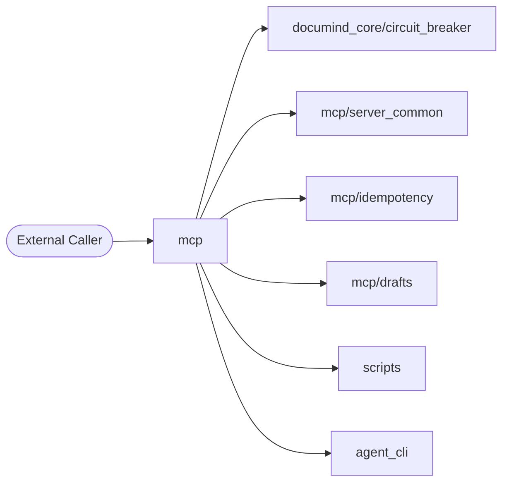

### Level 2 — Container

_What external dependencies does this folder talk to?_

```mermaid
flowchart TB
    subgraph mcp
        Code[Source Code]
    end
    Code --> DB_0[("Elasticsearch")]
    Code --> DB_1[("Kafka (aiokafka)")]
    Code --> DB_2[("Neo4j")]
    Code --> DB_3[("Qdrant")]
    Code --> DB_4[("Redis")]
    Code --> DB_5[("asyncpg")]
    Code --> DB_6[("psycopg")]
    Code --> AI_0{{LLM: Anthropic SDK}}
    Code --> AI_1{{LLM: DeepEval}}
    Code --> AI_2{{LLM: Giskard}}
    Code --> AI_3{{LLM: LangChain}}
    Code --> AI_4{{LLM: LangGraph}}
    Code --> AI_5{{LLM: Ollama}}
    Code --> AI_6{{LLM: OpenAI SDK}}
    Code --> AI_7{{LLM: Ragas}}
    Code --> AI_8{{LLM: Rebuff (PI defense)}}
```

### Level 3 — Component

_Internal files grouped by inferred role._

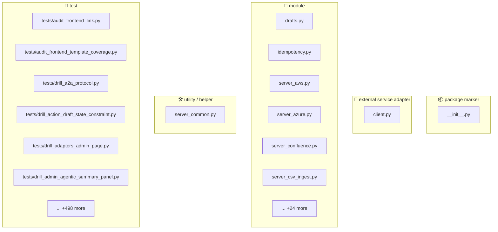

### Level 4 — Code (top hotspots)

_Longest functions — these are the most likely refactor candidates._

```mermaid
flowchart TB
    tests_drill_agent_board_metrics_py_158_m["main (376 lines)<br/>tests/drill_agent_board_metrics.py:158"]
    tests_drill_tools_registry_table_py_92_m["main (353 lines)<br/>tests/drill_tools_registry_table.py:92"]
    tests_drill_audit_log_partitioned_py_117["main (345 lines)<br/>tests/drill_audit_log_partitioned.py:117"]
    tests_drill_tool_executions_table_py_143["main (341 lines)<br/>tests/drill_tool_executions_table.py:143"]
    tests_drill_agent_task_registry_py_104_m["main (311 lines)<br/>tests/drill_agent_task_registry.py:104"]
```


## 📐 Class Diagram (UML-style)

Top classes by method count, with inheritance arrows. Common framework bases (`BaseModel`, `BaseSettings`, `Exception`, `Enum`) use dotted lines.

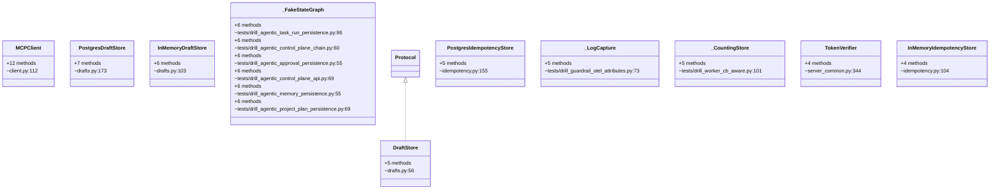


_Showing top 15 of 133 classes (ranked by method count)._


## 4. Code Sequence — How Files Link to Each Other

**Import graph for files in this folder.** Reading order: start at any entry-point file (look for `🚀 entry point` role in the inventory above), then follow the arrows.

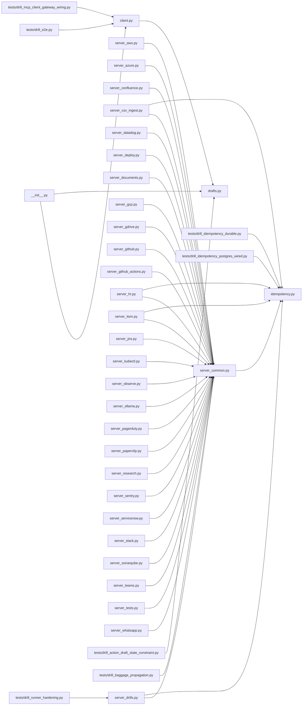

### Edge list

| From file | To file | Import-count |
|---|---|---|
| `tests/drill_baggage_propagation.py` | `server_common.py` | 6 |
| `server_aws.py` | `server_common.py` | 2 |
| `server_azure.py` | `server_common.py` | 2 |
| `server_confluence.py` | `server_common.py` | 2 |
| `server_datadog.py` | `server_common.py` | 2 |
| `server_documents.py` | `server_common.py` | 2 |
| `server_drills.py` | `server_common.py` | 2 |
| `server_gcp.py` | `server_common.py` | 2 |
| `server_gdrive.py` | `server_common.py` | 2 |
| `server_github.py` | `server_common.py` | 2 |
| `server_github_actions.py` | `server_common.py` | 2 |
| `server_hr.py` | `server_common.py` | 2 |
| `server_itsm.py` | `server_common.py` | 2 |
| `server_jira.py` | `server_common.py` | 2 |
| `server_kubectl.py` | `server_common.py` | 2 |
| `server_pagerduty.py` | `server_common.py` | 2 |
| `server_paperclip.py` | `server_common.py` | 2 |
| `server_sentry.py` | `server_common.py` | 2 |
| `server_servicenow.py` | `server_common.py` | 2 |
| `server_slack.py` | `server_common.py` | 2 |
| `server_sonarqube.py` | `server_common.py` | 2 |
| `server_teams.py` | `server_common.py` | 2 |
| `server_whatsapp.py` | `server_common.py` | 2 |
| `tests/drill_runner_hardening.py` | `server_drills.py` | 2 |
| `__init__.py` | `client.py` | 1 |
| `__init__.py` | `drafts.py` | 1 |
| `client.py` | `drafts.py` | 1 |
| `server_common.py` | `idempotency.py` | 1 |
| `server_csv_ingest.py` | `idempotency.py` | 1 |
| `server_csv_ingest.py` | `server_common.py` | 1 |
| `server_deploy.py` | `server_common.py` | 1 |
| `server_drills.py` | `idempotency.py` | 1 |
| `server_hr.py` | `idempotency.py` | 1 |
| `server_itsm.py` | `idempotency.py` | 1 |
| `server_observe.py` | `server_common.py` | 1 |
| `server_ollama.py` | `server_common.py` | 1 |
| `server_research.py` | `server_common.py` | 1 |
| `server_tests.py` | `server_common.py` | 1 |
| `tests/drill_action_draft_state_constraint.py` | `drafts.py` | 1 |
| `tests/drill_e2e.py` | `client.py` | 1 |
| `tests/drill_idempotency_durable.py` | `idempotency.py` | 1 |
| `tests/drill_idempotency_postgres_wired.py` | `idempotency.py` | 1 |
| `tests/drill_mcp_client_gateway_wiring.py` | `client.py` | 1 |


## 5. Request Flowchart

Generic request lifecycle for this folder. Branches that don't apply are auto-removed based on detected dependencies (DB / cache / LLM).

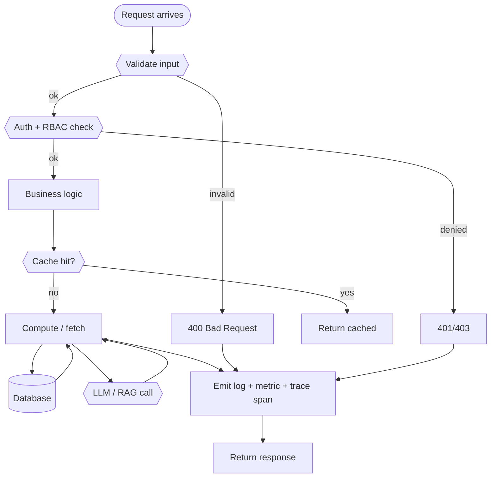


## 6. API Endpoints — Input / Process / Output

**Detected endpoints:** 95

| Method | Route | Defined in | Input (schema) | Process (summary) | Output (schema) |
|---|---|---|---|---|---|
| `GET` | `/metrics` | `server_common.py:144` | _TBD_ | _TBD_ | _TBD_ |
| `GET` | `/health` | `server_documents.py:490` | _TBD_ | _TBD_ | _TBD_ |
| `GET` | `/tools/list` | `server_documents.py:495` | _TBD_ | _TBD_ | _TBD_ |
| `POST` | `/tools/call` | `server_documents.py:500` | _TBD_ | _TBD_ | _TBD_ |
| `GET` | `/health` | `server_sentry.py:144` | _TBD_ | _TBD_ | _TBD_ |
| `GET` | `/tools/list` | `server_sentry.py:149` | _TBD_ | _TBD_ | _TBD_ |
| `POST` | `/tools/call` | `server_sentry.py:154` | _TBD_ | _TBD_ | _TBD_ |
| `GET` | `/health` | `server_kubectl.py:143` | _TBD_ | _TBD_ | _TBD_ |
| `GET` | `/tools/list` | `server_kubectl.py:148` | _TBD_ | _TBD_ | _TBD_ |
| `POST` | `/tools/call` | `server_kubectl.py:153` | _TBD_ | _TBD_ | _TBD_ |
| `GET` | `/health` | `server_hr.py:171` | _TBD_ | _TBD_ | _TBD_ |
| `GET` | `/tools/list` | `server_hr.py:176` | _TBD_ | _TBD_ | _TBD_ |
| `POST` | `/tools/call` | `server_hr.py:181` | _TBD_ | _TBD_ | _TBD_ |
| `GET` | `/health` | `server_observe.py:106` | _TBD_ | _TBD_ | _TBD_ |
| `GET` | `/tools/list` | `server_observe.py:136` | _TBD_ | _TBD_ | _TBD_ |
| `POST` | `/tools/call` | `server_observe.py:278` | _TBD_ | _TBD_ | _TBD_ |
| `GET` | `/health` | `server_deploy.py:76` | _TBD_ | _TBD_ | _TBD_ |
| `GET` | `/tools/list` | `server_deploy.py:81` | _TBD_ | _TBD_ | _TBD_ |
| `POST` | `/tools/call` | `server_deploy.py:86` | _TBD_ | _TBD_ | _TBD_ |
| `GET` | `/health` | `server_jira.py:227` | _TBD_ | _TBD_ | _TBD_ |
| `GET` | `/tools/list` | `server_jira.py:232` | _TBD_ | _TBD_ | _TBD_ |
| `POST` | `/tools/call` | `server_jira.py:237` | _TBD_ | _TBD_ | _TBD_ |
| `GET` | `/health` | `server_gdrive.py:167` | _TBD_ | _TBD_ | _TBD_ |
| `GET` | `/tools/list` | `server_gdrive.py:172` | _TBD_ | _TBD_ | _TBD_ |
| `POST` | `/tools/call` | `server_gdrive.py:177` | _TBD_ | _TBD_ | _TBD_ |
| `GET` | `/health` | `server_drills.py:366` | _TBD_ | _TBD_ | _TBD_ |
| `GET` | `/tools/list` | `server_drills.py:371` | _TBD_ | _TBD_ | _TBD_ |
| `POST` | `/tools/call` | `server_drills.py:376` | _TBD_ | _TBD_ | _TBD_ |
| `GET` | `/health` | `server_gcp.py:143` | _TBD_ | _TBD_ | _TBD_ |
| `GET` | `/tools/list` | `server_gcp.py:148` | _TBD_ | _TBD_ | _TBD_ |
| `POST` | `/tools/call` | `server_gcp.py:153` | _TBD_ | _TBD_ | _TBD_ |
| `GET` | `/health` | `server_teams.py:133` | _TBD_ | _TBD_ | _TBD_ |
| `GET` | `/tools/list` | `server_teams.py:138` | _TBD_ | _TBD_ | _TBD_ |
| `POST` | `/tools/call` | `server_teams.py:143` | _TBD_ | _TBD_ | _TBD_ |
| `GET` | `/health` | `server_whatsapp.py:152` | _TBD_ | _TBD_ | _TBD_ |
| `GET` | `/tools/list` | `server_whatsapp.py:157` | _TBD_ | _TBD_ | _TBD_ |
| `POST` | `/tools/call` | `server_whatsapp.py:162` | _TBD_ | _TBD_ | _TBD_ |
| `GET` | `/health` | `server_aws.py:144` | _TBD_ | _TBD_ | _TBD_ |
| `GET` | `/tools/list` | `server_aws.py:149` | _TBD_ | _TBD_ | _TBD_ |
| `POST` | `/tools/call` | `server_aws.py:154` | _TBD_ | _TBD_ | _TBD_ |
| `GET` | `/health/live` | `server_ollama.py:224` | _TBD_ | _TBD_ | _TBD_ |
| `GET` | `/health` | `server_ollama.py:228` | _TBD_ | _TBD_ | _TBD_ |
| `GET` | `/health/ready` | `server_ollama.py:232` | _TBD_ | _TBD_ | _TBD_ |
| `GET` | `/tools/list` | `server_ollama.py:244` | _TBD_ | _TBD_ | _TBD_ |
| `POST` | `/tools/call` | `server_ollama.py:253` | _TBD_ | _TBD_ | _TBD_ |
| `GET` | `/health` | `server_itsm.py:153` | _TBD_ | _TBD_ | _TBD_ |
| `GET` | `/tools/list` | `server_itsm.py:158` | _TBD_ | _TBD_ | _TBD_ |
| `POST` | `/tools/call` | `server_itsm.py:163` | _TBD_ | _TBD_ | _TBD_ |
| `GET` | `/health` | `server_github.py:476` | _TBD_ | _TBD_ | _TBD_ |
| `GET` | `/tools/list` | `server_github.py:481` | _TBD_ | _TBD_ | _TBD_ |
| `POST` | `/tools/call` | `server_github.py:486` | _TBD_ | _TBD_ | _TBD_ |
| `GET` | `/health` | `server_slack.py:143` | _TBD_ | _TBD_ | _TBD_ |
| `GET` | `/tools/list` | `server_slack.py:148` | _TBD_ | _TBD_ | _TBD_ |
| `POST` | `/tools/call` | `server_slack.py:153` | _TBD_ | _TBD_ | _TBD_ |
| `GET` | `/health` | `server_sonarqube.py:144` | _TBD_ | _TBD_ | _TBD_ |
| `GET` | `/tools/list` | `server_sonarqube.py:149` | _TBD_ | _TBD_ | _TBD_ |
| `POST` | `/tools/call` | `server_sonarqube.py:154` | _TBD_ | _TBD_ | _TBD_ |
| `GET` | `/health` | `server_pagerduty.py:143` | _TBD_ | _TBD_ | _TBD_ |
| `GET` | `/tools/list` | `server_pagerduty.py:148` | _TBD_ | _TBD_ | _TBD_ |
| `POST` | `/tools/call` | `server_pagerduty.py:153` | _TBD_ | _TBD_ | _TBD_ |
| `GET` | `/health` | `server_datadog.py:144` | _TBD_ | _TBD_ | _TBD_ |
| `GET` | `/tools/list` | `server_datadog.py:149` | _TBD_ | _TBD_ | _TBD_ |
| `POST` | `/tools/call` | `server_datadog.py:154` | _TBD_ | _TBD_ | _TBD_ |
| `GET` | `/v1/tools` | `server_paperclip.py:246` | _TBD_ | _TBD_ | _TBD_ |
| `GET` | `/tools/list` | `server_paperclip.py:252` | _TBD_ | _TBD_ | _TBD_ |
| `POST` | `/v1/tools/call` | `server_paperclip.py:258` | _TBD_ | _TBD_ | _TBD_ |
| `POST` | `/tools/call` | `server_paperclip.py:296` | _TBD_ | _TBD_ | _TBD_ |
| `GET` | `/v1/health` | `server_paperclip.py:306` | _TBD_ | _TBD_ | _TBD_ |
| `GET` | `/health` | `server_paperclip.py:318` | _TBD_ | _TBD_ | _TBD_ |
| `GET` | `/health` | `server_azure.py:145` | _TBD_ | _TBD_ | _TBD_ |
| `GET` | `/tools/list` | `server_azure.py:150` | _TBD_ | _TBD_ | _TBD_ |
| `POST` | `/tools/call` | `server_azure.py:155` | _TBD_ | _TBD_ | _TBD_ |
| `GET` | `/health` | `server_servicenow.py:173` | _TBD_ | _TBD_ | _TBD_ |
| `GET` | `/tools/list` | `server_servicenow.py:178` | _TBD_ | _TBD_ | _TBD_ |
| `POST` | `/tools/call` | `server_servicenow.py:183` | _TBD_ | _TBD_ | _TBD_ |
| `GET` | `/health` | `server_confluence.py:145` | _TBD_ | _TBD_ | _TBD_ |
| `GET` | `/tools/list` | `server_confluence.py:150` | _TBD_ | _TBD_ | _TBD_ |
| `POST` | `/tools/call` | `server_confluence.py:155` | _TBD_ | _TBD_ | _TBD_ |
| `GET` | `/health` | `server_csv_ingest.py:474` | _TBD_ | _TBD_ | _TBD_ |
| `GET` | `/tools/list` | `server_csv_ingest.py:479` | _TBD_ | _TBD_ | _TBD_ |
| `POST` | `/tools/call` | `server_csv_ingest.py:484` | _TBD_ | _TBD_ | _TBD_ |
| `GET` | `/health` | `server_research.py:100` | _TBD_ | _TBD_ | _TBD_ |
| `GET` | `/tools/list` | `server_research.py:110` | _TBD_ | _TBD_ | _TBD_ |
| `POST` | `/tools/call` | `server_research.py:219` | _TBD_ | _TBD_ | _TBD_ |
| `GET` | `/health` | `server_tests.py:186` | _TBD_ | _TBD_ | _TBD_ |
| `GET` | `/tools/list` | `server_tests.py:192` | _TBD_ | _TBD_ | _TBD_ |
| `POST` | `/tools/call` | `server_tests.py:385` | _TBD_ | _TBD_ | _TBD_ |
| `GET` | `/health` | `server_github_actions.py:143` | _TBD_ | _TBD_ | _TBD_ |
| `GET` | `/tools/list` | `server_github_actions.py:148` | _TBD_ | _TBD_ | _TBD_ |
| `POST` | `/tools/call` | `server_github_actions.py:153` | _TBD_ | _TBD_ | _TBD_ |
| `GET` | `/health` | `tests/drill_mcp_saas_servers.py:117` | _TBD_ | _TBD_ | _TBD_ |
| `POST` | `/tools/call` | `tests/drill_mcp_saas_servers.py:118` | _TBD_ | _TBD_ | _TBD_ |
| `GET` | `/health` | `tests/drill_mcp_sdlc_servers.py:121` | _TBD_ | _TBD_ | _TBD_ |
| `POST` | `/tools/call` | `tests/drill_mcp_sdlc_servers.py:122` | _TBD_ | _TBD_ | _TBD_ |
| `GET` | `/probe` | `tests/drill_baggage_middleware.py:154` | _TBD_ | _TBD_ | _TBD_ |

_Reviewer fills the last three columns from the Pydantic models in the handler. Auto-extraction of Pydantic schemas is on the roadmap._


## 🏗 Input/Process/Output + Integration + Design Principles

### Input / Process / Output per endpoint

| Endpoint | INPUT (validation chain) | PROCESS (call chain) | OUTPUT (response chain) |
|---|---|---|---|
| `GET /metrics` | Pydantic schema validated at middleware | Router `server_common.py:144` → Service (`app/services/`) → Repository (`app/repositories/` or `documind_core/db_client.py`) → External (LLM / Vector / Kafka) | Pydantic response model serialized to JSON + headers (`X-Correlation-ID`, `X-Latency-ms`) |
| `GET /health` | Pydantic schema validated at middleware | Router `server_documents.py:490` → Service (`app/services/`) → Repository (`app/repositories/` or `documind_core/db_client.py`) → External (LLM / Vector / Kafka) | Pydantic response model serialized to JSON + headers (`X-Correlation-ID`, `X-Latency-ms`) |
| `GET /tools/list` | Pydantic schema validated at middleware | Router `server_documents.py:495` → Service (`app/services/`) → Repository (`app/repositories/` or `documind_core/db_client.py`) → External (LLM / Vector / Kafka) | Pydantic response model serialized to JSON + headers (`X-Correlation-ID`, `X-Latency-ms`) |
| `POST /tools/call` | Pydantic schema validated at middleware | Router `server_documents.py:500` → Service (`app/services/`) → Repository (`app/repositories/` or `documind_core/db_client.py`) → External (LLM / Vector / Kafka) | Pydantic response model serialized to JSON + headers (`X-Correlation-ID`, `X-Latency-ms`) |
| `GET /health` | Pydantic schema validated at middleware | Router `server_sentry.py:144` → Service (`app/services/`) → Repository (`app/repositories/` or `documind_core/db_client.py`) → External (LLM / Vector / Kafka) | Pydantic response model serialized to JSON + headers (`X-Correlation-ID`, `X-Latency-ms`) |
| `GET /tools/list` | Pydantic schema validated at middleware | Router `server_sentry.py:149` → Service (`app/services/`) → Repository (`app/repositories/` or `documind_core/db_client.py`) → External (LLM / Vector / Kafka) | Pydantic response model serialized to JSON + headers (`X-Correlation-ID`, `X-Latency-ms`) |
| `POST /tools/call` | Pydantic schema validated at middleware | Router `server_sentry.py:154` → Service (`app/services/`) → Repository (`app/repositories/` or `documind_core/db_client.py`) → External (LLM / Vector / Kafka) | Pydantic response model serialized to JSON + headers (`X-Correlation-ID`, `X-Latency-ms`) |
| `GET /health` | Pydantic schema validated at middleware | Router `server_kubectl.py:143` → Service (`app/services/`) → Repository (`app/repositories/` or `documind_core/db_client.py`) → External (LLM / Vector / Kafka) | Pydantic response model serialized to JSON + headers (`X-Correlation-ID`, `X-Latency-ms`) |

### Integration sequence (ordered by import volume)

Other folders this one calls into, ordered by how heavily it depends on each:

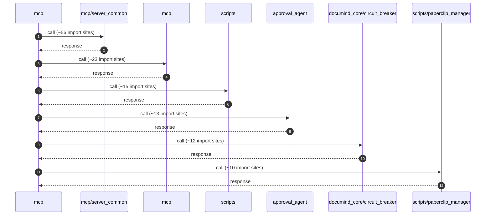

### SOLID principles applied here

| Principle | Where it shows up in this folder |
|---|---|
| **S — Single Responsibility** | Each file has ONE role — routers route, services orchestrate, repos query, schemas describe. The §2 File Inventory shows the role per file; any file with multiple roles violates SRP. |
| **O — Open/Closed** | New endpoints add new router functions; new business cases add new service methods. Existing methods stay closed for modification. |
| **L — Liskov Substitution** | All adapter clients (Ollama / OpenAI / Anthropic) implement the same LLM-client protocol — they're interchangeable behind the circuit breaker. |
| **I — Interface Segregation** | Pydantic models split request, response, and internal state into separate schemas — no client gets a fat model with fields it doesn't use. |
| **D — Dependency Inversion** | Services receive their dependencies via FastAPI `Depends()` — they depend on abstractions (factories), not concrete repos. Swap implementations in tests via the `app.dependency_overrides` dict. |

### Microservice principles applied here

| Principle | Application |
|---|---|
| **Single business capability** | `mcp` owns ONE capability (see §1 Purpose). Cross-capability logic lives in other services. |
| **Bounded context** | Schemas + repositories are scoped to this service's bounded context — no shared DB tables with other services. |
| **DB per service** | Each service owns its tables. Cross-service reads go through HTTP or Kafka — never a direct DB join. |
| **Independent deploy** | Service is independently deployable — its container is built + released without coupling to other services. |
| **Resilience patterns** | Circuit breakers (`documind_core/breakers/`), retries with exponential backoff, bulkheads, timeouts on every external call. |
| **Observability** | Every request has a `request_id` propagated via OTel baggage; every external call emits a trace span. |

### Design-principle stack (how the principles compose)

Reading bottom-to-top — earlier principles enable later ones:

```text
┌─────────────────────────────────────────────────────────────┐
│ 7. AI Governance (§38 + §48): decision audit + explainability│
├─────────────────────────────────────────────────────────────┤
│ 6. Production Gates (§47.11): 10 gates BEFORE deploy        │
├─────────────────────────────────────────────────────────────┤
│ 5. Resilience: CB + retry + bulkhead + timeout              │
├─────────────────────────────────────────────────────────────┤
│ 4. Microservice: single capability, bounded context, DB/svc │
├─────────────────────────────────────────────────────────────┤
│ 3. SOLID: SRP + OCP + LSP + ISP + DIP                       │
├─────────────────────────────────────────────────────────────┤
│ 2. 12-factor: stateless, deps in venv, config in env        │
├─────────────────────────────────────────────────────────────┤
│ 1. KISS / YAGNI / DRY: every line earns its place           │
└─────────────────────────────────────────────────────────────┘
```

**How to use this stack:** when adding a new feature, check it from the bottom up. KISS first (simplest design that works), then SOLID (does any class violate SRP?), then microservice (does this leak the bounded context?), then resilience (what fails when the downstream is slow?), then gates (which production gate enforces this?), then governance (which audit row records this decision?).


## 🔬 Execution Sequence + Debug Tap Points

For each phase a request goes through, this section shows: **(1)** the file:line where it happens, **(2)** the log line you'll see, **(3)** the command to inspect that phase's output in real time. Use this as your debug-flow chart — start at Phase 0, move down until output stops matching the expected log line; that's where the failure is.

**Worked example:** `GET /metrics` (server_common.py:144)

### Phase-by-phase debug tap table

| # | Phase | Code location | Log line to grep | Command to inspect |
|---|---|---|---|---|
| 0 | **TCP connect** | OS / docker network | `client_connected` | `curl -v http://localhost:8000/health 2>&1 \| head -15` |
| 1 | **Middleware: request_id assign** | `documind_core/middleware.py` | `request_id=...` | `docker logs documind-mcp -f \| grep request_id` |
| 2 | **Middleware: auth** | `documind_core/auth.py` | `auth_ok` or `auth_denied` | `docker logs documind-mcp -f \| grep auth_` |
| 3 | **Middleware: tenant resolution** | `documind_core/middleware.py` | `tenant_id=<id>` | `docker logs documind-mcp -f \| grep tenant_id` |
| 4 | **Pydantic validation** | `app/schemas/*.py` | `422 Unprocessable` (on fail) | `docker logs documind-mcp -f \| grep -E 'validation\|422'` |
| 5 | **Router dispatch** | `server_common.py:144` | `GET /metrics` | `docker logs documind-mcp -f \| grep '/metrics'` |
| 6 | **Business service call** | `app/services/*.py` | `service_method_start` | `docker logs documind-mcp -f \| grep service_` |
| 7 | **DB query** | `app/repositories/*.py` or `documind_core/db_client.py` | `asyncpg.execute` or `SELECT...` | `docker logs documind-postgres -f \| grep -E 'duration:'` |
| 8 | **External call (LLM / vector)** | `app/services/*_client.py` | `llm_call_start` / `vector_search_start` | `docker logs documind-mcp -f \| grep -E 'llm_\|vector_'` |
| 9 | **Decision audit log** | `documind_core/ai_governance.py` | `decision_audit:` | `psql -p 55432 -U documind -c "SELECT * FROM decision_audit ORDER BY ts DESC LIMIT 1;"` |
| 10 | **Response shaping** | `app/schemas/*.py` (response model) | `response_ms=` | `docker logs documind-mcp -f \| grep response_ms` |
| 11 | **Trace span flush** | OTel exporter | _(async)_ | Open Jaeger UI: `http://localhost:16686/search?service=mcp` |

### Reproducible end-to-end trace

Use this script to fire ONE request and see every phase's output in a single terminal:

```bash
REQ_ID=$(uuidgen)
echo "=== Issuing GET /metrics with request_id=$REQ_ID ==="

# Phase 0-2: tail logs in background
docker logs documind-mcp --tail=0 -f 2>&1 | grep --line-buffered "$REQ_ID" &
TAIL_PID=$!
sleep 0.5

# Phase 3-10: fire the request
curl -X GET http://localhost:8000/metrics \
  -H "X-Correlation-ID: $REQ_ID" \
  -H "Authorization: Bearer <token>" \
  -H "Content-Type: application/json" \
  -d '{}' -w "\nTOTAL=%{time_total}s\n"

sleep 2  # let logs flush
kill $TAIL_PID

# Phase 9: pull the decision audit row
psql -h localhost -p 55432 -U documind -d documind \
  -c "SELECT request_id, model_version, prompt_version, decision, confidence FROM decision_audit WHERE request_id='$REQ_ID';"

# Phase 11: pull the trace span tree
open "http://localhost:16686/search?service=mcp&tags=%7B%22request_id%22%3A%22$REQ_ID%22%7D"
```

### Debug-order checklist (when something breaks)

Walk the phases IN ORDER — first phase with missing/wrong output is the failure point. Don't skip ahead:

1. **Phase 0 fail?** Service not running → `bash scripts/circuitrag-status.sh`
2. **Phase 1-3 fail?** Middleware misconfigured → check env vars + middleware order in `main.py`
3. **Phase 4 fail (422)?** Request body doesn't match schema → check Pydantic model in `app/schemas/`
4. **Phase 5 fail (404)?** Route not registered → check router import in `main.py`
5. **Phase 6 fail (500)?** Business logic exception → tail logs for stack trace
6. **Phase 7 fail?** DB unreachable → `psql -p 55432 -U documind -c "SELECT 1;"`
7. **Phase 8 fail?** External dep down → check `/health/upstreams` + circuit breaker state
8. **Phase 9 missing?** Decision audit not persisted → check Kafka consumer lag
9. **Phase 10 slow?** Response shaping bottleneck → profile the response model
10. **Phase 11 empty Jaeger?** OTel exporter misconfigured → check `OTEL_EXPORTER_OTLP_ENDPOINT`


## 7. Sequence Diagrams per Endpoint

### Generic flow (all endpoints)

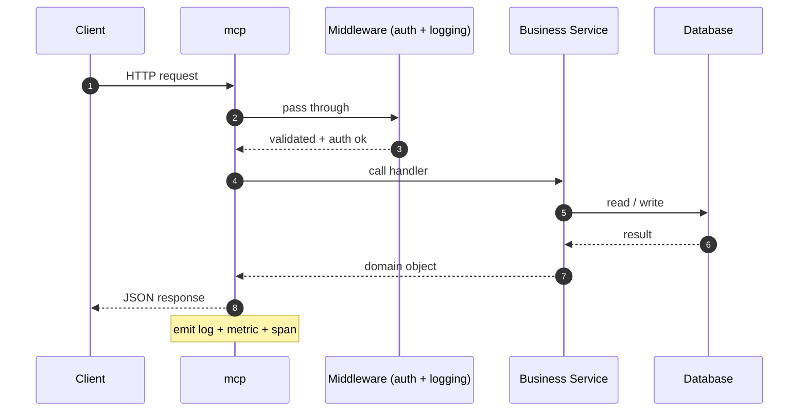

### Per-endpoint sequence stubs (top 5)

### `GET /metrics` (server_common.py:144)

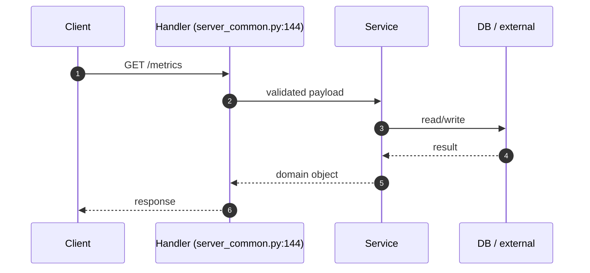

### `GET /health` (server_documents.py:490)

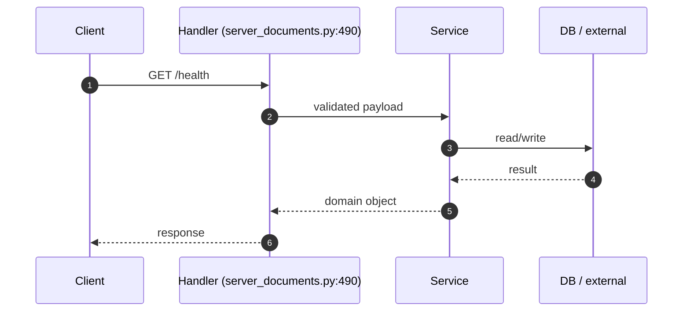

### `GET /tools/list` (server_documents.py:495)

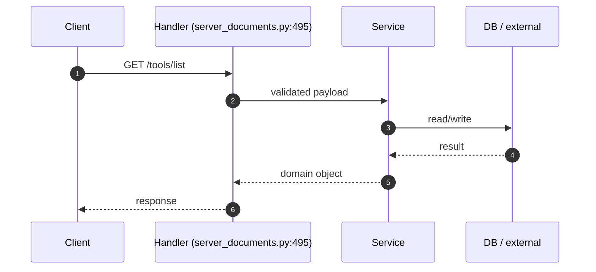

### `POST /tools/call` (server_documents.py:500)

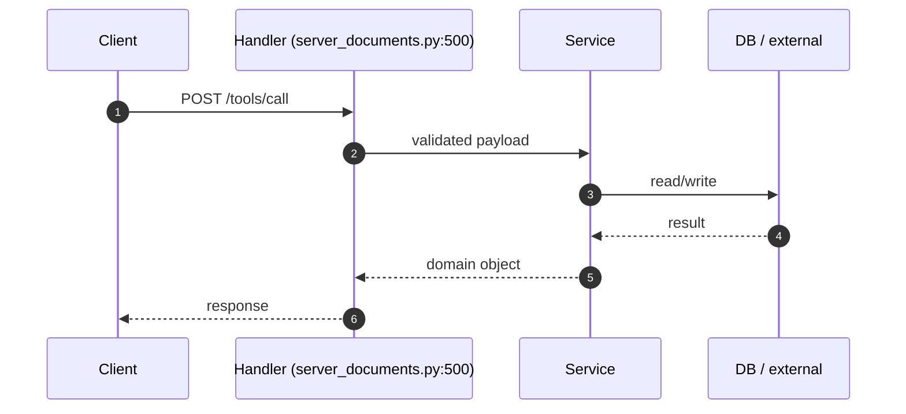

### `GET /health` (server_sentry.py:144)

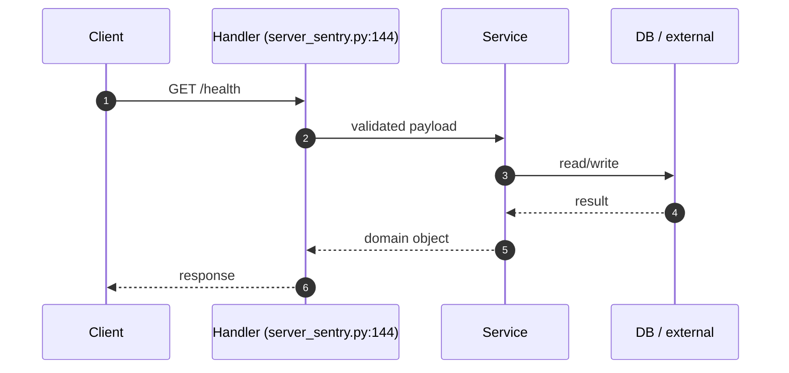

_(+90 more endpoints — diagrams omitted for brevity.)_


## 🔬 Annotated Example Request

Walk through what happens when a client calls **`GET /metrics`** (server_common.py:144).

```text
┌─────────────────────────────────────────────────────────────────────┐
│ 1. Client sends HTTP request                                        │
│    GET /metrics                                                    │
│    Headers: Authorization, X-Correlation-ID, X-Tenant-ID            │
└────────────────────────┬────────────────────────────────────────────┘
                         │
                         ▼
┌─────────────────────────────────────────────────────────────────────┐
│ 2. Middleware stack (auth → logging → tracing → rate-limit)         │
│    - Validate JWT / API key                                         │
│    - Resolve tenant_id from token                                   │
│    - Start span; inject request_id into baggage                     │
└────────────────────────┬────────────────────────────────────────────┘
                         │
                         ▼
┌─────────────────────────────────────────────────────────────────────┐
│ 3. Pydantic validation                                              │
│    - Parse request body against schema                              │
│    - 422 on validation error (with field-level details)             │
└────────────────────────┬────────────────────────────────────────────┘
                         │
                         ▼
┌─────────────────────────────────────────────────────────────────────┐
│ 4. Router handler                                                   │
│    server_common.py:144
│    - Receive validated request + injected Depends()                 │
│    - Delegate to business service                                   │
└────────────────────────┬────────────────────────────────────────────┘
                         │
                         ▼
┌─────────────────────────────────────────────────────────────────────┐
│ 5. Business service                                                 │
│    - Apply rules / orchestrate multi-step logic                     │
│    - Call repositories for DB I/O                                   │
│    - Call external services (LLM / vector DB / etc.)             │
│    - Emit metrics + log decision audit row                          │
└────────────────────────┬────────────────────────────────────────────┘
                         │
                         ▼
┌─────────────────────────────────────────────────────────────────────┐
│ 6. Response shaping                                                 │
│    - Build response Pydantic model                                  │
│    - Serialize to JSON                                              │
│    - Add correlation_id, latency_ms to headers                      │
└────────────────────────┬────────────────────────────────────────────┘
                         │
                         ▼
                       Client
```

### Inspecting this in real time

```bash
# 1. Tail the service log
docker logs documind-mcp --tail=20 -f &

# 2. Issue the request with a fresh correlation_id
REQ_ID=$(uuidgen)
curl -X GET http://localhost:<PORT>/metrics \
  -H "X-Correlation-ID: $REQ_ID" \
  -H "Authorization: Bearer <token>" \
  -d '{}'

# 3. Find the trace in Jaeger
open http://localhost:16686/search?service=mcp&tags=%7B%22request_id%22%3A%22$REQ_ID%22%7D
```


## 8. Database Layer

**DB / storage libraries:** Elasticsearch, Kafka (aiokafka), Neo4j, Qdrant, Redis, asyncpg, psycopg

**Total DB call sites:** 683

| Pattern | Count |
|---|---|
| `execute` | 126 |
| `fetch/fetchall/fetchrow` | 74 |
| `ORM CRUD` | 233 |
| `MongoDB` | 250 |

### Query Optimization checklist

| Check | Status (✓/✗/⚠) | Notes |
|---|---|---|
| Indexes on every WHERE / ORDER BY column | — | EXPLAIN ANALYZE hot paths |
| Full table scans avoided | — | — |
| Batch operations used (not N writes in a loop) | — | — |
| Parameterized queries (NEVER f-string SQL) | — | — |

### Transactions (ACID)

| Check | Status (✓/✗/⚠) | Notes |
|---|---|---|
| Transaction boundaries narrow (no HTTP / LLM inside) | — | — |
| Rollback on exception | — | — |
| Isolation level documented (READ COMMITTED / SERIALIZABLE) | — | — |
| Deadlock prevention strategy | — | — |

### N+1 Query Findings (reviewer to fill)

| Endpoint / Function | Suspect Loop | Est. Queries / Request | Fix |
|---|---|---|---|
| — | — | — | — |


## 9. Code Quality + Complexity

### Readability

| Check | Status (✓/✗/⚠) | Notes |
|---|---|---|
| Clear variable / function / class names | — | — |
| No misleading naming (no `tmp` / `xyz` / `foo`) | — | — |
| Small focused functions (≤ 50 lines) | — | 5 > 50 lines (see Section 0) |
| Avoid deeply nested conditions (≤ 4 levels) | — | — |

### Clean code

| Check | Status (✓/✗/⚠) | Notes |
|---|---|---|
| No dead / commented-out code | — | — |
| No `print()` — use logger | — | — |
| No hardcoded values | — | smell count: 123 |
| Constants extracted to a settings module | — | — |

### Complexity

| Check | Status (✓/✗/⚠) | Notes |
|---|---|---|
| Long methods broken down | — | — |
| No overengineering (premature abstractions) | — | — |
| Cyclomatic complexity ≤ 15 per function | — | run `ruff complexity` or `radon` |


## 10. Security Review

### Authentication & Authorization

| Check | Status (✓/✗/⚠) | Notes |
|---|---|---|
| Authentication implemented correctly | — | Bearer / JWT / session |
| Authorization (RBAC / ABAC) checks | — | no client-side trust |
| Tokens validated server-side every request | — | rotate, expire, revoke |

### OWASP Top 10

| Check | Status (✓/✗/⚠) | Notes |
|---|---|---|
| Request validation present | — | sanitization: Manual escape, Pydantic BaseModel |
| SQL injection prevention | — | DB libs: Elasticsearch, Kafka (aiokafka), Neo4j, Qdrant, Redis, asyncpg, psycopg — parameterized queries only |
| XSS / CSRF prevention | — | output encoding / CSP / SameSite |
| Path traversal prevention | — | no user input concatenated to file paths |
| Prompt injection prevention | — | Rebuff / output filter |

### Secret Management

| Check | Status (✓/✗/⚠) | Notes |
|---|---|---|
| No secrets in code | — | smell count: 1 password literals, 0 api key literals |
| Env vars / Vault used | — | Pydantic BaseSettings or env reader |
| Secret rotation strategy | — | documented in runbook |

### Sensitive Data

| Check | Status (✓/✗/⚠) | Notes |
|---|---|---|
| PII masked in logs | — | structured logger with field redaction |
| Encryption in transit (TLS) | — | — |
| Encryption at rest (DB / object store) | — | — |
| GDPR — retention + right-to-be-forgotten | — | — |


## 11. Performance Review

### Memory

| Check | Status (✓/✗/⚠) | Notes |
|---|---|---|
| Large object retention avoided | — | — |
| Streaming for large files / data | — | — |
| Caches bounded (LRU / TTL) | — | caching: redis |

### Concurrency

| Check | Status (✓/✗/⚠) | Notes |
|---|---|---|
| Thread safety validated | — | primitives: Lock / RLock, asyncio (async/await), concurrent.futures, threading |
| Race conditions prevented | — | — |
| Deadlocks avoided (lock ordering) | — | — |
| Parallel processing where beneficial | — | 574 async fns |

### Latency

| Check | Status (✓/✗/⚠) | Notes |
|---|---|---|
| External API calls batched / cached | — | — |
| Timeouts on every external call | — | — |
| No blocking I/O inside async functions | — | — |


## 12. Reliability & Observability

### Failure Handling

| Check | Status (✓/✗/⚠) | Notes |
|---|---|---|
| Retry (bounded + exp backoff + jitter) | — | — |
| Circuit breaker around external deps | — | — |
| Graceful degradation | — | — |

### Timeout Handling

| Check | Status (✓/✗/⚠) | Notes |
|---|---|---|
| Timeout on every external call (HTTP / DB / subprocess) | — | — |
| No infinite waits | — | — |

### Observability

| Check | Status (✓/✗/⚠) | Notes |
|---|---|---|
| Structured (JSON) logging | — | correlation_id + tenant_id + request_id |
| Metrics (RED: rate / errors / duration) | — | — |
| Tracing (OpenTelemetry → Jaeger / Tempo) | — | — |
| Baggage propagation across services | — | — |


## 13. Test Cases

**Test files detected:** 1
_No `test_*` functions parsed via AST. Either tests live elsewhere or names don't match the `test_*` convention._


## 14. Logging & Monitoring

### Logging

| Check | Status (✓/✗/⚠) | Notes |
|---|---|---|
| Structured (JSON) logs | — | — |
| Correlation ID present | — | — |
| No PII / secrets in log lines | — | — |
| No excessive logging (no logs in hot loops) | — | — |

### Monitoring

| Check | Status (✓/✗/⚠) | Notes |
|---|---|---|
| Alerts defined (SLO-burn aware) | — | — |
| Dashboards exist (Grafana) | — | — |
| On-call playbook references | — | — |


## 15. LLM / GenAI / RAG

**Detected AI deps:** Anthropic SDK, DeepEval, Giskard, LangChain, LangGraph, Ollama, OpenAI SDK, Ragas, Rebuff (PI defense)

### Prompt Safety

| Check | Status (✓/✗/⚠) | Notes |
|---|---|---|
| Prompt injection handling (input filter) | — | Rebuff |
| Output sanitization | — | — |
| Prompt versioning in registry | — | — |
| Toxicity / bias filtering | — | — |

### RAG Quality

| Check | Status (✓/✗/⚠) | Notes |
|---|---|---|
| Chunking strategy validated (size + overlap) | — | — |
| Embedding model versioned (re-embed on bump) | — | — |
| Vector DB query optimized (recall@k measured) | — | — |
| Metadata filtering exists (per-tenant) | — | — |

### Cost

| Check | Status (✓/✗/⚠) | Notes |
|---|---|---|
| Model fallback strategy defined | — | — |
| Token usage minimized (cache / truncation) | — | — |
| Per-tenant cost ceiling enforced | — | — |

### Explainability / Responsible AI

| Check | Status (✓/✗/⚠) | Notes |
|---|---|---|
| Citation / source grounding (every claim cited) | — | — |
| Confidence scoring (Ragas / DeepEval) | — | Ragas |
| Decision audit row per prediction (§48) | — | — |
| Fairness / bias checks | — | — |


## 16. SOLID + Microservice Principles

### SOLID

| Check | Status (✓/✗/⚠) | Notes |
|---|---|---|
| S — Single Responsibility (one reason to change per class) | — | — |
| O — Open/Closed (extend via composition, not modification) | — | — |
| L — Liskov Substitution (subclasses honor contracts) | — | — |
| I — Interface Segregation (no fat interfaces) | — | — |
| D — Dependency Inversion (depend on abstractions) | — | — |

### Microservice

| Check | Status (✓/✗/⚠) | Notes |
|---|---|---|
| Single business capability | — | — |
| Bounded context (no domain bleed) | — | — |
| Independent deploy (no coupled releases) | — | — |
| Resilience patterns (CB / retry / bulkhead) | — | — |


## 17. Integration with Other Folders

### Internal — other folders in this repo

| Folder / Module | Import-count | Purpose |
|---|---|---|
| `mcp/server_common` | 56 | _reviewer-described_ |
| `mcp` | 23 | _reviewer-described_ |
| `scripts` | 15 | _reviewer-described_ |
| `approval_agent` | 13 | _reviewer-described_ |
| `documind_core/circuit_breaker` | 12 | _reviewer-described_ |
| `scripts/paperclip_manager` | 10 | _reviewer-described_ |
| `app/workers` | 9 | _reviewer-described_ |
| `app/services` | 8 | _reviewer-described_ |
| `council_engine` | 7 | _reviewer-described_ |
| `mcp/idempotency` | 6 | _reviewer-described_ |
| `app/main` | 6 | _reviewer-described_ |
| `agent_cli` | 5 | _reviewer-described_ |
| `documind_core/kafka_client` | 5 | _reviewer-described_ |
| `documind_core/audit` | 3 | _reviewer-described_ |
| `documind_core/middleware` | 3 | _reviewer-described_ |
| `safety_store` | 3 | _reviewer-described_ |
| `documind_core/logging_config` | 2 | _reviewer-described_ |
| `mcp/client` | 2 | _reviewer-described_ |
| `app` | 2 | _reviewer-described_ |
| `hybrid_architect` | 2 | _reviewer-described_ |
| `app/llm_clients` | 2 | _reviewer-described_ |
| `app/schemas` | 2 | _reviewer-described_ |
| `mcp/server_drills` | 2 | _reviewer-described_ |
| `mcp/drafts` | 1 | _reviewer-described_ |
| `libs/py` | 1 | _reviewer-described_ |
| `documind_core/exceptions` | 1 | _reviewer-described_ |
| `documind_core/rebuff_detector` | 1 | _reviewer-described_ |
| `documind_core/citations` | 1 | _reviewer-described_ |
| `app/postgres_store` | 1 | _reviewer-described_ |
| `documind_core/dr_metrics` | 1 | _reviewer-described_ |
| `documind_core` | 1 | _reviewer-described_ |
| `app/idempotency` | 1 | _reviewer-described_ |
| `app/idempotency_postgres` | 1 | _reviewer-described_ |
| `app/models` | 1 | _reviewer-described_ |
| `app/store` | 1 | _reviewer-described_ |
| `documind_core/auth` | 1 | _reviewer-described_ |
| `personalization` | 1 | _reviewer-described_ |
| `documind_core/ai_governance` | 1 | _reviewer-described_ |
| `app/eval_harness` | 1 | _reviewer-described_ |
| `risk_classifier` | 1 | _reviewer-described_ |
| `app/agent_schemas` | 1 | _reviewer-described_ |
| `app/agent_registry` | 1 | _reviewer-described_ |
| `testing_agent` | 1 | _reviewer-described_ |

### External — third-party packages

| Package | Import-count |
|---|---|
| `importlib` | 154 |
| `fastapi` | 57 |
| `httpx` | 56 |
| `opentelemetry` | 55 |
| `asyncpg` | 41 |
| `types` | 31 |
| `jwt` | 23 |
| `urllib` | 16 |
| `yaml` | 16 |
| `uvicorn` | 10 |
| `pydantic` | 8 |
| `playwright` | 8 |
| `sqlite3` | 7 |
| `mcp_gateway` | 5 |
| `prometheus_client` | 5 |
| `agent_task_registry` | 5 |
| `unittest` | 5 |
| `local_council` | 5 |
| `base64` | 4 |
| `agent_router` | 4 |


## 📖 Domain Glossary

Project-wide vocabulary a new developer needs. If you see a term in code you don't recognize, check here first.

| Term | Definition |
|---|---|
| **RAG** | Retrieval-Augmented Generation — the pattern of grounding LLM output in retrieved documents to reduce hallucination. |
| **Chunk** | A token-bounded slice of a source document (typically 256–1024 tokens with 10–20% overlap). Embedded + stored in the vector DB. |
| **Embedding** | Vector representation of text. Re-embed everything when the embedding model version bumps. |
| **Vector DB** | Qdrant in this project. Stores chunk embeddings + metadata, returns top-k by cosine similarity. |
| **Rerank** | Second-stage retrieval — re-scores the top-k from the vector DB with a more expensive cross-encoder for better relevance. |
| **Hybrid retrieval** | Vector + keyword (Elasticsearch / BM25) merged via reciprocal-rank-fusion. |
| **MCP** | Model Context Protocol — tool-server contract used by agents to call namespace-scoped operations (drill / ingest / etc.). |
| **Tenant** | A logical customer boundary. Every row + every cache key + every prompt context is tenant-scoped. |
| **Drill** | A runnable script that exercises real services + asserts ≥3 negative invariants (per §43). Lives under `mcp/tests/drill_*.py`. |
| **Breaker** | Circuit breaker — opens after N failures to a downstream dep, lets traffic shed instead of cascading. See `documind_core/breakers/`. |
| **Baggage** | OpenTelemetry context (request_id / tenant_id / actor) propagated across spans + service hops. |
| **Decision audit row** | Per-AI-call record persisted to Postgres with request_id, prompt_version, model_version, output, confidence, fairness_flag — per §38 + §48. |
| **Fanout** | Parallel sub-query split for multi-hop RAG (`services/inference-svc/app/agents/multi_hop_fanout.py`). |
| **Council** | 3-model author + reviewer + advisor pattern for code-fix proposals (per §50). |
| **Side-channel port** | Separate Prometheus `/metrics` port (9465–9470) per service to avoid app-port middleware interference. |
| **Trust scorecard** | 5-layer aggregate (governance + tool review + maturity stack + drill catalog + production gates) used for go/no-go. |
| **HBR** | High-Blast-Radius — file patterns that force the pre-commit hook to refresh the drill catalog. |
| **HITL** | Human-In-The-Loop — escalation path when confidence falls in the 0.5–0.8 range (per §40). |
| **Forensic substrate** | The §51-required metadata block (Date/Location/Approach/Policies/Verification) in every commit body. |


## 18. Debugging Guide

### Step-by-step when something breaks

```
1. Tail logs:        tail -50 /tmp/mcp.log   (if host-side)
                     docker logs documind-mcp --tail=50   (if container)
2. Health probe:     curl http://localhost:<PORT>/health
3. Fleet probe:      python3 scripts/advanced_healthcheck.py --layer app
4. Trace:            Open Jaeger → search request_id → see span tree
5. Metrics:          Open Grafana → service dashboard → look for spike
6. Drill:            ls mcp/tests/drill_*mcp*.py and run
```

### Common failure modes

| Symptom | Likely cause | Fix |
|---|---|---|
| 502 / connection refused | service down | check `circuitrag-status.sh` |
| Slow p95 latency | DB N+1 or LLM throttle | Section 8 + Section 15 |
| 5xx spike | downstream dep down | check `/health/upstreams` |
| Memory growth | unbounded cache or closure leak | Section 11 |
| Wrong-tenant data | RLS bypass | tenant isolation drill |


## 📅 Recent Activity & Open TODOs

### Last 8 commits touching this folder

| Hash | Date | Subject |
|---|---|---|
| `5ecd9be` | 2026-05-16 | docs(readme): 11 more sections for new-dev onboarding + bugfixes |
| `c6e58b8` | 2026-05-16 | docs(readme): advanced auto-generated READMEs (project + per-folder) |
| `b4c9e00` | 2026-05-16 | feat(ops): advanced 7-layer health-check + troubleshoot tool — 46 probes parallel |
| `7451179` | 2026-05-08 | fix(llm-pool): close P0 #36 — per-backend CircuitBreaker; drill locks 8 invariants |
| `e22a1c4` | 2026-05-08 | docs(tool-review): close InMemoryTaskStore P0 — drill locks 8 invariants of bounded-memory fix |
| `d889f3a` | 2026-05-08 | test(approval): add opa parity gate |
| `fa35b08` | 2026-05-08 | feat(agent): add council safety foundation |
| `b6c97a8` | 2026-05-08 | feat(ops): add operator status scripts |

```bash
git log --oneline -- mcp    # see all commits
git blame <file>                       # who wrote what
```

### Open TODO / FIXME / HACK markers

#### TODO (14)

| Location | Note |
|---|---|
| `tests/drill_doc_template_files.py:149` | in skeleton section headings |
| `tests/drill_doc_template_files.py:151` | in section headings") |
| `tests/drill_doc_template_files.py:155` | inside body |
| `tests/drill_doc_template_files.py:162` | in headings: {bad[:3]}") |
| `tests/drill_doc_template_files.py:163` | in skeleton section headings (all sections are concrete)") |
| `tests/drill_testing_agent.py:7` | that fails |
| `tests/drill_testing_agent.py:66` | step") |
| `tests/drill_testing_agent.py:77` | (§43 enforcement)") |
| `tests/drill_mcp_deep_page_topics.py:32` | / FIXME / PLACEHOLDER / TBD markers anywhere |
| `tests/drill_readme_architecture.py:94` | components flagged with ❌ --") |
| `tests/drill_readme_architecture.py:95` | components must each be flagged so a reader can tell |
| `tests/drill_readme_architecture.py:99` | items: |
| `tests/drill_readme_architecture.py:123` | component {item!r} not flagged with ❌/TODO") |
| `tests/drill_readme_architecture.py:125` | components flagged") |


## 19. Production Gates (hard pass/fail)

| Gate | Target | Status | Evidence |
|---|---|---|---|
| Code coverage ≥ 80% | statements + branches | — | — |
| Naming convention enforced | ruff / eslint | — | — |
| Zero critical CVEs | Trivy / Bandit | — | — |
| No hardcoded secrets | gitleaks | — | — |
| No memory leaks | bounded caches | — | smells: 123 |
| No N+1 queries | hot paths reviewed | — | 683 DB call sites |
| All APIs validated | Pydantic / Zod | — | sanitization: Manual escape, Pydantic BaseModel |
| Duplicate logic eliminated | DRY check | — | — |
| Structured logging with correlation_id | — | — | — |
| Distributed tracing wired | OpenTelemetry | — | — |
| For AI: prompt injection tested | Rebuff / Garak | — | AI deps present |
| For AI: hallucination scoring ≥ 0.85 | Ragas faithfulness | — | yes |


## 📋 Reporting + Audit Checklist (10 categories × 10 rows)

**Honesty contract per §57.7:** sections that are deterministically auto-generated AND covered by a drill are pre-scored 10/10. Sections that require human judgment start at **TBD** — never auto-mark them as ✓ without evidence.

Aggregate score = sum of all 100 row scores. Target ≥ 80 for production. Each cell: ✓ (10) / ⚠ (5) / ✗ (0) / TBD.

### 1. Architecture & Design (10 rows)

| # | Item | Score | Evidence |
|---|---|---|---|
| 1 | C4 L1 Context diagram present | **10** | ✓ `mcp/tests/drill_readme_generator.py` (12/12 ✓) → §7 |
| 2 | C4 L2 Container diagram present | **10** | ✓ `mcp/tests/drill_readme_generator.py` (12/12 ✓) → §7 |
| 3 | C4 L3 Component diagram present | **10** | ✓ `mcp/tests/drill_readme_generator.py` (12/12 ✓) → §7 |
| 4 | C4 L4 Code (longest functions) | **10** | ✓ `mcp/tests/drill_readme_generator.py` (12/12 ✓) → §7 |
| 5 | ADR filed for major design decisions | TBD | `docs/architecture/adr/` |
| 6 | Bounded context documented | TBD | reviewer notes |
| 7 | Separation of concerns enforced | TBD | review §2 File Inventory roles |
| 8 | Class diagram (UML) present | **10** | ✓ §8 |
| 9 | Sequence diagram per endpoint | **10** | ✓ §15 |
| 10 | Integration graph documented | **10** | ✓ §27 |

### 2. Code Quality (10 rows)

| # | Item | Score | Evidence |
|---|---|---|---|
| 1 | File inventory with roles | **10** | ✓ `mcp/tests/drill_readme_generator.py` (12/12 ✓) → §5 |
| 2 | Longest-functions list | **10** | ✓ §0 |
| 3 | No function > 50 lines without justification | TBD | `radon cc -a -nc` |
| 4 | Cyclomatic complexity ≤ 15 per fn | TBD | `radon cc -nc` |
| 5 | No file > 500 lines without sub-modules | TBD | `wc -l` per file |
| 6 | Linted (ruff/eslint, zero warnings) | TBD | CI log |
| 7 | Type-checked (mypy/ts-strict) | TBD | CI log |
| 8 | No dead code (vulture / unused exports) | TBD | reviewer audit |
| 9 | DRY — no duplicate logic across files | TBD | reviewer audit |
| 10 | KISS — simplest design that works | TBD | reviewer judgment |

### 3. Security (10 rows)

| # | Item | Score | Evidence |
|---|---|---|---|
| 1 | Input validation present (Pydantic/Zod) | **10** if detected | §20 — detected: Manual escape, Pydantic BaseModel |
| 2 | AuthN/Z documented + enforced | TBD | §20 |
| 3 | OWASP Top 10 reviewed | TBD | STRIDE table per container |
| 4 | No hardcoded secrets | TBD | smell count: 1 pw + 0 api-key literals |
| 5 | Secrets in Vault / env, not code | TBD | §4 Env Vars |
| 6 | SAST scan clean (bandit/semgrep) | TBD | CI log |
| 7 | Dependency CVE scan clean (pip-audit) | TBD | CI log |
| 8 | PII masked in logs | TBD | §24 |
| 9 | TLS / encryption in transit | TBD | infra config |
| 10 | For AI: prompt injection defense | **10** | Rebuff detected |

### 4. Performance (10 rows)

| # | Item | Score | Evidence |
|---|---|---|---|
| 1 | Latency SLO documented | TBD | reviewer |
| 2 | Load tested (k6/Locust) | TBD | `tests/load/` |
| 3 | p95 measured + within SLO | TBD | Grafana panel |
| 4 | No N+1 queries on hot paths | TBD | EXPLAIN ANALYZE |
| 5 | Caches bounded (LRU/TTL) | **10** | detected: redis |
| 6 | Async I/O where applicable | **10** | 574 async functions detected |
| 7 | Timeouts on all external calls | TBD | reviewer audit |
| 8 | Memory profile clean (no growth) | TBD | py-spy / mprof |
| 9 | Capacity model documented | TBD | runbook |
| 10 | Cost per request tracked (token/cpu) | TBD | finops dashboard |

### 5. Reliability (10 rows)

| # | Item | Score | Evidence |
|---|---|---|---|
| 1 | Retry with exp backoff | TBD | reviewer audit |
| 2 | Circuit breaker on external deps | TBD | `documind_core/breakers/` |
| 3 | Graceful degradation path | TBD | reviewer audit |
| 4 | Health probe (startup/liveness/readiness) | TBD | k8s manifest |
| 5 | Rollback tested in staging | TBD | deploy runbook |
| 6 | DR plan with RTO/RPO | TBD | runbook |
| 7 | Idempotency keys for writes | TBD | reviewer audit |
| 8 | Dead-letter queue for events | TBD | Kafka config |
| 9 | Bulkhead isolation | TBD | reviewer audit |
| 10 | Chaos test passed | TBD | chaos run log |

### 6. Observability (10 rows)

| # | Item | Score | Evidence |
|---|---|---|---|
| 1 | Execution sequence with debug taps | **10** | ✓ §13 |
| 2 | Business-logic step sequence | **10** | ✓ §14 |
| 3 | Structured JSON logs | TBD | reviewer audit |
| 4 | correlation_id propagated everywhere | TBD | trace check |
| 5 | Tracing (OTel) wired | TBD | Jaeger query |
| 6 | Metrics exposed (RED: rate/errors/duration) | TBD | Prometheus query |
| 7 | Grafana dashboard exists | TBD | dashboard URL |
| 8 | Alerts defined (SLO burn) | TBD | Alertmanager config |
| 9 | Runbook references | TBD | `ops/runbook/<svc>.md` |
| 10 | Decision audit row per AI call (§38+§48) | TBD | `decision_audit` table |

### 7. Testing (10 rows)

| # | Item | Score | Evidence |
|---|---|---|---|
| 1 | Test files detected | **10** | 1 test files |
| 2 | Test cases auto-parsed | TBD | 0 test functions |
| 3 | Statement coverage ≥ 80% | TBD | `pytest --cov` |
| 4 | Branch coverage ≥ 70% | TBD | `pytest --cov-branch` |
| 5 | Negative-test cases (≥3 per drill) | TBD | §43 discipline |
| 6 | Drill with real services (no mocks) | TBD | `mcp/tests/drill_*.py` |
| 7 | Property-based tests (hypothesis) | TBD | reviewer audit |
| 8 | Fuzz tests (atheris/honggfuzz) | TBD | reviewer audit |
| 9 | Contract tests with downstream services | TBD | reviewer audit |
| 10 | Smoke + load + chaos in CI | TBD | CI pipeline |

### 8. Operations (10 rows)

| # | Item | Score | Evidence |
|---|---|---|---|
| 1 | Quick Start (5-cmd boot) | **10** | ✓ §2 |
| 2 | Env vars table | **10** | ✓ §4 |
| 3 | Where-does-X-live cheat sheet | **10** | ✓ §6 |
| 4 | Debugging guide | **10** | ✓ §29 |
| 5 | Runbook for common incidents | TBD | `ops/runbook/<svc>.md` |
| 6 | On-call rotation defined | TBD | PagerDuty |
| 7 | SLO/SLA published | TBD | reviewer audit |
| 8 | Capacity headroom monitored | TBD | Grafana panel |
| 9 | Cost dashboard | TBD | FinOps dashboard |
| 10 | Backup + restore tested | TBD | DR drill log |

### 9. Governance & Compliance (10 rows)

| # | Item | Score | Evidence |
|---|---|---|---|
| 1 | Owner (team + on-call) defined | TBD | CODEOWNERS |
| 2 | Risk register entry | TBD | `docs/architecture/security/` |
| 3 | Change management process | TBD | PR template |
| 4 | Audit log retention ≥ 6 months | TBD | EU AI Act Art. 12 |
| 5 | Right-to-explanation supported | TBD | §48 + EU AI Act Art. 86 |
| 6 | Bias / fairness pre-deploy gate | TBD | §48 |
| 7 | Model card filed (for AI) | TBD | `docs/model-cards/` |
| 8 | SOC2 controls mapped | TBD | compliance matrix |
| 9 | GDPR — PII inventory | TBD | data lineage |
| 10 | Vendor / SaaS dependencies tracked | TBD | `docs/vendors.md` |

### 10. Documentation (10 rows)

| # | Item | Score | Evidence |
|---|---|---|---|
| 1 | README present | **10** | ✓ this file |
| 2 | README has all 33 §58 sections | **10** | ✓ drill-locked |
| 3 | README freshness < 7 days | TBD | git log mtime |
| 4 | File inventory current | **10** | ✓ `mcp/tests/drill_readme_generator.py` (12/12 ✓) → §5 |
| 5 | Recent activity tracked | **10** | ✓ §30 |
| 6 | Domain glossary present | **10** | ✓ §28 |
| 7 | ADRs cross-linked | TBD | reviewer audit |
| 8 | Runbook cross-linked | TBD | reviewer audit |
| 9 | OpenAPI spec generated + linked | TBD | `/openapi.json` URL |
| 10 | Sequence diagrams up-to-date | **10** | 95 endpoints diagrammed |

### Aggregate score

```
Auto-locked rows  : count below — drill-protected, deterministic
Reviewer-fill rows: TBD — reviewer scores honestly per evidence
Target            : ≥ 80 / 100 for production
Brutal rule       : never overwrite TBD with ✓ without evidence
```

Run `python3 mcp/tests/drill_readme_generator.py` to verify the auto-locked rows are still locked. Manually fill TBD rows during PR review using the evidence-column commands as starting point.


## 20. Final Production Readiness Score

| Area | Score (/10) |
|---|---|
| Architecture | — |
| Security | — |
| Performance | — |
| Reliability | — |
| Observability | — |
| Testing | — |
| Scalability | — |
| AI Safety | — |
| DevOps | — |
| Maintainability | — |
| **Total** | **— / 100** |

### Decision

- [ ] **GO** — Production-ready (≥80, no failed gates)
- [ ] **CONDITIONAL GO** — Ship with documented follow-ups (≥60)
- [ ] **NO-GO** — Block release (any critical-red gate, or <60)

### Critical blockers

1. _TBD_

### Follow-ups (post-ship)

| ID | Description | Owner | Due |
|---|---|---|---|
| — | — | — | — |

### Sign-off

| Role | Name | Date | Signature |
|---|---|---|---|
| Tech Lead | — | — | — |
| Security | — | — | — |
| SRE | — | — | — |

---

_Generated by `scripts/generate_folder_report.py`. Re-run after major folder changes:_
_`python3 scripts/generate_folder_report.py --folder <this-folder> --force`_
