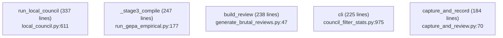
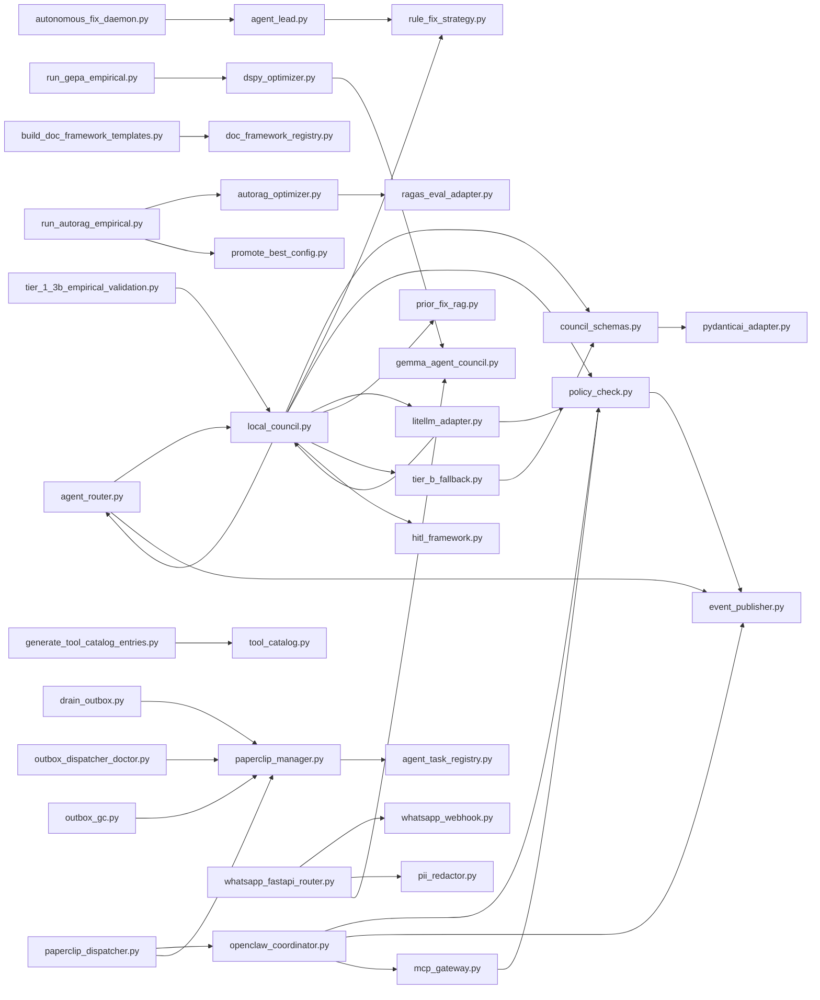
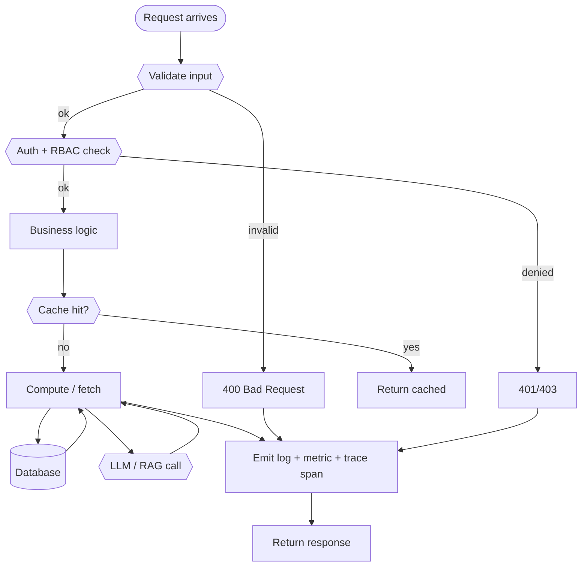
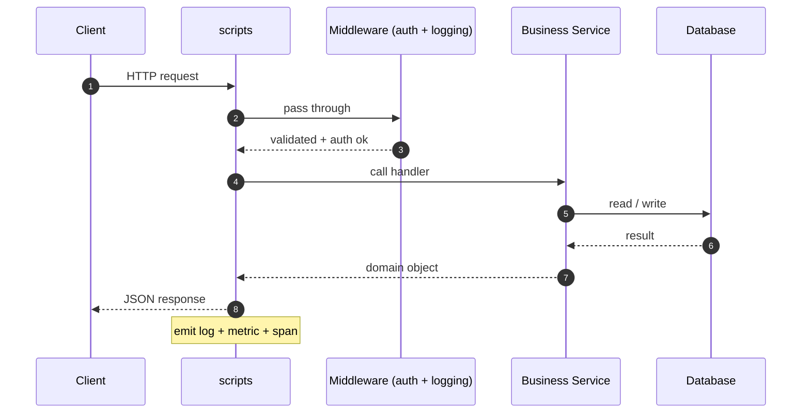
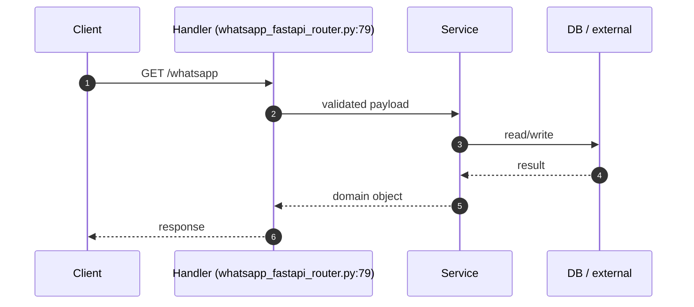
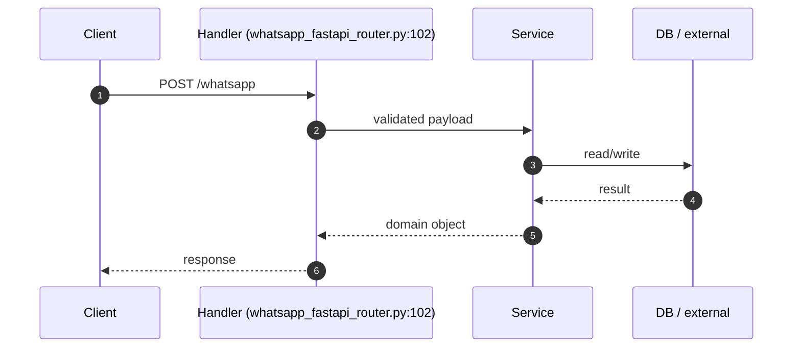
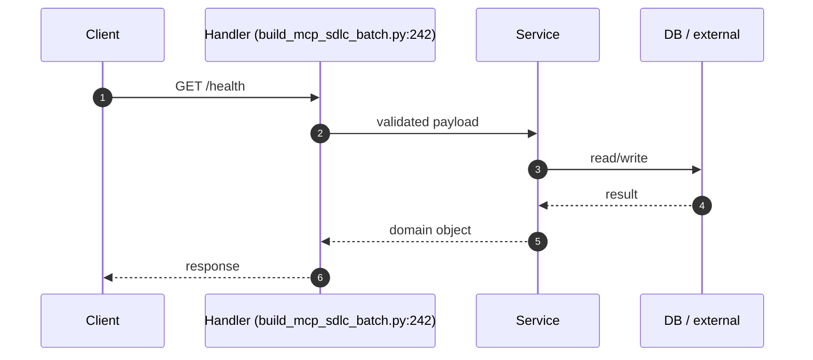
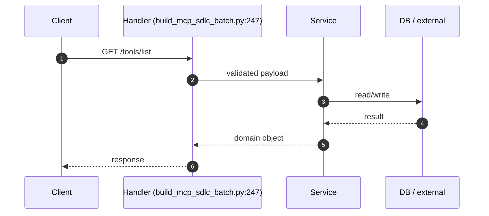
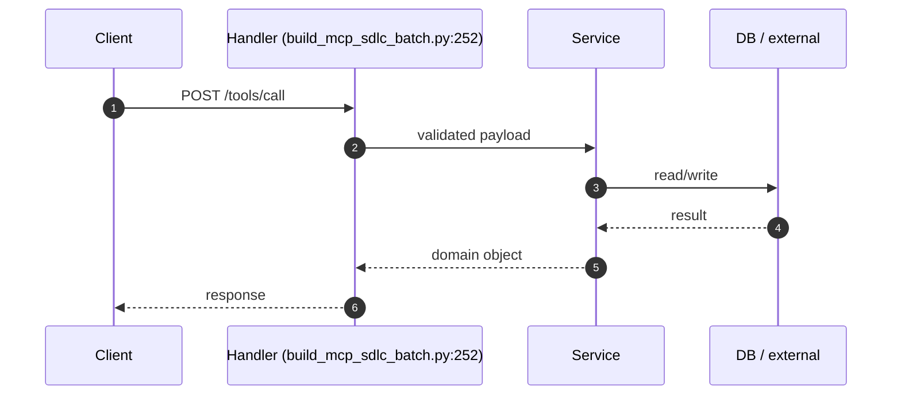

# 📦 `scripts` — Advanced README

🔧 **Scripts**  ·  **Path:** `scripts`  ·  **Generated:** 2026-05-16 19:57 UTC

> _Purpose not detected from docstrings — reviewer to fill._

This README is **auto-generated** by [`scripts/generate_folder_report.py`](../../scripts/generate_folder_report.py). It explains what this folder does, every file inside it, how the files link to each other, every API endpoint, every database call, every test case, and the production controls (security / reliability / performance / observability). Re-run after major changes.

---

## 🔎 Section 0 — Auto-Detected Facts

| Metric | Value |
|---|---|
| Folder | `scripts` |
| Total files | 161 |
| Python files | 118 |
| TypeScript/JS files | 0 |
| Go files | 0 |
| Shell scripts | 35 |
| Lines of code | 41,005 |
| Python classes | 120 |
| Python functions | 1022 |
| Async functions | 42 |
| Total API endpoints | 5 |
| Total DB call sites | 107 |
| DB / Storage libs | Elasticsearch, Kafka (aiokafka), MongoDB (pymongo), Neo4j, Qdrant, Redis, SQLAlchemy, asyncpg, psycopg |
| Concurrency primitives | Lock / RLock, asyncio (async/await), concurrent.futures, threading |
| Caching primitives | functools.cache, in-memory @lru_cache, redis |
| Input validation | Manual escape, Pydantic BaseModel, Pydantic validator |
| AI / LLM deps | Anthropic SDK, DeepEval, Giskard, LangChain, LangGraph, Ollama, OpenAI SDK, OpenTelemetry GenAI, Ragas, Rebuff (PI defense) |
| Test files | 3 |
| Detected test cases | 0 |
| Tests dir present | ❌ — flag |
| Dockerfile | ❌ |
| pyproject.toml | ❌ |
| go.mod | ❌ |
| package.json | ❌ |
| Top git contributors | `216	PraveenAsthana123`, `2	Praveen` |

#### Longest functions (top 5)

| Location | Name | Lines |
|---|---|---|
| `local_council.py:611` | `run_local_council` | 337 |
| `run_gepa_empirical.py:177` | `_stage3_compile` | 247 |
| `generate_brutal_reviews.py:47` | `build_review` | 238 |
| `council_filter_stats.py:975` | `cli` | 225 |
| `capture_and_review.py:70` | `capture_and_record` | 184 |

#### Smells detected (grep heuristics — verify manually)

| Smell | Count |
|---|---|
| hardcoded localhost URL | 90 |
| hardcoded password literal | 1 |
| hardcoded API key literal | 1 |
| TODO/FIXME marker | 13 |


## 1. Purpose — Business + Technical

### Business problem this folder solves

> _Reviewer to fill: one paragraph describing the business need_

### Technical contract this folder exposes

> _Reviewer to fill: API surface, events emitted, data persisted, downstream consumers._

### Out-of-scope (what this folder does NOT do)

> _Reviewer to fill: explicit non-goals — prevents scope creep at review time._


## 2. File Inventory

Every Python file in this folder, with role / classes / functions / LOC / first docstring line. Full absolute paths listed below the table for easy `cat`-ability.

| Relative path | Role (inferred) | Classes | Functions | LOC | Summary |
|---|---|---|---|---|---|
| `advanced_healthcheck.py` | 📄 module | 1 | 18 | 568 | Advanced multi-layer health-check + troubleshoot + tracking tool. |
| `agent_lead.py` | 🤖 agent / tool | 1 | 3 | 249 | Agent-lead-first routing — Tier 1 #1.2 of the autonomous-fix-bot roadmap. |
| `agent_readiness_check.py` | 🤖 agent / tool | 0 | 9 | 405 | Agent readiness check — does the council actually FIX things? (iter-76). |
| `agent_router.py` | 🌐 HTTP router / API endpoints | 2 | 7 | 400 | Agent Router Stage-1 — intent + risk classifier (conservative-default). |
| `agent_task_board.py` | 🤖 agent / tool | 0 | 10 | 404 | Agent Task Board — central status view + drill-gated apply pipeline. |
| `agent_task_registry.py` | 🤖 agent / tool | 0 | 12 | 827 | Unified agent task registry — provider-comparison rollup. |
| `agentic_observability_audit.py` | 🤖 agent / tool | 0 | 2 | 139 | Audit the 35-scenario agentic observability catalog (iter-96). |
| `aiops_retrain_trigger.py` | 📄 module | 1 | 5 | 154 | AIops — automatic retrain-trigger driver. |
| `append_drill_history.py` | 🚀 entry point / app bootstrap | 0 | 4 | 120 | Append .loop/last_drill_outcome.json → .loop/drill_history.jsonl. |
| `audit_verify.py` | 📄 module | 1 | 8 | 360 | audit_verify.py — walk governance.audit_log per tenant and detect tampering. |
| `autonomous_fix_daemon.py` | 📄 module | 0 | 21 | 616 | Autonomous Fix Daemon — always-active issue triage + drill-gated apply. |
| `autorag_optimizer.py` | 📄 module | 5 | 5 | 375 | AutoRAG optimizer — Stage-1 adapter (per CLAUDE.md §56). |
| `best_config_history.py` | ⚙ config / settings | 2 | 5 | 206 | Best-config history reader — Stage-1 audit-trail surface (per §38 + §51). |
| `best_config_loader.py` | ⚙ config / settings | 2 | 8 | 241 | Best-config registry loader — Stage-3 default-on (per ADR-024). |
| `build_doc_framework_templates.py` | 📄 module | 0 | 7 | 391 | Build skeleton + prompt template files referenced by registry.yaml. |
| `build_mcp_sdlc_batch.py` | 📄 module | 0 | 2 | 382 | Build 11 MCP server stubs (P1+P2+P3 SDLC batch) from one config map. |
| `cache_fingerprint.py` | 📄 module | 2 | 5 | 266 | Cache fingerprint helper — Stage-1 (per CLAUDE.md §56). |
| `capture_and_review.py` | 📄 module | 1 | 4 | 343 | Capture the latest git diff + send it through the Sidecar council. |
| `catalog_tools_probe.py` | 🤖 agent / tool | 0 | 11 | 445 | Probe every tool in config/agentic_observability/oss_tooling_catalog.yaml |
| `chatxai_fallback.py` | 📄 module | 0 | 5 | 166 | ChatXAI → ChatOllama fallback CLI when XAI_API_KEY absent. |
| `chunking_quality_audit.py` | 📄 module | 0 | 1 | 130 | Chunking quality catalog audit (iter-99). |
| `chunking_strategy_selector.py` | 📄 module | 2 | 5 | 300 | Chunking strategy selector — Stage-1 adapter (per CLAUDE.md §56). |
| `council_filter_stats.py` | 🪝 middleware / interceptor | 1 | 24 | 1204 | Group council_runs.log entries by outcome / filter reason / risk. |
| `council_schemas.py` | 📋 data model / schema | 1 | 3 | 291 | Pydantic schemas for the local-Ollama issue-fix council. |
| `council_stats_snapshot.py` | 📄 module | 0 | 7 | 280 | Daily council outcome snapshot — append-only JSONL for long-term trends. |
| `crewai_status.py` | 📄 module | 0 | 4 | 90 | CrewAI status gate. |
| `deep_rag_test.py` | 🧪 test | 0 | 5 | 212 | Deep RAG end-to-end test. |
| `doc_framework_registry.py` | 📄 module | 3 | 6 | 390 | Doc-framework registry loader + validator. |
| `drain_outbox.py` | 📄 module | 0 | 3 | 195 | One-shot outbox drain — publishes backlogged ingestion.outbox rows. |
| `drill_catalog_summary.py` | 📄 module | 0 | 7 | 179 | Drill catalog summary — one report for tiering, resource sets, and ratchets. |
| `dspy_optimizer.py` | 📄 module | 1 | 5 | 232 | DSPy 3 + GEPA prompt optimizer — Stage-1 adapter (per CLAUDE.md §56). |
| `e2e_per_tool_report.py` | 💾 repository / data access | 0 | 10 | 400 | End-to-end per-tool integration test harness (iter-90). |
| `empirical_apply_test.py` | 🚀 entry point / app bootstrap | 0 | 6 | 227 | Empirical apply-rate test harness — runs council on synthetic broken file. |
| `eval_quality_status.py` | 📄 module | 0 | 12 | 334 | Advanced offline-safe status for RAGAS, Giskard, and DeepEval. |
| `eval_set_generator.py` | 📄 module | 2 | 8 | 361 | Eval-set auto-generator — Stage-1 adapter (per CLAUDE.md §56). |
| `event_publisher.py` | 📄 module | 0 | 8 | 262 | Stage-1 event-publisher — pushes new-layer audit events to Kafka. |
| `experts.py` | 📄 module | 0 | 5 | 245 | Experts registry — named specialists backed by local Ollama models. |
| `gemma_agent_council.py` | 🤖 agent / tool | 3 | 11 | 446 | Gemma Agent Council — 5-agent orchestrator using local Gemma stack. |
| `generate-grafana-dashboards.py` | 📄 module | 0 | 4 | 354 | Generator for the 15 Grafana dashboards Kiali deep-links to. |
| `generate_brutal_reviews.py` | 📄 module | 0 | 6 | 331 | Generate brutal-review docs for every MCP server (iter-84). |
| `generate_folder_readme.py` | 📄 module | 1 | 18 | 491 | Folder README.md generator — pre-populated from auto-detection. |
| `generate_folder_report.py` | 💾 repository / data access | 4 | 47 | 1429 | Folder-level ADVANCED README generator. |
| `generate_folder_review_report.py` | 💾 repository / data access | 3 | 37 | 928 | Folder-level Manual Code Review Checklist generator. |
| `generate_mesh_manifests.py` | 📄 module | 0 | 5 | 318 | Generate k8s Deployment + Service manifests for each MCP/agent tool (iter-94). |
| `generate_production_review_report.py` | 💾 repository / data access | 3 | 27 | 1438 | Master Production Code Review & Architecture Assessment Checklist generator. |
| `generate_project_readme.py` | 📄 module | 1 | 32 | 630 | Project-level README generator (writes ``README.md`` at repo root). |
| `generate_tool_catalog_entries.py` | 🤖 agent / tool | 0 | 5 | 329 | Generate config/tool_catalog/<ns>.yaml for every MCP server (iter-80). |
| `hitl_drafts_triage.py` | 📄 module | 0 | 7 | 360 | HITL drafts triage report — read-only operator-decision input. |
| `hitl_framework.py` | 📄 module | 1 | 10 | 332 | HITL framework — Human-in-the-loop scoring at every pipeline gate. |
| `human_review_router.py` | 🌐 HTTP router / API endpoints | 1 | 4 | 265 | Human-review router — routes retry-storm ids out of the council loop. |
| `hyde_adapter.py` | 🔌 external service adapter | 2 | 3 | 215 | HyDE (Hypothetical Document Embeddings) adapter — Stage-1 (per §56). |
| `issue_dispatcher.py` | 📄 module | 0 | 9 | 334 | Issue dispatcher — routes each issue from the checklist to its assignee. |
| `issue_scanner.py` | 📄 module | 0 | 9 | 501 | Issue scanner — produces .loop/issue_checklist.jsonl from real signal sources. |
| `lang_observability_status.py` | 📄 module | 0 | 7 | 154 | Lang observability status for LangSmith and Langfuse. |
| `langfuse_tracer.py` | 📄 module | 3 | 6 | 297 | Langfuse tracer — Stage-1 adapter (per CLAUDE.md §56). |
| `litellm_adapter.py` | 🔌 external service adapter | 1 | 6 | 259 | LiteLLM adapter — Stage-1 contract for the call_ollama() swap. |
| `local_council.py` | 📄 module | 2 | 17 | 979 | Local council runner — schema-aware author + critique reviewer + advisor. |
| `loop_status.py` | 📄 module | 0 | 9 | 328 | Loop status — one-shot "is everything fine?" report. |
| `loop_watcher_hook.py` | 📄 module | 0 | 9 | 211 | Post-commit watcher hook - runs LoopWatcher on the latest commit. |
| `mcp_fleet_health.py` | 📄 module | 8 | 16 | 827 | MCP fleet health monitor — classify every installed/configured tool. |
| `mcp_gateway.py` | 🔌 external service adapter | 5 | 9 | 506 | MCP Gateway — Stage-1 allowlist + PolisAI gate + audit for MCP calls. |
| `mcp_gateway_warmup.py` | 🔌 external service adapter | 0 | 2 | 84 | MCP gateway warmup — seed audit rows with latency_ms. |
| `migrate.py` | 📄 module | 0 | 3 | 86 | Migration runner — applies numbered SQL files per service. |
| `native_compute_wrapper.py` | 🚀 entry point / app bootstrap | 4 | 1 | 318 | Native-compute wrapper — Stage-1 adapter for LLVM/MLIR-optimized callables. |
| `notifications.py` | 📄 module | 2 | 7 | 307 | Notifications — Tier 5 #5.13. |
| `observability_triad_status.py` | 📄 module | 0 | 10 | 175 | Offline-safe readiness checker for Jaeger, Prometheus, and Grafana. |
| `ollama_all_models_smoke.py` | 📋 data model / schema | 0 | 6 | 253 | Ollama all-models smoke test (iter-75). |
| `opa_gatekeeper_status.py` | 📄 module | 0 | 7 | 206 | Offline-safe OPA Gatekeeper readiness checker. |
| `openclaw_coordinator.py` | 📄 module | 6 | 7 | 517 | OpenClaw Stage-1 — heavy-autonomy A2A (agent-to-agent) coordinator. |
| `oss_tooling_audit.py` | 🤖 agent / tool | 0 | 1 | 154 | OSS-only tooling catalog audit (iter-97). |
| `outbox_dispatcher_doctor.py` | 📄 module | 0 | 4 | 175 | Outbox dispatcher doctor — diagnose stuck saga dispatcher. |
| `outbox_gc.py` | 📄 module | 0 | 2 | 133 | Outbox garbage collector — delete published rows older than TTL. |
| `outcome_eval.py` | 📄 module | 1 | 12 | 333 | Outcome-based evaluation framework — Tier 4 #4.5. |
| `paperclip_dispatcher.py` | 📄 module | 2 | 4 | 204 | Paperclip Stage-3 — dispatcher composes propose + openclaw.dispatch. |
| `paperclip_manager.py` | 📄 module | 0 | 32 | 1656 | Paperclip Stage-1 — read-only manager-layer aggregator. |
| `pii_redactor.py` | 📄 module | 2 | 5 | 225 | PII redactor — Stage-1 Presidio adapter (per CLAUDE.md §56). |
| `policy_check.py` | 📄 module | 2 | 5 | 349 | Policy Stage-1 — local Rego-shaped policy evaluator. |
| `pr_management.py` | 📄 module | 2 | 8 | 250 | PR management — Tier 5 #5.5. |
| `prior_fix_rag.py` | 📄 module | 1 | 9 | 272 | Prior-fix retrieval — Tier 2 #2.6. |
| `production_readiness_scorecard.py` | 📄 module | 0 | 10 | 420 | Production readiness scorecard — aggregates §38 + §47 + §52 + §53 + §55 (iter-78). |
| `promote_best_config.py` | ⚙ config / settings | 2 | 5 | 278 | Best-config promotion gate — Stage-1 adapter (per CLAUDE.md §38 + §56). |
| `promote_gepa_prompts.py` | 📄 module | 2 | 3 | 324 | GEPA-prompt promotion gate — Stage-4 adapter (per ADR-024-style chain). |
| `prune_council_runs.py` | 📄 module | 0 | 2 | 128 | Prune old advisor_council_runs rows for storage discipline. |
| `prune_loop_logs.py` | 📄 module | 0 | 5 | 212 | Prune old entries from .loop/*.log JSONL files for retention discipline. |
| `pydanticai_adapter.py` | 🔌 external service adapter | 1 | 5 | 164 | PydanticAI adapter — Stage-1 contract for the AUTHOR validator swap. |
| `ragas_eval_adapter.py` | 🔌 external service adapter | 3 | 5 | 364 | RAGAS evaluation adapter — Stage-1 (per CLAUDE.md §56). |
| `ratchet_status.py` | 📄 module | 0 | 13 | 291 | Ratchet status — one-shot survey of the current discipline ratchets. |
| `rebuff_status.py` | 📄 module | 0 | 8 | 226 | Offline-safe Rebuff readiness and prompt-injection smoke scanner. |
| `reflection_engine.py` | 📄 module | 3 | 6 | 403 | Reflection engine — periodic self-critique of recent council decisions. |
| `rego_sync_check.py` | 📄 module | 0 | 4 | 158 | Rego/JSON policy sync checker — Stage-2 scaffold for OPA swap. |
| `render_dashboard.py` | 📄 module | 0 | 7 | 333 | Render a self-contained HTML dashboard for the Sidecar Advisor. |
| `replay_action_draft.py` | 📄 module | 0 | 6 | 354 | Replay or reject governance.action_drafts entries. |
| `replay_council_against_events.py` | 📄 module | 0 | 2 | 162 | Batched replay of the Sidecar council against events captured |
| `replay_verdict_log.py` | 📄 module | 2 | 7 | 254 | Replay .loop/watcher.log: find REJECT verdicts, optionally revert. |
| `review_council.py` | 📄 module | 0 | 8 | 203 | Review tool — surfaces the latest council take per unique issue. |
| `rule_fix_strategy.py` | 📄 module | 1 | 3 | 222 | Per-rule fix-strategy table — Tier 1 #1.3 of the autonomous-fix-bot roadmap. |
| `run_autorag_empirical.py` | 📄 module | 0 | 4 | 294 | End-to-end AutoRAG empirical run — Stage-2 driver (per CLAUDE.md §56). |
| `run_council_batch.py` | 📄 module | 0 | 2 | 104 | Run the 3-model council on every medium-difficulty issue in the checklist. |
| `run_drills.py` | 📄 module | 2 | 12 | 603 | run_drills.py — resource-aware parallel drill runner. |
| `run_gepa_empirical.py` | 📄 module | 0 | 5 | 565 | End-to-end GEPA prompt-optimization run — Stage-2 driver. |
| `runtime_security_status.py` | 📄 module | 0 | 10 | 207 | Offline-safe readiness checker for Wazuh, Tetragon, and Tracee. |
| `scenario_batch_and_inference.py` | 📄 module | 0 | 17 | 834 | End-to-end scenario runner — batch + inference (iter-91). |
| `seed_demo.py` | 📄 module | 0 | 3 | 109 | Seed a demo tenant + sample documents. |
| `show_gepa_status.py` | 📄 module | 0 | 4 | 195 | GEPA chain status reporter — one operator command for the whole pipeline. |
| `smoke_test.py` | 🧪 test | 0 | 1 | 89 | End-to-end smoke test. |
| `stage3_earned_check.py` | 📄 module | 2 | 4 | 323 | Stage-3 default-flip earned-check (per CLAUDE.md §56.3). |
| `sync_tools_catalog.py` | 🤖 agent / tool | 0 | 7 | 272 | Sync MCP server TOOLS lists into governance.tools. |
| `task_manager.py` | 📄 module | 1 | 12 | 305 | Task management — Tier 5 #5.7. |
| `techstack_audit.py` | 📄 module | 0 | 10 | 327 | Empirical techstack audit — checks each tool's actual install status. |
| `tier_1_3b_empirical_validation.py` | 📄 module | 0 | 1 | 142 | Tier 1.3.b empirical validation — historical failure modes vs new gate. |
| `tier_b_fallback.py` | 📄 module | 0 | 4 | 205 | Confidence-gated Tier-B fallback — Tier 2 #2.7. |
| `tool_catalog.py` | 🤖 agent / tool | 1 | 4 | 286 | Tool catalog loader + validator (iter-74). |
| `verifiability_framework.py` | 📄 module | 2 | 4 | 322 | Verifiability framework — Tier 2 #2.11. |
| `warm_council_pool.py` | 📄 module | 0 | 7 | 169 | Warm council pool — keep all 4 Ollama council models RAM-resident. |
| `whatsapp_fastapi_router.py` | 🌐 HTTP router / API endpoints | 0 | 4 | 260 | WhatsApp FastAPI router — Stage-2 wire (per CLAUDE.md §56). |
| `whatsapp_webhook.py` | 🚀 entry point / app bootstrap | 3 | 10 | 310 | WhatsApp webhook gateway — Stage-1 adapter (per CLAUDE.md §56). |
| `write_drill_status.py` | 📄 module | 1 | 5 | 297 | Run a set of drills, capture pass/fail per drill, write status JSON. |

### Absolute paths (clickable)

- `/mnt/deepa/rag/scripts/advanced_healthcheck.py`
- `/mnt/deepa/rag/scripts/agent_lead.py`
- `/mnt/deepa/rag/scripts/agent_readiness_check.py`
- `/mnt/deepa/rag/scripts/agent_router.py`
- `/mnt/deepa/rag/scripts/agent_task_board.py`
- `/mnt/deepa/rag/scripts/agent_task_registry.py`
- `/mnt/deepa/rag/scripts/agentic_observability_audit.py`
- `/mnt/deepa/rag/scripts/aiops_retrain_trigger.py`
- `/mnt/deepa/rag/scripts/append_drill_history.py`
- `/mnt/deepa/rag/scripts/audit_verify.py`
- `/mnt/deepa/rag/scripts/autonomous_fix_daemon.py`
- `/mnt/deepa/rag/scripts/autorag_optimizer.py`
- `/mnt/deepa/rag/scripts/best_config_history.py`
- `/mnt/deepa/rag/scripts/best_config_loader.py`
- `/mnt/deepa/rag/scripts/build_doc_framework_templates.py`
- `/mnt/deepa/rag/scripts/build_mcp_sdlc_batch.py`
- `/mnt/deepa/rag/scripts/cache_fingerprint.py`
- `/mnt/deepa/rag/scripts/capture_and_review.py`
- `/mnt/deepa/rag/scripts/catalog_tools_probe.py`
- `/mnt/deepa/rag/scripts/chatxai_fallback.py`
- `/mnt/deepa/rag/scripts/chunking_quality_audit.py`
- `/mnt/deepa/rag/scripts/chunking_strategy_selector.py`
- `/mnt/deepa/rag/scripts/council_filter_stats.py`
- `/mnt/deepa/rag/scripts/council_schemas.py`
- `/mnt/deepa/rag/scripts/council_stats_snapshot.py`
- `/mnt/deepa/rag/scripts/crewai_status.py`
- `/mnt/deepa/rag/scripts/deep_rag_test.py`
- `/mnt/deepa/rag/scripts/doc_framework_registry.py`
- `/mnt/deepa/rag/scripts/drain_outbox.py`
- `/mnt/deepa/rag/scripts/drill_catalog_summary.py`
- `/mnt/deepa/rag/scripts/dspy_optimizer.py`
- `/mnt/deepa/rag/scripts/e2e_per_tool_report.py`
- `/mnt/deepa/rag/scripts/empirical_apply_test.py`
- `/mnt/deepa/rag/scripts/eval_quality_status.py`
- `/mnt/deepa/rag/scripts/eval_set_generator.py`
- `/mnt/deepa/rag/scripts/event_publisher.py`
- `/mnt/deepa/rag/scripts/experts.py`
- `/mnt/deepa/rag/scripts/gemma_agent_council.py`
- `/mnt/deepa/rag/scripts/generate-grafana-dashboards.py`
- `/mnt/deepa/rag/scripts/generate_brutal_reviews.py`
- `/mnt/deepa/rag/scripts/generate_folder_readme.py`
- `/mnt/deepa/rag/scripts/generate_folder_report.py`
- `/mnt/deepa/rag/scripts/generate_folder_review_report.py`
- `/mnt/deepa/rag/scripts/generate_mesh_manifests.py`
- `/mnt/deepa/rag/scripts/generate_production_review_report.py`
- `/mnt/deepa/rag/scripts/generate_project_readme.py`
- `/mnt/deepa/rag/scripts/generate_tool_catalog_entries.py`
- `/mnt/deepa/rag/scripts/hitl_drafts_triage.py`
- `/mnt/deepa/rag/scripts/hitl_framework.py`
- `/mnt/deepa/rag/scripts/human_review_router.py`
- `/mnt/deepa/rag/scripts/hyde_adapter.py`
- `/mnt/deepa/rag/scripts/issue_dispatcher.py`
- `/mnt/deepa/rag/scripts/issue_scanner.py`
- `/mnt/deepa/rag/scripts/lang_observability_status.py`
- `/mnt/deepa/rag/scripts/langfuse_tracer.py`
- `/mnt/deepa/rag/scripts/litellm_adapter.py`
- `/mnt/deepa/rag/scripts/local_council.py`
- `/mnt/deepa/rag/scripts/loop_status.py`
- `/mnt/deepa/rag/scripts/loop_watcher_hook.py`
- `/mnt/deepa/rag/scripts/mcp_fleet_health.py`
- `/mnt/deepa/rag/scripts/mcp_gateway.py`
- `/mnt/deepa/rag/scripts/mcp_gateway_warmup.py`
- `/mnt/deepa/rag/scripts/migrate.py`
- `/mnt/deepa/rag/scripts/native_compute_wrapper.py`
- `/mnt/deepa/rag/scripts/notifications.py`
- `/mnt/deepa/rag/scripts/observability_triad_status.py`
- `/mnt/deepa/rag/scripts/ollama_all_models_smoke.py`
- `/mnt/deepa/rag/scripts/opa_gatekeeper_status.py`
- `/mnt/deepa/rag/scripts/openclaw_coordinator.py`
- `/mnt/deepa/rag/scripts/oss_tooling_audit.py`
- `/mnt/deepa/rag/scripts/outbox_dispatcher_doctor.py`
- `/mnt/deepa/rag/scripts/outbox_gc.py`
- `/mnt/deepa/rag/scripts/outcome_eval.py`
- `/mnt/deepa/rag/scripts/paperclip_dispatcher.py`
- `/mnt/deepa/rag/scripts/paperclip_manager.py`
- `/mnt/deepa/rag/scripts/pii_redactor.py`
- `/mnt/deepa/rag/scripts/policy_check.py`
- `/mnt/deepa/rag/scripts/pr_management.py`
- `/mnt/deepa/rag/scripts/prior_fix_rag.py`
- `/mnt/deepa/rag/scripts/production_readiness_scorecard.py`
- `/mnt/deepa/rag/scripts/promote_best_config.py`
- `/mnt/deepa/rag/scripts/promote_gepa_prompts.py`
- `/mnt/deepa/rag/scripts/prune_council_runs.py`
- `/mnt/deepa/rag/scripts/prune_loop_logs.py`
- `/mnt/deepa/rag/scripts/pydanticai_adapter.py`
- `/mnt/deepa/rag/scripts/ragas_eval_adapter.py`
- `/mnt/deepa/rag/scripts/ratchet_status.py`
- `/mnt/deepa/rag/scripts/rebuff_status.py`
- `/mnt/deepa/rag/scripts/reflection_engine.py`
- `/mnt/deepa/rag/scripts/rego_sync_check.py`
- `/mnt/deepa/rag/scripts/render_dashboard.py`
- `/mnt/deepa/rag/scripts/replay_action_draft.py`
- `/mnt/deepa/rag/scripts/replay_council_against_events.py`
- `/mnt/deepa/rag/scripts/replay_verdict_log.py`
- `/mnt/deepa/rag/scripts/review_council.py`
- `/mnt/deepa/rag/scripts/rule_fix_strategy.py`
- `/mnt/deepa/rag/scripts/run_autorag_empirical.py`
- `/mnt/deepa/rag/scripts/run_council_batch.py`
- `/mnt/deepa/rag/scripts/run_drills.py`
- `/mnt/deepa/rag/scripts/run_gepa_empirical.py`
- `/mnt/deepa/rag/scripts/runtime_security_status.py`
- `/mnt/deepa/rag/scripts/scenario_batch_and_inference.py`
- `/mnt/deepa/rag/scripts/seed_demo.py`
- `/mnt/deepa/rag/scripts/show_gepa_status.py`
- `/mnt/deepa/rag/scripts/smoke_test.py`
- `/mnt/deepa/rag/scripts/stage3_earned_check.py`
- `/mnt/deepa/rag/scripts/sync_tools_catalog.py`
- `/mnt/deepa/rag/scripts/task_manager.py`
- `/mnt/deepa/rag/scripts/techstack_audit.py`
- `/mnt/deepa/rag/scripts/tier_1_3b_empirical_validation.py`
- `/mnt/deepa/rag/scripts/tier_b_fallback.py`
- `/mnt/deepa/rag/scripts/tool_catalog.py`
- `/mnt/deepa/rag/scripts/verifiability_framework.py`
- `/mnt/deepa/rag/scripts/warm_council_pool.py`
- `/mnt/deepa/rag/scripts/whatsapp_fastapi_router.py`
- `/mnt/deepa/rag/scripts/whatsapp_webhook.py`
- `/mnt/deepa/rag/scripts/write_drill_status.py`


## 3. C4 Model — Context / Container / Component / Code

### Level 1 — System Context

_Where does this folder sit in the broader system?_


### Level 2 — Container

_What external dependencies does this folder talk to?_

```mermaid
flowchart TB
    subgraph scripts
        Code[Source Code]
    end
    Code --> DB_0[("Elasticsearch")]
    Code --> DB_1[("Kafka (aiokafka)")]
    Code --> DB_2[("MongoDB (pymongo)")]
    Code --> DB_3[("Neo4j")]
    Code --> DB_4[("Qdrant")]
    Code --> DB_5[("Redis")]
    Code --> DB_6[("SQLAlchemy")]
    Code --> DB_7[("asyncpg")]
    Code --> DB_8[("psycopg")]
    Code --> AI_0{{LLM: Anthropic SDK}}
    Code --> AI_1{{LLM: DeepEval}}
    Code --> AI_2{{LLM: Giskard}}
    Code --> AI_3{{LLM: LangChain}}
    Code --> AI_4{{LLM: LangGraph}}
    Code --> AI_5{{LLM: Ollama}}
    Code --> AI_6{{LLM: OpenAI SDK}}
    Code --> AI_7{{LLM: OpenTelemetry GenAI}}
    Code --> AI_8{{LLM: Ragas}}
    Code --> AI_9{{LLM: Rebuff (PI defense)}}
```

### Level 3 — Component

_Internal files grouped by inferred role._

```mermaid
flowchart TB
    subgraph __module["📄 module"]
        advanced_healthcheck_py["advanced_healthcheck.py"]
        aiops_retrain_trigger_py["aiops_retrain_trigger.py"]
        audit_verify_py["audit_verify.py"]
        autonomous_fix_daemon_py["autonomous_fix_daemon.py"]
        autorag_optimizer_py["autorag_optimizer.py"]
        build_doc_framework_templates_py["build_doc_framework_templates.py"]
        more___module["... +75 more"]
    end
    subgraph __agent___tool["🤖 agent / tool"]
        agent_lead_py["agent_lead.py"]
        agent_readiness_check_py["agent_readiness_check.py"]
        agent_task_board_py["agent_task_board.py"]
        agent_task_registry_py["agent_task_registry.py"]
        agentic_observability_audit_py["agentic_observability_audit.py"]
        catalog_tools_probe_py["catalog_tools_probe.py"]
        more___agent___tool["... +5 more"]
    end
    subgraph __HTTP_router___API_endpoints["🌐 HTTP router / API endpoints"]
        agent_router_py["agent_router.py"]
        human_review_router_py["human_review_router.py"]
        whatsapp_fastapi_router_py["whatsapp_fastapi_router.py"]
    end
    subgraph __entry_point___app_bootstrap["🚀 entry point / app bootstrap"]
        append_drill_history_py["append_drill_history.py"]
        empirical_apply_test_py["empirical_apply_test.py"]
        native_compute_wrapper_py["native_compute_wrapper.py"]
        whatsapp_webhook_py["whatsapp_webhook.py"]
    end
    subgraph __config___settings["⚙ config / settings"]
        best_config_history_py["best_config_history.py"]
        best_config_loader_py["best_config_loader.py"]
        promote_best_config_py["promote_best_config.py"]
    end
    subgraph __middleware___interceptor["🪝 middleware / interceptor"]
        council_filter_stats_py["council_filter_stats.py"]
    end
    subgraph __data_model___schema["📋 data model / schema"]
        council_schemas_py["council_schemas.py"]
        ollama_all_models_smoke_py["ollama_all_models_smoke.py"]
    end
    subgraph __test["🧪 test"]
        deep_rag_test_py["deep_rag_test.py"]
        smoke_test_py["smoke_test.py"]
    end
    subgraph __repository___data_access["💾 repository / data access"]
        e2e_per_tool_report_py["e2e_per_tool_report.py"]
        generate_folder_report_py["generate_folder_report.py"]
        generate_folder_review_report_py["generate_folder_review_report.py"]
        generate_production_review_report_py["generate_production_review_report.py"]
    end
    subgraph __external_service_adapter["🔌 external service adapter"]
        hyde_adapter_py["hyde_adapter.py"]
        litellm_adapter_py["litellm_adapter.py"]
        mcp_gateway_py["mcp_gateway.py"]
        mcp_gateway_warmup_py["mcp_gateway_warmup.py"]
        pydanticai_adapter_py["pydanticai_adapter.py"]
        ragas_eval_adapter_py["ragas_eval_adapter.py"]
    end
```



### Level 4 — Code (top hotspots)

_Longest functions — these are the most likely refactor candidates._




## 4. Code Sequence — How Files Link to Each Other

**Import graph for files in this folder.** Reading order: start at any entry-point file (look for `🚀 entry point` role in the inventory above), then follow the arrows.



### Edge list

| From file | To file | Import-count |
|---|---|---|
| `run_gepa_empirical.py` | `dspy_optimizer.py` | 5 |
| `whatsapp_fastapi_router.py` | `whatsapp_webhook.py` | 5 |
| `council_schemas.py` | `pydanticai_adapter.py` | 2 |
| `litellm_adapter.py` | `policy_check.py` | 2 |
| `local_council.py` | `agent_router.py` | 2 |
| `local_council.py` | `council_schemas.py` | 2 |
| `local_council.py` | `litellm_adapter.py` | 2 |
| `local_council.py` | `policy_check.py` | 2 |
| `mcp_gateway.py` | `policy_check.py` | 2 |
| `openclaw_coordinator.py` | `mcp_gateway.py` | 2 |
| `openclaw_coordinator.py` | `policy_check.py` | 2 |
| `paperclip_dispatcher.py` | `openclaw_coordinator.py` | 2 |
| `paperclip_manager.py` | `agent_task_registry.py` | 2 |
| `agent_lead.py` | `rule_fix_strategy.py` | 1 |
| `agent_router.py` | `event_publisher.py` | 1 |
| `agent_router.py` | `local_council.py` | 1 |
| `autonomous_fix_daemon.py` | `agent_lead.py` | 1 |
| `autorag_optimizer.py` | `ragas_eval_adapter.py` | 1 |
| `build_doc_framework_templates.py` | `doc_framework_registry.py` | 1 |
| `drain_outbox.py` | `paperclip_manager.py` | 1 |
| `dspy_optimizer.py` | `gemma_agent_council.py` | 1 |
| `generate_tool_catalog_entries.py` | `tool_catalog.py` | 1 |
| `litellm_adapter.py` | `local_council.py` | 1 |
| `local_council.py` | `hitl_framework.py` | 1 |
| `local_council.py` | `prior_fix_rag.py` | 1 |
| `local_council.py` | `rule_fix_strategy.py` | 1 |
| `local_council.py` | `tier_b_fallback.py` | 1 |
| `openclaw_coordinator.py` | `event_publisher.py` | 1 |
| `outbox_dispatcher_doctor.py` | `paperclip_manager.py` | 1 |
| `outbox_gc.py` | `paperclip_manager.py` | 1 |
| `paperclip_dispatcher.py` | `paperclip_manager.py` | 1 |
| `policy_check.py` | `event_publisher.py` | 1 |
| `run_autorag_empirical.py` | `autorag_optimizer.py` | 1 |
| `run_autorag_empirical.py` | `promote_best_config.py` | 1 |
| `tier_1_3b_empirical_validation.py` | `local_council.py` | 1 |
| `tier_b_fallback.py` | `council_schemas.py` | 1 |
| `whatsapp_fastapi_router.py` | `gemma_agent_council.py` | 1 |
| `whatsapp_fastapi_router.py` | `pii_redactor.py` | 1 |


## 5. Request Flowchart

Generic request lifecycle for this folder. Branches that don't apply are auto-removed based on detected dependencies (DB / cache / LLM).




## 6. API Endpoints — Input / Process / Output

**Detected endpoints:** 5

| Method | Route | Defined in | Input (schema) | Process (summary) | Output (schema) |
|---|---|---|---|---|---|
| `GET` | `/whatsapp` | `whatsapp_fastapi_router.py:79` | _TBD_ | _TBD_ | _TBD_ |
| `POST` | `/whatsapp` | `whatsapp_fastapi_router.py:102` | _TBD_ | _TBD_ | _TBD_ |
| `GET` | `/health` | `build_mcp_sdlc_batch.py:242` | _TBD_ | _TBD_ | _TBD_ |
| `GET` | `/tools/list` | `build_mcp_sdlc_batch.py:247` | _TBD_ | _TBD_ | _TBD_ |
| `POST` | `/tools/call` | `build_mcp_sdlc_batch.py:252` | _TBD_ | _TBD_ | _TBD_ |

_Reviewer fills the last three columns from the Pydantic models in the handler. Auto-extraction of Pydantic schemas is on the roadmap._


## 7. Sequence Diagrams per Endpoint

### Generic flow (all endpoints)



### Per-endpoint sequence stubs (top 5)

### `GET /whatsapp` (whatsapp_fastapi_router.py:79)



### `POST /whatsapp` (whatsapp_fastapi_router.py:102)



### `GET /health` (build_mcp_sdlc_batch.py:242)



### `GET /tools/list` (build_mcp_sdlc_batch.py:247)



### `POST /tools/call` (build_mcp_sdlc_batch.py:252)




## 8. Database Layer

**DB / storage libraries:** Elasticsearch, Kafka (aiokafka), MongoDB (pymongo), Neo4j, Qdrant, Redis, SQLAlchemy, asyncpg, psycopg

**Total DB call sites:** 107

| Pattern | Count |
|---|---|
| `execute` | 26 |
| `fetch/fetchall/fetchrow` | 34 |
| `ORM CRUD` | 41 |
| `MongoDB` | 6 |

### Query Optimization checklist

| Check | Status (✓/✗/⚠) | Notes |
|---|---|---|
| Indexes on every WHERE / ORDER BY column | — | EXPLAIN ANALYZE hot paths |
| Full table scans avoided | — | — |
| Batch operations used (not N writes in a loop) | — | — |
| Parameterized queries (NEVER f-string SQL) | — | — |

### Transactions (ACID)

| Check | Status (✓/✗/⚠) | Notes |
|---|---|---|
| Transaction boundaries narrow (no HTTP / LLM inside) | — | — |
| Rollback on exception | — | — |
| Isolation level documented (READ COMMITTED / SERIALIZABLE) | — | — |
| Deadlock prevention strategy | — | — |

### N+1 Query Findings (reviewer to fill)

| Endpoint / Function | Suspect Loop | Est. Queries / Request | Fix |
|---|---|---|---|
| — | — | — | — |


## 9. Code Quality + Complexity

### Readability

| Check | Status (✓/✗/⚠) | Notes |
|---|---|---|
| Clear variable / function / class names | — | — |
| No misleading naming (no `tmp` / `xyz` / `foo`) | — | — |
| Small focused functions (≤ 50 lines) | — | 5 > 50 lines (see Section 0) |
| Avoid deeply nested conditions (≤ 4 levels) | — | — |

### Clean code

| Check | Status (✓/✗/⚠) | Notes |
|---|---|---|
| No dead / commented-out code | — | — |
| No `print()` — use logger | — | — |
| No hardcoded values | — | smell count: 105 |
| Constants extracted to a settings module | — | — |

### Complexity

| Check | Status (✓/✗/⚠) | Notes |
|---|---|---|
| Long methods broken down | — | — |
| No overengineering (premature abstractions) | — | — |
| Cyclomatic complexity ≤ 15 per function | — | run `ruff complexity` or `radon` |


## 10. Security Review

### Authentication & Authorization

| Check | Status (✓/✗/⚠) | Notes |
|---|---|---|
| Authentication implemented correctly | — | Bearer / JWT / session |
| Authorization (RBAC / ABAC) checks | — | no client-side trust |
| Tokens validated server-side every request | — | rotate, expire, revoke |

### OWASP Top 10

| Check | Status (✓/✗/⚠) | Notes |
|---|---|---|
| Request validation present | — | sanitization: Manual escape, Pydantic BaseModel, Pydantic validator |
| SQL injection prevention | — | DB libs: Elasticsearch, Kafka (aiokafka), MongoDB (pymongo), Neo4j, Qdrant, Redis, SQLAlchemy, asyncpg, psycopg — parameterized queries only |
| XSS / CSRF prevention | — | output encoding / CSP / SameSite |
| Path traversal prevention | — | no user input concatenated to file paths |
| Prompt injection prevention | — | Rebuff / output filter |

### Secret Management

| Check | Status (✓/✗/⚠) | Notes |
|---|---|---|
| No secrets in code | — | smell count: 1 password literals, 1 api key literals |
| Env vars / Vault used | — | Pydantic BaseSettings or env reader |
| Secret rotation strategy | — | documented in runbook |

### Sensitive Data

| Check | Status (✓/✗/⚠) | Notes |
|---|---|---|
| PII masked in logs | — | structured logger with field redaction |
| Encryption in transit (TLS) | — | — |
| Encryption at rest (DB / object store) | — | — |
| GDPR — retention + right-to-be-forgotten | — | — |


## 11. Performance Review

### Memory

| Check | Status (✓/✗/⚠) | Notes |
|---|---|---|
| Large object retention avoided | — | — |
| Streaming for large files / data | — | — |
| Caches bounded (LRU / TTL) | — | caching: functools.cache, in-memory @lru_cache, redis |

### Concurrency

| Check | Status (✓/✗/⚠) | Notes |
|---|---|---|
| Thread safety validated | — | primitives: Lock / RLock, asyncio (async/await), concurrent.futures, threading |
| Race conditions prevented | — | — |
| Deadlocks avoided (lock ordering) | — | — |
| Parallel processing where beneficial | — | 42 async fns |

### Latency

| Check | Status (✓/✗/⚠) | Notes |
|---|---|---|
| External API calls batched / cached | — | — |
| Timeouts on every external call | — | — |
| No blocking I/O inside async functions | — | — |


## 12. Reliability & Observability

### Failure Handling

| Check | Status (✓/✗/⚠) | Notes |
|---|---|---|
| Retry (bounded + exp backoff + jitter) | — | — |
| Circuit breaker around external deps | — | — |
| Graceful degradation | — | — |

### Timeout Handling

| Check | Status (✓/✗/⚠) | Notes |
|---|---|---|
| Timeout on every external call (HTTP / DB / subprocess) | — | — |
| No infinite waits | — | — |

### Observability

| Check | Status (✓/✗/⚠) | Notes |
|---|---|---|
| Structured (JSON) logging | — | correlation_id + tenant_id + request_id |
| Metrics (RED: rate / errors / duration) | — | — |
| Tracing (OpenTelemetry → Jaeger / Tempo) | — | — |
| Baggage propagation across services | — | — |


## 13. Test Cases

**Test files detected:** 3
_No `test_*` functions parsed via AST. Either tests live elsewhere or names don't match the `test_*` convention._


## 14. Logging & Monitoring

### Logging

| Check | Status (✓/✗/⚠) | Notes |
|---|---|---|
| Structured (JSON) logs | — | — |
| Correlation ID present | — | — |
| No PII / secrets in log lines | — | — |
| No excessive logging (no logs in hot loops) | — | — |

### Monitoring

| Check | Status (✓/✗/⚠) | Notes |
|---|---|---|
| Alerts defined (SLO-burn aware) | — | — |
| Dashboards exist (Grafana) | — | — |
| On-call playbook references | — | — |


## 15. LLM / GenAI / RAG

**Detected AI deps:** Anthropic SDK, DeepEval, Giskard, LangChain, LangGraph, Ollama, OpenAI SDK, OpenTelemetry GenAI, Ragas, Rebuff (PI defense)

### Prompt Safety

| Check | Status (✓/✗/⚠) | Notes |
|---|---|---|
| Prompt injection handling (input filter) | — | Rebuff |
| Output sanitization | — | — |
| Prompt versioning in registry | — | — |
| Toxicity / bias filtering | — | — |

### RAG Quality

| Check | Status (✓/✗/⚠) | Notes |
|---|---|---|
| Chunking strategy validated (size + overlap) | — | — |
| Embedding model versioned (re-embed on bump) | — | — |
| Vector DB query optimized (recall@k measured) | — | — |
| Metadata filtering exists (per-tenant) | — | — |

### Cost

| Check | Status (✓/✗/⚠) | Notes |
|---|---|---|
| Model fallback strategy defined | — | — |
| Token usage minimized (cache / truncation) | — | — |
| Per-tenant cost ceiling enforced | — | — |

### Explainability / Responsible AI

| Check | Status (✓/✗/⚠) | Notes |
|---|---|---|
| Citation / source grounding (every claim cited) | — | — |
| Confidence scoring (Ragas / DeepEval) | — | Ragas |
| Decision audit row per prediction (§48) | — | — |
| Fairness / bias checks | — | — |


## 16. SOLID + Microservice Principles

### SOLID

| Check | Status (✓/✗/⚠) | Notes |
|---|---|---|
| S — Single Responsibility (one reason to change per class) | — | — |
| O — Open/Closed (extend via composition, not modification) | — | — |
| L — Liskov Substitution (subclasses honor contracts) | — | — |
| I — Interface Segregation (no fat interfaces) | — | — |
| D — Dependency Inversion (depend on abstractions) | — | — |

### Microservice

| Check | Status (✓/✗/⚠) | Notes |
|---|---|---|
| Single business capability | — | — |
| Bounded context (no domain bleed) | — | — |
| Independent deploy (no coupled releases) | — | — |
| Resilience patterns (CB / retry / bulkhead) | — | — |


## 17. Integration with Other Folders

### Internal — other folders in this repo

| Folder / Module | Import-count | Purpose |
|---|---|---|
| `scripts/paperclip_manager` | 3 | _reviewer-described_ |
| `approval_agent` | 3 | _reviewer-described_ |
| `app/eval_harness` | 2 | _reviewer-described_ |
| `documind_core/rebuff_detector` | 2 | _reviewer-described_ |
| `libs/py` | 1 | _reviewer-described_ |
| `documind_core/kafka_client` | 1 | _reviewer-described_ |
| `scripts` | 1 | _reviewer-described_ |
| `documind_core` | 1 | _reviewer-described_ |
| `app/agents` | 1 | _reviewer-described_ |
| `app/langgraph_flow` | 1 | _reviewer-described_ |
| `app/models` | 1 | _reviewer-described_ |

### External — third-party packages

| Package | Import-count |
|---|---|
| `urllib` | 29 |
| `asyncpg` | 22 |
| `importlib` | 17 |
| `yaml` | 13 |
| `httpx` | 8 |
| `policy_check` | 8 |
| `dspy` | 7 |
| `pydantic` | 6 |
| `sqlite3` | 5 |
| `ragas` | 5 |
| `dspy_optimizer` | 5 |
| `whatsapp_webhook` | 5 |
| `opentelemetry` | 4 |
| `local_council` | 3 |
| `event_publisher` | 3 |
| `langfuse` | 3 |
| `litellm` | 3 |
| `council_schemas` | 3 |
| `pydantic_ai` | 3 |
| `rule_fix_strategy` | 2 |


## 18. Debugging Guide

### Step-by-step when something breaks

```
1. Tail logs:        tail -50 /tmp/scripts.log   (if host-side)
                     docker logs documind-scripts --tail=50   (if container)
2. Health probe:     curl http://localhost:<PORT>/health
3. Fleet probe:      python3 scripts/advanced_healthcheck.py --layer app
4. Trace:            Open Jaeger → search request_id → see span tree
5. Metrics:          Open Grafana → service dashboard → look for spike
6. Drill:            ls mcp/tests/drill_*scripts*.py and run
```

### Common failure modes

| Symptom | Likely cause | Fix |
|---|---|---|
| 502 / connection refused | service down | check `circuitrag-status.sh` |
| Slow p95 latency | DB N+1 or LLM throttle | Section 8 + Section 15 |
| 5xx spike | downstream dep down | check `/health/upstreams` |
| Memory growth | unbounded cache or closure leak | Section 11 |
| Wrong-tenant data | RLS bypass | tenant isolation drill |


## 19. Production Gates (hard pass/fail)

| Gate | Target | Status | Evidence |
|---|---|---|---|
| Code coverage ≥ 80% | statements + branches | — | — |
| Naming convention enforced | ruff / eslint | — | — |
| Zero critical CVEs | Trivy / Bandit | — | — |
| No hardcoded secrets | gitleaks | — | — |
| No memory leaks | bounded caches | — | smells: 105 |
| No N+1 queries | hot paths reviewed | — | 107 DB call sites |
| All APIs validated | Pydantic / Zod | — | sanitization: Manual escape, Pydantic BaseModel, Pydantic validator |
| Duplicate logic eliminated | DRY check | — | — |
| Structured logging with correlation_id | — | — | — |
| Distributed tracing wired | OpenTelemetry | — | — |
| For AI: prompt injection tested | Rebuff / Garak | — | AI deps present |
| For AI: hallucination scoring ≥ 0.85 | Ragas faithfulness | — | yes |


## 20. Final Production Readiness Score

| Area | Score (/10) |
|---|---|
| Architecture | — |
| Security | — |
| Performance | — |
| Reliability | — |
| Observability | — |
| Testing | — |
| Scalability | — |
| AI Safety | — |
| DevOps | — |
| Maintainability | — |
| **Total** | **— / 100** |

### Decision

- [ ] **GO** — Production-ready (≥80, no failed gates)
- [ ] **CONDITIONAL GO** — Ship with documented follow-ups (≥60)
- [ ] **NO-GO** — Block release (any critical-red gate, or <60)

### Critical blockers

1. _TBD_

### Follow-ups (post-ship)

| ID | Description | Owner | Due |
|---|---|---|---|
| — | — | — | — |

### Sign-off

| Role | Name | Date | Signature |
|---|---|---|---|
| Tech Lead | — | — | — |
| Security | — | — | — |
| SRE | — | — | — |

---

_Generated by `scripts/generate_folder_report.py`. Re-run after major folder changes:_
_`python3 scripts/generate_folder_report.py --folder <this-folder> --force`_
