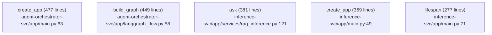
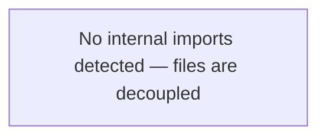
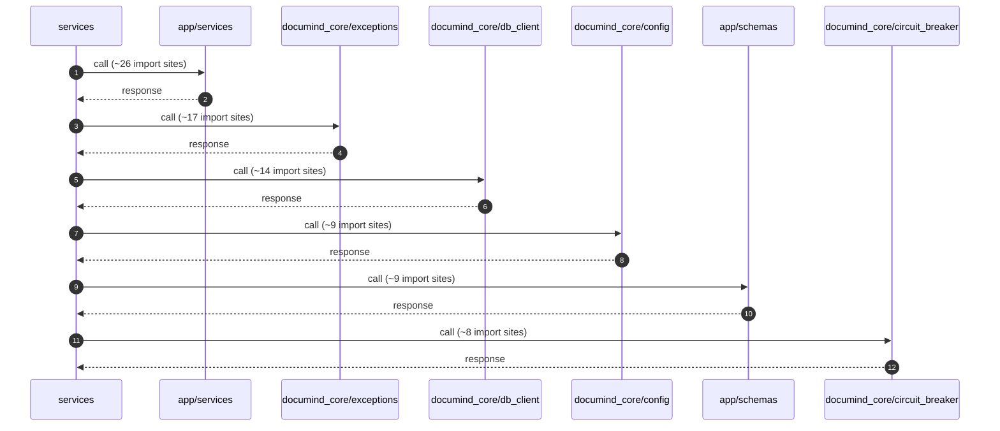
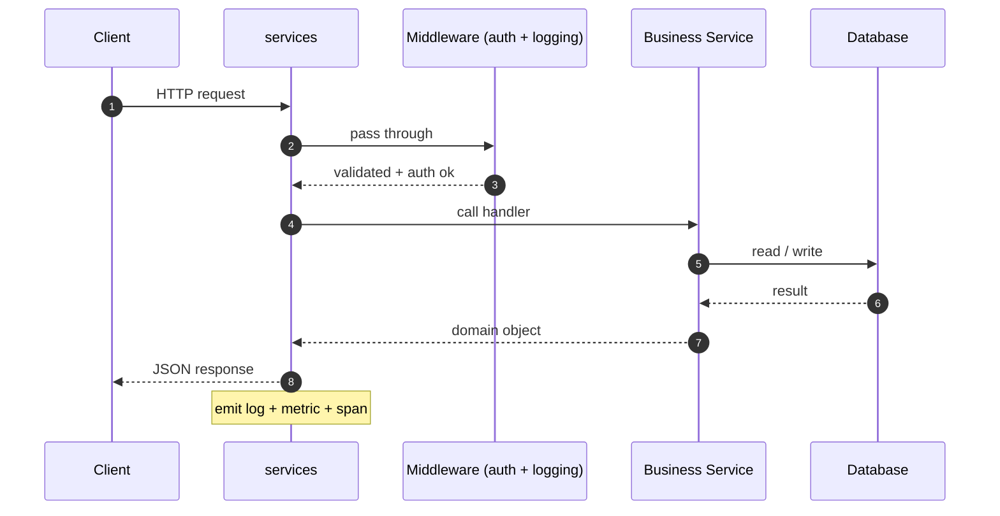
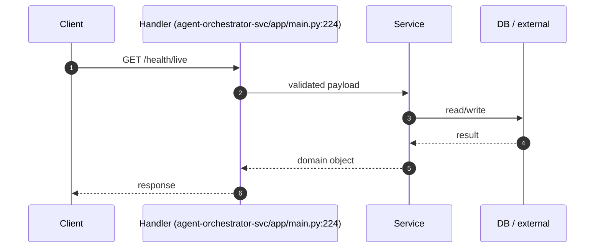
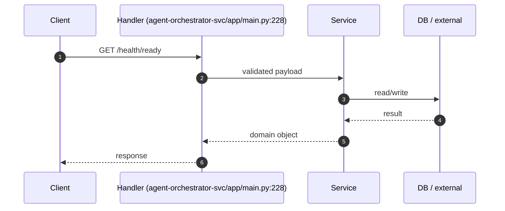
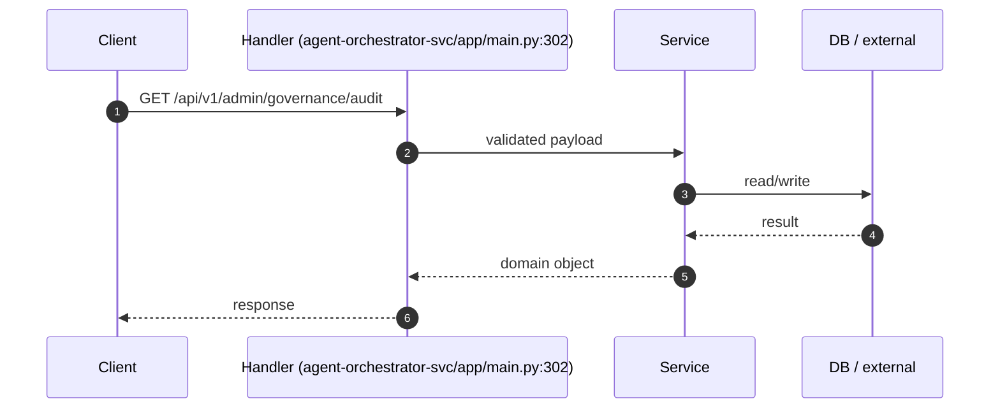
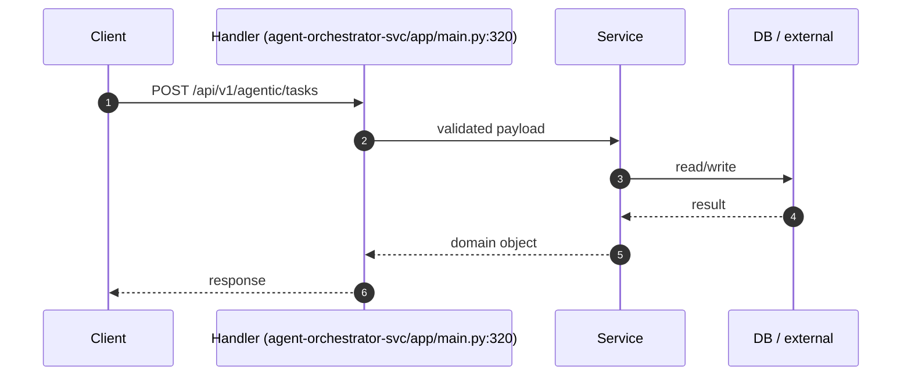

# 📦 `services` — Advanced README

  ·  **Path:** `services`  ·  **Generated:** 2026-05-16 20:30 UTC

> _Purpose not detected from docstrings — reviewer to fill._

This README is **auto-generated** by [`scripts/generate_folder_report.py`](../../scripts/generate_folder_report.py). It explains what this folder does, every file inside it, how the files link to each other, every API endpoint, every database call, every test case, and the production controls (security / reliability / performance / observability). Re-run after major changes.

---

## 🔎 Section 0 — Auto-Detected Facts

| Metric | Value |
|---|---|
| Folder | `services` |
| Total files | 2289 |
| Python files | 191 |
| TypeScript/JS files | 346 |
| Go files | 17 |
| Shell scripts | 32 |
| Lines of code | 174,015 |
| Python classes | 209 |
| Python functions | 651 |
| Async functions | 303 |
| Total API endpoints | 34 |
| Total DB call sites | 1785 |
| DB / Storage libs | Elasticsearch, Kafka (aiokafka), Neo4j, Prisma, Qdrant, Redis, SQLAlchemy, asyncpg, psycopg |
| Concurrency primitives | Lock / RLock, asyncio (async/await), concurrent.futures, multiprocessing, threading |
| Caching primitives | in-memory @lru_cache, redis |
| Input validation | Manual escape, Pydantic BaseModel, Zod (TS) |
| AI / LLM deps | Anthropic SDK, DeepEval, Giskard, LangChain, LangGraph, Ollama, OpenAI SDK, OpenTelemetry GenAI, Ragas, Rebuff (PI defense) |
| Test files | 2894 |
| Detected test cases | 14 |
| Tests dir present | ✅ |
| Dockerfile | ❌ |
| pyproject.toml | ❌ |
| go.mod | ❌ |
| package.json | ❌ |
| Top git contributors | `352	PraveenAsthana123`, `8	Praveen` |

#### Longest functions (top 5)

| Location | Name | Lines |
|---|---|---|
| `agent-orchestrator-svc/app/main.py:63` | `create_app` | 477 |
| `agent-orchestrator-svc/app/langgraph_flow.py:58` | `build_graph` | 449 |
| `inference-svc/app/services/rag_inference.py:121` | `ask` | 381 |
| `inference-svc/app/main.py:49` | `create_app` | 369 |
| `inference-svc/app/main.py:71` | `lifespan` | 277 |

#### Smells detected (grep heuristics — verify manually)

| Smell | Count |
|---|---|
| hardcoded localhost URL | 130 |
| hardcoded password literal | 2 |
| TODO/FIXME marker | 1062 |


## 1. Purpose — Business + Technical

### Business problem this folder solves

> _Reviewer to fill: one paragraph describing the business need_

### Technical contract this folder exposes

> _Reviewer to fill: API surface, events emitted, data persisted, downstream consumers._

### Out-of-scope (what this folder does NOT do)

> _Reviewer to fill: explicit non-goals — prevents scope creep at review time._


## 🗺 How to Read This Folder (Guided Tour)

Read these files in order — by the end, you'll understand 80% of this folder's behavior. Click any path to jump straight to the source.

1. **`agent-orchestrator-svc/app/main.py`** (🚀 entry point / app bootstrap, 543 LOC) — App boot wiring — middleware stack, router registration, lifespan startup, DI container setup.
2. **`inference-svc/app/main.py`** (🚀 entry point / app bootstrap, 421 LOC) — App boot wiring — middleware stack, router registration, lifespan startup, DI container setup.
3. **`evaluation-svc/app/main.py`** (🚀 entry point / app bootstrap, 331 LOC) — App boot wiring — middleware stack, router registration, lifespan startup, DI container setup.
4. **`ingestion-svc/app/main.py`** (🚀 entry point / app bootstrap, 240 LOC) — App boot wiring — middleware stack, router registration, lifespan startup, DI container setup.
5. **`retrieval-svc/app/main.py`** (🚀 entry point / app bootstrap, 157 LOC) — App boot wiring — middleware stack, router registration, lifespan startup, DI container setup.
6. **`agent-orchestrator-svc/app/core/config.py`** (⚙ config / settings, 37 LOC) — Every env var the service reads. Read this BEFORE running locally.
7. **`ingestion-svc/app/core/config.py`** (⚙ config / settings, 29 LOC) — Every env var the service reads. Read this BEFORE running locally.
8. **`retrieval-svc/app/core/config.py`** (⚙ config / settings, 20 LOC) — Every env var the service reads. Read this BEFORE running locally.

Click absolute paths for direct `cat`-ability in the §2 File Inventory above.


## ⚙ Environment Variables

All env vars this folder reads, auto-extracted from `BaseSettings` field declarations and `os.environ.get` calls.

### Runtime `os.environ.get` / `os.getenv` calls

| Variable | Default | Source location |
|---|---|---|
| `DOCUMIND_KAFKA_BOOTSTRAP` | **required** | `agent-orchestrator-svc/app/main.py:176` |
| `DOCUMIND_POSTGRES_DSN` | **required** | `agent-orchestrator-svc/scripts/bootstrap.py:19` |
| `DOCUMIND_PG_HOST` | `localhost` | `agent-orchestrator-svc/scripts/bootstrap.py:22` |
| `DOCUMIND_PG_PORT` | `5432` | `agent-orchestrator-svc/scripts/bootstrap.py:23` |
| `DOCUMIND_PG_DB` | `documind` | `agent-orchestrator-svc/scripts/bootstrap.py:24` |
| `DOCUMIND_PG_USER` | `documind` | `agent-orchestrator-svc/scripts/bootstrap.py:25` |
| `DOCUMIND_PG_PASSWORD` | `documind` | `agent-orchestrator-svc/scripts/bootstrap.py:26` |
| `CLAUDE_RATE_INPUT_PER_MTOK` | `3.0` | `agent-orchestrator-svc/app/llm_clients/claude_cli_client.py:27` |
| `CLAUDE_RATE_OUTPUT_PER_MTOK` | `15.0` | `agent-orchestrator-svc/app/llm_clients/claude_cli_client.py:28` |
| `CLAUDE_CLI_PATH` | **required** | `agent-orchestrator-svc/app/llm_clients/claude_cli_client.py:32` |
| `CODEX_RATE_INPUT_PER_MTOK` | `1.0` | `agent-orchestrator-svc/app/llm_clients/codex_cli_client.py:23` |
| `CODEX_RATE_OUTPUT_PER_MTOK` | `4.0` | `agent-orchestrator-svc/app/llm_clients/codex_cli_client.py:24` |
| `CODEX_CLI_PATH` | **required** | `agent-orchestrator-svc/app/llm_clients/codex_cli_client.py:30` |
| `DOCUMIND_MCP_HR_URL` | **required** | `inference-svc/app/main.py:134` |
| `DOCUMIND_MCP_ITSM_URL` | **required** | `inference-svc/app/main.py:135` |
| `DOCUMIND_MCP_DOCUMENTS_URL` | **required** | `inference-svc/app/main.py:136` |
| `DOCUMIND_MCP_CSV_INGEST_URL` | **required** | `inference-svc/app/main.py:137` |
| `DOCUMIND_MCP_JIRA_URL` | **required** | `inference-svc/app/main.py:138` |
| `DOCUMIND_MCP_TEAMS_URL` | **required** | `inference-svc/app/main.py:139` |
| `DOCUMIND_MCP_WHATSAPP_URL` | **required** | `inference-svc/app/main.py:140` |
| `DOCUMIND_MCP_GDRIVE_URL` | **required** | `inference-svc/app/main.py:141` |
| `DOCUMIND_MCP_SERVICENOW_URL` | **required** | `inference-svc/app/main.py:142` |
| `DOCUMIND_MCP_GITHUB_URL` | **required** | `inference-svc/app/main.py:144` |
| `DOCUMIND_MCP_SLACK_URL` | **required** | `inference-svc/app/main.py:146` |
| `DOCUMIND_MCP_GITHUB_ACTIONS_URL` | **required** | `inference-svc/app/main.py:147` |
| `DOCUMIND_MCP_SONARQUBE_URL` | **required** | `inference-svc/app/main.py:148` |
| `DOCUMIND_MCP_SENTRY_URL` | **required** | `inference-svc/app/main.py:149` |
| `DOCUMIND_MCP_PAGERDUTY_URL` | **required** | `inference-svc/app/main.py:150` |
| `DOCUMIND_MCP_KUBECTL_URL` | **required** | `inference-svc/app/main.py:151` |
| `DOCUMIND_MCP_CONFLUENCE_URL` | **required** | `inference-svc/app/main.py:152` |
| `DOCUMIND_MCP_DATADOG_URL` | **required** | `inference-svc/app/main.py:153` |
| `DOCUMIND_MCP_AWS_URL` | **required** | `inference-svc/app/main.py:154` |
| `DOCUMIND_MCP_GCP_URL` | **required** | `inference-svc/app/main.py:155` |
| `DOCUMIND_MCP_AZURE_URL` | **required** | `inference-svc/app/main.py:156` |
| `DOCUMIND_MCP_DEPLOY_URL` | **required** | `inference-svc/app/main.py:160` |
| `DOCUMIND_MCP_DRILLS_URL` | **required** | `inference-svc/app/main.py:161` |
| `DOCUMIND_MCP_OBSERVE_URL` | **required** | `inference-svc/app/main.py:162` |
| `DOCUMIND_MCP_OLLAMA_URL` | **required** | `inference-svc/app/main.py:163` |
| `DOCUMIND_MCP_PAPERCLIP_URL` | **required** | `inference-svc/app/main.py:164` |
| `DOCUMIND_MCP_RESEARCH_URL` | **required** | `inference-svc/app/main.py:165` |
| `DOCUMIND_MCP_TESTS_URL` | **required** | `inference-svc/app/main.py:166` |
| `DOCUMIND_BREAKER_METRICS_INTERVAL_S` | `5` | `inference-svc/app/main.py:215` |
| `DOCUMIND_REPLAY_WORKER_ENABLED` | `false` | `inference-svc/app/main.py:224` |
| `DOCUMIND_REPLAY_WORKER_TENANTS` | **required** | `inference-svc/app/main.py:227` |
| `DOCUMIND_REPLAY_WORKER_TOKEN` | **required** | `inference-svc/app/main.py:241` |
| `DOCUMIND_REPLAY_WORKER_INTERVAL_S` | `20` | `inference-svc/app/main.py:273` |
| `DOCUMIND_REPLAY_WORKER_BACKOFF_S` | `60` | `inference-svc/app/main.py:274` |
| `DOCUMIND_REPLAY_WORKER_AUTO_REJECT_THRESHOLD` | `5` | `inference-svc/app/main.py:287` |
| `DOCUMIND_KAFKA_BOOTSTRAP` | **required** | `inference-svc/app/main.py:307` |
| `DOCUMIND_AUTH_REQUIRED` | `false` | `inference-svc/app/main.py:357` |
| `DOCUMIND_OLLAMA_URL` | **required** | `inference-svc/app/routers/__init__.py:370` |
| `DOCUMIND_PG_HOST` | `localhost` | `inference-svc/app/routers/__init__.py:534` |
| `DOCUMIND_PG_PORT` | `5432` | `inference-svc/app/routers/__init__.py:535` |
| `DOCUMIND_FRONTEND_PACKAGE_JSON` | **required** | `inference-svc/app/routers/__init__.py:835` |
| `DOCUMIND_JAEGER_URL` | **required** | `inference-svc/app/routers/__init__.py:1257` |
| `GEPA_PROMPT_LOADER_ENABLED` | **required** | `inference-svc/app/services/prompt_repo.py:167` |
| `GEPA_CANARY_ENABLED` | **required** | `inference-svc/app/services/prompt_repo.py:295` |
| `GEPA_CANARY_PERCENT` | `0` | `inference-svc/app/services/prompt_repo.py:298` |
| `BEST_CONFIG_LOADER_ENABLED` | **required** | `inference-svc/app/services/rag_inference.py:234` |
| `PII_REDACTOR_ENABLED` | **required** | `inference-svc/app/services/rag_inference.py:282` |
| `DOCUMIND_KAFKA_BOOTSTRAP` | **required** | `evaluation-svc/app/main.py:131` |
| `RAGAS_EVAL_ENABLED` | **required** | `evaluation-svc/app/eval_harness.py:79` |
| `GUARDRAILS_EVAL_ENABLED` | **required** | `evaluation-svc/app/eval_harness.py:184` |
| `DEEPEVAL_ENABLED` | **required** | `evaluation-svc/app/eval_harness.py:293` |
| `REBUFF_ENABLED` | **required** | `evaluation-svc/app/eval_harness.py:422` |
| `LAKERA_API_KEY` | **required** | `evaluation-svc/app/eval_harness.py:429` |
| `GISKARD_SCAN_ENABLED` | **required** | `evaluation-svc/app/eval_harness.py:509` |
| `SIDECAR_CHAIR_FALLBACK_MODEL` | `qwen2.5:latest` | `sidecar-advisor/agents/chair.py:17` |
| `SIDECAR_CHAIR_MODEL` | `DEFAULT_CHAIR_MODEL` | `sidecar-advisor/agents/chair.py:22` |
| `PII_REDACTOR_ENABLED` | **required** | `ingestion-svc/app/saga/document_saga.py:311` |
| `PII_REDACTOR_ENABLED` | **required** | `ingestion-svc/app/services/pii_hook.py:87` |
| `DOCUMIND_KAFKA_BOOTSTRAP` | **required** | `retrieval-svc/app/main.py:93` |
| `BGE_RERANKER_ENABLED` | **required** | `retrieval-svc/app/services/bge_reranker.py:31` |
| `BGE_RERANKER_MODEL` | `BAAI/bge-reranker-v2-m3` | `retrieval-svc/app/services/bge_reranker.py:32` |
| `BGE_WRAPPER_TIMEOUT_MS` | `1500` | `retrieval-svc/app/services/bge_reranker_protected.py:57` |
| `BGE_WRAPPER_THRESHOLD` | `5` | `retrieval-svc/app/services/bge_reranker_protected.py:58` |
| `BGE_WRAPPER_RECOVERY_S` | `60` | `retrieval-svc/app/services/bge_reranker_protected.py:59` |
| `BGE_RERANKER_ENABLED` | **required** | `retrieval-svc/app/services/bge_reranker_protected.py:73` |
| `NATIVE_COMPUTE_WRAPPER_ENABLED` | **required** | `retrieval-svc/app/services/bge_reranker_protected.py:74` |
| `CACHE_FINGERPRINT_ENABLED` | **required** | `retrieval-svc/app/services/hybrid_retriever.py:106` |
| `PROMPT_VERSION` | `rag_v1` | `retrieval-svc/app/services/hybrid_retriever.py:114` |
| `LLM_MODEL_VERSION` | `gemma2:9b` | `retrieval-svc/app/services/hybrid_retriever.py:115` |
| `EMBED_MODEL_VERSION` | `nomic-embed-text:latest` | `retrieval-svc/app/services/hybrid_retriever.py:116` |
| `DOCUMIND_VECTORLESS_DEFAULT` | **required** | `retrieval-svc/app/services/hybrid_retriever.py:164` |
| `HYDE_ENABLED` | **required** | `retrieval-svc/app/services/hybrid_retriever.py:255` |
| `BGE_RERANKER_IN_HOT_PATH` | **required** | `retrieval-svc/app/services/hybrid_retriever.py:299` |

_Variables marked **required** must be set — missing values may raise on startup or silently default to empty strings._


## 2. File Inventory

Every Python file in this folder, with role / classes / functions / LOC / first docstring line. Full absolute paths listed below the table for easy `cat`-ability.

| Relative path | Role (inferred) | Classes | Functions | LOC | Summary |
|---|---|---|---|---|---|
| `agent-orchestrator-svc/app/__init__.py` | 📦 package marker | 0 | 0 | 2 | Agent orchestrator service skeleton. |
| `agent-orchestrator-svc/app/agent_registry.py` | 🤖 agent / tool | 1 | 1 | 292 | _(no docstring)_ |
| `agent-orchestrator-svc/app/agent_schemas.py` | 🤖 agent / tool | 2 | 3 | 157 | Pydantic schemas for agent structured output. |
| `agent-orchestrator-svc/app/agents.py` | 🤖 agent / tool | 6 | 2 | 544 | Agentic role implementations. |
| `agent-orchestrator-svc/app/core/__init__.py` | 📦 package marker | 0 | 0 | 2 | Core config package for agent orchestrator service. |
| `agent-orchestrator-svc/app/core/config.py` | ⚙ config / settings | 1 | 0 | 37 | _(no docstring)_ |
| `agent-orchestrator-svc/app/db_circuit_breaker.py` | 📄 module | 1 | 0 | 136 | Circuit breaker around the Postgres data layer. |
| `agent-orchestrator-svc/app/deployer.py` | 📄 module | 1 | 0 | 94 | DeployerAgent (Phase B5 scaffold). |
| `agent-orchestrator-svc/app/explainability.py` | 📄 module | 0 | 3 | 199 | §48 explainability — assemble per-task decision audit rows (Phase C4). |
| `agent-orchestrator-svc/app/idempotency.py` | 📄 module | 4 | 3 | 114 | Idempotency-key helpers for POST /api/v1/agentic/tasks (Phase C2). |
| `agent-orchestrator-svc/app/idempotency_postgres.py` | 📄 module | 1 | 0 | 72 | PostgresIdempotencyStore — multi-pod-safe IdempotencyStore. |
| `agent-orchestrator-svc/app/langgraph_flow.py` | 📄 module | 1 | 5 | 530 | _(no docstring)_ |
| `agent-orchestrator-svc/app/llm_clients/__init__.py` | 📦 package marker | 0 | 0 | 24 | LLM client backends — uniform Protocol over Ollama / Claude CLI / Codex CLI. |
| `agent-orchestrator-svc/app/llm_clients/claude_cli_client.py` | 🔌 external service adapter | 1 | 2 | 156 | Claude CLI client — shell-out to local Claude Code binary in JSON mode. |
| `agent-orchestrator-svc/app/llm_clients/codex_cli_client.py` | 🔌 external service adapter | 1 | 2 | 125 | Codex CLI client — shell-out to local Codex binary. |
| `agent-orchestrator-svc/app/llm_clients/ollama_client.py` | 🔌 external service adapter | 1 | 0 | 66 | Ollama HTTP client adapted to the LlmClient Protocol. |
| `agent-orchestrator-svc/app/llm_clients/pool.py` | 📄 module | 3 | 0 | 174 | LlmClientPool — dispatch-by-backend with fallback-chain execution. |
| `agent-orchestrator-svc/app/llm_clients/protocol.py` | 📄 module | 3 | 0 | 47 | LlmClient Protocol — uniform interface for Ollama / Claude CLI / Codex CLI. |
| `agent-orchestrator-svc/app/main.py` | 🚀 entry point / app bootstrap | 0 | 1 | 543 | Agent orchestrator FastAPI service. |
| `agent-orchestrator-svc/app/migrations.py` | 📄 module | 0 | 1 | 88 | Idempotent migration runner for agent-orchestrator-svc. |
| `agent-orchestrator-svc/app/model_catalog.py` | 📄 module | 1 | 3 | 163 | Curated catalog of models per role, with tier mapping for the routing layer. |
| `agent-orchestrator-svc/app/model_router.py` | 📄 module | 3 | 6 | 234 | Deterministic model router — picks (model, tier, backend) per role. |
| `agent-orchestrator-svc/app/models.py` | 📋 data model / schema | 19 | 0 | 248 | _(no docstring)_ |
| `agent-orchestrator-svc/app/observer.py` | 📄 module | 1 | 0 | 110 | ObserverAgent (Phase B6 scaffold). |
| `agent-orchestrator-svc/app/ollama_client.py` | 🔌 external service adapter | 1 | 0 | 23 | _(no docstring)_ |
| `agent-orchestrator-svc/app/policy.py` | 📄 module | 0 | 3 | 56 | _(no docstring)_ |
| `agent-orchestrator-svc/app/postgres_store.py` | 💾 repository / data access | 1 | 6 | 663 | _(no docstring)_ |
| `agent-orchestrator-svc/app/rate_limit.py` | 📄 module | 2 | 0 | 111 | In-memory rate limiter for the orchestrator (P1 #33). |
| `agent-orchestrator-svc/app/research.py` | 📄 module | 1 | 0 | 244 | ResearchAgent (Phase B2 scaffold). |
| `agent-orchestrator-svc/app/service.py` | 📄 module | 1 | 0 | 779 | _(no docstring)_ |
| `agent-orchestrator-svc/app/store.py` | 💾 repository / data access | 1 | 0 | 182 | _(no docstring)_ |
| `agent-orchestrator-svc/app/tester.py` | 📄 module | 1 | 0 | 129 | TesterAgent (Phase B4 scaffold). |
| `agent-orchestrator-svc/scripts/bootstrap.py` | 📄 module | 0 | 4 | 65 | Bootstrap Postgres objects for agent-orchestrator-svc. |
| `agent-orchestrator-svc/tests/conftest.py` | 🧪 test | 0 | 1 | 35 | pytest config for agent-orchestrator-svc tests. |
| `agent-orchestrator-svc/tests/test_smoke.py` | 🧪 test | 0 | 4 | 73 | §8 smoke tests for agent-orchestrator-svc. |
| `evaluation-svc/app/eval_harness.py` | 📄 module | 5 | 1 | 600 | Stage-1 eval-harness — Ragas + Guardrails AI + DeepEval scaffolds. |
| `evaluation-svc/app/explain.py` | 📄 module | 5 | 2 | 221 | §48 Explainability endpoint — `/api/v1/explain?prediction_id=<id>`. |
| `evaluation-svc/app/main.py` | 🚀 entry point / app bootstrap | 8 | 1 | 331 | Evaluation service (Design Areas 26, 59, 60, 61). |
| `evaluation-svc/app/metrics/__init__.py` | 📦 package marker | 0 | 0 | 26 | Evaluation metrics (Design Area 26, 59, 60, 61). |
| `evaluation-svc/app/metrics/generation.py` | 📄 module | 2 | 1 | 45 | Generation metrics — faithfulness and answer relevance. |
| `evaluation-svc/app/metrics/retrieval.py` | 📄 module | 4 | 0 | 59 | Retrieval metrics — precision@k, recall, MRR, NDCG. |
| `inference-svc/app/agents/__init__.py` | 🤖 agent / tool | 0 | 0 | 16 | Agent orchestration (Design Area 11 — Agent State, + Extra — CCB). |
| `inference-svc/app/agents/multi_hop_agent.py` | 🤖 agent / tool | 2 | 0 | 179 | Multi-hop RAG agent — skeleton showing the full breaker story in action. |
| `inference-svc/app/agents/multi_hop_fanout.py` | 🤖 agent / tool | 2 | 1 | 235 | Parallel sub-question fanout for the multi-hop RAG agent. |
| `inference-svc/app/core/config.py` | ⚙ config / settings | 1 | 0 | 18 | Inference-service configuration. |
| `inference-svc/app/main.py` | 🚀 entry point / app bootstrap | 0 | 1 | 421 | Inference service FastAPI application. |
| `inference-svc/app/routers/__init__.py` | 🌐 HTTP router / API endpoints | 0 | 20 | 1660 | Inference HTTP routes. |
| `inference-svc/app/schemas/__init__.py` | 📋 data model / schema | 32 | 0 | 698 | Inference request/response schemas (Design Area 33 — Output Contract). |
| `inference-svc/app/services/__init__.py` | 🧠 business service / use-case | 0 | 0 | 19 | _(no docstring)_ |
| `inference-svc/app/services/agent.py` | 🤖 agent / tool | 2 | 1 | 323 | Agent flow: answer + optional MCP action. |
| `inference-svc/app/services/guardrails.py` | 🧠 business service / use-case | 3 | 0 | 209 | Output guardrails (Design Area 33 — Output Contract, §38 AI Governance). |
| `inference-svc/app/services/ollama_client.py` | 🔌 external service adapter | 2 | 1 | 191 | Ollama LLM client — wrapped in a circuit breaker. |
| `inference-svc/app/services/prompt_builder.py` | 🧠 business service / use-case | 2 | 0 | 102 | Prompt construction + versioning (Design Area 32 — Prompt Contract). |
| `inference-svc/app/services/prompt_repo.py` | 💾 repository / data access | 2 | 0 | 327 | DB-backed prompt registry (Design Area 32 — Prompt Contract). |
| `inference-svc/app/services/rag_inference.py` | 🧠 business service / use-case | 1 | 0 | 502 | RagInferenceService — end-to-end glue for the read path. |
| `inference-svc/app/services/retrieval_client.py` | 🔌 external service adapter | 1 | 0 | 51 | gRPC/HTTP client for retrieval-svc (using HTTP+JSON here for simplicity). |
| `inference-svc/app/workers/__init__.py` | ⏰ background worker | 0 | 0 | 2 | Background workers scheduled from the inference-svc lifespan. |
| `inference-svc/app/workers/breaker_metrics.py` | ⏰ background worker | 1 | 0 | 123 | Background exporter: bridges non-CircuitBreaker breakers into the |
| `inference-svc/app/workers/draft_replay.py` | ⏰ background worker | 1 | 4 | 558 | Draft replay worker — periodically resolves pending MCP drafts. |
| `inference-svc/tests/conftest.py` | 🧪 test | 0 | 1 | 21 | pytest config for inference-svc tests. |
| `inference-svc/tests/test_integration_inference.py` | 🧪 test | 0 | 3 | 143 | Integration test for RagInferenceService with mocked externals. |
| `ingestion-svc/app/chunking/__init__.py` | 📦 package marker | 0 | 0 | 23 | Chunking (Design Area 23 — Ingestion, Area 34 — Retrieval Schema). |
| `ingestion-svc/app/chunking/base.py` | 📄 module | 2 | 0 | 47 | Chunker interface + Chunk domain model. |
| `ingestion-svc/app/chunking/recursive.py` | 📄 module | 2 | 0 | 231 | Recursive character-based chunker. |
| `ingestion-svc/app/chunking/token_counter.py` | 📄 module | 1 | 0 | 42 | Token counting — central so every service agrees on what "512 tokens" means. |
| `ingestion-svc/app/core/config.py` | ⚙ config / settings | 1 | 0 | 29 | Ingestion-service configuration (subclasses the shared base). |
| `ingestion-svc/app/embedding/__init__.py` | 📦 package marker | 0 | 0 | 14 | Embedding providers (Design Area 39 — Embedding Lifecycle, Area 65 — |
| `ingestion-svc/app/embedding/base.py` | 📄 module | 1 | 0 | 36 | The EmbeddingProvider interface. |
| `ingestion-svc/app/embedding/ollama_embedder.py` | 📄 module | 1 | 0 | 86 | Ollama-backed embedder. |
| `ingestion-svc/app/main.py` | 🚀 entry point / app bootstrap | 0 | 1 | 240 | Ingestion-service FastAPI application. |
| `ingestion-svc/app/parsers/__init__.py` | 📦 package marker | 0 | 0 | 41 | Document parsers (Design Area 23 — Knowledge Ingestion, Design Area 65 — |
| `ingestion-svc/app/parsers/base.py` | 📄 module | 3 | 0 | 52 | Parser interface (Design Area 65 — Design-for-Change). |
| `ingestion-svc/app/parsers/docx_parser.py` | 📄 module | 1 | 0 | 51 | DOCX parser built on :mod:`python-docx`. |
| `ingestion-svc/app/parsers/html_parser.py` | 📄 module | 1 | 0 | 54 | HTML parser built on BeautifulSoup. |
| `ingestion-svc/app/parsers/markdown_parser.py` | 📄 module | 1 | 0 | 24 | Markdown parser — renders to HTML then reuses HtmlParser. One code path |
| `ingestion-svc/app/parsers/pdf_parser.py` | 📄 module | 1 | 0 | 47 | PDF parser built on :mod:`pypdf`. |
| `ingestion-svc/app/parsers/registry.py` | 📄 module | 1 | 0 | 48 | Parser registry — picks the right parser by file extension. |
| `ingestion-svc/app/parsers/text_parser.py` | 📄 module | 1 | 0 | 24 | Plain-text parser (.txt). No structure beyond paragraphs. |
| `ingestion-svc/app/repositories/__init__.py` | 💾 repository / data access | 0 | 0 | 29 | Repositories (Design Areas 46 — DB Strategy, 47 — Vector DB, 48 — Graph). |
| `ingestion-svc/app/repositories/chunk_repo.py` | 💾 repository / data access | 1 | 0 | 111 | Chunk metadata repository (Postgres, ingestion schema). |
| `ingestion-svc/app/repositories/document_repo.py` | 💾 repository / data access | 1 | 0 | 248 | Document metadata repository (Postgres, ingestion schema). |
| `ingestion-svc/app/repositories/neo4j_repo.py` | 💾 repository / data access | 1 | 0 | 132 | Neo4j repository (Design Area 48 — Graph Strategy). |
| `ingestion-svc/app/repositories/qdrant_repo.py` | 💾 repository / data access | 1 | 0 | 145 | Qdrant repository (Design Area 47 — Vector DB Strategy). |
| `ingestion-svc/app/repositories/saga_repo.py` | 💾 repository / data access | 1 | 0 | 112 | Saga persistence (Design Area 18 — Workflow Orchestration). |
| `ingestion-svc/app/routers/__init__.py` | 🌐 HTTP router / API endpoints | 0 | 0 | 5 | _(no docstring)_ |
| `ingestion-svc/app/routers/documents.py` | 🌐 HTTP router / API endpoints | 0 | 6 | 112 | Document HTTP routes (Design Area 23 — Ingestion Service API). |
| `ingestion-svc/app/routers/health.py` | 🌐 HTTP router / API endpoints | 0 | 3 | 47 | Health check endpoint — liveness + readiness (Design Area 49). |
| `ingestion-svc/app/saga/__init__.py` | 📦 package marker | 0 | 0 | 13 | _(no docstring)_ |
| `ingestion-svc/app/saga/document_saga.py` | 📄 module | 3 | 0 | 543 | Document ingestion saga (Design Areas 18 — Workflow Orchestration, |
| `ingestion-svc/app/saga/outbox.py` | 📄 module | 2 | 0 | 192 | Transactional outbox (Design Area 17). |
| `ingestion-svc/app/saga/recovery.py` | 📄 module | 1 | 0 | 170 | Saga crash recovery (Design Areas 18, 19). |
| `ingestion-svc/app/saga/reembed_worker.py` | 📄 module | 1 | 0 | 151 | Re-embed worker (Design Area 39 — Embedding Lifecycle). |
| `ingestion-svc/app/schemas/__init__.py` | 📋 data model / schema | 0 | 0 | 16 | _(no docstring)_ |
| `ingestion-svc/app/schemas/document.py` | 📋 data model / schema | 5 | 0 | 54 | Pydantic schemas (Design Area 30 — API Contracts). |
| `ingestion-svc/app/services/__init__.py` | 🧠 business service / use-case | 0 | 0 | 5 | _(no docstring)_ |
| `ingestion-svc/app/services/blob_service.py` | 🧠 business service / use-case | 1 | 0 | 81 | Blob storage wrapper (Design Areas 35 — Knowledge Lifecycle, 7 — Data Plane). |
| `ingestion-svc/app/services/ingestion_service.py` | 🧠 business service / use-case | 2 | 0 | 200 | IngestionService — business-logic wrapper over the saga orchestrator. |
| `ingestion-svc/app/services/pii_hook.py` | 🧠 business service / use-case | 1 | 4 | 189 | PII redaction hook for ingestion — Stage-2 adapter. |
| `ingestion-svc/app/services/poisoning_defense.py` | 🧠 business service / use-case | 3 | 0 | 172 | Retrieval-poisoning defense (Design Area 5 — Tenant Boundary, Extra E5 — Secure AI). |
| `ingestion-svc/tests/conftest.py` | 🧪 test | 0 | 1 | 21 | pytest config for ingestion-svc tests — adds the service's parent dir to path. |
| `ingestion-svc/tests/test_poisoning_defense.py` | 🧪 test | 0 | 8 | 82 | Tests for the retrieval-poisoning guard. |
| `retrieval-svc/app/core/config.py` | ⚙ config / settings | 1 | 0 | 20 | Retrieval-service configuration. |
| `retrieval-svc/app/main.py` | 🚀 entry point / app bootstrap | 0 | 1 | 157 | Retrieval service FastAPI application. |
| `retrieval-svc/app/routers/__init__.py` | 🌐 HTTP router / API endpoints | 0 | 5 | 254 | Retrieval HTTP routes. |
| `retrieval-svc/app/schemas/__init__.py` | 📋 data model / schema | 6 | 0 | 144 | Retrieval request/response schemas (Design Area 34 — Retrieval Schema). |
| `retrieval-svc/app/services/__init__.py` | 🧠 business service / use-case | 0 | 0 | 14 | _(no docstring)_ |
| `retrieval-svc/app/services/bge_reranker.py` | 🧠 business service / use-case | 1 | 3 | 127 | BGE cross-encoder reranker — Stage-1 adapter (per CLAUDE.md §56). |
| `retrieval-svc/app/services/bge_reranker_protected.py` | 🧠 business service / use-case | 0 | 5 | 187 | BGE reranker WITH circuit breaker — Stage-2 wiring. |
| `retrieval-svc/app/services/elastic_searcher.py` | 🧠 business service / use-case | 1 | 0 | 132 | Vectorless retrieval over Elasticsearch (BM25 keyword search). |
| `retrieval-svc/app/services/embedder_client.py` | 🔌 external service adapter | 1 | 0 | 32 | Thin embedder for queries — reuses the same Ollama API as ingestion. |
| `retrieval-svc/app/services/graph_searcher.py` | 🧠 business service / use-case | 1 | 0 | 85 | Graph search over Neo4j (Design Area 48). |
| `retrieval-svc/app/services/hybrid_retriever.py` | 🧠 business service / use-case | 1 | 0 | 415 | Hybrid retriever (Design Areas 24 — Retrieval, 40 — Cache, 13 — Read Path). |
| `retrieval-svc/app/services/reranker.py` | 🧠 business service / use-case | 1 | 0 | 72 | Reciprocal Rank Fusion (RRF) reranker. |
| `retrieval-svc/app/services/vector_searcher.py` | 🧠 business service / use-case | 1 | 0 | 64 | Vector search over Qdrant (Design Area 47). |
| `retrieval-svc/scripts/agent_monitor.py` | 🤖 agent / tool | 0 | 4 | 60 | _(no docstring)_ |
| `retrieval-svc/scripts/agent_task_board.py` | 🤖 agent / tool | 0 | 0 | 3 | _(no docstring)_ |
| `retrieval-svc/scripts/agent_trace.py` | 🤖 agent / tool | 0 | 0 | 18 | _(no docstring)_ |
| `retrieval-svc/scripts/anomaly_agent.py` | 🤖 agent / tool | 0 | 0 | 21 | _(no docstring)_ |
| `retrieval-svc/scripts/autonomous_fix_daemon.py` | 📄 module | 0 | 0 | 2 | _(no docstring)_ |
| `retrieval-svc/scripts/bug_manager.py` | 📄 module | 0 | 1 | 35 | _(no docstring)_ |
| `retrieval-svc/scripts/council_agent.py` | 🤖 agent / tool | 0 | 6 | 103 | _(no docstring)_ |
| `retrieval-svc/scripts/delegation_router.py` | 📄 module | 0 | 0 | 33 | _(no docstring)_ |
| `retrieval-svc/scripts/guardrails_wrapper.py` | 📄 module | 0 | 1 | 11 | _(no docstring)_ |
| `retrieval-svc/scripts/intelligent_auto_fix_agent.py` | 🤖 agent / tool | 0 | 6 | 117 | _(no docstring)_ |
| `retrieval-svc/scripts/mcp_agent_council_status.py` | 🤖 agent / tool | 0 | 0 | 20 | _(no docstring)_ |
| `retrieval-svc/scripts/mlflow_tracker.py` | 📄 module | 0 | 0 | 9 | _(no docstring)_ |
| `retrieval-svc/scripts/monitoring_summary.py` | 📄 module | 0 | 0 | 19 | _(no docstring)_ |
| `retrieval-svc/scripts/outcome_eval.py` | 📄 module | 0 | 2 | 16 | _(no docstring)_ |
| `retrieval-svc/scripts/policy_gate.py` | 📄 module | 0 | 0 | 21 | _(no docstring)_ |
| `retrieval-svc/scripts/python_auto_fix_agent.py` | 🤖 agent / tool | 0 | 8 | 150 | _(no docstring)_ |
| `retrieval-svc/scripts/rag_eval_agent.py` | 🤖 agent / tool | 0 | 1 | 4 | _(no docstring)_ |
| `retrieval-svc/scripts/regression_score.py` | 📄 module | 0 | 1 | 44 | _(no docstring)_ |
| `retrieval-svc/scripts/testing_agent.py` | 🤖 agent / tool | 0 | 2 | 55 | _(no docstring)_ |
| `retrieval-svc/scripts/tier_b_fallback.py` | 📄 module | 0 | 0 | 2 | _(no docstring)_ |
| `retrieval-svc/scripts/verifiability_framework.py` | 📄 module | 0 | 0 | 2 | _(no docstring)_ |
| `retrieval-svc/scripts/warm_council_pool.py` | 📄 module | 0 | 0 | 2 | _(no docstring)_ |
| `sidecar-advisor/__init__.py` | 📦 package marker | 0 | 0 | 13 | Sidecar Advisor — personal AI auditor for prompt + code activity. |
| `sidecar-advisor/advisor.py` | 📄 module | 2 | 0 | 431 | The advisor — calls a model picked by the policy and parses the |
| `sidecar-advisor/agents/__init__.py` | 🤖 agent / tool | 0 | 2 | 66 | Agent registry for the Sidecar Advisor council. |
| `sidecar-advisor/agents/base.py` | 🤖 agent / tool | 1 | 0 | 52 | Base agent definition - one CoderAgent per role. |
| `sidecar-advisor/agents/chair.py` | 🤖 agent / tool | 0 | 0 | 41 | Chair agent - the single advisor on the council. Synthesises |
| `sidecar-advisor/agents/code_reviewer.py` | 🤖 agent / tool | 0 | 0 | 24 | Code Reviewer agent - one of three specialised authors on the |
| `sidecar-advisor/agents/consistency_check.py` | 🤖 agent / tool | 0 | 0 | 28 | Consistency Check agent - the lone reviewer. Scores each draft |
| `sidecar-advisor/agents/policy_approver.py` | 🤖 agent / tool | 0 | 0 | 72 | Policy Approver agent - the loop watcher. |
| `sidecar-advisor/agents/security_auditor.py` | 🤖 agent / tool | 0 | 0 | 27 | Security Auditor agent - reviews for hardcoded secrets, missing |
| `sidecar-advisor/agents/test_advisor.py` | 🧪 test | 0 | 0 | 26 | Test Advisor agent - reviews for testability and coverage: |
| `sidecar-advisor/bulk_pr_review.py` | 📄 module | 3 | 1 | 239 | Bulk PR review - run the Sidecar council across N files in one shot. |
| `sidecar-advisor/classifier.py` | 📄 module | 1 | 1 | 103 | Rule-based event classifier. |
| `sidecar-advisor/council.py` | 📄 module | 1 | 1 | 346 | PR-review council — composes AgentBoard with role-specialised authors. |
| `sidecar-advisor/distillation.py` | 📄 module | 1 | 3 | 271 | Memory pattern distillation — turns rated events into reusable patterns. |
| `sidecar-advisor/git_capture.py` | 📄 module | 1 | 6 | 285 | Capture git activity into Sidecar Advisor pr_review events. |
| `sidecar-advisor/loop_watcher.py` | 📄 module | 4 | 1 | 265 | LoopWatcher - the live gate between iterations of the autonomous loop. |
| `sidecar-advisor/memory.py` | 📄 module | 1 | 2 | 566 | SQLite-backed memory for the Sidecar Advisor. |
| `sidecar-advisor/replay_council.py` | 📄 module | 2 | 2 | 207 | Batched replay of the Sidecar council against persisted events. |

### Absolute paths (clickable)

- `/mnt/deepa/rag/services/agent-orchestrator-svc/app/__init__.py`
- `/mnt/deepa/rag/services/agent-orchestrator-svc/app/agent_registry.py`
- `/mnt/deepa/rag/services/agent-orchestrator-svc/app/agent_schemas.py`
- `/mnt/deepa/rag/services/agent-orchestrator-svc/app/agents.py`
- `/mnt/deepa/rag/services/agent-orchestrator-svc/app/core/__init__.py`
- `/mnt/deepa/rag/services/agent-orchestrator-svc/app/core/config.py`
- `/mnt/deepa/rag/services/agent-orchestrator-svc/app/db_circuit_breaker.py`
- `/mnt/deepa/rag/services/agent-orchestrator-svc/app/deployer.py`
- `/mnt/deepa/rag/services/agent-orchestrator-svc/app/explainability.py`
- `/mnt/deepa/rag/services/agent-orchestrator-svc/app/idempotency.py`
- `/mnt/deepa/rag/services/agent-orchestrator-svc/app/idempotency_postgres.py`
- `/mnt/deepa/rag/services/agent-orchestrator-svc/app/langgraph_flow.py`
- `/mnt/deepa/rag/services/agent-orchestrator-svc/app/llm_clients/__init__.py`
- `/mnt/deepa/rag/services/agent-orchestrator-svc/app/llm_clients/claude_cli_client.py`
- `/mnt/deepa/rag/services/agent-orchestrator-svc/app/llm_clients/codex_cli_client.py`
- `/mnt/deepa/rag/services/agent-orchestrator-svc/app/llm_clients/ollama_client.py`
- `/mnt/deepa/rag/services/agent-orchestrator-svc/app/llm_clients/pool.py`
- `/mnt/deepa/rag/services/agent-orchestrator-svc/app/llm_clients/protocol.py`
- `/mnt/deepa/rag/services/agent-orchestrator-svc/app/main.py`
- `/mnt/deepa/rag/services/agent-orchestrator-svc/app/migrations.py`
- `/mnt/deepa/rag/services/agent-orchestrator-svc/app/model_catalog.py`
- `/mnt/deepa/rag/services/agent-orchestrator-svc/app/model_router.py`
- `/mnt/deepa/rag/services/agent-orchestrator-svc/app/models.py`
- `/mnt/deepa/rag/services/agent-orchestrator-svc/app/observer.py`
- `/mnt/deepa/rag/services/agent-orchestrator-svc/app/ollama_client.py`
- `/mnt/deepa/rag/services/agent-orchestrator-svc/app/policy.py`
- `/mnt/deepa/rag/services/agent-orchestrator-svc/app/postgres_store.py`
- `/mnt/deepa/rag/services/agent-orchestrator-svc/app/rate_limit.py`
- `/mnt/deepa/rag/services/agent-orchestrator-svc/app/research.py`
- `/mnt/deepa/rag/services/agent-orchestrator-svc/app/service.py`
- `/mnt/deepa/rag/services/agent-orchestrator-svc/app/store.py`
- `/mnt/deepa/rag/services/agent-orchestrator-svc/app/tester.py`
- `/mnt/deepa/rag/services/agent-orchestrator-svc/scripts/bootstrap.py`
- `/mnt/deepa/rag/services/agent-orchestrator-svc/tests/conftest.py`
- `/mnt/deepa/rag/services/agent-orchestrator-svc/tests/test_smoke.py`
- `/mnt/deepa/rag/services/evaluation-svc/app/eval_harness.py`
- `/mnt/deepa/rag/services/evaluation-svc/app/explain.py`
- `/mnt/deepa/rag/services/evaluation-svc/app/main.py`
- `/mnt/deepa/rag/services/evaluation-svc/app/metrics/__init__.py`
- `/mnt/deepa/rag/services/evaluation-svc/app/metrics/generation.py`
- `/mnt/deepa/rag/services/evaluation-svc/app/metrics/retrieval.py`
- `/mnt/deepa/rag/services/inference-svc/app/agents/__init__.py`
- `/mnt/deepa/rag/services/inference-svc/app/agents/multi_hop_agent.py`
- `/mnt/deepa/rag/services/inference-svc/app/agents/multi_hop_fanout.py`
- `/mnt/deepa/rag/services/inference-svc/app/core/config.py`
- `/mnt/deepa/rag/services/inference-svc/app/main.py`
- `/mnt/deepa/rag/services/inference-svc/app/routers/__init__.py`
- `/mnt/deepa/rag/services/inference-svc/app/schemas/__init__.py`
- `/mnt/deepa/rag/services/inference-svc/app/services/__init__.py`
- `/mnt/deepa/rag/services/inference-svc/app/services/agent.py`
- `/mnt/deepa/rag/services/inference-svc/app/services/guardrails.py`
- `/mnt/deepa/rag/services/inference-svc/app/services/ollama_client.py`
- `/mnt/deepa/rag/services/inference-svc/app/services/prompt_builder.py`
- `/mnt/deepa/rag/services/inference-svc/app/services/prompt_repo.py`
- `/mnt/deepa/rag/services/inference-svc/app/services/rag_inference.py`
- `/mnt/deepa/rag/services/inference-svc/app/services/retrieval_client.py`
- `/mnt/deepa/rag/services/inference-svc/app/workers/__init__.py`
- `/mnt/deepa/rag/services/inference-svc/app/workers/breaker_metrics.py`
- `/mnt/deepa/rag/services/inference-svc/app/workers/draft_replay.py`
- `/mnt/deepa/rag/services/inference-svc/tests/conftest.py`
- `/mnt/deepa/rag/services/inference-svc/tests/test_integration_inference.py`
- `/mnt/deepa/rag/services/ingestion-svc/app/chunking/__init__.py`
- `/mnt/deepa/rag/services/ingestion-svc/app/chunking/base.py`
- `/mnt/deepa/rag/services/ingestion-svc/app/chunking/recursive.py`
- `/mnt/deepa/rag/services/ingestion-svc/app/chunking/token_counter.py`
- `/mnt/deepa/rag/services/ingestion-svc/app/core/config.py`
- `/mnt/deepa/rag/services/ingestion-svc/app/embedding/__init__.py`
- `/mnt/deepa/rag/services/ingestion-svc/app/embedding/base.py`
- `/mnt/deepa/rag/services/ingestion-svc/app/embedding/ollama_embedder.py`
- `/mnt/deepa/rag/services/ingestion-svc/app/main.py`
- `/mnt/deepa/rag/services/ingestion-svc/app/parsers/__init__.py`
- `/mnt/deepa/rag/services/ingestion-svc/app/parsers/base.py`
- `/mnt/deepa/rag/services/ingestion-svc/app/parsers/docx_parser.py`
- `/mnt/deepa/rag/services/ingestion-svc/app/parsers/html_parser.py`
- `/mnt/deepa/rag/services/ingestion-svc/app/parsers/markdown_parser.py`
- `/mnt/deepa/rag/services/ingestion-svc/app/parsers/pdf_parser.py`
- `/mnt/deepa/rag/services/ingestion-svc/app/parsers/registry.py`
- `/mnt/deepa/rag/services/ingestion-svc/app/parsers/text_parser.py`
- `/mnt/deepa/rag/services/ingestion-svc/app/repositories/__init__.py`
- `/mnt/deepa/rag/services/ingestion-svc/app/repositories/chunk_repo.py`
- `/mnt/deepa/rag/services/ingestion-svc/app/repositories/document_repo.py`
- `/mnt/deepa/rag/services/ingestion-svc/app/repositories/neo4j_repo.py`
- `/mnt/deepa/rag/services/ingestion-svc/app/repositories/qdrant_repo.py`
- `/mnt/deepa/rag/services/ingestion-svc/app/repositories/saga_repo.py`
- `/mnt/deepa/rag/services/ingestion-svc/app/routers/__init__.py`
- `/mnt/deepa/rag/services/ingestion-svc/app/routers/documents.py`
- `/mnt/deepa/rag/services/ingestion-svc/app/routers/health.py`
- `/mnt/deepa/rag/services/ingestion-svc/app/saga/__init__.py`
- `/mnt/deepa/rag/services/ingestion-svc/app/saga/document_saga.py`
- `/mnt/deepa/rag/services/ingestion-svc/app/saga/outbox.py`
- `/mnt/deepa/rag/services/ingestion-svc/app/saga/recovery.py`
- `/mnt/deepa/rag/services/ingestion-svc/app/saga/reembed_worker.py`
- `/mnt/deepa/rag/services/ingestion-svc/app/schemas/__init__.py`
- `/mnt/deepa/rag/services/ingestion-svc/app/schemas/document.py`
- `/mnt/deepa/rag/services/ingestion-svc/app/services/__init__.py`
- `/mnt/deepa/rag/services/ingestion-svc/app/services/blob_service.py`
- `/mnt/deepa/rag/services/ingestion-svc/app/services/ingestion_service.py`
- `/mnt/deepa/rag/services/ingestion-svc/app/services/pii_hook.py`
- `/mnt/deepa/rag/services/ingestion-svc/app/services/poisoning_defense.py`
- `/mnt/deepa/rag/services/ingestion-svc/tests/conftest.py`
- `/mnt/deepa/rag/services/ingestion-svc/tests/test_poisoning_defense.py`
- `/mnt/deepa/rag/services/retrieval-svc/app/core/config.py`
- `/mnt/deepa/rag/services/retrieval-svc/app/main.py`
- `/mnt/deepa/rag/services/retrieval-svc/app/routers/__init__.py`
- `/mnt/deepa/rag/services/retrieval-svc/app/schemas/__init__.py`
- `/mnt/deepa/rag/services/retrieval-svc/app/services/__init__.py`
- `/mnt/deepa/rag/services/retrieval-svc/app/services/bge_reranker.py`
- `/mnt/deepa/rag/services/retrieval-svc/app/services/bge_reranker_protected.py`
- `/mnt/deepa/rag/services/retrieval-svc/app/services/elastic_searcher.py`
- `/mnt/deepa/rag/services/retrieval-svc/app/services/embedder_client.py`
- `/mnt/deepa/rag/services/retrieval-svc/app/services/graph_searcher.py`
- `/mnt/deepa/rag/services/retrieval-svc/app/services/hybrid_retriever.py`
- `/mnt/deepa/rag/services/retrieval-svc/app/services/reranker.py`
- `/mnt/deepa/rag/services/retrieval-svc/app/services/vector_searcher.py`
- `/mnt/deepa/rag/services/retrieval-svc/scripts/agent_monitor.py`
- `/mnt/deepa/rag/services/retrieval-svc/scripts/agent_task_board.py`
- `/mnt/deepa/rag/services/retrieval-svc/scripts/agent_trace.py`
- `/mnt/deepa/rag/services/retrieval-svc/scripts/anomaly_agent.py`
- `/mnt/deepa/rag/services/retrieval-svc/scripts/autonomous_fix_daemon.py`
- `/mnt/deepa/rag/services/retrieval-svc/scripts/bug_manager.py`
- `/mnt/deepa/rag/services/retrieval-svc/scripts/council_agent.py`
- `/mnt/deepa/rag/services/retrieval-svc/scripts/delegation_router.py`
- `/mnt/deepa/rag/services/retrieval-svc/scripts/guardrails_wrapper.py`
- `/mnt/deepa/rag/services/retrieval-svc/scripts/intelligent_auto_fix_agent.py`
- `/mnt/deepa/rag/services/retrieval-svc/scripts/mcp_agent_council_status.py`
- `/mnt/deepa/rag/services/retrieval-svc/scripts/mlflow_tracker.py`
- `/mnt/deepa/rag/services/retrieval-svc/scripts/monitoring_summary.py`
- `/mnt/deepa/rag/services/retrieval-svc/scripts/outcome_eval.py`
- `/mnt/deepa/rag/services/retrieval-svc/scripts/policy_gate.py`
- `/mnt/deepa/rag/services/retrieval-svc/scripts/python_auto_fix_agent.py`
- `/mnt/deepa/rag/services/retrieval-svc/scripts/rag_eval_agent.py`
- `/mnt/deepa/rag/services/retrieval-svc/scripts/regression_score.py`
- `/mnt/deepa/rag/services/retrieval-svc/scripts/testing_agent.py`
- `/mnt/deepa/rag/services/retrieval-svc/scripts/tier_b_fallback.py`
- `/mnt/deepa/rag/services/retrieval-svc/scripts/verifiability_framework.py`
- `/mnt/deepa/rag/services/retrieval-svc/scripts/warm_council_pool.py`
- `/mnt/deepa/rag/services/sidecar-advisor/__init__.py`
- `/mnt/deepa/rag/services/sidecar-advisor/advisor.py`
- `/mnt/deepa/rag/services/sidecar-advisor/agents/__init__.py`
- `/mnt/deepa/rag/services/sidecar-advisor/agents/base.py`
- `/mnt/deepa/rag/services/sidecar-advisor/agents/chair.py`
- `/mnt/deepa/rag/services/sidecar-advisor/agents/code_reviewer.py`
- `/mnt/deepa/rag/services/sidecar-advisor/agents/consistency_check.py`
- `/mnt/deepa/rag/services/sidecar-advisor/agents/policy_approver.py`
- `/mnt/deepa/rag/services/sidecar-advisor/agents/security_auditor.py`
- `/mnt/deepa/rag/services/sidecar-advisor/agents/test_advisor.py`
- `/mnt/deepa/rag/services/sidecar-advisor/bulk_pr_review.py`
- `/mnt/deepa/rag/services/sidecar-advisor/classifier.py`
- `/mnt/deepa/rag/services/sidecar-advisor/council.py`
- `/mnt/deepa/rag/services/sidecar-advisor/distillation.py`
- `/mnt/deepa/rag/services/sidecar-advisor/git_capture.py`
- `/mnt/deepa/rag/services/sidecar-advisor/loop_watcher.py`
- `/mnt/deepa/rag/services/sidecar-advisor/memory.py`
- `/mnt/deepa/rag/services/sidecar-advisor/replay_council.py`


## 🧭 Where Does X Live? (cheat sheet)

Use this table when you're modifying this folder and need to know where new code goes.

| I want to... | Role | Touch these files |
|---|---|---|
| Add a new HTTP endpoint | 🌐 HTTP router / API endpoints | `inference-svc/app/routers/__init__.py`, `ingestion-svc/app/routers/__init__.py`, `ingestion-svc/app/routers/documents.py` (+2 more) |
| Add a new Pydantic request/response model | 📋 data model / schema | `agent-orchestrator-svc/app/models.py`, `inference-svc/app/schemas/__init__.py`, `ingestion-svc/app/schemas/__init__.py` (+2 more) |
| Add a new business-logic method | 🧠 business service / use-case | `inference-svc/app/services/__init__.py`, `inference-svc/app/services/guardrails.py`, `inference-svc/app/services/prompt_builder.py` (+14 more) |
| Add a new SQL query or DB call | 💾 repository / data access | `agent-orchestrator-svc/app/postgres_store.py`, `agent-orchestrator-svc/app/store.py`, `inference-svc/app/services/prompt_repo.py` (+6 more) |
| Add a new env var | ⚙ config / settings | `agent-orchestrator-svc/app/core/config.py`, `inference-svc/app/core/config.py`, `ingestion-svc/app/core/config.py` (+1 more) |
| Wrap a new external API | 🔌 external service adapter | `agent-orchestrator-svc/app/llm_clients/claude_cli_client.py`, `agent-orchestrator-svc/app/llm_clients/codex_cli_client.py`, `agent-orchestrator-svc/app/llm_clients/ollama_client.py` (+4 more) |
| Add a new agent / tool | 🤖 agent / tool | `agent-orchestrator-svc/app/agent_registry.py`, `agent-orchestrator-svc/app/agent_schemas.py`, `agent-orchestrator-svc/app/agents.py` (+21 more) |
| Add a new test | 🧪 test | `agent-orchestrator-svc/tests/conftest.py`, `agent-orchestrator-svc/tests/test_smoke.py`, `inference-svc/tests/conftest.py` (+4 more) |
| Boot a background worker | 🚀 entry point / app bootstrap | `agent-orchestrator-svc/app/main.py`, `evaluation-svc/app/main.py`, `inference-svc/app/main.py` (+2 more) |


## 3. C4 Model — Context / Container / Component / Code

### Level 1 — System Context

_Where does this folder sit in the broader system?_


### Level 2 — Container

_What external dependencies does this folder talk to?_

```mermaid
flowchart TB
    subgraph services
        Code[Source Code]
    end
    Code --> DB_0[("Elasticsearch")]
    Code --> DB_1[("Kafka (aiokafka)")]
    Code --> DB_2[("Neo4j")]
    Code --> DB_3[("Prisma")]
    Code --> DB_4[("Qdrant")]
    Code --> DB_5[("Redis")]
    Code --> DB_6[("SQLAlchemy")]
    Code --> DB_7[("asyncpg")]
    Code --> DB_8[("psycopg")]
    Code --> AI_0{{LLM: Anthropic SDK}}
    Code --> AI_1{{LLM: DeepEval}}
    Code --> AI_2{{LLM: Giskard}}
    Code --> AI_3{{LLM: LangChain}}
    Code --> AI_4{{LLM: LangGraph}}
    Code --> AI_5{{LLM: Ollama}}
    Code --> AI_6{{LLM: OpenAI SDK}}
    Code --> AI_7{{LLM: OpenTelemetry GenAI}}
    Code --> AI_8{{LLM: Ragas}}
    Code --> AI_9{{LLM: Rebuff (PI defense)}}
```

### Level 3 — Component

_Internal files grouped by inferred role._

```mermaid
flowchart TB
    subgraph __package_marker["📦 package marker"]
        agent_orchestrator_svc_app___init___py["agent-orchestrator-svc/app/__init__.py"]
        agent_orchestrator_svc_app_core___init___py["agent-orchestrator-svc/app/core/__init__.py"]
        agent_orchestrator_svc_app_llm_clients___init___py["agent-orchestrator-svc/app/llm_clients/__init__.py"]
        evaluation_svc_app_metrics___init___py["evaluation-svc/app/metrics/__init__.py"]
        ingestion_svc_app_chunking___init___py["ingestion-svc/app/chunking/__init__.py"]
        ingestion_svc_app_embedding___init___py["ingestion-svc/app/embedding/__init__.py"]
        more___package_marker["... +3 more"]
    end
    subgraph __agent___tool["🤖 agent / tool"]
        agent_orchestrator_svc_app_agent_registry_py["agent-orchestrator-svc/app/agent_registry.py"]
        agent_orchestrator_svc_app_agent_schemas_py["agent-orchestrator-svc/app/agent_schemas.py"]
        agent_orchestrator_svc_app_agents_py["agent-orchestrator-svc/app/agents.py"]
        inference_svc_app_agents___init___py["inference-svc/app/agents/__init__.py"]
        inference_svc_app_agents_multi_hop_agent_py["inference-svc/app/agents/multi_hop_agent.py"]
        inference_svc_app_agents_multi_hop_fanout_py["inference-svc/app/agents/multi_hop_fanout.py"]
        more___agent___tool["... +18 more"]
    end
    subgraph __config___settings["⚙ config / settings"]
        agent_orchestrator_svc_app_core_config_py["agent-orchestrator-svc/app/core/config.py"]
        inference_svc_app_core_config_py["inference-svc/app/core/config.py"]
        ingestion_svc_app_core_config_py["ingestion-svc/app/core/config.py"]
        retrieval_svc_app_core_config_py["retrieval-svc/app/core/config.py"]
    end
    subgraph __module["📄 module"]
        agent_orchestrator_svc_app_db_circuit_breaker_py["agent-orchestrator-svc/app/db_circuit_breaker.py"]
        agent_orchestrator_svc_app_deployer_py["agent-orchestrator-svc/app/deployer.py"]
        agent_orchestrator_svc_app_explainability_py["agent-orchestrator-svc/app/explainability.py"]
        agent_orchestrator_svc_app_idempotency_py["agent-orchestrator-svc/app/idempotency.py"]
        agent_orchestrator_svc_app_idempotency_postgres_py["agent-orchestrator-svc/app/idempotency_postgres.py"]
        agent_orchestrator_svc_app_langgraph_flow_py["agent-orchestrator-svc/app/langgraph_flow.py"]
        more___module["... +53 more"]
    end
    subgraph __external_service_adapter["🔌 external service adapter"]
        agent_orchestrator_svc_app_llm_clients_claude_cli_client_py["agent-orchestrator-svc/app/llm_clients/claude_cli_client.py"]
        agent_orchestrator_svc_app_llm_clients_codex_cli_client_py["agent-orchestrator-svc/app/llm_clients/codex_cli_client.py"]
        agent_orchestrator_svc_app_llm_clients_ollama_client_py["agent-orchestrator-svc/app/llm_clients/ollama_client.py"]
        agent_orchestrator_svc_app_ollama_client_py["agent-orchestrator-svc/app/ollama_client.py"]
        inference_svc_app_services_ollama_client_py["inference-svc/app/services/ollama_client.py"]
        inference_svc_app_services_retrieval_client_py["inference-svc/app/services/retrieval_client.py"]
        more___external_service_adapter["... +1 more"]
    end
    subgraph __entry_point___app_bootstrap["🚀 entry point / app bootstrap"]
        agent_orchestrator_svc_app_main_py["agent-orchestrator-svc/app/main.py"]
        evaluation_svc_app_main_py["evaluation-svc/app/main.py"]
        inference_svc_app_main_py["inference-svc/app/main.py"]
        ingestion_svc_app_main_py["ingestion-svc/app/main.py"]
        retrieval_svc_app_main_py["retrieval-svc/app/main.py"]
    end
    subgraph __data_model___schema["📋 data model / schema"]
        agent_orchestrator_svc_app_models_py["agent-orchestrator-svc/app/models.py"]
        inference_svc_app_schemas___init___py["inference-svc/app/schemas/__init__.py"]
        ingestion_svc_app_schemas___init___py["ingestion-svc/app/schemas/__init__.py"]
        ingestion_svc_app_schemas_document_py["ingestion-svc/app/schemas/document.py"]
        retrieval_svc_app_schemas___init___py["retrieval-svc/app/schemas/__init__.py"]
    end
    subgraph __repository___data_access["💾 repository / data access"]
        agent_orchestrator_svc_app_postgres_store_py["agent-orchestrator-svc/app/postgres_store.py"]
        agent_orchestrator_svc_app_store_py["agent-orchestrator-svc/app/store.py"]
        inference_svc_app_services_prompt_repo_py["inference-svc/app/services/prompt_repo.py"]
        ingestion_svc_app_repositories___init___py["ingestion-svc/app/repositories/__init__.py"]
        ingestion_svc_app_repositories_chunk_repo_py["ingestion-svc/app/repositories/chunk_repo.py"]
        ingestion_svc_app_repositories_document_repo_py["ingestion-svc/app/repositories/document_repo.py"]
        more___repository___data_access["... +3 more"]
    end
    subgraph __test["🧪 test"]
        agent_orchestrator_svc_tests_conftest_py["agent-orchestrator-svc/tests/conftest.py"]
        agent_orchestrator_svc_tests_test_smoke_py["agent-orchestrator-svc/tests/test_smoke.py"]
        inference_svc_tests_conftest_py["inference-svc/tests/conftest.py"]
        inference_svc_tests_test_integration_inference_py["inference-svc/tests/test_integration_inference.py"]
        ingestion_svc_tests_conftest_py["ingestion-svc/tests/conftest.py"]
        ingestion_svc_tests_test_poisoning_defense_py["ingestion-svc/tests/test_poisoning_defense.py"]
        more___test["... +1 more"]
    end
    subgraph __HTTP_router___API_endpoints["🌐 HTTP router / API endpoints"]
        inference_svc_app_routers___init___py["inference-svc/app/routers/__init__.py"]
        ingestion_svc_app_routers___init___py["ingestion-svc/app/routers/__init__.py"]
        ingestion_svc_app_routers_documents_py["ingestion-svc/app/routers/documents.py"]
        ingestion_svc_app_routers_health_py["ingestion-svc/app/routers/health.py"]
        retrieval_svc_app_routers___init___py["retrieval-svc/app/routers/__init__.py"]
    end
    subgraph __business_service___use_case["🧠 business service / use-case"]
        inference_svc_app_services___init___py["inference-svc/app/services/__init__.py"]
        inference_svc_app_services_guardrails_py["inference-svc/app/services/guardrails.py"]
        inference_svc_app_services_prompt_builder_py["inference-svc/app/services/prompt_builder.py"]
        inference_svc_app_services_rag_inference_py["inference-svc/app/services/rag_inference.py"]
        ingestion_svc_app_services___init___py["ingestion-svc/app/services/__init__.py"]
        ingestion_svc_app_services_blob_service_py["ingestion-svc/app/services/blob_service.py"]
        more___business_service___use_case["... +11 more"]
    end
    subgraph __background_worker["⏰ background worker"]
        inference_svc_app_workers___init___py["inference-svc/app/workers/__init__.py"]
        inference_svc_app_workers_breaker_metrics_py["inference-svc/app/workers/breaker_metrics.py"]
        inference_svc_app_workers_draft_replay_py["inference-svc/app/workers/draft_replay.py"]
    end
```



### Level 4 — Code (top hotspots)

_Longest functions — these are the most likely refactor candidates._




## 📐 Class Diagram (UML-style)

Top classes by method count, with inheritance arrows. Common framework bases (`BaseModel`, `BaseSettings`, `Exception`, `Enum`) use dotted lines.

```mermaid
classDiagram
    class AgentOrchestratorService {
        +35 methods
        ~agent-orchestrator-svc/app/service.py:45
    }
    class InMemoryTaskStore {
        +19 methods
        ~agent-orchestrator-svc/app/store.py:28
    }
    class AdvisorMemory {
        +18 methods
        ~sidecar-advisor/memory.py:29
    }
    class PostgresTaskStore {
        +18 methods
        ~agent-orchestrator-svc/app/postgres_store.py:22
    }
    class DocumentIngestionSaga {
        +14 methods
        ~ingestion-svc/app/saga/document_saga.py:71
    }
    class DbBackedPromptBuilder {
        +9 methods
        ~inference-svc/app/services/prompt_repo.py:46
    }
    class DraftReplayWorker {
        +9 methods
        ~inference-svc/app/workers/draft_replay.py:176
    }
    class ResearchAgent {
        +8 methods
        ~agent-orchestrator-svc/app/research.py:32
    }
    class IngestionService {
        +8 methods
        ~ingestion-svc/app/services/ingestion_service.py:45
    }
    class PrReviewCouncil {
        +7 methods
        ~sidecar-advisor/council.py:137
    }
    class DbCircuitBreaker {
        +7 methods
        ~agent-orchestrator-svc/app/db_circuit_breaker.py:36
    }
    class Neo4jRepo {
        +7 methods
        ~ingestion-svc/app/repositories/neo4j_repo.py:27
    }
    class DocumentRepo {
        +7 methods
        ~ingestion-svc/app/repositories/document_repo.py:56
    }
    Repository <|-- DocumentRepo
    class Advisor {
        +6 methods
        ~sidecar-advisor/advisor.py:191
    }
    class BreakerMetricsExporter {
        +6 methods
        ~inference-svc/app/workers/breaker_metrics.py:41
    }
```




_Showing top 15 of 209 classes (ranked by method count)._


## 4. Code Sequence — How Files Link to Each Other

**Import graph for files in this folder.** Reading order: start at any entry-point file (look for `🚀 entry point` role in the inventory above), then follow the arrows.



### Edge list

_No internal imports detected._


## 5. Request Flowchart

Generic request lifecycle for this folder. Branches that don't apply are auto-removed based on detected dependencies (DB / cache / LLM).


## 6. API Endpoints — Input / Process / Output

**Detected endpoints:** 34

| Method | Route | Defined in | Input (schema) | Process (summary) | Output (schema) |
|---|---|---|---|---|---|
| `GET` | `/health/live` | `agent-orchestrator-svc/app/main.py:224` | _TBD_ | _TBD_ | _TBD_ |
| `GET` | `/health/ready` | `agent-orchestrator-svc/app/main.py:228` | _TBD_ | _TBD_ | _TBD_ |
| `GET` | `/api/v1/admin/dr-targets` | `agent-orchestrator-svc/app/main.py:262` | _TBD_ | _TBD_ | _TBD_ |
| `GET` | `/api/v1/admin/governance/audit` | `agent-orchestrator-svc/app/main.py:302` | _TBD_ | _TBD_ | _TBD_ |
| `POST` | `/api/v1/agentic/tasks` | `agent-orchestrator-svc/app/main.py:320` | _TBD_ | _TBD_ | _TBD_ |
| `POST` | `/api/v1/agentic/projects` | `agent-orchestrator-svc/app/main.py:421` | _TBD_ | _TBD_ | _TBD_ |
| `GET` | `/api/v1/agentic/projects` | `agent-orchestrator-svc/app/main.py:425` | _TBD_ | _TBD_ | _TBD_ |
| `GET` | `/api/v1/agentic/projects/{project_id}/plan-items` | `agent-orchestrator-svc/app/main.py:429` | _TBD_ | _TBD_ | _TBD_ |
| `GET` | `/api/v1/agentic/policy` | `agent-orchestrator-svc/app/main.py:433` | _TBD_ | _TBD_ | _TBD_ |
| `PUT` | `/api/v1/agentic/policy` | `agent-orchestrator-svc/app/main.py:437` | _TBD_ | _TBD_ | _TBD_ |
| `POST` | `/api/v1/agentic/policy/simulate` | `agent-orchestrator-svc/app/main.py:441` | _TBD_ | _TBD_ | _TBD_ |
| `GET` | `/api/v1/agentic/agents` | `agent-orchestrator-svc/app/main.py:445` | _TBD_ | _TBD_ | _TBD_ |
| `GET` | `/api/v1/agentic/models/catalog` | `agent-orchestrator-svc/app/main.py:449` | _TBD_ | _TBD_ | _TBD_ |
| `GET` | `/api/v1/agentic/tasks` | `agent-orchestrator-svc/app/main.py:475` | _TBD_ | _TBD_ | _TBD_ |
| `GET` | `/api/v1/agentic/tasks/{task_id}` | `agent-orchestrator-svc/app/main.py:479` | _TBD_ | _TBD_ | _TBD_ |
| `GET` | `/api/v1/agentic/tasks/{task_id}/runs` | `agent-orchestrator-svc/app/main.py:486` | _TBD_ | _TBD_ | _TBD_ |
| `GET` | `/api/v1/agentic/tasks/{task_id}/approvals` | `agent-orchestrator-svc/app/main.py:490` | _TBD_ | _TBD_ | _TBD_ |
| `GET` | `/api/v1/agentic/tasks/{task_id}/explain` | `agent-orchestrator-svc/app/main.py:494` | _TBD_ | _TBD_ | _TBD_ |
| `POST` | `/api/v1/agentic/tasks/{task_id}/approve` | `agent-orchestrator-svc/app/main.py:525` | _TBD_ | _TBD_ | _TBD_ |
| `GET` | `/api/v1/agentic/memories` | `agent-orchestrator-svc/app/main.py:532` | _TBD_ | _TBD_ | _TBD_ |
| `GET` | `/health` | `inference-svc/app/routers/__init__.py:52` | _TBD_ | _TBD_ | _TBD_ |
| `POST` | `/api/v1/ask` | `inference-svc/app/routers/__init__.py:1288` | _TBD_ | _TBD_ | _TBD_ |
| `POST` | `/api/v1/agent/ask` | `inference-svc/app/routers/__init__.py:1355` | _TBD_ | _TBD_ | _TBD_ |
| `GET` | `/health` | `evaluation-svc/app/main.py:176` | _TBD_ | _TBD_ | _TBD_ |
| `POST` | `/api/v1/evaluation/run` | `evaluation-svc/app/main.py:180` | _TBD_ | _TBD_ | _TBD_ |
| `GET` | `/health` | `ingestion-svc/app/routers/health.py:11` | _TBD_ | _TBD_ | _TBD_ |
| `GET` | `/healthz` | `ingestion-svc/app/routers/health.py:17` | _TBD_ | _TBD_ | _TBD_ |
| `GET` | `/health/ready` | `ingestion-svc/app/routers/health.py:23` | _TBD_ | _TBD_ | _TBD_ |
| `POST` | `/upload` | `ingestion-svc/app/routers/documents.py:32` | _TBD_ | _TBD_ | _TBD_ |
| `GET` | `/{document_id}` | `ingestion-svc/app/routers/documents.py:82` | _TBD_ | _TBD_ | _TBD_ |
| `GET` | `/{document_id}/chunks` | `ingestion-svc/app/routers/documents.py:93` | _TBD_ | _TBD_ | _TBD_ |
| `DELETE` | `/{document_id}` | `ingestion-svc/app/routers/documents.py:104` | _TBD_ | _TBD_ | _TBD_ |
| `GET` | `/health` | `retrieval-svc/app/routers/__init__.py:26` | _TBD_ | _TBD_ | _TBD_ |
| `POST` | `/api/v1/retrieve` | `retrieval-svc/app/routers/__init__.py:208` | _TBD_ | _TBD_ | _TBD_ |

_Reviewer fills the last three columns from the Pydantic models in the handler. Auto-extraction of Pydantic schemas is on the roadmap._


## 🏗 Input/Process/Output + Integration + Design Principles

### Input / Process / Output per endpoint

| Endpoint | INPUT (validation chain) | PROCESS (call chain) | OUTPUT (response chain) |
|---|---|---|---|
| `GET /health/live` | Pydantic schema validated at middleware | Router `agent-orchestrator-svc/app/main.py:224` → Service (`app/services/`) → Repository (`app/repositories/` or `documind_core/db_client.py`) → External (LLM / Vector / Kafka) | Pydantic response model serialized to JSON + headers (`X-Correlation-ID`, `X-Latency-ms`) |
| `GET /health/ready` | Pydantic schema validated at middleware | Router `agent-orchestrator-svc/app/main.py:228` → Service (`app/services/`) → Repository (`app/repositories/` or `documind_core/db_client.py`) → External (LLM / Vector / Kafka) | Pydantic response model serialized to JSON + headers (`X-Correlation-ID`, `X-Latency-ms`) |
| `GET /api/v1/admin/dr-targets` | Pydantic schema validated at middleware | Router `agent-orchestrator-svc/app/main.py:262` → Service (`app/services/`) → Repository (`app/repositories/` or `documind_core/db_client.py`) → External (LLM / Vector / Kafka) | Pydantic response model serialized to JSON + headers (`X-Correlation-ID`, `X-Latency-ms`) |
| `GET /api/v1/admin/governance/audit` | Pydantic schema validated at middleware | Router `agent-orchestrator-svc/app/main.py:302` → Service (`app/services/`) → Repository (`app/repositories/` or `documind_core/db_client.py`) → External (LLM / Vector / Kafka) | Pydantic response model serialized to JSON + headers (`X-Correlation-ID`, `X-Latency-ms`) |
| `POST /api/v1/agentic/tasks` | Pydantic schema validated at middleware | Router `agent-orchestrator-svc/app/main.py:320` → Service (`app/services/`) → Repository (`app/repositories/` or `documind_core/db_client.py`) → External (LLM / Vector / Kafka) | Pydantic response model serialized to JSON + headers (`X-Correlation-ID`, `X-Latency-ms`) |
| `POST /api/v1/agentic/projects` | Pydantic schema validated at middleware | Router `agent-orchestrator-svc/app/main.py:421` → Service (`app/services/`) → Repository (`app/repositories/` or `documind_core/db_client.py`) → External (LLM / Vector / Kafka) | Pydantic response model serialized to JSON + headers (`X-Correlation-ID`, `X-Latency-ms`) |
| `GET /api/v1/agentic/projects` | Pydantic schema validated at middleware | Router `agent-orchestrator-svc/app/main.py:425` → Service (`app/services/`) → Repository (`app/repositories/` or `documind_core/db_client.py`) → External (LLM / Vector / Kafka) | Pydantic response model serialized to JSON + headers (`X-Correlation-ID`, `X-Latency-ms`) |
| `GET /api/v1/agentic/projects/{project_id}/plan-items` | Pydantic schema validated at middleware | Router `agent-orchestrator-svc/app/main.py:429` → Service (`app/services/`) → Repository (`app/repositories/` or `documind_core/db_client.py`) → External (LLM / Vector / Kafka) | Pydantic response model serialized to JSON + headers (`X-Correlation-ID`, `X-Latency-ms`) |

### Integration sequence (ordered by import volume)

Other folders this one calls into, ordered by how heavily it depends on each:



### SOLID principles applied here

| Principle | Where it shows up in this folder |
|---|---|
| **S — Single Responsibility** | Each file has ONE role — routers route, services orchestrate, repos query, schemas describe. The §2 File Inventory shows the role per file; any file with multiple roles violates SRP. |
| **O — Open/Closed** | New endpoints add new router functions; new business cases add new service methods. Existing methods stay closed for modification. |
| **L — Liskov Substitution** | All adapter clients (Ollama / OpenAI / Anthropic) implement the same LLM-client protocol — they're interchangeable behind the circuit breaker. |
| **I — Interface Segregation** | Pydantic models split request, response, and internal state into separate schemas — no client gets a fat model with fields it doesn't use. |
| **D — Dependency Inversion** | Services receive their dependencies via FastAPI `Depends()` — they depend on abstractions (factories), not concrete repos. Swap implementations in tests via the `app.dependency_overrides` dict. |

### Microservice principles applied here

| Principle | Application |
|---|---|
| **Single business capability** | `services` owns ONE capability (see §1 Purpose). Cross-capability logic lives in other services. |
| **Bounded context** | Schemas + repositories are scoped to this service's bounded context — no shared DB tables with other services. |
| **DB per service** | Each service owns its tables. Cross-service reads go through HTTP or Kafka — never a direct DB join. |
| **Independent deploy** | Service is independently deployable — its container is built + released without coupling to other services. |
| **Resilience patterns** | Circuit breakers (`documind_core/breakers/`), retries with exponential backoff, bulkheads, timeouts on every external call. |
| **Observability** | Every request has a `request_id` propagated via OTel baggage; every external call emits a trace span. |

### Design-principle stack (how the principles compose)

Reading bottom-to-top — earlier principles enable later ones:

```text
┌─────────────────────────────────────────────────────────────┐
│ 7. AI Governance (§38 + §48): decision audit + explainability│
├─────────────────────────────────────────────────────────────┤
│ 6. Production Gates (§47.11): 10 gates BEFORE deploy        │
├─────────────────────────────────────────────────────────────┤
│ 5. Resilience: CB + retry + bulkhead + timeout              │
├─────────────────────────────────────────────────────────────┤
│ 4. Microservice: single capability, bounded context, DB/svc │
├─────────────────────────────────────────────────────────────┤
│ 3. SOLID: SRP + OCP + LSP + ISP + DIP                       │
├─────────────────────────────────────────────────────────────┤
│ 2. 12-factor: stateless, deps in venv, config in env        │
├─────────────────────────────────────────────────────────────┤
│ 1. KISS / YAGNI / DRY: every line earns its place           │
└─────────────────────────────────────────────────────────────┘
```

**How to use this stack:** when adding a new feature, check it from the bottom up. KISS first (simplest design that works), then SOLID (does any class violate SRP?), then microservice (does this leak the bounded context?), then resilience (what fails when the downstream is slow?), then gates (which production gate enforces this?), then governance (which audit row records this decision?).


## 🔬 Execution Sequence + Debug Tap Points

For each phase a request goes through, this section shows: **(1)** the file:line where it happens, **(2)** the log line you'll see, **(3)** the command to inspect that phase's output in real time. Use this as your debug-flow chart — start at Phase 0, move down until output stops matching the expected log line; that's where the failure is.

**Worked example:** `GET /health/live` (agent-orchestrator-svc/app/main.py:224)

### Phase-by-phase debug tap table

| # | Phase | Code location | Log line to grep | Command to inspect |
|---|---|---|---|---|
| 0 | **TCP connect** | OS / docker network | `client_connected` | `curl -v http://localhost:8000/health 2>&1 \| head -15` |
| 1 | **Middleware: request_id assign** | `documind_core/middleware.py` | `request_id=...` | `docker logs documind-services -f \| grep request_id` |
| 2 | **Middleware: auth** | `documind_core/auth.py` | `auth_ok` or `auth_denied` | `docker logs documind-services -f \| grep auth_` |
| 3 | **Middleware: tenant resolution** | `documind_core/middleware.py` | `tenant_id=<id>` | `docker logs documind-services -f \| grep tenant_id` |
| 4 | **Pydantic validation** | `app/schemas/*.py` | `422 Unprocessable` (on fail) | `docker logs documind-services -f \| grep -E 'validation\|422'` |
| 5 | **Router dispatch** | `agent-orchestrator-svc/app/main.py:224` | `GET /health/live` | `docker logs documind-services -f \| grep '/health/live'` |
| 6 | **Business service call** | `app/services/*.py` | `service_method_start` | `docker logs documind-services -f \| grep service_` |
| 7 | **DB query** | `app/repositories/*.py` or `documind_core/db_client.py` | `asyncpg.execute` or `SELECT...` | `docker logs documind-postgres -f \| grep -E 'duration:'` |
| 8 | **External call (LLM / vector)** | `app/services/*_client.py` | `llm_call_start` / `vector_search_start` | `docker logs documind-services -f \| grep -E 'llm_\|vector_'` |
| 9 | **Decision audit log** | `documind_core/ai_governance.py` | `decision_audit:` | `psql -p 55432 -U documind -c "SELECT * FROM decision_audit ORDER BY ts DESC LIMIT 1;"` |
| 10 | **Response shaping** | `app/schemas/*.py` (response model) | `response_ms=` | `docker logs documind-services -f \| grep response_ms` |
| 11 | **Trace span flush** | OTel exporter | _(async)_ | Open Jaeger UI: `http://localhost:16686/search?service=services` |

### Reproducible end-to-end trace

Use this script to fire ONE request and see every phase's output in a single terminal:

```bash
REQ_ID=$(uuidgen)
echo "=== Issuing GET /health/live with request_id=$REQ_ID ==="

# Phase 0-2: tail logs in background
docker logs documind-services --tail=0 -f 2>&1 | grep --line-buffered "$REQ_ID" &
TAIL_PID=$!
sleep 0.5

# Phase 3-10: fire the request
curl -X GET http://localhost:8000/health/live \
  -H "X-Correlation-ID: $REQ_ID" \
  -H "Authorization: Bearer <token>" \
  -H "Content-Type: application/json" \
  -d '{}' -w "\nTOTAL=%{time_total}s\n"

sleep 2  # let logs flush
kill $TAIL_PID

# Phase 9: pull the decision audit row
psql -h localhost -p 55432 -U documind -d documind \
  -c "SELECT request_id, model_version, prompt_version, decision, confidence FROM decision_audit WHERE request_id='$REQ_ID';"

# Phase 11: pull the trace span tree
open "http://localhost:16686/search?service=services&tags=%7B%22request_id%22%3A%22$REQ_ID%22%7D"
```

### Debug-order checklist (when something breaks)

Walk the phases IN ORDER — first phase with missing/wrong output is the failure point. Don't skip ahead:

1. **Phase 0 fail?** Service not running → `bash scripts/circuitrag-status.sh`
2. **Phase 1-3 fail?** Middleware misconfigured → check env vars + middleware order in `main.py`
3. **Phase 4 fail (422)?** Request body doesn't match schema → check Pydantic model in `app/schemas/`
4. **Phase 5 fail (404)?** Route not registered → check router import in `main.py`
5. **Phase 6 fail (500)?** Business logic exception → tail logs for stack trace
6. **Phase 7 fail?** DB unreachable → `psql -p 55432 -U documind -c "SELECT 1;"`
7. **Phase 8 fail?** External dep down → check `/health/upstreams` + circuit breaker state
8. **Phase 9 missing?** Decision audit not persisted → check Kafka consumer lag
9. **Phase 10 slow?** Response shaping bottleneck → profile the response model
10. **Phase 11 empty Jaeger?** OTel exporter misconfigured → check `OTEL_EXPORTER_OTLP_ENDPOINT`


## 🧠 Business Logic — How It's Written + Logical Step Sequence

### Where business logic lives

Business logic is **separated from HTTP** — routers receive validated requests and immediately delegate to a service class. Services hold the state machines, calling repositories for I/O and external clients for LLM / vector / Kafka.

**Primary business-logic file in this folder:** `inference-svc/app/services/rag_inference.py` (502 LOC, 1 classes, 0 functions)

**Hottest function:** `ask` at `inference-svc/app/services/rag_inference.py:121` (381 lines)

### The canonical logical step sequence

Every business-service method in this folder follows this 11-step skeleton (some steps are skipped if not applicable):

```python
async def some_service_method(self, request: RequestSchema) -> ResponseSchema:
    # ── Step 1: Pre-conditions / argument check ─────────────────
    if not request.is_valid():
        raise BadRequest('reason')

    # ── Step 2: Idempotency check (X-Idempotency-Key) ──────────
    cached = await self.cache.get(request.idempotency_key)
    if cached:
        return cached  # short-circuit duplicate request

    # ── Step 3: Authorization (RBAC / tenant scope) ────────────
    self.authz.require(request.actor, 'resource:action')

    # ── Step 4: Load context (DB / cache / config) ─────────────
    context = await self.repo.load_context(request.tenant_id)

    # ── Step 5: Apply business rules ───────────────────────────
    decision = self.rules.evaluate(request, context)

    # ── Step 6: External calls (LLM / vector / 3rd-party) ──────
    async with self.breaker:  # circuit breaker wrap
        llm_response = await self.llm.call(...)

    # ── Step 7: Post-processing / output validation ────────────
    self.guardrails.check(llm_response)

    # ── Step 8: Persist state (DB write + Kafka emit) ──────────
    async with self.repo.transaction():
        await self.repo.save(record)
        await self.kafka.publish('topic', event)

    # ── Step 9: Decision audit row (§38 + §48) ─────────────────
    await self.audit.log_decision({
        'request_id': request.id,
        'model_version': self.model.version,
        'prompt_version': self.prompt.version,
        'decision': decision,
        'confidence': llm_response.confidence,
    })

    # ── Step 10: Cache the response (if idempotent) ────────────
    await self.cache.set(request.idempotency_key, response, ttl=3600)

    # ── Step 11: Return + emit metric ──────────────────────────
    self.metrics.observe('request_latency', elapsed_ms)
    return ResponseSchema(...)
```

### How to map a real method to this skeleton

1. Open `inference-svc/app/services/rag_inference.py` in your editor
2. Find the longest function (likely `ask`)
3. Walk it line by line; tag each block with the corresponding step number from the skeleton above
4. Steps that are missing are opportunities (e.g. missing idempotency check, missing audit row) — file as P1/P2 in the brutal-tool-review for this folder

### Inspecting each step at runtime

| Step | What to inspect | How |
|---|---|---|
| 1 | Pre-condition rejects | grep `BadRequest` in logs |
| 2 | Idempotency cache hits | grep `cache_hit=true` in logs |
| 3 | Authz denials | grep `authz_denied` in logs |
| 4 | Context load latency | `pg_stat_statements` slow-query log |
| 5 | Rule evaluation | trace span `business.rules.evaluate` |
| 6 | External call latency | trace span `llm.call` / `vector.search` |
| 7 | Guardrail rejections | grep `guardrail_triggered` in logs |
| 8 | Transaction commits | grep `tx_commit` in logs |
| 9 | Decision audit rows | `SELECT * FROM decision_audit ORDER BY ts DESC LIMIT 5;` |
| 10 | Cache writes | `redis-cli -p 56379 MONITOR` |
| 11 | Latency histogram | Grafana panel: `histogram_quantile(0.95, ...)` |


## 7. Sequence Diagrams per Endpoint

### Generic flow (all endpoints)



### Per-endpoint sequence stubs (top 5)

### `GET /health/live` (agent-orchestrator-svc/app/main.py:224)



### `GET /health/ready` (agent-orchestrator-svc/app/main.py:228)



### `GET /api/v1/admin/dr-targets` (agent-orchestrator-svc/app/main.py:262)


### `GET /api/v1/admin/governance/audit` (agent-orchestrator-svc/app/main.py:302)



### `POST /api/v1/agentic/tasks` (agent-orchestrator-svc/app/main.py:320)



_(+29 more endpoints — diagrams omitted for brevity.)_


## 🎨 Frontend Architecture, State, Routing, Validation, Optimization

**Detected framework:** React / SPA
**Components dir:** ❌
**TS / TSX files:** 346

### Architecture pattern

```text
┌─────────────────────────────────────────────────────────────┐
│              Browser (F12 console + DevTools)               │
└───────────────────────────┬─────────────────────────────────┘
                            │                                  
                            ▼                                  
┌─────────────────────────────────────────────────────────────┐
│  Server Components (app/.../page.tsx) — default in Next.js  │
│  - SSR / RSC, NO browser-side JS for these                  │
│  - Data fetched on server, streamed to client               │
└───────────────────────────┬─────────────────────────────────┘
                            │                                  
                            ▼                                  
┌─────────────────────────────────────────────────────────────┐
│  Client Components ('use client' directive)                 │
│  - Interactivity: state (useState), effects (useEffect),    │
│    event handlers, browser-only APIs                        │
└───────────────────────────┬─────────────────────────────────┘
                            │                                  
                            ▼                                  
┌─────────────────────────────────────────────────────────────┐
│  BFF route (app/api/.../route.ts) — Next.js route handler   │
│  - Validates input (Zod), injects auth headers              │
│  - Calls backend service                                    │
└───────────────────────────┬─────────────────────────────────┘
                            │                                  
                            ▼                                  
┌─────────────────────────────────────────────────────────────┐
│  Backend FastAPI / Go service                               │
└─────────────────────────────────────────────────────────────┘
```

### State management

| Layer | Tool | When to use |
|---|---|---|
| **Local state** | `useState` / `useReducer` | Form inputs, toggles, in-component state |
| **Server state** | RSC (Server Components) | Data fetched on server — no client cache needed |
| **Cross-component state** | React Context | Theme, auth, locale — rarely changes |
| **Persistent cache** | `localStorage` / SWR | Returning users, optimistic updates |
| **Global mutable** | `zustand` (only if context too coarse) | Avoid Redux unless legacy demands it |

### Routing

Next.js App Router conventions used here:

```text
app/
├── layout.tsx             # Root layout (rendered once per session)
├── page.tsx               # Root route (/)
├── loading.tsx            # Suspense boundary fallback
├── error.tsx              # Error boundary
├── not-found.tsx          # 404 page
├── admin/
│   ├── layout.tsx         # /admin/* layout
│   ├── page.tsx           # /admin
│   └── [section]/         # Dynamic segment
│       └── page.tsx       # /admin/<section>
└── api/                   # BFF endpoints (server-side only)
    └── v1/<resource>/route.ts
```

### API building + UI binding

Standard pattern for fetching backend data from a client component:

```tsx
// app/some-page/page.tsx (Server Component — preferred)
async function Page() {
  const data = await fetch('http://backend:port/api/v1/resource', {
    headers: { Authorization: `Bearer ${process.env.SERVER_TOKEN}` },
    next: { revalidate: 60 },  // ISR cache for 60s
  }).then(r => r.json());
  return <Display data={data} />;
}

// components/SomeComponent.tsx (Client Component — for interactivity)
'use client';
import { useEffect, useState } from 'react';
export default function SomeComponent() {
  const [data, setData] = useState(null);
  const [err, setErr] = useState(null);
  useEffect(() => {
    const ctrl = new AbortController();
    fetch('/api/v1/resource', { signal: ctrl.signal })
      .then(r => { if (!r.ok) throw new Error(r.statusText); return r.json(); })
      .then(setData)
      .catch(e => e.name !== 'AbortError' && setErr(e.message));
    return () => ctrl.abort();  // cleanup
  }, []);
  if (err) return <div role='alert'>Failed: {err}</div>;
  if (!data) return <div role='status'>Loading…</div>;
  return <pre>{JSON.stringify(data, null, 2)}</pre>;
}
```

### UI-level validation (Zod + react-hook-form)

```tsx
import { z } from 'zod';
const Schema = z.object({
  email: z.string().email('Invalid email'),
  age: z.number().int().min(18, 'Must be 18+').max(120),
});
type FormData = z.infer<typeof Schema>;
// Use with react-hook-form: useForm({ resolver: zodResolver(Schema) })
```

Always validate **at the boundary** — never trust client input even if you have client-side validation. Server validates again.

### Optimization

| Optimization | Tool / Pattern |
|---|---|
| **Bundle size** | `next/dynamic` for code splitting; `source-map-explorer` to audit |
| **Image LCP** | `next/image` (auto srcset + lazy loading) |
| **Font CLS** | `next/font` (zero layout shift) |
| **Streaming HTML** | RSC + `<Suspense>` boundaries |
| **Memoization** | `React.memo`, `useMemo`, `useCallback` only when profiling shows need |
| **Virtualization** | `react-window` for lists > 100 items |
| **Caching** | `next: { revalidate: N }` on fetch; SWR for client cache |
| **Prefetch** | `<Link prefetch>` on visible above-the-fold links |
| **Web Vitals** | `web-vitals` lib + Lighthouse CI in pipeline |

### F12 Console — debugging guide

When the UI breaks, walk these in order:

1. **Console tab** — JS errors. Filter by Error level. Look for `Uncaught` exceptions + React warnings.
2. **Network tab** — failing requests. Filter by `XHR`/`Fetch`. Look for 4xx/5xx, slow responses (Timing → Waiting), CORS errors.
3. **Performance tab** — Slow page? Click Record → reload → stop. Look for long tasks (>50ms) in flame chart.
4. **React DevTools (extension)** — component tree, props, state. Profiler tab → record interaction → see which components re-rendered.
5. **Application tab** — `localStorage`, `sessionStorage`, cookies, IndexedDB. Verify auth tokens present + valid.
6. **Sources tab** — drop a `debugger;` statement in TSX; browser pauses on next render. Inspect closures.
7. **Lighthouse** — full page audit: perf, a11y, SEO, best practices. Run in incognito to avoid extension noise.

Quick console commands (paste in F12 console):

```javascript
// Inspect React Query / SWR cache (if used)
window.__REACT_QUERY_DEVTOOLS_GLOBAL_HOOK__

// Force re-render every interval (smoke test for memory leaks)
let i = 0; setInterval(() => console.log('tick', ++i), 1000);

// Watch all network requests
const orig = fetch; window.fetch = (...a) => { console.log('fetch', a); return orig(...a); };

// Inspect ErrorTracker (per §26.4 of CLAUDE.md)
window.__errors?.getSummary()
window.__errors?.getReport()
```

### Microfrontend pattern (when this folder splits)

If this app grows past ~150K LOC or multiple teams own different routes, consider Module Federation (Webpack 5) or `@module-federation/nextjs-mf`:

```text
  ┌─ Shell App ──────────────────────────┐
  │   Top-level layout + shared chrome   │
  │   ┌─────────┐  ┌─────────┐  ┌──────┐ │
  │   │ Admin MF│  │ Search  │  │ Ops  │ │
  │   │ (team A)│  │ MF (B)  │  │ MF(C)│ │
  │   └─────────┘  └─────────┘  └──────┘ │
  └──────────────────────────────────────┘
```

**Today's status in this folder:** single Next.js app (not microfronted). Track at: `docs/architecture/adr/` if/when this changes.


## 🔬 Annotated Example Request

Walk through what happens when a client calls **`GET /health/live`** (agent-orchestrator-svc/app/main.py:224).

```text
┌─────────────────────────────────────────────────────────────────────┐
│ 1. Client sends HTTP request                                        │
│    GET /health/live                                                │
│    Headers: Authorization, X-Correlation-ID, X-Tenant-ID            │
└────────────────────────┬────────────────────────────────────────────┘
                         │
                         ▼
┌─────────────────────────────────────────────────────────────────────┐
│ 2. Middleware stack (auth → logging → tracing → rate-limit)         │
│    - Validate JWT / API key                                         │
│    - Resolve tenant_id from token                                   │
│    - Start span; inject request_id into baggage                     │
└────────────────────────┬────────────────────────────────────────────┘
                         │
                         ▼
┌─────────────────────────────────────────────────────────────────────┐
│ 3. Pydantic validation                                              │
│    - Parse request body against schema                              │
│    - 422 on validation error (with field-level details)             │
└────────────────────────┬────────────────────────────────────────────┘
                         │
                         ▼
┌─────────────────────────────────────────────────────────────────────┐
│ 4. Router handler                                                   │
│    agent-orchestrator-svc/app/main.py:224
│    - Receive validated request + injected Depends()                 │
│    - Delegate to business service                                   │
└────────────────────────┬────────────────────────────────────────────┘
                         │
                         ▼
┌─────────────────────────────────────────────────────────────────────┐
│ 5. Business service                                                 │
│    - Apply rules / orchestrate multi-step logic                     │
│    - Call repositories for DB I/O                                   │
│    - Call external services (LLM / vector DB / etc.)             │
│    - Emit metrics + log decision audit row                          │
└────────────────────────┬────────────────────────────────────────────┘
                         │
                         ▼
┌─────────────────────────────────────────────────────────────────────┐
│ 6. Response shaping                                                 │
│    - Build response Pydantic model                                  │
│    - Serialize to JSON                                              │
│    - Add correlation_id, latency_ms to headers                      │
└────────────────────────┬────────────────────────────────────────────┘
                         │
                         ▼
                       Client
```

### Inspecting this in real time

```bash
# 1. Tail the service log
docker logs documind-services --tail=20 -f &

# 2. Issue the request with a fresh correlation_id
REQ_ID=$(uuidgen)
curl -X GET http://localhost:<PORT>/health/live \
  -H "X-Correlation-ID: $REQ_ID" \
  -H "Authorization: Bearer <token>" \
  -d '{}'

# 3. Find the trace in Jaeger
open http://localhost:16686/search?service=services&tags=%7B%22request_id%22%3A%22$REQ_ID%22%7D
```


## 8. Database Layer

**DB / storage libraries:** Elasticsearch, Kafka (aiokafka), Neo4j, Prisma, Qdrant, Redis, SQLAlchemy, asyncpg, psycopg

**Total DB call sites:** 1785

| Pattern | Count |
|---|---|
| `execute` | 137 |
| `fetch/fetchall/fetchrow` | 181 |
| `ORM query` | 5 |
| `ORM CRUD` | 841 |
| `MongoDB` | 621 |

### Query Optimization checklist

| Check | Status (✓/✗/⚠) | Notes |
|---|---|---|
| Indexes on every WHERE / ORDER BY column | — | EXPLAIN ANALYZE hot paths |
| Full table scans avoided | — | — |
| Batch operations used (not N writes in a loop) | — | — |
| Parameterized queries (NEVER f-string SQL) | — | — |

### Transactions (ACID)

| Check | Status (✓/✗/⚠) | Notes |
|---|---|---|
| Transaction boundaries narrow (no HTTP / LLM inside) | — | — |
| Rollback on exception | — | — |
| Isolation level documented (READ COMMITTED / SERIALIZABLE) | — | — |
| Deadlock prevention strategy | — | — |

### N+1 Query Findings (reviewer to fill)

| Endpoint / Function | Suspect Loop | Est. Queries / Request | Fix |
|---|---|---|---|
| — | — | — | — |


## 9. Code Quality + Complexity

### Readability

| Check | Status (✓/✗/⚠) | Notes |
|---|---|---|
| Clear variable / function / class names | — | — |
| No misleading naming (no `tmp` / `xyz` / `foo`) | — | — |
| Small focused functions (≤ 50 lines) | — | 5 > 50 lines (see Section 0) |
| Avoid deeply nested conditions (≤ 4 levels) | — | — |

### Clean code

| Check | Status (✓/✗/⚠) | Notes |
|---|---|---|
| No dead / commented-out code | — | — |
| No `print()` — use logger | — | — |
| No hardcoded values | — | smell count: 1194 |
| Constants extracted to a settings module | — | — |

### Complexity

| Check | Status (✓/✗/⚠) | Notes |
|---|---|---|
| Long methods broken down | — | — |
| No overengineering (premature abstractions) | — | — |
| Cyclomatic complexity ≤ 15 per function | — | run `ruff complexity` or `radon` |


## 10. Security Review

### Authentication & Authorization

| Check | Status (✓/✗/⚠) | Notes |
|---|---|---|
| Authentication implemented correctly | — | Bearer / JWT / session |
| Authorization (RBAC / ABAC) checks | — | no client-side trust |
| Tokens validated server-side every request | — | rotate, expire, revoke |

### OWASP Top 10

| Check | Status (✓/✗/⚠) | Notes |
|---|---|---|
| Request validation present | — | sanitization: Manual escape, Pydantic BaseModel, Zod (TS) |
| SQL injection prevention | — | DB libs: Elasticsearch, Kafka (aiokafka), Neo4j, Prisma, Qdrant, Redis, SQLAlchemy, asyncpg, psycopg — parameterized queries only |
| XSS / CSRF prevention | — | output encoding / CSP / SameSite |
| Path traversal prevention | — | no user input concatenated to file paths |
| Prompt injection prevention | — | Rebuff / output filter |

### Secret Management

| Check | Status (✓/✗/⚠) | Notes |
|---|---|---|
| No secrets in code | — | smell count: 2 password literals, 0 api key literals |
| Env vars / Vault used | — | Pydantic BaseSettings or env reader |
| Secret rotation strategy | — | documented in runbook |

### Sensitive Data

| Check | Status (✓/✗/⚠) | Notes |
|---|---|---|
| PII masked in logs | — | structured logger with field redaction |
| Encryption in transit (TLS) | — | — |
| Encryption at rest (DB / object store) | — | — |
| GDPR — retention + right-to-be-forgotten | — | — |


## 11. Performance Review

### Memory

| Check | Status (✓/✗/⚠) | Notes |
|---|---|---|
| Large object retention avoided | — | — |
| Streaming for large files / data | — | — |
| Caches bounded (LRU / TTL) | — | caching: in-memory @lru_cache, redis |

### Concurrency

| Check | Status (✓/✗/⚠) | Notes |
|---|---|---|
| Thread safety validated | — | primitives: Lock / RLock, asyncio (async/await), concurrent.futures, multiprocessing, threading |
| Race conditions prevented | — | — |
| Deadlocks avoided (lock ordering) | — | — |
| Parallel processing where beneficial | — | 303 async fns |

### Latency

| Check | Status (✓/✗/⚠) | Notes |
|---|---|---|
| External API calls batched / cached | — | — |
| Timeouts on every external call | — | — |
| No blocking I/O inside async functions | — | — |


## 12. Reliability & Observability

### Failure Handling

| Check | Status (✓/✗/⚠) | Notes |
|---|---|---|
| Retry (bounded + exp backoff + jitter) | — | — |
| Circuit breaker around external deps | — | — |
| Graceful degradation | — | — |

### Timeout Handling

| Check | Status (✓/✗/⚠) | Notes |
|---|---|---|
| Timeout on every external call (HTTP / DB / subprocess) | — | — |
| No infinite waits | — | — |

### Observability

| Check | Status (✓/✗/⚠) | Notes |
|---|---|---|
| Structured (JSON) logging | — | correlation_id + tenant_id + request_id |
| Metrics (RED: rate / errors / duration) | — | — |
| Tracing (OpenTelemetry → Jaeger / Tempo) | — | — |
| Baggage propagation across services | — | — |


## 13. Test Cases

**Test files detected:** 2894
**Test functions parsed:** 14

| Test name | Location | Purpose (from docstring) |
|---|---|---|
| `test_health_live_endpoint_returns_ok` | `agent-orchestrator-svc/tests/test_smoke.py:12` | Real app boot — proves create_app() doesn't crash on import + |
| `test_health_ready_endpoint_responds` | `agent-orchestrator-svc/tests/test_smoke.py:23` | The /health/ready probe responds (200 when deps up, 503 when |
| `test_phantom_route_returns_404` | `agent-orchestrator-svc/tests/test_smoke.py:38` | Negative: a clearly-bogus route must 404 — proves no |
| `test_admin_dr_targets_endpoint_exposes_targets_without_fake_measurements` | `agent-orchestrator-svc/tests/test_smoke.py:49` | §35 L3: dashboard contract exposes current-vs-target rows. |
| `test_rag_inference_happy_path` | `inference-svc/tests/test_integration_inference.py:25` | _(no docstring)_ |
| `test_rag_inference_rejects_prompt_injection` | `inference-svc/tests/test_integration_inference.py:85` | _(no docstring)_ |
| `test_rag_inference_empty_retrieval_raises` | `inference-svc/tests/test_integration_inference.py:118` | _(no docstring)_ |
| `test_allows_clean_chunk` | `ingestion-svc/tests/test_poisoning_defense.py:18` | _(no docstring)_ |
| `test_rejects_injection_chunk` | `ingestion-svc/tests/test_poisoning_defense.py:25` | _(no docstring)_ |
| `test_redacts_pii_chunk` | `ingestion-svc/tests/test_poisoning_defense.py:33` | _(no docstring)_ |
| `test_batch_filters_rejected_and_flags_redacted` | `ingestion-svc/tests/test_poisoning_defense.py:41` | _(no docstring)_ |
| `test_does_not_reject_legitimate_technical_use_of_override` | `ingestion-svc/tests/test_poisoning_defense.py:59` | _(no docstring)_ |
| `test_does_not_reject_documentation_referencing_previous_section` | `ingestion-svc/tests/test_poisoning_defense.py:68` | _(no docstring)_ |
| `test_does_not_reject_forget_as_verb_in_prose` | `ingestion-svc/tests/test_poisoning_defense.py:76` | _(no docstring)_ |

### Coverage matrix (reviewer to fill)

| Metric | Value | Min |
|---|---|---|
| Statement coverage | _TBD_ % | 80% |
| Branch coverage | _TBD_ % | 70% |
| Critical-path coverage | _TBD_ % | 100% |
| Negative-test coverage | _TBD_ % | 80% |


## 14. Logging & Monitoring

### Logging

| Check | Status (✓/✗/⚠) | Notes |
|---|---|---|
| Structured (JSON) logs | — | — |
| Correlation ID present | — | — |
| No PII / secrets in log lines | — | — |
| No excessive logging (no logs in hot loops) | — | — |

### Monitoring

| Check | Status (✓/✗/⚠) | Notes |
|---|---|---|
| Alerts defined (SLO-burn aware) | — | — |
| Dashboards exist (Grafana) | — | — |
| On-call playbook references | — | — |


## 15. LLM / GenAI / RAG

**Detected AI deps:** Anthropic SDK, DeepEval, Giskard, LangChain, LangGraph, Ollama, OpenAI SDK, OpenTelemetry GenAI, Ragas, Rebuff (PI defense)

### Prompt Safety

| Check | Status (✓/✗/⚠) | Notes |
|---|---|---|
| Prompt injection handling (input filter) | — | Rebuff |
| Output sanitization | — | — |
| Prompt versioning in registry | — | — |
| Toxicity / bias filtering | — | — |

### RAG Quality

| Check | Status (✓/✗/⚠) | Notes |
|---|---|---|
| Chunking strategy validated (size + overlap) | — | — |
| Embedding model versioned (re-embed on bump) | — | — |
| Vector DB query optimized (recall@k measured) | — | — |
| Metadata filtering exists (per-tenant) | — | — |

### Cost

| Check | Status (✓/✗/⚠) | Notes |
|---|---|---|
| Model fallback strategy defined | — | — |
| Token usage minimized (cache / truncation) | — | — |
| Per-tenant cost ceiling enforced | — | — |

### Explainability / Responsible AI

| Check | Status (✓/✗/⚠) | Notes |
|---|---|---|
| Citation / source grounding (every claim cited) | — | — |
| Confidence scoring (Ragas / DeepEval) | — | Ragas |
| Decision audit row per prediction (§48) | — | — |
| Fairness / bias checks | — | — |


## 16. SOLID + Microservice Principles

### SOLID

| Check | Status (✓/✗/⚠) | Notes |
|---|---|---|
| S — Single Responsibility (one reason to change per class) | — | — |
| O — Open/Closed (extend via composition, not modification) | — | — |
| L — Liskov Substitution (subclasses honor contracts) | — | — |
| I — Interface Segregation (no fat interfaces) | — | — |
| D — Dependency Inversion (depend on abstractions) | — | — |

### Microservice

| Check | Status (✓/✗/⚠) | Notes |
|---|---|---|
| Single business capability | — | — |
| Bounded context (no domain bleed) | — | — |
| Independent deploy (no coupled releases) | — | — |
| Resilience patterns (CB / retry / bulkhead) | — | — |


## 17. Integration with Other Folders

### Internal — other folders in this repo

| Folder / Module | Import-count | Purpose |
|---|---|---|
| `app/services` | 26 | _reviewer-described_ |
| `documind_core/exceptions` | 17 | _reviewer-described_ |
| `documind_core/db_client` | 14 | _reviewer-described_ |
| `documind_core/config` | 9 | _reviewer-described_ |
| `app/schemas` | 9 | _reviewer-described_ |
| `documind_core/circuit_breaker` | 8 | _reviewer-described_ |
| `documind_core/kafka_client` | 6 | _reviewer-described_ |
| `app/chunking` | 6 | _reviewer-described_ |
| `mcp` | 5 | _reviewer-described_ |
| `documind_core/logging_config` | 5 | _reviewer-described_ |
| `documind_core/middleware` | 5 | _reviewer-described_ |
| `documind_core/observability` | 5 | _reviewer-described_ |
| `documind_core/rebuff_detector` | 5 | _reviewer-described_ |
| `app/parsers` | 5 | _reviewer-described_ |
| `app/repositories` | 5 | _reviewer-described_ |
| `app/main` | 4 | _reviewer-described_ |
| `documind_core/schemas` | 4 | _reviewer-described_ |
| `documind_core/breakers` | 4 | _reviewer-described_ |
| `app/core` | 4 | _reviewer-described_ |
| `app/embedding` | 4 | _reviewer-described_ |
| `app/saga` | 4 | _reviewer-described_ |
| `documind_core/auth` | 3 | _reviewer-described_ |
| `documind_core/rate_limiter` | 3 | _reviewer-described_ |
| `app/routers` | 3 | _reviewer-described_ |
| `documind_core/body_limit` | 2 | _reviewer-described_ |
| `app/workers` | 2 | _reviewer-described_ |
| `documind_core/ai_governance` | 2 | _reviewer-described_ |
| `documind_core/cache` | 2 | _reviewer-described_ |
| `documind_core/dr_metrics` | 1 | _reviewer-described_ |
| `documind_core/governance_os` | 1 | _reviewer-described_ |
| `scripts/migrate` | 1 | _reviewer-described_ |
| `app/explain` | 1 | _reviewer-described_ |
| `app/metrics` | 1 | _reviewer-described_ |
| `documind_core/audit` | 1 | _reviewer-described_ |
| `mcp/client` | 1 | _reviewer-described_ |
| `documind_core/idempotency` | 1 | _reviewer-described_ |
| `documind_core/idempotency_middleware` | 1 | _reviewer-described_ |

### External — third-party packages

| Package | Import-count |
|---|---|
| `fastapi` | 20 |
| `base` | 18 |
| `httpx` | 10 |
| `agents` | 9 |
| `deepeval` | 8 |
| `best_config_loader` | 8 |
| `pydantic` | 7 |
| `llm_clients` | 6 |
| `models` | 6 |
| `importlib` | 6 |
| `ollama_client` | 5 |
| `protocol` | 5 |
| `prometheus_client` | 5 |
| `asyncpg` | 4 |
| `pytest` | 4 |
| `guardrails` | 4 |
| `prompt_builder` | 4 |
| `qdrant_client` | 4 |
| `policy` | 3 |
| `redis` | 3 |


## 📖 Domain Glossary

Project-wide vocabulary a new developer needs. If you see a term in code you don't recognize, check here first.

| Term | Definition |
|---|---|
| **RAG** | Retrieval-Augmented Generation — the pattern of grounding LLM output in retrieved documents to reduce hallucination. |
| **Chunk** | A token-bounded slice of a source document (typically 256–1024 tokens with 10–20% overlap). Embedded + stored in the vector DB. |
| **Embedding** | Vector representation of text. Re-embed everything when the embedding model version bumps. |
| **Vector DB** | Qdrant in this project. Stores chunk embeddings + metadata, returns top-k by cosine similarity. |
| **Rerank** | Second-stage retrieval — re-scores the top-k from the vector DB with a more expensive cross-encoder for better relevance. |
| **Hybrid retrieval** | Vector + keyword (Elasticsearch / BM25) merged via reciprocal-rank-fusion. |
| **MCP** | Model Context Protocol — tool-server contract used by agents to call namespace-scoped operations (drill / ingest / etc.). |
| **Tenant** | A logical customer boundary. Every row + every cache key + every prompt context is tenant-scoped. |
| **Drill** | A runnable script that exercises real services + asserts ≥3 negative invariants (per §43). Lives under `mcp/tests/drill_*.py`. |
| **Breaker** | Circuit breaker — opens after N failures to a downstream dep, lets traffic shed instead of cascading. See `documind_core/breakers/`. |
| **Baggage** | OpenTelemetry context (request_id / tenant_id / actor) propagated across spans + service hops. |
| **Decision audit row** | Per-AI-call record persisted to Postgres with request_id, prompt_version, model_version, output, confidence, fairness_flag — per §38 + §48. |
| **Fanout** | Parallel sub-query split for multi-hop RAG (`services/inference-svc/app/agents/multi_hop_fanout.py`). |
| **Council** | 3-model author + reviewer + advisor pattern for code-fix proposals (per §50). |
| **Side-channel port** | Separate Prometheus `/metrics` port (9465–9470) per service to avoid app-port middleware interference. |
| **Trust scorecard** | 5-layer aggregate (governance + tool review + maturity stack + drill catalog + production gates) used for go/no-go. |
| **HBR** | High-Blast-Radius — file patterns that force the pre-commit hook to refresh the drill catalog. |
| **HITL** | Human-In-The-Loop — escalation path when confidence falls in the 0.5–0.8 range (per §40). |
| **Forensic substrate** | The §51-required metadata block (Date/Location/Approach/Policies/Verification) in every commit body. |


## 18. Debugging Guide

### Step-by-step when something breaks

```
1. Tail logs:        tail -50 /tmp/services.log   (if host-side)
                     docker logs documind-services --tail=50   (if container)
2. Health probe:     curl http://localhost:<PORT>/health
3. Fleet probe:      python3 scripts/advanced_healthcheck.py --layer app
4. Trace:            Open Jaeger → search request_id → see span tree
5. Metrics:          Open Grafana → service dashboard → look for spike
6. Drill:            ls mcp/tests/drill_*services*.py and run
```

### Common failure modes

| Symptom | Likely cause | Fix |
|---|---|---|
| 502 / connection refused | service down | check `circuitrag-status.sh` |
| Slow p95 latency | DB N+1 or LLM throttle | Section 8 + Section 15 |
| 5xx spike | downstream dep down | check `/health/upstreams` |
| Memory growth | unbounded cache or closure leak | Section 11 |
| Wrong-tenant data | RLS bypass | tenant isolation drill |


## 📅 Recent Activity & Open TODOs

### Last 8 commits touching this folder

| Hash | Date | Subject |
|---|---|---|
| `c6e58b8` | 2026-05-16 | docs(readme): advanced auto-generated READMEs (project + per-folder) |
| `7451179` | 2026-05-08 | fix(llm-pool): close P0 #36 — per-backend CircuitBreaker; drill locks 8 invariants |
| `e22a1c4` | 2026-05-08 | docs(tool-review): close InMemoryTaskStore P0 — drill locks 8 invariants of bounded-memory fix |
| `3c24119` | 2026-05-08 | fix(production-checker): skip BFF health_url + drop http:// from doc-string URLs |
| `6004a31` | 2026-05-08 | fix(integrations-health): OTel collector probe /metrics not / |
| `502da93` | 2026-05-08 | feat(lang): add compatibility status gates |
| `a305d45` | 2026-05-08 | fix(reranker): refresh bge promotion status |
| `4e2ec04` | 2026-05-08 | fix(rebuff): bridge langchain vectorstore import |

```bash
git log --oneline -- services    # see all commits
git blame <file>                       # who wrote what
```

### Open TODO / FIXME / HACK markers

#### TODO (197)

| Location | Note |
|---|---|
| `agent-orchestrator-svc/app/explainability.py:29` | hash the canonicalised goal+args |
| `frontend/public/mermaid.min.js:660` | make this a vec3, simplifies some code below |
| `frontend/public/mermaid.min.js:2999` | We should probably remove this in a future release. |
| `frontend/.next-dev/static/webpack/_app-pages-browser_node_modules_sentry_nextjs_build_esm_index_client_js.4e801cbcf003efc4.hot-update.js:18` | Change the status code in the handler.\n             */ if (hasMiddleware && [\n                        301,\n                        302,\n |
| `frontend/.next-dev/static/chunks/react-refresh.js:19` | remove this key from page config instead of allow listing it\n        key === 'config');\n}\nfunction registerExportsForReactRefresh(moduleE |
| `frontend/.next-dev/static/chunks/react-refresh.js:41` | rename these fields to something more meaningful.\n\n    var update = {\n      updatedFamilies: updatedFamilies,\n      // Families that wil |
| `frontend/.next-dev/static/chunks/main-app.js:160` | Compose default with user-configureable (e.g. nprogress)\n    // TODO: Use React's default once we figure out hanging indicators: https://co |
| `frontend/.next-dev/static/chunks/main-app.js:237` | This stuff could just go into the reducer. Leaving as-is for now\n    // since we're about to rewrite all the router reducer stuff anyway.\n |
| `frontend/.next-dev/static/chunks/main-app.js:248` | Does this need to throw or can we just console.error instead? Does\n        // anyone rely on this throwing? (Seems unlikely.)\n        thro |
| `frontend/.next-dev/static/chunks/main-app.js:314` | Add `forbidden` docs\n/**\n * @experimental\n * This function allows you to render the [forbidden.js file](https://nextjs.org/docs/app/api-r |
| `frontend/.next-dev/static/chunks/main-app.js:369` | Consider removing the throw from the inner function, or change it\n        // to reportError. Or maybe the error isn't even necessary for au |
| `frontend/.next-dev/static/chunks/main-app.js:589` | In output: \"export\" mode, the headers do nothing. Omit them (and the\n    // cache busting search param) from the request so they're\n     |
| `frontend/.next-dev/static/chunks/main-app.js:611` | We should traverse the cacheNodeSeedData tree instead of the router\n        // state tree. Ideally, they would always be the same shape, bu |
| `frontend/.next-dev/static/chunks/main-app.js:677` | We currently retain all the inactive segments indefinitely, until\n    // there's an explicit refresh, or a parent layout is lazily refreshe |
| `frontend/.next-dev/static/chunks/main-app.js:688` | `fetchServerResponse` should be more tighly coupled to these prefetch cache operations\n            // to avoid drift between this cache key |

_(182 more not shown)_

#### FIXME (3)

| Location | Note |
|---|---|
| `frontend/.next-dev/static/chunks/main.js:303` | let's make this recoverable (error in GIP client-transition)\n        devClient.onUnrecoverableError();\n        // We need to render an emp |
| `frontend/.next-dev/static/chunks/_app-pages-browser_node_modules_sentry_nextjs_build_esm_index_client_js.js:1052` | This function is problematic, because despite always returning a valid Carrier,\n * it has an optional `__SENTRY__` property, which then in  |
| `frontend/.next-dev/server/vendor-chunks/@sentry.js:69` | This function is problematic, because despite always returning a valid Carrier,\n * it has an optional `__SENTRY__` property, which then in  |

#### XXX (8)

| Location | Note |
|---|---|
| `frontend/public/mermaid.min.js:570` | ",r,": ",W0.get(r)),Wr.get(r).externalConnections=!0)})):Q.debug("Not a cluster ",r,W0)});for(let r of Wr.keys()){let i=Wr.get(r).id,n=t.par |
| `frontend/.next-dev/static/chunks/_app-pages-browser_node_modules_mlc-ai_web-llm_lib_index_js.js:18` | to store data.\n\t\t     * - Calls into ptrFromOffset, no further allocation(as ptrFromOffset can change),\n\t\t     *   can still call into |
| `frontend/.next-dev/static/chunks/_app-pages-browser_node_modules_sentry_nextjs_build_esm_index_client_js.js:458` | Temp fix for our debounce logic where `maxWait` would never occur if it\n// was the same as `wait`\nconst DEFAULT_FLUSH_MAX_DELAY = 5500;\n\ |
| `frontend/.next-dev/server/vendor-chunks/@sentry.js:329` | the isLayerPathStored guard here is *not* present in the\n      // original @opentelemetry/instrumentation-express impl, but was\n      // s |
| `frontend/.next-dev/server/vendor-chunks/@mlc-ai.js:20` | to store data.\n\t\t     * - Calls into ptrFromOffset, no further allocation(as ptrFromOffset can change),\n\t\t     *   can still call into |
| `frontend/.next-dev/server/vendor-chunks/@opentelemetry.js:1780` | constants rather than the SemanticResourceAttributes.XXXXX for bundle minification\n */\nconst SemanticResourceAttributes = \n/*#__PURE__*/  |
| `frontend/.next-dev/server/vendor-chunks/@opentelemetry.js:1830` | constants rather than the SemanticAttributes.XXXXX for bundle minification\n */\nconst SemanticAttributes = \n/*#__PURE__*/ (0,_internal_uti |
| `frontend/.next-dev/server/vendor-chunks/@fastify.js:273` | is this necessary? Can't seem to hit it in tests.\n                /* c8 ignore start */\n                if (n.length === 1) {\n            |


## 19. Production Gates (hard pass/fail)

| Gate | Target | Status | Evidence |
|---|---|---|---|
| Code coverage ≥ 80% | statements + branches | — | — |
| Naming convention enforced | ruff / eslint | — | — |
| Zero critical CVEs | Trivy / Bandit | — | — |
| No hardcoded secrets | gitleaks | — | — |
| No memory leaks | bounded caches | — | smells: 1194 |
| No N+1 queries | hot paths reviewed | — | 1785 DB call sites |
| All APIs validated | Pydantic / Zod | — | sanitization: Manual escape, Pydantic BaseModel, Zod (TS) |
| Duplicate logic eliminated | DRY check | — | — |
| Structured logging with correlation_id | — | — | — |
| Distributed tracing wired | OpenTelemetry | — | — |
| For AI: prompt injection tested | Rebuff / Garak | — | AI deps present |
| For AI: hallucination scoring ≥ 0.85 | Ragas faithfulness | — | yes |


## 20. Final Production Readiness Score

| Area | Score (/10) |
|---|---|
| Architecture | — |
| Security | — |
| Performance | — |
| Reliability | — |
| Observability | — |
| Testing | — |
| Scalability | — |
| AI Safety | — |
| DevOps | — |
| Maintainability | — |
| **Total** | **— / 100** |

### Decision

- [ ] **GO** — Production-ready (≥80, no failed gates)
- [ ] **CONDITIONAL GO** — Ship with documented follow-ups (≥60)
- [ ] **NO-GO** — Block release (any critical-red gate, or <60)

### Critical blockers

1. _TBD_

### Follow-ups (post-ship)

| ID | Description | Owner | Due |
|---|---|---|---|
| — | — | — | — |

### Sign-off

| Role | Name | Date | Signature |
|---|---|---|---|
| Tech Lead | — | — | — |
| Security | — | — | — |
| SRE | — | — | — |

---

_Generated by `scripts/generate_folder_report.py`. Re-run after major folder changes:_
_`python3 scripts/generate_folder_report.py --folder <this-folder> --force`_
