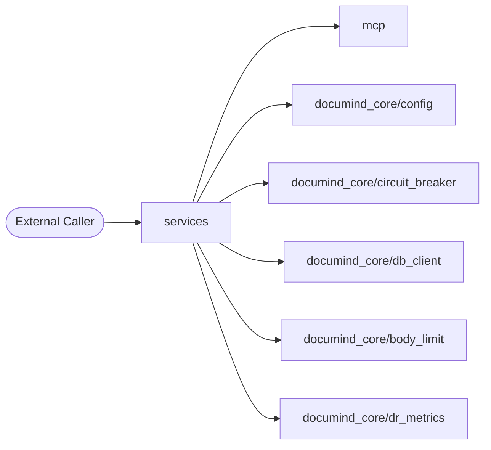
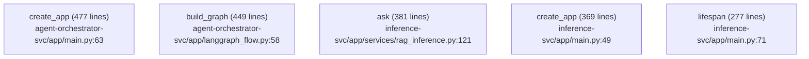
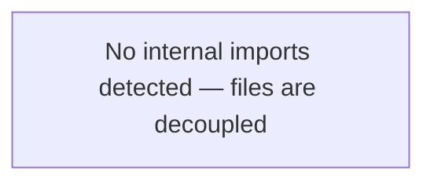
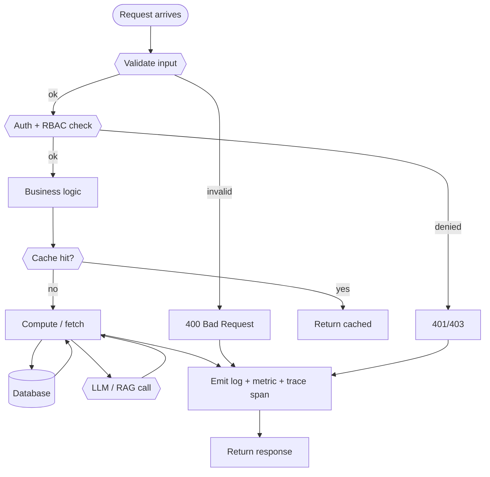
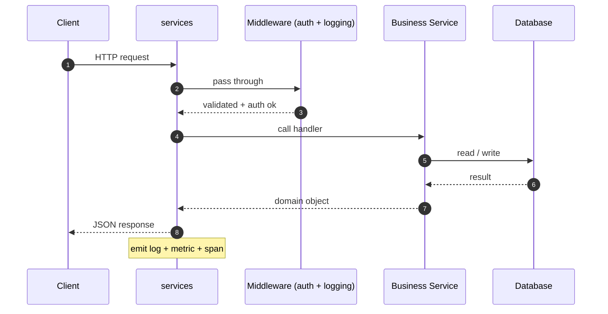
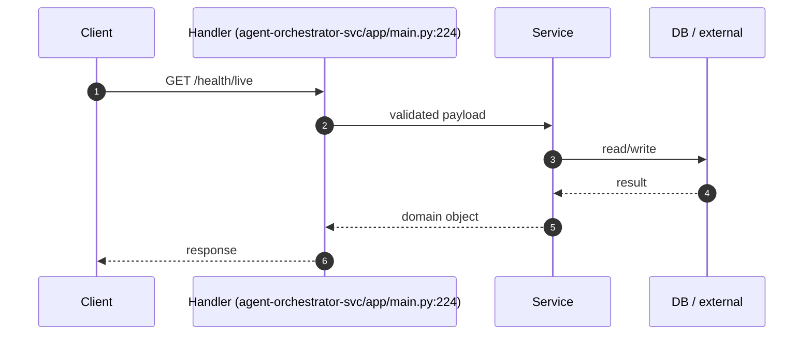
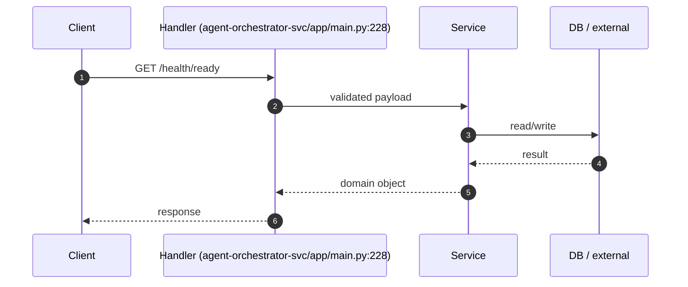
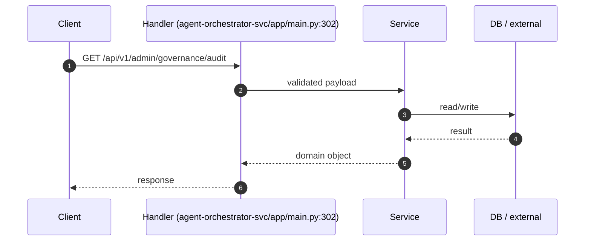
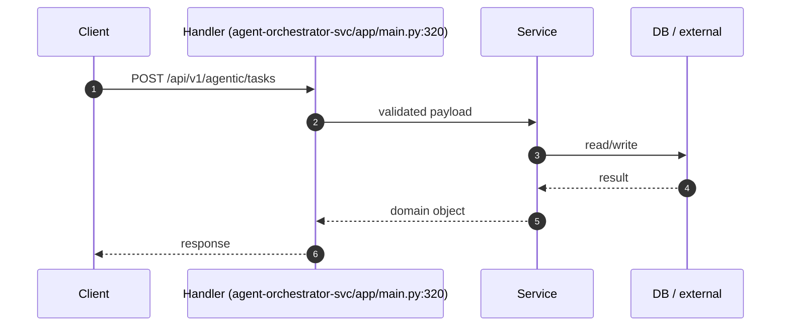

# 📦 `services` — Advanced README

  ·  **Path:** `services`  ·  **Generated:** 2026-05-16 20:01 UTC

> _Purpose not detected from docstrings — reviewer to fill._

This README is **auto-generated** by [`scripts/generate_folder_report.py`](../../scripts/generate_folder_report.py). It explains what this folder does, every file inside it, how the files link to each other, every API endpoint, every database call, every test case, and the production controls (security / reliability / performance / observability). Re-run after major changes.

---

## 🔎 Section 0 — Auto-Detected Facts

| Metric | Value |
|---|---|
| Folder | `services` |
| Total files | 2288 |
| Python files | 191 |
| TypeScript/JS files | 346 |
| Go files | 17 |
| Shell scripts | 32 |
| Lines of code | 174,015 |
| Python classes | 209 |
| Python functions | 651 |
| Async functions | 303 |
| Total API endpoints | 34 |
| Total DB call sites | 1785 |
| DB / Storage libs | Elasticsearch, Kafka (aiokafka), Neo4j, Prisma, Qdrant, Redis, SQLAlchemy, asyncpg, psycopg |
| Concurrency primitives | Lock / RLock, asyncio (async/await), concurrent.futures, multiprocessing, threading |
| Caching primitives | in-memory @lru_cache, redis |
| Input validation | Manual escape, Pydantic BaseModel, Zod (TS) |
| AI / LLM deps | Anthropic SDK, DeepEval, Giskard, LangChain, LangGraph, Ollama, OpenAI SDK, OpenTelemetry GenAI, Ragas, Rebuff (PI defense) |
| Test files | 2894 |
| Detected test cases | 14 |
| Tests dir present | ✅ |
| Dockerfile | ❌ |
| pyproject.toml | ❌ |
| go.mod | ❌ |
| package.json | ❌ |
| Top git contributors | `351	PraveenAsthana123`, `8	Praveen` |

#### Longest functions (top 5)

| Location | Name | Lines |
|---|---|---|
| `agent-orchestrator-svc/app/main.py:63` | `create_app` | 477 |
| `agent-orchestrator-svc/app/langgraph_flow.py:58` | `build_graph` | 449 |
| `inference-svc/app/services/rag_inference.py:121` | `ask` | 381 |
| `inference-svc/app/main.py:49` | `create_app` | 369 |
| `inference-svc/app/main.py:71` | `lifespan` | 277 |

#### Smells detected (grep heuristics — verify manually)

| Smell | Count |
|---|---|
| hardcoded localhost URL | 130 |
| hardcoded password literal | 2 |
| TODO/FIXME marker | 1062 |


## 1. Purpose — Business + Technical

### Business problem this folder solves

> _Reviewer to fill: one paragraph describing the business need_

### Technical contract this folder exposes

> _Reviewer to fill: API surface, events emitted, data persisted, downstream consumers._

### Out-of-scope (what this folder does NOT do)

> _Reviewer to fill: explicit non-goals — prevents scope creep at review time._


## 2. File Inventory

Every Python file in this folder, with role / classes / functions / LOC / first docstring line. Full absolute paths listed below the table for easy `cat`-ability.

| Relative path | Role (inferred) | Classes | Functions | LOC | Summary |
|---|---|---|---|---|---|
| `agent-orchestrator-svc/app/__init__.py` | 🚀 entry point / app bootstrap | 0 | 0 | 2 | Agent orchestrator service skeleton. |
| `agent-orchestrator-svc/app/agent_registry.py` | 🚀 entry point / app bootstrap | 1 | 1 | 292 | _(no docstring)_ |
| `agent-orchestrator-svc/app/agent_schemas.py` | 📋 data model / schema | 2 | 3 | 157 | Pydantic schemas for agent structured output. |
| `agent-orchestrator-svc/app/agents.py` | 🚀 entry point / app bootstrap | 6 | 2 | 544 | Agentic role implementations. |
| `agent-orchestrator-svc/app/core/__init__.py` | 🚀 entry point / app bootstrap | 0 | 0 | 2 | Core config package for agent orchestrator service. |
| `agent-orchestrator-svc/app/core/config.py` | ⚙ config / settings | 1 | 0 | 37 | _(no docstring)_ |
| `agent-orchestrator-svc/app/db_circuit_breaker.py` | 🚀 entry point / app bootstrap | 1 | 0 | 136 | Circuit breaker around the Postgres data layer. |
| `agent-orchestrator-svc/app/deployer.py` | 🚀 entry point / app bootstrap | 1 | 0 | 94 | DeployerAgent (Phase B5 scaffold). |
| `agent-orchestrator-svc/app/explainability.py` | 🚀 entry point / app bootstrap | 0 | 3 | 199 | §48 explainability — assemble per-task decision audit rows (Phase C4). |
| `agent-orchestrator-svc/app/idempotency.py` | 🚀 entry point / app bootstrap | 4 | 3 | 114 | Idempotency-key helpers for POST /api/v1/agentic/tasks (Phase C2). |
| `agent-orchestrator-svc/app/idempotency_postgres.py` | 🚀 entry point / app bootstrap | 1 | 0 | 72 | PostgresIdempotencyStore — multi-pod-safe IdempotencyStore. |
| `agent-orchestrator-svc/app/langgraph_flow.py` | 🚀 entry point / app bootstrap | 1 | 5 | 530 | _(no docstring)_ |
| `agent-orchestrator-svc/app/llm_clients/__init__.py` | 🔌 external service adapter | 0 | 0 | 24 | LLM client backends — uniform Protocol over Ollama / Claude CLI / Codex CLI. |
| `agent-orchestrator-svc/app/llm_clients/claude_cli_client.py` | 🔌 external service adapter | 1 | 2 | 156 | Claude CLI client — shell-out to local Claude Code binary in JSON mode. |
| `agent-orchestrator-svc/app/llm_clients/codex_cli_client.py` | 🔌 external service adapter | 1 | 2 | 125 | Codex CLI client — shell-out to local Codex binary. |
| `agent-orchestrator-svc/app/llm_clients/ollama_client.py` | 🔌 external service adapter | 1 | 0 | 66 | Ollama HTTP client adapted to the LlmClient Protocol. |
| `agent-orchestrator-svc/app/llm_clients/pool.py` | 🔌 external service adapter | 3 | 0 | 174 | LlmClientPool — dispatch-by-backend with fallback-chain execution. |
| `agent-orchestrator-svc/app/llm_clients/protocol.py` | 🔌 external service adapter | 3 | 0 | 47 | LlmClient Protocol — uniform interface for Ollama / Claude CLI / Codex CLI. |
| `agent-orchestrator-svc/app/main.py` | 🚀 entry point / app bootstrap | 0 | 1 | 543 | Agent orchestrator FastAPI service. |
| `agent-orchestrator-svc/app/migrations.py` | 🚀 entry point / app bootstrap | 0 | 1 | 88 | Idempotent migration runner for agent-orchestrator-svc. |
| `agent-orchestrator-svc/app/model_catalog.py` | 📋 data model / schema | 1 | 3 | 163 | Curated catalog of models per role, with tier mapping for the routing layer. |
| `agent-orchestrator-svc/app/model_router.py` | 🌐 HTTP router / API endpoints | 3 | 6 | 234 | Deterministic model router — picks (model, tier, backend) per role. |
| `agent-orchestrator-svc/app/models.py` | 📋 data model / schema | 19 | 0 | 248 | _(no docstring)_ |
| `agent-orchestrator-svc/app/observer.py` | 🚀 entry point / app bootstrap | 1 | 0 | 110 | ObserverAgent (Phase B6 scaffold). |
| `agent-orchestrator-svc/app/ollama_client.py` | 🔌 external service adapter | 1 | 0 | 23 | _(no docstring)_ |
| `agent-orchestrator-svc/app/policy.py` | 🚀 entry point / app bootstrap | 0 | 3 | 56 | _(no docstring)_ |
| `agent-orchestrator-svc/app/postgres_store.py` | 💾 repository / data access | 1 | 6 | 663 | _(no docstring)_ |
| `agent-orchestrator-svc/app/rate_limit.py` | 🚀 entry point / app bootstrap | 2 | 0 | 111 | In-memory rate limiter for the orchestrator (P1 #33). |
| `agent-orchestrator-svc/app/research.py` | 🚀 entry point / app bootstrap | 1 | 0 | 244 | ResearchAgent (Phase B2 scaffold). |
| `agent-orchestrator-svc/app/service.py` | 🧠 business service / use-case | 1 | 0 | 779 | _(no docstring)_ |
| `agent-orchestrator-svc/app/store.py` | 💾 repository / data access | 1 | 0 | 182 | _(no docstring)_ |
| `agent-orchestrator-svc/app/tester.py` | 🚀 entry point / app bootstrap | 1 | 0 | 129 | TesterAgent (Phase B4 scaffold). |
| `agent-orchestrator-svc/scripts/bootstrap.py` | 🤖 agent / tool | 0 | 4 | 65 | Bootstrap Postgres objects for agent-orchestrator-svc. |
| `agent-orchestrator-svc/tests/conftest.py` | 🤖 agent / tool | 0 | 1 | 35 | pytest config for agent-orchestrator-svc tests. |
| `agent-orchestrator-svc/tests/test_smoke.py` | 🧪 test | 0 | 4 | 73 | §8 smoke tests for agent-orchestrator-svc. |
| `evaluation-svc/app/eval_harness.py` | 🚀 entry point / app bootstrap | 5 | 1 | 600 | Stage-1 eval-harness — Ragas + Guardrails AI + DeepEval scaffolds. |
| `evaluation-svc/app/explain.py` | 🚀 entry point / app bootstrap | 5 | 2 | 221 | §48 Explainability endpoint — `/api/v1/explain?prediction_id=<id>`. |
| `evaluation-svc/app/main.py` | 🚀 entry point / app bootstrap | 8 | 1 | 331 | Evaluation service (Design Areas 26, 59, 60, 61). |
| `evaluation-svc/app/metrics/__init__.py` | 🚀 entry point / app bootstrap | 0 | 0 | 26 | Evaluation metrics (Design Area 26, 59, 60, 61). |
| `evaluation-svc/app/metrics/generation.py` | 🚀 entry point / app bootstrap | 2 | 1 | 45 | Generation metrics — faithfulness and answer relevance. |
| `evaluation-svc/app/metrics/retrieval.py` | 🚀 entry point / app bootstrap | 4 | 0 | 59 | Retrieval metrics — precision@k, recall, MRR, NDCG. |
| `inference-svc/app/agents/__init__.py` | 🚀 entry point / app bootstrap | 0 | 0 | 16 | Agent orchestration (Design Area 11 — Agent State, + Extra — CCB). |
| `inference-svc/app/agents/multi_hop_agent.py` | 🚀 entry point / app bootstrap | 2 | 0 | 179 | Multi-hop RAG agent — skeleton showing the full breaker story in action. |
| `inference-svc/app/agents/multi_hop_fanout.py` | 🚀 entry point / app bootstrap | 2 | 1 | 235 | Parallel sub-question fanout for the multi-hop RAG agent. |
| `inference-svc/app/core/config.py` | ⚙ config / settings | 1 | 0 | 18 | Inference-service configuration. |
| `inference-svc/app/main.py` | 🚀 entry point / app bootstrap | 0 | 1 | 421 | Inference service FastAPI application. |
| `inference-svc/app/routers/__init__.py` | 🌐 HTTP router / API endpoints | 0 | 20 | 1660 | Inference HTTP routes. |
| `inference-svc/app/schemas/__init__.py` | 📋 data model / schema | 32 | 0 | 698 | Inference request/response schemas (Design Area 33 — Output Contract). |
| `inference-svc/app/services/__init__.py` | 🧠 business service / use-case | 0 | 0 | 19 | _(no docstring)_ |
| `inference-svc/app/services/agent.py` | 🧠 business service / use-case | 2 | 1 | 323 | Agent flow: answer + optional MCP action. |
| `inference-svc/app/services/guardrails.py` | 🧠 business service / use-case | 3 | 0 | 209 | Output guardrails (Design Area 33 — Output Contract, §38 AI Governance). |
| `inference-svc/app/services/ollama_client.py` | 🧠 business service / use-case | 2 | 1 | 191 | Ollama LLM client — wrapped in a circuit breaker. |
| `inference-svc/app/services/prompt_builder.py` | 🧠 business service / use-case | 2 | 0 | 102 | Prompt construction + versioning (Design Area 32 — Prompt Contract). |
| `inference-svc/app/services/prompt_repo.py` | 🧠 business service / use-case | 2 | 0 | 327 | DB-backed prompt registry (Design Area 32 — Prompt Contract). |
| `inference-svc/app/services/rag_inference.py` | 🧠 business service / use-case | 1 | 0 | 502 | RagInferenceService — end-to-end glue for the read path. |
| `inference-svc/app/services/retrieval_client.py` | 🧠 business service / use-case | 1 | 0 | 51 | gRPC/HTTP client for retrieval-svc (using HTTP+JSON here for simplicity). |
| `inference-svc/app/workers/__init__.py` | 🚀 entry point / app bootstrap | 0 | 0 | 2 | Background workers scheduled from the inference-svc lifespan. |
| `inference-svc/app/workers/breaker_metrics.py` | 🚀 entry point / app bootstrap | 1 | 0 | 123 | Background exporter: bridges non-CircuitBreaker breakers into the |
| `inference-svc/app/workers/draft_replay.py` | 🚀 entry point / app bootstrap | 1 | 4 | 558 | Draft replay worker — periodically resolves pending MCP drafts. |
| `inference-svc/tests/conftest.py` | 📄 module | 0 | 1 | 21 | pytest config for inference-svc tests. |
| `inference-svc/tests/test_integration_inference.py` | 🧪 test | 0 | 3 | 143 | Integration test for RagInferenceService with mocked externals. |
| `ingestion-svc/app/chunking/__init__.py` | 🚀 entry point / app bootstrap | 0 | 0 | 23 | Chunking (Design Area 23 — Ingestion, Area 34 — Retrieval Schema). |
| `ingestion-svc/app/chunking/base.py` | 🚀 entry point / app bootstrap | 2 | 0 | 47 | Chunker interface + Chunk domain model. |
| `ingestion-svc/app/chunking/recursive.py` | 🚀 entry point / app bootstrap | 2 | 0 | 231 | Recursive character-based chunker. |
| `ingestion-svc/app/chunking/token_counter.py` | 🚀 entry point / app bootstrap | 1 | 0 | 42 | Token counting — central so every service agrees on what "512 tokens" means. |
| `ingestion-svc/app/core/config.py` | ⚙ config / settings | 1 | 0 | 29 | Ingestion-service configuration (subclasses the shared base). |
| `ingestion-svc/app/embedding/__init__.py` | 🚀 entry point / app bootstrap | 0 | 0 | 14 | Embedding providers (Design Area 39 — Embedding Lifecycle, Area 65 — |
| `ingestion-svc/app/embedding/base.py` | 🚀 entry point / app bootstrap | 1 | 0 | 36 | The EmbeddingProvider interface. |
| `ingestion-svc/app/embedding/ollama_embedder.py` | 🚀 entry point / app bootstrap | 1 | 0 | 86 | Ollama-backed embedder. |
| `ingestion-svc/app/main.py` | 🚀 entry point / app bootstrap | 0 | 1 | 240 | Ingestion-service FastAPI application. |
| `ingestion-svc/app/parsers/__init__.py` | 🚀 entry point / app bootstrap | 0 | 0 | 41 | Document parsers (Design Area 23 — Knowledge Ingestion, Design Area 65 — |
| `ingestion-svc/app/parsers/base.py` | 🚀 entry point / app bootstrap | 3 | 0 | 52 | Parser interface (Design Area 65 — Design-for-Change). |
| `ingestion-svc/app/parsers/docx_parser.py` | 🚀 entry point / app bootstrap | 1 | 0 | 51 | DOCX parser built on :mod:`python-docx`. |
| `ingestion-svc/app/parsers/html_parser.py` | 🚀 entry point / app bootstrap | 1 | 0 | 54 | HTML parser built on BeautifulSoup. |
| `ingestion-svc/app/parsers/markdown_parser.py` | 🚀 entry point / app bootstrap | 1 | 0 | 24 | Markdown parser — renders to HTML then reuses HtmlParser. One code path |
| `ingestion-svc/app/parsers/pdf_parser.py` | 🚀 entry point / app bootstrap | 1 | 0 | 47 | PDF parser built on :mod:`pypdf`. |
| `ingestion-svc/app/parsers/registry.py` | 🚀 entry point / app bootstrap | 1 | 0 | 48 | Parser registry — picks the right parser by file extension. |
| `ingestion-svc/app/parsers/text_parser.py` | 🚀 entry point / app bootstrap | 1 | 0 | 24 | Plain-text parser (.txt). No structure beyond paragraphs. |
| `ingestion-svc/app/repositories/__init__.py` | 💾 repository / data access | 0 | 0 | 29 | Repositories (Design Areas 46 — DB Strategy, 47 — Vector DB, 48 — Graph). |
| `ingestion-svc/app/repositories/chunk_repo.py` | 💾 repository / data access | 1 | 0 | 111 | Chunk metadata repository (Postgres, ingestion schema). |
| `ingestion-svc/app/repositories/document_repo.py` | 💾 repository / data access | 1 | 0 | 248 | Document metadata repository (Postgres, ingestion schema). |
| `ingestion-svc/app/repositories/neo4j_repo.py` | 💾 repository / data access | 1 | 0 | 132 | Neo4j repository (Design Area 48 — Graph Strategy). |
| `ingestion-svc/app/repositories/qdrant_repo.py` | 💾 repository / data access | 1 | 0 | 145 | Qdrant repository (Design Area 47 — Vector DB Strategy). |
| `ingestion-svc/app/repositories/saga_repo.py` | 💾 repository / data access | 1 | 0 | 112 | Saga persistence (Design Area 18 — Workflow Orchestration). |
| `ingestion-svc/app/routers/__init__.py` | 🌐 HTTP router / API endpoints | 0 | 0 | 5 | _(no docstring)_ |
| `ingestion-svc/app/routers/documents.py` | 🌐 HTTP router / API endpoints | 0 | 6 | 112 | Document HTTP routes (Design Area 23 — Ingestion Service API). |
| `ingestion-svc/app/routers/health.py` | 🌐 HTTP router / API endpoints | 0 | 3 | 47 | Health check endpoint — liveness + readiness (Design Area 49). |
| `ingestion-svc/app/saga/__init__.py` | 🚀 entry point / app bootstrap | 0 | 0 | 13 | _(no docstring)_ |
| `ingestion-svc/app/saga/document_saga.py` | 🚀 entry point / app bootstrap | 3 | 0 | 543 | Document ingestion saga (Design Areas 18 — Workflow Orchestration, |
| `ingestion-svc/app/saga/outbox.py` | 🚀 entry point / app bootstrap | 2 | 0 | 192 | Transactional outbox (Design Area 17). |
| `ingestion-svc/app/saga/recovery.py` | 🚀 entry point / app bootstrap | 1 | 0 | 170 | Saga crash recovery (Design Areas 18, 19). |
| `ingestion-svc/app/saga/reembed_worker.py` | 🚀 entry point / app bootstrap | 1 | 0 | 151 | Re-embed worker (Design Area 39 — Embedding Lifecycle). |
| `ingestion-svc/app/schemas/__init__.py` | 📋 data model / schema | 0 | 0 | 16 | _(no docstring)_ |
| `ingestion-svc/app/schemas/document.py` | 📋 data model / schema | 5 | 0 | 54 | Pydantic schemas (Design Area 30 — API Contracts). |
| `ingestion-svc/app/services/__init__.py` | 🧠 business service / use-case | 0 | 0 | 5 | _(no docstring)_ |
| `ingestion-svc/app/services/blob_service.py` | 🧠 business service / use-case | 1 | 0 | 81 | Blob storage wrapper (Design Areas 35 — Knowledge Lifecycle, 7 — Data Plane). |
| `ingestion-svc/app/services/ingestion_service.py` | 🧠 business service / use-case | 2 | 0 | 200 | IngestionService — business-logic wrapper over the saga orchestrator. |
| `ingestion-svc/app/services/pii_hook.py` | 🧠 business service / use-case | 1 | 4 | 189 | PII redaction hook for ingestion — Stage-2 adapter. |
| `ingestion-svc/app/services/poisoning_defense.py` | 🧠 business service / use-case | 3 | 0 | 172 | Retrieval-poisoning defense (Design Area 5 — Tenant Boundary, Extra E5 — Secure AI). |
| `ingestion-svc/tests/conftest.py` | 📄 module | 0 | 1 | 21 | pytest config for ingestion-svc tests — adds the service's parent dir to path. |
| `ingestion-svc/tests/test_poisoning_defense.py` | 🧪 test | 0 | 8 | 82 | Tests for the retrieval-poisoning guard. |
| `retrieval-svc/app/core/config.py` | ⚙ config / settings | 1 | 0 | 20 | Retrieval-service configuration. |
| `retrieval-svc/app/main.py` | 🚀 entry point / app bootstrap | 0 | 1 | 157 | Retrieval service FastAPI application. |
| `retrieval-svc/app/routers/__init__.py` | 🌐 HTTP router / API endpoints | 0 | 5 | 254 | Retrieval HTTP routes. |
| `retrieval-svc/app/schemas/__init__.py` | 📋 data model / schema | 6 | 0 | 144 | Retrieval request/response schemas (Design Area 34 — Retrieval Schema). |
| `retrieval-svc/app/services/__init__.py` | 🧠 business service / use-case | 0 | 0 | 14 | _(no docstring)_ |
| `retrieval-svc/app/services/bge_reranker.py` | 🧠 business service / use-case | 1 | 3 | 127 | BGE cross-encoder reranker — Stage-1 adapter (per CLAUDE.md §56). |
| `retrieval-svc/app/services/bge_reranker_protected.py` | 🧠 business service / use-case | 0 | 5 | 187 | BGE reranker WITH circuit breaker — Stage-2 wiring. |
| `retrieval-svc/app/services/elastic_searcher.py` | 🧠 business service / use-case | 1 | 0 | 132 | Vectorless retrieval over Elasticsearch (BM25 keyword search). |
| `retrieval-svc/app/services/embedder_client.py` | 🧠 business service / use-case | 1 | 0 | 32 | Thin embedder for queries — reuses the same Ollama API as ingestion. |
| `retrieval-svc/app/services/graph_searcher.py` | 🧠 business service / use-case | 1 | 0 | 85 | Graph search over Neo4j (Design Area 48). |
| `retrieval-svc/app/services/hybrid_retriever.py` | 🧠 business service / use-case | 1 | 0 | 415 | Hybrid retriever (Design Areas 24 — Retrieval, 40 — Cache, 13 — Read Path). |
| `retrieval-svc/app/services/reranker.py` | 🧠 business service / use-case | 1 | 0 | 72 | Reciprocal Rank Fusion (RRF) reranker. |
| `retrieval-svc/app/services/vector_searcher.py` | 🧠 business service / use-case | 1 | 0 | 64 | Vector search over Qdrant (Design Area 47). |
| `retrieval-svc/scripts/agent_monitor.py` | 🤖 agent / tool | 0 | 4 | 60 | _(no docstring)_ |
| `retrieval-svc/scripts/agent_task_board.py` | 🤖 agent / tool | 0 | 0 | 3 | _(no docstring)_ |
| `retrieval-svc/scripts/agent_trace.py` | 🤖 agent / tool | 0 | 0 | 18 | _(no docstring)_ |
| `retrieval-svc/scripts/anomaly_agent.py` | 🤖 agent / tool | 0 | 0 | 21 | _(no docstring)_ |
| `retrieval-svc/scripts/autonomous_fix_daemon.py` | 📄 module | 0 | 0 | 2 | _(no docstring)_ |
| `retrieval-svc/scripts/bug_manager.py` | 📄 module | 0 | 1 | 35 | _(no docstring)_ |
| `retrieval-svc/scripts/council_agent.py` | 🤖 agent / tool | 0 | 6 | 103 | _(no docstring)_ |
| `retrieval-svc/scripts/delegation_router.py` | 🌐 HTTP router / API endpoints | 0 | 0 | 33 | _(no docstring)_ |
| `retrieval-svc/scripts/guardrails_wrapper.py` | 🚀 entry point / app bootstrap | 0 | 1 | 11 | _(no docstring)_ |
| `retrieval-svc/scripts/intelligent_auto_fix_agent.py` | 🤖 agent / tool | 0 | 6 | 117 | _(no docstring)_ |
| `retrieval-svc/scripts/mcp_agent_council_status.py` | 🤖 agent / tool | 0 | 0 | 20 | _(no docstring)_ |
| `retrieval-svc/scripts/mlflow_tracker.py` | 📄 module | 0 | 0 | 9 | _(no docstring)_ |
| `retrieval-svc/scripts/monitoring_summary.py` | 📄 module | 0 | 0 | 19 | _(no docstring)_ |
| `retrieval-svc/scripts/outcome_eval.py` | 📄 module | 0 | 2 | 16 | _(no docstring)_ |
| `retrieval-svc/scripts/policy_gate.py` | 📄 module | 0 | 0 | 21 | _(no docstring)_ |
| `retrieval-svc/scripts/python_auto_fix_agent.py` | 🤖 agent / tool | 0 | 8 | 150 | _(no docstring)_ |
| `retrieval-svc/scripts/rag_eval_agent.py` | 🤖 agent / tool | 0 | 1 | 4 | _(no docstring)_ |
| `retrieval-svc/scripts/regression_score.py` | 📄 module | 0 | 1 | 44 | _(no docstring)_ |
| `retrieval-svc/scripts/testing_agent.py` | 🤖 agent / tool | 0 | 2 | 55 | _(no docstring)_ |
| `retrieval-svc/scripts/tier_b_fallback.py` | 📄 module | 0 | 0 | 2 | _(no docstring)_ |
| `retrieval-svc/scripts/verifiability_framework.py` | 📄 module | 0 | 0 | 2 | _(no docstring)_ |
| `retrieval-svc/scripts/warm_council_pool.py` | 📄 module | 0 | 0 | 2 | _(no docstring)_ |
| `sidecar-advisor/__init__.py` | 🚀 entry point / app bootstrap | 0 | 0 | 13 | Sidecar Advisor — personal AI auditor for prompt + code activity. |
| `sidecar-advisor/advisor.py` | 📄 module | 2 | 0 | 431 | The advisor — calls a model picked by the policy and parses the |
| `sidecar-advisor/agents/__init__.py` | 🚀 entry point / app bootstrap | 0 | 2 | 66 | Agent registry for the Sidecar Advisor council. |
| `sidecar-advisor/agents/base.py` | 🤖 agent / tool | 1 | 0 | 52 | Base agent definition - one CoderAgent per role. |
| `sidecar-advisor/agents/chair.py` | 🤖 agent / tool | 0 | 0 | 41 | Chair agent - the single advisor on the council. Synthesises |
| `sidecar-advisor/agents/code_reviewer.py` | 🤖 agent / tool | 0 | 0 | 24 | Code Reviewer agent - one of three specialised authors on the |
| `sidecar-advisor/agents/consistency_check.py` | 🤖 agent / tool | 0 | 0 | 28 | Consistency Check agent - the lone reviewer. Scores each draft |
| `sidecar-advisor/agents/policy_approver.py` | 🚀 entry point / app bootstrap | 0 | 0 | 72 | Policy Approver agent - the loop watcher. |
| `sidecar-advisor/agents/security_auditor.py` | 🤖 agent / tool | 0 | 0 | 27 | Security Auditor agent - reviews for hardcoded secrets, missing |
| `sidecar-advisor/agents/test_advisor.py` | 🧪 test | 0 | 0 | 26 | Test Advisor agent - reviews for testability and coverage: |
| `sidecar-advisor/bulk_pr_review.py` | 📄 module | 3 | 1 | 239 | Bulk PR review - run the Sidecar council across N files in one shot. |
| `sidecar-advisor/classifier.py` | 📄 module | 1 | 1 | 103 | Rule-based event classifier. |
| `sidecar-advisor/council.py` | 📄 module | 1 | 1 | 346 | PR-review council — composes AgentBoard with role-specialised authors. |
| `sidecar-advisor/distillation.py` | 📄 module | 1 | 3 | 271 | Memory pattern distillation — turns rated events into reusable patterns. |
| `sidecar-advisor/git_capture.py` | 📄 module | 1 | 6 | 285 | Capture git activity into Sidecar Advisor pr_review events. |
| `sidecar-advisor/loop_watcher.py` | 📄 module | 4 | 1 | 265 | LoopWatcher - the live gate between iterations of the autonomous loop. |
| `sidecar-advisor/memory.py` | 📄 module | 1 | 2 | 566 | SQLite-backed memory for the Sidecar Advisor. |
| `sidecar-advisor/replay_council.py` | 📄 module | 2 | 2 | 207 | Batched replay of the Sidecar council against persisted events. |

### Absolute paths (clickable)

- `/mnt/deepa/rag/services/agent-orchestrator-svc/app/__init__.py`
- `/mnt/deepa/rag/services/agent-orchestrator-svc/app/agent_registry.py`
- `/mnt/deepa/rag/services/agent-orchestrator-svc/app/agent_schemas.py`
- `/mnt/deepa/rag/services/agent-orchestrator-svc/app/agents.py`
- `/mnt/deepa/rag/services/agent-orchestrator-svc/app/core/__init__.py`
- `/mnt/deepa/rag/services/agent-orchestrator-svc/app/core/config.py`
- `/mnt/deepa/rag/services/agent-orchestrator-svc/app/db_circuit_breaker.py`
- `/mnt/deepa/rag/services/agent-orchestrator-svc/app/deployer.py`
- `/mnt/deepa/rag/services/agent-orchestrator-svc/app/explainability.py`
- `/mnt/deepa/rag/services/agent-orchestrator-svc/app/idempotency.py`
- `/mnt/deepa/rag/services/agent-orchestrator-svc/app/idempotency_postgres.py`
- `/mnt/deepa/rag/services/agent-orchestrator-svc/app/langgraph_flow.py`
- `/mnt/deepa/rag/services/agent-orchestrator-svc/app/llm_clients/__init__.py`
- `/mnt/deepa/rag/services/agent-orchestrator-svc/app/llm_clients/claude_cli_client.py`
- `/mnt/deepa/rag/services/agent-orchestrator-svc/app/llm_clients/codex_cli_client.py`
- `/mnt/deepa/rag/services/agent-orchestrator-svc/app/llm_clients/ollama_client.py`
- `/mnt/deepa/rag/services/agent-orchestrator-svc/app/llm_clients/pool.py`
- `/mnt/deepa/rag/services/agent-orchestrator-svc/app/llm_clients/protocol.py`
- `/mnt/deepa/rag/services/agent-orchestrator-svc/app/main.py`
- `/mnt/deepa/rag/services/agent-orchestrator-svc/app/migrations.py`
- `/mnt/deepa/rag/services/agent-orchestrator-svc/app/model_catalog.py`
- `/mnt/deepa/rag/services/agent-orchestrator-svc/app/model_router.py`
- `/mnt/deepa/rag/services/agent-orchestrator-svc/app/models.py`
- `/mnt/deepa/rag/services/agent-orchestrator-svc/app/observer.py`
- `/mnt/deepa/rag/services/agent-orchestrator-svc/app/ollama_client.py`
- `/mnt/deepa/rag/services/agent-orchestrator-svc/app/policy.py`
- `/mnt/deepa/rag/services/agent-orchestrator-svc/app/postgres_store.py`
- `/mnt/deepa/rag/services/agent-orchestrator-svc/app/rate_limit.py`
- `/mnt/deepa/rag/services/agent-orchestrator-svc/app/research.py`
- `/mnt/deepa/rag/services/agent-orchestrator-svc/app/service.py`
- `/mnt/deepa/rag/services/agent-orchestrator-svc/app/store.py`
- `/mnt/deepa/rag/services/agent-orchestrator-svc/app/tester.py`
- `/mnt/deepa/rag/services/agent-orchestrator-svc/scripts/bootstrap.py`
- `/mnt/deepa/rag/services/agent-orchestrator-svc/tests/conftest.py`
- `/mnt/deepa/rag/services/agent-orchestrator-svc/tests/test_smoke.py`
- `/mnt/deepa/rag/services/evaluation-svc/app/eval_harness.py`
- `/mnt/deepa/rag/services/evaluation-svc/app/explain.py`
- `/mnt/deepa/rag/services/evaluation-svc/app/main.py`
- `/mnt/deepa/rag/services/evaluation-svc/app/metrics/__init__.py`
- `/mnt/deepa/rag/services/evaluation-svc/app/metrics/generation.py`
- `/mnt/deepa/rag/services/evaluation-svc/app/metrics/retrieval.py`
- `/mnt/deepa/rag/services/inference-svc/app/agents/__init__.py`
- `/mnt/deepa/rag/services/inference-svc/app/agents/multi_hop_agent.py`
- `/mnt/deepa/rag/services/inference-svc/app/agents/multi_hop_fanout.py`
- `/mnt/deepa/rag/services/inference-svc/app/core/config.py`
- `/mnt/deepa/rag/services/inference-svc/app/main.py`
- `/mnt/deepa/rag/services/inference-svc/app/routers/__init__.py`
- `/mnt/deepa/rag/services/inference-svc/app/schemas/__init__.py`
- `/mnt/deepa/rag/services/inference-svc/app/services/__init__.py`
- `/mnt/deepa/rag/services/inference-svc/app/services/agent.py`
- `/mnt/deepa/rag/services/inference-svc/app/services/guardrails.py`
- `/mnt/deepa/rag/services/inference-svc/app/services/ollama_client.py`
- `/mnt/deepa/rag/services/inference-svc/app/services/prompt_builder.py`
- `/mnt/deepa/rag/services/inference-svc/app/services/prompt_repo.py`
- `/mnt/deepa/rag/services/inference-svc/app/services/rag_inference.py`
- `/mnt/deepa/rag/services/inference-svc/app/services/retrieval_client.py`
- `/mnt/deepa/rag/services/inference-svc/app/workers/__init__.py`
- `/mnt/deepa/rag/services/inference-svc/app/workers/breaker_metrics.py`
- `/mnt/deepa/rag/services/inference-svc/app/workers/draft_replay.py`
- `/mnt/deepa/rag/services/inference-svc/tests/conftest.py`
- `/mnt/deepa/rag/services/inference-svc/tests/test_integration_inference.py`
- `/mnt/deepa/rag/services/ingestion-svc/app/chunking/__init__.py`
- `/mnt/deepa/rag/services/ingestion-svc/app/chunking/base.py`
- `/mnt/deepa/rag/services/ingestion-svc/app/chunking/recursive.py`
- `/mnt/deepa/rag/services/ingestion-svc/app/chunking/token_counter.py`
- `/mnt/deepa/rag/services/ingestion-svc/app/core/config.py`
- `/mnt/deepa/rag/services/ingestion-svc/app/embedding/__init__.py`
- `/mnt/deepa/rag/services/ingestion-svc/app/embedding/base.py`
- `/mnt/deepa/rag/services/ingestion-svc/app/embedding/ollama_embedder.py`
- `/mnt/deepa/rag/services/ingestion-svc/app/main.py`
- `/mnt/deepa/rag/services/ingestion-svc/app/parsers/__init__.py`
- `/mnt/deepa/rag/services/ingestion-svc/app/parsers/base.py`
- `/mnt/deepa/rag/services/ingestion-svc/app/parsers/docx_parser.py`
- `/mnt/deepa/rag/services/ingestion-svc/app/parsers/html_parser.py`
- `/mnt/deepa/rag/services/ingestion-svc/app/parsers/markdown_parser.py`
- `/mnt/deepa/rag/services/ingestion-svc/app/parsers/pdf_parser.py`
- `/mnt/deepa/rag/services/ingestion-svc/app/parsers/registry.py`
- `/mnt/deepa/rag/services/ingestion-svc/app/parsers/text_parser.py`
- `/mnt/deepa/rag/services/ingestion-svc/app/repositories/__init__.py`
- `/mnt/deepa/rag/services/ingestion-svc/app/repositories/chunk_repo.py`
- `/mnt/deepa/rag/services/ingestion-svc/app/repositories/document_repo.py`
- `/mnt/deepa/rag/services/ingestion-svc/app/repositories/neo4j_repo.py`
- `/mnt/deepa/rag/services/ingestion-svc/app/repositories/qdrant_repo.py`
- `/mnt/deepa/rag/services/ingestion-svc/app/repositories/saga_repo.py`
- `/mnt/deepa/rag/services/ingestion-svc/app/routers/__init__.py`
- `/mnt/deepa/rag/services/ingestion-svc/app/routers/documents.py`
- `/mnt/deepa/rag/services/ingestion-svc/app/routers/health.py`
- `/mnt/deepa/rag/services/ingestion-svc/app/saga/__init__.py`
- `/mnt/deepa/rag/services/ingestion-svc/app/saga/document_saga.py`
- `/mnt/deepa/rag/services/ingestion-svc/app/saga/outbox.py`
- `/mnt/deepa/rag/services/ingestion-svc/app/saga/recovery.py`
- `/mnt/deepa/rag/services/ingestion-svc/app/saga/reembed_worker.py`
- `/mnt/deepa/rag/services/ingestion-svc/app/schemas/__init__.py`
- `/mnt/deepa/rag/services/ingestion-svc/app/schemas/document.py`
- `/mnt/deepa/rag/services/ingestion-svc/app/services/__init__.py`
- `/mnt/deepa/rag/services/ingestion-svc/app/services/blob_service.py`
- `/mnt/deepa/rag/services/ingestion-svc/app/services/ingestion_service.py`
- `/mnt/deepa/rag/services/ingestion-svc/app/services/pii_hook.py`
- `/mnt/deepa/rag/services/ingestion-svc/app/services/poisoning_defense.py`
- `/mnt/deepa/rag/services/ingestion-svc/tests/conftest.py`
- `/mnt/deepa/rag/services/ingestion-svc/tests/test_poisoning_defense.py`
- `/mnt/deepa/rag/services/retrieval-svc/app/core/config.py`
- `/mnt/deepa/rag/services/retrieval-svc/app/main.py`
- `/mnt/deepa/rag/services/retrieval-svc/app/routers/__init__.py`
- `/mnt/deepa/rag/services/retrieval-svc/app/schemas/__init__.py`
- `/mnt/deepa/rag/services/retrieval-svc/app/services/__init__.py`
- `/mnt/deepa/rag/services/retrieval-svc/app/services/bge_reranker.py`
- `/mnt/deepa/rag/services/retrieval-svc/app/services/bge_reranker_protected.py`
- `/mnt/deepa/rag/services/retrieval-svc/app/services/elastic_searcher.py`
- `/mnt/deepa/rag/services/retrieval-svc/app/services/embedder_client.py`
- `/mnt/deepa/rag/services/retrieval-svc/app/services/graph_searcher.py`
- `/mnt/deepa/rag/services/retrieval-svc/app/services/hybrid_retriever.py`
- `/mnt/deepa/rag/services/retrieval-svc/app/services/reranker.py`
- `/mnt/deepa/rag/services/retrieval-svc/app/services/vector_searcher.py`
- `/mnt/deepa/rag/services/retrieval-svc/scripts/agent_monitor.py`
- `/mnt/deepa/rag/services/retrieval-svc/scripts/agent_task_board.py`
- `/mnt/deepa/rag/services/retrieval-svc/scripts/agent_trace.py`
- `/mnt/deepa/rag/services/retrieval-svc/scripts/anomaly_agent.py`
- `/mnt/deepa/rag/services/retrieval-svc/scripts/autonomous_fix_daemon.py`
- `/mnt/deepa/rag/services/retrieval-svc/scripts/bug_manager.py`
- `/mnt/deepa/rag/services/retrieval-svc/scripts/council_agent.py`
- `/mnt/deepa/rag/services/retrieval-svc/scripts/delegation_router.py`
- `/mnt/deepa/rag/services/retrieval-svc/scripts/guardrails_wrapper.py`
- `/mnt/deepa/rag/services/retrieval-svc/scripts/intelligent_auto_fix_agent.py`
- `/mnt/deepa/rag/services/retrieval-svc/scripts/mcp_agent_council_status.py`
- `/mnt/deepa/rag/services/retrieval-svc/scripts/mlflow_tracker.py`
- `/mnt/deepa/rag/services/retrieval-svc/scripts/monitoring_summary.py`
- `/mnt/deepa/rag/services/retrieval-svc/scripts/outcome_eval.py`
- `/mnt/deepa/rag/services/retrieval-svc/scripts/policy_gate.py`
- `/mnt/deepa/rag/services/retrieval-svc/scripts/python_auto_fix_agent.py`
- `/mnt/deepa/rag/services/retrieval-svc/scripts/rag_eval_agent.py`
- `/mnt/deepa/rag/services/retrieval-svc/scripts/regression_score.py`
- `/mnt/deepa/rag/services/retrieval-svc/scripts/testing_agent.py`
- `/mnt/deepa/rag/services/retrieval-svc/scripts/tier_b_fallback.py`
- `/mnt/deepa/rag/services/retrieval-svc/scripts/verifiability_framework.py`
- `/mnt/deepa/rag/services/retrieval-svc/scripts/warm_council_pool.py`
- `/mnt/deepa/rag/services/sidecar-advisor/__init__.py`
- `/mnt/deepa/rag/services/sidecar-advisor/advisor.py`
- `/mnt/deepa/rag/services/sidecar-advisor/agents/__init__.py`
- `/mnt/deepa/rag/services/sidecar-advisor/agents/base.py`
- `/mnt/deepa/rag/services/sidecar-advisor/agents/chair.py`
- `/mnt/deepa/rag/services/sidecar-advisor/agents/code_reviewer.py`
- `/mnt/deepa/rag/services/sidecar-advisor/agents/consistency_check.py`
- `/mnt/deepa/rag/services/sidecar-advisor/agents/policy_approver.py`
- `/mnt/deepa/rag/services/sidecar-advisor/agents/security_auditor.py`
- `/mnt/deepa/rag/services/sidecar-advisor/agents/test_advisor.py`
- `/mnt/deepa/rag/services/sidecar-advisor/bulk_pr_review.py`
- `/mnt/deepa/rag/services/sidecar-advisor/classifier.py`
- `/mnt/deepa/rag/services/sidecar-advisor/council.py`
- `/mnt/deepa/rag/services/sidecar-advisor/distillation.py`
- `/mnt/deepa/rag/services/sidecar-advisor/git_capture.py`
- `/mnt/deepa/rag/services/sidecar-advisor/loop_watcher.py`
- `/mnt/deepa/rag/services/sidecar-advisor/memory.py`
- `/mnt/deepa/rag/services/sidecar-advisor/replay_council.py`


## 3. C4 Model — Context / Container / Component / Code

### Level 1 — System Context

_Where does this folder sit in the broader system?_



### Level 2 — Container

_What external dependencies does this folder talk to?_

```mermaid
flowchart TB
    subgraph services
        Code[Source Code]
    end
    Code --> DB_0[("Elasticsearch")]
    Code --> DB_1[("Kafka (aiokafka)")]
    Code --> DB_2[("Neo4j")]
    Code --> DB_3[("Prisma")]
    Code --> DB_4[("Qdrant")]
    Code --> DB_5[("Redis")]
    Code --> DB_6[("SQLAlchemy")]
    Code --> DB_7[("asyncpg")]
    Code --> DB_8[("psycopg")]
    Code --> AI_0{{LLM: Anthropic SDK}}
    Code --> AI_1{{LLM: DeepEval}}
    Code --> AI_2{{LLM: Giskard}}
    Code --> AI_3{{LLM: LangChain}}
    Code --> AI_4{{LLM: LangGraph}}
    Code --> AI_5{{LLM: Ollama}}
    Code --> AI_6{{LLM: OpenAI SDK}}
    Code --> AI_7{{LLM: OpenTelemetry GenAI}}
    Code --> AI_8{{LLM: Ragas}}
    Code --> AI_9{{LLM: Rebuff (PI defense)}}
```

### Level 3 — Component

_Internal files grouped by inferred role._

```mermaid
flowchart TB
    subgraph __entry_point___app_bootstrap["🚀 entry point / app bootstrap"]
        agent_orchestrator_svc_app___init___py["agent-orchestrator-svc/app/__init__.py"]
        agent_orchestrator_svc_app_agent_registry_py["agent-orchestrator-svc/app/agent_registry.py"]
        agent_orchestrator_svc_app_agents_py["agent-orchestrator-svc/app/agents.py"]
        agent_orchestrator_svc_app_core___init___py["agent-orchestrator-svc/app/core/__init__.py"]
        agent_orchestrator_svc_app_db_circuit_breaker_py["agent-orchestrator-svc/app/db_circuit_breaker.py"]
        agent_orchestrator_svc_app_deployer_py["agent-orchestrator-svc/app/deployer.py"]
        more___entry_point___app_bootstrap["... +50 more"]
    end
    subgraph __data_model___schema["📋 data model / schema"]
        agent_orchestrator_svc_app_agent_schemas_py["agent-orchestrator-svc/app/agent_schemas.py"]
        agent_orchestrator_svc_app_model_catalog_py["agent-orchestrator-svc/app/model_catalog.py"]
        agent_orchestrator_svc_app_models_py["agent-orchestrator-svc/app/models.py"]
        inference_svc_app_schemas___init___py["inference-svc/app/schemas/__init__.py"]
        ingestion_svc_app_schemas___init___py["ingestion-svc/app/schemas/__init__.py"]
        ingestion_svc_app_schemas_document_py["ingestion-svc/app/schemas/document.py"]
        more___data_model___schema["... +1 more"]
    end
    subgraph __config___settings["⚙ config / settings"]
        agent_orchestrator_svc_app_core_config_py["agent-orchestrator-svc/app/core/config.py"]
        inference_svc_app_core_config_py["inference-svc/app/core/config.py"]
        ingestion_svc_app_core_config_py["ingestion-svc/app/core/config.py"]
        retrieval_svc_app_core_config_py["retrieval-svc/app/core/config.py"]
    end
    subgraph __external_service_adapter["🔌 external service adapter"]
        agent_orchestrator_svc_app_llm_clients___init___py["agent-orchestrator-svc/app/llm_clients/__init__.py"]
        agent_orchestrator_svc_app_llm_clients_claude_cli_client_py["agent-orchestrator-svc/app/llm_clients/claude_cli_client.py"]
        agent_orchestrator_svc_app_llm_clients_codex_cli_client_py["agent-orchestrator-svc/app/llm_clients/codex_cli_client.py"]
        agent_orchestrator_svc_app_llm_clients_ollama_client_py["agent-orchestrator-svc/app/llm_clients/ollama_client.py"]
        agent_orchestrator_svc_app_llm_clients_pool_py["agent-orchestrator-svc/app/llm_clients/pool.py"]
        agent_orchestrator_svc_app_llm_clients_protocol_py["agent-orchestrator-svc/app/llm_clients/protocol.py"]
        more___external_service_adapter["... +1 more"]
    end
    subgraph __HTTP_router___API_endpoints["🌐 HTTP router / API endpoints"]
        agent_orchestrator_svc_app_model_router_py["agent-orchestrator-svc/app/model_router.py"]
        inference_svc_app_routers___init___py["inference-svc/app/routers/__init__.py"]
        ingestion_svc_app_routers___init___py["ingestion-svc/app/routers/__init__.py"]
        ingestion_svc_app_routers_documents_py["ingestion-svc/app/routers/documents.py"]
        ingestion_svc_app_routers_health_py["ingestion-svc/app/routers/health.py"]
        retrieval_svc_app_routers___init___py["retrieval-svc/app/routers/__init__.py"]
        more___HTTP_router___API_endpoints["... +1 more"]
    end
    subgraph __repository___data_access["💾 repository / data access"]
        agent_orchestrator_svc_app_postgres_store_py["agent-orchestrator-svc/app/postgres_store.py"]
        agent_orchestrator_svc_app_store_py["agent-orchestrator-svc/app/store.py"]
        ingestion_svc_app_repositories___init___py["ingestion-svc/app/repositories/__init__.py"]
        ingestion_svc_app_repositories_chunk_repo_py["ingestion-svc/app/repositories/chunk_repo.py"]
        ingestion_svc_app_repositories_document_repo_py["ingestion-svc/app/repositories/document_repo.py"]
        ingestion_svc_app_repositories_neo4j_repo_py["ingestion-svc/app/repositories/neo4j_repo.py"]
        more___repository___data_access["... +2 more"]
    end
    subgraph __business_service___use_case["🧠 business service / use-case"]
        agent_orchestrator_svc_app_service_py["agent-orchestrator-svc/app/service.py"]
        inference_svc_app_services___init___py["inference-svc/app/services/__init__.py"]
        inference_svc_app_services_agent_py["inference-svc/app/services/agent.py"]
        inference_svc_app_services_guardrails_py["inference-svc/app/services/guardrails.py"]
        inference_svc_app_services_ollama_client_py["inference-svc/app/services/ollama_client.py"]
        inference_svc_app_services_prompt_builder_py["inference-svc/app/services/prompt_builder.py"]
        more___business_service___use_case["... +17 more"]
    end
    subgraph __agent___tool["🤖 agent / tool"]
        agent_orchestrator_svc_scripts_bootstrap_py["agent-orchestrator-svc/scripts/bootstrap.py"]
        agent_orchestrator_svc_tests_conftest_py["agent-orchestrator-svc/tests/conftest.py"]
        retrieval_svc_scripts_agent_monitor_py["retrieval-svc/scripts/agent_monitor.py"]
        retrieval_svc_scripts_agent_task_board_py["retrieval-svc/scripts/agent_task_board.py"]
        retrieval_svc_scripts_agent_trace_py["retrieval-svc/scripts/agent_trace.py"]
        retrieval_svc_scripts_anomaly_agent_py["retrieval-svc/scripts/anomaly_agent.py"]
        more___agent___tool["... +11 more"]
    end
    subgraph __test["🧪 test"]
        agent_orchestrator_svc_tests_test_smoke_py["agent-orchestrator-svc/tests/test_smoke.py"]
        inference_svc_tests_test_integration_inference_py["inference-svc/tests/test_integration_inference.py"]
        ingestion_svc_tests_test_poisoning_defense_py["ingestion-svc/tests/test_poisoning_defense.py"]
        sidecar_advisor_agents_test_advisor_py["sidecar-advisor/agents/test_advisor.py"]
    end
    subgraph __module["📄 module"]
        inference_svc_tests_conftest_py["inference-svc/tests/conftest.py"]
        ingestion_svc_tests_conftest_py["ingestion-svc/tests/conftest.py"]
        retrieval_svc_scripts_autonomous_fix_daemon_py["retrieval-svc/scripts/autonomous_fix_daemon.py"]
        retrieval_svc_scripts_bug_manager_py["retrieval-svc/scripts/bug_manager.py"]
        retrieval_svc_scripts_mlflow_tracker_py["retrieval-svc/scripts/mlflow_tracker.py"]
        retrieval_svc_scripts_monitoring_summary_py["retrieval-svc/scripts/monitoring_summary.py"]
        more___module["... +15 more"]
    end
```



### Level 4 — Code (top hotspots)

_Longest functions — these are the most likely refactor candidates._




## 4. Code Sequence — How Files Link to Each Other

**Import graph for files in this folder.** Reading order: start at any entry-point file (look for `🚀 entry point` role in the inventory above), then follow the arrows.



### Edge list

_No internal imports detected._


## 5. Request Flowchart

Generic request lifecycle for this folder. Branches that don't apply are auto-removed based on detected dependencies (DB / cache / LLM).




## 6. API Endpoints — Input / Process / Output

**Detected endpoints:** 34

| Method | Route | Defined in | Input (schema) | Process (summary) | Output (schema) |
|---|---|---|---|---|---|
| `GET` | `/health/live` | `agent-orchestrator-svc/app/main.py:224` | _TBD_ | _TBD_ | _TBD_ |
| `GET` | `/health/ready` | `agent-orchestrator-svc/app/main.py:228` | _TBD_ | _TBD_ | _TBD_ |
| `GET` | `/api/v1/admin/dr-targets` | `agent-orchestrator-svc/app/main.py:262` | _TBD_ | _TBD_ | _TBD_ |
| `GET` | `/api/v1/admin/governance/audit` | `agent-orchestrator-svc/app/main.py:302` | _TBD_ | _TBD_ | _TBD_ |
| `POST` | `/api/v1/agentic/tasks` | `agent-orchestrator-svc/app/main.py:320` | _TBD_ | _TBD_ | _TBD_ |
| `POST` | `/api/v1/agentic/projects` | `agent-orchestrator-svc/app/main.py:421` | _TBD_ | _TBD_ | _TBD_ |
| `GET` | `/api/v1/agentic/projects` | `agent-orchestrator-svc/app/main.py:425` | _TBD_ | _TBD_ | _TBD_ |
| `GET` | `/api/v1/agentic/projects/{project_id}/plan-items` | `agent-orchestrator-svc/app/main.py:429` | _TBD_ | _TBD_ | _TBD_ |
| `GET` | `/api/v1/agentic/policy` | `agent-orchestrator-svc/app/main.py:433` | _TBD_ | _TBD_ | _TBD_ |
| `PUT` | `/api/v1/agentic/policy` | `agent-orchestrator-svc/app/main.py:437` | _TBD_ | _TBD_ | _TBD_ |
| `POST` | `/api/v1/agentic/policy/simulate` | `agent-orchestrator-svc/app/main.py:441` | _TBD_ | _TBD_ | _TBD_ |
| `GET` | `/api/v1/agentic/agents` | `agent-orchestrator-svc/app/main.py:445` | _TBD_ | _TBD_ | _TBD_ |
| `GET` | `/api/v1/agentic/models/catalog` | `agent-orchestrator-svc/app/main.py:449` | _TBD_ | _TBD_ | _TBD_ |
| `GET` | `/api/v1/agentic/tasks` | `agent-orchestrator-svc/app/main.py:475` | _TBD_ | _TBD_ | _TBD_ |
| `GET` | `/api/v1/agentic/tasks/{task_id}` | `agent-orchestrator-svc/app/main.py:479` | _TBD_ | _TBD_ | _TBD_ |
| `GET` | `/api/v1/agentic/tasks/{task_id}/runs` | `agent-orchestrator-svc/app/main.py:486` | _TBD_ | _TBD_ | _TBD_ |
| `GET` | `/api/v1/agentic/tasks/{task_id}/approvals` | `agent-orchestrator-svc/app/main.py:490` | _TBD_ | _TBD_ | _TBD_ |
| `GET` | `/api/v1/agentic/tasks/{task_id}/explain` | `agent-orchestrator-svc/app/main.py:494` | _TBD_ | _TBD_ | _TBD_ |
| `POST` | `/api/v1/agentic/tasks/{task_id}/approve` | `agent-orchestrator-svc/app/main.py:525` | _TBD_ | _TBD_ | _TBD_ |
| `GET` | `/api/v1/agentic/memories` | `agent-orchestrator-svc/app/main.py:532` | _TBD_ | _TBD_ | _TBD_ |
| `GET` | `/health` | `inference-svc/app/routers/__init__.py:52` | _TBD_ | _TBD_ | _TBD_ |
| `POST` | `/api/v1/ask` | `inference-svc/app/routers/__init__.py:1288` | _TBD_ | _TBD_ | _TBD_ |
| `POST` | `/api/v1/agent/ask` | `inference-svc/app/routers/__init__.py:1355` | _TBD_ | _TBD_ | _TBD_ |
| `GET` | `/health` | `evaluation-svc/app/main.py:176` | _TBD_ | _TBD_ | _TBD_ |
| `POST` | `/api/v1/evaluation/run` | `evaluation-svc/app/main.py:180` | _TBD_ | _TBD_ | _TBD_ |
| `GET` | `/health` | `ingestion-svc/app/routers/health.py:11` | _TBD_ | _TBD_ | _TBD_ |
| `GET` | `/healthz` | `ingestion-svc/app/routers/health.py:17` | _TBD_ | _TBD_ | _TBD_ |
| `GET` | `/health/ready` | `ingestion-svc/app/routers/health.py:23` | _TBD_ | _TBD_ | _TBD_ |
| `POST` | `/upload` | `ingestion-svc/app/routers/documents.py:32` | _TBD_ | _TBD_ | _TBD_ |
| `GET` | `/{document_id}` | `ingestion-svc/app/routers/documents.py:82` | _TBD_ | _TBD_ | _TBD_ |
| `GET` | `/{document_id}/chunks` | `ingestion-svc/app/routers/documents.py:93` | _TBD_ | _TBD_ | _TBD_ |
| `DELETE` | `/{document_id}` | `ingestion-svc/app/routers/documents.py:104` | _TBD_ | _TBD_ | _TBD_ |
| `GET` | `/health` | `retrieval-svc/app/routers/__init__.py:26` | _TBD_ | _TBD_ | _TBD_ |
| `POST` | `/api/v1/retrieve` | `retrieval-svc/app/routers/__init__.py:208` | _TBD_ | _TBD_ | _TBD_ |

_Reviewer fills the last three columns from the Pydantic models in the handler. Auto-extraction of Pydantic schemas is on the roadmap._


## 7. Sequence Diagrams per Endpoint

### Generic flow (all endpoints)



### Per-endpoint sequence stubs (top 5)

### `GET /health/live` (agent-orchestrator-svc/app/main.py:224)



### `GET /health/ready` (agent-orchestrator-svc/app/main.py:228)



### `GET /api/v1/admin/dr-targets` (agent-orchestrator-svc/app/main.py:262)


### `GET /api/v1/admin/governance/audit` (agent-orchestrator-svc/app/main.py:302)



### `POST /api/v1/agentic/tasks` (agent-orchestrator-svc/app/main.py:320)



_(+29 more endpoints — diagrams omitted for brevity.)_


## 8. Database Layer

**DB / storage libraries:** Elasticsearch, Kafka (aiokafka), Neo4j, Prisma, Qdrant, Redis, SQLAlchemy, asyncpg, psycopg

**Total DB call sites:** 1785

| Pattern | Count |
|---|---|
| `execute` | 137 |
| `fetch/fetchall/fetchrow` | 181 |
| `ORM query` | 5 |
| `ORM CRUD` | 841 |
| `MongoDB` | 621 |

### Query Optimization checklist

| Check | Status (✓/✗/⚠) | Notes |
|---|---|---|
| Indexes on every WHERE / ORDER BY column | — | EXPLAIN ANALYZE hot paths |
| Full table scans avoided | — | — |
| Batch operations used (not N writes in a loop) | — | — |
| Parameterized queries (NEVER f-string SQL) | — | — |

### Transactions (ACID)

| Check | Status (✓/✗/⚠) | Notes |
|---|---|---|
| Transaction boundaries narrow (no HTTP / LLM inside) | — | — |
| Rollback on exception | — | — |
| Isolation level documented (READ COMMITTED / SERIALIZABLE) | — | — |
| Deadlock prevention strategy | — | — |

### N+1 Query Findings (reviewer to fill)

| Endpoint / Function | Suspect Loop | Est. Queries / Request | Fix |
|---|---|---|---|
| — | — | — | — |


## 9. Code Quality + Complexity

### Readability

| Check | Status (✓/✗/⚠) | Notes |
|---|---|---|
| Clear variable / function / class names | — | — |
| No misleading naming (no `tmp` / `xyz` / `foo`) | — | — |
| Small focused functions (≤ 50 lines) | — | 5 > 50 lines (see Section 0) |
| Avoid deeply nested conditions (≤ 4 levels) | — | — |

### Clean code

| Check | Status (✓/✗/⚠) | Notes |
|---|---|---|
| No dead / commented-out code | — | — |
| No `print()` — use logger | — | — |
| No hardcoded values | — | smell count: 1194 |
| Constants extracted to a settings module | — | — |

### Complexity

| Check | Status (✓/✗/⚠) | Notes |
|---|---|---|
| Long methods broken down | — | — |
| No overengineering (premature abstractions) | — | — |
| Cyclomatic complexity ≤ 15 per function | — | run `ruff complexity` or `radon` |


## 10. Security Review

### Authentication & Authorization

| Check | Status (✓/✗/⚠) | Notes |
|---|---|---|
| Authentication implemented correctly | — | Bearer / JWT / session |
| Authorization (RBAC / ABAC) checks | — | no client-side trust |
| Tokens validated server-side every request | — | rotate, expire, revoke |

### OWASP Top 10

| Check | Status (✓/✗/⚠) | Notes |
|---|---|---|
| Request validation present | — | sanitization: Manual escape, Pydantic BaseModel, Zod (TS) |
| SQL injection prevention | — | DB libs: Elasticsearch, Kafka (aiokafka), Neo4j, Prisma, Qdrant, Redis, SQLAlchemy, asyncpg, psycopg — parameterized queries only |
| XSS / CSRF prevention | — | output encoding / CSP / SameSite |
| Path traversal prevention | — | no user input concatenated to file paths |
| Prompt injection prevention | — | Rebuff / output filter |

### Secret Management

| Check | Status (✓/✗/⚠) | Notes |
|---|---|---|
| No secrets in code | — | smell count: 2 password literals, 0 api key literals |
| Env vars / Vault used | — | Pydantic BaseSettings or env reader |
| Secret rotation strategy | — | documented in runbook |

### Sensitive Data

| Check | Status (✓/✗/⚠) | Notes |
|---|---|---|
| PII masked in logs | — | structured logger with field redaction |
| Encryption in transit (TLS) | — | — |
| Encryption at rest (DB / object store) | — | — |
| GDPR — retention + right-to-be-forgotten | — | — |


## 11. Performance Review

### Memory

| Check | Status (✓/✗/⚠) | Notes |
|---|---|---|
| Large object retention avoided | — | — |
| Streaming for large files / data | — | — |
| Caches bounded (LRU / TTL) | — | caching: in-memory @lru_cache, redis |

### Concurrency

| Check | Status (✓/✗/⚠) | Notes |
|---|---|---|
| Thread safety validated | — | primitives: Lock / RLock, asyncio (async/await), concurrent.futures, multiprocessing, threading |
| Race conditions prevented | — | — |
| Deadlocks avoided (lock ordering) | — | — |
| Parallel processing where beneficial | — | 303 async fns |

### Latency

| Check | Status (✓/✗/⚠) | Notes |
|---|---|---|
| External API calls batched / cached | — | — |
| Timeouts on every external call | — | — |
| No blocking I/O inside async functions | — | — |


## 12. Reliability & Observability

### Failure Handling

| Check | Status (✓/✗/⚠) | Notes |
|---|---|---|
| Retry (bounded + exp backoff + jitter) | — | — |
| Circuit breaker around external deps | — | — |
| Graceful degradation | — | — |

### Timeout Handling

| Check | Status (✓/✗/⚠) | Notes |
|---|---|---|
| Timeout on every external call (HTTP / DB / subprocess) | — | — |
| No infinite waits | — | — |

### Observability

| Check | Status (✓/✗/⚠) | Notes |
|---|---|---|
| Structured (JSON) logging | — | correlation_id + tenant_id + request_id |
| Metrics (RED: rate / errors / duration) | — | — |
| Tracing (OpenTelemetry → Jaeger / Tempo) | — | — |
| Baggage propagation across services | — | — |


## 13. Test Cases

**Test files detected:** 2894
**Test functions parsed:** 14

| Test name | Location | Purpose (from docstring) |
|---|---|---|
| `test_health_live_endpoint_returns_ok` | `agent-orchestrator-svc/tests/test_smoke.py:12` | Real app boot — proves create_app() doesn't crash on import + |
| `test_health_ready_endpoint_responds` | `agent-orchestrator-svc/tests/test_smoke.py:23` | The /health/ready probe responds (200 when deps up, 503 when |
| `test_phantom_route_returns_404` | `agent-orchestrator-svc/tests/test_smoke.py:38` | Negative: a clearly-bogus route must 404 — proves no |
| `test_admin_dr_targets_endpoint_exposes_targets_without_fake_measurements` | `agent-orchestrator-svc/tests/test_smoke.py:49` | §35 L3: dashboard contract exposes current-vs-target rows. |
| `test_rag_inference_happy_path` | `inference-svc/tests/test_integration_inference.py:25` | _(no docstring)_ |
| `test_rag_inference_rejects_prompt_injection` | `inference-svc/tests/test_integration_inference.py:85` | _(no docstring)_ |
| `test_rag_inference_empty_retrieval_raises` | `inference-svc/tests/test_integration_inference.py:118` | _(no docstring)_ |
| `test_allows_clean_chunk` | `ingestion-svc/tests/test_poisoning_defense.py:18` | _(no docstring)_ |
| `test_rejects_injection_chunk` | `ingestion-svc/tests/test_poisoning_defense.py:25` | _(no docstring)_ |
| `test_redacts_pii_chunk` | `ingestion-svc/tests/test_poisoning_defense.py:33` | _(no docstring)_ |
| `test_batch_filters_rejected_and_flags_redacted` | `ingestion-svc/tests/test_poisoning_defense.py:41` | _(no docstring)_ |
| `test_does_not_reject_legitimate_technical_use_of_override` | `ingestion-svc/tests/test_poisoning_defense.py:59` | _(no docstring)_ |
| `test_does_not_reject_documentation_referencing_previous_section` | `ingestion-svc/tests/test_poisoning_defense.py:68` | _(no docstring)_ |
| `test_does_not_reject_forget_as_verb_in_prose` | `ingestion-svc/tests/test_poisoning_defense.py:76` | _(no docstring)_ |

### Coverage matrix (reviewer to fill)

| Metric | Value | Min |
|---|---|---|
| Statement coverage | _TBD_ % | 80% |
| Branch coverage | _TBD_ % | 70% |
| Critical-path coverage | _TBD_ % | 100% |
| Negative-test coverage | _TBD_ % | 80% |


## 14. Logging & Monitoring

### Logging

| Check | Status (✓/✗/⚠) | Notes |
|---|---|---|
| Structured (JSON) logs | — | — |
| Correlation ID present | — | — |
| No PII / secrets in log lines | — | — |
| No excessive logging (no logs in hot loops) | — | — |

### Monitoring

| Check | Status (✓/✗/⚠) | Notes |
|---|---|---|
| Alerts defined (SLO-burn aware) | — | — |
| Dashboards exist (Grafana) | — | — |
| On-call playbook references | — | — |


## 15. LLM / GenAI / RAG

**Detected AI deps:** Anthropic SDK, DeepEval, Giskard, LangChain, LangGraph, Ollama, OpenAI SDK, OpenTelemetry GenAI, Ragas, Rebuff (PI defense)

### Prompt Safety

| Check | Status (✓/✗/⚠) | Notes |
|---|---|---|
| Prompt injection handling (input filter) | — | Rebuff |
| Output sanitization | — | — |
| Prompt versioning in registry | — | — |
| Toxicity / bias filtering | — | — |

### RAG Quality

| Check | Status (✓/✗/⚠) | Notes |
|---|---|---|
| Chunking strategy validated (size + overlap) | — | — |
| Embedding model versioned (re-embed on bump) | — | — |
| Vector DB query optimized (recall@k measured) | — | — |
| Metadata filtering exists (per-tenant) | — | — |

### Cost

| Check | Status (✓/✗/⚠) | Notes |
|---|---|---|
| Model fallback strategy defined | — | — |
| Token usage minimized (cache / truncation) | — | — |
| Per-tenant cost ceiling enforced | — | — |

### Explainability / Responsible AI

| Check | Status (✓/✗/⚠) | Notes |
|---|---|---|
| Citation / source grounding (every claim cited) | — | — |
| Confidence scoring (Ragas / DeepEval) | — | Ragas |
| Decision audit row per prediction (§48) | — | — |
| Fairness / bias checks | — | — |


## 16. SOLID + Microservice Principles

### SOLID

| Check | Status (✓/✗/⚠) | Notes |
|---|---|---|
| S — Single Responsibility (one reason to change per class) | — | — |
| O — Open/Closed (extend via composition, not modification) | — | — |
| L — Liskov Substitution (subclasses honor contracts) | — | — |
| I — Interface Segregation (no fat interfaces) | — | — |
| D — Dependency Inversion (depend on abstractions) | — | — |

### Microservice

| Check | Status (✓/✗/⚠) | Notes |
|---|---|---|
| Single business capability | — | — |
| Bounded context (no domain bleed) | — | — |
| Independent deploy (no coupled releases) | — | — |
| Resilience patterns (CB / retry / bulkhead) | — | — |


## 17. Integration with Other Folders

### Internal — other folders in this repo

| Folder / Module | Import-count | Purpose |
|---|---|---|
| `app/services` | 26 | _reviewer-described_ |
| `documind_core/exceptions` | 17 | _reviewer-described_ |
| `documind_core/db_client` | 14 | _reviewer-described_ |
| `documind_core/config` | 9 | _reviewer-described_ |
| `app/schemas` | 9 | _reviewer-described_ |
| `documind_core/circuit_breaker` | 8 | _reviewer-described_ |
| `documind_core/kafka_client` | 6 | _reviewer-described_ |
| `app/chunking` | 6 | _reviewer-described_ |
| `mcp` | 5 | _reviewer-described_ |
| `documind_core/logging_config` | 5 | _reviewer-described_ |
| `documind_core/middleware` | 5 | _reviewer-described_ |
| `documind_core/observability` | 5 | _reviewer-described_ |
| `documind_core/rebuff_detector` | 5 | _reviewer-described_ |
| `app/parsers` | 5 | _reviewer-described_ |
| `app/repositories` | 5 | _reviewer-described_ |
| `app/main` | 4 | _reviewer-described_ |
| `documind_core/schemas` | 4 | _reviewer-described_ |
| `documind_core/breakers` | 4 | _reviewer-described_ |
| `app/core` | 4 | _reviewer-described_ |
| `app/embedding` | 4 | _reviewer-described_ |
| `app/saga` | 4 | _reviewer-described_ |
| `documind_core/auth` | 3 | _reviewer-described_ |
| `documind_core/rate_limiter` | 3 | _reviewer-described_ |
| `app/routers` | 3 | _reviewer-described_ |
| `documind_core/body_limit` | 2 | _reviewer-described_ |
| `app/workers` | 2 | _reviewer-described_ |
| `documind_core/ai_governance` | 2 | _reviewer-described_ |
| `documind_core/cache` | 2 | _reviewer-described_ |
| `documind_core/dr_metrics` | 1 | _reviewer-described_ |
| `documind_core/governance_os` | 1 | _reviewer-described_ |
| `scripts/migrate` | 1 | _reviewer-described_ |
| `app/explain` | 1 | _reviewer-described_ |
| `app/metrics` | 1 | _reviewer-described_ |
| `documind_core/audit` | 1 | _reviewer-described_ |
| `mcp/client` | 1 | _reviewer-described_ |
| `documind_core/idempotency` | 1 | _reviewer-described_ |
| `documind_core/idempotency_middleware` | 1 | _reviewer-described_ |

### External — third-party packages

| Package | Import-count |
|---|---|
| `fastapi` | 20 |
| `base` | 18 |
| `httpx` | 10 |
| `agents` | 9 |
| `deepeval` | 8 |
| `best_config_loader` | 8 |
| `pydantic` | 7 |
| `llm_clients` | 6 |
| `models` | 6 |
| `importlib` | 6 |
| `ollama_client` | 5 |
| `protocol` | 5 |
| `prometheus_client` | 5 |
| `asyncpg` | 4 |
| `pytest` | 4 |
| `guardrails` | 4 |
| `prompt_builder` | 4 |
| `qdrant_client` | 4 |
| `policy` | 3 |
| `redis` | 3 |


## 18. Debugging Guide

### Step-by-step when something breaks

```
1. Tail logs:        tail -50 /tmp/services.log   (if host-side)
                     docker logs documind-services --tail=50   (if container)
2. Health probe:     curl http://localhost:<PORT>/health
3. Fleet probe:      python3 scripts/advanced_healthcheck.py --layer app
4. Trace:            Open Jaeger → search request_id → see span tree
5. Metrics:          Open Grafana → service dashboard → look for spike
6. Drill:            ls mcp/tests/drill_*services*.py and run
```

### Common failure modes

| Symptom | Likely cause | Fix |
|---|---|---|
| 502 / connection refused | service down | check `circuitrag-status.sh` |
| Slow p95 latency | DB N+1 or LLM throttle | Section 8 + Section 15 |
| 5xx spike | downstream dep down | check `/health/upstreams` |
| Memory growth | unbounded cache or closure leak | Section 11 |
| Wrong-tenant data | RLS bypass | tenant isolation drill |


## 19. Production Gates (hard pass/fail)

| Gate | Target | Status | Evidence |
|---|---|---|---|
| Code coverage ≥ 80% | statements + branches | — | — |
| Naming convention enforced | ruff / eslint | — | — |
| Zero critical CVEs | Trivy / Bandit | — | — |
| No hardcoded secrets | gitleaks | — | — |
| No memory leaks | bounded caches | — | smells: 1194 |
| No N+1 queries | hot paths reviewed | — | 1785 DB call sites |
| All APIs validated | Pydantic / Zod | — | sanitization: Manual escape, Pydantic BaseModel, Zod (TS) |
| Duplicate logic eliminated | DRY check | — | — |
| Structured logging with correlation_id | — | — | — |
| Distributed tracing wired | OpenTelemetry | — | — |
| For AI: prompt injection tested | Rebuff / Garak | — | AI deps present |
| For AI: hallucination scoring ≥ 0.85 | Ragas faithfulness | — | yes |


## 20. Final Production Readiness Score

| Area | Score (/10) |
|---|---|
| Architecture | — |
| Security | — |
| Performance | — |
| Reliability | — |
| Observability | — |
| Testing | — |
| Scalability | — |
| AI Safety | — |
| DevOps | — |
| Maintainability | — |
| **Total** | **— / 100** |

### Decision

- [ ] **GO** — Production-ready (≥80, no failed gates)
- [ ] **CONDITIONAL GO** — Ship with documented follow-ups (≥60)
- [ ] **NO-GO** — Block release (any critical-red gate, or <60)

### Critical blockers

1. _TBD_

### Follow-ups (post-ship)

| ID | Description | Owner | Due |
|---|---|---|---|
| — | — | — | — |

### Sign-off

| Role | Name | Date | Signature |
|---|---|---|---|
| Tech Lead | — | — | — |
| Security | — | — | — |
| SRE | — | — | — |

---

_Generated by `scripts/generate_folder_report.py`. Re-run after major folder changes:_
_`python3 scripts/generate_folder_report.py --folder <this-folder> --force`_
