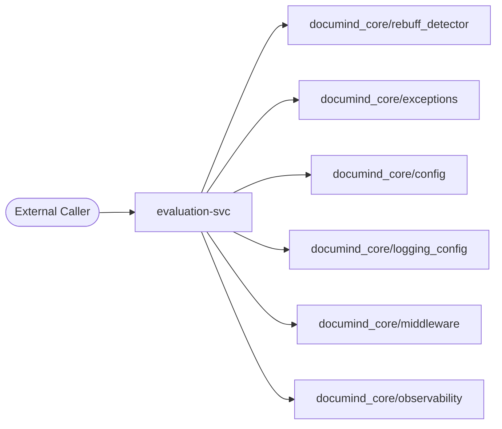
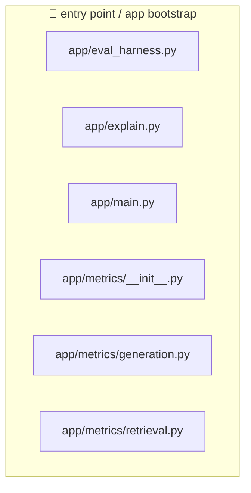
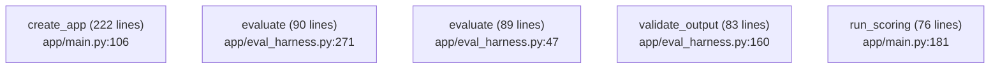
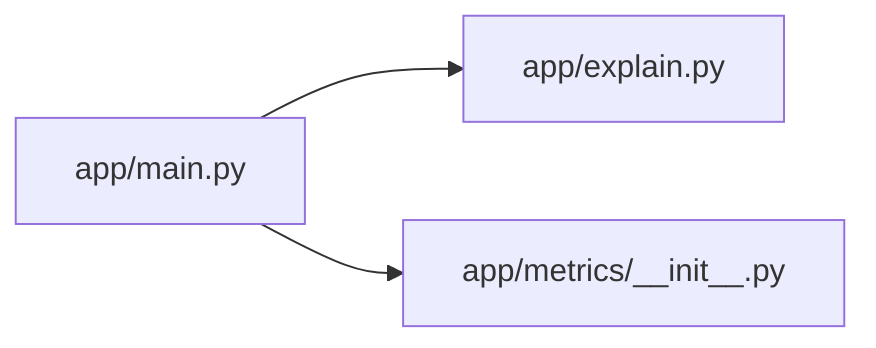
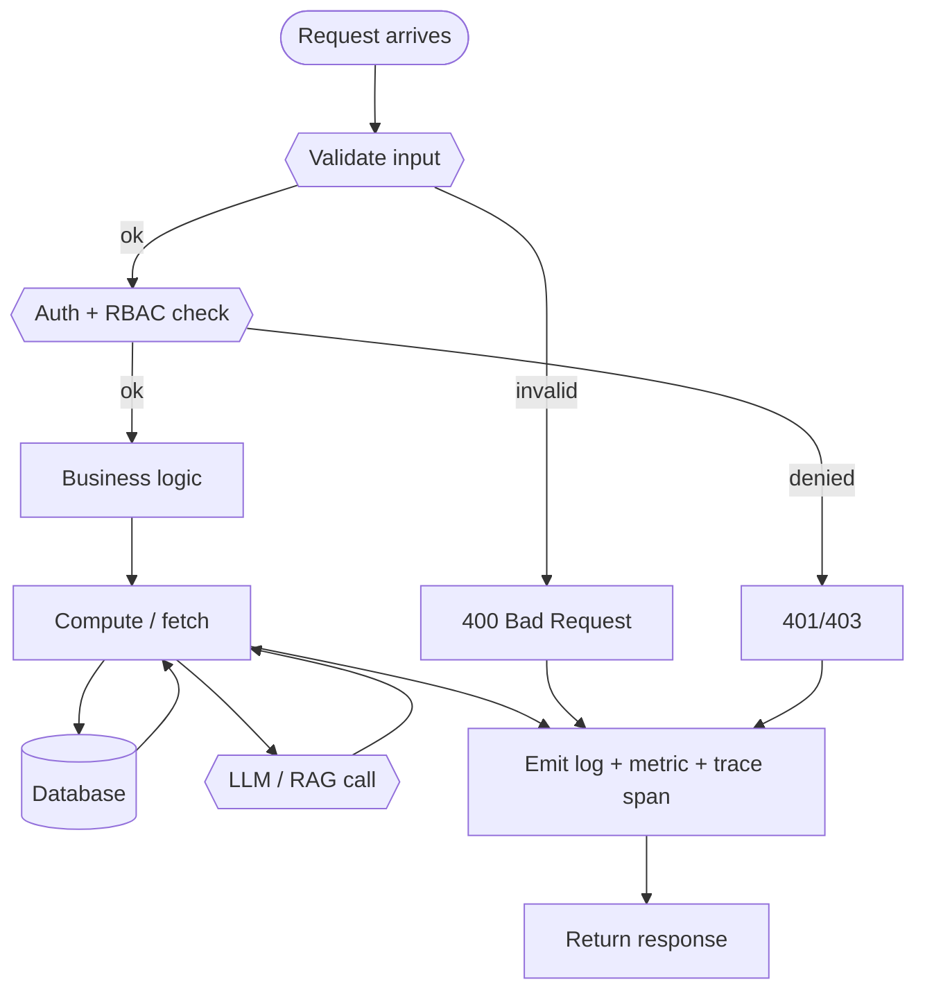
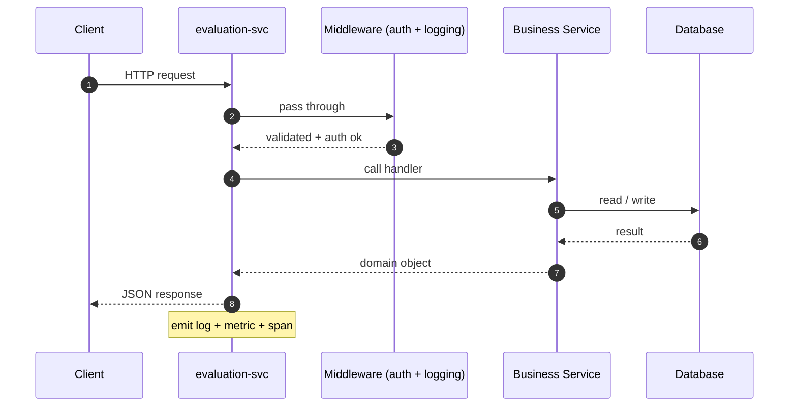
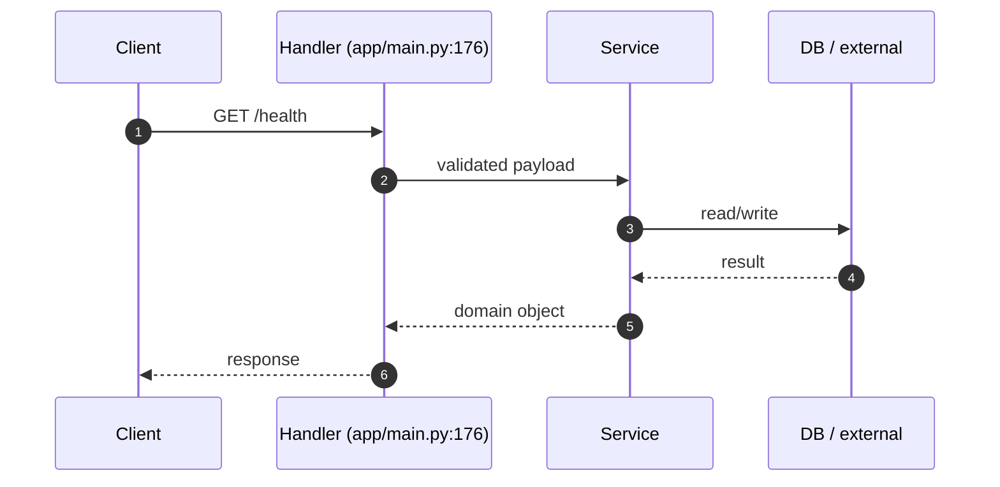
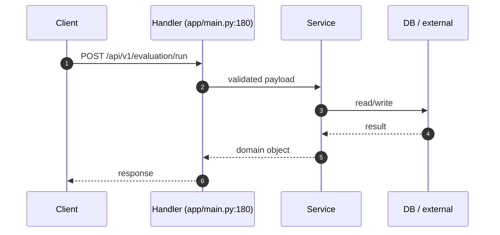

# 📦 `evaluation-svc` — Advanced README

🧩 **Service**  ·  **Path:** `services/evaluation-svc`  ·  **Generated:** 2026-05-16 20:02 UTC

> Evaluation service (Design Areas 26, 59, 60, 61).

This README is **auto-generated** by [`scripts/generate_folder_report.py`](../../scripts/generate_folder_report.py). It explains what this folder does, every file inside it, how the files link to each other, every API endpoint, every database call, every test case, and the production controls (security / reliability / performance / observability). Re-run after major changes.

---

## 🔎 Section 0 — Auto-Detected Facts

| Metric | Value |
|---|---|
| Folder | `services/evaluation-svc` |
| Total files | 13 |
| Python files | 7 |
| TypeScript/JS files | 0 |
| Go files | 0 |
| Shell scripts | 0 |
| Lines of code | 1,109 |
| Python classes | 24 |
| Python functions | 36 |
| Async functions | 6 |
| Total API endpoints | 2 |
| Total DB call sites | 1 |
| DB / Storage libs | Kafka (aiokafka) |
| Concurrency primitives | Lock / RLock, asyncio (async/await), threading |
| Caching primitives | _(none)_ |
| Input validation | Pydantic BaseModel |
| AI / LLM deps | DeepEval, Giskard, Ragas, Rebuff (PI defense) |
| Test files | 0 |
| Detected test cases | 0 |
| Tests dir present | ❌ — flag |
| Dockerfile | ✅ |
| pyproject.toml | ❌ |
| go.mod | ❌ |
| package.json | ❌ |
| Top git contributors | `14	PraveenAsthana123`, `3	Praveen` |

#### Longest functions (top 5)

| Location | Name | Lines |
|---|---|---|
| `app/main.py:106` | `create_app` | 222 |
| `app/eval_harness.py:271` | `evaluate` | 90 |
| `app/eval_harness.py:47` | `evaluate` | 89 |
| `app/eval_harness.py:160` | `validate_output` | 83 |
| `app/main.py:181` | `run_scoring` | 76 |

#### Smells detected

_(no smells detected by grep)_


## 1. Purpose — Business + Technical

### Business problem this folder solves

> _Reviewer to fill: Evaluation service (Design Areas 26, 59, 60, 61)._

### Technical contract this folder exposes

> _Reviewer to fill: API surface, events emitted, data persisted, downstream consumers._

### Out-of-scope (what this folder does NOT do)

> _Reviewer to fill: explicit non-goals — prevents scope creep at review time._


## 2. File Inventory

Every Python file in this folder, with role / classes / functions / LOC / first docstring line. Full absolute paths listed below the table for easy `cat`-ability.

| Relative path | Role (inferred) | Classes | Functions | LOC | Summary |
|---|---|---|---|---|---|
| `app/eval_harness.py` | 🚀 entry point / app bootstrap | 5 | 1 | 600 | Stage-1 eval-harness — Ragas + Guardrails AI + DeepEval scaffolds. |
| `app/explain.py` | 🚀 entry point / app bootstrap | 5 | 2 | 221 | §48 Explainability endpoint — `/api/v1/explain?prediction_id=<id>`. |
| `app/main.py` | 🚀 entry point / app bootstrap | 8 | 1 | 331 | Evaluation service (Design Areas 26, 59, 60, 61). |
| `app/metrics/__init__.py` | 🚀 entry point / app bootstrap | 0 | 0 | 26 | Evaluation metrics (Design Area 26, 59, 60, 61). |
| `app/metrics/generation.py` | 🚀 entry point / app bootstrap | 2 | 1 | 45 | Generation metrics — faithfulness and answer relevance. |
| `app/metrics/retrieval.py` | 🚀 entry point / app bootstrap | 4 | 0 | 59 | Retrieval metrics — precision@k, recall, MRR, NDCG. |

### Absolute paths (clickable)

- `/mnt/deepa/rag/services/evaluation-svc/app/eval_harness.py`
- `/mnt/deepa/rag/services/evaluation-svc/app/explain.py`
- `/mnt/deepa/rag/services/evaluation-svc/app/main.py`
- `/mnt/deepa/rag/services/evaluation-svc/app/metrics/__init__.py`
- `/mnt/deepa/rag/services/evaluation-svc/app/metrics/generation.py`
- `/mnt/deepa/rag/services/evaluation-svc/app/metrics/retrieval.py`


## 3. C4 Model — Context / Container / Component / Code

### Level 1 — System Context

_Where does this folder sit in the broader system?_



### Level 2 — Container

_What external dependencies does this folder talk to?_

```mermaid
flowchart TB
    subgraph evaluation-svc
        Code[Source Code]
    end
    Code --> DB_0[("Kafka (aiokafka)")]
    Code --> AI_0{{LLM: DeepEval}}
    Code --> AI_1{{LLM: Giskard}}
    Code --> AI_2{{LLM: Ragas}}
    Code --> AI_3{{LLM: Rebuff (PI defense)}}
```

### Level 3 — Component

_Internal files grouped by inferred role._



### Level 4 — Code (top hotspots)

_Longest functions — these are the most likely refactor candidates._




## 4. Code Sequence — How Files Link to Each Other

**Import graph for files in this folder.** Reading order: start at any entry-point file (look for `🚀 entry point` role in the inventory above), then follow the arrows.



### Edge list

| From file | To file | Import-count |
|---|---|---|
| `app/main.py` | `app/explain.py` | 1 |
| `app/main.py` | `app/metrics/__init__.py` | 1 |


## 5. Request Flowchart

Generic request lifecycle for this folder. Branches that don't apply are auto-removed based on detected dependencies (DB / cache / LLM).




## 6. API Endpoints — Input / Process / Output

**Detected endpoints:** 2

| Method | Route | Defined in | Input (schema) | Process (summary) | Output (schema) |
|---|---|---|---|---|---|
| `GET` | `/health` | `app/main.py:176` | _TBD_ | _TBD_ | _TBD_ |
| `POST` | `/api/v1/evaluation/run` | `app/main.py:180` | _TBD_ | _TBD_ | _TBD_ |

_Reviewer fills the last three columns from the Pydantic models in the handler. Auto-extraction of Pydantic schemas is on the roadmap._


## 7. Sequence Diagrams per Endpoint

### Generic flow (all endpoints)



### Per-endpoint sequence stubs (top 5)

### `GET /health` (app/main.py:176)



### `POST /api/v1/evaluation/run` (app/main.py:180)




## 8. Database Layer

**DB / storage libraries:** Kafka (aiokafka)

**Total DB call sites:** 1

| Pattern | Count |
|---|---|
| `ORM CRUD` | 1 |

### Query Optimization checklist

| Check | Status (✓/✗/⚠) | Notes |
|---|---|---|
| Indexes on every WHERE / ORDER BY column | — | EXPLAIN ANALYZE hot paths |
| Full table scans avoided | — | — |
| Batch operations used (not N writes in a loop) | — | — |
| Parameterized queries (NEVER f-string SQL) | — | — |

### Transactions (ACID)

| Check | Status (✓/✗/⚠) | Notes |
|---|---|---|
| Transaction boundaries narrow (no HTTP / LLM inside) | — | — |
| Rollback on exception | — | — |
| Isolation level documented (READ COMMITTED / SERIALIZABLE) | — | — |
| Deadlock prevention strategy | — | — |

### N+1 Query Findings (reviewer to fill)

| Endpoint / Function | Suspect Loop | Est. Queries / Request | Fix |
|---|---|---|---|
| — | — | — | — |


## 9. Code Quality + Complexity

### Readability

| Check | Status (✓/✗/⚠) | Notes |
|---|---|---|
| Clear variable / function / class names | — | — |
| No misleading naming (no `tmp` / `xyz` / `foo`) | — | — |
| Small focused functions (≤ 50 lines) | — | 5 > 50 lines (see Section 0) |
| Avoid deeply nested conditions (≤ 4 levels) | — | — |

### Clean code

| Check | Status (✓/✗/⚠) | Notes |
|---|---|---|
| No dead / commented-out code | — | — |
| No `print()` — use logger | — | — |
| No hardcoded values | — | smell count: 0 |
| Constants extracted to a settings module | — | — |

### Complexity

| Check | Status (✓/✗/⚠) | Notes |
|---|---|---|
| Long methods broken down | — | — |
| No overengineering (premature abstractions) | — | — |
| Cyclomatic complexity ≤ 15 per function | — | run `ruff complexity` or `radon` |


## 10. Security Review

### Authentication & Authorization

| Check | Status (✓/✗/⚠) | Notes |
|---|---|---|
| Authentication implemented correctly | — | Bearer / JWT / session |
| Authorization (RBAC / ABAC) checks | — | no client-side trust |
| Tokens validated server-side every request | — | rotate, expire, revoke |

### OWASP Top 10

| Check | Status (✓/✗/⚠) | Notes |
|---|---|---|
| Request validation present | — | sanitization: Pydantic BaseModel |
| SQL injection prevention | — | DB libs: Kafka (aiokafka) — parameterized queries only |
| XSS / CSRF prevention | — | output encoding / CSP / SameSite |
| Path traversal prevention | — | no user input concatenated to file paths |
| Prompt injection prevention | — | Rebuff / output filter |

### Secret Management

| Check | Status (✓/✗/⚠) | Notes |
|---|---|---|
| No secrets in code | — | smell count: 0 password literals, 0 api key literals |
| Env vars / Vault used | — | Pydantic BaseSettings or env reader |
| Secret rotation strategy | — | documented in runbook |

### Sensitive Data

| Check | Status (✓/✗/⚠) | Notes |
|---|---|---|
| PII masked in logs | — | structured logger with field redaction |
| Encryption in transit (TLS) | — | — |
| Encryption at rest (DB / object store) | — | — |
| GDPR — retention + right-to-be-forgotten | — | — |


## 11. Performance Review

### Memory

| Check | Status (✓/✗/⚠) | Notes |
|---|---|---|
| Large object retention avoided | — | — |
| Streaming for large files / data | — | — |
| Caches bounded (LRU / TTL) | — | caching: none |

### Concurrency

| Check | Status (✓/✗/⚠) | Notes |
|---|---|---|
| Thread safety validated | — | primitives: Lock / RLock, asyncio (async/await), threading |
| Race conditions prevented | — | — |
| Deadlocks avoided (lock ordering) | — | — |
| Parallel processing where beneficial | — | 6 async fns |

### Latency

| Check | Status (✓/✗/⚠) | Notes |
|---|---|---|
| External API calls batched / cached | — | — |
| Timeouts on every external call | — | — |
| No blocking I/O inside async functions | — | — |


## 12. Reliability & Observability

### Failure Handling

| Check | Status (✓/✗/⚠) | Notes |
|---|---|---|
| Retry (bounded + exp backoff + jitter) | — | — |
| Circuit breaker around external deps | — | — |
| Graceful degradation | — | — |

### Timeout Handling

| Check | Status (✓/✗/⚠) | Notes |
|---|---|---|
| Timeout on every external call (HTTP / DB / subprocess) | — | — |
| No infinite waits | — | — |

### Observability

| Check | Status (✓/✗/⚠) | Notes |
|---|---|---|
| Structured (JSON) logging | — | correlation_id + tenant_id + request_id |
| Metrics (RED: rate / errors / duration) | — | — |
| Tracing (OpenTelemetry → Jaeger / Tempo) | — | — |
| Baggage propagation across services | — | — |


## 13. Test Cases

**Test files detected:** 0
_No `test_*` functions parsed via AST. Either tests live elsewhere or names don't match the `test_*` convention._


## 14. Logging & Monitoring

### Logging

| Check | Status (✓/✗/⚠) | Notes |
|---|---|---|
| Structured (JSON) logs | — | — |
| Correlation ID present | — | — |
| No PII / secrets in log lines | — | — |
| No excessive logging (no logs in hot loops) | — | — |

### Monitoring

| Check | Status (✓/✗/⚠) | Notes |
|---|---|---|
| Alerts defined (SLO-burn aware) | — | — |
| Dashboards exist (Grafana) | — | — |
| On-call playbook references | — | — |


## 15. LLM / GenAI / RAG

**Detected AI deps:** DeepEval, Giskard, Ragas, Rebuff (PI defense)

### Prompt Safety

| Check | Status (✓/✗/⚠) | Notes |
|---|---|---|
| Prompt injection handling (input filter) | — | Rebuff |
| Output sanitization | — | — |
| Prompt versioning in registry | — | — |
| Toxicity / bias filtering | — | — |

### RAG Quality

| Check | Status (✓/✗/⚠) | Notes |
|---|---|---|
| Chunking strategy validated (size + overlap) | — | — |
| Embedding model versioned (re-embed on bump) | — | — |
| Vector DB query optimized (recall@k measured) | — | — |
| Metadata filtering exists (per-tenant) | — | — |

### Cost

| Check | Status (✓/✗/⚠) | Notes |
|---|---|---|
| Model fallback strategy defined | — | — |
| Token usage minimized (cache / truncation) | — | — |
| Per-tenant cost ceiling enforced | — | — |

### Explainability / Responsible AI

| Check | Status (✓/✗/⚠) | Notes |
|---|---|---|
| Citation / source grounding (every claim cited) | — | — |
| Confidence scoring (Ragas / DeepEval) | — | Ragas |
| Decision audit row per prediction (§48) | — | — |
| Fairness / bias checks | — | — |


## 16. SOLID + Microservice Principles

### SOLID

| Check | Status (✓/✗/⚠) | Notes |
|---|---|---|
| S — Single Responsibility (one reason to change per class) | — | — |
| O — Open/Closed (extend via composition, not modification) | — | — |
| L — Liskov Substitution (subclasses honor contracts) | — | — |
| I — Interface Segregation (no fat interfaces) | — | — |
| D — Dependency Inversion (depend on abstractions) | — | — |

### Microservice

| Check | Status (✓/✗/⚠) | Notes |
|---|---|---|
| Single business capability | — | — |
| Bounded context (no domain bleed) | — | — |
| Independent deploy (no coupled releases) | — | — |
| Resilience patterns (CB / retry / bulkhead) | — | — |


## 17. Integration with Other Folders

### Internal — other folders in this repo

| Folder / Module | Import-count | Purpose |
|---|---|---|
| `documind_core/rebuff_detector` | 3 | _reviewer-described_ |
| `documind_core/exceptions` | 1 | _reviewer-described_ |
| `documind_core/config` | 1 | _reviewer-described_ |
| `documind_core/logging_config` | 1 | _reviewer-described_ |
| `documind_core/middleware` | 1 | _reviewer-described_ |
| `documind_core/observability` | 1 | _reviewer-described_ |
| `documind_core/schemas` | 1 | _reviewer-described_ |
| `app/explain` | 1 | _reviewer-described_ |
| `app/metrics` | 1 | _reviewer-described_ |
| `documind_core/kafka_client` | 1 | _reviewer-described_ |

### External — third-party packages

| Package | Import-count |
|---|---|
| `deepeval` | 8 |
| `fastapi` | 2 |
| `pydantic` | 2 |
| `ragas` | 1 |
| `ragas_eval_adapter` | 1 |
| `guardrails` | 1 |
| `ssl` | 1 |
| `lakera_guard` | 1 |
| `rebuff` | 1 |
| `giskard` | 1 |
| `generation` | 1 |
| `retrieval` | 1 |


## 18. Debugging Guide

### Step-by-step when something breaks

```
1. Tail logs:        tail -50 /tmp/evaluation-svc.log   (if host-side)
                     docker logs documind-evaluation-svc --tail=50   (if container)
2. Health probe:     curl http://localhost:<PORT>/health
3. Fleet probe:      python3 scripts/advanced_healthcheck.py --layer app
4. Trace:            Open Jaeger → search request_id → see span tree
5. Metrics:          Open Grafana → service dashboard → look for spike
6. Drill:            ls mcp/tests/drill_*evaluation-svc*.py and run
```

### Common failure modes

| Symptom | Likely cause | Fix |
|---|---|---|
| 502 / connection refused | service down | check `circuitrag-status.sh` |
| Slow p95 latency | DB N+1 or LLM throttle | Section 8 + Section 15 |
| 5xx spike | downstream dep down | check `/health/upstreams` |
| Memory growth | unbounded cache or closure leak | Section 11 |
| Wrong-tenant data | RLS bypass | tenant isolation drill |


## 19. Production Gates (hard pass/fail)

| Gate | Target | Status | Evidence |
|---|---|---|---|
| Code coverage ≥ 80% | statements + branches | — | — |
| Naming convention enforced | ruff / eslint | — | — |
| Zero critical CVEs | Trivy / Bandit | — | — |
| No hardcoded secrets | gitleaks | — | — |
| No memory leaks | bounded caches | — | smells: 0 |
| No N+1 queries | hot paths reviewed | — | 1 DB call sites |
| All APIs validated | Pydantic / Zod | — | sanitization: Pydantic BaseModel |
| Duplicate logic eliminated | DRY check | — | — |
| Structured logging with correlation_id | — | — | — |
| Distributed tracing wired | OpenTelemetry | — | — |
| For AI: prompt injection tested | Rebuff / Garak | — | AI deps present |
| For AI: hallucination scoring ≥ 0.85 | Ragas faithfulness | — | yes |


## 20. Final Production Readiness Score

| Area | Score (/10) |
|---|---|
| Architecture | — |
| Security | — |
| Performance | — |
| Reliability | — |
| Observability | — |
| Testing | — |
| Scalability | — |
| AI Safety | — |
| DevOps | — |
| Maintainability | — |
| **Total** | **— / 100** |

### Decision

- [ ] **GO** — Production-ready (≥80, no failed gates)
- [ ] **CONDITIONAL GO** — Ship with documented follow-ups (≥60)
- [ ] **NO-GO** — Block release (any critical-red gate, or <60)

### Critical blockers

1. _TBD_

### Follow-ups (post-ship)

| ID | Description | Owner | Due |
|---|---|---|---|
| — | — | — | — |

### Sign-off

| Role | Name | Date | Signature |
|---|---|---|---|
| Tech Lead | — | — | — |
| Security | — | — | — |
| SRE | — | — | — |

---

_Generated by `scripts/generate_folder_report.py`. Re-run after major folder changes:_
_`python3 scripts/generate_folder_report.py --folder <this-folder> --force`_
