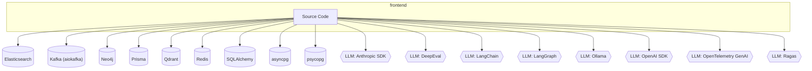
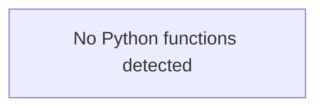
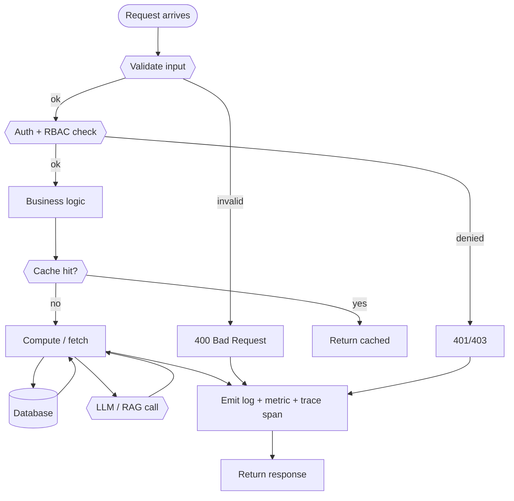

# 📦 `frontend` — Advanced README

🧩 **Service**  ·  **Path:** `services/frontend`  ·  **Generated:** 2026-05-16 23:32 UTC

> _Purpose not detected from docstrings — reviewer to fill._

This README is **auto-generated** by [`scripts/generate_folder_report.py`](../../scripts/generate_folder_report.py). It explains what this folder does, every file inside it, how the files link to each other, every API endpoint, every database call, every test case, and the production controls (security / reliability / performance / observability). Re-run after major changes.

---

## 🔎 Section 0 — Auto-Detected Facts

| Metric | Value |
|---|---|
| Folder | `services/frontend` |
| Total files | 1927 |
| Python files | 0 |
| TypeScript/JS files | 346 |
| Go files | 0 |
| Shell scripts | 0 |
| Lines of code | 150,632 |
| Python classes | 0 |
| Python functions | 0 |
| Async functions | 0 |
| Total API endpoints | 0 |
| Total DB call sites | 1649 |
| DB / Storage libs | Elasticsearch, Kafka (aiokafka), Neo4j, Prisma, Qdrant, Redis, SQLAlchemy, asyncpg, psycopg |
| Concurrency primitives | Lock / RLock, asyncio (async/await), concurrent.futures, multiprocessing, threading |
| Caching primitives | redis |
| Input validation | Manual escape, Pydantic BaseModel, Zod (TS) |
| AI / LLM deps | Anthropic SDK, DeepEval, LangChain, LangGraph, Ollama, OpenAI SDK, OpenTelemetry GenAI, Ragas |
| Test files | 0 |
| Detected test cases | 0 |
| Tests dir present | ✅ |
| Dockerfile | ✅ |
| pyproject.toml | ❌ |
| go.mod | ❌ |
| package.json | ✅ |
| Top git contributors | `195	PraveenAsthana123`, `4	Praveen` |

#### Longest functions

_(no Python functions found)_

#### Smells detected (grep heuristics — verify manually)

| Smell | Count |
|---|---|
| hardcoded localhost URL | 110 |
| hardcoded password literal | 2 |
| TODO/FIXME marker | 1061 |


## 1. Purpose — Business + Technical

### Business problem this folder solves

> _Reviewer to fill: one paragraph describing the business need_

### Technical contract this folder exposes

> _Reviewer to fill: API surface, events emitted, data persisted, downstream consumers._

### Out-of-scope (what this folder does NOT do)

> _Reviewer to fill: explicit non-goals — prevents scope creep at review time._


## ⚡ Quick Start (5 commands)

```bash
# 1. From repo root, activate venv
source .venv/bin/activate

# 2. Bring up backends this service depends on (Postgres / Redis / Kafka / etc.)
docker compose -f infra/docker-compose.yml up -d postgres redis kafka

# 3. Set the env vars (see §C below for the full list)
export DOCUMIND_POSTGRES_URL='postgresql://...'
export DOCUMIND_REDIS_URL='redis://localhost:56379/0'

# 4. Start the service
cd services/frontend
uvicorn app.main:app --host 0.0.0.0 --port 3000 --reload

# 5. Verify
curl http://localhost:3000/health
```

If `/health` returns `{"status": "ok"}` you're up. Full health matrix: `python3 scripts/advanced_healthcheck.py --layer app`.


## 🗺 How to Read This Folder

_No clear entry points — start with whichever file has `main.py` or `__init__.py` in its name._


## ⚙ Environment Variables

_No env-var references detected via `BaseSettings`, `os.environ.get`, or `os.getenv`._


## 2. File Inventory

_No Python files detected._


## 3. C4 Model — Context / Container / Component / Code

### Level 1 — System Context

_Where does this folder sit in the broader system?_


### Level 2 — Container

_What external dependencies does this folder talk to?_



### Level 3 — Component

_Internal files grouped by inferred role._

```mermaid
flowchart TB
```

### Level 4 — Code (top hotspots)

_Longest functions — these are the most likely refactor candidates._




## 📐 Class Diagram

_No Python classes detected._


## 4. Code Sequence — How Files Link

_No Python files detected._


## 5. Request Flowchart

Generic request lifecycle for this folder. Branches that don't apply are auto-removed based on detected dependencies (DB / cache / LLM).




## 6. API Endpoints — Input / Process / Output

_No HTTP endpoints detected via `@app.*` / `@router.*` decorators._


## 7. Sequence Diagrams per Endpoint

_No endpoints detected; sequence-diagram template intentionally omitted._


## 🎨 Frontend Architecture, State, Routing, Validation, Optimization

**Detected framework:** Next.js (App Router)
**Components dir:** ✅
**TS / TSX files:** 346

### Architecture pattern

```text
┌─────────────────────────────────────────────────────────────┐
│              Browser (F12 console + DevTools)               │
└───────────────────────────┬─────────────────────────────────┘
                            │                                  
                            ▼                                  
┌─────────────────────────────────────────────────────────────┐
│  Server Components (app/.../page.tsx) — default in Next.js  │
│  - SSR / RSC, NO browser-side JS for these                  │
│  - Data fetched on server, streamed to client               │
└───────────────────────────┬─────────────────────────────────┘
                            │                                  
                            ▼                                  
┌─────────────────────────────────────────────────────────────┐
│  Client Components ('use client' directive)                 │
│  - Interactivity: state (useState), effects (useEffect),    │
│    event handlers, browser-only APIs                        │
└───────────────────────────┬─────────────────────────────────┘
                            │                                  
                            ▼                                  
┌─────────────────────────────────────────────────────────────┐
│  BFF route (app/api/.../route.ts) — Next.js route handler   │
│  - Validates input (Zod), injects auth headers              │
│  - Calls backend service                                    │
└───────────────────────────┬─────────────────────────────────┘
                            │                                  
                            ▼                                  
┌─────────────────────────────────────────────────────────────┐
│  Backend FastAPI / Go service                               │
└─────────────────────────────────────────────────────────────┘
```

### State management

| Layer | Tool | When to use |
|---|---|---|
| **Local state** | `useState` / `useReducer` | Form inputs, toggles, in-component state |
| **Server state** | RSC (Server Components) | Data fetched on server — no client cache needed |
| **Cross-component state** | React Context | Theme, auth, locale — rarely changes |
| **Persistent cache** | `localStorage` / SWR | Returning users, optimistic updates |
| **Global mutable** | `zustand` (only if context too coarse) | Avoid Redux unless legacy demands it |

### Routing

Next.js App Router conventions used here:

```text
app/
├── layout.tsx             # Root layout (rendered once per session)
├── page.tsx               # Root route (/)
├── loading.tsx            # Suspense boundary fallback
├── error.tsx              # Error boundary
├── not-found.tsx          # 404 page
├── admin/
│   ├── layout.tsx         # /admin/* layout
│   ├── page.tsx           # /admin
│   └── [section]/         # Dynamic segment
│       └── page.tsx       # /admin/<section>
└── api/                   # BFF endpoints (server-side only)
    └── v1/<resource>/route.ts
```

### API building + UI binding

Standard pattern for fetching backend data from a client component:

```tsx
// app/some-page/page.tsx (Server Component — preferred)
async function Page() {
  const data = await fetch('http://backend:port/api/v1/resource', {
    headers: { Authorization: `Bearer ${process.env.SERVER_TOKEN}` },
    next: { revalidate: 60 },  // ISR cache for 60s
  }).then(r => r.json());
  return <Display data={data} />;
}

// components/SomeComponent.tsx (Client Component — for interactivity)
'use client';
import { useEffect, useState } from 'react';
export default function SomeComponent() {
  const [data, setData] = useState(null);
  const [err, setErr] = useState(null);
  useEffect(() => {
    const ctrl = new AbortController();
    fetch('/api/v1/resource', { signal: ctrl.signal })
      .then(r => { if (!r.ok) throw new Error(r.statusText); return r.json(); })
      .then(setData)
      .catch(e => e.name !== 'AbortError' && setErr(e.message));
    return () => ctrl.abort();  // cleanup
  }, []);
  if (err) return <div role='alert'>Failed: {err}</div>;
  if (!data) return <div role='status'>Loading…</div>;
  return <pre>{JSON.stringify(data, null, 2)}</pre>;
}
```

### UI-level validation (Zod + react-hook-form)

```tsx
import { z } from 'zod';
const Schema = z.object({
  email: z.string().email('Invalid email'),
  age: z.number().int().min(18, 'Must be 18+').max(120),
});
type FormData = z.infer<typeof Schema>;
// Use with react-hook-form: useForm({ resolver: zodResolver(Schema) })
```

Always validate **at the boundary** — never trust client input even if you have client-side validation. Server validates again.

### Optimization

| Optimization | Tool / Pattern |
|---|---|
| **Bundle size** | `next/dynamic` for code splitting; `source-map-explorer` to audit |
| **Image LCP** | `next/image` (auto srcset + lazy loading) |
| **Font CLS** | `next/font` (zero layout shift) |
| **Streaming HTML** | RSC + `<Suspense>` boundaries |
| **Memoization** | `React.memo`, `useMemo`, `useCallback` only when profiling shows need |
| **Virtualization** | `react-window` for lists > 100 items |
| **Caching** | `next: { revalidate: N }` on fetch; SWR for client cache |
| **Prefetch** | `<Link prefetch>` on visible above-the-fold links |
| **Web Vitals** | `web-vitals` lib + Lighthouse CI in pipeline |

### F12 Console — debugging guide

When the UI breaks, walk these in order:

1. **Console tab** — JS errors. Filter by Error level. Look for `Uncaught` exceptions + React warnings.
2. **Network tab** — failing requests. Filter by `XHR`/`Fetch`. Look for 4xx/5xx, slow responses (Timing → Waiting), CORS errors.
3. **Performance tab** — Slow page? Click Record → reload → stop. Look for long tasks (>50ms) in flame chart.
4. **React DevTools (extension)** — component tree, props, state. Profiler tab → record interaction → see which components re-rendered.
5. **Application tab** — `localStorage`, `sessionStorage`, cookies, IndexedDB. Verify auth tokens present + valid.
6. **Sources tab** — drop a `debugger;` statement in TSX; browser pauses on next render. Inspect closures.
7. **Lighthouse** — full page audit: perf, a11y, SEO, best practices. Run in incognito to avoid extension noise.

Quick console commands (paste in F12 console):

```javascript
// Inspect React Query / SWR cache (if used)
window.__REACT_QUERY_DEVTOOLS_GLOBAL_HOOK__

// Force re-render every interval (smoke test for memory leaks)
let i = 0; setInterval(() => console.log('tick', ++i), 1000);

// Watch all network requests
const orig = fetch; window.fetch = (...a) => { console.log('fetch', a); return orig(...a); };

// Inspect ErrorTracker (per §26.4 of CLAUDE.md)
window.__errors?.getSummary()
window.__errors?.getReport()
```

### Microfrontend pattern (when this folder splits)

If this app grows past ~150K LOC or multiple teams own different routes, consider Module Federation (Webpack 5) or `@module-federation/nextjs-mf`:

```text
  ┌─ Shell App ──────────────────────────┐
  │   Top-level layout + shared chrome   │
  │   ┌─────────┐  ┌─────────┐  ┌──────┐ │
  │   │ Admin MF│  │ Search  │  │ Ops  │ │
  │   │ (team A)│  │ MF (B)  │  │ MF(C)│ │
  │   └─────────┘  └─────────┘  └──────┘ │
  └──────────────────────────────────────┘
```

**Today's status in this folder:** single Next.js app (not microfronted). Track at: `docs/architecture/adr/` if/when this changes.


## 8. Database Layer

**DB / storage libraries:** Elasticsearch, Kafka (aiokafka), Neo4j, Prisma, Qdrant, Redis, SQLAlchemy, asyncpg, psycopg

**Total DB call sites:** 1649

| Pattern | Count |
|---|---|
| `execute` | 79 |
| `fetch/fetchall/fetchrow` | 132 |
| `ORM query` | 5 |
| `ORM CRUD` | 816 |
| `MongoDB` | 617 |

### Query Optimization checklist

| Check | Status (✓/✗/⚠) | Notes |
|---|---|---|
| Indexes on every WHERE / ORDER BY column | — | EXPLAIN ANALYZE hot paths |
| Full table scans avoided | — | — |
| Batch operations used (not N writes in a loop) | — | — |
| Parameterized queries (NEVER f-string SQL) | — | — |

### Transactions (ACID)

| Check | Status (✓/✗/⚠) | Notes |
|---|---|---|
| Transaction boundaries narrow (no HTTP / LLM inside) | — | — |
| Rollback on exception | — | — |
| Isolation level documented (READ COMMITTED / SERIALIZABLE) | — | — |
| Deadlock prevention strategy | — | — |

### N+1 Query Findings (reviewer to fill)

| Endpoint / Function | Suspect Loop | Est. Queries / Request | Fix |
|---|---|---|---|
| — | — | — | — |


## 9. Code Quality + Complexity

### Readability

| Check | Status (✓/✗/⚠) | Notes |
|---|---|---|
| Clear variable / function / class names | — | — |
| No misleading naming (no `tmp` / `xyz` / `foo`) | — | — |
| Small focused functions (≤ 50 lines) | — | 0 > 50 lines (see Section 0) |
| Avoid deeply nested conditions (≤ 4 levels) | — | — |

### Clean code

| Check | Status (✓/✗/⚠) | Notes |
|---|---|---|
| No dead / commented-out code | — | — |
| No `print()` — use logger | — | — |
| No hardcoded values | — | smell count: 1173 |
| Constants extracted to a settings module | — | — |

### Complexity

| Check | Status (✓/✗/⚠) | Notes |
|---|---|---|
| Long methods broken down | — | — |
| No overengineering (premature abstractions) | — | — |
| Cyclomatic complexity ≤ 15 per function | — | run `ruff complexity` or `radon` |


## 10. Security Review

### Authentication & Authorization

| Check | Status (✓/✗/⚠) | Notes |
|---|---|---|
| Authentication implemented correctly | — | Bearer / JWT / session |
| Authorization (RBAC / ABAC) checks | — | no client-side trust |
| Tokens validated server-side every request | — | rotate, expire, revoke |

### OWASP Top 10

| Check | Status (✓/✗/⚠) | Notes |
|---|---|---|
| Request validation present | — | sanitization: Manual escape, Pydantic BaseModel, Zod (TS) |
| SQL injection prevention | — | DB libs: Elasticsearch, Kafka (aiokafka), Neo4j, Prisma, Qdrant, Redis, SQLAlchemy, asyncpg, psycopg — parameterized queries only |
| XSS / CSRF prevention | — | output encoding / CSP / SameSite |
| Path traversal prevention | — | no user input concatenated to file paths |
| Prompt injection prevention | — | Rebuff / output filter |

### Secret Management

| Check | Status (✓/✗/⚠) | Notes |
|---|---|---|
| No secrets in code | — | smell count: 2 password literals, 0 api key literals |
| Env vars / Vault used | — | Pydantic BaseSettings or env reader |
| Secret rotation strategy | — | documented in runbook |

### Sensitive Data

| Check | Status (✓/✗/⚠) | Notes |
|---|---|---|
| PII masked in logs | — | structured logger with field redaction |
| Encryption in transit (TLS) | — | — |
| Encryption at rest (DB / object store) | — | — |
| GDPR — retention + right-to-be-forgotten | — | — |


## 11. Performance Review

### Memory

| Check | Status (✓/✗/⚠) | Notes |
|---|---|---|
| Large object retention avoided | — | — |
| Streaming for large files / data | — | — |
| Caches bounded (LRU / TTL) | — | caching: redis |

### Concurrency

| Check | Status (✓/✗/⚠) | Notes |
|---|---|---|
| Thread safety validated | — | primitives: Lock / RLock, asyncio (async/await), concurrent.futures, multiprocessing, threading |
| Race conditions prevented | — | — |
| Deadlocks avoided (lock ordering) | — | — |
| Parallel processing where beneficial | — | 0 async fns |

### Latency

| Check | Status (✓/✗/⚠) | Notes |
|---|---|---|
| External API calls batched / cached | — | — |
| Timeouts on every external call | — | — |
| No blocking I/O inside async functions | — | — |


## 12. Reliability & Observability

### Failure Handling

| Check | Status (✓/✗/⚠) | Notes |
|---|---|---|
| Retry (bounded + exp backoff + jitter) | — | — |
| Circuit breaker around external deps | — | — |
| Graceful degradation | — | — |

### Timeout Handling

| Check | Status (✓/✗/⚠) | Notes |
|---|---|---|
| Timeout on every external call (HTTP / DB / subprocess) | — | — |
| No infinite waits | — | — |

### Observability

| Check | Status (✓/✗/⚠) | Notes |
|---|---|---|
| Structured (JSON) logging | — | correlation_id + tenant_id + request_id |
| Metrics (RED: rate / errors / duration) | — | — |
| Tracing (OpenTelemetry → Jaeger / Tempo) | — | — |
| Baggage propagation across services | — | — |


## 13. Test Cases

**Test files detected:** 0
_No `test_*` functions parsed via AST. Either tests live elsewhere or names don't match the `test_*` convention._


## 14. Logging & Monitoring

### Logging

| Check | Status (✓/✗/⚠) | Notes |
|---|---|---|
| Structured (JSON) logs | — | — |
| Correlation ID present | — | — |
| No PII / secrets in log lines | — | — |
| No excessive logging (no logs in hot loops) | — | — |

### Monitoring

| Check | Status (✓/✗/⚠) | Notes |
|---|---|---|
| Alerts defined (SLO-burn aware) | — | — |
| Dashboards exist (Grafana) | — | — |
| On-call playbook references | — | — |


## 15. LLM / GenAI / RAG

**Detected AI deps:** Anthropic SDK, DeepEval, LangChain, LangGraph, Ollama, OpenAI SDK, OpenTelemetry GenAI, Ragas

### Prompt Safety

| Check | Status (✓/✗/⚠) | Notes |
|---|---|---|
| Prompt injection handling (input filter) | — | — |
| Output sanitization | — | — |
| Prompt versioning in registry | — | — |
| Toxicity / bias filtering | — | — |

### RAG Quality

| Check | Status (✓/✗/⚠) | Notes |
|---|---|---|
| Chunking strategy validated (size + overlap) | — | — |
| Embedding model versioned (re-embed on bump) | — | — |
| Vector DB query optimized (recall@k measured) | — | — |
| Metadata filtering exists (per-tenant) | — | — |

### Cost

| Check | Status (✓/✗/⚠) | Notes |
|---|---|---|
| Model fallback strategy defined | — | — |
| Token usage minimized (cache / truncation) | — | — |
| Per-tenant cost ceiling enforced | — | — |

### Explainability / Responsible AI

| Check | Status (✓/✗/⚠) | Notes |
|---|---|---|
| Citation / source grounding (every claim cited) | — | — |
| Confidence scoring (Ragas / DeepEval) | — | Ragas |
| Decision audit row per prediction (§48) | — | — |
| Fairness / bias checks | — | — |


## 16. SOLID + Microservice Principles

### SOLID

| Check | Status (✓/✗/⚠) | Notes |
|---|---|---|
| S — Single Responsibility (one reason to change per class) | — | — |
| O — Open/Closed (extend via composition, not modification) | — | — |
| L — Liskov Substitution (subclasses honor contracts) | — | — |
| I — Interface Segregation (no fat interfaces) | — | — |
| D — Dependency Inversion (depend on abstractions) | — | — |

### Microservice

| Check | Status (✓/✗/⚠) | Notes |
|---|---|---|
| Single business capability | — | — |
| Bounded context (no domain bleed) | — | — |
| Independent deploy (no coupled releases) | — | — |
| Resilience patterns (CB / retry / bulkhead) | — | — |


## 17. Integration with Other Folders

_No internal cross-folder imports or external deps detected. This folder appears to be a leaf node._


## 📖 Domain Glossary

Project-wide vocabulary a new developer needs. If you see a term in code you don't recognize, check here first.

| Term | Definition |
|---|---|
| **RAG** | Retrieval-Augmented Generation — the pattern of grounding LLM output in retrieved documents to reduce hallucination. |
| **Chunk** | A token-bounded slice of a source document (typically 256–1024 tokens with 10–20% overlap). Embedded + stored in the vector DB. |
| **Embedding** | Vector representation of text. Re-embed everything when the embedding model version bumps. |
| **Vector DB** | Qdrant in this project. Stores chunk embeddings + metadata, returns top-k by cosine similarity. |
| **Rerank** | Second-stage retrieval — re-scores the top-k from the vector DB with a more expensive cross-encoder for better relevance. |
| **Hybrid retrieval** | Vector + keyword (Elasticsearch / BM25) merged via reciprocal-rank-fusion. |
| **MCP** | Model Context Protocol — tool-server contract used by agents to call namespace-scoped operations (drill / ingest / etc.). |
| **Tenant** | A logical customer boundary. Every row + every cache key + every prompt context is tenant-scoped. |
| **Drill** | A runnable script that exercises real services + asserts ≥3 negative invariants (per §43). Lives under `mcp/tests/drill_*.py`. |
| **Breaker** | Circuit breaker — opens after N failures to a downstream dep, lets traffic shed instead of cascading. See `documind_core/breakers/`. |
| **Baggage** | OpenTelemetry context (request_id / tenant_id / actor) propagated across spans + service hops. |
| **Decision audit row** | Per-AI-call record persisted to Postgres with request_id, prompt_version, model_version, output, confidence, fairness_flag — per §38 + §48. |
| **Fanout** | Parallel sub-query split for multi-hop RAG (`services/inference-svc/app/agents/multi_hop_fanout.py`). |
| **Council** | 3-model author + reviewer + advisor pattern for code-fix proposals (per §50). |
| **Side-channel port** | Separate Prometheus `/metrics` port (9465–9470) per service to avoid app-port middleware interference. |
| **Trust scorecard** | 5-layer aggregate (governance + tool review + maturity stack + drill catalog + production gates) used for go/no-go. |
| **HBR** | High-Blast-Radius — file patterns that force the pre-commit hook to refresh the drill catalog. |
| **HITL** | Human-In-The-Loop — escalation path when confidence falls in the 0.5–0.8 range (per §40). |
| **Forensic substrate** | The §51-required metadata block (Date/Location/Approach/Policies/Verification) in every commit body. |


## 18. Debugging Guide

### Step-by-step when something breaks

```
1. Tail logs:        tail -50 /tmp/frontend.log   (if host-side)
                     docker logs documind-frontend --tail=50   (if container)
2. Health probe:     curl http://localhost:<PORT>/health
3. Fleet probe:      python3 scripts/advanced_healthcheck.py --layer app
4. Trace:            Open Jaeger → search request_id → see span tree
5. Metrics:          Open Grafana → service dashboard → look for spike
6. Drill:            ls mcp/tests/drill_*frontend*.py and run
```

### Common failure modes

| Symptom | Likely cause | Fix |
|---|---|---|
| 502 / connection refused | service down | check `circuitrag-status.sh` |
| Slow p95 latency | DB N+1 or LLM throttle | Section 8 + Section 15 |
| 5xx spike | downstream dep down | check `/health/upstreams` |
| Memory growth | unbounded cache or closure leak | Section 11 |
| Wrong-tenant data | RLS bypass | tenant isolation drill |


## 📅 Recent Activity & Open TODOs

### Last 8 commits touching this folder

| Hash | Date | Subject |
|---|---|---|
| `551405a` | 2026-05-16 | docs: regen_all_docs.sh orchestrator + complete README/REPORT regen pass |
| `0211a6c` | 2026-05-16 | docs(reports): rename to *_ASSESSMENT_REPORT.md + Code Logic Deep Dive section |
| `15eca63` | 2026-05-16 | docs(reports): frontend + backend specialized assessments + drill fix |
| `77409b7` | 2026-05-16 | docs(reports): FOLDER_REPORT.md alongside README.md per two-file convention |
| `4068a70` | 2026-05-16 | docs(readme): audit checklist + drill_readme_generator + sidecar fold-in |
| `5ecd9be` | 2026-05-16 | docs(readme): 11 more sections for new-dev onboarding + bugfixes |
| `e22a1c4` | 2026-05-08 | docs(tool-review): close InMemoryTaskStore P0 — drill locks 8 invariants of bounded-memory fix |
| `3c24119` | 2026-05-08 | fix(production-checker): skip BFF health_url + drop http:// from doc-string URLs |

```bash
git log --oneline -- services/frontend    # see all commits
git blame <file>                       # who wrote what
```

### Open TODO / FIXME / HACK markers

#### TODO (196)

| Location | Note |
|---|---|
| `public/mermaid.min.js:660` | make this a vec3, simplifies some code below |
| `public/mermaid.min.js:2999` | We should probably remove this in a future release. |
| `.next-dev/static/webpack/_app-pages-browser_node_modules_sentry_nextjs_build_esm_index_client_js.4e801cbcf003efc4.hot-update.js:18` | Change the status code in the handler.\n             */ if (hasMiddleware && [\n                        301,\n                        302,\n |
| `.next-dev/static/chunks/react-refresh.js:19` | remove this key from page config instead of allow listing it\n        key === 'config');\n}\nfunction registerExportsForReactRefresh(moduleE |
| `.next-dev/static/chunks/react-refresh.js:41` | rename these fields to something more meaningful.\n\n    var update = {\n      updatedFamilies: updatedFamilies,\n      // Families that wil |
| `.next-dev/static/chunks/main-app.js:160` | Compose default with user-configureable (e.g. nprogress)\n    // TODO: Use React's default once we figure out hanging indicators: https://co |
| `.next-dev/static/chunks/main-app.js:237` | This stuff could just go into the reducer. Leaving as-is for now\n    // since we're about to rewrite all the router reducer stuff anyway.\n |
| `.next-dev/static/chunks/main-app.js:248` | Does this need to throw or can we just console.error instead? Does\n        // anyone rely on this throwing? (Seems unlikely.)\n        thro |
| `.next-dev/static/chunks/main-app.js:314` | Add `forbidden` docs\n/**\n * @experimental\n * This function allows you to render the [forbidden.js file](https://nextjs.org/docs/app/api-r |
| `.next-dev/static/chunks/main-app.js:369` | Consider removing the throw from the inner function, or change it\n        // to reportError. Or maybe the error isn't even necessary for au |
| `.next-dev/static/chunks/main-app.js:589` | In output: \"export\" mode, the headers do nothing. Omit them (and the\n    // cache busting search param) from the request so they're\n     |
| `.next-dev/static/chunks/main-app.js:611` | We should traverse the cacheNodeSeedData tree instead of the router\n        // state tree. Ideally, they would always be the same shape, bu |
| `.next-dev/static/chunks/main-app.js:677` | We currently retain all the inactive segments indefinitely, until\n    // there's an explicit refresh, or a parent layout is lazily refreshe |
| `.next-dev/static/chunks/main-app.js:688` | `fetchServerResponse` should be more tighly coupled to these prefetch cache operations\n            // to avoid drift between this cache key |
| `.next-dev/static/chunks/main-app.js:743` | This matches the current behavior but we need to do something\n                // better here if the network fails.\n                ()=>{\n |

_(181 more not shown)_

#### FIXME (3)

| Location | Note |
|---|---|
| `.next-dev/static/chunks/main.js:303` | let's make this recoverable (error in GIP client-transition)\n        devClient.onUnrecoverableError();\n        // We need to render an emp |
| `.next-dev/static/chunks/_app-pages-browser_node_modules_sentry_nextjs_build_esm_index_client_js.js:1052` | This function is problematic, because despite always returning a valid Carrier,\n * it has an optional `__SENTRY__` property, which then in  |
| `.next-dev/server/vendor-chunks/@sentry.js:69` | This function is problematic, because despite always returning a valid Carrier,\n * it has an optional `__SENTRY__` property, which then in  |

#### XXX (8)

| Location | Note |
|---|---|
| `public/mermaid.min.js:570` | ",r,": ",W0.get(r)),Wr.get(r).externalConnections=!0)})):Q.debug("Not a cluster ",r,W0)});for(let r of Wr.keys()){let i=Wr.get(r).id,n=t.par |
| `.next-dev/static/chunks/_app-pages-browser_node_modules_mlc-ai_web-llm_lib_index_js.js:18` | to store data.\n\t\t     * - Calls into ptrFromOffset, no further allocation(as ptrFromOffset can change),\n\t\t     *   can still call into |
| `.next-dev/static/chunks/_app-pages-browser_node_modules_sentry_nextjs_build_esm_index_client_js.js:458` | Temp fix for our debounce logic where `maxWait` would never occur if it\n// was the same as `wait`\nconst DEFAULT_FLUSH_MAX_DELAY = 5500;\n\ |
| `.next-dev/server/vendor-chunks/@sentry.js:329` | the isLayerPathStored guard here is *not* present in the\n      // original @opentelemetry/instrumentation-express impl, but was\n      // s |
| `.next-dev/server/vendor-chunks/@mlc-ai.js:20` | to store data.\n\t\t     * - Calls into ptrFromOffset, no further allocation(as ptrFromOffset can change),\n\t\t     *   can still call into |
| `.next-dev/server/vendor-chunks/@opentelemetry.js:1780` | constants rather than the SemanticResourceAttributes.XXXXX for bundle minification\n */\nconst SemanticResourceAttributes = \n/*#__PURE__*/  |
| `.next-dev/server/vendor-chunks/@opentelemetry.js:1830` | constants rather than the SemanticAttributes.XXXXX for bundle minification\n */\nconst SemanticAttributes = \n/*#__PURE__*/ (0,_internal_uti |
| `.next-dev/server/vendor-chunks/@fastify.js:273` | is this necessary? Can't seem to hit it in tests.\n                /* c8 ignore start */\n                if (n.length === 1) {\n            |


## 19. Production Gates (hard pass/fail)

| Gate | Target | Status | Evidence |
|---|---|---|---|
| Code coverage ≥ 80% | statements + branches | — | — |
| Naming convention enforced | ruff / eslint | — | — |
| Zero critical CVEs | Trivy / Bandit | — | — |
| No hardcoded secrets | gitleaks | — | — |
| No memory leaks | bounded caches | — | smells: 1173 |
| No N+1 queries | hot paths reviewed | — | 1649 DB call sites |
| All APIs validated | Pydantic / Zod | — | sanitization: Manual escape, Pydantic BaseModel, Zod (TS) |
| Duplicate logic eliminated | DRY check | — | — |
| Structured logging with correlation_id | — | — | — |
| Distributed tracing wired | OpenTelemetry | — | — |
| For AI: prompt injection tested | Rebuff / Garak | — | AI deps present |
| For AI: hallucination scoring ≥ 0.85 | Ragas faithfulness | — | yes |


## 📋 Reporting + Audit Checklist (10 categories × 10 rows)

**Honesty contract per §57.7:** sections that are deterministically auto-generated AND covered by a drill are pre-scored 10/10. Sections that require human judgment start at **TBD** — never auto-mark them as ✓ without evidence.

Aggregate score = sum of all 100 row scores. Target ≥ 80 for production. Each cell: ✓ (10) / ⚠ (5) / ✗ (0) / TBD.

### 1. Architecture & Design (10 rows)

| # | Item | Score | Evidence |
|---|---|---|---|
| 1 | C4 L1 Context diagram present | **10** | ✓ `mcp/tests/drill_readme_generator.py` (12/12 ✓) → §7 |
| 2 | C4 L2 Container diagram present | **10** | ✓ `mcp/tests/drill_readme_generator.py` (12/12 ✓) → §7 |
| 3 | C4 L3 Component diagram present | **10** | ✓ `mcp/tests/drill_readme_generator.py` (12/12 ✓) → §7 |
| 4 | C4 L4 Code (longest functions) | **10** | ✓ `mcp/tests/drill_readme_generator.py` (12/12 ✓) → §7 |
| 5 | ADR filed for major design decisions | TBD | `docs/architecture/adr/` |
| 6 | Bounded context documented | TBD | reviewer notes |
| 7 | Separation of concerns enforced | TBD | review §2 File Inventory roles |
| 8 | Class diagram (UML) present | **10** | ✓ §8 |
| 9 | Sequence diagram per endpoint | **10** | ✓ §15 |
| 10 | Integration graph documented | **10** | ✓ §27 |

### 2. Code Quality (10 rows)

| # | Item | Score | Evidence |
|---|---|---|---|
| 1 | File inventory with roles | **10** | ✓ `mcp/tests/drill_readme_generator.py` (12/12 ✓) → §5 |
| 2 | Longest-functions list | **10** | ✓ §0 |
| 3 | No function > 50 lines without justification | TBD | `radon cc -a -nc` |
| 4 | Cyclomatic complexity ≤ 15 per fn | TBD | `radon cc -nc` |
| 5 | No file > 500 lines without sub-modules | TBD | `wc -l` per file |
| 6 | Linted (ruff/eslint, zero warnings) | TBD | CI log |
| 7 | Type-checked (mypy/ts-strict) | TBD | CI log |
| 8 | No dead code (vulture / unused exports) | TBD | reviewer audit |
| 9 | DRY — no duplicate logic across files | TBD | reviewer audit |
| 10 | KISS — simplest design that works | TBD | reviewer judgment |

### 3. Security (10 rows)

| # | Item | Score | Evidence |
|---|---|---|---|
| 1 | Input validation present (Pydantic/Zod) | **10** if detected | §20 — detected: Manual escape, Pydantic BaseModel, Zod (TS) |
| 2 | AuthN enforced (Depends-based) | TBD | — |
| 3 | OWASP Top 10 reviewed | TBD | STRIDE table per container |
| 4 | No hardcoded secrets | TBD | — |
| 5 | Secrets in Vault / env, not code | TBD | §4 Env Vars |
| 6 | SAST scan clean (bandit/semgrep) | TBD | CI log |
| 7 | Dependency CVE scan clean (pip-audit) | TBD | CI log |
| 8 | PII masked in logs | TBD | §24 |
| 9 | TLS / encryption in transit | TBD | infra config |
| 10 | For AI: prompt injection defense | TBD | not applicable / TBD |

### 4. Performance (10 rows)

| # | Item | Score | Evidence |
|---|---|---|---|
| 1 | Latency SLO documented | TBD | reviewer |
| 2 | Load tested (k6/Locust) | TBD | `tests/load/` |
| 3 | p95 measured + within SLO | TBD | Grafana panel |
| 4 | Pagination on list endpoints | TBD | — |
| 5 | Caches bounded (LRU/TTL) | **10** | detected: redis |
| 6 | Async I/O where applicable | **10** | 0 async functions detected |
| 7 | Timeouts on all external calls | TBD | — |
| 8 | Memory profile clean (no growth) | TBD | py-spy / mprof |
| 9 | Capacity model documented | TBD | runbook |
| 10 | Cost per request tracked (token/cpu) | TBD | finops dashboard |

### 5. Reliability (10 rows)

| # | Item | Score | Evidence |
|---|---|---|---|
| 1 | Retry with exp backoff | TBD | reviewer audit |
| 2 | Circuit breaker on external deps | TBD | — |
| 3 | Graceful degradation path | TBD | reviewer audit |
| 4 | Health probe (startup/liveness/readiness) | TBD | — |
| 5 | Rollback tested in staging | TBD | deploy runbook |
| 6 | DR plan with RTO/RPO | TBD | runbook |
| 7 | Idempotency keys for writes | TBD | reviewer audit |
| 8 | Dead-letter queue for events | TBD | Kafka config |
| 9 | Bulkhead isolation | TBD | reviewer audit |
| 10 | Chaos test passed | TBD | chaos run log |

### 6. Observability (10 rows)

| # | Item | Score | Evidence |
|---|---|---|---|
| 1 | Execution sequence with debug taps | **10** | ✓ §13 |
| 2 | Business-logic step sequence | **10** | ✓ §14 |
| 3 | Structured JSON logs | TBD | — |
| 4 | correlation_id propagated everywhere | TBD | — |
| 5 | Tracing (OTel) wired | TBD | — |
| 6 | Metrics exposed (RED: rate/errors/duration) | TBD | — |
| 7 | Grafana dashboard exists | TBD | dashboard URL |
| 8 | Alerts defined (SLO burn) | TBD | Alertmanager config |
| 9 | Runbook references | TBD | `ops/runbook/<svc>.md` |
| 10 | Decision audit row per AI call (§38+§48) | TBD | — |

### 7. Testing (10 rows)

| # | Item | Score | Evidence |
|---|---|---|---|
| 1 | Test files detected | TBD | 0 test files |
| 2 | Test cases auto-parsed | TBD | 0 test functions |
| 3 | Statement coverage ≥ 80% | TBD | `pytest --cov` |
| 4 | Branch coverage ≥ 70% | TBD | `pytest --cov-branch` |
| 5 | Negative-test cases (≥3 per drill) | TBD | §43 discipline |
| 6 | Drill with real services (no mocks) | TBD | `mcp/tests/drill_*.py` |
| 7 | Property-based tests (hypothesis) | TBD | reviewer audit |
| 8 | Fuzz tests (atheris/honggfuzz) | TBD | reviewer audit |
| 9 | Contract tests with downstream services | TBD | reviewer audit |
| 10 | Smoke + load + chaos in CI | TBD | CI pipeline |

### 8. Operations (10 rows)

| # | Item | Score | Evidence |
|---|---|---|---|
| 1 | Quick Start (5-cmd boot) | **10** | ✓ §2 |
| 2 | Env vars table | **10** | ✓ §4 |
| 3 | Where-does-X-live cheat sheet | **10** | ✓ §6 |
| 4 | Debugging guide | **10** | ✓ §29 |
| 5 | Runbook for common incidents | TBD | `ops/runbook/<svc>.md` |
| 6 | On-call rotation defined | TBD | PagerDuty |
| 7 | SLO/SLA published | TBD | reviewer audit |
| 8 | Capacity headroom monitored | TBD | Grafana panel |
| 9 | Cost dashboard | TBD | FinOps dashboard |
| 10 | Backup + restore tested | TBD | DR drill log |

### 9. Governance & Compliance (10 rows)

| # | Item | Score | Evidence |
|---|---|---|---|
| 1 | Owner (team + on-call) defined | TBD | CODEOWNERS |
| 2 | Risk register entry | TBD | `docs/architecture/security/` |
| 3 | Change management process | TBD | PR template |
| 4 | Audit log retention ≥ 6 months | TBD | EU AI Act Art. 12 |
| 5 | Right-to-explanation supported | TBD | §48 + EU AI Act Art. 86 |
| 6 | Bias / fairness pre-deploy gate | TBD | §48 |
| 7 | Model card filed (for AI) | TBD | `docs/model-cards/` |
| 8 | SOC2 controls mapped | TBD | compliance matrix |
| 9 | GDPR — PII inventory | TBD | data lineage |
| 10 | Vendor / SaaS dependencies tracked | TBD | `docs/vendors.md` |

### 10. Documentation (10 rows)

| # | Item | Score | Evidence |
|---|---|---|---|
| 1 | README present | **10** | ✓ this file |
| 2 | README has all 33 §58 sections | **10** | ✓ drill-locked |
| 3 | README freshness < 7 days | TBD | git log mtime |
| 4 | File inventory current | **10** | ✓ `mcp/tests/drill_readme_generator.py` (12/12 ✓) → §5 |
| 5 | Recent activity tracked | **10** | ✓ §30 |
| 6 | Domain glossary present | **10** | ✓ §28 |
| 7 | ADRs cross-linked | TBD | reviewer audit |
| 8 | Runbook cross-linked | TBD | reviewer audit |
| 9 | OpenAPI spec generated + linked | TBD | `/openapi.json` URL |
| 10 | Sequence diagrams up-to-date | TBD | 0 endpoints diagrammed |

### Aggregate score

```
Auto-locked rows  : count below — drill-protected, deterministic
Reviewer-fill rows: TBD — reviewer scores honestly per evidence
Target            : ≥ 80 / 100 for production
Brutal rule       : never overwrite TBD with ✓ without evidence
```

Run `python3 mcp/tests/drill_readme_generator.py` to verify the auto-locked rows are still locked. Manually fill TBD rows during PR review using the evidence-column commands as starting point.


## 20. Final Production Readiness Score

| Area | Score (/10) |
|---|---|
| Architecture | — |
| Security | — |
| Performance | — |
| Reliability | — |
| Observability | — |
| Testing | — |
| Scalability | — |
| AI Safety | — |
| DevOps | — |
| Maintainability | — |
| **Total** | **— / 100** |

### Decision

- [ ] **GO** — Production-ready (≥80, no failed gates)
- [ ] **CONDITIONAL GO** — Ship with documented follow-ups (≥60)
- [ ] **NO-GO** — Block release (any critical-red gate, or <60)

### Critical blockers

1. _TBD_

### Follow-ups (post-ship)

| ID | Description | Owner | Due |
|---|---|---|---|
| — | — | — | — |

### Sign-off

| Role | Name | Date | Signature |
|---|---|---|---|
| Tech Lead | — | — | — |
| Security | — | — | — |
| SRE | — | — | — |

---

_Generated by `scripts/generate_folder_report.py`. Re-run after major folder changes:_
_`python3 scripts/generate_folder_report.py --folder <this-folder> --force`_
