# 📦 `inference-svc` — Advanced README

🧩 **Service**  ·  **Path:** `services/inference-svc`  ·  **Generated:** 2026-05-16 20:22 UTC

> Inference service FastAPI application.

This README is **auto-generated** by [`scripts/generate_folder_report.py`](../../scripts/generate_folder_report.py). It explains what this folder does, every file inside it, how the files link to each other, every API endpoint, every database call, every test case, and the production controls (security / reliability / performance / observability). Re-run after major changes.

---

## 🔎 Section 0 — Auto-Detected Facts

| Metric | Value |
|---|---|
| Folder | `services/inference-svc` |
| Total files | 27 |
| Python files | 22 |
| TypeScript/JS files | 0 |
| Go files | 0 |
| Shell scripts | 0 |
| Lines of code | 5,174 |
| Python classes | 54 |
| Python functions | 97 |
| Async functions | 56 |
| Total API endpoints | 3 |
| Total DB call sites | 14 |
| DB / Storage libs | Kafka (aiokafka), Redis, asyncpg |
| Concurrency primitives | Lock / RLock, asyncio (async/await) |
| Caching primitives | redis |
| Input validation | Pydantic BaseModel |
| AI / LLM deps | Anthropic SDK, LangChain, LangGraph, Ollama, OpenAI SDK, Ragas |
| Test files | 1 |
| Detected test cases | 3 |
| Tests dir present | ✅ |
| Dockerfile | ✅ |
| pyproject.toml | ❌ |
| go.mod | ❌ |
| package.json | ❌ |
| Top git contributors | `72	PraveenAsthana123`, `6	Praveen` |

#### Longest functions (top 5)

| Location | Name | Lines |
|---|---|---|
| `app/services/rag_inference.py:121` | `ask` | 381 |
| `app/main.py:49` | `create_app` | 369 |
| `app/main.py:71` | `lifespan` | 277 |
| `app/routers/__init__.py:326` | `health_upstreams` | 260 |
| `app/routers/__init__.py:1080` | `admin_trace_link` | 199 |

#### Smells detected (grep heuristics — verify manually)

| Smell | Count |
|---|---|
| hardcoded localhost URL | 2 |


## 1. Purpose — Business + Technical

### Business problem this folder solves

> _Reviewer to fill: Inference service FastAPI application._

### Technical contract this folder exposes

> _Reviewer to fill: API surface, events emitted, data persisted, downstream consumers._

### Out-of-scope (what this folder does NOT do)

> _Reviewer to fill: explicit non-goals — prevents scope creep at review time._


## ⚡ Quick Start (5 commands)

```bash
# 1. From repo root, activate venv
source .venv/bin/activate

# 2. Bring up backends this service depends on (Postgres / Redis / Kafka / etc.)
docker compose -f infra/docker-compose.yml up -d postgres redis kafka

# 3. Set the env vars (see §C below for the full list)
export DOCUMIND_POSTGRES_URL='postgresql://...'
export DOCUMIND_REDIS_URL='redis://localhost:56379/0'

# 4. Start the service
cd services/inference-svc
uvicorn app.main:app --host 0.0.0.0 --port 8084 --reload

# 5. Verify
curl http://localhost:8084/health
```

If `/health` returns `{"status": "ok"}` you're up. Full health matrix: `python3 scripts/advanced_healthcheck.py --layer app`.


## 🗺 How to Read This Folder (Guided Tour)

Read these files in order — by the end, you'll understand 80% of this folder's behavior. Click any path to jump straight to the source.

1. **`app/main.py`** (🚀 entry point / app bootstrap, 421 LOC) — App boot wiring — middleware stack, router registration, lifespan startup, DI container setup.
2. **`app/core/config.py`** (⚙ config / settings, 18 LOC) — Every env var the service reads. Read this BEFORE running locally.
3. **`app/routers/__init__.py`** (🌐 HTTP router / API endpoints, 1660 LOC) — All HTTP routes. Most lines here are decorators + Pydantic models — the actual logic delegates to services.
4. **`app/schemas/__init__.py`** (📋 data model / schema, 698 LOC) — Pydantic request/response models. Read alongside the router.
5. **`app/services/rag_inference.py`** (🧠 business service / use-case, 502 LOC) — Where business logic lives. Most of the interesting code is here.
6. **`app/services/guardrails.py`** (🧠 business service / use-case, 209 LOC) — Where business logic lives. Most of the interesting code is here.
7. **`app/services/prompt_builder.py`** (🧠 business service / use-case, 102 LOC) — Where business logic lives. Most of the interesting code is here.
8. **`app/services/__init__.py`** (🧠 business service / use-case, 19 LOC) — Where business logic lives. Most of the interesting code is here.

Click absolute paths for direct `cat`-ability in the §2 File Inventory above.


## ⚙ Environment Variables

All env vars this folder reads, auto-extracted from `BaseSettings` field declarations and `os.environ.get` calls.

### Runtime `os.environ.get` / `os.getenv` calls

| Variable | Default | Source location |
|---|---|---|
| `DOCUMIND_MCP_HR_URL` | **required** | `app/main.py:134` |
| `DOCUMIND_MCP_ITSM_URL` | **required** | `app/main.py:135` |
| `DOCUMIND_MCP_DOCUMENTS_URL` | **required** | `app/main.py:136` |
| `DOCUMIND_MCP_CSV_INGEST_URL` | **required** | `app/main.py:137` |
| `DOCUMIND_MCP_JIRA_URL` | **required** | `app/main.py:138` |
| `DOCUMIND_MCP_TEAMS_URL` | **required** | `app/main.py:139` |
| `DOCUMIND_MCP_WHATSAPP_URL` | **required** | `app/main.py:140` |
| `DOCUMIND_MCP_GDRIVE_URL` | **required** | `app/main.py:141` |
| `DOCUMIND_MCP_SERVICENOW_URL` | **required** | `app/main.py:142` |
| `DOCUMIND_MCP_GITHUB_URL` | **required** | `app/main.py:144` |
| `DOCUMIND_MCP_SLACK_URL` | **required** | `app/main.py:146` |
| `DOCUMIND_MCP_GITHUB_ACTIONS_URL` | **required** | `app/main.py:147` |
| `DOCUMIND_MCP_SONARQUBE_URL` | **required** | `app/main.py:148` |
| `DOCUMIND_MCP_SENTRY_URL` | **required** | `app/main.py:149` |
| `DOCUMIND_MCP_PAGERDUTY_URL` | **required** | `app/main.py:150` |
| `DOCUMIND_MCP_KUBECTL_URL` | **required** | `app/main.py:151` |
| `DOCUMIND_MCP_CONFLUENCE_URL` | **required** | `app/main.py:152` |
| `DOCUMIND_MCP_DATADOG_URL` | **required** | `app/main.py:153` |
| `DOCUMIND_MCP_AWS_URL` | **required** | `app/main.py:154` |
| `DOCUMIND_MCP_GCP_URL` | **required** | `app/main.py:155` |
| `DOCUMIND_MCP_AZURE_URL` | **required** | `app/main.py:156` |
| `DOCUMIND_MCP_DEPLOY_URL` | **required** | `app/main.py:160` |
| `DOCUMIND_MCP_DRILLS_URL` | **required** | `app/main.py:161` |
| `DOCUMIND_MCP_OBSERVE_URL` | **required** | `app/main.py:162` |
| `DOCUMIND_MCP_OLLAMA_URL` | **required** | `app/main.py:163` |
| `DOCUMIND_MCP_PAPERCLIP_URL` | **required** | `app/main.py:164` |
| `DOCUMIND_MCP_RESEARCH_URL` | **required** | `app/main.py:165` |
| `DOCUMIND_MCP_TESTS_URL` | **required** | `app/main.py:166` |
| `DOCUMIND_BREAKER_METRICS_INTERVAL_S` | `5` | `app/main.py:215` |
| `DOCUMIND_REPLAY_WORKER_ENABLED` | `false` | `app/main.py:224` |
| `DOCUMIND_REPLAY_WORKER_TENANTS` | **required** | `app/main.py:227` |
| `DOCUMIND_REPLAY_WORKER_TOKEN` | **required** | `app/main.py:241` |
| `DOCUMIND_REPLAY_WORKER_INTERVAL_S` | `20` | `app/main.py:273` |
| `DOCUMIND_REPLAY_WORKER_BACKOFF_S` | `60` | `app/main.py:274` |
| `DOCUMIND_REPLAY_WORKER_AUTO_REJECT_THRESHOLD` | `5` | `app/main.py:287` |
| `DOCUMIND_KAFKA_BOOTSTRAP` | **required** | `app/main.py:307` |
| `DOCUMIND_AUTH_REQUIRED` | `false` | `app/main.py:357` |
| `DOCUMIND_OLLAMA_URL` | **required** | `app/routers/__init__.py:370` |
| `DOCUMIND_PG_HOST` | `localhost` | `app/routers/__init__.py:534` |
| `DOCUMIND_PG_PORT` | `5432` | `app/routers/__init__.py:535` |
| `DOCUMIND_FRONTEND_PACKAGE_JSON` | **required** | `app/routers/__init__.py:835` |
| `DOCUMIND_JAEGER_URL` | **required** | `app/routers/__init__.py:1257` |
| `GEPA_PROMPT_LOADER_ENABLED` | **required** | `app/services/prompt_repo.py:167` |
| `GEPA_CANARY_ENABLED` | **required** | `app/services/prompt_repo.py:295` |
| `GEPA_CANARY_PERCENT` | `0` | `app/services/prompt_repo.py:298` |
| `BEST_CONFIG_LOADER_ENABLED` | **required** | `app/services/rag_inference.py:234` |
| `PII_REDACTOR_ENABLED` | **required** | `app/services/rag_inference.py:282` |

_Variables marked **required** must be set — missing values may raise on startup or silently default to empty strings._


## 2. File Inventory

Every Python file in this folder, with role / classes / functions / LOC / first docstring line. Full absolute paths listed below the table for easy `cat`-ability.

| Relative path | Role (inferred) | Classes | Functions | LOC | Summary |
|---|---|---|---|---|---|
| `app/agents/__init__.py` | 🤖 agent / tool | 0 | 0 | 16 | Agent orchestration (Design Area 11 — Agent State, + Extra — CCB). |
| `app/agents/multi_hop_agent.py` | 🤖 agent / tool | 2 | 0 | 179 | Multi-hop RAG agent — skeleton showing the full breaker story in action. |
| `app/agents/multi_hop_fanout.py` | 🤖 agent / tool | 2 | 1 | 235 | Parallel sub-question fanout for the multi-hop RAG agent. |
| `app/core/config.py` | ⚙ config / settings | 1 | 0 | 18 | Inference-service configuration. |
| `app/main.py` | 🚀 entry point / app bootstrap | 0 | 1 | 421 | Inference service FastAPI application. |
| `app/routers/__init__.py` | 🌐 HTTP router / API endpoints | 0 | 20 | 1660 | Inference HTTP routes. |
| `app/schemas/__init__.py` | 📋 data model / schema | 32 | 0 | 698 | Inference request/response schemas (Design Area 33 — Output Contract). |
| `app/services/__init__.py` | 🧠 business service / use-case | 0 | 0 | 19 | _(no docstring)_ |
| `app/services/agent.py` | 🤖 agent / tool | 2 | 1 | 323 | Agent flow: answer + optional MCP action. |
| `app/services/guardrails.py` | 🧠 business service / use-case | 3 | 0 | 209 | Output guardrails (Design Area 33 — Output Contract, §38 AI Governance). |
| `app/services/ollama_client.py` | 🔌 external service adapter | 2 | 1 | 191 | Ollama LLM client — wrapped in a circuit breaker. |
| `app/services/prompt_builder.py` | 🧠 business service / use-case | 2 | 0 | 102 | Prompt construction + versioning (Design Area 32 — Prompt Contract). |
| `app/services/prompt_repo.py` | 💾 repository / data access | 2 | 0 | 327 | DB-backed prompt registry (Design Area 32 — Prompt Contract). |
| `app/services/rag_inference.py` | 🧠 business service / use-case | 1 | 0 | 502 | RagInferenceService — end-to-end glue for the read path. |
| `app/services/retrieval_client.py` | 🔌 external service adapter | 1 | 0 | 51 | gRPC/HTTP client for retrieval-svc (using HTTP+JSON here for simplicity). |
| `app/workers/__init__.py` | ⏰ background worker | 0 | 0 | 2 | Background workers scheduled from the inference-svc lifespan. |
| `app/workers/breaker_metrics.py` | ⏰ background worker | 1 | 0 | 123 | Background exporter: bridges non-CircuitBreaker breakers into the |
| `app/workers/draft_replay.py` | ⏰ background worker | 1 | 4 | 558 | Draft replay worker — periodically resolves pending MCP drafts. |
| `tests/conftest.py` | 🧪 test | 0 | 1 | 21 | pytest config for inference-svc tests. |
| `tests/test_integration_inference.py` | 🧪 test | 0 | 3 | 143 | Integration test for RagInferenceService with mocked externals. |

### Absolute paths (clickable)

- `/mnt/deepa/rag/services/inference-svc/app/agents/__init__.py`
- `/mnt/deepa/rag/services/inference-svc/app/agents/multi_hop_agent.py`
- `/mnt/deepa/rag/services/inference-svc/app/agents/multi_hop_fanout.py`
- `/mnt/deepa/rag/services/inference-svc/app/core/config.py`
- `/mnt/deepa/rag/services/inference-svc/app/main.py`
- `/mnt/deepa/rag/services/inference-svc/app/routers/__init__.py`
- `/mnt/deepa/rag/services/inference-svc/app/schemas/__init__.py`
- `/mnt/deepa/rag/services/inference-svc/app/services/__init__.py`
- `/mnt/deepa/rag/services/inference-svc/app/services/agent.py`
- `/mnt/deepa/rag/services/inference-svc/app/services/guardrails.py`
- `/mnt/deepa/rag/services/inference-svc/app/services/ollama_client.py`
- `/mnt/deepa/rag/services/inference-svc/app/services/prompt_builder.py`
- `/mnt/deepa/rag/services/inference-svc/app/services/prompt_repo.py`
- `/mnt/deepa/rag/services/inference-svc/app/services/rag_inference.py`
- `/mnt/deepa/rag/services/inference-svc/app/services/retrieval_client.py`
- `/mnt/deepa/rag/services/inference-svc/app/workers/__init__.py`
- `/mnt/deepa/rag/services/inference-svc/app/workers/breaker_metrics.py`
- `/mnt/deepa/rag/services/inference-svc/app/workers/draft_replay.py`
- `/mnt/deepa/rag/services/inference-svc/tests/conftest.py`
- `/mnt/deepa/rag/services/inference-svc/tests/test_integration_inference.py`


## 🧭 Where Does X Live? (cheat sheet)

Use this table when you're modifying this folder and need to know where new code goes.

| I want to... | Role | Touch these files |
|---|---|---|
| Add a new HTTP endpoint | 🌐 HTTP router / API endpoints | `app/routers/__init__.py` |
| Add a new Pydantic request/response model | 📋 data model / schema | `app/schemas/__init__.py` |
| Add a new business-logic method | 🧠 business service / use-case | `app/services/__init__.py`, `app/services/guardrails.py`, `app/services/prompt_builder.py` (+1 more) |
| Add a new SQL query or DB call | 💾 repository / data access | `app/services/prompt_repo.py` |
| Add a new env var | ⚙ config / settings | `app/core/config.py` |
| Wrap a new external API | 🔌 external service adapter | `app/services/ollama_client.py`, `app/services/retrieval_client.py` |
| Add a new agent / tool | 🤖 agent / tool | `app/agents/__init__.py`, `app/agents/multi_hop_agent.py`, `app/agents/multi_hop_fanout.py` (+1 more) |
| Add a new test | 🧪 test | `tests/conftest.py`, `tests/test_integration_inference.py` |
| Boot a background worker | 🚀 entry point / app bootstrap | `app/main.py` |


## 3. C4 Model — Context / Container / Component / Code

### Level 1 — System Context

_Where does this folder sit in the broader system?_

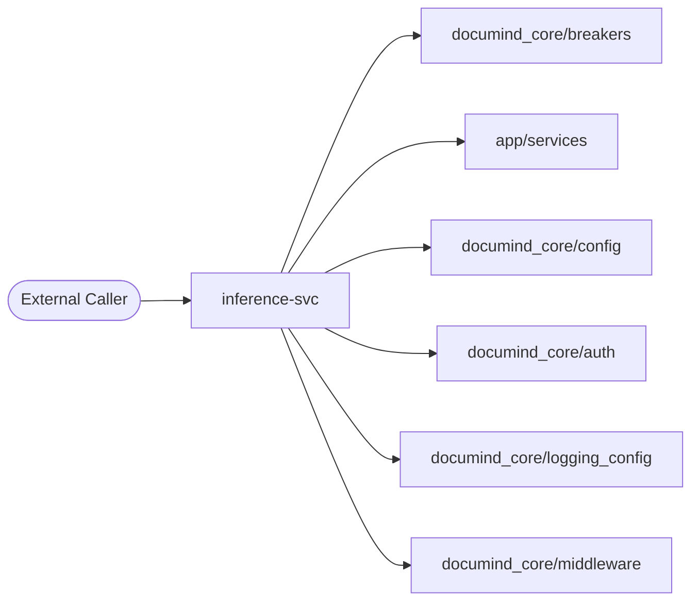

### Level 2 — Container

_What external dependencies does this folder talk to?_

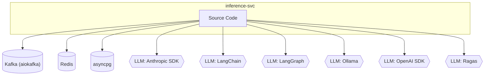

### Level 3 — Component

_Internal files grouped by inferred role._

```mermaid
flowchart TB
    subgraph __agent___tool["🤖 agent / tool"]
        app_agents___init___py["app/agents/__init__.py"]
        app_agents_multi_hop_agent_py["app/agents/multi_hop_agent.py"]
        app_agents_multi_hop_fanout_py["app/agents/multi_hop_fanout.py"]
        app_services_agent_py["app/services/agent.py"]
    end
    subgraph __config___settings["⚙ config / settings"]
        app_core_config_py["app/core/config.py"]
    end
    subgraph __entry_point___app_bootstrap["🚀 entry point / app bootstrap"]
        app_main_py["app/main.py"]
    end
    subgraph __HTTP_router___API_endpoints["🌐 HTTP router / API endpoints"]
        app_routers___init___py["app/routers/__init__.py"]
    end
    subgraph __data_model___schema["📋 data model / schema"]
        app_schemas___init___py["app/schemas/__init__.py"]
    end
    subgraph __business_service___use_case["🧠 business service / use-case"]
        app_services___init___py["app/services/__init__.py"]
        app_services_guardrails_py["app/services/guardrails.py"]
        app_services_prompt_builder_py["app/services/prompt_builder.py"]
        app_services_rag_inference_py["app/services/rag_inference.py"]
    end
    subgraph __external_service_adapter["🔌 external service adapter"]
        app_services_ollama_client_py["app/services/ollama_client.py"]
        app_services_retrieval_client_py["app/services/retrieval_client.py"]
    end
    subgraph __repository___data_access["💾 repository / data access"]
        app_services_prompt_repo_py["app/services/prompt_repo.py"]
    end
    subgraph __background_worker["⏰ background worker"]
        app_workers___init___py["app/workers/__init__.py"]
        app_workers_breaker_metrics_py["app/workers/breaker_metrics.py"]
        app_workers_draft_replay_py["app/workers/draft_replay.py"]
    end
    subgraph __test["🧪 test"]
        tests_conftest_py["tests/conftest.py"]
        tests_test_integration_inference_py["tests/test_integration_inference.py"]
    end
```

### Level 4 — Code (top hotspots)

_Longest functions — these are the most likely refactor candidates._

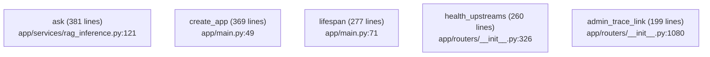


## 📐 Class Diagram (UML-style)

Top classes by method count, with inheritance arrows. Common framework bases (`BaseModel`, `BaseSettings`, `Exception`, `Enum`) use dotted lines.

```mermaid
classDiagram
    class DbBackedPromptBuilder {
        +9 methods
        ~app/services/prompt_repo.py:46
    }
    class DraftReplayWorker {
        +9 methods
        ~app/workers/draft_replay.py:176
    }
    class BreakerMetricsExporter {
        +6 methods
        ~app/workers/breaker_metrics.py:41
    }
    class OllamaClient {
        +5 methods
        ~app/services/ollama_client.py:71
    }
    class MultiHopRagAgent {
        +4 methods
        ~app/agents/multi_hop_agent.py:49
    }
    class AgentService {
        +4 methods
        ~app/services/agent.py:109
    }
    class RetrievalClient {
        +3 methods
        ~app/services/retrieval_client.py:12
    }
    class GuardrailChecker {
        +3 methods
        ~app/services/guardrails.py:70
    }
    class _NoopSpan {
        +3 methods
        ~app/services/guardrails.py:196
    }
    class RagInferenceService {
        +3 methods
        ~app/services/rag_inference.py:52
    }
    class PromptBuilder {
        +3 methods
        ~app/services/prompt_builder.py:54
    }
    class _SpanWrap {
        +2 methods
        ~app/workers/draft_replay.py:89
    }
    class _RetrieverProto {
        +1 methods
        ~app/agents/multi_hop_fanout.py:49
    }
    Protocol <|.. _RetrieverProto
    class _LoopCBProto {
        +1 methods
        ~app/agents/multi_hop_fanout.py:68
    }
    Protocol <|.. _LoopCBProto
    class PromptRepo {
        +1 methods
        ~app/services/prompt_repo.py:29
    }
    Repository <|-- PromptRepo
```


_Showing top 15 of 54 classes (ranked by method count)._


## 4. Code Sequence — How Files Link to Each Other

**Import graph for files in this folder.** Reading order: start at any entry-point file (look for `🚀 entry point` role in the inventory above), then follow the arrows.

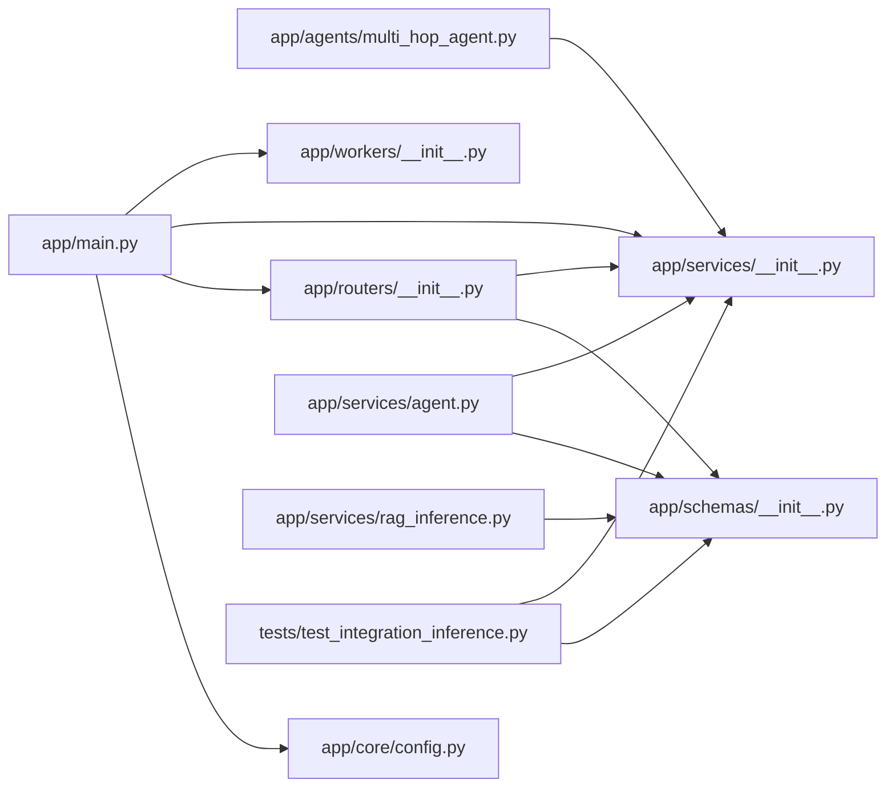

### Edge list

| From file | To file | Import-count |
|---|---|---|
| `tests/test_integration_inference.py` | `app/services/__init__.py` | 9 |
| `app/routers/__init__.py` | `app/services/__init__.py` | 3 |
| `tests/test_integration_inference.py` | `app/schemas/__init__.py` | 3 |
| `app/main.py` | `app/services/__init__.py` | 2 |
| `app/main.py` | `app/workers/__init__.py` | 2 |
| `app/agents/multi_hop_agent.py` | `app/services/__init__.py` | 1 |
| `app/main.py` | `app/core/config.py` | 1 |
| `app/main.py` | `app/routers/__init__.py` | 1 |
| `app/routers/__init__.py` | `app/schemas/__init__.py` | 1 |
| `app/services/agent.py` | `app/schemas/__init__.py` | 1 |
| `app/services/agent.py` | `app/services/__init__.py` | 1 |
| `app/services/rag_inference.py` | `app/schemas/__init__.py` | 1 |


## 5. Request Flowchart

Generic request lifecycle for this folder. Branches that don't apply are auto-removed based on detected dependencies (DB / cache / LLM).


## 6. API Endpoints — Input / Process / Output

**Detected endpoints:** 3

| Method | Route | Defined in | Input (schema) | Process (summary) | Output (schema) |
|---|---|---|---|---|---|
| `GET` | `/health` | `app/routers/__init__.py:52` | _TBD_ | _TBD_ | _TBD_ |
| `POST` | `/api/v1/ask` | `app/routers/__init__.py:1288` | _TBD_ | _TBD_ | _TBD_ |
| `POST` | `/api/v1/agent/ask` | `app/routers/__init__.py:1355` | _TBD_ | _TBD_ | _TBD_ |

_Reviewer fills the last three columns from the Pydantic models in the handler. Auto-extraction of Pydantic schemas is on the roadmap._


## 🏗 Input/Process/Output + Integration + Design Principles

### Input / Process / Output per endpoint

| Endpoint | INPUT (validation chain) | PROCESS (call chain) | OUTPUT (response chain) |
|---|---|---|---|
| `GET /health` | Pydantic schema validated at middleware | Router `app/routers/__init__.py:52` → Service (`app/services/`) → Repository (`app/repositories/` or `documind_core/db_client.py`) → External (LLM / Vector / Kafka) | Pydantic response model serialized to JSON + headers (`X-Correlation-ID`, `X-Latency-ms`) |
| `POST /api/v1/ask` | Pydantic schema validated at middleware | Router `app/routers/__init__.py:1288` → Service (`app/services/`) → Repository (`app/repositories/` or `documind_core/db_client.py`) → External (LLM / Vector / Kafka) | Pydantic response model serialized to JSON + headers (`X-Correlation-ID`, `X-Latency-ms`) |
| `POST /api/v1/agent/ask` | Pydantic schema validated at middleware | Router `app/routers/__init__.py:1355` → Service (`app/services/`) → Repository (`app/repositories/` or `documind_core/db_client.py`) → External (LLM / Vector / Kafka) | Pydantic response model serialized to JSON + headers (`X-Correlation-ID`, `X-Latency-ms`) |

### Integration sequence (ordered by import volume)

Other folders this one calls into, ordered by how heavily it depends on each:

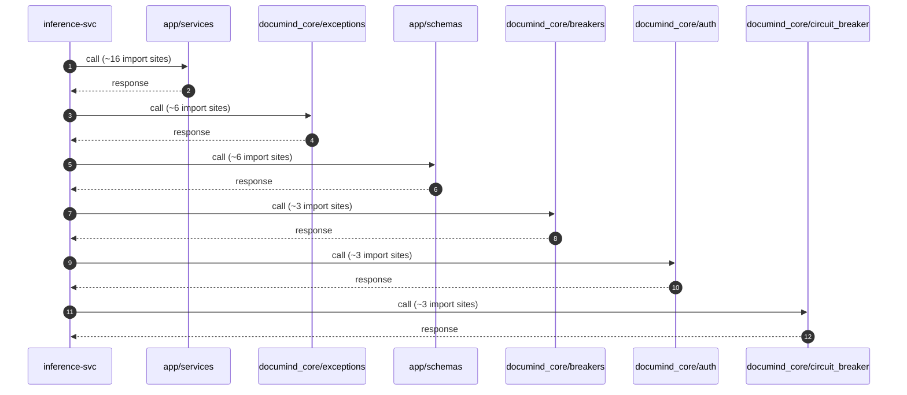

### SOLID principles applied here

| Principle | Where it shows up in this folder |
|---|---|
| **S — Single Responsibility** | Each file has ONE role — routers route, services orchestrate, repos query, schemas describe. The §2 File Inventory shows the role per file; any file with multiple roles violates SRP. |
| **O — Open/Closed** | New endpoints add new router functions; new business cases add new service methods. Existing methods stay closed for modification. |
| **L — Liskov Substitution** | All adapter clients (Ollama / OpenAI / Anthropic) implement the same LLM-client protocol — they're interchangeable behind the circuit breaker. |
| **I — Interface Segregation** | Pydantic models split request, response, and internal state into separate schemas — no client gets a fat model with fields it doesn't use. |
| **D — Dependency Inversion** | Services receive their dependencies via FastAPI `Depends()` — they depend on abstractions (factories), not concrete repos. Swap implementations in tests via the `app.dependency_overrides` dict. |

### Microservice principles applied here

| Principle | Application |
|---|---|
| **Single business capability** | `inference-svc` owns ONE capability (see §1 Purpose). Cross-capability logic lives in other services. |
| **Bounded context** | Schemas + repositories are scoped to this service's bounded context — no shared DB tables with other services. |
| **DB per service** | Each service owns its tables. Cross-service reads go through HTTP or Kafka — never a direct DB join. |
| **Independent deploy** | Service is independently deployable — its container is built + released without coupling to other services. |
| **Resilience patterns** | Circuit breakers (`documind_core/breakers/`), retries with exponential backoff, bulkheads, timeouts on every external call. |
| **Observability** | Every request has a `request_id` propagated via OTel baggage; every external call emits a trace span. |

### Design-principle stack (how the principles compose)

Reading bottom-to-top — earlier principles enable later ones:

```text
┌─────────────────────────────────────────────────────────────┐
│ 7. AI Governance (§38 + §48): decision audit + explainability│
├─────────────────────────────────────────────────────────────┤
│ 6. Production Gates (§47.11): 10 gates BEFORE deploy        │
├─────────────────────────────────────────────────────────────┤
│ 5. Resilience: CB + retry + bulkhead + timeout              │
├─────────────────────────────────────────────────────────────┤
│ 4. Microservice: single capability, bounded context, DB/svc │
├─────────────────────────────────────────────────────────────┤
│ 3. SOLID: SRP + OCP + LSP + ISP + DIP                       │
├─────────────────────────────────────────────────────────────┤
│ 2. 12-factor: stateless, deps in venv, config in env        │
├─────────────────────────────────────────────────────────────┤
│ 1. KISS / YAGNI / DRY: every line earns its place           │
└─────────────────────────────────────────────────────────────┘
```

**How to use this stack:** when adding a new feature, check it from the bottom up. KISS first (simplest design that works), then SOLID (does any class violate SRP?), then microservice (does this leak the bounded context?), then resilience (what fails when the downstream is slow?), then gates (which production gate enforces this?), then governance (which audit row records this decision?).


## 🔬 Execution Sequence + Debug Tap Points

For each phase a request goes through, this section shows: **(1)** the file:line where it happens, **(2)** the log line you'll see, **(3)** the command to inspect that phase's output in real time. Use this as your debug-flow chart — start at Phase 0, move down until output stops matching the expected log line; that's where the failure is.

**Worked example:** `GET /health` (app/routers/__init__.py:52)

### Phase-by-phase debug tap table

| # | Phase | Code location | Log line to grep | Command to inspect |
|---|---|---|---|---|
| 0 | **TCP connect** | OS / docker network | `client_connected` | `curl -v http://localhost:8084/health 2>&1 \| head -15` |
| 1 | **Middleware: request_id assign** | `documind_core/middleware.py` | `request_id=...` | `docker logs documind-inference-svc -f \| grep request_id` |
| 2 | **Middleware: auth** | `documind_core/auth.py` | `auth_ok` or `auth_denied` | `docker logs documind-inference-svc -f \| grep auth_` |
| 3 | **Middleware: tenant resolution** | `documind_core/middleware.py` | `tenant_id=<id>` | `docker logs documind-inference-svc -f \| grep tenant_id` |
| 4 | **Pydantic validation** | `app/schemas/*.py` | `422 Unprocessable` (on fail) | `docker logs documind-inference-svc -f \| grep -E 'validation\|422'` |
| 5 | **Router dispatch** | `app/routers/__init__.py:52` | `GET /health` | `docker logs documind-inference-svc -f \| grep '/health'` |
| 6 | **Business service call** | `app/services/*.py` | `service_method_start` | `docker logs documind-inference-svc -f \| grep service_` |
| 7 | **DB query** | `app/repositories/*.py` or `documind_core/db_client.py` | `asyncpg.execute` or `SELECT...` | `docker logs documind-postgres -f \| grep -E 'duration:'` |
| 8 | **External call (LLM / vector)** | `app/services/*_client.py` | `llm_call_start` / `vector_search_start` | `docker logs documind-inference-svc -f \| grep -E 'llm_\|vector_'` |
| 9 | **Decision audit log** | `documind_core/ai_governance.py` | `decision_audit:` | `psql -p 55432 -U documind -c "SELECT * FROM decision_audit ORDER BY ts DESC LIMIT 1;"` |
| 10 | **Response shaping** | `app/schemas/*.py` (response model) | `response_ms=` | `docker logs documind-inference-svc -f \| grep response_ms` |
| 11 | **Trace span flush** | OTel exporter | _(async)_ | Open Jaeger UI: `http://localhost:16686/search?service=inference-svc` |

### Reproducible end-to-end trace

Use this script to fire ONE request and see every phase's output in a single terminal:

```bash
REQ_ID=$(uuidgen)
echo "=== Issuing GET /health with request_id=$REQ_ID ==="

# Phase 0-2: tail logs in background
docker logs documind-inference-svc --tail=0 -f 2>&1 | grep --line-buffered "$REQ_ID" &
TAIL_PID=$!
sleep 0.5

# Phase 3-10: fire the request
curl -X GET http://localhost:8084/health \
  -H "X-Correlation-ID: $REQ_ID" \
  -H "Authorization: Bearer <token>" \
  -H "Content-Type: application/json" \
  -d '{}' -w "\nTOTAL=%{time_total}s\n"

sleep 2  # let logs flush
kill $TAIL_PID

# Phase 9: pull the decision audit row
psql -h localhost -p 55432 -U documind -d documind \
  -c "SELECT request_id, model_version, prompt_version, decision, confidence FROM decision_audit WHERE request_id='$REQ_ID';"

# Phase 11: pull the trace span tree
open "http://localhost:16686/search?service=inference-svc&tags=%7B%22request_id%22%3A%22$REQ_ID%22%7D"
```

### Debug-order checklist (when something breaks)

Walk the phases IN ORDER — first phase with missing/wrong output is the failure point. Don't skip ahead:

1. **Phase 0 fail?** Service not running → `bash scripts/circuitrag-status.sh`
2. **Phase 1-3 fail?** Middleware misconfigured → check env vars + middleware order in `main.py`
3. **Phase 4 fail (422)?** Request body doesn't match schema → check Pydantic model in `app/schemas/`
4. **Phase 5 fail (404)?** Route not registered → check router import in `main.py`
5. **Phase 6 fail (500)?** Business logic exception → tail logs for stack trace
6. **Phase 7 fail?** DB unreachable → `psql -p 55432 -U documind -c "SELECT 1;"`
7. **Phase 8 fail?** External dep down → check `/health/upstreams` + circuit breaker state
8. **Phase 9 missing?** Decision audit not persisted → check Kafka consumer lag
9. **Phase 10 slow?** Response shaping bottleneck → profile the response model
10. **Phase 11 empty Jaeger?** OTel exporter misconfigured → check `OTEL_EXPORTER_OTLP_ENDPOINT`


## 🧠 Business Logic — How It's Written + Logical Step Sequence

### Where business logic lives

Business logic is **separated from HTTP** — routers receive validated requests and immediately delegate to a service class. Services hold the state machines, calling repositories for I/O and external clients for LLM / vector / Kafka.

**Primary business-logic file in this folder:** `app/services/rag_inference.py` (502 LOC, 1 classes, 0 functions)

**Hottest function:** `ask` at `app/services/rag_inference.py:121` (381 lines)

### The canonical logical step sequence

Every business-service method in this folder follows this 11-step skeleton (some steps are skipped if not applicable):

```python
async def some_service_method(self, request: RequestSchema) -> ResponseSchema:
    # ── Step 1: Pre-conditions / argument check ─────────────────
    if not request.is_valid():
        raise BadRequest('reason')

    # ── Step 2: Idempotency check (X-Idempotency-Key) ──────────
    cached = await self.cache.get(request.idempotency_key)
    if cached:
        return cached  # short-circuit duplicate request

    # ── Step 3: Authorization (RBAC / tenant scope) ────────────
    self.authz.require(request.actor, 'resource:action')

    # ── Step 4: Load context (DB / cache / config) ─────────────
    context = await self.repo.load_context(request.tenant_id)

    # ── Step 5: Apply business rules ───────────────────────────
    decision = self.rules.evaluate(request, context)

    # ── Step 6: External calls (LLM / vector / 3rd-party) ──────
    async with self.breaker:  # circuit breaker wrap
        llm_response = await self.llm.call(...)

    # ── Step 7: Post-processing / output validation ────────────
    self.guardrails.check(llm_response)

    # ── Step 8: Persist state (DB write + Kafka emit) ──────────
    async with self.repo.transaction():
        await self.repo.save(record)
        await self.kafka.publish('topic', event)

    # ── Step 9: Decision audit row (§38 + §48) ─────────────────
    await self.audit.log_decision({
        'request_id': request.id,
        'model_version': self.model.version,
        'prompt_version': self.prompt.version,
        'decision': decision,
        'confidence': llm_response.confidence,
    })

    # ── Step 10: Cache the response (if idempotent) ────────────
    await self.cache.set(request.idempotency_key, response, ttl=3600)

    # ── Step 11: Return + emit metric ──────────────────────────
    self.metrics.observe('request_latency', elapsed_ms)
    return ResponseSchema(...)
```

### How to map a real method to this skeleton

1. Open `app/services/rag_inference.py` in your editor
2. Find the longest function (likely `ask`)
3. Walk it line by line; tag each block with the corresponding step number from the skeleton above
4. Steps that are missing are opportunities (e.g. missing idempotency check, missing audit row) — file as P1/P2 in the brutal-tool-review for this folder

### Inspecting each step at runtime

| Step | What to inspect | How |
|---|---|---|
| 1 | Pre-condition rejects | grep `BadRequest` in logs |
| 2 | Idempotency cache hits | grep `cache_hit=true` in logs |
| 3 | Authz denials | grep `authz_denied` in logs |
| 4 | Context load latency | `pg_stat_statements` slow-query log |
| 5 | Rule evaluation | trace span `business.rules.evaluate` |
| 6 | External call latency | trace span `llm.call` / `vector.search` |
| 7 | Guardrail rejections | grep `guardrail_triggered` in logs |
| 8 | Transaction commits | grep `tx_commit` in logs |
| 9 | Decision audit rows | `SELECT * FROM decision_audit ORDER BY ts DESC LIMIT 5;` |
| 10 | Cache writes | `redis-cli -p 56379 MONITOR` |
| 11 | Latency histogram | Grafana panel: `histogram_quantile(0.95, ...)` |


## 7. Sequence Diagrams per Endpoint

### Generic flow (all endpoints)

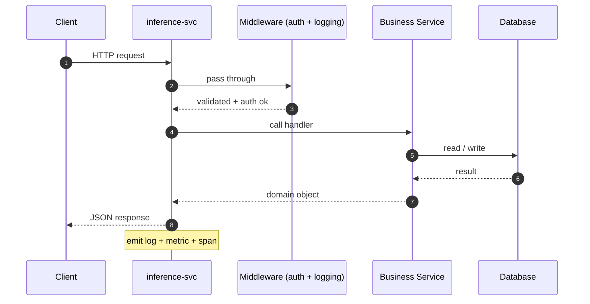

### Per-endpoint sequence stubs (top 5)

### `GET /health` (app/routers/__init__.py:52)

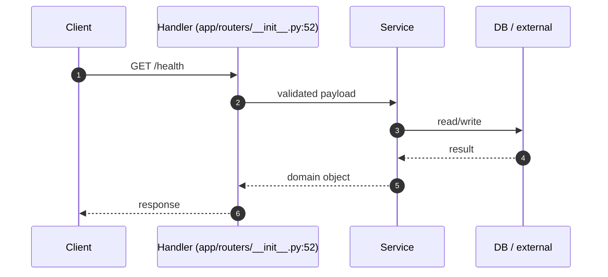

### `POST /api/v1/ask` (app/routers/__init__.py:1288)

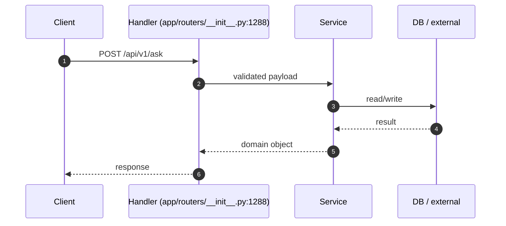

### `POST /api/v1/agent/ask` (app/routers/__init__.py:1355)

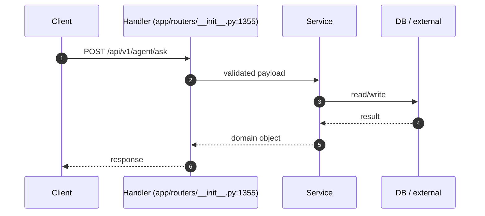


## 🔬 Annotated Example Request

Walk through what happens when a client calls **`GET /health`** (app/routers/__init__.py:52).

```text
┌─────────────────────────────────────────────────────────────────────┐
│ 1. Client sends HTTP request                                        │
│    GET /health                                                     │
│    Headers: Authorization, X-Correlation-ID, X-Tenant-ID            │
└────────────────────────┬────────────────────────────────────────────┘
                         │
                         ▼
┌─────────────────────────────────────────────────────────────────────┐
│ 2. Middleware stack (auth → logging → tracing → rate-limit)         │
│    - Validate JWT / API key                                         │
│    - Resolve tenant_id from token                                   │
│    - Start span; inject request_id into baggage                     │
└────────────────────────┬────────────────────────────────────────────┘
                         │
                         ▼
┌─────────────────────────────────────────────────────────────────────┐
│ 3. Pydantic validation                                              │
│    - Parse request body against schema                              │
│    - 422 on validation error (with field-level details)             │
└────────────────────────┬────────────────────────────────────────────┘
                         │
                         ▼
┌─────────────────────────────────────────────────────────────────────┐
│ 4. Router handler                                                   │
│    app/routers/__init__.py:52
│    - Receive validated request + injected Depends()                 │
│    - Delegate to business service                                   │
└────────────────────────┬────────────────────────────────────────────┘
                         │
                         ▼
┌─────────────────────────────────────────────────────────────────────┐
│ 5. Business service                                                 │
│    - Apply rules / orchestrate multi-step logic                     │
│    - Call repositories for DB I/O                                   │
│    - Call external services (LLM / vector DB / etc.)             │
│    - Emit metrics + log decision audit row                          │
└────────────────────────┬────────────────────────────────────────────┘
                         │
                         ▼
┌─────────────────────────────────────────────────────────────────────┐
│ 6. Response shaping                                                 │
│    - Build response Pydantic model                                  │
│    - Serialize to JSON                                              │
│    - Add correlation_id, latency_ms to headers                      │
└────────────────────────┬────────────────────────────────────────────┘
                         │
                         ▼
                       Client
```

### Inspecting this in real time

```bash
# 1. Tail the service log
docker logs documind-inference-svc --tail=20 -f &

# 2. Issue the request with a fresh correlation_id
REQ_ID=$(uuidgen)
curl -X GET http://localhost:<PORT>/health \
  -H "X-Correlation-ID: $REQ_ID" \
  -H "Authorization: Bearer <token>" \
  -d '{}'

# 3. Find the trace in Jaeger
open http://localhost:16686/search?service=inference-svc&tags=%7B%22request_id%22%3A%22$REQ_ID%22%7D
```


## 8. Database Layer

**DB / storage libraries:** Kafka (aiokafka), Redis, asyncpg

**Total DB call sites:** 14

| Pattern | Count |
|---|---|
| `fetch/fetchall/fetchrow` | 6 |
| `ORM CRUD` | 8 |

### Query Optimization checklist

| Check | Status (✓/✗/⚠) | Notes |
|---|---|---|
| Indexes on every WHERE / ORDER BY column | — | EXPLAIN ANALYZE hot paths |
| Full table scans avoided | — | — |
| Batch operations used (not N writes in a loop) | — | — |
| Parameterized queries (NEVER f-string SQL) | — | — |

### Transactions (ACID)

| Check | Status (✓/✗/⚠) | Notes |
|---|---|---|
| Transaction boundaries narrow (no HTTP / LLM inside) | — | — |
| Rollback on exception | — | — |
| Isolation level documented (READ COMMITTED / SERIALIZABLE) | — | — |
| Deadlock prevention strategy | — | — |

### N+1 Query Findings (reviewer to fill)

| Endpoint / Function | Suspect Loop | Est. Queries / Request | Fix |
|---|---|---|---|
| — | — | — | — |


## 9. Code Quality + Complexity

### Readability

| Check | Status (✓/✗/⚠) | Notes |
|---|---|---|
| Clear variable / function / class names | — | — |
| No misleading naming (no `tmp` / `xyz` / `foo`) | — | — |
| Small focused functions (≤ 50 lines) | — | 5 > 50 lines (see Section 0) |
| Avoid deeply nested conditions (≤ 4 levels) | — | — |

### Clean code

| Check | Status (✓/✗/⚠) | Notes |
|---|---|---|
| No dead / commented-out code | — | — |
| No `print()` — use logger | — | — |
| No hardcoded values | — | smell count: 2 |
| Constants extracted to a settings module | — | — |

### Complexity

| Check | Status (✓/✗/⚠) | Notes |
|---|---|---|
| Long methods broken down | — | — |
| No overengineering (premature abstractions) | — | — |
| Cyclomatic complexity ≤ 15 per function | — | run `ruff complexity` or `radon` |


## 10. Security Review

### Authentication & Authorization

| Check | Status (✓/✗/⚠) | Notes |
|---|---|---|
| Authentication implemented correctly | — | Bearer / JWT / session |
| Authorization (RBAC / ABAC) checks | — | no client-side trust |
| Tokens validated server-side every request | — | rotate, expire, revoke |

### OWASP Top 10

| Check | Status (✓/✗/⚠) | Notes |
|---|---|---|
| Request validation present | — | sanitization: Pydantic BaseModel |
| SQL injection prevention | — | DB libs: Kafka (aiokafka), Redis, asyncpg — parameterized queries only |
| XSS / CSRF prevention | — | output encoding / CSP / SameSite |
| Path traversal prevention | — | no user input concatenated to file paths |
| Prompt injection prevention | — | Rebuff / output filter |

### Secret Management

| Check | Status (✓/✗/⚠) | Notes |
|---|---|---|
| No secrets in code | — | smell count: 0 password literals, 0 api key literals |
| Env vars / Vault used | — | Pydantic BaseSettings or env reader |
| Secret rotation strategy | — | documented in runbook |

### Sensitive Data

| Check | Status (✓/✗/⚠) | Notes |
|---|---|---|
| PII masked in logs | — | structured logger with field redaction |
| Encryption in transit (TLS) | — | — |
| Encryption at rest (DB / object store) | — | — |
| GDPR — retention + right-to-be-forgotten | — | — |


## 11. Performance Review

### Memory

| Check | Status (✓/✗/⚠) | Notes |
|---|---|---|
| Large object retention avoided | — | — |
| Streaming for large files / data | — | — |
| Caches bounded (LRU / TTL) | — | caching: redis |

### Concurrency

| Check | Status (✓/✗/⚠) | Notes |
|---|---|---|
| Thread safety validated | — | primitives: Lock / RLock, asyncio (async/await) |
| Race conditions prevented | — | — |
| Deadlocks avoided (lock ordering) | — | — |
| Parallel processing where beneficial | — | 56 async fns |

### Latency

| Check | Status (✓/✗/⚠) | Notes |
|---|---|---|
| External API calls batched / cached | — | — |
| Timeouts on every external call | — | — |
| No blocking I/O inside async functions | — | — |


## 12. Reliability & Observability

### Failure Handling

| Check | Status (✓/✗/⚠) | Notes |
|---|---|---|
| Retry (bounded + exp backoff + jitter) | — | — |
| Circuit breaker around external deps | — | — |
| Graceful degradation | — | — |

### Timeout Handling

| Check | Status (✓/✗/⚠) | Notes |
|---|---|---|
| Timeout on every external call (HTTP / DB / subprocess) | — | — |
| No infinite waits | — | — |

### Observability

| Check | Status (✓/✗/⚠) | Notes |
|---|---|---|
| Structured (JSON) logging | — | correlation_id + tenant_id + request_id |
| Metrics (RED: rate / errors / duration) | — | — |
| Tracing (OpenTelemetry → Jaeger / Tempo) | — | — |
| Baggage propagation across services | — | — |


## 13. Test Cases

**Test files detected:** 1
**Test functions parsed:** 3

| Test name | Location | Purpose (from docstring) |
|---|---|---|
| `test_rag_inference_happy_path` | `tests/test_integration_inference.py:25` | _(no docstring)_ |
| `test_rag_inference_rejects_prompt_injection` | `tests/test_integration_inference.py:85` | _(no docstring)_ |
| `test_rag_inference_empty_retrieval_raises` | `tests/test_integration_inference.py:118` | _(no docstring)_ |

### Coverage matrix (reviewer to fill)

| Metric | Value | Min |
|---|---|---|
| Statement coverage | _TBD_ % | 80% |
| Branch coverage | _TBD_ % | 70% |
| Critical-path coverage | _TBD_ % | 100% |
| Negative-test coverage | _TBD_ % | 80% |


## 14. Logging & Monitoring

### Logging

| Check | Status (✓/✗/⚠) | Notes |
|---|---|---|
| Structured (JSON) logs | — | — |
| Correlation ID present | — | — |
| No PII / secrets in log lines | — | — |
| No excessive logging (no logs in hot loops) | — | — |

### Monitoring

| Check | Status (✓/✗/⚠) | Notes |
|---|---|---|
| Alerts defined (SLO-burn aware) | — | — |
| Dashboards exist (Grafana) | — | — |
| On-call playbook references | — | — |


## 15. LLM / GenAI / RAG

**Detected AI deps:** Anthropic SDK, LangChain, LangGraph, Ollama, OpenAI SDK, Ragas

### Prompt Safety

| Check | Status (✓/✗/⚠) | Notes |
|---|---|---|
| Prompt injection handling (input filter) | — | — |
| Output sanitization | — | — |
| Prompt versioning in registry | — | — |
| Toxicity / bias filtering | — | — |

### RAG Quality

| Check | Status (✓/✗/⚠) | Notes |
|---|---|---|
| Chunking strategy validated (size + overlap) | — | — |
| Embedding model versioned (re-embed on bump) | — | — |
| Vector DB query optimized (recall@k measured) | — | — |
| Metadata filtering exists (per-tenant) | — | — |

### Cost

| Check | Status (✓/✗/⚠) | Notes |
|---|---|---|
| Model fallback strategy defined | — | — |
| Token usage minimized (cache / truncation) | — | — |
| Per-tenant cost ceiling enforced | — | — |

### Explainability / Responsible AI

| Check | Status (✓/✗/⚠) | Notes |
|---|---|---|
| Citation / source grounding (every claim cited) | — | — |
| Confidence scoring (Ragas / DeepEval) | — | Ragas |
| Decision audit row per prediction (§48) | — | — |
| Fairness / bias checks | — | — |


## 16. SOLID + Microservice Principles

### SOLID

| Check | Status (✓/✗/⚠) | Notes |
|---|---|---|
| S — Single Responsibility (one reason to change per class) | — | — |
| O — Open/Closed (extend via composition, not modification) | — | — |
| L — Liskov Substitution (subclasses honor contracts) | — | — |
| I — Interface Segregation (no fat interfaces) | — | — |
| D — Dependency Inversion (depend on abstractions) | — | — |

### Microservice

| Check | Status (✓/✗/⚠) | Notes |
|---|---|---|
| Single business capability | — | — |
| Bounded context (no domain bleed) | — | — |
| Independent deploy (no coupled releases) | — | — |
| Resilience patterns (CB / retry / bulkhead) | — | — |


## 17. Integration with Other Folders

### Internal — other folders in this repo

| Folder / Module | Import-count | Purpose |
|---|---|---|
| `app/services` | 16 | _reviewer-described_ |
| `documind_core/exceptions` | 6 | _reviewer-described_ |
| `app/schemas` | 6 | _reviewer-described_ |
| `documind_core/breakers` | 3 | _reviewer-described_ |
| `documind_core/auth` | 3 | _reviewer-described_ |
| `documind_core/circuit_breaker` | 3 | _reviewer-described_ |
| `documind_core/config` | 2 | _reviewer-described_ |
| `documind_core/db_client` | 2 | _reviewer-described_ |
| `mcp` | 2 | _reviewer-described_ |
| `app/workers` | 2 | _reviewer-described_ |
| `documind_core/rebuff_detector` | 2 | _reviewer-described_ |
| `documind_core/logging_config` | 1 | _reviewer-described_ |
| `documind_core/middleware` | 1 | _reviewer-described_ |
| `documind_core/observability` | 1 | _reviewer-described_ |
| `documind_core/rate_limiter` | 1 | _reviewer-described_ |
| `app/core` | 1 | _reviewer-described_ |
| `app/routers` | 1 | _reviewer-described_ |
| `documind_core/audit` | 1 | _reviewer-described_ |
| `documind_core/kafka_client` | 1 | _reviewer-described_ |
| `documind_core/schemas` | 1 | _reviewer-described_ |
| `mcp/client` | 1 | _reviewer-described_ |
| `documind_core/ai_governance` | 1 | _reviewer-described_ |

### External — third-party packages

| Package | Import-count |
|---|---|
| `fastapi` | 4 |
| `httpx` | 4 |
| `prometheus_client` | 4 |
| `prompt_builder` | 4 |
| `best_config_loader` | 3 |
| `guardrails` | 2 |
| `ollama_client` | 2 |
| `retrieval_client` | 2 |
| `opentelemetry` | 2 |
| `langfuse_tracer` | 2 |
| `pytest` | 2 |
| `multi_hop_agent` | 1 |
| `multi_hop_fanout` | 1 |
| `redis` | 1 |
| `importlib` | 1 |
| `best_config_history` | 1 |
| `urllib` | 1 |
| `pydantic` | 1 |
| `prompt_repo` | 1 |
| `rag_inference` | 1 |


## 📖 Domain Glossary

Project-wide vocabulary a new developer needs. If you see a term in code you don't recognize, check here first.

| Term | Definition |
|---|---|
| **RAG** | Retrieval-Augmented Generation — the pattern of grounding LLM output in retrieved documents to reduce hallucination. |
| **Chunk** | A token-bounded slice of a source document (typically 256–1024 tokens with 10–20% overlap). Embedded + stored in the vector DB. |
| **Embedding** | Vector representation of text. Re-embed everything when the embedding model version bumps. |
| **Vector DB** | Qdrant in this project. Stores chunk embeddings + metadata, returns top-k by cosine similarity. |
| **Rerank** | Second-stage retrieval — re-scores the top-k from the vector DB with a more expensive cross-encoder for better relevance. |
| **Hybrid retrieval** | Vector + keyword (Elasticsearch / BM25) merged via reciprocal-rank-fusion. |
| **MCP** | Model Context Protocol — tool-server contract used by agents to call namespace-scoped operations (drill / ingest / etc.). |
| **Tenant** | A logical customer boundary. Every row + every cache key + every prompt context is tenant-scoped. |
| **Drill** | A runnable script that exercises real services + asserts ≥3 negative invariants (per §43). Lives under `mcp/tests/drill_*.py`. |
| **Breaker** | Circuit breaker — opens after N failures to a downstream dep, lets traffic shed instead of cascading. See `documind_core/breakers/`. |
| **Baggage** | OpenTelemetry context (request_id / tenant_id / actor) propagated across spans + service hops. |
| **Decision audit row** | Per-AI-call record persisted to Postgres with request_id, prompt_version, model_version, output, confidence, fairness_flag — per §38 + §48. |
| **Fanout** | Parallel sub-query split for multi-hop RAG (`services/inference-svc/app/agents/multi_hop_fanout.py`). |
| **Council** | 3-model author + reviewer + advisor pattern for code-fix proposals (per §50). |
| **Side-channel port** | Separate Prometheus `/metrics` port (9465–9470) per service to avoid app-port middleware interference. |
| **Trust scorecard** | 5-layer aggregate (governance + tool review + maturity stack + drill catalog + production gates) used for go/no-go. |
| **HBR** | High-Blast-Radius — file patterns that force the pre-commit hook to refresh the drill catalog. |
| **HITL** | Human-In-The-Loop — escalation path when confidence falls in the 0.5–0.8 range (per §40). |
| **Forensic substrate** | The §51-required metadata block (Date/Location/Approach/Policies/Verification) in every commit body. |


## 18. Debugging Guide

### Step-by-step when something breaks

```
1. Tail logs:        tail -50 /tmp/inference-svc.log   (if host-side)
                     docker logs documind-inference-svc --tail=50   (if container)
2. Health probe:     curl http://localhost:<PORT>/health
3. Fleet probe:      python3 scripts/advanced_healthcheck.py --layer app
4. Trace:            Open Jaeger → search request_id → see span tree
5. Metrics:          Open Grafana → service dashboard → look for spike
6. Drill:            ls mcp/tests/drill_*inference-svc*.py and run
```

### Common failure modes

| Symptom | Likely cause | Fix |
|---|---|---|
| 502 / connection refused | service down | check `circuitrag-status.sh` |
| Slow p95 latency | DB N+1 or LLM throttle | Section 8 + Section 15 |
| 5xx spike | downstream dep down | check `/health/upstreams` |
| Memory growth | unbounded cache or closure leak | Section 11 |
| Wrong-tenant data | RLS bypass | tenant isolation drill |


## 📅 Recent Activity & Open TODOs

### Last 8 commits touching this folder

| Hash | Date | Subject |
|---|---|---|
| `c6e58b8` | 2026-05-16 | docs(readme): advanced auto-generated READMEs (project + per-folder) |
| `bad7b2d` | 2026-05-07 | feat(rebuff): runtime PI defense — Stage-1 adapter + Stage-2 inference wire (16/16 drill green) |
| `ec1f7b4` | 2026-05-07 | fix(iter-88): bulk lint cleanup across services/ libs/ mcp/ scripts/ (1139 ruff fixes; drill suite still green) |
| `0c22973` | 2026-05-07 | fix(iter-87): §55 Tier-3 rule-aware routing + 32 real lint fixes (E402 in main.py + routers/__init__.py; F841 in eval_ha |
| `886d367` | 2026-05-07 | fix(iter-71): 11 SDLC MCP servers — Slack/GHActions/Sonar/Sentry/PD/kubectl/Confluence/DD/AWS/GCP/Azure |
| `2dab9a0` | 2026-05-07 | fix(iter-68): mcp/server_github.py + AI SDLC roadmap doc — close most-critical SDLC gap |
| `05d00c5` | 2026-05-07 | fix(iter-65): implement csv ingest MCP write surface |
| `74fc960` | 2026-05-07 | fix(iter-66): csv_ingest server hardened (CsvIngestState + identifier safety + tenant validation) + inference-svc wiring |

```bash
git log --oneline -- services/inference-svc    # see all commits
git blame <file>                       # who wrote what
```

### Open TODO / FIXME / HACK markers

_No TODO / FIXME markers found — folder is hygienic._


## 19. Production Gates (hard pass/fail)

| Gate | Target | Status | Evidence |
|---|---|---|---|
| Code coverage ≥ 80% | statements + branches | — | — |
| Naming convention enforced | ruff / eslint | — | — |
| Zero critical CVEs | Trivy / Bandit | — | — |
| No hardcoded secrets | gitleaks | — | — |
| No memory leaks | bounded caches | — | smells: 2 |
| No N+1 queries | hot paths reviewed | — | 14 DB call sites |
| All APIs validated | Pydantic / Zod | — | sanitization: Pydantic BaseModel |
| Duplicate logic eliminated | DRY check | — | — |
| Structured logging with correlation_id | — | — | — |
| Distributed tracing wired | OpenTelemetry | — | — |
| For AI: prompt injection tested | Rebuff / Garak | — | AI deps present |
| For AI: hallucination scoring ≥ 0.85 | Ragas faithfulness | — | yes |


## 20. Final Production Readiness Score

| Area | Score (/10) |
|---|---|
| Architecture | — |
| Security | — |
| Performance | — |
| Reliability | — |
| Observability | — |
| Testing | — |
| Scalability | — |
| AI Safety | — |
| DevOps | — |
| Maintainability | — |
| **Total** | **— / 100** |

### Decision

- [ ] **GO** — Production-ready (≥80, no failed gates)
- [ ] **CONDITIONAL GO** — Ship with documented follow-ups (≥60)
- [ ] **NO-GO** — Block release (any critical-red gate, or <60)

### Critical blockers

1. _TBD_

### Follow-ups (post-ship)

| ID | Description | Owner | Due |
|---|---|---|---|
| — | — | — | — |

### Sign-off

| Role | Name | Date | Signature |
|---|---|---|---|
| Tech Lead | — | — | — |
| Security | — | — | — |
| SRE | — | — | — |

---

_Generated by `scripts/generate_folder_report.py`. Re-run after major folder changes:_
_`python3 scripts/generate_folder_report.py --folder <this-folder> --force`_
