# 📦 `ingestion-svc` — Advanced README

🧩 **Service**  ·  **Path:** `services/ingestion-svc`  ·  **Generated:** 2026-05-16 20:02 UTC

> Ingestion-service FastAPI application.

This README is **auto-generated** by [`scripts/generate_folder_report.py`](../../scripts/generate_folder_report.py). It explains what this folder does, every file inside it, how the files link to each other, every API endpoint, every database call, every test case, and the production controls (security / reliability / performance / observability). Re-run after major changes.

---

## 🔎 Section 0 — Auto-Detected Facts

| Metric | Value |
|---|---|
| Folder | `services/ingestion-svc` |
| Total files | 50 |
| Python files | 42 |
| TypeScript/JS files | 0 |
| Go files | 0 |
| Shell scripts | 0 |
| Lines of code | 3,323 |
| Python classes | 41 |
| Python functions | 135 |
| Async functions | 71 |
| Total API endpoints | 7 |
| Total DB call sites | 42 |
| DB / Storage libs | Neo4j, Qdrant, Redis, asyncpg |
| Concurrency primitives | asyncio (async/await) |
| Caching primitives | in-memory @lru_cache, redis |
| Input validation | Manual escape, Pydantic BaseModel |
| AI / LLM deps | Ollama |
| Test files | 1 |
| Detected test cases | 7 |
| Tests dir present | ✅ |
| Dockerfile | ✅ |
| pyproject.toml | ❌ |
| go.mod | ❌ |
| package.json | ❌ |
| Top git contributors | `10	PraveenAsthana123`, `4	Praveen` |

#### Longest functions (top 5)

| Location | Name | Lines |
|---|---|---|
| `app/main.py:55` | `create_app` | 182 |
| `app/saga/document_saga.py:294` | `_step_chunk` | 143 |
| `app/saga/recovery.py:84` | `_compensate` | 86 |
| `app/saga/document_saga.py:138` | `run` | 82 |
| `app/saga/reembed_worker.py:75` | `_run_once` | 76 |

#### Smells detected

_(no smells detected by grep)_


## 1. Purpose — Business + Technical

### Business problem this folder solves

> _Reviewer to fill: Ingestion-service FastAPI application._

### Technical contract this folder exposes

> _Reviewer to fill: API surface, events emitted, data persisted, downstream consumers._

### Out-of-scope (what this folder does NOT do)

> _Reviewer to fill: explicit non-goals — prevents scope creep at review time._


## 2. File Inventory

Every Python file in this folder, with role / classes / functions / LOC / first docstring line. Full absolute paths listed below the table for easy `cat`-ability.

| Relative path | Role (inferred) | Classes | Functions | LOC | Summary |
|---|---|---|---|---|---|
| `app/chunking/__init__.py` | 🚀 entry point / app bootstrap | 0 | 0 | 23 | Chunking (Design Area 23 — Ingestion, Area 34 — Retrieval Schema). |
| `app/chunking/base.py` | 🚀 entry point / app bootstrap | 2 | 0 | 47 | Chunker interface + Chunk domain model. |
| `app/chunking/recursive.py` | 🚀 entry point / app bootstrap | 2 | 0 | 231 | Recursive character-based chunker. |
| `app/chunking/token_counter.py` | 🚀 entry point / app bootstrap | 1 | 0 | 42 | Token counting — central so every service agrees on what "512 tokens" means. |
| `app/core/config.py` | ⚙ config / settings | 1 | 0 | 29 | Ingestion-service configuration (subclasses the shared base). |
| `app/embedding/__init__.py` | 🚀 entry point / app bootstrap | 0 | 0 | 14 | Embedding providers (Design Area 39 — Embedding Lifecycle, Area 65 — |
| `app/embedding/base.py` | 🚀 entry point / app bootstrap | 1 | 0 | 36 | The EmbeddingProvider interface. |
| `app/embedding/ollama_embedder.py` | 🚀 entry point / app bootstrap | 1 | 0 | 86 | Ollama-backed embedder. |
| `app/main.py` | 🚀 entry point / app bootstrap | 0 | 1 | 240 | Ingestion-service FastAPI application. |
| `app/parsers/__init__.py` | 🚀 entry point / app bootstrap | 0 | 0 | 41 | Document parsers (Design Area 23 — Knowledge Ingestion, Design Area 65 — |
| `app/parsers/base.py` | 🚀 entry point / app bootstrap | 3 | 0 | 52 | Parser interface (Design Area 65 — Design-for-Change). |
| `app/parsers/docx_parser.py` | 🚀 entry point / app bootstrap | 1 | 0 | 51 | DOCX parser built on :mod:`python-docx`. |
| `app/parsers/html_parser.py` | 🚀 entry point / app bootstrap | 1 | 0 | 54 | HTML parser built on BeautifulSoup. |
| `app/parsers/markdown_parser.py` | 🚀 entry point / app bootstrap | 1 | 0 | 24 | Markdown parser — renders to HTML then reuses HtmlParser. One code path |
| `app/parsers/pdf_parser.py` | 🚀 entry point / app bootstrap | 1 | 0 | 47 | PDF parser built on :mod:`pypdf`. |
| `app/parsers/registry.py` | 🚀 entry point / app bootstrap | 1 | 0 | 48 | Parser registry — picks the right parser by file extension. |
| `app/parsers/text_parser.py` | 🚀 entry point / app bootstrap | 1 | 0 | 24 | Plain-text parser (.txt). No structure beyond paragraphs. |
| `app/repositories/__init__.py` | 💾 repository / data access | 0 | 0 | 29 | Repositories (Design Areas 46 — DB Strategy, 47 — Vector DB, 48 — Graph). |
| `app/repositories/chunk_repo.py` | 💾 repository / data access | 1 | 0 | 111 | Chunk metadata repository (Postgres, ingestion schema). |
| `app/repositories/document_repo.py` | 💾 repository / data access | 1 | 0 | 248 | Document metadata repository (Postgres, ingestion schema). |
| `app/repositories/neo4j_repo.py` | 💾 repository / data access | 1 | 0 | 132 | Neo4j repository (Design Area 48 — Graph Strategy). |
| `app/repositories/qdrant_repo.py` | 💾 repository / data access | 1 | 0 | 145 | Qdrant repository (Design Area 47 — Vector DB Strategy). |
| `app/repositories/saga_repo.py` | 💾 repository / data access | 1 | 0 | 112 | Saga persistence (Design Area 18 — Workflow Orchestration). |
| `app/routers/__init__.py` | 🌐 HTTP router / API endpoints | 0 | 0 | 5 | _(no docstring)_ |
| `app/routers/documents.py` | 🌐 HTTP router / API endpoints | 0 | 6 | 112 | Document HTTP routes (Design Area 23 — Ingestion Service API). |
| `app/routers/health.py` | 🌐 HTTP router / API endpoints | 0 | 3 | 47 | Health check endpoint — liveness + readiness (Design Area 49). |
| `app/saga/__init__.py` | 🚀 entry point / app bootstrap | 0 | 0 | 13 | _(no docstring)_ |
| `app/saga/document_saga.py` | 🚀 entry point / app bootstrap | 3 | 0 | 543 | Document ingestion saga (Design Areas 18 — Workflow Orchestration, |
| `app/saga/outbox.py` | 🚀 entry point / app bootstrap | 2 | 0 | 192 | Transactional outbox (Design Area 17). |
| `app/saga/recovery.py` | 🚀 entry point / app bootstrap | 1 | 0 | 170 | Saga crash recovery (Design Areas 18, 19). |
| `app/saga/reembed_worker.py` | 🚀 entry point / app bootstrap | 1 | 0 | 151 | Re-embed worker (Design Area 39 — Embedding Lifecycle). |
| `app/schemas/__init__.py` | 📋 data model / schema | 0 | 0 | 16 | _(no docstring)_ |
| `app/schemas/document.py` | 📋 data model / schema | 5 | 0 | 54 | Pydantic schemas (Design Area 30 — API Contracts). |
| `app/services/__init__.py` | 🧠 business service / use-case | 0 | 0 | 5 | _(no docstring)_ |
| `app/services/blob_service.py` | 🧠 business service / use-case | 1 | 0 | 81 | Blob storage wrapper (Design Areas 35 — Knowledge Lifecycle, 7 — Data Plane). |
| `app/services/ingestion_service.py` | 🧠 business service / use-case | 2 | 0 | 200 | IngestionService — business-logic wrapper over the saga orchestrator. |
| `app/services/pii_hook.py` | 🧠 business service / use-case | 1 | 4 | 189 | PII redaction hook for ingestion — Stage-2 adapter. |
| `app/services/poisoning_defense.py` | 🧠 business service / use-case | 3 | 0 | 172 | Retrieval-poisoning defense (Design Area 5 — Tenant Boundary, Extra E5 — Secure AI). |
| `tests/conftest.py` | 📄 module | 0 | 1 | 21 | pytest config for ingestion-svc tests — adds the service's parent dir to path. |
| `tests/test_poisoning_defense.py` | 🧪 test | 0 | 8 | 82 | Tests for the retrieval-poisoning guard. |

### Absolute paths (clickable)

- `/mnt/deepa/rag/services/ingestion-svc/app/chunking/__init__.py`
- `/mnt/deepa/rag/services/ingestion-svc/app/chunking/base.py`
- `/mnt/deepa/rag/services/ingestion-svc/app/chunking/recursive.py`
- `/mnt/deepa/rag/services/ingestion-svc/app/chunking/token_counter.py`
- `/mnt/deepa/rag/services/ingestion-svc/app/core/config.py`
- `/mnt/deepa/rag/services/ingestion-svc/app/embedding/__init__.py`
- `/mnt/deepa/rag/services/ingestion-svc/app/embedding/base.py`
- `/mnt/deepa/rag/services/ingestion-svc/app/embedding/ollama_embedder.py`
- `/mnt/deepa/rag/services/ingestion-svc/app/main.py`
- `/mnt/deepa/rag/services/ingestion-svc/app/parsers/__init__.py`
- `/mnt/deepa/rag/services/ingestion-svc/app/parsers/base.py`
- `/mnt/deepa/rag/services/ingestion-svc/app/parsers/docx_parser.py`
- `/mnt/deepa/rag/services/ingestion-svc/app/parsers/html_parser.py`
- `/mnt/deepa/rag/services/ingestion-svc/app/parsers/markdown_parser.py`
- `/mnt/deepa/rag/services/ingestion-svc/app/parsers/pdf_parser.py`
- `/mnt/deepa/rag/services/ingestion-svc/app/parsers/registry.py`
- `/mnt/deepa/rag/services/ingestion-svc/app/parsers/text_parser.py`
- `/mnt/deepa/rag/services/ingestion-svc/app/repositories/__init__.py`
- `/mnt/deepa/rag/services/ingestion-svc/app/repositories/chunk_repo.py`
- `/mnt/deepa/rag/services/ingestion-svc/app/repositories/document_repo.py`
- `/mnt/deepa/rag/services/ingestion-svc/app/repositories/neo4j_repo.py`
- `/mnt/deepa/rag/services/ingestion-svc/app/repositories/qdrant_repo.py`
- `/mnt/deepa/rag/services/ingestion-svc/app/repositories/saga_repo.py`
- `/mnt/deepa/rag/services/ingestion-svc/app/routers/__init__.py`
- `/mnt/deepa/rag/services/ingestion-svc/app/routers/documents.py`
- `/mnt/deepa/rag/services/ingestion-svc/app/routers/health.py`
- `/mnt/deepa/rag/services/ingestion-svc/app/saga/__init__.py`
- `/mnt/deepa/rag/services/ingestion-svc/app/saga/document_saga.py`
- `/mnt/deepa/rag/services/ingestion-svc/app/saga/outbox.py`
- `/mnt/deepa/rag/services/ingestion-svc/app/saga/recovery.py`
- `/mnt/deepa/rag/services/ingestion-svc/app/saga/reembed_worker.py`
- `/mnt/deepa/rag/services/ingestion-svc/app/schemas/__init__.py`
- `/mnt/deepa/rag/services/ingestion-svc/app/schemas/document.py`
- `/mnt/deepa/rag/services/ingestion-svc/app/services/__init__.py`
- `/mnt/deepa/rag/services/ingestion-svc/app/services/blob_service.py`
- `/mnt/deepa/rag/services/ingestion-svc/app/services/ingestion_service.py`
- `/mnt/deepa/rag/services/ingestion-svc/app/services/pii_hook.py`
- `/mnt/deepa/rag/services/ingestion-svc/app/services/poisoning_defense.py`
- `/mnt/deepa/rag/services/ingestion-svc/tests/conftest.py`
- `/mnt/deepa/rag/services/ingestion-svc/tests/test_poisoning_defense.py`


## 3. C4 Model — Context / Container / Component / Code

### Level 1 — System Context

_Where does this folder sit in the broader system?_

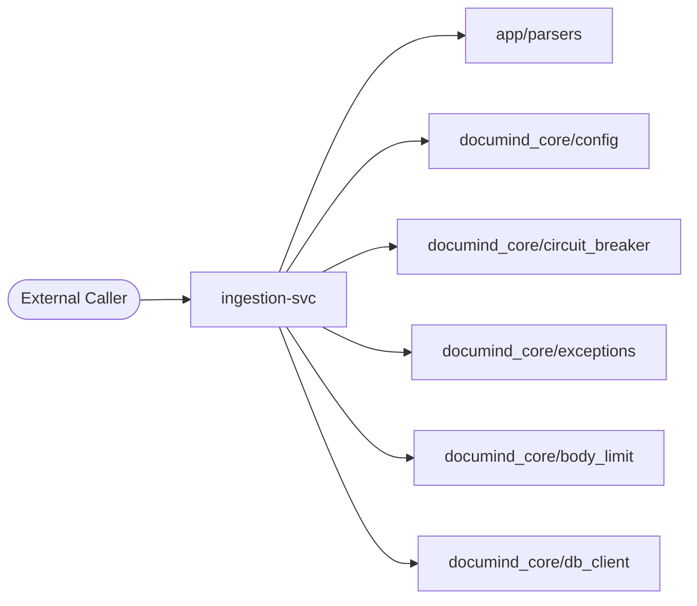

### Level 2 — Container

_What external dependencies does this folder talk to?_

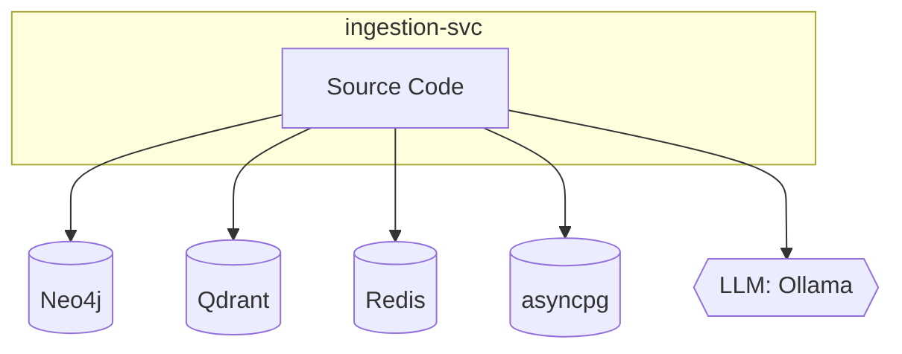

### Level 3 — Component

_Internal files grouped by inferred role._

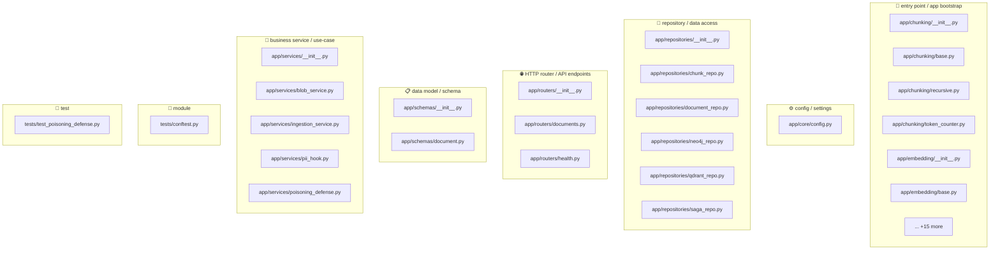

### Level 4 — Code (top hotspots)

_Longest functions — these are the most likely refactor candidates._

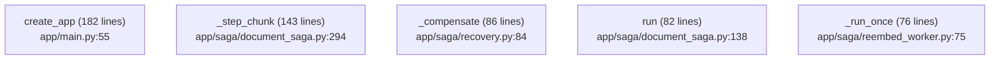


## 4. Code Sequence — How Files Link to Each Other

**Import graph for files in this folder.** Reading order: start at any entry-point file (look for `🚀 entry point` role in the inventory above), then follow the arrows.

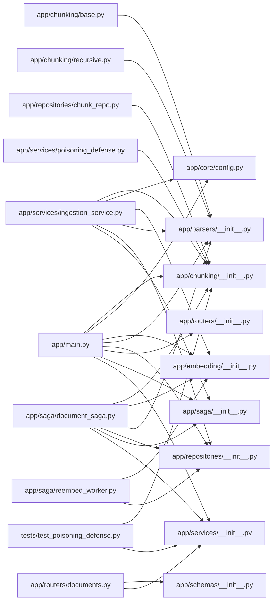

### Edge list

| From file | To file | Import-count |
|---|---|---|
| `app/main.py` | `app/saga/__init__.py` | 2 |
| `app/saga/document_saga.py` | `app/repositories/__init__.py` | 2 |
| `app/saga/document_saga.py` | `app/services/__init__.py` | 2 |
| `app/chunking/base.py` | `app/parsers/__init__.py` | 1 |
| `app/chunking/recursive.py` | `app/parsers/__init__.py` | 1 |
| `app/main.py` | `app/chunking/__init__.py` | 1 |
| `app/main.py` | `app/core/config.py` | 1 |
| `app/main.py` | `app/embedding/__init__.py` | 1 |
| `app/main.py` | `app/parsers/__init__.py` | 1 |
| `app/main.py` | `app/repositories/__init__.py` | 1 |
| `app/main.py` | `app/routers/__init__.py` | 1 |
| `app/main.py` | `app/services/__init__.py` | 1 |
| `app/repositories/chunk_repo.py` | `app/chunking/__init__.py` | 1 |
| `app/routers/documents.py` | `app/schemas/__init__.py` | 1 |
| `app/routers/documents.py` | `app/services/__init__.py` | 1 |
| `app/saga/document_saga.py` | `app/chunking/__init__.py` | 1 |
| `app/saga/document_saga.py` | `app/embedding/__init__.py` | 1 |
| `app/saga/document_saga.py` | `app/parsers/__init__.py` | 1 |
| `app/saga/document_saga.py` | `app/saga/__init__.py` | 1 |
| `app/saga/reembed_worker.py` | `app/embedding/__init__.py` | 1 |
| `app/saga/reembed_worker.py` | `app/repositories/__init__.py` | 1 |
| `app/services/ingestion_service.py` | `app/chunking/__init__.py` | 1 |
| `app/services/ingestion_service.py` | `app/core/config.py` | 1 |
| `app/services/ingestion_service.py` | `app/embedding/__init__.py` | 1 |
| `app/services/ingestion_service.py` | `app/parsers/__init__.py` | 1 |
| `app/services/ingestion_service.py` | `app/repositories/__init__.py` | 1 |
| `app/services/ingestion_service.py` | `app/saga/__init__.py` | 1 |
| `app/services/poisoning_defense.py` | `app/chunking/__init__.py` | 1 |
| `tests/test_poisoning_defense.py` | `app/chunking/__init__.py` | 1 |
| `tests/test_poisoning_defense.py` | `app/services/__init__.py` | 1 |


## 5. Request Flowchart

Generic request lifecycle for this folder. Branches that don't apply are auto-removed based on detected dependencies (DB / cache / LLM).

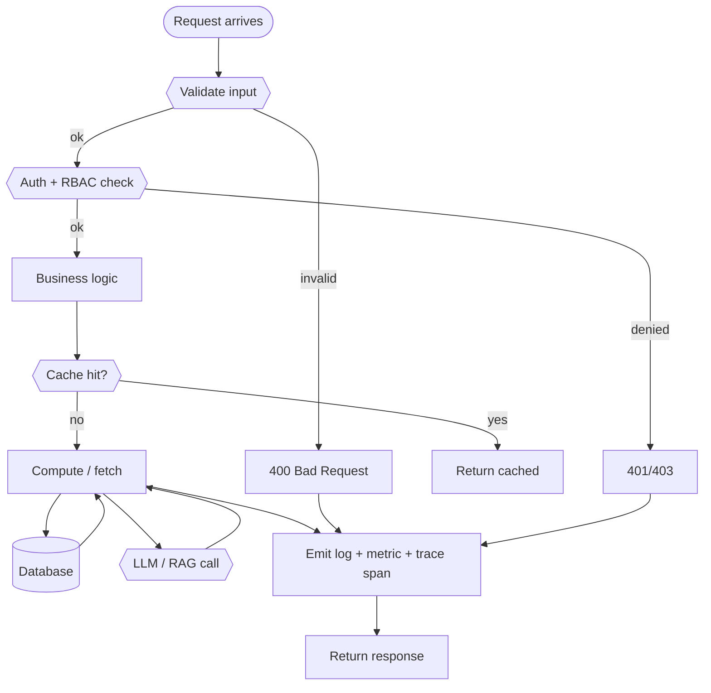


## 6. API Endpoints — Input / Process / Output

**Detected endpoints:** 7

| Method | Route | Defined in | Input (schema) | Process (summary) | Output (schema) |
|---|---|---|---|---|---|
| `GET` | `/health` | `app/routers/health.py:11` | _TBD_ | _TBD_ | _TBD_ |
| `GET` | `/healthz` | `app/routers/health.py:17` | _TBD_ | _TBD_ | _TBD_ |
| `GET` | `/health/ready` | `app/routers/health.py:23` | _TBD_ | _TBD_ | _TBD_ |
| `POST` | `/upload` | `app/routers/documents.py:32` | _TBD_ | _TBD_ | _TBD_ |
| `GET` | `/{document_id}` | `app/routers/documents.py:82` | _TBD_ | _TBD_ | _TBD_ |
| `GET` | `/{document_id}/chunks` | `app/routers/documents.py:93` | _TBD_ | _TBD_ | _TBD_ |
| `DELETE` | `/{document_id}` | `app/routers/documents.py:104` | _TBD_ | _TBD_ | _TBD_ |

_Reviewer fills the last three columns from the Pydantic models in the handler. Auto-extraction of Pydantic schemas is on the roadmap._


## 7. Sequence Diagrams per Endpoint

### Generic flow (all endpoints)

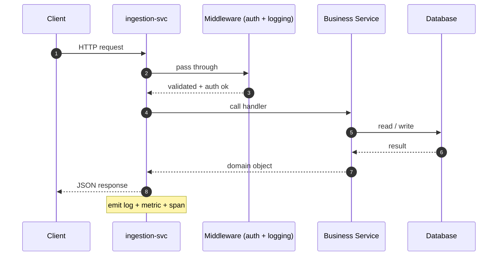

### Per-endpoint sequence stubs (top 5)

### `GET /health` (app/routers/health.py:11)

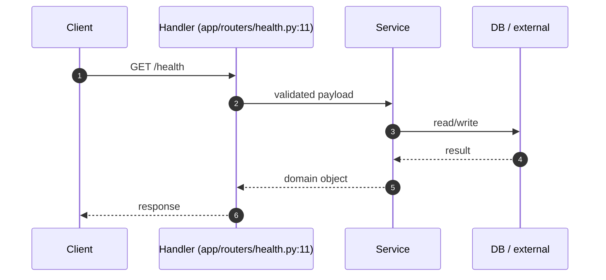

### `GET /healthz` (app/routers/health.py:17)

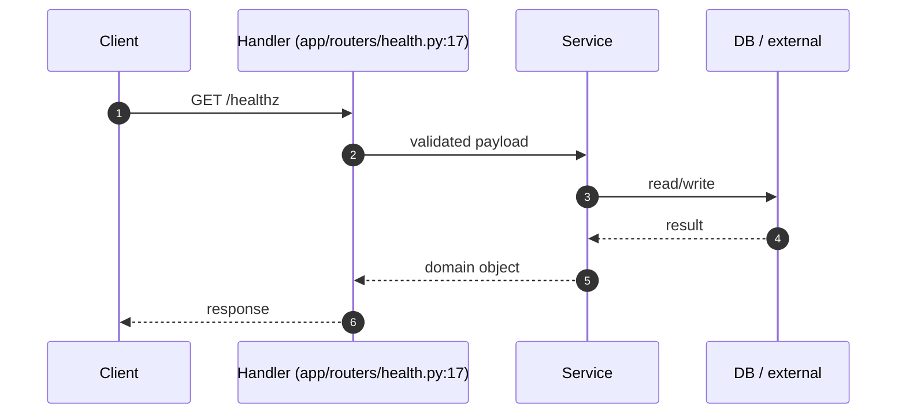

### `GET /health/ready` (app/routers/health.py:23)

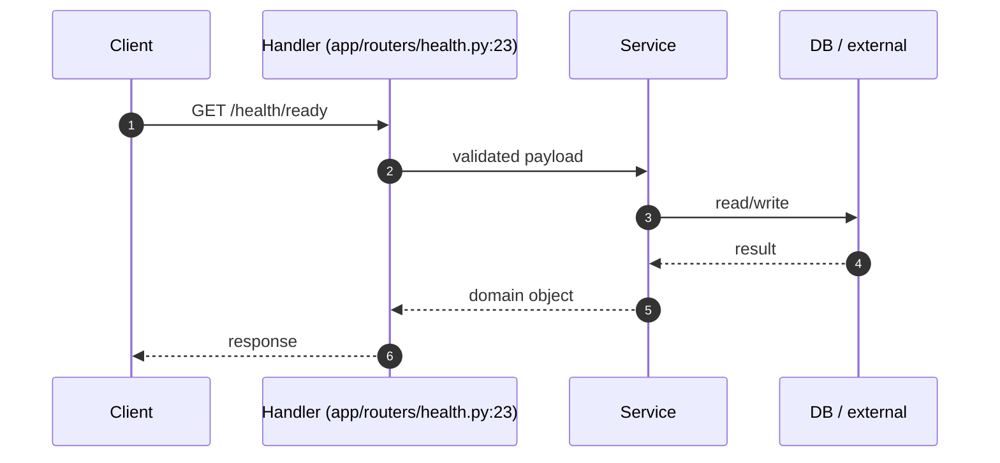

### `POST /upload` (app/routers/documents.py:32)


### `GET /{document_id}` (app/routers/documents.py:82)

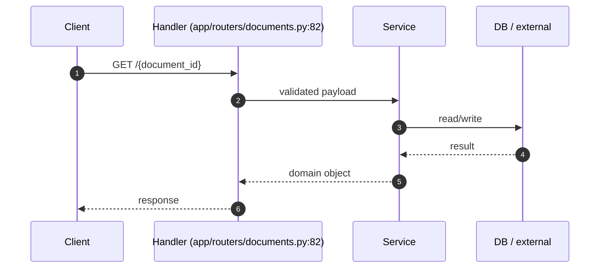

_(+2 more endpoints — diagrams omitted for brevity.)_


## 8. Database Layer

**DB / storage libraries:** Neo4j, Qdrant, Redis, asyncpg

**Total DB call sites:** 42

| Pattern | Count |
|---|---|
| `execute` | 18 |
| `fetch/fetchall/fetchrow` | 16 |
| `ORM CRUD` | 8 |

### Query Optimization checklist

| Check | Status (✓/✗/⚠) | Notes |
|---|---|---|
| Indexes on every WHERE / ORDER BY column | — | EXPLAIN ANALYZE hot paths |
| Full table scans avoided | — | — |
| Batch operations used (not N writes in a loop) | — | — |
| Parameterized queries (NEVER f-string SQL) | — | — |

### Transactions (ACID)

| Check | Status (✓/✗/⚠) | Notes |
|---|---|---|
| Transaction boundaries narrow (no HTTP / LLM inside) | — | — |
| Rollback on exception | — | — |
| Isolation level documented (READ COMMITTED / SERIALIZABLE) | — | — |
| Deadlock prevention strategy | — | — |

### N+1 Query Findings (reviewer to fill)

| Endpoint / Function | Suspect Loop | Est. Queries / Request | Fix |
|---|---|---|---|
| — | — | — | — |


## 9. Code Quality + Complexity

### Readability

| Check | Status (✓/✗/⚠) | Notes |
|---|---|---|
| Clear variable / function / class names | — | — |
| No misleading naming (no `tmp` / `xyz` / `foo`) | — | — |
| Small focused functions (≤ 50 lines) | — | 5 > 50 lines (see Section 0) |
| Avoid deeply nested conditions (≤ 4 levels) | — | — |

### Clean code

| Check | Status (✓/✗/⚠) | Notes |
|---|---|---|
| No dead / commented-out code | — | — |
| No `print()` — use logger | — | — |
| No hardcoded values | — | smell count: 0 |
| Constants extracted to a settings module | — | — |

### Complexity

| Check | Status (✓/✗/⚠) | Notes |
|---|---|---|
| Long methods broken down | — | — |
| No overengineering (premature abstractions) | — | — |
| Cyclomatic complexity ≤ 15 per function | — | run `ruff complexity` or `radon` |


## 10. Security Review

### Authentication & Authorization

| Check | Status (✓/✗/⚠) | Notes |
|---|---|---|
| Authentication implemented correctly | — | Bearer / JWT / session |
| Authorization (RBAC / ABAC) checks | — | no client-side trust |
| Tokens validated server-side every request | — | rotate, expire, revoke |

### OWASP Top 10

| Check | Status (✓/✗/⚠) | Notes |
|---|---|---|
| Request validation present | — | sanitization: Manual escape, Pydantic BaseModel |
| SQL injection prevention | — | DB libs: Neo4j, Qdrant, Redis, asyncpg — parameterized queries only |
| XSS / CSRF prevention | — | output encoding / CSP / SameSite |
| Path traversal prevention | — | no user input concatenated to file paths |
| Prompt injection prevention | — | Rebuff / output filter |

### Secret Management

| Check | Status (✓/✗/⚠) | Notes |
|---|---|---|
| No secrets in code | — | smell count: 0 password literals, 0 api key literals |
| Env vars / Vault used | — | Pydantic BaseSettings or env reader |
| Secret rotation strategy | — | documented in runbook |

### Sensitive Data

| Check | Status (✓/✗/⚠) | Notes |
|---|---|---|
| PII masked in logs | — | structured logger with field redaction |
| Encryption in transit (TLS) | — | — |
| Encryption at rest (DB / object store) | — | — |
| GDPR — retention + right-to-be-forgotten | — | — |


## 11. Performance Review

### Memory

| Check | Status (✓/✗/⚠) | Notes |
|---|---|---|
| Large object retention avoided | — | — |
| Streaming for large files / data | — | — |
| Caches bounded (LRU / TTL) | — | caching: in-memory @lru_cache, redis |

### Concurrency

| Check | Status (✓/✗/⚠) | Notes |
|---|---|---|
| Thread safety validated | — | primitives: asyncio (async/await) |
| Race conditions prevented | — | — |
| Deadlocks avoided (lock ordering) | — | — |
| Parallel processing where beneficial | — | 71 async fns |

### Latency

| Check | Status (✓/✗/⚠) | Notes |
|---|---|---|
| External API calls batched / cached | — | — |
| Timeouts on every external call | — | — |
| No blocking I/O inside async functions | — | — |


## 12. Reliability & Observability

### Failure Handling

| Check | Status (✓/✗/⚠) | Notes |
|---|---|---|
| Retry (bounded + exp backoff + jitter) | — | — |
| Circuit breaker around external deps | — | — |
| Graceful degradation | — | — |

### Timeout Handling

| Check | Status (✓/✗/⚠) | Notes |
|---|---|---|
| Timeout on every external call (HTTP / DB / subprocess) | — | — |
| No infinite waits | — | — |

### Observability

| Check | Status (✓/✗/⚠) | Notes |
|---|---|---|
| Structured (JSON) logging | — | correlation_id + tenant_id + request_id |
| Metrics (RED: rate / errors / duration) | — | — |
| Tracing (OpenTelemetry → Jaeger / Tempo) | — | — |
| Baggage propagation across services | — | — |


## 13. Test Cases

**Test files detected:** 1
**Test functions parsed:** 7

| Test name | Location | Purpose (from docstring) |
|---|---|---|
| `test_allows_clean_chunk` | `tests/test_poisoning_defense.py:18` | _(no docstring)_ |
| `test_rejects_injection_chunk` | `tests/test_poisoning_defense.py:25` | _(no docstring)_ |
| `test_redacts_pii_chunk` | `tests/test_poisoning_defense.py:33` | _(no docstring)_ |
| `test_batch_filters_rejected_and_flags_redacted` | `tests/test_poisoning_defense.py:41` | _(no docstring)_ |
| `test_does_not_reject_legitimate_technical_use_of_override` | `tests/test_poisoning_defense.py:59` | _(no docstring)_ |
| `test_does_not_reject_documentation_referencing_previous_section` | `tests/test_poisoning_defense.py:68` | _(no docstring)_ |
| `test_does_not_reject_forget_as_verb_in_prose` | `tests/test_poisoning_defense.py:76` | _(no docstring)_ |

### Coverage matrix (reviewer to fill)

| Metric | Value | Min |
|---|---|---|
| Statement coverage | _TBD_ % | 80% |
| Branch coverage | _TBD_ % | 70% |
| Critical-path coverage | _TBD_ % | 100% |
| Negative-test coverage | _TBD_ % | 80% |


## 14. Logging & Monitoring

### Logging

| Check | Status (✓/✗/⚠) | Notes |
|---|---|---|
| Structured (JSON) logs | — | — |
| Correlation ID present | — | — |
| No PII / secrets in log lines | — | — |
| No excessive logging (no logs in hot loops) | — | — |

### Monitoring

| Check | Status (✓/✗/⚠) | Notes |
|---|---|---|
| Alerts defined (SLO-burn aware) | — | — |
| Dashboards exist (Grafana) | — | — |
| On-call playbook references | — | — |


## 15. LLM / GenAI / RAG

**Detected AI deps:** Ollama

### Prompt Safety

| Check | Status (✓/✗/⚠) | Notes |
|---|---|---|
| Prompt injection handling (input filter) | — | — |
| Output sanitization | — | — |
| Prompt versioning in registry | — | — |
| Toxicity / bias filtering | — | — |

### RAG Quality

| Check | Status (✓/✗/⚠) | Notes |
|---|---|---|
| Chunking strategy validated (size + overlap) | — | — |
| Embedding model versioned (re-embed on bump) | — | — |
| Vector DB query optimized (recall@k measured) | — | — |
| Metadata filtering exists (per-tenant) | — | — |

### Cost

| Check | Status (✓/✗/⚠) | Notes |
|---|---|---|
| Model fallback strategy defined | — | — |
| Token usage minimized (cache / truncation) | — | — |
| Per-tenant cost ceiling enforced | — | — |

### Explainability / Responsible AI

| Check | Status (✓/✗/⚠) | Notes |
|---|---|---|
| Citation / source grounding (every claim cited) | — | — |
| Confidence scoring (Ragas / DeepEval) | — | — |
| Decision audit row per prediction (§48) | — | — |
| Fairness / bias checks | — | — |


## 16. SOLID + Microservice Principles

### SOLID

| Check | Status (✓/✗/⚠) | Notes |
|---|---|---|
| S — Single Responsibility (one reason to change per class) | — | — |
| O — Open/Closed (extend via composition, not modification) | — | — |
| L — Liskov Substitution (subclasses honor contracts) | — | — |
| I — Interface Segregation (no fat interfaces) | — | — |
| D — Dependency Inversion (depend on abstractions) | — | — |

### Microservice

| Check | Status (✓/✗/⚠) | Notes |
|---|---|---|
| Single business capability | — | — |
| Bounded context (no domain bleed) | — | — |
| Independent deploy (no coupled releases) | — | — |
| Resilience patterns (CB / retry / bulkhead) | — | — |


## 17. Integration with Other Folders

### Internal — other folders in this repo

| Folder / Module | Import-count | Purpose |
|---|---|---|
| `documind_core/exceptions` | 8 | _reviewer-described_ |
| `documind_core/db_client` | 8 | _reviewer-described_ |
| `app/chunking` | 6 | _reviewer-described_ |
| `app/parsers` | 5 | _reviewer-described_ |
| `app/repositories` | 5 | _reviewer-described_ |
| `app/services` | 5 | _reviewer-described_ |
| `app/embedding` | 4 | _reviewer-described_ |
| `app/saga` | 4 | _reviewer-described_ |
| `documind_core/config` | 2 | _reviewer-described_ |
| `documind_core/kafka_client` | 2 | _reviewer-described_ |
| `app/core` | 2 | _reviewer-described_ |
| `documind_core/circuit_breaker` | 1 | _reviewer-described_ |
| `documind_core/body_limit` | 1 | _reviewer-described_ |
| `documind_core/idempotency` | 1 | _reviewer-described_ |
| `documind_core/idempotency_middleware` | 1 | _reviewer-described_ |
| `documind_core/logging_config` | 1 | _reviewer-described_ |
| `documind_core/middleware` | 1 | _reviewer-described_ |
| `documind_core/observability` | 1 | _reviewer-described_ |
| `documind_core/rate_limiter` | 1 | _reviewer-described_ |
| `app/routers` | 1 | _reviewer-described_ |
| `app/schemas` | 1 | _reviewer-described_ |
| `documind_core/schemas` | 1 | _reviewer-described_ |
| `documind_core/ai_governance` | 1 | _reviewer-described_ |

### External — third-party packages

| Package | Import-count |
|---|---|
| `base` | 11 |
| `fastapi` | 5 |
| `html_parser` | 3 |
| `token_counter` | 2 |
| `docx_parser` | 2 |
| `markdown_parser` | 2 |
| `pdf_parser` | 2 |
| `text_parser` | 2 |
| `qdrant_client` | 2 |
| `best_config_loader` | 2 |
| `blob_service` | 2 |
| `minio` | 2 |
| `recursive` | 1 |
| `tiktoken` | 1 |
| `ollama_embedder` | 1 |
| `httpx` | 1 |
| `redis` | 1 |
| `registry` | 1 |
| `docx` | 1 |
| `bs4` | 1 |


## 18. Debugging Guide

### Step-by-step when something breaks

```
1. Tail logs:        tail -50 /tmp/ingestion-svc.log   (if host-side)
                     docker logs documind-ingestion-svc --tail=50   (if container)
2. Health probe:     curl http://localhost:<PORT>/health
3. Fleet probe:      python3 scripts/advanced_healthcheck.py --layer app
4. Trace:            Open Jaeger → search request_id → see span tree
5. Metrics:          Open Grafana → service dashboard → look for spike
6. Drill:            ls mcp/tests/drill_*ingestion-svc*.py and run
```

### Common failure modes

| Symptom | Likely cause | Fix |
|---|---|---|
| 502 / connection refused | service down | check `circuitrag-status.sh` |
| Slow p95 latency | DB N+1 or LLM throttle | Section 8 + Section 15 |
| 5xx spike | downstream dep down | check `/health/upstreams` |
| Memory growth | unbounded cache or closure leak | Section 11 |
| Wrong-tenant data | RLS bypass | tenant isolation drill |


## 19. Production Gates (hard pass/fail)

| Gate | Target | Status | Evidence |
|---|---|---|---|
| Code coverage ≥ 80% | statements + branches | — | — |
| Naming convention enforced | ruff / eslint | — | — |
| Zero critical CVEs | Trivy / Bandit | — | — |
| No hardcoded secrets | gitleaks | — | — |
| No memory leaks | bounded caches | — | smells: 0 |
| No N+1 queries | hot paths reviewed | — | 42 DB call sites |
| All APIs validated | Pydantic / Zod | — | sanitization: Manual escape, Pydantic BaseModel |
| Duplicate logic eliminated | DRY check | — | — |
| Structured logging with correlation_id | — | — | — |
| Distributed tracing wired | OpenTelemetry | — | — |
| For AI: prompt injection tested | Rebuff / Garak | — | AI deps present |
| For AI: hallucination scoring ≥ 0.85 | Ragas faithfulness | — | n/a |


## 20. Final Production Readiness Score

| Area | Score (/10) |
|---|---|
| Architecture | — |
| Security | — |
| Performance | — |
| Reliability | — |
| Observability | — |
| Testing | — |
| Scalability | — |
| AI Safety | — |
| DevOps | — |
| Maintainability | — |
| **Total** | **— / 100** |

### Decision

- [ ] **GO** — Production-ready (≥80, no failed gates)
- [ ] **CONDITIONAL GO** — Ship with documented follow-ups (≥60)
- [ ] **NO-GO** — Block release (any critical-red gate, or <60)

### Critical blockers

1. _TBD_

### Follow-ups (post-ship)

| ID | Description | Owner | Due |
|---|---|---|---|
| — | — | — | — |

### Sign-off

| Role | Name | Date | Signature |
|---|---|---|---|
| Tech Lead | — | — | — |
| Security | — | — | — |
| SRE | — | — | — |

---

_Generated by `scripts/generate_folder_report.py`. Re-run after major folder changes:_
_`python3 scripts/generate_folder_report.py --folder <this-folder> --force`_
