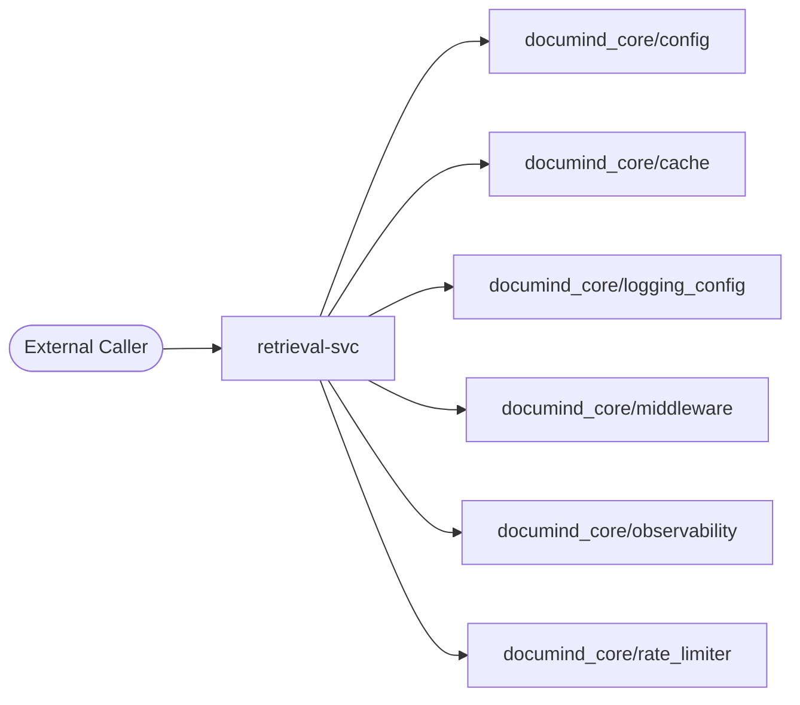
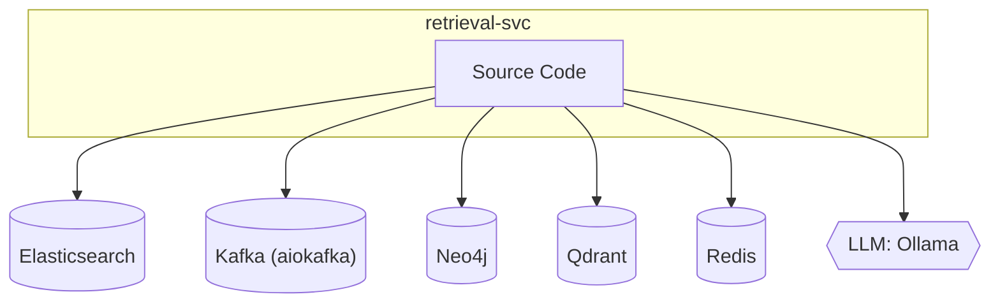
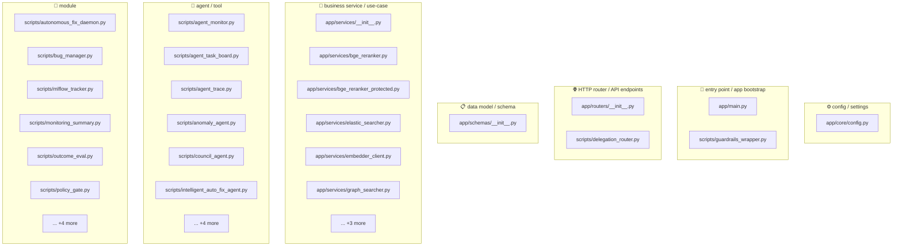
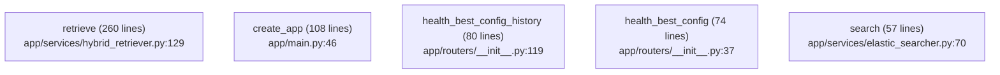
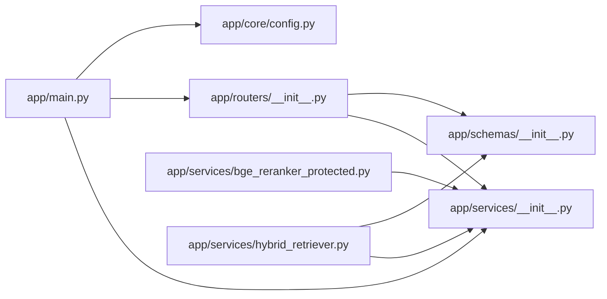
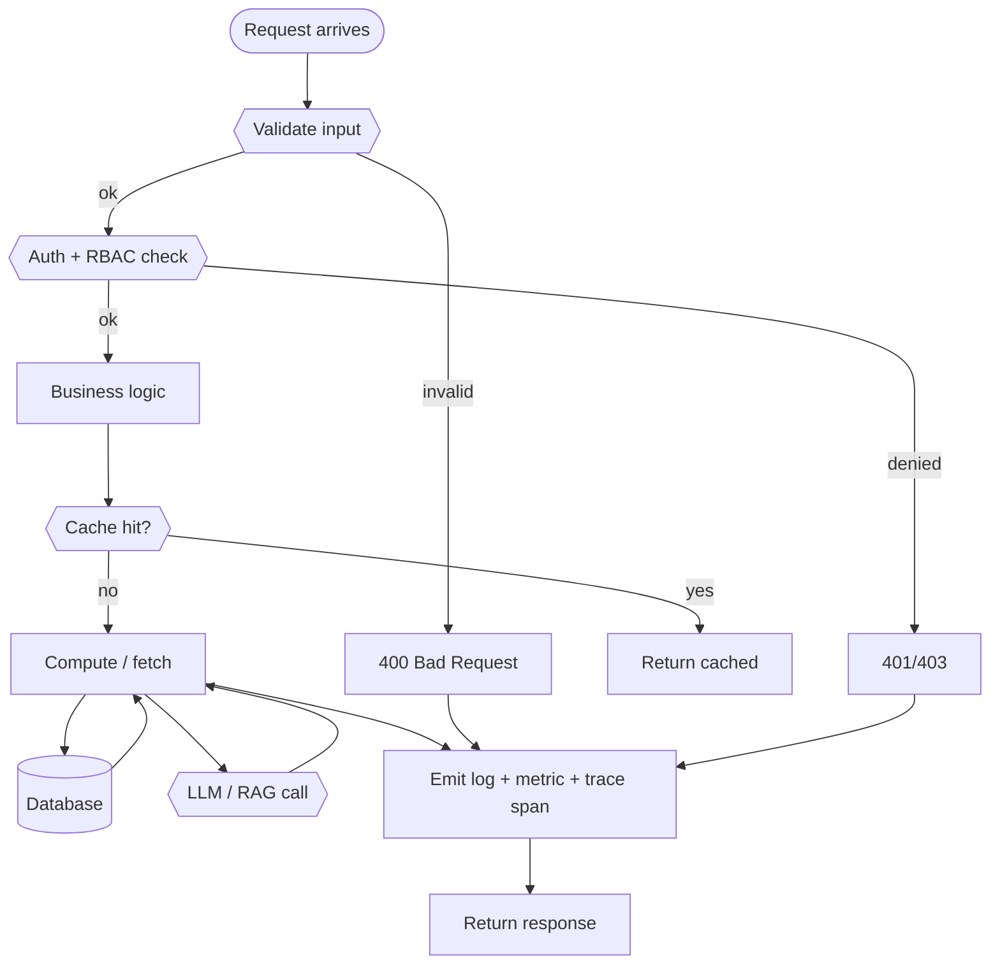
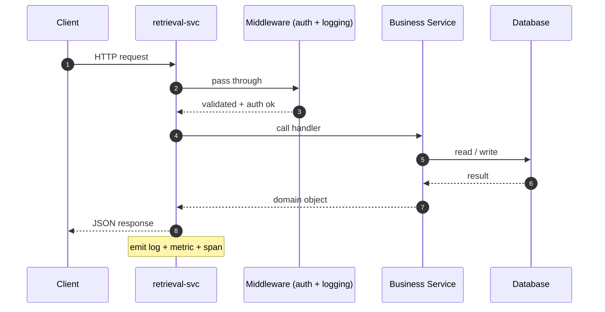
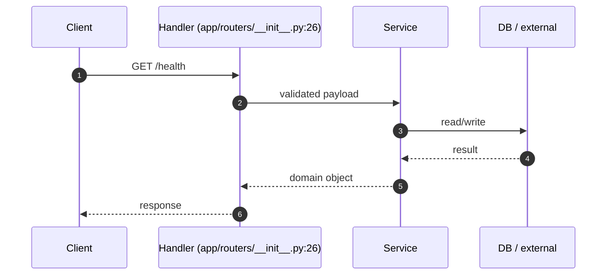
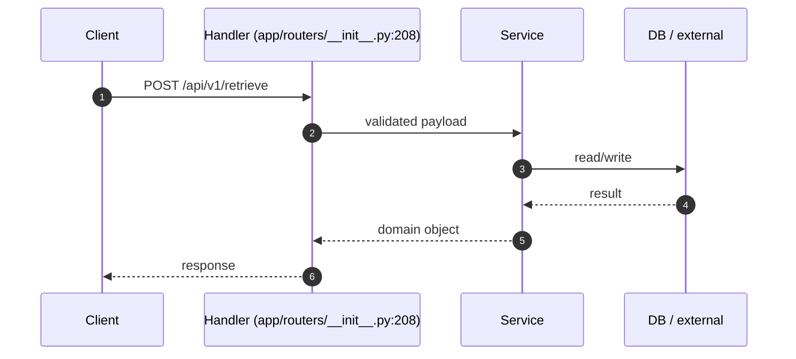

# 📦 `retrieval-svc` — Advanced README

🧩 **Service**  ·  **Path:** `services/retrieval-svc`  ·  **Generated:** 2026-05-16 20:03 UTC

> Retrieval service FastAPI application.

This README is **auto-generated** by [`scripts/generate_folder_report.py`](../../scripts/generate_folder_report.py). It explains what this folder does, every file inside it, how the files link to each other, every API endpoint, every database call, every test case, and the production controls (security / reliability / performance / observability). Re-run after major changes.

---

## 🔎 Section 0 — Auto-Detected Facts

| Metric | Value |
|---|---|
| Folder | `services/retrieval-svc` |
| Total files | 137 |
| Python files | 67 |
| TypeScript/JS files | 0 |
| Go files | 0 |
| Shell scripts | 32 |
| Lines of code | 3,944 |
| Python classes | 14 |
| Python functions | 73 |
| Async functions | 20 |
| Total API endpoints | 2 |
| Total DB call sites | 7 |
| DB / Storage libs | Elasticsearch, Kafka (aiokafka), Neo4j, Qdrant, Redis |
| Concurrency primitives | asyncio (async/await) |
| Caching primitives | redis |
| Input validation | Pydantic BaseModel |
| AI / LLM deps | Ollama |
| Test files | 2885 |
| Detected test cases | 0 |
| Tests dir present | ✅ |
| Dockerfile | ✅ |
| pyproject.toml | ❌ |
| go.mod | ❌ |
| package.json | ❌ |
| Top git contributors | `30	PraveenAsthana123`, `4	Praveen` |

#### Longest functions (top 5)

| Location | Name | Lines |
|---|---|---|
| `app/services/hybrid_retriever.py:129` | `retrieve` | 260 |
| `app/main.py:46` | `create_app` | 108 |
| `app/routers/__init__.py:119` | `health_best_config_history` | 80 |
| `app/routers/__init__.py:37` | `health_best_config` | 74 |
| `app/services/elastic_searcher.py:70` | `search` | 57 |

#### Smells detected (grep heuristics — verify manually)

| Smell | Count |
|---|---|
| hardcoded localhost URL | 1 |


## 1. Purpose — Business + Technical

### Business problem this folder solves

> _Reviewer to fill: Retrieval service FastAPI application._

### Technical contract this folder exposes

> _Reviewer to fill: API surface, events emitted, data persisted, downstream consumers._

### Out-of-scope (what this folder does NOT do)

> _Reviewer to fill: explicit non-goals — prevents scope creep at review time._


## 2. File Inventory

Every Python file in this folder, with role / classes / functions / LOC / first docstring line. Full absolute paths listed below the table for easy `cat`-ability.

| Relative path | Role (inferred) | Classes | Functions | LOC | Summary |
|---|---|---|---|---|---|
| `app/core/config.py` | ⚙ config / settings | 1 | 0 | 20 | Retrieval-service configuration. |
| `app/main.py` | 🚀 entry point / app bootstrap | 0 | 1 | 157 | Retrieval service FastAPI application. |
| `app/routers/__init__.py` | 🌐 HTTP router / API endpoints | 0 | 5 | 254 | Retrieval HTTP routes. |
| `app/schemas/__init__.py` | 📋 data model / schema | 6 | 0 | 144 | Retrieval request/response schemas (Design Area 34 — Retrieval Schema). |
| `app/services/__init__.py` | 🧠 business service / use-case | 0 | 0 | 14 | _(no docstring)_ |
| `app/services/bge_reranker.py` | 🧠 business service / use-case | 1 | 3 | 127 | BGE cross-encoder reranker — Stage-1 adapter (per CLAUDE.md §56). |
| `app/services/bge_reranker_protected.py` | 🧠 business service / use-case | 0 | 5 | 187 | BGE reranker WITH circuit breaker — Stage-2 wiring. |
| `app/services/elastic_searcher.py` | 🧠 business service / use-case | 1 | 0 | 132 | Vectorless retrieval over Elasticsearch (BM25 keyword search). |
| `app/services/embedder_client.py` | 🧠 business service / use-case | 1 | 0 | 32 | Thin embedder for queries — reuses the same Ollama API as ingestion. |
| `app/services/graph_searcher.py` | 🧠 business service / use-case | 1 | 0 | 85 | Graph search over Neo4j (Design Area 48). |
| `app/services/hybrid_retriever.py` | 🧠 business service / use-case | 1 | 0 | 415 | Hybrid retriever (Design Areas 24 — Retrieval, 40 — Cache, 13 — Read Path). |
| `app/services/reranker.py` | 🧠 business service / use-case | 1 | 0 | 72 | Reciprocal Rank Fusion (RRF) reranker. |
| `app/services/vector_searcher.py` | 🧠 business service / use-case | 1 | 0 | 64 | Vector search over Qdrant (Design Area 47). |
| `scripts/agent_monitor.py` | 🤖 agent / tool | 0 | 4 | 60 | _(no docstring)_ |
| `scripts/agent_task_board.py` | 🤖 agent / tool | 0 | 0 | 3 | _(no docstring)_ |
| `scripts/agent_trace.py` | 🤖 agent / tool | 0 | 0 | 18 | _(no docstring)_ |
| `scripts/anomaly_agent.py` | 🤖 agent / tool | 0 | 0 | 21 | _(no docstring)_ |
| `scripts/autonomous_fix_daemon.py` | 📄 module | 0 | 0 | 2 | _(no docstring)_ |
| `scripts/bug_manager.py` | 📄 module | 0 | 1 | 35 | _(no docstring)_ |
| `scripts/council_agent.py` | 🤖 agent / tool | 0 | 6 | 103 | _(no docstring)_ |
| `scripts/delegation_router.py` | 🌐 HTTP router / API endpoints | 0 | 0 | 33 | _(no docstring)_ |
| `scripts/guardrails_wrapper.py` | 🚀 entry point / app bootstrap | 0 | 1 | 11 | _(no docstring)_ |
| `scripts/intelligent_auto_fix_agent.py` | 🤖 agent / tool | 0 | 6 | 117 | _(no docstring)_ |
| `scripts/mcp_agent_council_status.py` | 🤖 agent / tool | 0 | 0 | 20 | _(no docstring)_ |
| `scripts/mlflow_tracker.py` | 📄 module | 0 | 0 | 9 | _(no docstring)_ |
| `scripts/monitoring_summary.py` | 📄 module | 0 | 0 | 19 | _(no docstring)_ |
| `scripts/outcome_eval.py` | 📄 module | 0 | 2 | 16 | _(no docstring)_ |
| `scripts/policy_gate.py` | 📄 module | 0 | 0 | 21 | _(no docstring)_ |
| `scripts/python_auto_fix_agent.py` | 🤖 agent / tool | 0 | 8 | 150 | _(no docstring)_ |
| `scripts/rag_eval_agent.py` | 🤖 agent / tool | 0 | 1 | 4 | _(no docstring)_ |
| `scripts/regression_score.py` | 📄 module | 0 | 1 | 44 | _(no docstring)_ |
| `scripts/testing_agent.py` | 🤖 agent / tool | 0 | 2 | 55 | _(no docstring)_ |
| `scripts/tier_b_fallback.py` | 📄 module | 0 | 0 | 2 | _(no docstring)_ |
| `scripts/verifiability_framework.py` | 📄 module | 0 | 0 | 2 | _(no docstring)_ |
| `scripts/warm_council_pool.py` | 📄 module | 0 | 0 | 2 | _(no docstring)_ |

### Absolute paths (clickable)

- `/mnt/deepa/rag/services/retrieval-svc/app/core/config.py`
- `/mnt/deepa/rag/services/retrieval-svc/app/main.py`
- `/mnt/deepa/rag/services/retrieval-svc/app/routers/__init__.py`
- `/mnt/deepa/rag/services/retrieval-svc/app/schemas/__init__.py`
- `/mnt/deepa/rag/services/retrieval-svc/app/services/__init__.py`
- `/mnt/deepa/rag/services/retrieval-svc/app/services/bge_reranker.py`
- `/mnt/deepa/rag/services/retrieval-svc/app/services/bge_reranker_protected.py`
- `/mnt/deepa/rag/services/retrieval-svc/app/services/elastic_searcher.py`
- `/mnt/deepa/rag/services/retrieval-svc/app/services/embedder_client.py`
- `/mnt/deepa/rag/services/retrieval-svc/app/services/graph_searcher.py`
- `/mnt/deepa/rag/services/retrieval-svc/app/services/hybrid_retriever.py`
- `/mnt/deepa/rag/services/retrieval-svc/app/services/reranker.py`
- `/mnt/deepa/rag/services/retrieval-svc/app/services/vector_searcher.py`
- `/mnt/deepa/rag/services/retrieval-svc/scripts/agent_monitor.py`
- `/mnt/deepa/rag/services/retrieval-svc/scripts/agent_task_board.py`
- `/mnt/deepa/rag/services/retrieval-svc/scripts/agent_trace.py`
- `/mnt/deepa/rag/services/retrieval-svc/scripts/anomaly_agent.py`
- `/mnt/deepa/rag/services/retrieval-svc/scripts/autonomous_fix_daemon.py`
- `/mnt/deepa/rag/services/retrieval-svc/scripts/bug_manager.py`
- `/mnt/deepa/rag/services/retrieval-svc/scripts/council_agent.py`
- `/mnt/deepa/rag/services/retrieval-svc/scripts/delegation_router.py`
- `/mnt/deepa/rag/services/retrieval-svc/scripts/guardrails_wrapper.py`
- `/mnt/deepa/rag/services/retrieval-svc/scripts/intelligent_auto_fix_agent.py`
- `/mnt/deepa/rag/services/retrieval-svc/scripts/mcp_agent_council_status.py`
- `/mnt/deepa/rag/services/retrieval-svc/scripts/mlflow_tracker.py`
- `/mnt/deepa/rag/services/retrieval-svc/scripts/monitoring_summary.py`
- `/mnt/deepa/rag/services/retrieval-svc/scripts/outcome_eval.py`
- `/mnt/deepa/rag/services/retrieval-svc/scripts/policy_gate.py`
- `/mnt/deepa/rag/services/retrieval-svc/scripts/python_auto_fix_agent.py`
- `/mnt/deepa/rag/services/retrieval-svc/scripts/rag_eval_agent.py`
- `/mnt/deepa/rag/services/retrieval-svc/scripts/regression_score.py`
- `/mnt/deepa/rag/services/retrieval-svc/scripts/testing_agent.py`
- `/mnt/deepa/rag/services/retrieval-svc/scripts/tier_b_fallback.py`
- `/mnt/deepa/rag/services/retrieval-svc/scripts/verifiability_framework.py`
- `/mnt/deepa/rag/services/retrieval-svc/scripts/warm_council_pool.py`


## 3. C4 Model — Context / Container / Component / Code

### Level 1 — System Context

_Where does this folder sit in the broader system?_



### Level 2 — Container

_What external dependencies does this folder talk to?_



### Level 3 — Component

_Internal files grouped by inferred role._



### Level 4 — Code (top hotspots)

_Longest functions — these are the most likely refactor candidates._




## 4. Code Sequence — How Files Link to Each Other

**Import graph for files in this folder.** Reading order: start at any entry-point file (look for `🚀 entry point` role in the inventory above), then follow the arrows.



### Edge list

| From file | To file | Import-count |
|---|---|---|
| `app/services/hybrid_retriever.py` | `app/services/__init__.py` | 2 |
| `app/main.py` | `app/core/config.py` | 1 |
| `app/main.py` | `app/routers/__init__.py` | 1 |
| `app/main.py` | `app/services/__init__.py` | 1 |
| `app/routers/__init__.py` | `app/schemas/__init__.py` | 1 |
| `app/routers/__init__.py` | `app/services/__init__.py` | 1 |
| `app/services/bge_reranker_protected.py` | `app/services/__init__.py` | 1 |
| `app/services/hybrid_retriever.py` | `app/schemas/__init__.py` | 1 |


## 5. Request Flowchart

Generic request lifecycle for this folder. Branches that don't apply are auto-removed based on detected dependencies (DB / cache / LLM).




## 6. API Endpoints — Input / Process / Output

**Detected endpoints:** 2

| Method | Route | Defined in | Input (schema) | Process (summary) | Output (schema) |
|---|---|---|---|---|---|
| `GET` | `/health` | `app/routers/__init__.py:26` | _TBD_ | _TBD_ | _TBD_ |
| `POST` | `/api/v1/retrieve` | `app/routers/__init__.py:208` | _TBD_ | _TBD_ | _TBD_ |

_Reviewer fills the last three columns from the Pydantic models in the handler. Auto-extraction of Pydantic schemas is on the roadmap._


## 7. Sequence Diagrams per Endpoint

### Generic flow (all endpoints)



### Per-endpoint sequence stubs (top 5)

### `GET /health` (app/routers/__init__.py:26)



### `POST /api/v1/retrieve` (app/routers/__init__.py:208)




## 8. Database Layer

**DB / storage libraries:** Elasticsearch, Kafka (aiokafka), Neo4j, Qdrant, Redis

**Total DB call sites:** 7

| Pattern | Count |
|---|---|
| `ORM CRUD` | 7 |

### Query Optimization checklist

| Check | Status (✓/✗/⚠) | Notes |
|---|---|---|
| Indexes on every WHERE / ORDER BY column | — | EXPLAIN ANALYZE hot paths |
| Full table scans avoided | — | — |
| Batch operations used (not N writes in a loop) | — | — |
| Parameterized queries (NEVER f-string SQL) | — | — |

### Transactions (ACID)

| Check | Status (✓/✗/⚠) | Notes |
|---|---|---|
| Transaction boundaries narrow (no HTTP / LLM inside) | — | — |
| Rollback on exception | — | — |
| Isolation level documented (READ COMMITTED / SERIALIZABLE) | — | — |
| Deadlock prevention strategy | — | — |

### N+1 Query Findings (reviewer to fill)

| Endpoint / Function | Suspect Loop | Est. Queries / Request | Fix |
|---|---|---|---|
| — | — | — | — |


## 9. Code Quality + Complexity

### Readability

| Check | Status (✓/✗/⚠) | Notes |
|---|---|---|
| Clear variable / function / class names | — | — |
| No misleading naming (no `tmp` / `xyz` / `foo`) | — | — |
| Small focused functions (≤ 50 lines) | — | 5 > 50 lines (see Section 0) |
| Avoid deeply nested conditions (≤ 4 levels) | — | — |

### Clean code

| Check | Status (✓/✗/⚠) | Notes |
|---|---|---|
| No dead / commented-out code | — | — |
| No `print()` — use logger | — | — |
| No hardcoded values | — | smell count: 1 |
| Constants extracted to a settings module | — | — |

### Complexity

| Check | Status (✓/✗/⚠) | Notes |
|---|---|---|
| Long methods broken down | — | — |
| No overengineering (premature abstractions) | — | — |
| Cyclomatic complexity ≤ 15 per function | — | run `ruff complexity` or `radon` |


## 10. Security Review

### Authentication & Authorization

| Check | Status (✓/✗/⚠) | Notes |
|---|---|---|
| Authentication implemented correctly | — | Bearer / JWT / session |
| Authorization (RBAC / ABAC) checks | — | no client-side trust |
| Tokens validated server-side every request | — | rotate, expire, revoke |

### OWASP Top 10

| Check | Status (✓/✗/⚠) | Notes |
|---|---|---|
| Request validation present | — | sanitization: Pydantic BaseModel |
| SQL injection prevention | — | DB libs: Elasticsearch, Kafka (aiokafka), Neo4j, Qdrant, Redis — parameterized queries only |
| XSS / CSRF prevention | — | output encoding / CSP / SameSite |
| Path traversal prevention | — | no user input concatenated to file paths |
| Prompt injection prevention | — | Rebuff / output filter |

### Secret Management

| Check | Status (✓/✗/⚠) | Notes |
|---|---|---|
| No secrets in code | — | smell count: 0 password literals, 0 api key literals |
| Env vars / Vault used | — | Pydantic BaseSettings or env reader |
| Secret rotation strategy | — | documented in runbook |

### Sensitive Data

| Check | Status (✓/✗/⚠) | Notes |
|---|---|---|
| PII masked in logs | — | structured logger with field redaction |
| Encryption in transit (TLS) | — | — |
| Encryption at rest (DB / object store) | — | — |
| GDPR — retention + right-to-be-forgotten | — | — |


## 11. Performance Review

### Memory

| Check | Status (✓/✗/⚠) | Notes |
|---|---|---|
| Large object retention avoided | — | — |
| Streaming for large files / data | — | — |
| Caches bounded (LRU / TTL) | — | caching: redis |

### Concurrency

| Check | Status (✓/✗/⚠) | Notes |
|---|---|---|
| Thread safety validated | — | primitives: asyncio (async/await) |
| Race conditions prevented | — | — |
| Deadlocks avoided (lock ordering) | — | — |
| Parallel processing where beneficial | — | 20 async fns |

### Latency

| Check | Status (✓/✗/⚠) | Notes |
|---|---|---|
| External API calls batched / cached | — | — |
| Timeouts on every external call | — | — |
| No blocking I/O inside async functions | — | — |


## 12. Reliability & Observability

### Failure Handling

| Check | Status (✓/✗/⚠) | Notes |
|---|---|---|
| Retry (bounded + exp backoff + jitter) | — | — |
| Circuit breaker around external deps | — | — |
| Graceful degradation | — | — |

### Timeout Handling

| Check | Status (✓/✗/⚠) | Notes |
|---|---|---|
| Timeout on every external call (HTTP / DB / subprocess) | — | — |
| No infinite waits | — | — |

### Observability

| Check | Status (✓/✗/⚠) | Notes |
|---|---|---|
| Structured (JSON) logging | — | correlation_id + tenant_id + request_id |
| Metrics (RED: rate / errors / duration) | — | — |
| Tracing (OpenTelemetry → Jaeger / Tempo) | — | — |
| Baggage propagation across services | — | — |


## 13. Test Cases

**Test files detected:** 2885
_No `test_*` functions parsed via AST. Either tests live elsewhere or names don't match the `test_*` convention._


## 14. Logging & Monitoring

### Logging

| Check | Status (✓/✗/⚠) | Notes |
|---|---|---|
| Structured (JSON) logs | — | — |
| Correlation ID present | — | — |
| No PII / secrets in log lines | — | — |
| No excessive logging (no logs in hot loops) | — | — |

### Monitoring

| Check | Status (✓/✗/⚠) | Notes |
|---|---|---|
| Alerts defined (SLO-burn aware) | — | — |
| Dashboards exist (Grafana) | — | — |
| On-call playbook references | — | — |


## 15. LLM / GenAI / RAG

**Detected AI deps:** Ollama

### Prompt Safety

| Check | Status (✓/✗/⚠) | Notes |
|---|---|---|
| Prompt injection handling (input filter) | — | — |
| Output sanitization | — | — |
| Prompt versioning in registry | — | — |
| Toxicity / bias filtering | — | — |

### RAG Quality

| Check | Status (✓/✗/⚠) | Notes |
|---|---|---|
| Chunking strategy validated (size + overlap) | — | — |
| Embedding model versioned (re-embed on bump) | — | — |
| Vector DB query optimized (recall@k measured) | — | — |
| Metadata filtering exists (per-tenant) | — | — |

### Cost

| Check | Status (✓/✗/⚠) | Notes |
|---|---|---|
| Model fallback strategy defined | — | — |
| Token usage minimized (cache / truncation) | — | — |
| Per-tenant cost ceiling enforced | — | — |

### Explainability / Responsible AI

| Check | Status (✓/✗/⚠) | Notes |
|---|---|---|
| Citation / source grounding (every claim cited) | — | — |
| Confidence scoring (Ragas / DeepEval) | — | — |
| Decision audit row per prediction (§48) | — | — |
| Fairness / bias checks | — | — |


## 16. SOLID + Microservice Principles

### SOLID

| Check | Status (✓/✗/⚠) | Notes |
|---|---|---|
| S — Single Responsibility (one reason to change per class) | — | — |
| O — Open/Closed (extend via composition, not modification) | — | — |
| L — Liskov Substitution (subclasses honor contracts) | — | — |
| I — Interface Segregation (no fat interfaces) | — | — |
| D — Dependency Inversion (depend on abstractions) | — | — |

### Microservice

| Check | Status (✓/✗/⚠) | Notes |
|---|---|---|
| Single business capability | — | — |
| Bounded context (no domain bleed) | — | — |
| Independent deploy (no coupled releases) | — | — |
| Resilience patterns (CB / retry / bulkhead) | — | — |


## 17. Integration with Other Folders

### Internal — other folders in this repo

| Folder / Module | Import-count | Purpose |
|---|---|---|
| `app/services` | 5 | _reviewer-described_ |
| `documind_core/config` | 2 | _reviewer-described_ |
| `documind_core/cache` | 2 | _reviewer-described_ |
| `documind_core/exceptions` | 2 | _reviewer-described_ |
| `app/schemas` | 2 | _reviewer-described_ |
| `documind_core/circuit_breaker` | 2 | _reviewer-described_ |
| `documind_core/logging_config` | 1 | _reviewer-described_ |
| `documind_core/middleware` | 1 | _reviewer-described_ |
| `documind_core/observability` | 1 | _reviewer-described_ |
| `documind_core/rate_limiter` | 1 | _reviewer-described_ |
| `app/core` | 1 | _reviewer-described_ |
| `app/routers` | 1 | _reviewer-described_ |
| `documind_core/kafka_client` | 1 | _reviewer-described_ |
| `documind_core/schemas` | 1 | _reviewer-described_ |
| `documind_core/breakers` | 1 | _reviewer-described_ |

### External — third-party packages

| Package | Import-count |
|---|---|
| `fastapi` | 4 |
| `best_config_loader` | 3 |
| `embedder_client` | 2 |
| `graph_searcher` | 2 |
| `reranker` | 2 |
| `vector_searcher` | 2 |
| `FlagEmbedding` | 2 |
| `qdrant_client` | 2 |
| `redis` | 1 |
| `best_config_history` | 1 |
| `pydantic` | 1 |
| `hybrid_retriever` | 1 |
| `native_compute_wrapper` | 1 |
| `elasticsearch` | 1 |
| `httpx` | 1 |
| `neo4j` | 1 |
| `cache_fingerprint` | 1 |
| `hyde_adapter` | 1 |
| `guardrails` | 1 |
| `mlflow` | 1 |


## 18. Debugging Guide

### Step-by-step when something breaks

```
1. Tail logs:        tail -50 /tmp/retrieval-svc.log   (if host-side)
                     docker logs documind-retrieval-svc --tail=50   (if container)
2. Health probe:     curl http://localhost:<PORT>/health
3. Fleet probe:      python3 scripts/advanced_healthcheck.py --layer app
4. Trace:            Open Jaeger → search request_id → see span tree
5. Metrics:          Open Grafana → service dashboard → look for spike
6. Drill:            ls mcp/tests/drill_*retrieval-svc*.py and run
```

### Common failure modes

| Symptom | Likely cause | Fix |
|---|---|---|
| 502 / connection refused | service down | check `circuitrag-status.sh` |
| Slow p95 latency | DB N+1 or LLM throttle | Section 8 + Section 15 |
| 5xx spike | downstream dep down | check `/health/upstreams` |
| Memory growth | unbounded cache or closure leak | Section 11 |
| Wrong-tenant data | RLS bypass | tenant isolation drill |


## 19. Production Gates (hard pass/fail)

| Gate | Target | Status | Evidence |
|---|---|---|---|
| Code coverage ≥ 80% | statements + branches | — | — |
| Naming convention enforced | ruff / eslint | — | — |
| Zero critical CVEs | Trivy / Bandit | — | — |
| No hardcoded secrets | gitleaks | — | — |
| No memory leaks | bounded caches | — | smells: 1 |
| No N+1 queries | hot paths reviewed | — | 7 DB call sites |
| All APIs validated | Pydantic / Zod | — | sanitization: Pydantic BaseModel |
| Duplicate logic eliminated | DRY check | — | — |
| Structured logging with correlation_id | — | — | — |
| Distributed tracing wired | OpenTelemetry | — | — |
| For AI: prompt injection tested | Rebuff / Garak | — | AI deps present |
| For AI: hallucination scoring ≥ 0.85 | Ragas faithfulness | — | n/a |


## 20. Final Production Readiness Score

| Area | Score (/10) |
|---|---|
| Architecture | — |
| Security | — |
| Performance | — |
| Reliability | — |
| Observability | — |
| Testing | — |
| Scalability | — |
| AI Safety | — |
| DevOps | — |
| Maintainability | — |
| **Total** | **— / 100** |

### Decision

- [ ] **GO** — Production-ready (≥80, no failed gates)
- [ ] **CONDITIONAL GO** — Ship with documented follow-ups (≥60)
- [ ] **NO-GO** — Block release (any critical-red gate, or <60)

### Critical blockers

1. _TBD_

### Follow-ups (post-ship)

| ID | Description | Owner | Due |
|---|---|---|---|
| — | — | — | — |

### Sign-off

| Role | Name | Date | Signature |
|---|---|---|---|
| Tech Lead | — | — | — |
| Security | — | — | — |
| SRE | — | — | — |

---

_Generated by `scripts/generate_folder_report.py`. Re-run after major folder changes:_
_`python3 scripts/generate_folder_report.py --folder <this-folder> --force`_
