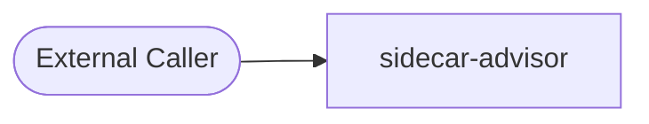
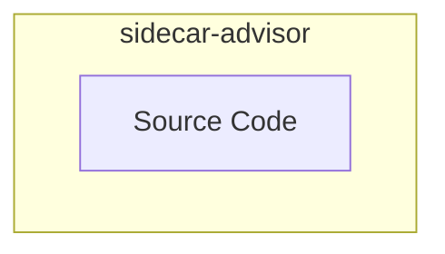
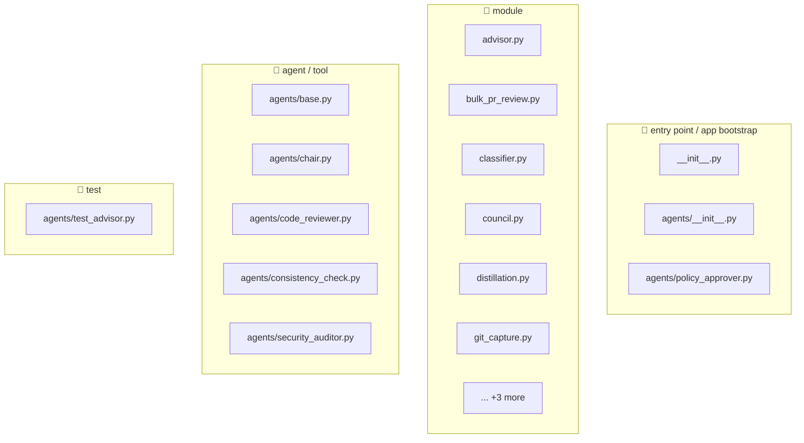
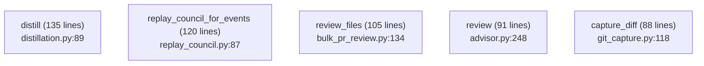
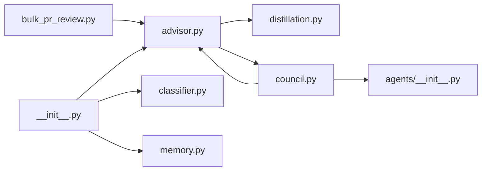
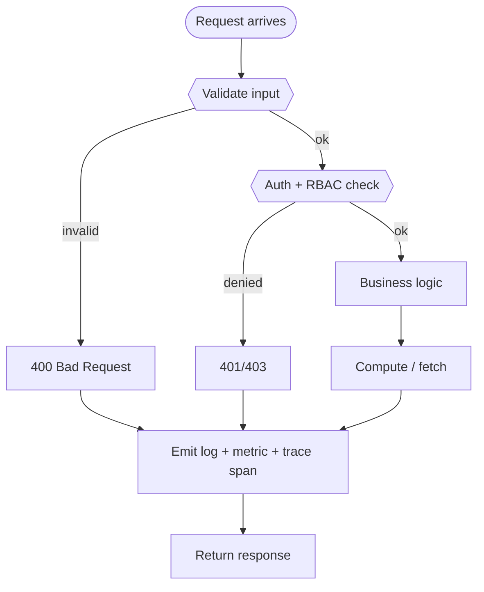

# 📦 `sidecar-advisor` — Advanced README

🧩 **Service**  ·  **Path:** `services/sidecar-advisor`  ·  **Generated:** 2026-05-16 20:03 UTC

> Sidecar Advisor — personal AI auditor for prompt + code activity.

This README is **auto-generated** by [`scripts/generate_folder_report.py`](../../scripts/generate_folder_report.py). It explains what this folder does, every file inside it, how the files link to each other, every API endpoint, every database call, every test case, and the production controls (security / reliability / performance / observability). Re-run after major changes.

---

## 🔎 Section 0 — Auto-Detected Facts

| Metric | Value |
|---|---|
| Folder | `services/sidecar-advisor` |
| Total files | 25 |
| Python files | 18 |
| TypeScript/JS files | 0 |
| Go files | 0 |
| Shell scripts | 0 |
| Lines of code | 2,685 |
| Python classes | 17 |
| Python functions | 69 |
| Async functions | 10 |
| Total API endpoints | 0 |
| Total DB call sites | 41 |
| DB / Storage libs | _(none)_ |
| Concurrency primitives | asyncio (async/await) |
| Caching primitives | _(none)_ |
| Input validation | _(NONE — flag risk)_ |
| AI / LLM deps | _(none)_ |
| Test files | 1 |
| Detected test cases | 0 |
| Tests dir present | ❌ — flag |
| Dockerfile | ✅ |
| pyproject.toml | ❌ |
| go.mod | ❌ |
| package.json | ❌ |
| Top git contributors | `24	PraveenAsthana123` |

#### Longest functions (top 5)

| Location | Name | Lines |
|---|---|---|
| `distillation.py:89` | `distill` | 135 |
| `replay_council.py:87` | `replay_council_for_events` | 120 |
| `bulk_pr_review.py:134` | `review_files` | 105 |
| `advisor.py:248` | `review` | 91 |
| `git_capture.py:118` | `capture_diff` | 88 |

#### Smells detected (grep heuristics — verify manually)

| Smell | Count |
|---|---|
| hardcoded localhost URL | 2 |


## 1. Purpose — Business + Technical

### Business problem this folder solves

> _Reviewer to fill: Sidecar Advisor — personal AI auditor for prompt + code activity._

### Technical contract this folder exposes

> _Reviewer to fill: API surface, events emitted, data persisted, downstream consumers._

### Out-of-scope (what this folder does NOT do)

> _Reviewer to fill: explicit non-goals — prevents scope creep at review time._


## 2. File Inventory

Every Python file in this folder, with role / classes / functions / LOC / first docstring line. Full absolute paths listed below the table for easy `cat`-ability.

| Relative path | Role (inferred) | Classes | Functions | LOC | Summary |
|---|---|---|---|---|---|
| `__init__.py` | 🚀 entry point / app bootstrap | 0 | 0 | 13 | Sidecar Advisor — personal AI auditor for prompt + code activity. |
| `advisor.py` | 📄 module | 2 | 0 | 431 | The advisor — calls a model picked by the policy and parses the |
| `agents/__init__.py` | 🚀 entry point / app bootstrap | 0 | 2 | 66 | Agent registry for the Sidecar Advisor council. |
| `agents/base.py` | 🤖 agent / tool | 1 | 0 | 52 | Base agent definition - one CoderAgent per role. |
| `agents/chair.py` | 🤖 agent / tool | 0 | 0 | 41 | Chair agent - the single advisor on the council. Synthesises |
| `agents/code_reviewer.py` | 🤖 agent / tool | 0 | 0 | 24 | Code Reviewer agent - one of three specialised authors on the |
| `agents/consistency_check.py` | 🤖 agent / tool | 0 | 0 | 28 | Consistency Check agent - the lone reviewer. Scores each draft |
| `agents/policy_approver.py` | 🚀 entry point / app bootstrap | 0 | 0 | 72 | Policy Approver agent - the loop watcher. |
| `agents/security_auditor.py` | 🤖 agent / tool | 0 | 0 | 27 | Security Auditor agent - reviews for hardcoded secrets, missing |
| `agents/test_advisor.py` | 🧪 test | 0 | 0 | 26 | Test Advisor agent - reviews for testability and coverage: |
| `bulk_pr_review.py` | 📄 module | 3 | 1 | 239 | Bulk PR review - run the Sidecar council across N files in one shot. |
| `classifier.py` | 📄 module | 1 | 1 | 103 | Rule-based event classifier. |
| `council.py` | 📄 module | 1 | 1 | 346 | PR-review council — composes AgentBoard with role-specialised authors. |
| `distillation.py` | 📄 module | 1 | 3 | 271 | Memory pattern distillation — turns rated events into reusable patterns. |
| `git_capture.py` | 📄 module | 1 | 6 | 285 | Capture git activity into Sidecar Advisor pr_review events. |
| `loop_watcher.py` | 📄 module | 4 | 1 | 265 | LoopWatcher - the live gate between iterations of the autonomous loop. |
| `memory.py` | 📄 module | 1 | 2 | 566 | SQLite-backed memory for the Sidecar Advisor. |
| `replay_council.py` | 📄 module | 2 | 2 | 207 | Batched replay of the Sidecar council against persisted events. |

### Absolute paths (clickable)

- `/mnt/deepa/rag/services/sidecar-advisor/__init__.py`
- `/mnt/deepa/rag/services/sidecar-advisor/advisor.py`
- `/mnt/deepa/rag/services/sidecar-advisor/agents/__init__.py`
- `/mnt/deepa/rag/services/sidecar-advisor/agents/base.py`
- `/mnt/deepa/rag/services/sidecar-advisor/agents/chair.py`
- `/mnt/deepa/rag/services/sidecar-advisor/agents/code_reviewer.py`
- `/mnt/deepa/rag/services/sidecar-advisor/agents/consistency_check.py`
- `/mnt/deepa/rag/services/sidecar-advisor/agents/policy_approver.py`
- `/mnt/deepa/rag/services/sidecar-advisor/agents/security_auditor.py`
- `/mnt/deepa/rag/services/sidecar-advisor/agents/test_advisor.py`
- `/mnt/deepa/rag/services/sidecar-advisor/bulk_pr_review.py`
- `/mnt/deepa/rag/services/sidecar-advisor/classifier.py`
- `/mnt/deepa/rag/services/sidecar-advisor/council.py`
- `/mnt/deepa/rag/services/sidecar-advisor/distillation.py`
- `/mnt/deepa/rag/services/sidecar-advisor/git_capture.py`
- `/mnt/deepa/rag/services/sidecar-advisor/loop_watcher.py`
- `/mnt/deepa/rag/services/sidecar-advisor/memory.py`
- `/mnt/deepa/rag/services/sidecar-advisor/replay_council.py`


## 3. C4 Model — Context / Container / Component / Code

### Level 1 — System Context

_Where does this folder sit in the broader system?_



### Level 2 — Container

_What external dependencies does this folder talk to?_



### Level 3 — Component

_Internal files grouped by inferred role._



### Level 4 — Code (top hotspots)

_Longest functions — these are the most likely refactor candidates._




## 4. Code Sequence — How Files Link to Each Other

**Import graph for files in this folder.** Reading order: start at any entry-point file (look for `🚀 entry point` role in the inventory above), then follow the arrows.



### Edge list

| From file | To file | Import-count |
|---|---|---|
| `council.py` | `agents/__init__.py` | 4 |
| `__init__.py` | `advisor.py` | 1 |
| `__init__.py` | `classifier.py` | 1 |
| `__init__.py` | `memory.py` | 1 |
| `advisor.py` | `council.py` | 1 |
| `advisor.py` | `distillation.py` | 1 |
| `bulk_pr_review.py` | `advisor.py` | 1 |
| `council.py` | `advisor.py` | 1 |


## 5. Request Flowchart

Generic request lifecycle for this folder. Branches that don't apply are auto-removed based on detected dependencies (DB / cache / LLM).




## 6. API Endpoints — Input / Process / Output

_No HTTP endpoints detected via `@app.*` / `@router.*` decorators._


## 7. Sequence Diagrams per Endpoint

_No endpoints detected; sequence-diagram template intentionally omitted._


## 8. Database Layer

**DB / storage libraries:** _(none)_

**Total DB call sites:** 41

| Pattern | Count |
|---|---|
| `execute` | 25 |
| `fetch/fetchall/fetchrow` | 13 |
| `MongoDB` | 3 |

### Query Optimization checklist

| Check | Status (✓/✗/⚠) | Notes |
|---|---|---|
| Indexes on every WHERE / ORDER BY column | — | EXPLAIN ANALYZE hot paths |
| Full table scans avoided | — | — |
| Batch operations used (not N writes in a loop) | — | — |
| Parameterized queries (NEVER f-string SQL) | — | — |

### Transactions (ACID)

| Check | Status (✓/✗/⚠) | Notes |
|---|---|---|
| Transaction boundaries narrow (no HTTP / LLM inside) | — | — |
| Rollback on exception | — | — |
| Isolation level documented (READ COMMITTED / SERIALIZABLE) | — | — |
| Deadlock prevention strategy | — | — |

### N+1 Query Findings (reviewer to fill)

| Endpoint / Function | Suspect Loop | Est. Queries / Request | Fix |
|---|---|---|---|
| — | — | — | — |


## 9. Code Quality + Complexity

### Readability

| Check | Status (✓/✗/⚠) | Notes |
|---|---|---|
| Clear variable / function / class names | — | — |
| No misleading naming (no `tmp` / `xyz` / `foo`) | — | — |
| Small focused functions (≤ 50 lines) | — | 5 > 50 lines (see Section 0) |
| Avoid deeply nested conditions (≤ 4 levels) | — | — |

### Clean code

| Check | Status (✓/✗/⚠) | Notes |
|---|---|---|
| No dead / commented-out code | — | — |
| No `print()` — use logger | — | — |
| No hardcoded values | — | smell count: 2 |
| Constants extracted to a settings module | — | — |

### Complexity

| Check | Status (✓/✗/⚠) | Notes |
|---|---|---|
| Long methods broken down | — | — |
| No overengineering (premature abstractions) | — | — |
| Cyclomatic complexity ≤ 15 per function | — | run `ruff complexity` or `radon` |


## 10. Security Review

### Authentication & Authorization

| Check | Status (✓/✗/⚠) | Notes |
|---|---|---|
| Authentication implemented correctly | — | Bearer / JWT / session |
| Authorization (RBAC / ABAC) checks | — | no client-side trust |
| Tokens validated server-side every request | — | rotate, expire, revoke |

### OWASP Top 10

| Check | Status (✓/✗/⚠) | Notes |
|---|---|---|
| Request validation present | — | sanitization: NONE |
| SQL injection prevention | — | DB libs: n/a — parameterized queries only |
| XSS / CSRF prevention | — | output encoding / CSP / SameSite |
| Path traversal prevention | — | no user input concatenated to file paths |
| Prompt injection prevention | — | n/a — no AI deps |

### Secret Management

| Check | Status (✓/✗/⚠) | Notes |
|---|---|---|
| No secrets in code | — | smell count: 0 password literals, 0 api key literals |
| Env vars / Vault used | — | Pydantic BaseSettings or env reader |
| Secret rotation strategy | — | documented in runbook |

### Sensitive Data

| Check | Status (✓/✗/⚠) | Notes |
|---|---|---|
| PII masked in logs | — | structured logger with field redaction |
| Encryption in transit (TLS) | — | — |
| Encryption at rest (DB / object store) | — | — |
| GDPR — retention + right-to-be-forgotten | — | — |


## 11. Performance Review

### Memory

| Check | Status (✓/✗/⚠) | Notes |
|---|---|---|
| Large object retention avoided | — | — |
| Streaming for large files / data | — | — |
| Caches bounded (LRU / TTL) | — | caching: none |

### Concurrency

| Check | Status (✓/✗/⚠) | Notes |
|---|---|---|
| Thread safety validated | — | primitives: asyncio (async/await) |
| Race conditions prevented | — | — |
| Deadlocks avoided (lock ordering) | — | — |
| Parallel processing where beneficial | — | 10 async fns |

### Latency

| Check | Status (✓/✗/⚠) | Notes |
|---|---|---|
| External API calls batched / cached | — | — |
| Timeouts on every external call | — | — |
| No blocking I/O inside async functions | — | — |


## 12. Reliability & Observability

### Failure Handling

| Check | Status (✓/✗/⚠) | Notes |
|---|---|---|
| Retry (bounded + exp backoff + jitter) | — | — |
| Circuit breaker around external deps | — | — |
| Graceful degradation | — | — |

### Timeout Handling

| Check | Status (✓/✗/⚠) | Notes |
|---|---|---|
| Timeout on every external call (HTTP / DB / subprocess) | — | — |
| No infinite waits | — | — |

### Observability

| Check | Status (✓/✗/⚠) | Notes |
|---|---|---|
| Structured (JSON) logging | — | correlation_id + tenant_id + request_id |
| Metrics (RED: rate / errors / duration) | — | — |
| Tracing (OpenTelemetry → Jaeger / Tempo) | — | — |
| Baggage propagation across services | — | — |


## 13. Test Cases

**Test files detected:** 1
_No `test_*` functions parsed via AST. Either tests live elsewhere or names don't match the `test_*` convention._


## 14. Logging & Monitoring

### Logging

| Check | Status (✓/✗/⚠) | Notes |
|---|---|---|
| Structured (JSON) logs | — | — |
| Correlation ID present | — | — |
| No PII / secrets in log lines | — | — |
| No excessive logging (no logs in hot loops) | — | — |

### Monitoring

| Check | Status (✓/✗/⚠) | Notes |
|---|---|---|
| Alerts defined (SLO-burn aware) | — | — |
| Dashboards exist (Grafana) | — | — |
| On-call playbook references | — | — |


## 15. LLM / GenAI / RAG

_No AI / LLM dependencies detected — section not applicable._


## 16. SOLID + Microservice Principles

### SOLID

| Check | Status (✓/✗/⚠) | Notes |
|---|---|---|
| S — Single Responsibility (one reason to change per class) | — | — |
| O — Open/Closed (extend via composition, not modification) | — | — |
| L — Liskov Substitution (subclasses honor contracts) | — | — |
| I — Interface Segregation (no fat interfaces) | — | — |
| D — Dependency Inversion (depend on abstractions) | — | — |

### Microservice

| Check | Status (✓/✗/⚠) | Notes |
|---|---|---|
| Single business capability | — | — |
| Bounded context (no domain bleed) | — | — |
| Independent deploy (no coupled releases) | — | — |
| Resilience patterns (CB / retry / bulkhead) | — | — |


## 17. Integration with Other Folders

### Internal — other folders in this repo

| Folder / Module | Import-count | Purpose |
|---|---|---|
| _(none)_ | — | — |

### External — third-party packages

| Package | Import-count |
|---|---|
| `base` | 7 |
| `importlib` | 5 |
| `agents` | 4 |
| `advisor` | 3 |
| `httpx` | 2 |
| `classifier` | 1 |
| `memory` | 1 |
| `distillation` | 1 |
| `council` | 1 |
| `chair` | 1 |
| `code_reviewer` | 1 |
| `consistency_check` | 1 |
| `policy_approver` | 1 |
| `security_auditor` | 1 |
| `test_advisor` | 1 |
| `sqlite3` | 1 |


## 18. Debugging Guide

### Step-by-step when something breaks

```
1. Tail logs:        tail -50 /tmp/sidecar-advisor.log   (if host-side)
                     docker logs documind-sidecar-advisor --tail=50   (if container)
2. Health probe:     curl http://localhost:<PORT>/health
3. Fleet probe:      python3 scripts/advanced_healthcheck.py --layer app
4. Trace:            Open Jaeger → search request_id → see span tree
5. Metrics:          Open Grafana → service dashboard → look for spike
6. Drill:            ls mcp/tests/drill_*sidecar-advisor*.py and run
```

### Common failure modes

| Symptom | Likely cause | Fix |
|---|---|---|
| 502 / connection refused | service down | check `circuitrag-status.sh` |
| Slow p95 latency | DB N+1 or LLM throttle | Section 8 + Section 15 |
| 5xx spike | downstream dep down | check `/health/upstreams` |
| Memory growth | unbounded cache or closure leak | Section 11 |
| Wrong-tenant data | RLS bypass | tenant isolation drill |


## 19. Production Gates (hard pass/fail)

| Gate | Target | Status | Evidence |
|---|---|---|---|
| Code coverage ≥ 80% | statements + branches | — | — |
| Naming convention enforced | ruff / eslint | — | — |
| Zero critical CVEs | Trivy / Bandit | — | — |
| No hardcoded secrets | gitleaks | — | — |
| No memory leaks | bounded caches | — | smells: 2 |
| No N+1 queries | hot paths reviewed | — | 41 DB call sites |
| All APIs validated | Pydantic / Zod | — | sanitization: NONE |
| Duplicate logic eliminated | DRY check | — | — |
| Structured logging with correlation_id | — | — | — |
| Distributed tracing wired | OpenTelemetry | — | — |
| For AI: prompt injection tested | Rebuff / Garak | — | n/a |
| For AI: hallucination scoring ≥ 0.85 | Ragas faithfulness | — | n/a |


## 20. Final Production Readiness Score

| Area | Score (/10) |
|---|---|
| Architecture | — |
| Security | — |
| Performance | — |
| Reliability | — |
| Observability | — |
| Testing | — |
| Scalability | — |
| AI Safety | — |
| DevOps | — |
| Maintainability | — |
| **Total** | **— / 100** |

### Decision

- [ ] **GO** — Production-ready (≥80, no failed gates)
- [ ] **CONDITIONAL GO** — Ship with documented follow-ups (≥60)
- [ ] **NO-GO** — Block release (any critical-red gate, or <60)

### Critical blockers

1. _TBD_

### Follow-ups (post-ship)

| ID | Description | Owner | Due |
|---|---|---|---|
| — | — | — | — |

### Sign-off

| Role | Name | Date | Signature |
|---|---|---|---|
| Tech Lead | — | — | — |
| Security | — | — | — |
| SRE | — | — | — |

---

_Generated by `scripts/generate_folder_report.py`. Re-run after major folder changes:_
_`python3 scripts/generate_folder_report.py --folder <this-folder> --force`_
